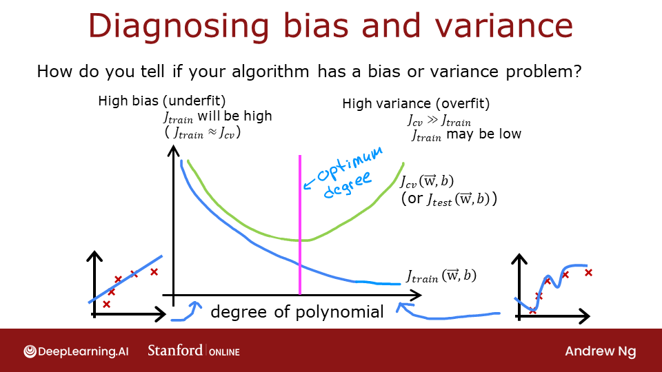
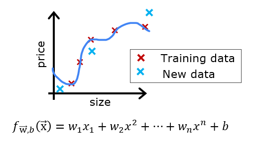

# Practice Lab - Advice for Applying Machine Learning
In this lab, you will explore techniques to evaluate and improve your machine learning models.

# Outline
- [ 1 - Packages ](#1)
- [ 2 - Evaluating a Learning Algorithm (Polynomial Regression)](#2)
  - [ 2.1 Splitting your data set](#2.1)
  - [ 2.2 Error calculation for model evaluation, linear regression](#2.2)
    - [ Exercise 1](#ex01)
  - [ 2.3 Compare performance on training and test data](#2.3)
- [ 3 - Bias and Variance ](#3)
  - [ 3.1 Plot Train, Cross-Validation, Test](#3.1)
  - [ 3.2 Finding the optimal degree](#3.2)
  - [ 3.3 Tuning Regularization.](#3.3)
  - [ 3.4 Getting more data: Increasing Training Set Size (m)](#3.4)
- [ 4 - Evaluating a Learning Algorithm (Neural Network)](#4)
  - [ 4.1 Data Set](#4.1)
  - [ 4.2 Evaluating categorical model by calculating classification error](#4.2)
    - [ Exercise 2](#ex02)
- [ 5 - Model Complexity](#5)
  - [ Exercise 3](#ex03)
  - [ 5.1 Simple model](#5.1)
    - [ Exercise 4](#ex04)
- [ 6 - Regularization](#6)
  - [ Exercise 5](#ex05)
- [ 7 - Iterate to find optimal regularization value](#7)
  - [ 7.1 Test](#7.1)


<a name="1"></a>
## 1 - Packages

First, let's run the cell below to import all the packages that you will need during this assignment.
- [numpy](https://numpy.org/) is the fundamental package for scientific computing Python.
- [matplotlib](http://matplotlib.org) is a popular library to plot graphs in Python.
- [scikitlearn](https://scikit-learn.org/stable/) is a basic library for data mining
- [tensorflow](https://tensorflow.org/) a popular platform for machine learning.


```python
import numpy as np
%matplotlib widget
import matplotlib.pyplot as plt
from sklearn.linear_model import LinearRegression, Ridge
from sklearn.preprocessing import StandardScaler, PolynomialFeatures
from sklearn.model_selection import train_test_split
from sklearn.metrics import mean_squared_error
import tensorflow as tf
from tensorflow.keras.models import Sequential
from tensorflow.keras.layers import Dense
from tensorflow.keras.activations import relu,linear
from tensorflow.keras.losses import SparseCategoricalCrossentropy
from tensorflow.keras.optimizers import Adam

import logging
logging.getLogger("tensorflow").setLevel(logging.ERROR)

from public_tests_a1 import *

tf.keras.backend.set_floatx('float64')
from assigment_utils import *

tf.autograph.set_verbosity(0)
```

<a name="2"></a>
## 2 - Evaluating a Learning Algorithm (Polynomial Regression)

 Let's say you have created a machine learning model and you find it *fits* your training data very well. You're done? Not quite. The goal of creating the model was to be able to predict values for <span style="color:blue">*new* </span> examples.

How can you test your model's performance on new data before deploying it?
The answer has two parts:
* Split your original data set into "Training" and "Test" sets.
    * Use the training data to fit the parameters of the model
    * Use the test data to evaluate the model on *new* data
* Develop an error function to evaluate your model.

<a name="2.1"></a>
### 2.1 Splitting your data set
Lectures advised reserving 20-40% of your data set for testing. Let's use an `sklearn` function [train_test_split](https://scikit-learn.org/stable/modules/generated/sklearn.model_selection.train_test_split.html) to perform the split. Double-check the shapes after running the following cell.


```python
# Generate some data
X,y,x_ideal,y_ideal = gen_data(18, 2, 0.7)
print("X.shape", X.shape, "y.shape", y.shape)

#split the data using sklearn routine
X_train, X_test, y_train, y_test = train_test_split(X,y,test_size=0.33, random_state=1)
print("X_train.shape", X_train.shape, "y_train.shape", y_train.shape)
print("X_test.shape", X_test.shape, "y_test.shape", y_test.shape)
```

    X.shape (18,) y.shape (18,)
    X_train.shape (12,) y_train.shape (12,)
    X_test.shape (6,) y_test.shape (6,)


#### 2.1.1 Plot Train, Test sets
You can see below the data points that will be part of training (in red) are intermixed with those that the model is not trained on (test). This particular data set is a quadratic function with noise added. The "ideal" curve is shown for reference.


```python
fig, ax = plt.subplots(1,1,figsize=(4,4))
ax.plot(x_ideal, y_ideal, "--", color = "orangered", label="y_ideal", lw=1)
ax.set_title("Training, Test",fontsize = 14)
ax.set_xlabel("x")
ax.set_ylabel("y")

ax.scatter(X_train, y_train, color = "red",           label="train")
ax.scatter(X_test, y_test,   color = dlc["dlblue"],   label="test")
ax.legend(loc='upper left')
plt.show()
```


    Canvas(toolbar=Toolbar(toolitems=[('Home', 'Reset original view', 'home', 'home'), ('Back', 'Back to previous …


<a name="2.2"></a>
### 2.2 Error calculation for model evaluation, linear regression
When *evaluating* a linear regression model, you average the squared error difference of the predicted values and the target values.

$$ J_\text{test}(\mathbf{w},b) =
            \frac{1}{2m_\text{test}}\sum_{i=0}^{m_\text{test}-1} ( f_{\mathbf{w},b}(\mathbf{x}^{(i)}_\text{test}) - y^{(i)}_\text{test} )^2
            \tag{1}
$$

<a name="ex01"></a>
### Exercise 1

Below, create a function to evaluate the error on a data set for a linear regression model.


```python
# UNQ_C1
# GRADED CELL: eval_mse
def eval_mse(y, yhat):
    """
    Calculate the mean squared error on a data set.
    Args:
      y    : (ndarray  Shape (m,) or (m,1))  target value of each example
      yhat : (ndarray  Shape (m,) or (m,1))  predicted value of each example
    Returns:
      err: (scalar)
    """
    m = len(y)
    err = 0.0
    ### START CODE HERE ###
    err = sum((yhat - y)**2) / (2*m)
    ### END CODE HERE ###

    return(err)
```


```python
y_hat = np.array([2.4, 4.2])
y_tmp = np.array([2.3, 4.1])
eval_mse(y_hat, y_tmp)

# BEGIN UNIT TEST
test_eval_mse(eval_mse)
# END UNIT TEST
```

     All tests passed.


  <summary><font size="3" color="darkgreen"><b>Click for hints</b></font></summary>


```python
def eval_mse(y, yhat):
    """
    Calculate the mean squared error on a data set.
    Args:
      y    : (ndarray  Shape (m,) or (m,1))  target value of each example
      yhat : (ndarray  Shape (m,) or (m,1))  predicted value of each example
    Returns:
      err: (scalar)
    """
    m = len(y)
    err = 0.0
    for i in range(m):
        err_i  = ( (yhat[i] - y[i])**2 )
        err   += err_i
    err = err / (2*m)
    return(err)
```

<a name="2.3"></a>
### 2.3 Compare performance on training and test data
Let's build a high degree polynomial model to minimize training error. This will use the linear_regression functions from `sklearn`. The code is in the imported utility file if you would like to see the details. The steps below are:
* create and fit the model. ('fit' is another name for training or running gradient descent).
* compute the error on the training data.
* compute the error on the test data.


```python
# create a model in sklearn, train on training data
degree = 10
lmodel = lin_model(degree)
lmodel.fit(X_train, y_train)

# predict on training data, find training error
yhat = lmodel.predict(X_train)
err_train = lmodel.mse(y_train, yhat)

# predict on test data, find error
yhat = lmodel.predict(X_test)
err_test = lmodel.mse(y_test, yhat)
```

The computed error on the training set is substantially less than that of the test set.


```python
print(f"training err {err_train:0.2f}, test err {err_test:0.2f}")
```

    training err 58.01, test err 171215.01


The following plot shows why this is. The model fits the training data very well. To do so, it has created a complex function. The test data was not part of the training and the model does a poor job of predicting on this data.
This model would be described as 1) is overfitting, 2) has high variance 3) 'generalizes' poorly.


```python
# plot predictions over data range
x = np.linspace(0,int(X.max()),100)  # predict values for plot
y_pred = lmodel.predict(x).reshape(-1,1)

plt_train_test(X_train, y_train, X_test, y_test, x, y_pred, x_ideal, y_ideal, degree)
```


    Canvas(toolbar=Toolbar(toolitems=[('Home', 'Reset original view', 'home', 'home'), ('Back', 'Back to previous …


The test set error shows this model will not work well on new data. If you use the test error to guide improvements in the model, then the model will perform well on the test data... but the test data was meant to represent *new* data.
You need yet another set of data to test new data performance.

The proposal made during lecture is to separate data into three groups. The distribution of training, cross-validation and test sets shown in the below table is a typical distribution, but can be varied depending on the amount of data available.

| data             | % of total | Description |
|------------------|:----------:|:---------|
| training         | 60         | Data used to tune model parameters $w$ and $b$ in training or fitting |
| cross-validation | 20         | Data used to tune other model parameters like degree of polynomial, regularization or the architecture of a neural network.|
| test             | 20         | Data used to test the model after tuning to gauge performance on new data |


Let's generate three data sets below. We'll once again use `train_test_split` from `sklearn` but will call it twice to get three splits:


```python
# Generate  data
X,y, x_ideal,y_ideal = gen_data(40, 5, 0.7)
print("X.shape", X.shape, "y.shape", y.shape)

#split the data using sklearn routine
X_train, X_, y_train, y_ = train_test_split(X,y,test_size=0.40, random_state=1)
X_cv, X_test, y_cv, y_test = train_test_split(X_,y_,test_size=0.50, random_state=1)
print("X_train.shape", X_train.shape, "y_train.shape", y_train.shape)
print("X_cv.shape", X_cv.shape, "y_cv.shape", y_cv.shape)
print("X_test.shape", X_test.shape, "y_test.shape", y_test.shape)
```

    X.shape (40,) y.shape (40,)
    X_train.shape (24,) y_train.shape (24,)
    X_cv.shape (8,) y_cv.shape (8,)
    X_test.shape (8,) y_test.shape (8,)


<a name="3"></a>
## 3 - Bias and Variance
 Above, it was clear the degree of the polynomial model was too high. How can you choose a good value? It turns out, as shown in the diagram, the training and cross-validation performance can provide guidance. By trying a range of degree values, the training and cross-validation performance can be evaluated. As the degree becomes too large, the cross-validation performance will start to degrade relative to the training performance. Let's try this on our example.

<a name="3.1"></a>
### 3.1 Plot Train, Cross-Validation, Test
You can see below the datapoints that will be part of training (in red) are intermixed with those that the model is not trained on (test and cv).


```python
fig, ax = plt.subplots(1,1,figsize=(4,4))
ax.plot(x_ideal, y_ideal, "--", color = "orangered", label="y_ideal", lw=1)
ax.set_title("Training, CV, Test",fontsize = 14)
ax.set_xlabel("x")
ax.set_ylabel("y")

ax.scatter(X_train, y_train, color = "red",           label="train")
ax.scatter(X_cv, y_cv,       color = dlc["dlorange"], label="cv")
ax.scatter(X_test, y_test,   color = dlc["dlblue"],   label="test")
ax.legend(loc='upper left')
plt.show()
```


    Canvas(toolbar=Toolbar(toolitems=[('Home', 'Reset original view', 'home', 'home'), ('Back', 'Back to previous …


<a name="3.2"></a>
### 3.2 Finding the optimal degree
In previous labs, you found that you could create a model capable of fitting complex curves by utilizing a polynomial (See Course1, Week2 Feature Engineering and Polynomial Regression Lab).  Further, you demonstrated that by increasing the *degree* of the polynomial, you could *create* overfitting. (See Course 1, Week3, Over-Fitting Lab). Let's use that knowledge here to test our ability to tell the difference between over-fitting and under-fitting.

Let's train the model repeatedly, increasing the degree of the polynomial each iteration. Here, we're going to use the [scikit-learn](https://scikit-learn.org/stable/modules/generated/sklearn.linear_model.LinearRegression.html#sklearn.linear_model.LinearRegression) linear regression model for speed and simplicity.


```python
max_degree = 9
err_train = np.zeros(max_degree)
err_cv = np.zeros(max_degree)
x = np.linspace(0,int(X.max()),100)
y_pred = np.zeros((100,max_degree))  #columns are lines to plot

for degree in range(max_degree):
    lmodel = lin_model(degree+1)
    lmodel.fit(X_train, y_train)
    yhat = lmodel.predict(X_train)
    err_train[degree] = lmodel.mse(y_train, yhat)
    yhat = lmodel.predict(X_cv)
    err_cv[degree] = lmodel.mse(y_cv, yhat)
    y_pred[:,degree] = lmodel.predict(x)

optimal_degree = np.argmin(err_cv)+1
```

<font size="4">Let's plot the result:</font>


```python
plt.close("all")
plt_optimal_degree(X_train, y_train, X_cv, y_cv, x, y_pred, x_ideal, y_ideal,
                   err_train, err_cv, optimal_degree, max_degree)
```


    Canvas(toolbar=Toolbar(toolitems=[('Home', 'Reset original view', 'home', 'home'), ('Back', 'Back to previous …


The plot above demonstrates that separating data into two groups, data the model is trained on and data the model has not been trained on, can be used to determine if the model is underfitting or overfitting. In our example, we created a variety of models varying from underfitting to overfitting by increasing the degree of the polynomial used.
- On the left plot, the solid lines represent the predictions from these models. A polynomial model with degree 1 produces a straight line that intersects very few data points, while the maximum degree hews very closely to every data point.
- on the right:
    - the error on the trained data (blue) decreases as the model complexity increases as expected
    - the error of the cross-validation data decreases initially as the model starts to conform to the data, but then increases as the model starts to over-fit on the training data (fails to *generalize*).

It's worth noting that the curves in these examples as not as smooth as one might draw for a lecture. It's clear the specific data points assigned to each group can change your results significantly. The general trend is what is important.

<a name="3.3"></a>
### 3.3 Tuning Regularization.
In previous labs, you have utilized *regularization* to reduce overfitting. Similar to degree, one can use the same methodology to tune the regularization parameter lambda ($\lambda$).

Let's demonstrate this by starting with a high degree polynomial and varying the regularization parameter.


```python
lambda_range = np.array([0.0, 1e-6, 1e-5, 1e-4,1e-3,1e-2, 1e-1,1,10,100])
num_steps = len(lambda_range)
degree = 10
err_train = np.zeros(num_steps)
err_cv = np.zeros(num_steps)
x = np.linspace(0,int(X.max()),100)
y_pred = np.zeros((100,num_steps))  #columns are lines to plot

for i in range(num_steps):
    lambda_= lambda_range[i]
    lmodel = lin_model(degree, regularization=True, lambda_=lambda_)
    lmodel.fit(X_train, y_train)
    yhat = lmodel.predict(X_train)
    err_train[i] = lmodel.mse(y_train, yhat)
    yhat = lmodel.predict(X_cv)
    err_cv[i] = lmodel.mse(y_cv, yhat)
    y_pred[:,i] = lmodel.predict(x)

optimal_reg_idx = np.argmin(err_cv)
```


```python
plt.close("all")
plt_tune_regularization(X_train, y_train, X_cv, y_cv, x, y_pred, err_train, err_cv, optimal_reg_idx, lambda_range)
```


    Canvas(toolbar=Toolbar(toolitems=[('Home', 'Reset original view', 'home', 'home'), ('Back', 'Back to previous …


Above, the plots show that as regularization increases, the model moves from a high variance (overfitting) model to a high bias (underfitting) model. The vertical line in the right plot shows the optimal value of lambda. In this example, the polynomial degree was set to 10.

<a name="3.4"></a>
### 3.4 Getting more data: Increasing Training Set Size (m)
When a model is overfitting (high variance), collecting additional data can improve performance. Let's try that here.


```python
X_train, y_train, X_cv, y_cv, x, y_pred, err_train, err_cv, m_range,degree = tune_m()
plt_tune_m(X_train, y_train, X_cv, y_cv, x, y_pred, err_train, err_cv, m_range, degree)
```


    Canvas(toolbar=Toolbar(toolitems=[('Home', 'Reset original view', 'home', 'home'), ('Back', 'Back to previous …


The above plots show that when a model has high variance and is overfitting, adding more examples improves performance. Note the curves on the left plot. The final curve with the highest value of $m$ is a smooth curve that is in the center of the data. On the right, as the number of examples increases, the performance of the training set and cross-validation set converge to similar values. Note that the curves are not as smooth as one might see in a lecture. That is to be expected. The trend remains clear: more data improves generalization.

> Note that adding more examples when the model has high bias (underfitting) does not improve performance.


<a name="4"></a>
## 4 - Evaluating a Learning Algorithm (Neural Network)
Above, you tuned aspects of a polynomial regression model. Here, you will work with a neural network model. Let's start by creating a classification data set.

<a name="4.1"></a>
### 4.1 Data Set
Run the cell below to generate a data set and split it into training, cross-validation (CV) and test sets. In this example, we're increasing the percentage of cross-validation data points for emphasis.


```python
# Generate and split data set
X, y, centers, classes, std = gen_blobs()

# split the data. Large CV population for demonstration
X_train, X_, y_train, y_ = train_test_split(X,y,test_size=0.50, random_state=1)
X_cv, X_test, y_cv, y_test = train_test_split(X_,y_,test_size=0.20, random_state=1)
print("X_train.shape:", X_train.shape, "X_cv.shape:", X_cv.shape, "X_test.shape:", X_test.shape)
```

    X_train.shape: (400, 2) X_cv.shape: (320, 2) X_test.shape: (80, 2)


```python
plt_train_eq_dist(X_train, y_train,classes, X_cv, y_cv, centers, std)
```


    Canvas(toolbar=Toolbar(toolitems=[('Home', 'Reset original view', 'home', 'home'), ('Back', 'Back to previous …


Above, you can see the data on the left. There are six clusters identified by color. Both training points (dots) and cross-validataion points (triangles) are shown. The interesting points are those that fall in ambiguous locations where either cluster might consider them members. What would you expect a neural network model to do? What would be an example of overfitting? underfitting?
On the right is an example of an 'ideal' model, or a model one might create knowing the source of the data. The lines represent 'equal distance' boundaries where the distance between center points is equal. It's worth noting that this model would "misclassify" roughly 8% of the total data set.

<a name="4.2"></a>
### 4.2 Evaluating categorical model by calculating classification error
The evaluation function for categorical models used here is simply the fraction of incorrect predictions:
$$ J_{cv} =\frac{1}{m}\sum_{i=0}^{m-1}
\begin{cases}
    1, & \text{if $\hat{y}^{(i)} \neq y^{(i)}$}\\
    0, & \text{otherwise}
\end{cases}
$$

<a name="ex02"></a>
### Exercise 2

Below, complete the routine to calculate classification error. Note, in this lab, target values are the index of the category and are not [one-hot encoded](https://en.wikipedia.org/wiki/One-hot).


```python
# UNQ_C2
# GRADED CELL: eval_cat_err
def eval_cat_err(y, yhat):
    """
    Calculate the categorization error
    Args:
      y    : (ndarray  Shape (m,) or (m,1))  target value of each example
      yhat : (ndarray  Shape (m,) or (m,1))  predicted value of each example
    Returns:|
      cerr: (scalar)
    """
    m = len(y)
    incorrect = 0
    ### START CODE HERE ###
    cerr = sum(int(i) for i in (yhat != y)) / m
    ### END CODE HERE ###

    return(cerr)
```


```python
y_hat = np.array([1, 2, 0])
y_tmp = np.array([1, 2, 3])
print(f"categorization error {np.squeeze(eval_cat_err(y_hat, y_tmp)):0.3f}, expected:0.333" )
y_hat = np.array([[1], [2], [0], [3]])
y_tmp = np.array([[1], [2], [1], [3]])
print(f"categorization error {np.squeeze(eval_cat_err(y_hat, y_tmp)):0.3f}, expected:0.250" )

# BEGIN UNIT TEST
test_eval_cat_err(eval_cat_err)
# END UNIT TEST
# BEGIN UNIT TEST
test_eval_cat_err(eval_cat_err)
# END UNIT TEST
```

    categorization error 0.333, expected:0.333
    categorization error 0.250, expected:0.250
     All tests passed.
     All tests passed.


  <summary><font size="3" color="darkgreen"><b>Click for hints</b></font></summary>

```python
def eval_cat_err(y, yhat):
    """
    Calculate the categorization error
    Args:
      y    : (ndarray  Shape (m,) or (m,1))  target value of each example
      yhat : (ndarray  Shape (m,) or (m,1))  predicted value of each example
    Returns:|
      cerr: (scalar)
    """
    m = len(y)
    incorrect = 0
    for i in range(m):
        if yhat[i] != y[i]:    # @REPLACE
            incorrect += 1     # @REPLACE
    cerr = incorrect/m         # @REPLACE
    return(cerr)
```

<a name="5"></a>
## 5 - Model Complexity
Below, you will build two models. A complex model and a simple model. You will evaluate the models to determine if they are likely to overfit or underfit.

###  5.1 Complex model

<a name="ex03"></a>
### Exercise 3
Below, compose a three-layer model:
* Dense layer with 120 units, relu activation
* Dense layer with 40 units, relu activation
* Dense layer with 6 units and a linear activation (not softmax)
Compile using
* loss with `SparseCategoricalCrossentropy`, remember to use  `from_logits=True`
* Adam optimizer with learning rate of 0.01.


```python
# UNQ_C3
# GRADED CELL: model
import logging
logging.getLogger("tensorflow").setLevel(logging.ERROR)

tf.random.set_seed(1234)
model = Sequential(
    [
        ### START CODE HERE ###
        Dense(120, activation = 'relu', name = "L1"),
        Dense(40, activation = 'relu', name = "L2"),
        Dense(classes, activation = 'linear', name = "L3")
        ### END CODE HERE ###

    ], name="Complex"
)
model.compile(
    ### START CODE HERE ###
    loss=tf.keras.losses.SparseCategoricalCrossentropy(from_logits=True),
    optimizer=tf.keras.optimizers.Adam(0.01),
    ### END CODE HERE ###
)
```


```python
# BEGIN UNIT TEST
model.fit(
    X_train, y_train,
    epochs=1000
)
# END UNIT TEST
```

    Epoch 1/1000
    13/13 [==============================] - 0s 1ms/step - loss: 1.1106
    Epoch 2/1000
    13/13 [==============================] - 0s 1ms/step - loss: 0.4281
    Epoch 3/1000
    13/13 [==============================] - 0s 1ms/step - loss: 0.3345
    Epoch 4/1000
    13/13 [==============================] - 0s 3ms/step - loss: 0.2896
    Epoch 5/1000
    13/13 [==============================] - 0s 1ms/step - loss: 0.2867
    Epoch 6/1000
    13/13 [==============================] - 0s 1ms/step - loss: 0.2918
    Epoch 7/1000
    13/13 [==============================] - 0s 1ms/step - loss: 0.2497
    Epoch 8/1000
    13/13 [==============================] - 0s 1ms/step - loss: 0.2298
    Epoch 9/1000
    13/13 [==============================] - 0s 3ms/step - loss: 0.2307
    Epoch 10/1000
    13/13 [==============================] - 0s 1ms/step - loss: 0.2071
    Epoch 11/1000
    13/13 [==============================] - 0s 1ms/step - loss: 0.2115
    Epoch 12/1000
    13/13 [==============================] - 0s 1ms/step - loss: 0.2070
    Epoch 13/1000
    13/13 [==============================] - 0s 3ms/step - loss: 0.2366
    Epoch 14/1000
    13/13 [==============================] - 0s 1ms/step - loss: 0.2261
    Epoch 15/1000
    13/13 [==============================] - 0s 1ms/step - loss: 0.2224
    Epoch 16/1000
    13/13 [==============================] - 0s 1ms/step - loss: 0.2055
    Epoch 17/1000
    13/13 [==============================] - 0s 1ms/step - loss: 0.2044
    Epoch 18/1000
    13/13 [==============================] - 0s 3ms/step - loss: 0.2006
    Epoch 19/1000
    13/13 [==============================] - 0s 1ms/step - loss: 0.2168
    Epoch 20/1000
    13/13 [==============================] - 0s 1ms/step - loss: 0.2047
    Epoch 21/1000
    13/13 [==============================] - 0s 1ms/step - loss: 0.2237
    Epoch 22/1000
    13/13 [==============================] - 0s 1ms/step - loss: 0.2497
    Epoch 23/1000
    13/13 [==============================] - 0s 1ms/step - loss: 0.2113
    Epoch 24/1000
    13/13 [==============================] - 0s 1ms/step - loss: 0.2025
    Epoch 25/1000
    13/13 [==============================] - 0s 1ms/step - loss: 0.2107
    Epoch 26/1000
    13/13 [==============================] - 0s 1ms/step - loss: 0.2000
    Epoch 27/1000
    13/13 [==============================] - 0s 3ms/step - loss: 0.1935
    Epoch 28/1000
    13/13 [==============================] - 0s 1ms/step - loss: 0.1963
    Epoch 29/1000
    13/13 [==============================] - 0s 1ms/step - loss: 0.2188
    Epoch 30/1000
    13/13 [==============================] - 0s 1ms/step - loss: 0.2424
    Epoch 31/1000
    13/13 [==============================] - 0s 1ms/step - loss: 0.1969
    Epoch 32/1000
    13/13 [==============================] - 0s 3ms/step - loss: 0.1950
    Epoch 33/1000
    13/13 [==============================] - 0s 1ms/step - loss: 0.1904
    Epoch 34/1000
    13/13 [==============================] - 0s 1ms/step - loss: 0.2173
    Epoch 35/1000
    13/13 [==============================] - 0s 1ms/step - loss: 0.2074
    Epoch 36/1000
    13/13 [==============================] - 0s 1ms/step - loss: 0.1768
    Epoch 37/1000
    13/13 [==============================] - 0s 3ms/step - loss: 0.1794
    Epoch 38/1000
    13/13 [==============================] - 0s 1ms/step - loss: 0.1733
    Epoch 39/1000
    13/13 [==============================] - 0s 1ms/step - loss: 0.1955
    Epoch 40/1000
    13/13 [==============================] - 0s 1ms/step - loss: 0.1870
    Epoch 41/1000
    13/13 [==============================] - 0s 3ms/step - loss: 0.2128
    Epoch 42/1000
    13/13 [==============================] - 0s 1ms/step - loss: 0.1987
    Epoch 43/1000
    13/13 [==============================] - 0s 1ms/step - loss: 0.1895
    Epoch 44/1000
    13/13 [==============================] - 0s 1ms/step - loss: 0.2073
    Epoch 45/1000
    13/13 [==============================] - 0s 1ms/step - loss: 0.2148
    Epoch 46/1000
    13/13 [==============================] - 0s 3ms/step - loss: 0.1774
    Epoch 47/1000
    13/13 [==============================] - 0s 1ms/step - loss: 0.1886
    Epoch 48/1000
    13/13 [==============================] - 0s 1ms/step - loss: 0.1763
    Epoch 49/1000
    13/13 [==============================] - 0s 1ms/step - loss: 0.1769
    Epoch 50/1000
    13/13 [==============================] - 0s 1ms/step - loss: 0.1763
    Epoch 51/1000
    13/13 [==============================] - 0s 3ms/step - loss: 0.2020
    Epoch 52/1000
    13/13 [==============================] - 0s 1ms/step - loss: 0.1889
    Epoch 53/1000
    13/13 [==============================] - 0s 1ms/step - loss: 0.2035
    Epoch 54/1000
    13/13 [==============================] - 0s 1ms/step - loss: 0.1761
    Epoch 55/1000
    13/13 [==============================] - 0s 3ms/step - loss: 0.1838
    Epoch 56/1000
    13/13 [==============================] - 0s 1ms/step - loss: 0.1774
    Epoch 57/1000
    13/13 [==============================] - 0s 1ms/step - loss: 0.1953
    Epoch 58/1000
    13/13 [==============================] - 0s 1ms/step - loss: 0.1882
    Epoch 59/1000
    13/13 [==============================] - 0s 1ms/step - loss: 0.1860
    Epoch 60/1000
    13/13 [==============================] - 0s 4ms/step - loss: 0.1919
    Epoch 61/1000
    13/13 [==============================] - 0s 1ms/step - loss: 0.1848
    Epoch 62/1000
    13/13 [==============================] - 0s 1ms/step - loss: 0.1630
    Epoch 63/1000
    13/13 [==============================] - 0s 1ms/step - loss: 0.1616
    Epoch 64/1000
    13/13 [==============================] - 0s 3ms/step - loss: 0.2008
    Epoch 65/1000
    13/13 [==============================] - 0s 1ms/step - loss: 0.1936
    Epoch 66/1000
    13/13 [==============================] - 0s 1ms/step - loss: 0.1824
    Epoch 67/1000
    13/13 [==============================] - 0s 1ms/step - loss: 0.2092
    Epoch 68/1000
    13/13 [==============================] - 0s 1ms/step - loss: 0.2287
    Epoch 69/1000
    13/13 [==============================] - 0s 3ms/step - loss: 0.1877
    Epoch 70/1000
    13/13 [==============================] - 0s 1ms/step - loss: 0.1716
    Epoch 71/1000
    13/13 [==============================] - 0s 1ms/step - loss: 0.1917
    Epoch 72/1000
    13/13 [==============================] - 0s 1ms/step - loss: 0.1703
    Epoch 73/1000
    13/13 [==============================] - 0s 1ms/step - loss: 0.1750
    Epoch 74/1000
    13/13 [==============================] - 0s 1ms/step - loss: 0.1836
    Epoch 75/1000
    13/13 [==============================] - 0s 1ms/step - loss: 0.1696
    Epoch 76/1000
    13/13 [==============================] - 0s 1ms/step - loss: 0.1542
    Epoch 77/1000
    13/13 [==============================] - 0s 1ms/step - loss: 0.1715
    Epoch 78/1000
    13/13 [==============================] - 0s 3ms/step - loss: 0.1545
    Epoch 79/1000
    13/13 [==============================] - 0s 1ms/step - loss: 0.1593
    Epoch 80/1000
    13/13 [==============================] - 0s 1ms/step - loss: 0.1844
    Epoch 81/1000
    13/13 [==============================] - 0s 1ms/step - loss: 0.1881
    Epoch 82/1000
    13/13 [==============================] - 0s 1ms/step - loss: 0.1696
    Epoch 83/1000
    13/13 [==============================] - 0s 3ms/step - loss: 0.1614
    Epoch 84/1000
    13/13 [==============================] - 0s 1ms/step - loss: 0.1762
    Epoch 85/1000
    13/13 [==============================] - 0s 1ms/step - loss: 0.1779
    Epoch 86/1000
    13/13 [==============================] - 0s 1ms/step - loss: 0.1658
    Epoch 87/1000
    13/13 [==============================] - 0s 1ms/step - loss: 0.1614
    Epoch 88/1000
    13/13 [==============================] - 0s 1ms/step - loss: 0.1639
    Epoch 89/1000
    13/13 [==============================] - 0s 1ms/step - loss: 0.1629
    Epoch 90/1000
    13/13 [==============================] - 0s 1ms/step - loss: 0.1475
    Epoch 91/1000
    13/13 [==============================] - 0s 1ms/step - loss: 0.1452
    Epoch 92/1000
    13/13 [==============================] - 0s 3ms/step - loss: 0.1473
    Epoch 93/1000
    13/13 [==============================] - 0s 1ms/step - loss: 0.1490
    Epoch 94/1000
    13/13 [==============================] - 0s 1ms/step - loss: 0.1650
    Epoch 95/1000
    13/13 [==============================] - 0s 1ms/step - loss: 0.1706
    Epoch 96/1000
    13/13 [==============================] - 0s 1ms/step - loss: 0.1704
    Epoch 97/1000
    13/13 [==============================] - 0s 3ms/step - loss: 0.1764
    Epoch 98/1000
    13/13 [==============================] - 0s 1ms/step - loss: 0.1855
    Epoch 99/1000
    13/13 [==============================] - 0s 1ms/step - loss: 0.1685
    Epoch 100/1000
    13/13 [==============================] - 0s 1ms/step - loss: 0.1569
    Epoch 101/1000
    13/13 [==============================] - 0s 1ms/step - loss: 0.1645
    Epoch 102/1000
    13/13 [==============================] - 0s 3ms/step - loss: 0.1737
    Epoch 103/1000
    13/13 [==============================] - 0s 1ms/step - loss: 0.1935
    Epoch 104/1000
    13/13 [==============================] - 0s 1ms/step - loss: 0.1600
    Epoch 105/1000
    13/13 [==============================] - 0s 1ms/step - loss: 0.1483
    Epoch 106/1000
    13/13 [==============================] - 0s 3ms/step - loss: 0.1555
    Epoch 107/1000
    13/13 [==============================] - 0s 1ms/step - loss: 0.1678
    Epoch 108/1000
    13/13 [==============================] - 0s 1ms/step - loss: 0.1435
    Epoch 109/1000
    13/13 [==============================] - 0s 1ms/step - loss: 0.1419
    Epoch 110/1000
    13/13 [==============================] - 0s 1ms/step - loss: 0.1494
    Epoch 111/1000
    13/13 [==============================] - 0s 3ms/step - loss: 0.1538
    Epoch 112/1000
    13/13 [==============================] - 0s 1ms/step - loss: 0.1682
    Epoch 113/1000
    13/13 [==============================] - 0s 1ms/step - loss: 0.1687
    Epoch 114/1000
    13/13 [==============================] - 0s 1ms/step - loss: 0.1436
    Epoch 115/1000
    13/13 [==============================] - 0s 1ms/step - loss: 0.1366
    Epoch 116/1000
    13/13 [==============================] - 0s 3ms/step - loss: 0.1485
    Epoch 117/1000
    13/13 [==============================] - 0s 1ms/step - loss: 0.1400
    Epoch 118/1000
    13/13 [==============================] - 0s 1ms/step - loss: 0.1357
    Epoch 119/1000
    13/13 [==============================] - 0s 1ms/step - loss: 0.1444
    Epoch 120/1000
    13/13 [==============================] - 0s 1ms/step - loss: 0.1403
    Epoch 121/1000
    13/13 [==============================] - 0s 3ms/step - loss: 0.1465
    Epoch 122/1000
    13/13 [==============================] - 0s 1ms/step - loss: 0.1549
    Epoch 123/1000
    13/13 [==============================] - 0s 1ms/step - loss: 0.1402
    Epoch 124/1000
    13/13 [==============================] - 0s 1ms/step - loss: 0.1337
    Epoch 125/1000
    13/13 [==============================] - 0s 3ms/step - loss: 0.1422
    Epoch 126/1000
    13/13 [==============================] - 0s 1ms/step - loss: 0.1560
    Epoch 127/1000
    13/13 [==============================] - 0s 1ms/step - loss: 0.1319
    Epoch 128/1000
    13/13 [==============================] - 0s 1ms/step - loss: 0.1389
    Epoch 129/1000
    13/13 [==============================] - 0s 1ms/step - loss: 0.1404
    Epoch 130/1000
    13/13 [==============================] - 0s 3ms/step - loss: 0.1299
    Epoch 131/1000
    13/13 [==============================] - 0s 1ms/step - loss: 0.1247
    Epoch 132/1000
    13/13 [==============================] - 0s 1ms/step - loss: 0.1244
    Epoch 133/1000
    13/13 [==============================] - 0s 1ms/step - loss: 0.1260
    Epoch 134/1000
    13/13 [==============================] - 0s 1ms/step - loss: 0.1158
    Epoch 135/1000
    13/13 [==============================] - 0s 3ms/step - loss: 0.1343
    Epoch 136/1000
    13/13 [==============================] - 0s 1ms/step - loss: 0.1306
    Epoch 137/1000
    13/13 [==============================] - 0s 1ms/step - loss: 0.1294
    Epoch 138/1000
    13/13 [==============================] - 0s 1ms/step - loss: 0.1297
    Epoch 139/1000
    13/13 [==============================] - 0s 1ms/step - loss: 0.1342
    Epoch 140/1000
    13/13 [==============================] - 0s 3ms/step - loss: 0.1255
    Epoch 141/1000
    13/13 [==============================] - 0s 1ms/step - loss: 0.1232
    Epoch 142/1000
    13/13 [==============================] - 0s 1ms/step - loss: 0.1199
    Epoch 143/1000
    13/13 [==============================] - 0s 1ms/step - loss: 0.1192
    Epoch 144/1000
    13/13 [==============================] - 0s 3ms/step - loss: 0.1192
    Epoch 145/1000
    13/13 [==============================] - 0s 1ms/step - loss: 0.1342
    Epoch 146/1000
    13/13 [==============================] - 0s 1ms/step - loss: 0.1477
    Epoch 147/1000
    13/13 [==============================] - 0s 1ms/step - loss: 0.1780
    Epoch 148/1000
    13/13 [==============================] - 0s 1ms/step - loss: 0.1673
    Epoch 149/1000
    13/13 [==============================] - 0s 3ms/step - loss: 0.1402
    Epoch 150/1000
    13/13 [==============================] - 0s 1ms/step - loss: 0.1292
    Epoch 151/1000
    13/13 [==============================] - 0s 1ms/step - loss: 0.1296
    Epoch 152/1000
    13/13 [==============================] - 0s 1ms/step - loss: 0.1221
    Epoch 153/1000
    13/13 [==============================] - 0s 1ms/step - loss: 0.1300
    Epoch 154/1000
    13/13 [==============================] - 0s 1ms/step - loss: 0.1316
    Epoch 155/1000
    13/13 [==============================] - 0s 1ms/step - loss: 0.1274
    Epoch 156/1000
    13/13 [==============================] - 0s 1ms/step - loss: 0.1192
    Epoch 157/1000
    13/13 [==============================] - 0s 1ms/step - loss: 0.1266
    Epoch 158/1000
    13/13 [==============================] - 0s 3ms/step - loss: 0.1185
    Epoch 159/1000
    13/13 [==============================] - 0s 1ms/step - loss: 0.1197
    Epoch 160/1000
    13/13 [==============================] - 0s 1ms/step - loss: 0.1148
    Epoch 161/1000
    13/13 [==============================] - 0s 1ms/step - loss: 0.1137
    Epoch 162/1000
    13/13 [==============================] - 0s 1ms/step - loss: 0.1427
    Epoch 163/1000
    13/13 [==============================] - 0s 3ms/step - loss: 0.1420
    Epoch 164/1000
    13/13 [==============================] - 0s 1ms/step - loss: 0.1327
    Epoch 165/1000
    13/13 [==============================] - 0s 1ms/step - loss: 0.1276
    Epoch 166/1000
    13/13 [==============================] - 0s 1ms/step - loss: 0.1099
    Epoch 167/1000
    13/13 [==============================] - 0s 1ms/step - loss: 0.1205
    Epoch 168/1000
    13/13 [==============================] - 0s 3ms/step - loss: 0.1307
    Epoch 169/1000
    13/13 [==============================] - 0s 1ms/step - loss: 0.1476
    Epoch 170/1000
    13/13 [==============================] - 0s 1ms/step - loss: 0.1673
    Epoch 171/1000
    13/13 [==============================] - 0s 1ms/step - loss: 0.1349
    Epoch 172/1000
    13/13 [==============================] - 0s 3ms/step - loss: 0.1183
    Epoch 173/1000
    13/13 [==============================] - 0s 1ms/step - loss: 0.1225
    Epoch 174/1000
    13/13 [==============================] - 0s 1ms/step - loss: 0.1276
    Epoch 175/1000
    13/13 [==============================] - 0s 1ms/step - loss: 0.1029
    Epoch 176/1000
    13/13 [==============================] - 0s 1ms/step - loss: 0.1134
    Epoch 177/1000
    13/13 [==============================] - 0s 3ms/step - loss: 0.1081
    Epoch 178/1000
    13/13 [==============================] - 0s 1ms/step - loss: 0.1245
    Epoch 179/1000
    13/13 [==============================] - 0s 1ms/step - loss: 0.1346
    Epoch 180/1000
    13/13 [==============================] - 0s 1ms/step - loss: 0.1233
    Epoch 181/1000
    13/13 [==============================] - 0s 1ms/step - loss: 0.1113
    Epoch 182/1000
    13/13 [==============================] - 0s 3ms/step - loss: 0.1040
    Epoch 183/1000
    13/13 [==============================] - 0s 1ms/step - loss: 0.1155
    Epoch 184/1000
    13/13 [==============================] - 0s 1ms/step - loss: 0.1049
    Epoch 185/1000
    13/13 [==============================] - 0s 1ms/step - loss: 0.1111
    Epoch 186/1000
    13/13 [==============================] - 0s 1ms/step - loss: 0.1079
    Epoch 187/1000
    13/13 [==============================] - 0s 1ms/step - loss: 0.1021
    Epoch 188/1000
    13/13 [==============================] - 0s 1ms/step - loss: 0.1048
    Epoch 189/1000
    13/13 [==============================] - 0s 1ms/step - loss: 0.0971
    Epoch 190/1000
    13/13 [==============================] - 0s 1ms/step - loss: 0.0985
    Epoch 191/1000
    13/13 [==============================] - 0s 3ms/step - loss: 0.1026
    Epoch 192/1000
    13/13 [==============================] - 0s 1ms/step - loss: 0.1111
    Epoch 193/1000
    13/13 [==============================] - 0s 1ms/step - loss: 0.0991
    Epoch 194/1000
    13/13 [==============================] - 0s 1ms/step - loss: 0.0890
    Epoch 195/1000
    13/13 [==============================] - 0s 1ms/step - loss: 0.0880
    Epoch 196/1000
    13/13 [==============================] - 0s 3ms/step - loss: 0.1006
    Epoch 197/1000
    13/13 [==============================] - 0s 1ms/step - loss: 0.0974
    Epoch 198/1000
    13/13 [==============================] - 0s 1ms/step - loss: 0.1141
    Epoch 199/1000
    13/13 [==============================] - 0s 1ms/step - loss: 0.1423
    Epoch 200/1000
    13/13 [==============================] - 0s 1ms/step - loss: 0.1381
    Epoch 201/1000
    13/13 [==============================] - 0s 1ms/step - loss: 0.1105
    Epoch 202/1000
    13/13 [==============================] - 0s 1ms/step - loss: 0.1005
    Epoch 203/1000
    13/13 [==============================] - 0s 1ms/step - loss: 0.0846
    Epoch 204/1000
    13/13 [==============================] - 0s 1ms/step - loss: 0.1125
    Epoch 205/1000
    13/13 [==============================] - 0s 1ms/step - loss: 0.1129
    Epoch 206/1000
    13/13 [==============================] - 0s 1ms/step - loss: 0.1219
    Epoch 207/1000
    13/13 [==============================] - 0s 1ms/step - loss: 0.1161
    Epoch 208/1000
    13/13 [==============================] - 0s 1ms/step - loss: 0.1137
    Epoch 209/1000
    13/13 [==============================] - 0s 1ms/step - loss: 0.1178
    Epoch 210/1000
    13/13 [==============================] - 0s 3ms/step - loss: 0.1017
    Epoch 211/1000
    13/13 [==============================] - 0s 1ms/step - loss: 0.1051
    Epoch 212/1000
    13/13 [==============================] - 0s 1ms/step - loss: 0.1014
    Epoch 213/1000
    13/13 [==============================] - 0s 1ms/step - loss: 0.1096
    Epoch 214/1000
    13/13 [==============================] - 0s 1ms/step - loss: 0.1087
    Epoch 215/1000
    13/13 [==============================] - 0s 3ms/step - loss: 0.1047
    Epoch 216/1000
    13/13 [==============================] - 0s 1ms/step - loss: 0.1044
    Epoch 217/1000
    13/13 [==============================] - 0s 1ms/step - loss: 0.1044
    Epoch 218/1000
    13/13 [==============================] - 0s 1ms/step - loss: 0.1006
    Epoch 219/1000
    13/13 [==============================] - 0s 3ms/step - loss: 0.1093
    Epoch 220/1000
    13/13 [==============================] - 0s 1ms/step - loss: 0.1041
    Epoch 221/1000
    13/13 [==============================] - 0s 1ms/step - loss: 0.0956
    Epoch 222/1000
    13/13 [==============================] - 0s 1ms/step - loss: 0.1109
    Epoch 223/1000
    13/13 [==============================] - 0s 1ms/step - loss: 0.1041
    Epoch 224/1000
    13/13 [==============================] - 0s 3ms/step - loss: 0.1000
    Epoch 225/1000
    13/13 [==============================] - 0s 1ms/step - loss: 0.0968
    Epoch 226/1000
    13/13 [==============================] - 0s 1ms/step - loss: 0.0951
    Epoch 227/1000
    13/13 [==============================] - 0s 1ms/step - loss: 0.1092
    Epoch 228/1000
    13/13 [==============================] - 0s 1ms/step - loss: 0.1041
    Epoch 229/1000
    13/13 [==============================] - 0s 3ms/step - loss: 0.1032
    Epoch 230/1000
    13/13 [==============================] - 0s 1ms/step - loss: 0.1153
    Epoch 231/1000
    13/13 [==============================] - 0s 1ms/step - loss: 0.1237
    Epoch 232/1000
    13/13 [==============================] - 0s 2ms/step - loss: 0.0978
    Epoch 233/1000
    13/13 [==============================] - 0s 1ms/step - loss: 0.1074
    Epoch 234/1000
    13/13 [==============================] - 0s 1ms/step - loss: 0.1059
    Epoch 235/1000
    13/13 [==============================] - 0s 1ms/step - loss: 0.1122
    Epoch 236/1000
    13/13 [==============================] - 0s 1ms/step - loss: 0.0974
    Epoch 237/1000
    13/13 [==============================] - 0s 1ms/step - loss: 0.0879
    Epoch 238/1000
    13/13 [==============================] - 0s 3ms/step - loss: 0.0913
    Epoch 239/1000
    13/13 [==============================] - 0s 1ms/step - loss: 0.0831
    Epoch 240/1000
    13/13 [==============================] - 0s 1ms/step - loss: 0.0752
    Epoch 241/1000
    13/13 [==============================] - 0s 1ms/step - loss: 0.0733
    Epoch 242/1000
    13/13 [==============================] - 0s 1ms/step - loss: 0.0886
    Epoch 243/1000
    13/13 [==============================] - 0s 3ms/step - loss: 0.0837
    Epoch 244/1000
    13/13 [==============================] - 0s 1ms/step - loss: 0.0866
    Epoch 245/1000
    13/13 [==============================] - 0s 1ms/step - loss: 0.0933
    Epoch 246/1000
    13/13 [==============================] - 0s 1ms/step - loss: 0.0976
    Epoch 247/1000
    13/13 [==============================] - 0s 1ms/step - loss: 0.1150
    Epoch 248/1000
    13/13 [==============================] - 0s 3ms/step - loss: 0.0904
    Epoch 249/1000
    13/13 [==============================] - 0s 1ms/step - loss: 0.1073
    Epoch 250/1000
    13/13 [==============================] - 0s 1ms/step - loss: 0.1296
    Epoch 251/1000
    13/13 [==============================] - 0s 1ms/step - loss: 0.1022
    Epoch 252/1000
    13/13 [==============================] - 0s 1ms/step - loss: 0.0987
    Epoch 253/1000
    13/13 [==============================] - 0s 3ms/step - loss: 0.0846
    Epoch 254/1000
    13/13 [==============================] - 0s 1ms/step - loss: 0.0813
    Epoch 255/1000
    13/13 [==============================] - 0s 1ms/step - loss: 0.0924
    Epoch 256/1000
    13/13 [==============================] - 0s 1ms/step - loss: 0.0799
    Epoch 257/1000
    13/13 [==============================] - 0s 3ms/step - loss: 0.0947
    Epoch 258/1000
    13/13 [==============================] - 0s 1ms/step - loss: 0.0956
    Epoch 259/1000
    13/13 [==============================] - 0s 1ms/step - loss: 0.0788
    Epoch 260/1000
    13/13 [==============================] - 0s 1ms/step - loss: 0.1018
    Epoch 261/1000
    13/13 [==============================] - 0s 1ms/step - loss: 0.0942
    Epoch 262/1000
    13/13 [==============================] - 0s 3ms/step - loss: 0.0780
    Epoch 263/1000
    13/13 [==============================] - 0s 2ms/step - loss: 0.0821
    Epoch 264/1000
    13/13 [==============================] - 0s 1ms/step - loss: 0.0795
    Epoch 265/1000
    13/13 [==============================] - 0s 1ms/step - loss: 0.0924
    Epoch 266/1000
    13/13 [==============================] - 0s 1ms/step - loss: 0.0948
    Epoch 267/1000
    13/13 [==============================] - 0s 3ms/step - loss: 0.0767
    Epoch 268/1000
    13/13 [==============================] - 0s 1ms/step - loss: 0.0720
    Epoch 269/1000
    13/13 [==============================] - 0s 1ms/step - loss: 0.0742
    Epoch 270/1000
    13/13 [==============================] - 0s 1ms/step - loss: 0.0747
    Epoch 271/1000
    13/13 [==============================] - 0s 1ms/step - loss: 0.0726
    Epoch 272/1000
    13/13 [==============================] - 0s 1ms/step - loss: 0.0984
    Epoch 273/1000
    13/13 [==============================] - 0s 1ms/step - loss: 0.1074
    Epoch 274/1000
    13/13 [==============================] - 0s 1ms/step - loss: 0.0836
    Epoch 275/1000
    13/13 [==============================] - 0s 1ms/step - loss: 0.0783
    Epoch 276/1000
    13/13 [==============================] - 0s 3ms/step - loss: 0.0799
    Epoch 277/1000
    13/13 [==============================] - 0s 1ms/step - loss: 0.1225
    Epoch 278/1000
    13/13 [==============================] - 0s 1ms/step - loss: 0.1017
    Epoch 279/1000
    13/13 [==============================] - 0s 1ms/step - loss: 0.0990
    Epoch 280/1000
    13/13 [==============================] - 0s 1ms/step - loss: 0.1014
    Epoch 281/1000
    13/13 [==============================] - 0s 3ms/step - loss: 0.0808
    Epoch 282/1000
    13/13 [==============================] - 0s 1ms/step - loss: 0.0798
    Epoch 283/1000
    13/13 [==============================] - 0s 1ms/step - loss: 0.0847
    Epoch 284/1000
    13/13 [==============================] - 0s 1ms/step - loss: 0.0755
    Epoch 285/1000
    13/13 [==============================] - 0s 1ms/step - loss: 0.0631
    Epoch 286/1000
    13/13 [==============================] - 0s 1ms/step - loss: 0.0651
    Epoch 287/1000
    13/13 [==============================] - 0s 1ms/step - loss: 0.0602
    Epoch 288/1000
    13/13 [==============================] - 0s 1ms/step - loss: 0.0733
    Epoch 289/1000
    13/13 [==============================] - 0s 1ms/step - loss: 0.0659
    Epoch 290/1000
    13/13 [==============================] - 0s 3ms/step - loss: 0.0682
    Epoch 291/1000
    13/13 [==============================] - 0s 1ms/step - loss: 0.0745
    Epoch 292/1000
    13/13 [==============================] - 0s 1ms/step - loss: 0.0848
    Epoch 293/1000
    13/13 [==============================] - 0s 1ms/step - loss: 0.0701
    Epoch 294/1000
    13/13 [==============================] - 0s 2ms/step - loss: 0.0828
    Epoch 295/1000
    13/13 [==============================] - 0s 3ms/step - loss: 0.0741
    Epoch 296/1000
    13/13 [==============================] - 0s 1ms/step - loss: 0.0890
    Epoch 297/1000
    13/13 [==============================] - 0s 1ms/step - loss: 0.0800
    Epoch 298/1000
    13/13 [==============================] - 0s 1ms/step - loss: 0.0803
    Epoch 299/1000
    13/13 [==============================] - 0s 3ms/step - loss: 0.0765
    Epoch 300/1000
    13/13 [==============================] - 0s 1ms/step - loss: 0.0733
    Epoch 301/1000
    13/13 [==============================] - 0s 1ms/step - loss: 0.0544
    Epoch 302/1000
    13/13 [==============================] - 0s 1ms/step - loss: 0.0718
    Epoch 303/1000
    13/13 [==============================] - 0s 1ms/step - loss: 0.0877
    Epoch 304/1000
    13/13 [==============================] - 0s 3ms/step - loss: 0.0687
    Epoch 305/1000
    13/13 [==============================] - 0s 1ms/step - loss: 0.0671
    Epoch 306/1000
    13/13 [==============================] - 0s 1ms/step - loss: 0.0575
    Epoch 307/1000
    13/13 [==============================] - 0s 1ms/step - loss: 0.0773
    Epoch 308/1000
    13/13 [==============================] - 0s 3ms/step - loss: 0.0779
    Epoch 309/1000
    13/13 [==============================] - 0s 1ms/step - loss: 0.0696
    Epoch 310/1000
    13/13 [==============================] - 0s 1ms/step - loss: 0.0883
    Epoch 311/1000
    13/13 [==============================] - 0s 1ms/step - loss: 0.0880
    Epoch 312/1000
    13/13 [==============================] - 0s 1ms/step - loss: 0.0707
    Epoch 313/1000
    13/13 [==============================] - 0s 3ms/step - loss: 0.0603
    Epoch 314/1000
    13/13 [==============================] - 0s 1ms/step - loss: 0.0772
    Epoch 315/1000
    13/13 [==============================] - 0s 1ms/step - loss: 0.0660
    Epoch 316/1000
    13/13 [==============================] - 0s 1ms/step - loss: 0.0586
    Epoch 317/1000
    13/13 [==============================] - 0s 1ms/step - loss: 0.0618
    Epoch 318/1000
    13/13 [==============================] - 0s 3ms/step - loss: 0.0588
    Epoch 319/1000
    13/13 [==============================] - 0s 1ms/step - loss: 0.0674
    Epoch 320/1000
    13/13 [==============================] - 0s 1ms/step - loss: 0.0598
    Epoch 321/1000
    13/13 [==============================] - 0s 1ms/step - loss: 0.0670
    Epoch 322/1000
    13/13 [==============================] - 0s 3ms/step - loss: 0.0970
    Epoch 323/1000
    13/13 [==============================] - 0s 1ms/step - loss: 0.1366
    Epoch 324/1000
    13/13 [==============================] - 0s 1ms/step - loss: 0.1148
    Epoch 325/1000
    13/13 [==============================] - 0s 1ms/step - loss: 0.0837
    Epoch 326/1000
    13/13 [==============================] - 0s 1ms/step - loss: 0.0749
    Epoch 327/1000
    13/13 [==============================] - 0s 3ms/step - loss: 0.0746
    Epoch 328/1000
    13/13 [==============================] - 0s 1ms/step - loss: 0.0698
    Epoch 329/1000
    13/13 [==============================] - 0s 1ms/step - loss: 0.0691
    Epoch 330/1000
    13/13 [==============================] - 0s 1ms/step - loss: 0.0541
    Epoch 331/1000
    13/13 [==============================] - 0s 1ms/step - loss: 0.0558
    Epoch 332/1000
    13/13 [==============================] - 0s 4ms/step - loss: 0.0653
    Epoch 333/1000
    13/13 [==============================] - 0s 1ms/step - loss: 0.0593
    Epoch 334/1000
    13/13 [==============================] - 0s 1ms/step - loss: 0.0606
    Epoch 335/1000
    13/13 [==============================] - 0s 1ms/step - loss: 0.0696
    Epoch 336/1000
    13/13 [==============================] - 0s 3ms/step - loss: 0.0713
    Epoch 337/1000
    13/13 [==============================] - 0s 1ms/step - loss: 0.0628
    Epoch 338/1000
    13/13 [==============================] - 0s 1ms/step - loss: 0.0752
    Epoch 339/1000
    13/13 [==============================] - 0s 1ms/step - loss: 0.0723
    Epoch 340/1000
    13/13 [==============================] - 0s 1ms/step - loss: 0.0647
    Epoch 341/1000
    13/13 [==============================] - 0s 3ms/step - loss: 0.0688
    Epoch 342/1000
    13/13 [==============================] - 0s 1ms/step - loss: 0.0793
    Epoch 343/1000
    13/13 [==============================] - 0s 1ms/step - loss: 0.0595
    Epoch 344/1000
    13/13 [==============================] - 0s 1ms/step - loss: 0.0528
    Epoch 345/1000
    13/13 [==============================] - 0s 1ms/step - loss: 0.0552
    Epoch 346/1000
    13/13 [==============================] - 0s 1ms/step - loss: 0.0534
    Epoch 347/1000
    13/13 [==============================] - 0s 1ms/step - loss: 0.0471
    Epoch 348/1000
    13/13 [==============================] - 0s 1ms/step - loss: 0.0491
    Epoch 349/1000
    13/13 [==============================] - 0s 1ms/step - loss: 0.0524
    Epoch 350/1000
    13/13 [==============================] - 0s 4ms/step - loss: 0.0696
    Epoch 351/1000
    13/13 [==============================] - 0s 1ms/step - loss: 0.0690
    Epoch 352/1000
    13/13 [==============================] - 0s 1ms/step - loss: 0.0864
    Epoch 353/1000
    13/13 [==============================] - 0s 1ms/step - loss: 0.0999
    Epoch 354/1000
    13/13 [==============================] - 0s 1ms/step - loss: 0.1094
    Epoch 355/1000
    13/13 [==============================] - 0s 3ms/step - loss: 0.1189
    Epoch 356/1000
    13/13 [==============================] - 0s 1ms/step - loss: 0.1059
    Epoch 357/1000
    13/13 [==============================] - 0s 1ms/step - loss: 0.0655
    Epoch 358/1000
    13/13 [==============================] - 0s 1ms/step - loss: 0.0652
    Epoch 359/1000
    13/13 [==============================] - 0s 3ms/step - loss: 0.0544
    Epoch 360/1000
    13/13 [==============================] - 0s 1ms/step - loss: 0.0545
    Epoch 361/1000
    13/13 [==============================] - 0s 1ms/step - loss: 0.0549
    Epoch 362/1000
    13/13 [==============================] - 0s 1ms/step - loss: 0.0581
    Epoch 363/1000
    13/13 [==============================] - 0s 2ms/step - loss: 0.0506
    Epoch 364/1000
    13/13 [==============================] - 0s 3ms/step - loss: 0.0579
    Epoch 365/1000
    13/13 [==============================] - 0s 1ms/step - loss: 0.0583
    Epoch 366/1000
    13/13 [==============================] - 0s 1ms/step - loss: 0.0607
    Epoch 367/1000
    13/13 [==============================] - 0s 1ms/step - loss: 0.0428
    Epoch 368/1000
    13/13 [==============================] - 0s 3ms/step - loss: 0.0495
    Epoch 369/1000
    13/13 [==============================] - 0s 1ms/step - loss: 0.0721
    Epoch 370/1000
    13/13 [==============================] - 0s 1ms/step - loss: 0.0817
    Epoch 371/1000
    13/13 [==============================] - 0s 1ms/step - loss: 0.0588
    Epoch 372/1000
    13/13 [==============================] - 0s 1ms/step - loss: 0.0516
    Epoch 373/1000
    13/13 [==============================] - 0s 3ms/step - loss: 0.0526
    Epoch 374/1000
    13/13 [==============================] - 0s 1ms/step - loss: 0.0463
    Epoch 375/1000
    13/13 [==============================] - 0s 1ms/step - loss: 0.0447
    Epoch 376/1000
    13/13 [==============================] - 0s 1ms/step - loss: 0.0441
    Epoch 377/1000
    13/13 [==============================] - 0s 1ms/step - loss: 0.0422
    Epoch 378/1000
    13/13 [==============================] - 0s 3ms/step - loss: 0.0391
    Epoch 379/1000
    13/13 [==============================] - 0s 1ms/step - loss: 0.0343
    Epoch 380/1000
    13/13 [==============================] - 0s 1ms/step - loss: 0.0461
    Epoch 381/1000
    13/13 [==============================] - 0s 1ms/step - loss: 0.0442
    Epoch 382/1000
    13/13 [==============================] - 0s 1ms/step - loss: 0.0496
    Epoch 383/1000
    13/13 [==============================] - 0s 3ms/step - loss: 0.0509
    Epoch 384/1000
    13/13 [==============================] - 0s 1ms/step - loss: 0.0479
    Epoch 385/1000
    13/13 [==============================] - 0s 1ms/step - loss: 0.0520
    Epoch 386/1000
    13/13 [==============================] - 0s 1ms/step - loss: 0.0391
    Epoch 387/1000
    13/13 [==============================] - 0s 3ms/step - loss: 0.0394
    Epoch 388/1000
    13/13 [==============================] - 0s 1ms/step - loss: 0.0510
    Epoch 389/1000
    13/13 [==============================] - 0s 1ms/step - loss: 0.0525
    Epoch 390/1000
    13/13 [==============================] - 0s 1ms/step - loss: 0.0666
    Epoch 391/1000
    13/13 [==============================] - 0s 2ms/step - loss: 0.0490
    Epoch 392/1000
    13/13 [==============================] - 0s 3ms/step - loss: 0.0551
    Epoch 393/1000
    13/13 [==============================] - 0s 2ms/step - loss: 0.0689
    Epoch 394/1000
    13/13 [==============================] - 0s 1ms/step - loss: 0.0663
    Epoch 395/1000
    13/13 [==============================] - 0s 1ms/step - loss: 0.0844
    Epoch 396/1000
    13/13 [==============================] - 0s 1ms/step - loss: 0.0704
    Epoch 397/1000
    13/13 [==============================] - 0s 1ms/step - loss: 0.0700
    Epoch 398/1000
    13/13 [==============================] - 0s 1ms/step - loss: 0.0591
    Epoch 399/1000
    13/13 [==============================] - 0s 1ms/step - loss: 0.0586
    Epoch 400/1000
    13/13 [==============================] - 0s 1ms/step - loss: 0.0628
    Epoch 401/1000
    13/13 [==============================] - 0s 3ms/step - loss: 0.1717
    Epoch 402/1000
    13/13 [==============================] - 0s 1ms/step - loss: 0.1648
    Epoch 403/1000
    13/13 [==============================] - 0s 1ms/step - loss: 0.1616
    Epoch 404/1000
    13/13 [==============================] - 0s 1ms/step - loss: 0.1326
    Epoch 405/1000
    13/13 [==============================] - 0s 1ms/step - loss: 0.1367
    Epoch 406/1000
    13/13 [==============================] - 0s 3ms/step - loss: 0.1098
    Epoch 407/1000
    13/13 [==============================] - 0s 1ms/step - loss: 0.1122
    Epoch 408/1000
    13/13 [==============================] - 0s 1ms/step - loss: 0.1798
    Epoch 409/1000
    13/13 [==============================] - 0s 1ms/step - loss: 0.1268
    Epoch 410/1000
    13/13 [==============================] - 0s 1ms/step - loss: 0.1123
    Epoch 411/1000
    13/13 [==============================] - 0s 3ms/step - loss: 0.0720
    Epoch 412/1000
    13/13 [==============================] - 0s 1ms/step - loss: 0.0774
    Epoch 413/1000
    13/13 [==============================] - 0s 1ms/step - loss: 0.0661
    Epoch 414/1000
    13/13 [==============================] - 0s 1ms/step - loss: 0.0720
    Epoch 415/1000
    13/13 [==============================] - 0s 1ms/step - loss: 0.0580
    Epoch 416/1000
    13/13 [==============================] - 0s 3ms/step - loss: 0.0572
    Epoch 417/1000
    13/13 [==============================] - 0s 1ms/step - loss: 0.0586
    Epoch 418/1000
    13/13 [==============================] - 0s 1ms/step - loss: 0.0546
    Epoch 419/1000
    13/13 [==============================] - 0s 1ms/step - loss: 0.0573
    Epoch 420/1000
    13/13 [==============================] - 0s 3ms/step - loss: 0.0721
    Epoch 421/1000
    13/13 [==============================] - 0s 1ms/step - loss: 0.0658
    Epoch 422/1000
    13/13 [==============================] - 0s 1ms/step - loss: 0.0686
    Epoch 423/1000
    13/13 [==============================] - 0s 1ms/step - loss: 0.0491
    Epoch 424/1000
    13/13 [==============================] - 0s 1ms/step - loss: 0.0647
    Epoch 425/1000
    13/13 [==============================] - 0s 3ms/step - loss: 0.0465
    Epoch 426/1000
    13/13 [==============================] - 0s 1ms/step - loss: 0.0435
    Epoch 427/1000
    13/13 [==============================] - 0s 1ms/step - loss: 0.0362
    Epoch 428/1000
    13/13 [==============================] - 0s 1ms/step - loss: 0.0411
    Epoch 429/1000
    13/13 [==============================] - 0s 1ms/step - loss: 0.0374
    Epoch 430/1000
    13/13 [==============================] - 0s 3ms/step - loss: 0.0412
    Epoch 431/1000
    13/13 [==============================] - 0s 1ms/step - loss: 0.0391
    Epoch 432/1000
    13/13 [==============================] - 0s 1ms/step - loss: 0.0412
    Epoch 433/1000
    13/13 [==============================] - 0s 1ms/step - loss: 0.0479
    Epoch 434/1000
    13/13 [==============================] - 0s 1ms/step - loss: 0.0436
    Epoch 435/1000
    13/13 [==============================] - 0s 1ms/step - loss: 0.0482
    Epoch 436/1000
    13/13 [==============================] - 0s 1ms/step - loss: 0.0420
    Epoch 437/1000
    13/13 [==============================] - 0s 1ms/step - loss: 0.0347
    Epoch 438/1000
    13/13 [==============================] - 0s 1ms/step - loss: 0.0390
    Epoch 439/1000
    13/13 [==============================] - 0s 3ms/step - loss: 0.0328
    Epoch 440/1000
    13/13 [==============================] - 0s 1ms/step - loss: 0.0371
    Epoch 441/1000
    13/13 [==============================] - 0s 1ms/step - loss: 0.0334
    Epoch 442/1000
    13/13 [==============================] - 0s 1ms/step - loss: 0.0348
    Epoch 443/1000
    13/13 [==============================] - 0s 1ms/step - loss: 0.0370
    Epoch 444/1000
    13/13 [==============================] - 0s 3ms/step - loss: 0.0408
    Epoch 445/1000
    13/13 [==============================] - 0s 1ms/step - loss: 0.0329
    Epoch 446/1000
    13/13 [==============================] - 0s 1ms/step - loss: 0.0318
    Epoch 447/1000
    13/13 [==============================] - 0s 1ms/step - loss: 0.0391
    Epoch 448/1000
    13/13 [==============================] - 0s 1ms/step - loss: 0.0408
    Epoch 449/1000
    13/13 [==============================] - 0s 3ms/step - loss: 0.0346
    Epoch 450/1000
    13/13 [==============================] - 0s 1ms/step - loss: 0.0340
    Epoch 451/1000
    13/13 [==============================] - 0s 1ms/step - loss: 0.0332
    Epoch 452/1000
    13/13 [==============================] - 0s 1ms/step - loss: 0.0325
    Epoch 453/1000
    13/13 [==============================] - 0s 1ms/step - loss: 0.0406
    Epoch 454/1000
    13/13 [==============================] - 0s 1ms/step - loss: 0.0394
    Epoch 455/1000
    13/13 [==============================] - 0s 1ms/step - loss: 0.0584
    Epoch 456/1000
    13/13 [==============================] - 0s 1ms/step - loss: 0.0440
    Epoch 457/1000
    13/13 [==============================] - 0s 1ms/step - loss: 0.0412
    Epoch 458/1000
    13/13 [==============================] - 0s 3ms/step - loss: 0.0468
    Epoch 459/1000
    13/13 [==============================] - 0s 1ms/step - loss: 0.0373
    Epoch 460/1000
    13/13 [==============================] - 0s 1ms/step - loss: 0.0329
    Epoch 461/1000
    13/13 [==============================] - 0s 1ms/step - loss: 0.0390
    Epoch 462/1000
    13/13 [==============================] - 0s 1ms/step - loss: 0.0284
    Epoch 463/1000
    13/13 [==============================] - 0s 3ms/step - loss: 0.0310
    Epoch 464/1000
    13/13 [==============================] - 0s 1ms/step - loss: 0.0348
    Epoch 465/1000
    13/13 [==============================] - 0s 1ms/step - loss: 0.0302
    Epoch 466/1000
    13/13 [==============================] - 0s 1ms/step - loss: 0.0348
    Epoch 467/1000
    13/13 [==============================] - 0s 1ms/step - loss: 0.0350
    Epoch 468/1000
    13/13 [==============================] - 0s 3ms/step - loss: 0.0347
    Epoch 469/1000
    13/13 [==============================] - 0s 1ms/step - loss: 0.0305
    Epoch 470/1000
    13/13 [==============================] - 0s 1ms/step - loss: 0.0369
    Epoch 471/1000
    13/13 [==============================] - 0s 1ms/step - loss: 0.0436
    Epoch 472/1000
    13/13 [==============================] - 0s 1ms/step - loss: 0.0543
    Epoch 473/1000
    13/13 [==============================] - 0s 1ms/step - loss: 0.0477
    Epoch 474/1000
    13/13 [==============================] - 0s 1ms/step - loss: 0.0630
    Epoch 475/1000
    13/13 [==============================] - 0s 1ms/step - loss: 0.1523
    Epoch 476/1000
    13/13 [==============================] - 0s 1ms/step - loss: 0.3248
    Epoch 477/1000
    13/13 [==============================] - 0s 3ms/step - loss: 0.1600
    Epoch 478/1000
    13/13 [==============================] - 0s 1ms/step - loss: 0.1623
    Epoch 479/1000
    13/13 [==============================] - 0s 1ms/step - loss: 0.1206
    Epoch 480/1000
    13/13 [==============================] - 0s 1ms/step - loss: 0.0955
    Epoch 481/1000
    13/13 [==============================] - 0s 1ms/step - loss: 0.1595
    Epoch 482/1000
    13/13 [==============================] - 0s 3ms/step - loss: 0.1626
    Epoch 483/1000
    13/13 [==============================] - 0s 1ms/step - loss: 0.1170
    Epoch 484/1000
    13/13 [==============================] - 0s 1ms/step - loss: 0.1481
    Epoch 485/1000
    13/13 [==============================] - 0s 1ms/step - loss: 0.0686
    Epoch 486/1000
    13/13 [==============================] - 0s 1ms/step - loss: 0.0590
    Epoch 487/1000
    13/13 [==============================] - 0s 3ms/step - loss: 0.0651
    Epoch 488/1000
    13/13 [==============================] - 0s 1ms/step - loss: 0.0575
    Epoch 489/1000
    13/13 [==============================] - 0s 1ms/step - loss: 0.0593
    Epoch 490/1000
    13/13 [==============================] - 0s 1ms/step - loss: 0.0539
    Epoch 491/1000
    13/13 [==============================] - 0s 1ms/step - loss: 0.0451
    Epoch 492/1000
    13/13 [==============================] - 0s 1ms/step - loss: 0.0436
    Epoch 493/1000
    13/13 [==============================] - 0s 1ms/step - loss: 0.0484
    Epoch 494/1000
    13/13 [==============================] - 0s 1ms/step - loss: 0.0639
    Epoch 495/1000
    13/13 [==============================] - 0s 1ms/step - loss: 0.0497
    Epoch 496/1000
    13/13 [==============================] - 0s 3ms/step - loss: 0.0787
    Epoch 497/1000
    13/13 [==============================] - 0s 1ms/step - loss: 0.0805
    Epoch 498/1000
    13/13 [==============================] - 0s 1ms/step - loss: 0.0639
    Epoch 499/1000
    13/13 [==============================] - 0s 1ms/step - loss: 0.0504
    Epoch 500/1000
    13/13 [==============================] - 0s 1ms/step - loss: 0.0478
    Epoch 501/1000
    13/13 [==============================] - 0s 3ms/step - loss: 0.0466
    Epoch 502/1000
    13/13 [==============================] - 0s 1ms/step - loss: 0.0419
    Epoch 503/1000
    13/13 [==============================] - 0s 1ms/step - loss: 0.0365
    Epoch 504/1000
    13/13 [==============================] - 0s 1ms/step - loss: 0.0352
    Epoch 505/1000
    13/13 [==============================] - 0s 1ms/step - loss: 0.0368
    Epoch 506/1000
    13/13 [==============================] - 0s 3ms/step - loss: 0.0337
    Epoch 507/1000
    13/13 [==============================] - 0s 1ms/step - loss: 0.0375
    Epoch 508/1000
    13/13 [==============================] - 0s 1ms/step - loss: 0.0317
    Epoch 509/1000
    13/13 [==============================] - 0s 1ms/step - loss: 0.0318
    Epoch 510/1000
    13/13 [==============================] - 0s 3ms/step - loss: 0.0364
    Epoch 511/1000
    13/13 [==============================] - 0s 1ms/step - loss: 0.0337
    Epoch 512/1000
    13/13 [==============================] - 0s 1ms/step - loss: 0.0290
    Epoch 513/1000
    13/13 [==============================] - 0s 1ms/step - loss: 0.0317
    Epoch 514/1000
    13/13 [==============================] - 0s 1ms/step - loss: 0.0320
    Epoch 515/1000
    13/13 [==============================] - 0s 3ms/step - loss: 0.0271
    Epoch 516/1000
    13/13 [==============================] - 0s 1ms/step - loss: 0.0343
    Epoch 517/1000
    13/13 [==============================] - 0s 1ms/step - loss: 0.0308
    Epoch 518/1000
    13/13 [==============================] - 0s 1ms/step - loss: 0.0388
    Epoch 519/1000
    13/13 [==============================] - 0s 1ms/step - loss: 0.0444
    Epoch 520/1000
    13/13 [==============================] - 0s 3ms/step - loss: 0.0381
    Epoch 521/1000
    13/13 [==============================] - 0s 1ms/step - loss: 0.0356
    Epoch 522/1000
    13/13 [==============================] - 0s 1ms/step - loss: 0.0324
    Epoch 523/1000
    13/13 [==============================] - 0s 1ms/step - loss: 0.0292
    Epoch 524/1000
    13/13 [==============================] - 0s 1ms/step - loss: 0.0308
    Epoch 525/1000
    13/13 [==============================] - 0s 1ms/step - loss: 0.0308
    Epoch 526/1000
    13/13 [==============================] - 0s 1ms/step - loss: 0.0365
    Epoch 527/1000
    13/13 [==============================] - 0s 1ms/step - loss: 0.0351
    Epoch 528/1000
    13/13 [==============================] - 0s 1ms/step - loss: 0.0305
    Epoch 529/1000
    13/13 [==============================] - 0s 3ms/step - loss: 0.0320
    Epoch 530/1000
    13/13 [==============================] - 0s 1ms/step - loss: 0.0351
    Epoch 531/1000
    13/13 [==============================] - 0s 1ms/step - loss: 0.0290
    Epoch 532/1000
    13/13 [==============================] - 0s 1ms/step - loss: 0.0329
    Epoch 533/1000
    13/13 [==============================] - 0s 1ms/step - loss: 0.0387
    Epoch 534/1000
    13/13 [==============================] - 0s 3ms/step - loss: 0.0431
    Epoch 535/1000
    13/13 [==============================] - 0s 1ms/step - loss: 0.0414
    Epoch 536/1000
    13/13 [==============================] - 0s 1ms/step - loss: 0.0318
    Epoch 537/1000
    13/13 [==============================] - 0s 1ms/step - loss: 0.0285
    Epoch 538/1000
    13/13 [==============================] - 0s 1ms/step - loss: 0.0278
    Epoch 539/1000
    13/13 [==============================] - 0s 1ms/step - loss: 0.0274
    Epoch 540/1000
    13/13 [==============================] - 0s 1ms/step - loss: 0.0338
    Epoch 541/1000
    13/13 [==============================] - 0s 1ms/step - loss: 0.0262
    Epoch 542/1000
    13/13 [==============================] - 0s 1ms/step - loss: 0.0283
    Epoch 543/1000
    13/13 [==============================] - 0s 3ms/step - loss: 0.0265
    Epoch 544/1000
    13/13 [==============================] - 0s 1ms/step - loss: 0.0267
    Epoch 545/1000
    13/13 [==============================] - 0s 1ms/step - loss: 0.0278
    Epoch 546/1000
    13/13 [==============================] - 0s 1ms/step - loss: 0.0256
    Epoch 547/1000
    13/13 [==============================] - 0s 1ms/step - loss: 0.0302
    Epoch 548/1000
    13/13 [==============================] - 0s 3ms/step - loss: 0.0323
    Epoch 549/1000
    13/13 [==============================] - 0s 1ms/step - loss: 0.0262
    Epoch 550/1000
    13/13 [==============================] - 0s 1ms/step - loss: 0.0288
    Epoch 551/1000
    13/13 [==============================] - 0s 1ms/step - loss: 0.0283
    Epoch 552/1000
    13/13 [==============================] - 0s 1ms/step - loss: 0.0315
    Epoch 553/1000
    13/13 [==============================] - 0s 3ms/step - loss: 0.0411
    Epoch 554/1000
    13/13 [==============================] - 0s 1ms/step - loss: 0.0376
    Epoch 555/1000
    13/13 [==============================] - 0s 1ms/step - loss: 0.0346
    Epoch 556/1000
    13/13 [==============================] - 0s 1ms/step - loss: 0.0296
    Epoch 557/1000
    13/13 [==============================] - 0s 1ms/step - loss: 0.0307
    Epoch 558/1000
    13/13 [==============================] - 0s 1ms/step - loss: 0.0270
    Epoch 559/1000
    13/13 [==============================] - 0s 1ms/step - loss: 0.0268
    Epoch 560/1000
    13/13 [==============================] - 0s 1ms/step - loss: 0.0303
    Epoch 561/1000
    13/13 [==============================] - 0s 1ms/step - loss: 0.0251
    Epoch 562/1000
    13/13 [==============================] - 0s 3ms/step - loss: 0.0267
    Epoch 563/1000
    13/13 [==============================] - 0s 1ms/step - loss: 0.0249
    Epoch 564/1000
    13/13 [==============================] - 0s 1ms/step - loss: 0.0265
    Epoch 565/1000
    13/13 [==============================] - 0s 1ms/step - loss: 0.0297
    Epoch 566/1000
    13/13 [==============================] - 0s 1ms/step - loss: 0.0338
    Epoch 567/1000
    13/13 [==============================] - 0s 3ms/step - loss: 0.0432
    Epoch 568/1000
    13/13 [==============================] - 0s 1ms/step - loss: 0.0483
    Epoch 569/1000
    13/13 [==============================] - 0s 1ms/step - loss: 0.1205
    Epoch 570/1000
    13/13 [==============================] - 0s 1ms/step - loss: 0.1063
    Epoch 571/1000
    13/13 [==============================] - 0s 1ms/step - loss: 0.1035
    Epoch 572/1000
    13/13 [==============================] - 0s 3ms/step - loss: 0.1415
    Epoch 573/1000
    13/13 [==============================] - 0s 1ms/step - loss: 0.1534
    Epoch 574/1000
    13/13 [==============================] - 0s 1ms/step - loss: 0.1474
    Epoch 575/1000
    13/13 [==============================] - 0s 1ms/step - loss: 0.0772
    Epoch 576/1000
    13/13 [==============================] - 0s 1ms/step - loss: 0.0691
    Epoch 577/1000
    13/13 [==============================] - 0s 1ms/step - loss: 0.0770
    Epoch 578/1000
    13/13 [==============================] - 0s 1ms/step - loss: 0.0637
    Epoch 579/1000
    13/13 [==============================] - 0s 1ms/step - loss: 0.0528
    Epoch 580/1000
    13/13 [==============================] - 0s 1ms/step - loss: 0.0371
    Epoch 581/1000
    13/13 [==============================] - 0s 3ms/step - loss: 0.0356
    Epoch 582/1000
    13/13 [==============================] - 0s 1ms/step - loss: 0.0431
    Epoch 583/1000
    13/13 [==============================] - 0s 1ms/step - loss: 0.0300
    Epoch 584/1000
    13/13 [==============================] - 0s 1ms/step - loss: 0.0309
    Epoch 585/1000
    13/13 [==============================] - 0s 1ms/step - loss: 0.0307
    Epoch 586/1000
    13/13 [==============================] - 0s 3ms/step - loss: 0.0321
    Epoch 587/1000
    13/13 [==============================] - 0s 1ms/step - loss: 0.0266
    Epoch 588/1000
    13/13 [==============================] - 0s 1ms/step - loss: 0.0274
    Epoch 589/1000
    13/13 [==============================] - 0s 1ms/step - loss: 0.0276
    Epoch 590/1000
    13/13 [==============================] - 0s 1ms/step - loss: 0.0267
    Epoch 591/1000
    13/13 [==============================] - 0s 3ms/step - loss: 0.0305
    Epoch 592/1000
    13/13 [==============================] - 0s 1ms/step - loss: 0.0278
    Epoch 593/1000
    13/13 [==============================] - 0s 1ms/step - loss: 0.0343
    Epoch 594/1000
    13/13 [==============================] - 0s 1ms/step - loss: 0.0259
    Epoch 595/1000
    13/13 [==============================] - 0s 4ms/step - loss: 0.0259
    Epoch 596/1000
    13/13 [==============================] - 0s 1ms/step - loss: 0.0258
    Epoch 597/1000
    13/13 [==============================] - 0s 1ms/step - loss: 0.0262
    Epoch 598/1000
    13/13 [==============================] - 0s 1ms/step - loss: 0.0254
    Epoch 599/1000
    13/13 [==============================] - 0s 1ms/step - loss: 0.0251
    Epoch 600/1000
    13/13 [==============================] - 0s 3ms/step - loss: 0.0241
    Epoch 601/1000
    13/13 [==============================] - 0s 1ms/step - loss: 0.0269
    Epoch 602/1000
    13/13 [==============================] - 0s 1ms/step - loss: 0.0287
    Epoch 603/1000
    13/13 [==============================] - 0s 1ms/step - loss: 0.0257
    Epoch 604/1000
    13/13 [==============================] - 0s 1ms/step - loss: 0.0254
    Epoch 605/1000
    13/13 [==============================] - 0s 1ms/step - loss: 0.0232
    Epoch 606/1000
    13/13 [==============================] - 0s 1ms/step - loss: 0.0281
    Epoch 607/1000
    13/13 [==============================] - 0s 1ms/step - loss: 0.0247
    Epoch 608/1000
    13/13 [==============================] - 0s 1ms/step - loss: 0.0254
    Epoch 609/1000
    13/13 [==============================] - 0s 3ms/step - loss: 0.0237
    Epoch 610/1000
    13/13 [==============================] - 0s 1ms/step - loss: 0.0253
    Epoch 611/1000
    13/13 [==============================] - 0s 1ms/step - loss: 0.0256
    Epoch 612/1000
    13/13 [==============================] - 0s 1ms/step - loss: 0.0235
    Epoch 613/1000
    13/13 [==============================] - 0s 1ms/step - loss: 0.0290
    Epoch 614/1000
    13/13 [==============================] - 0s 3ms/step - loss: 0.0236
    Epoch 615/1000
    13/13 [==============================] - 0s 1ms/step - loss: 0.0249
    Epoch 616/1000
    13/13 [==============================] - 0s 1ms/step - loss: 0.0253
    Epoch 617/1000
    13/13 [==============================] - 0s 1ms/step - loss: 0.0231
    Epoch 618/1000
    13/13 [==============================] - 0s 1ms/step - loss: 0.0241
    Epoch 619/1000
    13/13 [==============================] - 0s 3ms/step - loss: 0.0253
    Epoch 620/1000
    13/13 [==============================] - 0s 1ms/step - loss: 0.0290
    Epoch 621/1000
    13/13 [==============================] - 0s 1ms/step - loss: 0.0456
    Epoch 622/1000
    13/13 [==============================] - 0s 1ms/step - loss: 0.0647
    Epoch 623/1000
    13/13 [==============================] - 0s 1ms/step - loss: 0.1078
    Epoch 624/1000
    13/13 [==============================] - 0s 1ms/step - loss: 0.1180
    Epoch 625/1000
    13/13 [==============================] - 0s 1ms/step - loss: 0.0837
    Epoch 626/1000
    13/13 [==============================] - 0s 1ms/step - loss: 0.0510
    Epoch 627/1000
    13/13 [==============================] - 0s 1ms/step - loss: 0.0333
    Epoch 628/1000
    13/13 [==============================] - 0s 3ms/step - loss: 0.0327
    Epoch 629/1000
    13/13 [==============================] - 0s 1ms/step - loss: 0.0389
    Epoch 630/1000
    13/13 [==============================] - 0s 1ms/step - loss: 0.0347
    Epoch 631/1000
    13/13 [==============================] - 0s 1ms/step - loss: 0.0342
    Epoch 632/1000
    13/13 [==============================] - 0s 1ms/step - loss: 0.0272
    Epoch 633/1000
    13/13 [==============================] - 0s 3ms/step - loss: 0.0240
    Epoch 634/1000
    13/13 [==============================] - 0s 1ms/step - loss: 0.0235
    Epoch 635/1000
    13/13 [==============================] - 0s 1ms/step - loss: 0.0243
    Epoch 636/1000
    13/13 [==============================] - 0s 1ms/step - loss: 0.0225
    Epoch 637/1000
    13/13 [==============================] - 0s 1ms/step - loss: 0.0222
    Epoch 638/1000
    13/13 [==============================] - 0s 1ms/step - loss: 0.0223
    Epoch 639/1000
    13/13 [==============================] - 0s 1ms/step - loss: 0.0215
    Epoch 640/1000
    13/13 [==============================] - 0s 1ms/step - loss: 0.0247
    Epoch 641/1000
    13/13 [==============================] - 0s 1ms/step - loss: 0.0248
    Epoch 642/1000
    13/13 [==============================] - 0s 3ms/step - loss: 0.0257
    Epoch 643/1000
    13/13 [==============================] - 0s 1ms/step - loss: 0.0213
    Epoch 644/1000
    13/13 [==============================] - 0s 1ms/step - loss: 0.0277
    Epoch 645/1000
    13/13 [==============================] - 0s 1ms/step - loss: 0.0266
    Epoch 646/1000
    13/13 [==============================] - 0s 1ms/step - loss: 0.0320
    Epoch 647/1000
    13/13 [==============================] - 0s 3ms/step - loss: 0.0269
    Epoch 648/1000
    13/13 [==============================] - 0s 1ms/step - loss: 0.0357
    Epoch 649/1000
    13/13 [==============================] - 0s 1ms/step - loss: 0.0321
    Epoch 650/1000
    13/13 [==============================] - 0s 1ms/step - loss: 0.0255
    Epoch 651/1000
    13/13 [==============================] - 0s 1ms/step - loss: 0.0287
    Epoch 652/1000
    13/13 [==============================] - 0s 3ms/step - loss: 0.0251
    Epoch 653/1000
    13/13 [==============================] - 0s 1ms/step - loss: 0.0242
    Epoch 654/1000
    13/13 [==============================] - 0s 1ms/step - loss: 0.0239
    Epoch 655/1000
    13/13 [==============================] - 0s 1ms/step - loss: 0.0218
    Epoch 656/1000
    13/13 [==============================] - 0s 1ms/step - loss: 0.0227
    Epoch 657/1000
    13/13 [==============================] - 0s 3ms/step - loss: 0.0247
    Epoch 658/1000
    13/13 [==============================] - 0s 1ms/step - loss: 0.0265
    Epoch 659/1000
    13/13 [==============================] - 0s 1ms/step - loss: 0.0257
    Epoch 660/1000
    13/13 [==============================] - 0s 1ms/step - loss: 0.0233
    Epoch 661/1000
    13/13 [==============================] - 0s 3ms/step - loss: 0.0246
    Epoch 662/1000
    13/13 [==============================] - 0s 1ms/step - loss: 0.0313
    Epoch 663/1000
    13/13 [==============================] - 0s 1ms/step - loss: 0.0238
    Epoch 664/1000
    13/13 [==============================] - 0s 1ms/step - loss: 0.0277
    Epoch 665/1000
    13/13 [==============================] - 0s 1ms/step - loss: 0.0205
    Epoch 666/1000
    13/13 [==============================] - 0s 3ms/step - loss: 0.0238
    Epoch 667/1000
    13/13 [==============================] - 0s 1ms/step - loss: 0.0249
    Epoch 668/1000
    13/13 [==============================] - 0s 1ms/step - loss: 0.0441
    Epoch 669/1000
    13/13 [==============================] - 0s 1ms/step - loss: 0.0441
    Epoch 670/1000
    13/13 [==============================] - 0s 1ms/step - loss: 0.0305
    Epoch 671/1000
    13/13 [==============================] - 0s 3ms/step - loss: 0.0323
    Epoch 672/1000
    13/13 [==============================] - 0s 1ms/step - loss: 0.0356
    Epoch 673/1000
    13/13 [==============================] - 0s 1ms/step - loss: 0.0670
    Epoch 674/1000
    13/13 [==============================] - 0s 1ms/step - loss: 0.1732
    Epoch 675/1000
    13/13 [==============================] - 0s 1ms/step - loss: 0.0889
    Epoch 676/1000
    13/13 [==============================] - 0s 1ms/step - loss: 0.1098
    Epoch 677/1000
    13/13 [==============================] - 0s 1ms/step - loss: 0.0468
    Epoch 678/1000
    13/13 [==============================] - 0s 1ms/step - loss: 0.0532
    Epoch 679/1000
    13/13 [==============================] - 0s 1ms/step - loss: 0.0577
    Epoch 680/1000
    13/13 [==============================] - 0s 3ms/step - loss: 0.0880
    Epoch 681/1000
    13/13 [==============================] - 0s 1ms/step - loss: 0.1123
    Epoch 682/1000
    13/13 [==============================] - 0s 1ms/step - loss: 0.1581
    Epoch 683/1000
    13/13 [==============================] - 0s 1ms/step - loss: 0.1343
    Epoch 684/1000
    13/13 [==============================] - 0s 1ms/step - loss: 0.1065
    Epoch 685/1000
    13/13 [==============================] - 0s 3ms/step - loss: 0.1236
    Epoch 686/1000
    13/13 [==============================] - 0s 1ms/step - loss: 0.1184
    Epoch 687/1000
    13/13 [==============================] - 0s 1ms/step - loss: 0.1218
    Epoch 688/1000
    13/13 [==============================] - 0s 1ms/step - loss: 0.1673
    Epoch 689/1000
    13/13 [==============================] - 0s 1ms/step - loss: 0.1437
    Epoch 690/1000
    13/13 [==============================] - 0s 3ms/step - loss: 0.0897
    Epoch 691/1000
    13/13 [==============================] - 0s 1ms/step - loss: 0.0665
    Epoch 692/1000
    13/13 [==============================] - 0s 1ms/step - loss: 0.0579
    Epoch 693/1000
    13/13 [==============================] - 0s 1ms/step - loss: 0.0563
    Epoch 694/1000
    13/13 [==============================] - 0s 1ms/step - loss: 0.0425
    Epoch 695/1000
    13/13 [==============================] - 0s 3ms/step - loss: 0.0441
    Epoch 696/1000
    13/13 [==============================] - 0s 1ms/step - loss: 0.0411
    Epoch 697/1000
    13/13 [==============================] - 0s 1ms/step - loss: 0.0429
    Epoch 698/1000
    13/13 [==============================] - 0s 1ms/step - loss: 0.0347
    Epoch 699/1000
    13/13 [==============================] - 0s 3ms/step - loss: 0.0367
    Epoch 700/1000
    13/13 [==============================] - 0s 1ms/step - loss: 0.0311
    Epoch 701/1000
    13/13 [==============================] - 0s 1ms/step - loss: 0.0333
    Epoch 702/1000
    13/13 [==============================] - 0s 1ms/step - loss: 0.0308
    Epoch 703/1000
    13/13 [==============================] - 0s 1ms/step - loss: 0.0287
    Epoch 704/1000
    13/13 [==============================] - 0s 3ms/step - loss: 0.0297
    Epoch 705/1000
    13/13 [==============================] - 0s 1ms/step - loss: 0.0282
    Epoch 706/1000
    13/13 [==============================] - 0s 1ms/step - loss: 0.0263
    Epoch 707/1000
    13/13 [==============================] - 0s 1ms/step - loss: 0.0286
    Epoch 708/1000
    13/13 [==============================] - 0s 1ms/step - loss: 0.0275
    Epoch 709/1000
    13/13 [==============================] - 0s 3ms/step - loss: 0.0274
    Epoch 710/1000
    13/13 [==============================] - 0s 1ms/step - loss: 0.0252
    Epoch 711/1000
    13/13 [==============================] - 0s 1ms/step - loss: 0.0277
    Epoch 712/1000
    13/13 [==============================] - 0s 1ms/step - loss: 0.0261
    Epoch 713/1000
    13/13 [==============================] - 0s 1ms/step - loss: 0.0311
    Epoch 714/1000
    13/13 [==============================] - 0s 3ms/step - loss: 0.0265
    Epoch 715/1000
    13/13 [==============================] - 0s 1ms/step - loss: 0.0281
    Epoch 716/1000
    13/13 [==============================] - 0s 1ms/step - loss: 0.0275
    Epoch 717/1000
    13/13 [==============================] - 0s 1ms/step - loss: 0.0264
    Epoch 718/1000
    13/13 [==============================] - 0s 3ms/step - loss: 0.0240
    Epoch 719/1000
    13/13 [==============================] - 0s 1ms/step - loss: 0.0234
    Epoch 720/1000
    13/13 [==============================] - 0s 1ms/step - loss: 0.0284
    Epoch 721/1000
    13/13 [==============================] - 0s 1ms/step - loss: 0.0311
    Epoch 722/1000
    13/13 [==============================] - 0s 1ms/step - loss: 0.0244
    Epoch 723/1000
    13/13 [==============================] - 0s 3ms/step - loss: 0.0249
    Epoch 724/1000
    13/13 [==============================] - 0s 1ms/step - loss: 0.0269
    Epoch 725/1000
    13/13 [==============================] - 0s 1ms/step - loss: 0.0224
    Epoch 726/1000
    13/13 [==============================] - 0s 1ms/step - loss: 0.0238
    Epoch 727/1000
    13/13 [==============================] - 0s 1ms/step - loss: 0.0234
    Epoch 728/1000
    13/13 [==============================] - 0s 3ms/step - loss: 0.0223
    Epoch 729/1000
    13/13 [==============================] - 0s 1ms/step - loss: 0.0220
    Epoch 730/1000
    13/13 [==============================] - 0s 1ms/step - loss: 0.0268
    Epoch 731/1000
    13/13 [==============================] - 0s 1ms/step - loss: 0.0363
    Epoch 732/1000
    13/13 [==============================] - 0s 1ms/step - loss: 0.0300
    Epoch 733/1000
    13/13 [==============================] - 0s 3ms/step - loss: 0.0208
    Epoch 734/1000
    13/13 [==============================] - 0s 1ms/step - loss: 0.0254
    Epoch 735/1000
    13/13 [==============================] - 0s 1ms/step - loss: 0.0264
    Epoch 736/1000
    13/13 [==============================] - 0s 1ms/step - loss: 0.0230
    Epoch 737/1000
    13/13 [==============================] - 0s 3ms/step - loss: 0.0224
    Epoch 738/1000
    13/13 [==============================] - 0s 1ms/step - loss: 0.0270
    Epoch 739/1000
    13/13 [==============================] - 0s 1ms/step - loss: 0.0257
    Epoch 740/1000
    13/13 [==============================] - 0s 1ms/step - loss: 0.0228
    Epoch 741/1000
    13/13 [==============================] - 0s 1ms/step - loss: 0.0249
    Epoch 742/1000
    13/13 [==============================] - 0s 3ms/step - loss: 0.0241
    Epoch 743/1000
    13/13 [==============================] - 0s 1ms/step - loss: 0.0210
    Epoch 744/1000
    13/13 [==============================] - 0s 1ms/step - loss: 0.0216
    Epoch 745/1000
    13/13 [==============================] - 0s 1ms/step - loss: 0.0208
    Epoch 746/1000
    13/13 [==============================] - 0s 1ms/step - loss: 0.0227
    Epoch 747/1000
    13/13 [==============================] - 0s 3ms/step - loss: 0.0193
    Epoch 748/1000
    13/13 [==============================] - 0s 1ms/step - loss: 0.0241
    Epoch 749/1000
    13/13 [==============================] - 0s 1ms/step - loss: 0.0217
    Epoch 750/1000
    13/13 [==============================] - 0s 1ms/step - loss: 0.0248
    Epoch 751/1000
    13/13 [==============================] - 0s 1ms/step - loss: 0.0203
    Epoch 752/1000
    13/13 [==============================] - 0s 1ms/step - loss: 0.0194
    Epoch 753/1000
    13/13 [==============================] - 0s 1ms/step - loss: 0.0252
    Epoch 754/1000
    13/13 [==============================] - 0s 1ms/step - loss: 0.0203
    Epoch 755/1000
    13/13 [==============================] - 0s 1ms/step - loss: 0.0206
    Epoch 756/1000
    13/13 [==============================] - 0s 3ms/step - loss: 0.0192
    Epoch 757/1000
    13/13 [==============================] - 0s 1ms/step - loss: 0.0213
    Epoch 758/1000
    13/13 [==============================] - 0s 1ms/step - loss: 0.0206
    Epoch 759/1000
    13/13 [==============================] - 0s 1ms/step - loss: 0.0247
    Epoch 760/1000
    13/13 [==============================] - 0s 1ms/step - loss: 0.0227
    Epoch 761/1000
    13/13 [==============================] - 0s 3ms/step - loss: 0.0204
    Epoch 762/1000
    13/13 [==============================] - 0s 1ms/step - loss: 0.0219
    Epoch 763/1000
    13/13 [==============================] - 0s 1ms/step - loss: 0.0266
    Epoch 764/1000
    13/13 [==============================] - 0s 1ms/step - loss: 0.0699
    Epoch 765/1000
    13/13 [==============================] - 0s 1ms/step - loss: 0.0436
    Epoch 766/1000
    13/13 [==============================] - 0s 3ms/step - loss: 0.0451
    Epoch 767/1000
    13/13 [==============================] - 0s 1ms/step - loss: 0.1029
    Epoch 768/1000
    13/13 [==============================] - 0s 1ms/step - loss: 0.1082
    Epoch 769/1000
    13/13 [==============================] - 0s 1ms/step - loss: 0.0924
    Epoch 770/1000
    13/13 [==============================] - 0s 3ms/step - loss: 0.0936
    Epoch 771/1000
    13/13 [==============================] - 0s 1ms/step - loss: 0.0690
    Epoch 772/1000
    13/13 [==============================] - 0s 1ms/step - loss: 0.0589
    Epoch 773/1000
    13/13 [==============================] - 0s 1ms/step - loss: 0.0519
    Epoch 774/1000
    13/13 [==============================] - 0s 1ms/step - loss: 0.0714
    Epoch 775/1000
    13/13 [==============================] - 0s 3ms/step - loss: 0.1015
    Epoch 776/1000
    13/13 [==============================] - 0s 1ms/step - loss: 0.0932
    Epoch 777/1000
    13/13 [==============================] - 0s 1ms/step - loss: 0.1891
    Epoch 778/1000
    13/13 [==============================] - 0s 1ms/step - loss: 0.1356
    Epoch 779/1000
    13/13 [==============================] - 0s 1ms/step - loss: 0.1081
    Epoch 780/1000
    13/13 [==============================] - 0s 3ms/step - loss: 0.0973
    Epoch 781/1000
    13/13 [==============================] - 0s 1ms/step - loss: 0.0768
    Epoch 782/1000
    13/13 [==============================] - 0s 1ms/step - loss: 0.0761
    Epoch 783/1000
    13/13 [==============================] - 0s 1ms/step - loss: 0.1075
    Epoch 784/1000
    13/13 [==============================] - 0s 1ms/step - loss: 0.0789
    Epoch 785/1000
    13/13 [==============================] - 0s 3ms/step - loss: 0.0467
    Epoch 786/1000
    13/13 [==============================] - 0s 1ms/step - loss: 0.0394
    Epoch 787/1000
    13/13 [==============================] - 0s 1ms/step - loss: 0.0360
    Epoch 788/1000
    13/13 [==============================] - 0s 1ms/step - loss: 0.0324
    Epoch 789/1000
    13/13 [==============================] - 0s 1ms/step - loss: 0.0329
    Epoch 790/1000
    13/13 [==============================] - 0s 1ms/step - loss: 0.0291
    Epoch 791/1000
    13/13 [==============================] - 0s 1ms/step - loss: 0.0283
    Epoch 792/1000
    13/13 [==============================] - 0s 1ms/step - loss: 0.0291
    Epoch 793/1000
    13/13 [==============================] - 0s 1ms/step - loss: 0.0261
    Epoch 794/1000
    13/13 [==============================] - 0s 3ms/step - loss: 0.0294
    Epoch 795/1000
    13/13 [==============================] - 0s 1ms/step - loss: 0.0250
    Epoch 796/1000
    13/13 [==============================] - 0s 1ms/step - loss: 0.0292
    Epoch 797/1000
    13/13 [==============================] - 0s 1ms/step - loss: 0.0286
    Epoch 798/1000
    13/13 [==============================] - 0s 1ms/step - loss: 0.0271
    Epoch 799/1000
    13/13 [==============================] - 0s 3ms/step - loss: 0.0307
    Epoch 800/1000
    13/13 [==============================] - 0s 1ms/step - loss: 0.0298
    Epoch 801/1000
    13/13 [==============================] - 0s 1ms/step - loss: 0.0371
    Epoch 802/1000
    13/13 [==============================] - 0s 1ms/step - loss: 0.0259
    Epoch 803/1000
    13/13 [==============================] - 0s 1ms/step - loss: 0.0274
    Epoch 804/1000
    13/13 [==============================] - 0s 3ms/step - loss: 0.0266
    Epoch 805/1000
    13/13 [==============================] - 0s 1ms/step - loss: 0.0260
    Epoch 806/1000
    13/13 [==============================] - 0s 1ms/step - loss: 0.0254
    Epoch 807/1000
    13/13 [==============================] - 0s 1ms/step - loss: 0.0258
    Epoch 808/1000
    13/13 [==============================] - 0s 1ms/step - loss: 0.0252
    Epoch 809/1000
    13/13 [==============================] - 0s 1ms/step - loss: 0.0280
    Epoch 810/1000
    13/13 [==============================] - 0s 1ms/step - loss: 0.0249
    Epoch 811/1000
    13/13 [==============================] - 0s 1ms/step - loss: 0.0255
    Epoch 812/1000
    13/13 [==============================] - 0s 1ms/step - loss: 0.0259
    Epoch 813/1000
    13/13 [==============================] - 0s 3ms/step - loss: 0.0310
    Epoch 814/1000
    13/13 [==============================] - 0s 1ms/step - loss: 0.0258
    Epoch 815/1000
    13/13 [==============================] - 0s 1ms/step - loss: 0.0246
    Epoch 816/1000
    13/13 [==============================] - 0s 1ms/step - loss: 0.0263
    Epoch 817/1000
    13/13 [==============================] - 0s 1ms/step - loss: 0.0328
    Epoch 818/1000
    13/13 [==============================] - 0s 3ms/step - loss: 0.0247
    Epoch 819/1000
    13/13 [==============================] - 0s 1ms/step - loss: 0.0250
    Epoch 820/1000
    13/13 [==============================] - 0s 1ms/step - loss: 0.0258
    Epoch 821/1000
    13/13 [==============================] - 0s 1ms/step - loss: 0.0252
    Epoch 822/1000
    13/13 [==============================] - 0s 1ms/step - loss: 0.0256
    Epoch 823/1000
    13/13 [==============================] - 0s 3ms/step - loss: 0.0299
    Epoch 824/1000
    13/13 [==============================] - 0s 1ms/step - loss: 0.0312
    Epoch 825/1000
    13/13 [==============================] - 0s 1ms/step - loss: 0.0243
    Epoch 826/1000
    13/13 [==============================] - 0s 1ms/step - loss: 0.0263
    Epoch 827/1000
    13/13 [==============================] - 0s 1ms/step - loss: 0.0247
    Epoch 828/1000
    13/13 [==============================] - 0s 3ms/step - loss: 0.0233
    Epoch 829/1000
    13/13 [==============================] - 0s 1ms/step - loss: 0.0246
    Epoch 830/1000
    13/13 [==============================] - 0s 1ms/step - loss: 0.0262
    Epoch 831/1000
    13/13 [==============================] - 0s 1ms/step - loss: 0.0259
    Epoch 832/1000
    13/13 [==============================] - 0s 3ms/step - loss: 0.0238
    Epoch 833/1000
    13/13 [==============================] - 0s 1ms/step - loss: 0.0221
    Epoch 834/1000
    13/13 [==============================] - 0s 1ms/step - loss: 0.0240
    Epoch 835/1000
    13/13 [==============================] - 0s 1ms/step - loss: 0.0248
    Epoch 836/1000
    13/13 [==============================] - 0s 1ms/step - loss: 0.0253
    Epoch 837/1000
    13/13 [==============================] - 0s 3ms/step - loss: 0.0340
    Epoch 838/1000
    13/13 [==============================] - 0s 1ms/step - loss: 0.0229
    Epoch 839/1000
    13/13 [==============================] - 0s 1ms/step - loss: 0.0294
    Epoch 840/1000
    13/13 [==============================] - 0s 1ms/step - loss: 0.0286
    Epoch 841/1000
    13/13 [==============================] - 0s 1ms/step - loss: 0.0268
    Epoch 842/1000
    13/13 [==============================] - 0s 3ms/step - loss: 0.0283
    Epoch 843/1000
    13/13 [==============================] - 0s 1ms/step - loss: 0.0271
    Epoch 844/1000
    13/13 [==============================] - 0s 1ms/step - loss: 0.0247
    Epoch 845/1000
    13/13 [==============================] - 0s 1ms/step - loss: 0.0235
    Epoch 846/1000
    13/13 [==============================] - 0s 1ms/step - loss: 0.0300
    Epoch 847/1000
    13/13 [==============================] - 0s 1ms/step - loss: 0.0246
    Epoch 848/1000
    13/13 [==============================] - 0s 1ms/step - loss: 0.0244
    Epoch 849/1000
    13/13 [==============================] - 0s 1ms/step - loss: 0.0219
    Epoch 850/1000
    13/13 [==============================] - 0s 1ms/step - loss: 0.0258
    Epoch 851/1000
    13/13 [==============================] - 0s 3ms/step - loss: 0.0244
    Epoch 852/1000
    13/13 [==============================] - 0s 1ms/step - loss: 0.0257
    Epoch 853/1000
    13/13 [==============================] - 0s 1ms/step - loss: 0.0220
    Epoch 854/1000
    13/13 [==============================] - 0s 1ms/step - loss: 0.0221
    Epoch 855/1000
    13/13 [==============================] - 0s 1ms/step - loss: 0.0256
    Epoch 856/1000
    13/13 [==============================] - 0s 3ms/step - loss: 0.0211
    Epoch 857/1000
    13/13 [==============================] - 0s 1ms/step - loss: 0.0227
    Epoch 858/1000
    13/13 [==============================] - 0s 1ms/step - loss: 0.0252
    Epoch 859/1000
    13/13 [==============================] - 0s 1ms/step - loss: 0.0224
    Epoch 860/1000
    13/13 [==============================] - 0s 1ms/step - loss: 0.0214
    Epoch 861/1000
    13/13 [==============================] - 0s 3ms/step - loss: 0.0204
    Epoch 862/1000
    13/13 [==============================] - 0s 1ms/step - loss: 0.0228
    Epoch 863/1000
    13/13 [==============================] - 0s 1ms/step - loss: 0.0206
    Epoch 864/1000
    13/13 [==============================] - 0s 1ms/step - loss: 0.0198
    Epoch 865/1000
    13/13 [==============================] - 0s 1ms/step - loss: 0.0200
    Epoch 866/1000
    13/13 [==============================] - 0s 3ms/step - loss: 0.0273
    Epoch 867/1000
    13/13 [==============================] - 0s 1ms/step - loss: 0.0271
    Epoch 868/1000
    13/13 [==============================] - 0s 1ms/step - loss: 0.0217
    Epoch 869/1000
    13/13 [==============================] - 0s 1ms/step - loss: 0.0231
    Epoch 870/1000
    13/13 [==============================] - 0s 3ms/step - loss: 0.0325
    Epoch 871/1000
    13/13 [==============================] - 0s 1ms/step - loss: 0.0354
    Epoch 872/1000
    13/13 [==============================] - 0s 1ms/step - loss: 0.0321
    Epoch 873/1000
    13/13 [==============================] - 0s 1ms/step - loss: 0.0216
    Epoch 874/1000
    13/13 [==============================] - 0s 1ms/step - loss: 0.0201
    Epoch 875/1000
    13/13 [==============================] - 0s 3ms/step - loss: 0.0218
    Epoch 876/1000
    13/13 [==============================] - 0s 1ms/step - loss: 0.0217
    Epoch 877/1000
    13/13 [==============================] - 0s 1ms/step - loss: 0.0275
    Epoch 878/1000
    13/13 [==============================] - 0s 1ms/step - loss: 0.0305
    Epoch 879/1000
    13/13 [==============================] - 0s 1ms/step - loss: 0.0440
    Epoch 880/1000
    13/13 [==============================] - 0s 3ms/step - loss: 0.0466
    Epoch 881/1000
    13/13 [==============================] - 0s 1ms/step - loss: 0.0729
    Epoch 882/1000
    13/13 [==============================] - 0s 1ms/step - loss: 0.0460
    Epoch 883/1000
    13/13 [==============================] - 0s 1ms/step - loss: 0.0439
    Epoch 884/1000
    13/13 [==============================] - 0s 3ms/step - loss: 0.0811
    Epoch 885/1000
    13/13 [==============================] - 0s 1ms/step - loss: 0.0291
    Epoch 886/1000
    13/13 [==============================] - 0s 1ms/step - loss: 0.0309
    Epoch 887/1000
    13/13 [==============================] - 0s 1ms/step - loss: 0.0289
    Epoch 888/1000
    13/13 [==============================] - 0s 1ms/step - loss: 0.0294
    Epoch 889/1000
    13/13 [==============================] - 0s 3ms/step - loss: 0.0283
    Epoch 890/1000
    13/13 [==============================] - 0s 1ms/step - loss: 0.0240
    Epoch 891/1000
    13/13 [==============================] - 0s 1ms/step - loss: 0.0232
    Epoch 892/1000
    13/13 [==============================] - 0s 1ms/step - loss: 0.0225
    Epoch 893/1000
    13/13 [==============================] - 0s 1ms/step - loss: 0.0196
    Epoch 894/1000
    13/13 [==============================] - 0s 3ms/step - loss: 0.0218
    Epoch 895/1000
    13/13 [==============================] - 0s 1ms/step - loss: 0.0189
    Epoch 896/1000
    13/13 [==============================] - 0s 1ms/step - loss: 0.0221
    Epoch 897/1000
    13/13 [==============================] - 0s 1ms/step - loss: 0.0204
    Epoch 898/1000
    13/13 [==============================] - 0s 1ms/step - loss: 0.0200
    Epoch 899/1000
    13/13 [==============================] - 0s 1ms/step - loss: 0.0208
    Epoch 900/1000
    13/13 [==============================] - 0s 1ms/step - loss: 0.0205
    Epoch 901/1000
    13/13 [==============================] - 0s 1ms/step - loss: 0.0199
    Epoch 902/1000
    13/13 [==============================] - 0s 1ms/step - loss: 0.0298
    Epoch 903/1000
    13/13 [==============================] - 0s 3ms/step - loss: 0.0185
    Epoch 904/1000
    13/13 [==============================] - 0s 1ms/step - loss: 0.0290
    Epoch 905/1000
    13/13 [==============================] - 0s 1ms/step - loss: 0.0272
    Epoch 906/1000
    13/13 [==============================] - 0s 1ms/step - loss: 0.0237
    Epoch 907/1000
    13/13 [==============================] - 0s 1ms/step - loss: 0.0190
    Epoch 908/1000
    13/13 [==============================] - 0s 3ms/step - loss: 0.0210
    Epoch 909/1000
    13/13 [==============================] - 0s 1ms/step - loss: 0.0189
    Epoch 910/1000
    13/13 [==============================] - 0s 1ms/step - loss: 0.0199
    Epoch 911/1000
    13/13 [==============================] - 0s 1ms/step - loss: 0.0688
    Epoch 912/1000
    13/13 [==============================] - 0s 1ms/step - loss: 0.1337
    Epoch 913/1000
    13/13 [==============================] - 0s 3ms/step - loss: 0.1883
    Epoch 914/1000
    13/13 [==============================] - 0s 1ms/step - loss: 0.2096
    Epoch 915/1000
    13/13 [==============================] - 0s 1ms/step - loss: 0.1323
    Epoch 916/1000
    13/13 [==============================] - 0s 1ms/step - loss: 0.0795
    Epoch 917/1000
    13/13 [==============================] - 0s 3ms/step - loss: 0.1167
    Epoch 918/1000
    13/13 [==============================] - 0s 1ms/step - loss: 0.0621
    Epoch 919/1000
    13/13 [==============================] - 0s 1ms/step - loss: 0.0929
    Epoch 920/1000
    13/13 [==============================] - 0s 1ms/step - loss: 0.0352
    Epoch 921/1000
    13/13 [==============================] - 0s 1ms/step - loss: 0.0303
    Epoch 922/1000
    13/13 [==============================] - 0s 3ms/step - loss: 0.0287
    Epoch 923/1000
    13/13 [==============================] - 0s 1ms/step - loss: 0.0457
    Epoch 924/1000
    13/13 [==============================] - 0s 1ms/step - loss: 0.0712
    Epoch 925/1000
    13/13 [==============================] - 0s 1ms/step - loss: 0.0553
    Epoch 926/1000
    13/13 [==============================] - 0s 1ms/step - loss: 0.0385
    Epoch 927/1000
    13/13 [==============================] - 0s 3ms/step - loss: 0.0311
    Epoch 928/1000
    13/13 [==============================] - 0s 1ms/step - loss: 0.0394
    Epoch 929/1000
    13/13 [==============================] - 0s 1ms/step - loss: 0.0261
    Epoch 930/1000
    13/13 [==============================] - 0s 1ms/step - loss: 0.0346
    Epoch 931/1000
    13/13 [==============================] - 0s 1ms/step - loss: 0.0332
    Epoch 932/1000
    13/13 [==============================] - 0s 1ms/step - loss: 0.0322
    Epoch 933/1000
    13/13 [==============================] - 0s 1ms/step - loss: 0.0311
    Epoch 934/1000
    13/13 [==============================] - 0s 1ms/step - loss: 0.0493
    Epoch 935/1000
    13/13 [==============================] - 0s 1ms/step - loss: 0.0289
    Epoch 936/1000
    13/13 [==============================] - 0s 3ms/step - loss: 0.0325
    Epoch 937/1000
    13/13 [==============================] - 0s 1ms/step - loss: 0.0255
    Epoch 938/1000
    13/13 [==============================] - 0s 1ms/step - loss: 0.0210
    Epoch 939/1000
    13/13 [==============================] - 0s 1ms/step - loss: 0.0235
    Epoch 940/1000
    13/13 [==============================] - 0s 1ms/step - loss: 0.0259
    Epoch 941/1000
    13/13 [==============================] - 0s 3ms/step - loss: 0.0371
    Epoch 942/1000
    13/13 [==============================] - 0s 1ms/step - loss: 0.0300
    Epoch 943/1000
    13/13 [==============================] - 0s 1ms/step - loss: 0.0265
    Epoch 944/1000
    13/13 [==============================] - 0s 1ms/step - loss: 0.0327
    Epoch 945/1000
    13/13 [==============================] - 0s 1ms/step - loss: 0.0367
    Epoch 946/1000
    13/13 [==============================] - 0s 3ms/step - loss: 0.0307
    Epoch 947/1000
    13/13 [==============================] - 0s 1ms/step - loss: 0.0376
    Epoch 948/1000
    13/13 [==============================] - 0s 1ms/step - loss: 0.0375
    Epoch 949/1000
    13/13 [==============================] - 0s 1ms/step - loss: 0.0350
    Epoch 950/1000
    13/13 [==============================] - 0s 3ms/step - loss: 0.0284
    Epoch 951/1000
    13/13 [==============================] - 0s 1ms/step - loss: 0.0293
    Epoch 952/1000
    13/13 [==============================] - 0s 1ms/step - loss: 0.0374
    Epoch 953/1000
    13/13 [==============================] - 0s 1ms/step - loss: 0.0353
    Epoch 954/1000
    13/13 [==============================] - 0s 1ms/step - loss: 0.0395
    Epoch 955/1000
    13/13 [==============================] - 0s 3ms/step - loss: 0.0405
    Epoch 956/1000
    13/13 [==============================] - 0s 1ms/step - loss: 0.0432
    Epoch 957/1000
    13/13 [==============================] - 0s 1ms/step - loss: 0.0234
    Epoch 958/1000
    13/13 [==============================] - 0s 1ms/step - loss: 0.0266
    Epoch 959/1000
    13/13 [==============================] - 0s 1ms/step - loss: 0.0213
    Epoch 960/1000
    13/13 [==============================] - 0s 3ms/step - loss: 0.0200
    Epoch 961/1000
    13/13 [==============================] - 0s 1ms/step - loss: 0.0203
    Epoch 962/1000
    13/13 [==============================] - 0s 1ms/step - loss: 0.0190
    Epoch 963/1000
    13/13 [==============================] - 0s 1ms/step - loss: 0.0239
    Epoch 964/1000
    13/13 [==============================] - 0s 1ms/step - loss: 0.0240
    Epoch 965/1000
    13/13 [==============================] - 0s 3ms/step - loss: 0.0261
    Epoch 966/1000
    13/13 [==============================] - 0s 1ms/step - loss: 0.0197
    Epoch 967/1000
    13/13 [==============================] - 0s 1ms/step - loss: 0.0206
    Epoch 968/1000
    13/13 [==============================] - 0s 1ms/step - loss: 0.0188
    Epoch 969/1000
    13/13 [==============================] - 0s 3ms/step - loss: 0.0200
    Epoch 970/1000
    13/13 [==============================] - 0s 1ms/step - loss: 0.0169
    Epoch 971/1000
    13/13 [==============================] - 0s 1ms/step - loss: 0.0161
    Epoch 972/1000
    13/13 [==============================] - 0s 1ms/step - loss: 0.0176
    Epoch 973/1000
    13/13 [==============================] - 0s 1ms/step - loss: 0.0218
    Epoch 974/1000
    13/13 [==============================] - 0s 3ms/step - loss: 0.0161
    Epoch 975/1000
    13/13 [==============================] - 0s 1ms/step - loss: 0.0203
    Epoch 976/1000
    13/13 [==============================] - 0s 1ms/step - loss: 0.0384
    Epoch 977/1000
    13/13 [==============================] - 0s 1ms/step - loss: 0.0292
    Epoch 978/1000
    13/13 [==============================] - 0s 1ms/step - loss: 0.0234
    Epoch 979/1000
    13/13 [==============================] - 0s 3ms/step - loss: 0.0522
    Epoch 980/1000
    13/13 [==============================] - 0s 1ms/step - loss: 0.0851
    Epoch 981/1000
    13/13 [==============================] - 0s 1ms/step - loss: 0.0541
    Epoch 982/1000
    13/13 [==============================] - 0s 1ms/step - loss: 0.0380
    Epoch 983/1000
    13/13 [==============================] - 0s 1ms/step - loss: 0.0328
    Epoch 984/1000
    13/13 [==============================] - 0s 1ms/step - loss: 0.0276
    Epoch 985/1000
    13/13 [==============================] - 0s 1ms/step - loss: 0.0227
    Epoch 986/1000
    13/13 [==============================] - 0s 1ms/step - loss: 0.0235
    Epoch 987/1000
    13/13 [==============================] - 0s 1ms/step - loss: 0.0287
    Epoch 988/1000
    13/13 [==============================] - 0s 3ms/step - loss: 0.0170
    Epoch 989/1000
    13/13 [==============================] - 0s 2ms/step - loss: 0.0166
    Epoch 990/1000
    13/13 [==============================] - 0s 1ms/step - loss: 0.0175
    Epoch 991/1000
    13/13 [==============================] - 0s 1ms/step - loss: 0.0149
    Epoch 992/1000
    13/13 [==============================] - 0s 1ms/step - loss: 0.0152
    Epoch 993/1000
    13/13 [==============================] - 0s 3ms/step - loss: 0.0153
    Epoch 994/1000
    13/13 [==============================] - 0s 1ms/step - loss: 0.0142
    Epoch 995/1000
    13/13 [==============================] - 0s 1ms/step - loss: 0.0199
    Epoch 996/1000
    13/13 [==============================] - 0s 1ms/step - loss: 0.0231
    Epoch 997/1000
    13/13 [==============================] - 0s 1ms/step - loss: 0.0199
    Epoch 998/1000
    13/13 [==============================] - 0s 1ms/step - loss: 0.0188
    Epoch 999/1000
    13/13 [==============================] - 0s 1ms/step - loss: 0.0155
    Epoch 1000/1000
    13/13 [==============================] - 0s 1ms/step - loss: 0.0172


    <keras.callbacks.History at 0x7fba13fbcc90>


```python
# BEGIN UNIT TEST
model.summary()

model_test(model, classes, X_train.shape[1])
# END UNIT TEST
```

    Model: "Complex"
    _________________________________________________________________
     Layer (type)                Output Shape              Param #
    =================================================================
     L1 (Dense)                  (None, 120)               360

     L2 (Dense)                  (None, 40)                4840

     L3 (Dense)                  (None, 6)                 246

    =================================================================
    Total params: 5,446
    Trainable params: 5,446
    Non-trainable params: 0
    _________________________________________________________________
    All tests passed!


  <summary><font size="3" color="darkgreen"><b>Click for hints</b></font></summary>

Summary should match this (layer instance names may increment )
```
Model: "Complex"
_________________________________________________________________
Layer (type)                 Output Shape              Param #
=================================================================
L1 (Dense)                   (None, 120)               360
_________________________________________________________________
L2 (Dense)                   (None, 40)                4840
_________________________________________________________________
L3 (Dense)                   (None, 6)                 246
=================================================================
Total params: 5,446
Trainable params: 5,446
Non-trainable params: 0
_________________________________________________________________
```

  <summary><font size="3" color="darkgreen"><b>Click for more hints</b></font></summary>

```python
tf.random.set_seed(1234)
model = Sequential(
    [
        Dense(120, activation = 'relu', name = "L1"),
        Dense(40, activation = 'relu', name = "L2"),
        Dense(classes, activation = 'linear', name = "L3")
    ], name="Complex"
)
model.compile(
    loss=tf.keras.losses.SparseCategoricalCrossentropy(from_logits=True),
    optimizer=tf.keras.optimizers.Adam(0.01),
)

model.fit(
    X_train,y_train,
    epochs=1000
)
```


```python
#make a model for plotting routines to call
model_predict = lambda Xl: np.argmax(tf.nn.softmax(model.predict(Xl)).numpy(),axis=1)
plt_nn(model_predict,X_train,y_train, classes, X_cv, y_cv, suptitle="Complex Model")
```


    Canvas(toolbar=Toolbar(toolitems=[('Home', 'Reset original view', 'home', 'home'), ('Back', 'Back to previous …


This model has worked very hard to capture outliers of each category. As a result, it has miscategorized some of the cross-validation data. Let's calculate the classification error.


```python
training_cerr_complex = eval_cat_err(y_train, model_predict(X_train))
cv_cerr_complex = eval_cat_err(y_cv, model_predict(X_cv))
print(f"categorization error, training, complex model: {training_cerr_complex:0.3f}")
print(f"categorization error, cv,       complex model: {cv_cerr_complex:0.3f}")
```

    categorization error, training, complex model: 0.003
    categorization error, cv,       complex model: 0.122


<a name="5.1"></a>
### 5.1 Simple model
Now, let's try a simple model

<a name="ex04"></a>
### Exercise 4

Below, compose a two-layer model:
* Dense layer with 6 units, relu activation
* Dense layer with 6 units and a linear activation.
Compile using
* loss with `SparseCategoricalCrossentropy`, remember to use  `from_logits=True`
* Adam optimizer with learning rate of 0.01.


```python
# UNQ_C4
# GRADED CELL: model_s

tf.random.set_seed(1234)
model_s = Sequential(
    [
        ### START CODE HERE ###
        Dense(6, activation = 'relu', name="L1"),
        Dense(classes, activation = 'linear', name="L2")
        ### END CODE HERE ###
    ], name = "Simple"
)
model_s.compile(
    ### START CODE HERE ###
    loss=tf.keras.losses.SparseCategoricalCrossentropy(from_logits=True),
    optimizer=tf.keras.optimizers.Adam(0.01),
    ### START CODE HERE ###
)

```


```python
import logging
logging.getLogger("tensorflow").setLevel(logging.ERROR)

# BEGIN UNIT TEST
model_s.fit(
    X_train,y_train,
    epochs=1000
)
# END UNIT TEST
```

    Epoch 1/1000
    13/13 [==============================] - 0s 914us/step - loss: 1.7306
    Epoch 2/1000
    13/13 [==============================] - 0s 844us/step - loss: 1.4468
    Epoch 3/1000
    13/13 [==============================] - 0s 858us/step - loss: 1.2902
    Epoch 4/1000
    13/13 [==============================] - 0s 860us/step - loss: 1.1367
    Epoch 5/1000
    13/13 [==============================] - 0s 847us/step - loss: 0.9710
    Epoch 6/1000
    13/13 [==============================] - 0s 873us/step - loss: 0.7947
    Epoch 7/1000
    13/13 [==============================] - 0s 859us/step - loss: 0.6499
    Epoch 8/1000
    13/13 [==============================] - 0s 819us/step - loss: 0.5378
    Epoch 9/1000
    13/13 [==============================] - 0s 797us/step - loss: 0.4652
    Epoch 10/1000
    13/13 [==============================] - 0s 802us/step - loss: 0.4184
    Epoch 11/1000
    13/13 [==============================] - 0s 806us/step - loss: 0.3860
    Epoch 12/1000
    13/13 [==============================] - 0s 798us/step - loss: 0.3641
    Epoch 13/1000
    13/13 [==============================] - 0s 808us/step - loss: 0.3487
    Epoch 14/1000
    13/13 [==============================] - 0s 792us/step - loss: 0.3316
    Epoch 15/1000
    13/13 [==============================] - 0s 797us/step - loss: 0.3201
    Epoch 16/1000
    13/13 [==============================] - 0s 791us/step - loss: 0.3110
    Epoch 17/1000
    13/13 [==============================] - 0s 789us/step - loss: 0.3026
    Epoch 18/1000
    13/13 [==============================] - 0s 810us/step - loss: 0.2953
    Epoch 19/1000
    13/13 [==============================] - 0s 799us/step - loss: 0.2880
    Epoch 20/1000
    13/13 [==============================] - 0s 799us/step - loss: 0.2824
    Epoch 21/1000
    13/13 [==============================] - 0s 798us/step - loss: 0.2768
    Epoch 22/1000
    13/13 [==============================] - 0s 801us/step - loss: 0.2716
    Epoch 23/1000
    13/13 [==============================] - 0s 795us/step - loss: 0.2690
    Epoch 24/1000
    13/13 [==============================] - 0s 845us/step - loss: 0.2618
    Epoch 25/1000
    13/13 [==============================] - 0s 825us/step - loss: 0.2606
    Epoch 26/1000
    13/13 [==============================] - 0s 826us/step - loss: 0.2560
    Epoch 27/1000
    13/13 [==============================] - 0s 810us/step - loss: 0.2516
    Epoch 28/1000
    13/13 [==============================] - 0s 813us/step - loss: 0.2500
    Epoch 29/1000
    13/13 [==============================] - 0s 827us/step - loss: 0.2497
    Epoch 30/1000
    13/13 [==============================] - 0s 874us/step - loss: 0.2424
    Epoch 31/1000
    13/13 [==============================] - 0s 868us/step - loss: 0.2406
    Epoch 32/1000
    13/13 [==============================] - 0s 839us/step - loss: 0.2386
    Epoch 33/1000
    13/13 [==============================] - 0s 826us/step - loss: 0.2371
    Epoch 34/1000
    13/13 [==============================] - 0s 824us/step - loss: 0.2355
    Epoch 35/1000
    13/13 [==============================] - 0s 820us/step - loss: 0.2328
    Epoch 36/1000
    13/13 [==============================] - 0s 816us/step - loss: 0.2311
    Epoch 37/1000
    13/13 [==============================] - 0s 846us/step - loss: 0.2289
    Epoch 38/1000
    13/13 [==============================] - 0s 818us/step - loss: 0.2271
    Epoch 39/1000
    13/13 [==============================] - 0s 896us/step - loss: 0.2278
    Epoch 40/1000
    13/13 [==============================] - 0s 850us/step - loss: 0.2269
    Epoch 41/1000
    13/13 [==============================] - 0s 832us/step - loss: 0.2244
    Epoch 42/1000
    13/13 [==============================] - 0s 854us/step - loss: 0.2250
    Epoch 43/1000
    13/13 [==============================] - 0s 854us/step - loss: 0.2228
    Epoch 44/1000
    13/13 [==============================] - 0s 862us/step - loss: 0.2227
    Epoch 45/1000
    13/13 [==============================] - 0s 846us/step - loss: 0.2230
    Epoch 46/1000
    13/13 [==============================] - 0s 819us/step - loss: 0.2198
    Epoch 47/1000
    13/13 [==============================] - 0s 834us/step - loss: 0.2188
    Epoch 48/1000
    13/13 [==============================] - 0s 834us/step - loss: 0.2156
    Epoch 49/1000
    13/13 [==============================] - 0s 812us/step - loss: 0.2156
    Epoch 50/1000
    13/13 [==============================] - 0s 820us/step - loss: 0.2165
    Epoch 51/1000
    13/13 [==============================] - 0s 819us/step - loss: 0.2155
    Epoch 52/1000
    13/13 [==============================] - 0s 814us/step - loss: 0.2130
    Epoch 53/1000
    13/13 [==============================] - 0s 814us/step - loss: 0.2121
    Epoch 54/1000
    13/13 [==============================] - 0s 812us/step - loss: 0.2122
    Epoch 55/1000
    13/13 [==============================] - 0s 830us/step - loss: 0.2105
    Epoch 56/1000
    13/13 [==============================] - 0s 833us/step - loss: 0.2116
    Epoch 57/1000
    13/13 [==============================] - 0s 830us/step - loss: 0.2121
    Epoch 58/1000
    13/13 [==============================] - 0s 831us/step - loss: 0.2084
    Epoch 59/1000
    13/13 [==============================] - 0s 880us/step - loss: 0.2122
    Epoch 60/1000
    13/13 [==============================] - 0s 852us/step - loss: 0.2101
    Epoch 61/1000
    13/13 [==============================] - 0s 848us/step - loss: 0.2095
    Epoch 62/1000
    13/13 [==============================] - 0s 847us/step - loss: 0.2092
    Epoch 63/1000
    13/13 [==============================] - 0s 844us/step - loss: 0.2116
    Epoch 64/1000
    13/13 [==============================] - 0s 832us/step - loss: 0.2085
    Epoch 65/1000
    13/13 [==============================] - 0s 828us/step - loss: 0.2120
    Epoch 66/1000
    13/13 [==============================] - 0s 827us/step - loss: 0.2087
    Epoch 67/1000
    13/13 [==============================] - 0s 812us/step - loss: 0.2107
    Epoch 68/1000
    13/13 [==============================] - 0s 833us/step - loss: 0.2090
    Epoch 69/1000
    13/13 [==============================] - 0s 836us/step - loss: 0.2084
    Epoch 70/1000
    13/13 [==============================] - 0s 828us/step - loss: 0.2053
    Epoch 71/1000
    13/13 [==============================] - 0s 827us/step - loss: 0.2060
    Epoch 72/1000
    13/13 [==============================] - 0s 839us/step - loss: 0.2061
    Epoch 73/1000
    13/13 [==============================] - 0s 837us/step - loss: 0.2075
    Epoch 74/1000
    13/13 [==============================] - 0s 841us/step - loss: 0.2067
    Epoch 75/1000
    13/13 [==============================] - 0s 845us/step - loss: 0.2039
    Epoch 76/1000
    13/13 [==============================] - 0s 845us/step - loss: 0.2036
    Epoch 77/1000
    13/13 [==============================] - 0s 829us/step - loss: 0.2062
    Epoch 78/1000
    13/13 [==============================] - 0s 813us/step - loss: 0.2017
    Epoch 79/1000
    13/13 [==============================] - 0s 797us/step - loss: 0.2044
    Epoch 80/1000
    13/13 [==============================] - 0s 813us/step - loss: 0.2055
    Epoch 81/1000
    13/13 [==============================] - 0s 790us/step - loss: 0.1999
    Epoch 82/1000
    13/13 [==============================] - 0s 801us/step - loss: 0.2028
    Epoch 83/1000
    13/13 [==============================] - 0s 803us/step - loss: 0.2019
    Epoch 84/1000
    13/13 [==============================] - 0s 801us/step - loss: 0.2042
    Epoch 85/1000
    13/13 [==============================] - 0s 795us/step - loss: 0.2016
    Epoch 86/1000
    13/13 [==============================] - 0s 819us/step - loss: 0.2068
    Epoch 87/1000
    13/13 [==============================] - 0s 820us/step - loss: 0.2005
    Epoch 88/1000
    13/13 [==============================] - 0s 814us/step - loss: 0.2011
    Epoch 89/1000
    13/13 [==============================] - 0s 922us/step - loss: 0.2000
    Epoch 90/1000
    13/13 [==============================] - 0s 817us/step - loss: 0.1998
    Epoch 91/1000
    13/13 [==============================] - 0s 808us/step - loss: 0.1992
    Epoch 92/1000
    13/13 [==============================] - 0s 795us/step - loss: 0.2001
    Epoch 93/1000
    13/13 [==============================] - 0s 801us/step - loss: 0.1997
    Epoch 94/1000
    13/13 [==============================] - 0s 808us/step - loss: 0.2008
    Epoch 95/1000
    13/13 [==============================] - 0s 805us/step - loss: 0.2015
    Epoch 96/1000
    13/13 [==============================] - 0s 808us/step - loss: 0.2011
    Epoch 97/1000
    13/13 [==============================] - 0s 805us/step - loss: 0.2006
    Epoch 98/1000
    13/13 [==============================] - 0s 796us/step - loss: 0.2031
    Epoch 99/1000
    13/13 [==============================] - 0s 796us/step - loss: 0.1991
    Epoch 100/1000
    13/13 [==============================] - 0s 799us/step - loss: 0.2006
    Epoch 101/1000
    13/13 [==============================] - 0s 795us/step - loss: 0.2010
    Epoch 102/1000
    13/13 [==============================] - 0s 841us/step - loss: 0.2018
    Epoch 103/1000
    13/13 [==============================] - 0s 811us/step - loss: 0.2026
    Epoch 104/1000
    13/13 [==============================] - 0s 840us/step - loss: 0.1988
    Epoch 105/1000
    13/13 [==============================] - 0s 814us/step - loss: 0.1974
    Epoch 106/1000
    13/13 [==============================] - 0s 1ms/step - loss: 0.1966
    Epoch 107/1000
    13/13 [==============================] - 0s 808us/step - loss: 0.1963
    Epoch 108/1000
    13/13 [==============================] - 0s 805us/step - loss: 0.1969
    Epoch 109/1000
    13/13 [==============================] - 0s 822us/step - loss: 0.1987
    Epoch 110/1000
    13/13 [==============================] - 0s 811us/step - loss: 0.1978
    Epoch 111/1000
    13/13 [==============================] - 0s 826us/step - loss: 0.1962
    Epoch 112/1000
    13/13 [==============================] - 0s 817us/step - loss: 0.1979
    Epoch 113/1000
    13/13 [==============================] - 0s 820us/step - loss: 0.1944
    Epoch 114/1000
    13/13 [==============================] - 0s 820us/step - loss: 0.1987
    Epoch 115/1000
    13/13 [==============================] - 0s 829us/step - loss: 0.1934
    Epoch 116/1000
    13/13 [==============================] - 0s 817us/step - loss: 0.2009
    Epoch 117/1000
    13/13 [==============================] - 0s 823us/step - loss: 0.1943
    Epoch 118/1000
    13/13 [==============================] - 0s 823us/step - loss: 0.1969
    Epoch 119/1000
    13/13 [==============================] - 0s 821us/step - loss: 0.1951
    Epoch 120/1000
    13/13 [==============================] - 0s 824us/step - loss: 0.1964
    Epoch 121/1000
    13/13 [==============================] - 0s 835us/step - loss: 0.1957
    Epoch 122/1000
    13/13 [==============================] - 0s 804us/step - loss: 0.1970
    Epoch 123/1000
    13/13 [==============================] - 0s 814us/step - loss: 0.1960
    Epoch 124/1000
    13/13 [==============================] - 0s 813us/step - loss: 0.1973
    Epoch 125/1000
    13/13 [==============================] - 0s 822us/step - loss: 0.1961
    Epoch 126/1000
    13/13 [==============================] - 0s 810us/step - loss: 0.1957
    Epoch 127/1000
    13/13 [==============================] - 0s 817us/step - loss: 0.1949
    Epoch 128/1000
    13/13 [==============================] - 0s 811us/step - loss: 0.1946
    Epoch 129/1000
    13/13 [==============================] - 0s 808us/step - loss: 0.1944
    Epoch 130/1000
    13/13 [==============================] - 0s 837us/step - loss: 0.1969
    Epoch 131/1000
    13/13 [==============================] - 0s 809us/step - loss: 0.1926
    Epoch 132/1000
    13/13 [==============================] - 0s 808us/step - loss: 0.1925
    Epoch 133/1000
    13/13 [==============================] - 0s 798us/step - loss: 0.1933
    Epoch 134/1000
    13/13 [==============================] - 0s 794us/step - loss: 0.1942
    Epoch 135/1000
    13/13 [==============================] - 0s 798us/step - loss: 0.1976
    Epoch 136/1000
    13/13 [==============================] - 0s 796us/step - loss: 0.1939
    Epoch 137/1000
    13/13 [==============================] - 0s 800us/step - loss: 0.1931
    Epoch 138/1000
    13/13 [==============================] - 0s 840us/step - loss: 0.1947
    Epoch 139/1000
    13/13 [==============================] - 0s 839us/step - loss: 0.1941
    Epoch 140/1000
    13/13 [==============================] - 0s 831us/step - loss: 0.1917
    Epoch 141/1000
    13/13 [==============================] - 0s 825us/step - loss: 0.1922
    Epoch 142/1000
    13/13 [==============================] - 0s 805us/step - loss: 0.1917
    Epoch 143/1000
    13/13 [==============================] - 0s 805us/step - loss: 0.1944
    Epoch 144/1000
    13/13 [==============================] - 0s 820us/step - loss: 0.1948
    Epoch 145/1000
    13/13 [==============================] - 0s 930us/step - loss: 0.1921
    Epoch 146/1000
    13/13 [==============================] - 0s 928us/step - loss: 0.1920
    Epoch 147/1000
    13/13 [==============================] - 0s 830us/step - loss: 0.1925
    Epoch 148/1000
    13/13 [==============================] - 0s 816us/step - loss: 0.1899
    Epoch 149/1000
    13/13 [==============================] - 0s 812us/step - loss: 0.1913
    Epoch 150/1000
    13/13 [==============================] - 0s 801us/step - loss: 0.1914
    Epoch 151/1000
    13/13 [==============================] - 0s 811us/step - loss: 0.1944
    Epoch 152/1000
    13/13 [==============================] - 0s 810us/step - loss: 0.1920
    Epoch 153/1000
    13/13 [==============================] - 0s 814us/step - loss: 0.1949
    Epoch 154/1000
    13/13 [==============================] - 0s 842us/step - loss: 0.1904
    Epoch 155/1000
    13/13 [==============================] - 0s 817us/step - loss: 0.1917
    Epoch 156/1000
    13/13 [==============================] - 0s 815us/step - loss: 0.1898
    Epoch 157/1000
    13/13 [==============================] - 0s 819us/step - loss: 0.1913
    Epoch 158/1000
    13/13 [==============================] - 0s 828us/step - loss: 0.1905
    Epoch 159/1000
    13/13 [==============================] - 0s 840us/step - loss: 0.1898
    Epoch 160/1000
    13/13 [==============================] - 0s 856us/step - loss: 0.1910
    Epoch 161/1000
    13/13 [==============================] - 0s 883us/step - loss: 0.1913
    Epoch 162/1000
    13/13 [==============================] - 0s 897us/step - loss: 0.1930
    Epoch 163/1000
    13/13 [==============================] - 0s 908us/step - loss: 0.1913
    Epoch 164/1000
    13/13 [==============================] - 0s 909us/step - loss: 0.1907
    Epoch 165/1000
    13/13 [==============================] - 0s 898us/step - loss: 0.1910
    Epoch 166/1000
    13/13 [==============================] - 0s 904us/step - loss: 0.1891
    Epoch 167/1000
    13/13 [==============================] - 0s 889us/step - loss: 0.1940
    Epoch 168/1000
    13/13 [==============================] - 0s 909us/step - loss: 0.1914
    Epoch 169/1000
    13/13 [==============================] - 0s 879us/step - loss: 0.1914
    Epoch 170/1000
    13/13 [==============================] - 0s 914us/step - loss: 0.1893
    Epoch 171/1000
    13/13 [==============================] - 0s 897us/step - loss: 0.1894
    Epoch 172/1000
    13/13 [==============================] - 0s 892us/step - loss: 0.1879
    Epoch 173/1000
    13/13 [==============================] - 0s 908us/step - loss: 0.1924
    Epoch 174/1000
    13/13 [==============================] - 0s 888us/step - loss: 0.1887
    Epoch 175/1000
    13/13 [==============================] - 0s 910us/step - loss: 0.1876
    Epoch 176/1000
    13/13 [==============================] - 0s 883us/step - loss: 0.1861
    Epoch 177/1000
    13/13 [==============================] - 0s 899us/step - loss: 0.1922
    Epoch 178/1000
    13/13 [==============================] - 0s 894us/step - loss: 0.1977
    Epoch 179/1000
    13/13 [==============================] - 0s 912us/step - loss: 0.1881
    Epoch 180/1000
    13/13 [==============================] - 0s 887us/step - loss: 0.1894
    Epoch 181/1000
    13/13 [==============================] - 0s 895us/step - loss: 0.1906
    Epoch 182/1000
    13/13 [==============================] - 0s 902us/step - loss: 0.1894
    Epoch 183/1000
    13/13 [==============================] - 0s 898us/step - loss: 0.1872
    Epoch 184/1000
    13/13 [==============================] - 0s 914us/step - loss: 0.1893
    Epoch 185/1000
    13/13 [==============================] - 0s 899us/step - loss: 0.1885
    Epoch 186/1000
    13/13 [==============================] - 0s 908us/step - loss: 0.1867
    Epoch 187/1000
    13/13 [==============================] - 0s 891us/step - loss: 0.1866
    Epoch 188/1000
    13/13 [==============================] - 0s 914us/step - loss: 0.1884
    Epoch 189/1000
    13/13 [==============================] - 0s 878us/step - loss: 0.1907
    Epoch 190/1000
    13/13 [==============================] - 0s 894us/step - loss: 0.1890
    Epoch 191/1000
    13/13 [==============================] - 0s 914us/step - loss: 0.1880
    Epoch 192/1000
    13/13 [==============================] - 0s 881us/step - loss: 0.1863
    Epoch 193/1000
    13/13 [==============================] - 0s 898us/step - loss: 0.1904
    Epoch 194/1000
    13/13 [==============================] - 0s 907us/step - loss: 0.1857
    Epoch 195/1000
    13/13 [==============================] - 0s 901us/step - loss: 0.1859
    Epoch 196/1000
    13/13 [==============================] - 0s 867us/step - loss: 0.1856
    Epoch 197/1000
    13/13 [==============================] - 0s 830us/step - loss: 0.1879
    Epoch 198/1000
    13/13 [==============================] - 0s 839us/step - loss: 0.1884
    Epoch 199/1000
    13/13 [==============================] - 0s 827us/step - loss: 0.1894
    Epoch 200/1000
    13/13 [==============================] - 0s 846us/step - loss: 0.1860
    Epoch 201/1000
    13/13 [==============================] - 0s 835us/step - loss: 0.1869
    Epoch 202/1000
    13/13 [==============================] - 0s 842us/step - loss: 0.1837
    Epoch 203/1000
    13/13 [==============================] - 0s 848us/step - loss: 0.1861
    Epoch 204/1000
    13/13 [==============================] - 0s 843us/step - loss: 0.1869
    Epoch 205/1000
    13/13 [==============================] - 0s 842us/step - loss: 0.1846
    Epoch 206/1000
    13/13 [==============================] - 0s 851us/step - loss: 0.1881
    Epoch 207/1000
    13/13 [==============================] - 0s 840us/step - loss: 0.1841
    Epoch 208/1000
    13/13 [==============================] - 0s 845us/step - loss: 0.1902
    Epoch 209/1000
    13/13 [==============================] - 0s 833us/step - loss: 0.1850
    Epoch 210/1000
    13/13 [==============================] - 0s 830us/step - loss: 0.1883
    Epoch 211/1000
    13/13 [==============================] - 0s 841us/step - loss: 0.1863
    Epoch 212/1000
    13/13 [==============================] - 0s 851us/step - loss: 0.1856
    Epoch 213/1000
    13/13 [==============================] - 0s 849us/step - loss: 0.1860
    Epoch 214/1000
    13/13 [==============================] - 0s 847us/step - loss: 0.1890
    Epoch 215/1000
    13/13 [==============================] - 0s 852us/step - loss: 0.1855
    Epoch 216/1000
    13/13 [==============================] - 0s 830us/step - loss: 0.1891
    Epoch 217/1000
    13/13 [==============================] - 0s 841us/step - loss: 0.1834
    Epoch 218/1000
    13/13 [==============================] - 0s 827us/step - loss: 0.1887
    Epoch 219/1000
    13/13 [==============================] - 0s 822us/step - loss: 0.1857
    Epoch 220/1000
    13/13 [==============================] - 0s 831us/step - loss: 0.1844
    Epoch 221/1000
    13/13 [==============================] - 0s 826us/step - loss: 0.1846
    Epoch 222/1000
    13/13 [==============================] - 0s 849us/step - loss: 0.1843
    Epoch 223/1000
    13/13 [==============================] - 0s 830us/step - loss: 0.1878
    Epoch 224/1000
    13/13 [==============================] - 0s 826us/step - loss: 0.1884
    Epoch 225/1000
    13/13 [==============================] - 0s 818us/step - loss: 0.1851
    Epoch 226/1000
    13/13 [==============================] - 0s 860us/step - loss: 0.1844
    Epoch 227/1000
    13/13 [==============================] - 0s 856us/step - loss: 0.1824
    Epoch 228/1000
    13/13 [==============================] - 0s 861us/step - loss: 0.1849
    Epoch 229/1000
    13/13 [==============================] - 0s 860us/step - loss: 0.1879
    Epoch 230/1000
    13/13 [==============================] - 0s 843us/step - loss: 0.1860
    Epoch 231/1000
    13/13 [==============================] - 0s 851us/step - loss: 0.1834
    Epoch 232/1000
    13/13 [==============================] - 0s 842us/step - loss: 0.1882
    Epoch 233/1000
    13/13 [==============================] - 0s 838us/step - loss: 0.1851
    Epoch 234/1000
    13/13 [==============================] - 0s 841us/step - loss: 0.1874
    Epoch 235/1000
    13/13 [==============================] - 0s 837us/step - loss: 0.1822
    Epoch 236/1000
    13/13 [==============================] - 0s 846us/step - loss: 0.1841
    Epoch 237/1000
    13/13 [==============================] - 0s 879us/step - loss: 0.1876
    Epoch 238/1000
    13/13 [==============================] - 0s 869us/step - loss: 0.1923
    Epoch 239/1000
    13/13 [==============================] - 0s 850us/step - loss: 0.1867
    Epoch 240/1000
    13/13 [==============================] - 0s 858us/step - loss: 0.1832
    Epoch 241/1000
    13/13 [==============================] - 0s 809us/step - loss: 0.1863
    Epoch 242/1000
    13/13 [==============================] - 0s 818us/step - loss: 0.1978
    Epoch 243/1000
    13/13 [==============================] - 0s 813us/step - loss: 0.1946
    Epoch 244/1000
    13/13 [==============================] - 0s 822us/step - loss: 0.1871
    Epoch 245/1000
    13/13 [==============================] - 0s 847us/step - loss: 0.1826
    Epoch 246/1000
    13/13 [==============================] - 0s 833us/step - loss: 0.1850
    Epoch 247/1000
    13/13 [==============================] - 0s 828us/step - loss: 0.1836
    Epoch 248/1000
    13/13 [==============================] - 0s 817us/step - loss: 0.1820
    Epoch 249/1000
    13/13 [==============================] - 0s 820us/step - loss: 0.1857
    Epoch 250/1000
    13/13 [==============================] - 0s 815us/step - loss: 0.1829
    Epoch 251/1000
    13/13 [==============================] - 0s 821us/step - loss: 0.1838
    Epoch 252/1000
    13/13 [==============================] - 0s 801us/step - loss: 0.1828
    Epoch 253/1000
    13/13 [==============================] - 0s 805us/step - loss: 0.1842
    Epoch 254/1000
    13/13 [==============================] - 0s 809us/step - loss: 0.1832
    Epoch 255/1000
    13/13 [==============================] - 0s 808us/step - loss: 0.1830
    Epoch 256/1000
    13/13 [==============================] - 0s 814us/step - loss: 0.1830
    Epoch 257/1000
    13/13 [==============================] - 0s 819us/step - loss: 0.1833
    Epoch 258/1000
    13/13 [==============================] - 0s 821us/step - loss: 0.1826
    Epoch 259/1000
    13/13 [==============================] - 0s 904us/step - loss: 0.1796
    Epoch 260/1000
    13/13 [==============================] - 0s 888us/step - loss: 0.1876
    Epoch 261/1000
    13/13 [==============================] - 0s 815us/step - loss: 0.1819
    Epoch 262/1000
    13/13 [==============================] - 0s 825us/step - loss: 0.1826
    Epoch 263/1000
    13/13 [==============================] - 0s 831us/step - loss: 0.1827
    Epoch 264/1000
    13/13 [==============================] - 0s 829us/step - loss: 0.1820
    Epoch 265/1000
    13/13 [==============================] - 0s 819us/step - loss: 0.1831
    Epoch 266/1000
    13/13 [==============================] - 0s 818us/step - loss: 0.1805
    Epoch 267/1000
    13/13 [==============================] - 0s 813us/step - loss: 0.1835
    Epoch 268/1000
    13/13 [==============================] - 0s 802us/step - loss: 0.1812
    Epoch 269/1000
    13/13 [==============================] - 0s 940us/step - loss: 0.1817
    Epoch 270/1000
    13/13 [==============================] - 0s 912us/step - loss: 0.1836
    Epoch 271/1000
    13/13 [==============================] - 0s 840us/step - loss: 0.1801
    Epoch 272/1000
    13/13 [==============================] - 0s 811us/step - loss: 0.1868
    Epoch 273/1000
    13/13 [==============================] - 0s 809us/step - loss: 0.1869
    Epoch 274/1000
    13/13 [==============================] - 0s 787us/step - loss: 0.1815
    Epoch 275/1000
    13/13 [==============================] - 0s 1ms/step - loss: 0.1847
    Epoch 276/1000
    13/13 [==============================] - 0s 878us/step - loss: 0.1787
    Epoch 277/1000
    13/13 [==============================] - 0s 828us/step - loss: 0.1841
    Epoch 278/1000
    13/13 [==============================] - 0s 868us/step - loss: 0.1804
    Epoch 279/1000
    13/13 [==============================] - 0s 837us/step - loss: 0.1861
    Epoch 280/1000
    13/13 [==============================] - 0s 823us/step - loss: 0.1816
    Epoch 281/1000
    13/13 [==============================] - 0s 1ms/step - loss: 0.1797
    Epoch 282/1000
    13/13 [==============================] - 0s 810us/step - loss: 0.1807
    Epoch 283/1000
    13/13 [==============================] - 0s 808us/step - loss: 0.1815
    Epoch 284/1000
    13/13 [==============================] - 0s 812us/step - loss: 0.1822
    Epoch 285/1000
    13/13 [==============================] - 0s 806us/step - loss: 0.1813
    Epoch 286/1000
    13/13 [==============================] - 0s 834us/step - loss: 0.1815
    Epoch 287/1000
    13/13 [==============================] - 0s 863us/step - loss: 0.1829
    Epoch 288/1000
    13/13 [==============================] - 0s 843us/step - loss: 0.1849
    Epoch 289/1000
    13/13 [==============================] - 0s 847us/step - loss: 0.1805
    Epoch 290/1000
    13/13 [==============================] - 0s 842us/step - loss: 0.1807
    Epoch 291/1000
    13/13 [==============================] - 0s 825us/step - loss: 0.1801
    Epoch 292/1000
    13/13 [==============================] - 0s 824us/step - loss: 0.1793
    Epoch 293/1000
    13/13 [==============================] - 0s 825us/step - loss: 0.1815
    Epoch 294/1000
    13/13 [==============================] - 0s 827us/step - loss: 0.1784
    Epoch 295/1000
    13/13 [==============================] - 0s 813us/step - loss: 0.1867
    Epoch 296/1000
    13/13 [==============================] - 0s 821us/step - loss: 0.1805
    Epoch 297/1000
    13/13 [==============================] - 0s 844us/step - loss: 0.1855
    Epoch 298/1000
    13/13 [==============================] - 0s 898us/step - loss: 0.1816
    Epoch 299/1000
    13/13 [==============================] - 0s 909us/step - loss: 0.1798
    Epoch 300/1000
    13/13 [==============================] - 0s 910us/step - loss: 0.1817
    Epoch 301/1000
    13/13 [==============================] - 0s 901us/step - loss: 0.1823
    Epoch 302/1000
    13/13 [==============================] - 0s 865us/step - loss: 0.1878
    Epoch 303/1000
    13/13 [==============================] - 0s 911us/step - loss: 0.1788
    Epoch 304/1000
    13/13 [==============================] - 0s 923us/step - loss: 0.1850
    Epoch 305/1000
    13/13 [==============================] - 0s 879us/step - loss: 0.1827
    Epoch 306/1000
    13/13 [==============================] - 0s 900us/step - loss: 0.1818
    Epoch 307/1000
    13/13 [==============================] - 0s 908us/step - loss: 0.1811
    Epoch 308/1000
    13/13 [==============================] - 0s 907us/step - loss: 0.1827
    Epoch 309/1000
    13/13 [==============================] - 0s 920us/step - loss: 0.1814
    Epoch 310/1000
    13/13 [==============================] - 0s 930us/step - loss: 0.1854
    Epoch 311/1000
    13/13 [==============================] - 0s 877us/step - loss: 0.1785
    Epoch 312/1000
    13/13 [==============================] - 0s 897us/step - loss: 0.1831
    Epoch 313/1000
    13/13 [==============================] - 0s 893us/step - loss: 0.1775
    Epoch 314/1000
    13/13 [==============================] - 0s 872us/step - loss: 0.1820
    Epoch 315/1000
    13/13 [==============================] - 0s 891us/step - loss: 0.1801
    Epoch 316/1000
    13/13 [==============================] - 0s 919us/step - loss: 0.1792
    Epoch 317/1000
    13/13 [==============================] - 0s 902us/step - loss: 0.1847
    Epoch 318/1000
    13/13 [==============================] - 0s 919us/step - loss: 0.1841
    Epoch 319/1000
    13/13 [==============================] - 0s 918us/step - loss: 0.1811
    Epoch 320/1000
    13/13 [==============================] - 0s 907us/step - loss: 0.1841
    Epoch 321/1000
    13/13 [==============================] - 0s 895us/step - loss: 0.1785
    Epoch 322/1000
    13/13 [==============================] - 0s 902us/step - loss: 0.1815
    Epoch 323/1000
    13/13 [==============================] - 0s 905us/step - loss: 0.1792
    Epoch 324/1000
    13/13 [==============================] - 0s 899us/step - loss: 0.1829
    Epoch 325/1000
    13/13 [==============================] - 0s 870us/step - loss: 0.1800
    Epoch 326/1000
    13/13 [==============================] - 0s 910us/step - loss: 0.1783
    Epoch 327/1000
    13/13 [==============================] - 0s 912us/step - loss: 0.1797
    Epoch 328/1000
    13/13 [==============================] - 0s 888us/step - loss: 0.1846
    Epoch 329/1000
    13/13 [==============================] - 0s 907us/step - loss: 0.1790
    Epoch 330/1000
    13/13 [==============================] - 0s 909us/step - loss: 0.1815
    Epoch 331/1000
    13/13 [==============================] - 0s 880us/step - loss: 0.1801
    Epoch 332/1000
    13/13 [==============================] - 0s 916us/step - loss: 0.1803
    Epoch 333/1000
    13/13 [==============================] - 0s 899us/step - loss: 0.1824
    Epoch 334/1000
    13/13 [==============================] - 0s 876us/step - loss: 0.1849
    Epoch 335/1000
    13/13 [==============================] - 0s 925us/step - loss: 0.1835
    Epoch 336/1000
    13/13 [==============================] - 0s 906us/step - loss: 0.1797
    Epoch 337/1000
    13/13 [==============================] - 0s 904us/step - loss: 0.1805
    Epoch 338/1000
    13/13 [==============================] - 0s 903us/step - loss: 0.1796
    Epoch 339/1000
    13/13 [==============================] - 0s 874us/step - loss: 0.1807
    Epoch 340/1000
    13/13 [==============================] - 0s 875us/step - loss: 0.1794
    Epoch 341/1000
    13/13 [==============================] - 0s 864us/step - loss: 0.1808
    Epoch 342/1000
    13/13 [==============================] - 0s 864us/step - loss: 0.1790
    Epoch 343/1000
    13/13 [==============================] - 0s 807us/step - loss: 0.1797
    Epoch 344/1000
    13/13 [==============================] - 0s 815us/step - loss: 0.1804
    Epoch 345/1000
    13/13 [==============================] - 0s 813us/step - loss: 0.1838
    Epoch 346/1000
    13/13 [==============================] - 0s 806us/step - loss: 0.1832
    Epoch 347/1000
    13/13 [==============================] - 0s 808us/step - loss: 0.1819
    Epoch 348/1000
    13/13 [==============================] - 0s 799us/step - loss: 0.1800
    Epoch 349/1000
    13/13 [==============================] - 0s 796us/step - loss: 0.1789
    Epoch 350/1000
    13/13 [==============================] - 0s 805us/step - loss: 0.1787
    Epoch 351/1000
    13/13 [==============================] - 0s 813us/step - loss: 0.1784
    Epoch 352/1000
    13/13 [==============================] - 0s 863us/step - loss: 0.1846
    Epoch 353/1000
    13/13 [==============================] - 0s 906us/step - loss: 0.1826
    Epoch 354/1000
    13/13 [==============================] - 0s 914us/step - loss: 0.1802
    Epoch 355/1000
    13/13 [==============================] - 0s 910us/step - loss: 0.1792
    Epoch 356/1000
    13/13 [==============================] - 0s 885us/step - loss: 0.1786
    Epoch 357/1000
    13/13 [==============================] - 0s 910us/step - loss: 0.1802
    Epoch 358/1000
    13/13 [==============================] - 0s 921us/step - loss: 0.1781
    Epoch 359/1000
    13/13 [==============================] - 0s 912us/step - loss: 0.1800
    Epoch 360/1000
    13/13 [==============================] - 0s 907us/step - loss: 0.1821
    Epoch 361/1000
    13/13 [==============================] - 0s 898us/step - loss: 0.1789
    Epoch 362/1000
    13/13 [==============================] - 0s 919us/step - loss: 0.1798
    Epoch 363/1000
    13/13 [==============================] - 0s 922us/step - loss: 0.1815
    Epoch 364/1000
    13/13 [==============================] - 0s 918us/step - loss: 0.1799
    Epoch 365/1000
    13/13 [==============================] - 0s 905us/step - loss: 0.1811
    Epoch 366/1000
    13/13 [==============================] - 0s 930us/step - loss: 0.1785
    Epoch 367/1000
    13/13 [==============================] - 0s 860us/step - loss: 0.1776
    Epoch 368/1000
    13/13 [==============================] - 0s 852us/step - loss: 0.1784
    Epoch 369/1000
    13/13 [==============================] - 0s 852us/step - loss: 0.1819
    Epoch 370/1000
    13/13 [==============================] - 0s 843us/step - loss: 0.1771
    Epoch 371/1000
    13/13 [==============================] - 0s 844us/step - loss: 0.1799
    Epoch 372/1000
    13/13 [==============================] - 0s 854us/step - loss: 0.1780
    Epoch 373/1000
    13/13 [==============================] - 0s 863us/step - loss: 0.1773
    Epoch 374/1000
    13/13 [==============================] - 0s 859us/step - loss: 0.1769
    Epoch 375/1000
    13/13 [==============================] - 0s 848us/step - loss: 0.1770
    Epoch 376/1000
    13/13 [==============================] - 0s 859us/step - loss: 0.1766
    Epoch 377/1000
    13/13 [==============================] - 0s 833us/step - loss: 0.1768
    Epoch 378/1000
    13/13 [==============================] - 0s 875us/step - loss: 0.1794
    Epoch 379/1000
    13/13 [==============================] - 0s 866us/step - loss: 0.1799
    Epoch 380/1000
    13/13 [==============================] - 0s 875us/step - loss: 0.1768
    Epoch 381/1000
    13/13 [==============================] - 0s 859us/step - loss: 0.1805
    Epoch 382/1000
    13/13 [==============================] - 0s 836us/step - loss: 0.1782
    Epoch 383/1000
    13/13 [==============================] - 0s 854us/step - loss: 0.1843
    Epoch 384/1000
    13/13 [==============================] - 0s 837us/step - loss: 0.1763
    Epoch 385/1000
    13/13 [==============================] - 0s 832us/step - loss: 0.1790
    Epoch 386/1000
    13/13 [==============================] - 0s 833us/step - loss: 0.1781
    Epoch 387/1000
    13/13 [==============================] - 0s 844us/step - loss: 0.1771
    Epoch 388/1000
    13/13 [==============================] - 0s 828us/step - loss: 0.1809
    Epoch 389/1000
    13/13 [==============================] - 0s 845us/step - loss: 0.1807
    Epoch 390/1000
    13/13 [==============================] - 0s 845us/step - loss: 0.1792
    Epoch 391/1000
    13/13 [==============================] - 0s 845us/step - loss: 0.1767
    Epoch 392/1000
    13/13 [==============================] - 0s 844us/step - loss: 0.1767
    Epoch 393/1000
    13/13 [==============================] - 0s 842us/step - loss: 0.1763
    Epoch 394/1000
    13/13 [==============================] - 0s 834us/step - loss: 0.1768
    Epoch 395/1000
    13/13 [==============================] - 0s 870us/step - loss: 0.1789
    Epoch 396/1000
    13/13 [==============================] - 0s 855us/step - loss: 0.1801
    Epoch 397/1000
    13/13 [==============================] - 0s 872us/step - loss: 0.1805
    Epoch 398/1000
    13/13 [==============================] - 0s 886us/step - loss: 0.1783
    Epoch 399/1000
    13/13 [==============================] - 0s 892us/step - loss: 0.1775
    Epoch 400/1000
    13/13 [==============================] - 0s 877us/step - loss: 0.1796
    Epoch 401/1000
    13/13 [==============================] - 0s 872us/step - loss: 0.1776
    Epoch 402/1000
    13/13 [==============================] - 0s 878us/step - loss: 0.1771
    Epoch 403/1000
    13/13 [==============================] - 0s 872us/step - loss: 0.1765
    Epoch 404/1000
    13/13 [==============================] - 0s 872us/step - loss: 0.1775
    Epoch 405/1000
    13/13 [==============================] - 0s 860us/step - loss: 0.1753
    Epoch 406/1000
    13/13 [==============================] - 0s 876us/step - loss: 0.1759
    Epoch 407/1000
    13/13 [==============================] - 0s 881us/step - loss: 0.1776
    Epoch 408/1000
    13/13 [==============================] - 0s 882us/step - loss: 0.1779
    Epoch 409/1000
    13/13 [==============================] - 0s 880us/step - loss: 0.1759
    Epoch 410/1000
    13/13 [==============================] - 0s 872us/step - loss: 0.1798
    Epoch 411/1000
    13/13 [==============================] - 0s 876us/step - loss: 0.1807
    Epoch 412/1000
    13/13 [==============================] - 0s 850us/step - loss: 0.1778
    Epoch 413/1000
    13/13 [==============================] - 0s 848us/step - loss: 0.1771
    Epoch 414/1000
    13/13 [==============================] - 0s 837us/step - loss: 0.1760
    Epoch 415/1000
    13/13 [==============================] - 0s 840us/step - loss: 0.1760
    Epoch 416/1000
    13/13 [==============================] - 0s 845us/step - loss: 0.1782
    Epoch 417/1000
    13/13 [==============================] - 0s 833us/step - loss: 0.1756
    Epoch 418/1000
    13/13 [==============================] - 0s 832us/step - loss: 0.1762
    Epoch 419/1000
    13/13 [==============================] - 0s 819us/step - loss: 0.1756
    Epoch 420/1000
    13/13 [==============================] - 0s 825us/step - loss: 0.1773
    Epoch 421/1000
    13/13 [==============================] - 0s 831us/step - loss: 0.1761
    Epoch 422/1000
    13/13 [==============================] - 0s 817us/step - loss: 0.1753
    Epoch 423/1000
    13/13 [==============================] - 0s 815us/step - loss: 0.1777
    Epoch 424/1000
    13/13 [==============================] - 0s 842us/step - loss: 0.1754
    Epoch 425/1000
    13/13 [==============================] - 0s 832us/step - loss: 0.1779
    Epoch 426/1000
    13/13 [==============================] - 0s 822us/step - loss: 0.1781
    Epoch 427/1000
    13/13 [==============================] - 0s 858us/step - loss: 0.1739
    Epoch 428/1000
    13/13 [==============================] - 0s 865us/step - loss: 0.1757
    Epoch 429/1000
    13/13 [==============================] - 0s 854us/step - loss: 0.1755
    Epoch 430/1000
    13/13 [==============================] - 0s 877us/step - loss: 0.1775
    Epoch 431/1000
    13/13 [==============================] - 0s 875us/step - loss: 0.1775
    Epoch 432/1000
    13/13 [==============================] - 0s 858us/step - loss: 0.1773
    Epoch 433/1000
    13/13 [==============================] - 0s 887us/step - loss: 0.1777
    Epoch 434/1000
    13/13 [==============================] - 0s 854us/step - loss: 0.1781
    Epoch 435/1000
    13/13 [==============================] - 0s 865us/step - loss: 0.1761
    Epoch 436/1000
    13/13 [==============================] - 0s 863us/step - loss: 0.1775
    Epoch 437/1000
    13/13 [==============================] - 0s 869us/step - loss: 0.1788
    Epoch 438/1000
    13/13 [==============================] - 0s 862us/step - loss: 0.1762
    Epoch 439/1000
    13/13 [==============================] - 0s 1ms/step - loss: 0.1752
    Epoch 440/1000
    13/13 [==============================] - 0s 832us/step - loss: 0.1742
    Epoch 441/1000
    13/13 [==============================] - 0s 816us/step - loss: 0.1765
    Epoch 442/1000
    13/13 [==============================] - 0s 824us/step - loss: 0.1776
    Epoch 443/1000
    13/13 [==============================] - 0s 825us/step - loss: 0.1755
    Epoch 444/1000
    13/13 [==============================] - 0s 824us/step - loss: 0.1773
    Epoch 445/1000
    13/13 [==============================] - 0s 828us/step - loss: 0.1763
    Epoch 446/1000
    13/13 [==============================] - 0s 829us/step - loss: 0.1764
    Epoch 447/1000
    13/13 [==============================] - 0s 879us/step - loss: 0.1792
    Epoch 448/1000
    13/13 [==============================] - 0s 877us/step - loss: 0.1746
    Epoch 449/1000
    13/13 [==============================] - 0s 886us/step - loss: 0.1752
    Epoch 450/1000
    13/13 [==============================] - 0s 822us/step - loss: 0.1773
    Epoch 451/1000
    13/13 [==============================] - 0s 839us/step - loss: 0.1772
    Epoch 452/1000
    13/13 [==============================] - 0s 845us/step - loss: 0.1764
    Epoch 453/1000
    13/13 [==============================] - 0s 909us/step - loss: 0.1754
    Epoch 454/1000
    13/13 [==============================] - 0s 862us/step - loss: 0.1748
    Epoch 455/1000
    13/13 [==============================] - 0s 889us/step - loss: 0.1752
    Epoch 456/1000
    13/13 [==============================] - 0s 919us/step - loss: 0.1753
    Epoch 457/1000
    13/13 [==============================] - 0s 870us/step - loss: 0.1785
    Epoch 458/1000
    13/13 [==============================] - 0s 806us/step - loss: 0.1744
    Epoch 459/1000
    13/13 [==============================] - 0s 807us/step - loss: 0.1758
    Epoch 460/1000
    13/13 [==============================] - 0s 818us/step - loss: 0.1759
    Epoch 461/1000
    13/13 [==============================] - 0s 807us/step - loss: 0.1750
    Epoch 462/1000
    13/13 [==============================] - 0s 812us/step - loss: 0.1745
    Epoch 463/1000
    13/13 [==============================] - 0s 816us/step - loss: 0.1792
    Epoch 464/1000
    13/13 [==============================] - 0s 815us/step - loss: 0.1752
    Epoch 465/1000
    13/13 [==============================] - 0s 823us/step - loss: 0.1756
    Epoch 466/1000
    13/13 [==============================] - 0s 808us/step - loss: 0.1752
    Epoch 467/1000
    13/13 [==============================] - 0s 813us/step - loss: 0.1774
    Epoch 468/1000
    13/13 [==============================] - 0s 812us/step - loss: 0.1748
    Epoch 469/1000
    13/13 [==============================] - 0s 823us/step - loss: 0.1767
    Epoch 470/1000
    13/13 [==============================] - 0s 810us/step - loss: 0.1813
    Epoch 471/1000
    13/13 [==============================] - 0s 822us/step - loss: 0.1793
    Epoch 472/1000
    13/13 [==============================] - 0s 823us/step - loss: 0.1748
    Epoch 473/1000
    13/13 [==============================] - 0s 834us/step - loss: 0.1762
    Epoch 474/1000
    13/13 [==============================] - 0s 819us/step - loss: 0.1822
    Epoch 475/1000
    13/13 [==============================] - 0s 817us/step - loss: 0.1788
    Epoch 476/1000
    13/13 [==============================] - 0s 810us/step - loss: 0.1760
    Epoch 477/1000
    13/13 [==============================] - 0s 820us/step - loss: 0.1758
    Epoch 478/1000
    13/13 [==============================] - 0s 836us/step - loss: 0.1763
    Epoch 479/1000
    13/13 [==============================] - 0s 821us/step - loss: 0.1751
    Epoch 480/1000
    13/13 [==============================] - 0s 817us/step - loss: 0.1749
    Epoch 481/1000
    13/13 [==============================] - 0s 854us/step - loss: 0.1742
    Epoch 482/1000
    13/13 [==============================] - 0s 890us/step - loss: 0.1745
    Epoch 483/1000
    13/13 [==============================] - 0s 818us/step - loss: 0.1763
    Epoch 484/1000
    13/13 [==============================] - 0s 810us/step - loss: 0.1767
    Epoch 485/1000
    13/13 [==============================] - 0s 825us/step - loss: 0.1780
    Epoch 486/1000
    13/13 [==============================] - 0s 877us/step - loss: 0.1739
    Epoch 487/1000
    13/13 [==============================] - 0s 808us/step - loss: 0.1781
    Epoch 488/1000
    13/13 [==============================] - 0s 811us/step - loss: 0.1755
    Epoch 489/1000
    13/13 [==============================] - 0s 809us/step - loss: 0.1766
    Epoch 490/1000
    13/13 [==============================] - 0s 813us/step - loss: 0.1783
    Epoch 491/1000
    13/13 [==============================] - 0s 1ms/step - loss: 0.1769
    Epoch 492/1000
    13/13 [==============================] - 0s 816us/step - loss: 0.1752
    Epoch 493/1000
    13/13 [==============================] - 0s 857us/step - loss: 0.1772
    Epoch 494/1000
    13/13 [==============================] - 0s 859us/step - loss: 0.1739
    Epoch 495/1000
    13/13 [==============================] - 0s 826us/step - loss: 0.1750
    Epoch 496/1000
    13/13 [==============================] - 0s 798us/step - loss: 0.1798
    Epoch 497/1000
    13/13 [==============================] - 0s 802us/step - loss: 0.1744
    Epoch 498/1000
    13/13 [==============================] - 0s 798us/step - loss: 0.1750
    Epoch 499/1000
    13/13 [==============================] - 0s 796us/step - loss: 0.1750
    Epoch 500/1000
    13/13 [==============================] - 0s 799us/step - loss: 0.1735
    Epoch 501/1000
    13/13 [==============================] - 0s 812us/step - loss: 0.1783
    Epoch 502/1000
    13/13 [==============================] - 0s 816us/step - loss: 0.1749
    Epoch 503/1000
    13/13 [==============================] - 0s 815us/step - loss: 0.1749
    Epoch 504/1000
    13/13 [==============================] - 0s 813us/step - loss: 0.1741
    Epoch 505/1000
    13/13 [==============================] - 0s 828us/step - loss: 0.1767
    Epoch 506/1000
    13/13 [==============================] - 0s 810us/step - loss: 0.1752
    Epoch 507/1000
    13/13 [==============================] - 0s 829us/step - loss: 0.1764
    Epoch 508/1000
    13/13 [==============================] - 0s 802us/step - loss: 0.1719
    Epoch 509/1000
    13/13 [==============================] - 0s 805us/step - loss: 0.1791
    Epoch 510/1000
    13/13 [==============================] - 0s 804us/step - loss: 0.1746
    Epoch 511/1000
    13/13 [==============================] - 0s 802us/step - loss: 0.1786
    Epoch 512/1000
    13/13 [==============================] - 0s 803us/step - loss: 0.1737
    Epoch 513/1000
    13/13 [==============================] - 0s 803us/step - loss: 0.1781
    Epoch 514/1000
    13/13 [==============================] - 0s 797us/step - loss: 0.1766
    Epoch 515/1000
    13/13 [==============================] - 0s 792us/step - loss: 0.1730
    Epoch 516/1000
    13/13 [==============================] - 0s 797us/step - loss: 0.1738
    Epoch 517/1000
    13/13 [==============================] - 0s 790us/step - loss: 0.1729
    Epoch 518/1000
    13/13 [==============================] - 0s 796us/step - loss: 0.1747
    Epoch 519/1000
    13/13 [==============================] - 0s 788us/step - loss: 0.1759
    Epoch 520/1000
    13/13 [==============================] - 0s 794us/step - loss: 0.1748
    Epoch 521/1000
    13/13 [==============================] - 0s 794us/step - loss: 0.1762
    Epoch 522/1000
    13/13 [==============================] - 0s 791us/step - loss: 0.1750
    Epoch 523/1000
    13/13 [==============================] - 0s 797us/step - loss: 0.1751
    Epoch 524/1000
    13/13 [==============================] - 0s 791us/step - loss: 0.1747
    Epoch 525/1000
    13/13 [==============================] - 0s 796us/step - loss: 0.1739
    Epoch 526/1000
    13/13 [==============================] - 0s 789us/step - loss: 0.1731
    Epoch 527/1000
    13/13 [==============================] - 0s 808us/step - loss: 0.1783
    Epoch 528/1000
    13/13 [==============================] - 0s 845us/step - loss: 0.1810
    Epoch 529/1000
    13/13 [==============================] - 0s 797us/step - loss: 0.1770
    Epoch 530/1000
    13/13 [==============================] - 0s 788us/step - loss: 0.1740
    Epoch 531/1000
    13/13 [==============================] - 0s 795us/step - loss: 0.1743
    Epoch 532/1000
    13/13 [==============================] - 0s 798us/step - loss: 0.1759
    Epoch 533/1000
    13/13 [==============================] - 0s 798us/step - loss: 0.1786
    Epoch 534/1000
    13/13 [==============================] - 0s 796us/step - loss: 0.1766
    Epoch 535/1000
    13/13 [==============================] - 0s 794us/step - loss: 0.1755
    Epoch 536/1000
    13/13 [==============================] - 0s 801us/step - loss: 0.1749
    Epoch 537/1000
    13/13 [==============================] - 0s 803us/step - loss: 0.1713
    Epoch 538/1000
    13/13 [==============================] - 0s 794us/step - loss: 0.1774
    Epoch 539/1000
    13/13 [==============================] - 0s 833us/step - loss: 0.1741
    Epoch 540/1000
    13/13 [==============================] - 0s 801us/step - loss: 0.1774
    Epoch 541/1000
    13/13 [==============================] - 0s 794us/step - loss: 0.1734
    Epoch 542/1000
    13/13 [==============================] - 0s 787us/step - loss: 0.1754
    Epoch 543/1000
    13/13 [==============================] - 0s 782us/step - loss: 0.1735
    Epoch 544/1000
    13/13 [==============================] - 0s 798us/step - loss: 0.1758
    Epoch 545/1000
    13/13 [==============================] - 0s 797us/step - loss: 0.1723
    Epoch 546/1000
    13/13 [==============================] - 0s 796us/step - loss: 0.1786
    Epoch 547/1000
    13/13 [==============================] - 0s 790us/step - loss: 0.1743
    Epoch 548/1000
    13/13 [==============================] - 0s 791us/step - loss: 0.1750
    Epoch 549/1000
    13/13 [==============================] - 0s 788us/step - loss: 0.1747
    Epoch 550/1000
    13/13 [==============================] - 0s 791us/step - loss: 0.1768
    Epoch 551/1000
    13/13 [==============================] - 0s 784us/step - loss: 0.1732
    Epoch 552/1000
    13/13 [==============================] - 0s 793us/step - loss: 0.1736
    Epoch 553/1000
    13/13 [==============================] - 0s 782us/step - loss: 0.1725
    Epoch 554/1000
    13/13 [==============================] - 0s 796us/step - loss: 0.1748
    Epoch 555/1000
    13/13 [==============================] - 0s 793us/step - loss: 0.1733
    Epoch 556/1000
    13/13 [==============================] - 0s 811us/step - loss: 0.1727
    Epoch 557/1000
    13/13 [==============================] - 0s 813us/step - loss: 0.1754
    Epoch 558/1000
    13/13 [==============================] - 0s 818us/step - loss: 0.1781
    Epoch 559/1000
    13/13 [==============================] - 0s 821us/step - loss: 0.1805
    Epoch 560/1000
    13/13 [==============================] - 0s 849us/step - loss: 0.1764
    Epoch 561/1000
    13/13 [==============================] - 0s 810us/step - loss: 0.1784
    Epoch 562/1000
    13/13 [==============================] - 0s 817us/step - loss: 0.1715
    Epoch 563/1000
    13/13 [==============================] - 0s 820us/step - loss: 0.1730
    Epoch 564/1000
    13/13 [==============================] - 0s 840us/step - loss: 0.1733
    Epoch 565/1000
    13/13 [==============================] - 0s 824us/step - loss: 0.1718
    Epoch 566/1000
    13/13 [==============================] - 0s 819us/step - loss: 0.1750
    Epoch 567/1000
    13/13 [==============================] - 0s 861us/step - loss: 0.1751
    Epoch 568/1000
    13/13 [==============================] - 0s 1ms/step - loss: 0.1728
    Epoch 569/1000
    13/13 [==============================] - 0s 872us/step - loss: 0.1730
    Epoch 570/1000
    13/13 [==============================] - 0s 842us/step - loss: 0.1761
    Epoch 571/1000
    13/13 [==============================] - 0s 813us/step - loss: 0.1798
    Epoch 572/1000
    13/13 [==============================] - 0s 813us/step - loss: 0.1762
    Epoch 573/1000
    13/13 [==============================] - 0s 818us/step - loss: 0.1727
    Epoch 574/1000
    13/13 [==============================] - 0s 818us/step - loss: 0.1722
    Epoch 575/1000
    13/13 [==============================] - 0s 803us/step - loss: 0.1717
    Epoch 576/1000
    13/13 [==============================] - 0s 921us/step - loss: 0.1730
    Epoch 577/1000
    13/13 [==============================] - 0s 879us/step - loss: 0.1751
    Epoch 578/1000
    13/13 [==============================] - 0s 898us/step - loss: 0.1741
    Epoch 579/1000
    13/13 [==============================] - 0s 916us/step - loss: 0.1732
    Epoch 580/1000
    13/13 [==============================] - 0s 910us/step - loss: 0.1725
    Epoch 581/1000
    13/13 [==============================] - 0s 917us/step - loss: 0.1731
    Epoch 582/1000
    13/13 [==============================] - 0s 924us/step - loss: 0.1709
    Epoch 583/1000
    13/13 [==============================] - 0s 882us/step - loss: 0.1727
    Epoch 584/1000
    13/13 [==============================] - 0s 881us/step - loss: 0.1742
    Epoch 585/1000
    13/13 [==============================] - 0s 889us/step - loss: 0.1721
    Epoch 586/1000
    13/13 [==============================] - 0s 908us/step - loss: 0.1730
    Epoch 587/1000
    13/13 [==============================] - 0s 916us/step - loss: 0.1728
    Epoch 588/1000
    13/13 [==============================] - 0s 920us/step - loss: 0.1718
    Epoch 589/1000
    13/13 [==============================] - 0s 921us/step - loss: 0.1710
    Epoch 590/1000
    13/13 [==============================] - 0s 809us/step - loss: 0.1787
    Epoch 591/1000
    13/13 [==============================] - 0s 800us/step - loss: 0.1789
    Epoch 592/1000
    13/13 [==============================] - 0s 802us/step - loss: 0.1745
    Epoch 593/1000
    13/13 [==============================] - 0s 795us/step - loss: 0.1775
    Epoch 594/1000
    13/13 [==============================] - 0s 789us/step - loss: 0.1727
    Epoch 595/1000
    13/13 [==============================] - 0s 786us/step - loss: 0.1738
    Epoch 596/1000
    13/13 [==============================] - 0s 802us/step - loss: 0.1746
    Epoch 597/1000
    13/13 [==============================] - 0s 820us/step - loss: 0.1734
    Epoch 598/1000
    13/13 [==============================] - 0s 793us/step - loss: 0.1738
    Epoch 599/1000
    13/13 [==============================] - 0s 802us/step - loss: 0.1707
    Epoch 600/1000
    13/13 [==============================] - 0s 800us/step - loss: 0.1735
    Epoch 601/1000
    13/13 [==============================] - 0s 816us/step - loss: 0.1731
    Epoch 602/1000
    13/13 [==============================] - 0s 871us/step - loss: 0.1727
    Epoch 603/1000
    13/13 [==============================] - 0s 905us/step - loss: 0.1722
    Epoch 604/1000
    13/13 [==============================] - 0s 906us/step - loss: 0.1720
    Epoch 605/1000
    13/13 [==============================] - 0s 917us/step - loss: 0.1747
    Epoch 606/1000
    13/13 [==============================] - 0s 872us/step - loss: 0.1770
    Epoch 607/1000
    13/13 [==============================] - 0s 929us/step - loss: 0.1741
    Epoch 608/1000
    13/13 [==============================] - 0s 892us/step - loss: 0.1748
    Epoch 609/1000
    13/13 [==============================] - 0s 862us/step - loss: 0.1731
    Epoch 610/1000
    13/13 [==============================] - 0s 841us/step - loss: 0.1743
    Epoch 611/1000
    13/13 [==============================] - 0s 837us/step - loss: 0.1725
    Epoch 612/1000
    13/13 [==============================] - 0s 828us/step - loss: 0.1706
    Epoch 613/1000
    13/13 [==============================] - 0s 889us/step - loss: 0.1732
    Epoch 614/1000
    13/13 [==============================] - 0s 924us/step - loss: 0.1746
    Epoch 615/1000
    13/13 [==============================] - 0s 1ms/step - loss: 0.1729
    Epoch 616/1000
    13/13 [==============================] - 0s 855us/step - loss: 0.1711
    Epoch 617/1000
    13/13 [==============================] - 0s 866us/step - loss: 0.1722
    Epoch 618/1000
    13/13 [==============================] - 0s 861us/step - loss: 0.1802
    Epoch 619/1000
    13/13 [==============================] - 0s 851us/step - loss: 0.1725
    Epoch 620/1000
    13/13 [==============================] - 0s 845us/step - loss: 0.1773
    Epoch 621/1000
    13/13 [==============================] - 0s 832us/step - loss: 0.1710
    Epoch 622/1000
    13/13 [==============================] - 0s 858us/step - loss: 0.1746
    Epoch 623/1000
    13/13 [==============================] - 0s 846us/step - loss: 0.1728
    Epoch 624/1000
    13/13 [==============================] - 0s 844us/step - loss: 0.1709
    Epoch 625/1000
    13/13 [==============================] - 0s 848us/step - loss: 0.1776
    Epoch 626/1000
    13/13 [==============================] - 0s 862us/step - loss: 0.1717
    Epoch 627/1000
    13/13 [==============================] - 0s 847us/step - loss: 0.1728
    Epoch 628/1000
    13/13 [==============================] - 0s 853us/step - loss: 0.1711
    Epoch 629/1000
    13/13 [==============================] - 0s 848us/step - loss: 0.1732
    Epoch 630/1000
    13/13 [==============================] - 0s 853us/step - loss: 0.1719
    Epoch 631/1000
    13/13 [==============================] - 0s 844us/step - loss: 0.1711
    Epoch 632/1000
    13/13 [==============================] - 0s 854us/step - loss: 0.1752
    Epoch 633/1000
    13/13 [==============================] - 0s 839us/step - loss: 0.1731
    Epoch 634/1000
    13/13 [==============================] - 0s 841us/step - loss: 0.1758
    Epoch 635/1000
    13/13 [==============================] - 0s 852us/step - loss: 0.1713
    Epoch 636/1000
    13/13 [==============================] - 0s 852us/step - loss: 0.1744
    Epoch 637/1000
    13/13 [==============================] - 0s 851us/step - loss: 0.1728
    Epoch 638/1000
    13/13 [==============================] - 0s 842us/step - loss: 0.1725
    Epoch 639/1000
    13/13 [==============================] - 0s 842us/step - loss: 0.1718
    Epoch 640/1000
    13/13 [==============================] - 0s 849us/step - loss: 0.1732
    Epoch 641/1000
    13/13 [==============================] - 0s 843us/step - loss: 0.1736
    Epoch 642/1000
    13/13 [==============================] - 0s 840us/step - loss: 0.1700
    Epoch 643/1000
    13/13 [==============================] - 0s 832us/step - loss: 0.1705
    Epoch 644/1000
    13/13 [==============================] - 0s 844us/step - loss: 0.1725
    Epoch 645/1000
    13/13 [==============================] - 0s 845us/step - loss: 0.1711
    Epoch 646/1000
    13/13 [==============================] - 0s 839us/step - loss: 0.1723
    Epoch 647/1000
    13/13 [==============================] - 0s 830us/step - loss: 0.1719
    Epoch 648/1000
    13/13 [==============================] - 0s 826us/step - loss: 0.1718
    Epoch 649/1000
    13/13 [==============================] - 0s 853us/step - loss: 0.1740
    Epoch 650/1000
    13/13 [==============================] - 0s 847us/step - loss: 0.1737
    Epoch 651/1000
    13/13 [==============================] - 0s 828us/step - loss: 0.1705
    Epoch 652/1000
    13/13 [==============================] - 0s 827us/step - loss: 0.1699
    Epoch 653/1000
    13/13 [==============================] - 0s 845us/step - loss: 0.1712
    Epoch 654/1000
    13/13 [==============================] - 0s 832us/step - loss: 0.1704
    Epoch 655/1000
    13/13 [==============================] - 0s 855us/step - loss: 0.1705
    Epoch 656/1000
    13/13 [==============================] - 0s 840us/step - loss: 0.1701
    Epoch 657/1000
    13/13 [==============================] - 0s 857us/step - loss: 0.1701
    Epoch 658/1000
    13/13 [==============================] - 0s 850us/step - loss: 0.1739
    Epoch 659/1000
    13/13 [==============================] - 0s 853us/step - loss: 0.1712
    Epoch 660/1000
    13/13 [==============================] - 0s 854us/step - loss: 0.1697
    Epoch 661/1000
    13/13 [==============================] - 0s 1ms/step - loss: 0.1718
    Epoch 662/1000
    13/13 [==============================] - 0s 823us/step - loss: 0.1720
    Epoch 663/1000
    13/13 [==============================] - 0s 830us/step - loss: 0.1725
    Epoch 664/1000
    13/13 [==============================] - 0s 820us/step - loss: 0.1694
    Epoch 665/1000
    13/13 [==============================] - 0s 829us/step - loss: 0.1700
    Epoch 666/1000
    13/13 [==============================] - 0s 826us/step - loss: 0.1740
    Epoch 667/1000
    13/13 [==============================] - 0s 815us/step - loss: 0.1693
    Epoch 668/1000
    13/13 [==============================] - 0s 856us/step - loss: 0.1722
    Epoch 669/1000
    13/13 [==============================] - 0s 814us/step - loss: 0.1732
    Epoch 670/1000
    13/13 [==============================] - 0s 822us/step - loss: 0.1704
    Epoch 671/1000
    13/13 [==============================] - 0s 817us/step - loss: 0.1696
    Epoch 672/1000
    13/13 [==============================] - 0s 837us/step - loss: 0.1733
    Epoch 673/1000
    13/13 [==============================] - 0s 816us/step - loss: 0.1726
    Epoch 674/1000
    13/13 [==============================] - 0s 814us/step - loss: 0.1740
    Epoch 675/1000
    13/13 [==============================] - 0s 814us/step - loss: 0.1699
    Epoch 676/1000
    13/13 [==============================] - 0s 810us/step - loss: 0.1712
    Epoch 677/1000
    13/13 [==============================] - 0s 799us/step - loss: 0.1711
    Epoch 678/1000
    13/13 [==============================] - 0s 817us/step - loss: 0.1718
    Epoch 679/1000
    13/13 [==============================] - 0s 807us/step - loss: 0.1795
    Epoch 680/1000
    13/13 [==============================] - 0s 815us/step - loss: 0.1709
    Epoch 681/1000
    13/13 [==============================] - 0s 817us/step - loss: 0.1703
    Epoch 682/1000
    13/13 [==============================] - 0s 800us/step - loss: 0.1717
    Epoch 683/1000
    13/13 [==============================] - 0s 802us/step - loss: 0.1758
    Epoch 684/1000
    13/13 [==============================] - 0s 814us/step - loss: 0.1699
    Epoch 685/1000
    13/13 [==============================] - 0s 805us/step - loss: 0.1753
    Epoch 686/1000
    13/13 [==============================] - 0s 808us/step - loss: 0.1728
    Epoch 687/1000
    13/13 [==============================] - 0s 799us/step - loss: 0.1733
    Epoch 688/1000
    13/13 [==============================] - 0s 797us/step - loss: 0.1706
    Epoch 689/1000
    13/13 [==============================] - 0s 813us/step - loss: 0.1705
    Epoch 690/1000
    13/13 [==============================] - 0s 799us/step - loss: 0.1698
    Epoch 691/1000
    13/13 [==============================] - 0s 803us/step - loss: 0.1721
    Epoch 692/1000
    13/13 [==============================] - 0s 837us/step - loss: 0.1712
    Epoch 693/1000
    13/13 [==============================] - 0s 824us/step - loss: 0.1716
    Epoch 694/1000
    13/13 [==============================] - 0s 837us/step - loss: 0.1692
    Epoch 695/1000
    13/13 [==============================] - 0s 845us/step - loss: 0.1718
    Epoch 696/1000
    13/13 [==============================] - 0s 863us/step - loss: 0.1704
    Epoch 697/1000
    13/13 [==============================] - 0s 845us/step - loss: 0.1711
    Epoch 698/1000
    13/13 [==============================] - 0s 822us/step - loss: 0.1708
    Epoch 699/1000
    13/13 [==============================] - 0s 818us/step - loss: 0.1702
    Epoch 700/1000
    13/13 [==============================] - 0s 817us/step - loss: 0.1737
    Epoch 701/1000
    13/13 [==============================] - 0s 814us/step - loss: 0.1720
    Epoch 702/1000
    13/13 [==============================] - 0s 815us/step - loss: 0.1701
    Epoch 703/1000
    13/13 [==============================] - 0s 810us/step - loss: 0.1710
    Epoch 704/1000
    13/13 [==============================] - 0s 811us/step - loss: 0.1690
    Epoch 705/1000
    13/13 [==============================] - 0s 817us/step - loss: 0.1719
    Epoch 706/1000
    13/13 [==============================] - 0s 804us/step - loss: 0.1718
    Epoch 707/1000
    13/13 [==============================] - 0s 822us/step - loss: 0.1680
    Epoch 708/1000
    13/13 [==============================] - 0s 811us/step - loss: 0.1756
    Epoch 709/1000
    13/13 [==============================] - 0s 814us/step - loss: 0.1754
    Epoch 710/1000
    13/13 [==============================] - 0s 811us/step - loss: 0.1721
    Epoch 711/1000
    13/13 [==============================] - 0s 811us/step - loss: 0.1751
    Epoch 712/1000
    13/13 [==============================] - 0s 808us/step - loss: 0.1714
    Epoch 713/1000
    13/13 [==============================] - 0s 817us/step - loss: 0.1716
    Epoch 714/1000
    13/13 [==============================] - 0s 834us/step - loss: 0.1703
    Epoch 715/1000
    13/13 [==============================] - 0s 833us/step - loss: 0.1704
    Epoch 716/1000
    13/13 [==============================] - 0s 828us/step - loss: 0.1749
    Epoch 717/1000
    13/13 [==============================] - 0s 814us/step - loss: 0.1676
    Epoch 718/1000
    13/13 [==============================] - 0s 806us/step - loss: 0.1713
    Epoch 719/1000
    13/13 [==============================] - 0s 829us/step - loss: 0.1690
    Epoch 720/1000
    13/13 [==============================] - 0s 859us/step - loss: 0.1700
    Epoch 721/1000
    13/13 [==============================] - 0s 892us/step - loss: 0.1713
    Epoch 722/1000
    13/13 [==============================] - 0s 900us/step - loss: 0.1712
    Epoch 723/1000
    13/13 [==============================] - 0s 896us/step - loss: 0.1697
    Epoch 724/1000
    13/13 [==============================] - 0s 855us/step - loss: 0.1718
    Epoch 725/1000
    13/13 [==============================] - 0s 808us/step - loss: 0.1741
    Epoch 726/1000
    13/13 [==============================] - 0s 805us/step - loss: 0.1719
    Epoch 727/1000
    13/13 [==============================] - 0s 810us/step - loss: 0.1716
    Epoch 728/1000
    13/13 [==============================] - 0s 813us/step - loss: 0.1713
    Epoch 729/1000
    13/13 [==============================] - 0s 805us/step - loss: 0.1694
    Epoch 730/1000
    13/13 [==============================] - 0s 811us/step - loss: 0.1764
    Epoch 731/1000
    13/13 [==============================] - 0s 804us/step - loss: 0.1758
    Epoch 732/1000
    13/13 [==============================] - 0s 806us/step - loss: 0.1735
    Epoch 733/1000
    13/13 [==============================] - 0s 801us/step - loss: 0.1700
    Epoch 734/1000
    13/13 [==============================] - 0s 805us/step - loss: 0.1698
    Epoch 735/1000
    13/13 [==============================] - 0s 798us/step - loss: 0.1699
    Epoch 736/1000
    13/13 [==============================] - 0s 801us/step - loss: 0.1716
    Epoch 737/1000
    13/13 [==============================] - 0s 799us/step - loss: 0.1701
    Epoch 738/1000
    13/13 [==============================] - 0s 800us/step - loss: 0.1720
    Epoch 739/1000
    13/13 [==============================] - 0s 924us/step - loss: 0.1737
    Epoch 740/1000
    13/13 [==============================] - 0s 891us/step - loss: 0.1730
    Epoch 741/1000
    13/13 [==============================] - 0s 820us/step - loss: 0.1700
    Epoch 742/1000
    13/13 [==============================] - 0s 794us/step - loss: 0.1684
    Epoch 743/1000
    13/13 [==============================] - 0s 805us/step - loss: 0.1713
    Epoch 744/1000
    13/13 [==============================] - 0s 800us/step - loss: 0.1695
    Epoch 745/1000
    13/13 [==============================] - 0s 792us/step - loss: 0.1715
    Epoch 746/1000
    13/13 [==============================] - 0s 799us/step - loss: 0.1690
    Epoch 747/1000
    13/13 [==============================] - 0s 808us/step - loss: 0.1706
    Epoch 748/1000
    13/13 [==============================] - 0s 788us/step - loss: 0.1687
    Epoch 749/1000
    13/13 [==============================] - 0s 811us/step - loss: 0.1694
    Epoch 750/1000
    13/13 [==============================] - 0s 794us/step - loss: 0.1700
    Epoch 751/1000
    13/13 [==============================] - 0s 799us/step - loss: 0.1697
    Epoch 752/1000
    13/13 [==============================] - 0s 801us/step - loss: 0.1696
    Epoch 753/1000
    13/13 [==============================] - 0s 811us/step - loss: 0.1707
    Epoch 754/1000
    13/13 [==============================] - 0s 794us/step - loss: 0.1719
    Epoch 755/1000
    13/13 [==============================] - 0s 788us/step - loss: 0.1716
    Epoch 756/1000
    13/13 [==============================] - 0s 798us/step - loss: 0.1766
    Epoch 757/1000
    13/13 [==============================] - 0s 835us/step - loss: 0.1752
    Epoch 758/1000
    13/13 [==============================] - 0s 799us/step - loss: 0.1689
    Epoch 759/1000
    13/13 [==============================] - 0s 810us/step - loss: 0.1709
    Epoch 760/1000
    13/13 [==============================] - 0s 802us/step - loss: 0.1696
    Epoch 761/1000
    13/13 [==============================] - 0s 803us/step - loss: 0.1684
    Epoch 762/1000
    13/13 [==============================] - 0s 804us/step - loss: 0.1731
    Epoch 763/1000
    13/13 [==============================] - 0s 815us/step - loss: 0.1725
    Epoch 764/1000
    13/13 [==============================] - 0s 801us/step - loss: 0.1754
    Epoch 765/1000
    13/13 [==============================] - 0s 800us/step - loss: 0.1697
    Epoch 766/1000
    13/13 [==============================] - 0s 802us/step - loss: 0.1735
    Epoch 767/1000
    13/13 [==============================] - 0s 814us/step - loss: 0.1705
    Epoch 768/1000
    13/13 [==============================] - 0s 826us/step - loss: 0.1699
    Epoch 769/1000
    13/13 [==============================] - 0s 808us/step - loss: 0.1701
    Epoch 770/1000
    13/13 [==============================] - 0s 796us/step - loss: 0.1693
    Epoch 771/1000
    13/13 [==============================] - 0s 802us/step - loss: 0.1708
    Epoch 772/1000
    13/13 [==============================] - 0s 812us/step - loss: 0.1693
    Epoch 773/1000
    13/13 [==============================] - 0s 800us/step - loss: 0.1697
    Epoch 774/1000
    13/13 [==============================] - 0s 807us/step - loss: 0.1712
    Epoch 775/1000
    13/13 [==============================] - 0s 794us/step - loss: 0.1704
    Epoch 776/1000
    13/13 [==============================] - 0s 803us/step - loss: 0.1681
    Epoch 777/1000
    13/13 [==============================] - 0s 805us/step - loss: 0.1704
    Epoch 778/1000
    13/13 [==============================] - 0s 798us/step - loss: 0.1721
    Epoch 779/1000
    13/13 [==============================] - 0s 799us/step - loss: 0.1706
    Epoch 780/1000
    13/13 [==============================] - 0s 795us/step - loss: 0.1747
    Epoch 781/1000
    13/13 [==============================] - 0s 797us/step - loss: 0.1722
    Epoch 782/1000
    13/13 [==============================] - 0s 792us/step - loss: 0.1714
    Epoch 783/1000
    13/13 [==============================] - 0s 814us/step - loss: 0.1697
    Epoch 784/1000
    13/13 [==============================] - 0s 920us/step - loss: 0.1691
    Epoch 785/1000
    13/13 [==============================] - 0s 884us/step - loss: 0.1710
    Epoch 786/1000
    13/13 [==============================] - 0s 860us/step - loss: 0.1770
    Epoch 787/1000
    13/13 [==============================] - 0s 877us/step - loss: 0.1710
    Epoch 788/1000
    13/13 [==============================] - 0s 897us/step - loss: 0.1672
    Epoch 789/1000
    13/13 [==============================] - 0s 907us/step - loss: 0.1706
    Epoch 790/1000
    13/13 [==============================] - 0s 878us/step - loss: 0.1718
    Epoch 791/1000
    13/13 [==============================] - 0s 904us/step - loss: 0.1678
    Epoch 792/1000
    13/13 [==============================] - 0s 928us/step - loss: 0.1691
    Epoch 793/1000
    13/13 [==============================] - 0s 812us/step - loss: 0.1715
    Epoch 794/1000
    13/13 [==============================] - 0s 808us/step - loss: 0.1784
    Epoch 795/1000
    13/13 [==============================] - 0s 808us/step - loss: 0.1659
    Epoch 796/1000
    13/13 [==============================] - 0s 801us/step - loss: 0.1756
    Epoch 797/1000
    13/13 [==============================] - 0s 806us/step - loss: 0.1708
    Epoch 798/1000
    13/13 [==============================] - 0s 804us/step - loss: 0.1706
    Epoch 799/1000
    13/13 [==============================] - 0s 810us/step - loss: 0.1695
    Epoch 800/1000
    13/13 [==============================] - 0s 815us/step - loss: 0.1668
    Epoch 801/1000
    13/13 [==============================] - 0s 819us/step - loss: 0.1703
    Epoch 802/1000
    13/13 [==============================] - 0s 810us/step - loss: 0.1683
    Epoch 803/1000
    13/13 [==============================] - 0s 793us/step - loss: 0.1704
    Epoch 804/1000
    13/13 [==============================] - 0s 806us/step - loss: 0.1701
    Epoch 805/1000
    13/13 [==============================] - 0s 832us/step - loss: 0.1691
    Epoch 806/1000
    13/13 [==============================] - 0s 944us/step - loss: 0.1712
    Epoch 807/1000
    13/13 [==============================] - 0s 895us/step - loss: 0.1679
    Epoch 808/1000
    13/13 [==============================] - 0s 826us/step - loss: 0.1688
    Epoch 809/1000
    13/13 [==============================] - 0s 815us/step - loss: 0.1704
    Epoch 810/1000
    13/13 [==============================] - 0s 922us/step - loss: 0.1699
    Epoch 811/1000
    13/13 [==============================] - 0s 833us/step - loss: 0.1693
    Epoch 812/1000
    13/13 [==============================] - 0s 804us/step - loss: 0.1678
    Epoch 813/1000
    13/13 [==============================] - 0s 823us/step - loss: 0.1694
    Epoch 814/1000
    13/13 [==============================] - 0s 870us/step - loss: 0.1676
    Epoch 815/1000
    13/13 [==============================] - 0s 831us/step - loss: 0.1698
    Epoch 816/1000
    13/13 [==============================] - 0s 813us/step - loss: 0.1717
    Epoch 817/1000
    13/13 [==============================] - 0s 816us/step - loss: 0.1712
    Epoch 818/1000
    13/13 [==============================] - 0s 807us/step - loss: 0.1681
    Epoch 819/1000
    13/13 [==============================] - 0s 803us/step - loss: 0.1723
    Epoch 820/1000
    13/13 [==============================] - 0s 813us/step - loss: 0.1733
    Epoch 821/1000
    13/13 [==============================] - 0s 810us/step - loss: 0.1692
    Epoch 822/1000
    13/13 [==============================] - 0s 802us/step - loss: 0.1745
    Epoch 823/1000
    13/13 [==============================] - 0s 795us/step - loss: 0.1762
    Epoch 824/1000
    13/13 [==============================] - 0s 810us/step - loss: 0.1713
    Epoch 825/1000
    13/13 [==============================] - 0s 790us/step - loss: 0.1697
    Epoch 826/1000
    13/13 [==============================] - 0s 803us/step - loss: 0.1698
    Epoch 827/1000
    13/13 [==============================] - 0s 792us/step - loss: 0.1720
    Epoch 828/1000
    13/13 [==============================] - 0s 781us/step - loss: 0.1696
    Epoch 829/1000
    13/13 [==============================] - 0s 780us/step - loss: 0.1707
    Epoch 830/1000
    13/13 [==============================] - 0s 799us/step - loss: 0.1693
    Epoch 831/1000
    13/13 [==============================] - 0s 795us/step - loss: 0.1691
    Epoch 832/1000
    13/13 [==============================] - 0s 796us/step - loss: 0.1689
    Epoch 833/1000
    13/13 [==============================] - 0s 794us/step - loss: 0.1716
    Epoch 834/1000
    13/13 [==============================] - 0s 865us/step - loss: 0.1669
    Epoch 835/1000
    13/13 [==============================] - 0s 897us/step - loss: 0.1683
    Epoch 836/1000
    13/13 [==============================] - 0s 884us/step - loss: 0.1673
    Epoch 837/1000
    13/13 [==============================] - 0s 844us/step - loss: 0.1684
    Epoch 838/1000
    13/13 [==============================] - 0s 807us/step - loss: 0.1688
    Epoch 839/1000
    13/13 [==============================] - 0s 800us/step - loss: 0.1695
    Epoch 840/1000
    13/13 [==============================] - 0s 800us/step - loss: 0.1689
    Epoch 841/1000
    13/13 [==============================] - 0s 793us/step - loss: 0.1702
    Epoch 842/1000
    13/13 [==============================] - 0s 798us/step - loss: 0.1711
    Epoch 843/1000
    13/13 [==============================] - 0s 809us/step - loss: 0.1689
    Epoch 844/1000
    13/13 [==============================] - 0s 811us/step - loss: 0.1682
    Epoch 845/1000
    13/13 [==============================] - 0s 829us/step - loss: 0.1694
    Epoch 846/1000
    13/13 [==============================] - 0s 833us/step - loss: 0.1678
    Epoch 847/1000
    13/13 [==============================] - 0s 798us/step - loss: 0.1693
    Epoch 848/1000
    13/13 [==============================] - 0s 789us/step - loss: 0.1707
    Epoch 849/1000
    13/13 [==============================] - 0s 808us/step - loss: 0.1699
    Epoch 850/1000
    13/13 [==============================] - 0s 801us/step - loss: 0.1683
    Epoch 851/1000
    13/13 [==============================] - 0s 798us/step - loss: 0.1688
    Epoch 852/1000
    13/13 [==============================] - 0s 806us/step - loss: 0.1751
    Epoch 853/1000
    13/13 [==============================] - 0s 822us/step - loss: 0.1707
    Epoch 854/1000
    13/13 [==============================] - 0s 815us/step - loss: 0.1680
    Epoch 855/1000
    13/13 [==============================] - 0s 830us/step - loss: 0.1688
    Epoch 856/1000
    13/13 [==============================] - 0s 893us/step - loss: 0.1690
    Epoch 857/1000
    13/13 [==============================] - 0s 854us/step - loss: 0.1676
    Epoch 858/1000
    13/13 [==============================] - 0s 824us/step - loss: 0.1720
    Epoch 859/1000
    13/13 [==============================] - 0s 818us/step - loss: 0.1691
    Epoch 860/1000
    13/13 [==============================] - 0s 835us/step - loss: 0.1692
    Epoch 861/1000
    13/13 [==============================] - 0s 805us/step - loss: 0.1705
    Epoch 862/1000
    13/13 [==============================] - 0s 808us/step - loss: 0.1675
    Epoch 863/1000
    13/13 [==============================] - 0s 824us/step - loss: 0.1715
    Epoch 864/1000
    13/13 [==============================] - 0s 862us/step - loss: 0.1684
    Epoch 865/1000
    13/13 [==============================] - 0s 850us/step - loss: 0.1703
    Epoch 866/1000
    13/13 [==============================] - 0s 849us/step - loss: 0.1702
    Epoch 867/1000
    13/13 [==============================] - 0s 877us/step - loss: 0.1695
    Epoch 868/1000
    13/13 [==============================] - 0s 860us/step - loss: 0.1728
    Epoch 869/1000
    13/13 [==============================] - 0s 886us/step - loss: 0.1682
    Epoch 870/1000
    13/13 [==============================] - 0s 836us/step - loss: 0.1681
    Epoch 871/1000
    13/13 [==============================] - 0s 839us/step - loss: 0.1684
    Epoch 872/1000
    13/13 [==============================] - 0s 868us/step - loss: 0.1680
    Epoch 873/1000
    13/13 [==============================] - 0s 849us/step - loss: 0.1720
    Epoch 874/1000
    13/13 [==============================] - 0s 834us/step - loss: 0.1705
    Epoch 875/1000
    13/13 [==============================] - 0s 834us/step - loss: 0.1686
    Epoch 876/1000
    13/13 [==============================] - 0s 853us/step - loss: 0.1676
    Epoch 877/1000
    13/13 [==============================] - 0s 811us/step - loss: 0.1750
    Epoch 878/1000
    13/13 [==============================] - 0s 814us/step - loss: 0.1728
    Epoch 879/1000
    13/13 [==============================] - 0s 803us/step - loss: 0.1733
    Epoch 880/1000
    13/13 [==============================] - 0s 839us/step - loss: 0.1690
    Epoch 881/1000
    13/13 [==============================] - 0s 812us/step - loss: 0.1721
    Epoch 882/1000
    13/13 [==============================] - 0s 813us/step - loss: 0.1754
    Epoch 883/1000
    13/13 [==============================] - 0s 803us/step - loss: 0.1727
    Epoch 884/1000
    13/13 [==============================] - 0s 819us/step - loss: 0.1697
    Epoch 885/1000
    13/13 [==============================] - 0s 828us/step - loss: 0.1670
    Epoch 886/1000
    13/13 [==============================] - 0s 813us/step - loss: 0.1675
    Epoch 887/1000
    13/13 [==============================] - 0s 840us/step - loss: 0.1723
    Epoch 888/1000
    13/13 [==============================] - 0s 832us/step - loss: 0.1701
    Epoch 889/1000
    13/13 [==============================] - 0s 863us/step - loss: 0.1677
    Epoch 890/1000
    13/13 [==============================] - 0s 851us/step - loss: 0.1712
    Epoch 891/1000
    13/13 [==============================] - 0s 857us/step - loss: 0.1684
    Epoch 892/1000
    13/13 [==============================] - 0s 841us/step - loss: 0.1695
    Epoch 893/1000
    13/13 [==============================] - 0s 845us/step - loss: 0.1680
    Epoch 894/1000
    13/13 [==============================] - 0s 859us/step - loss: 0.1694
    Epoch 895/1000
    13/13 [==============================] - 0s 860us/step - loss: 0.1683
    Epoch 896/1000
    13/13 [==============================] - 0s 855us/step - loss: 0.1694
    Epoch 897/1000
    13/13 [==============================] - 0s 855us/step - loss: 0.1714
    Epoch 898/1000
    13/13 [==============================] - 0s 866us/step - loss: 0.1682
    Epoch 899/1000
    13/13 [==============================] - 0s 847us/step - loss: 0.1704
    Epoch 900/1000
    13/13 [==============================] - 0s 857us/step - loss: 0.1664
    Epoch 901/1000
    13/13 [==============================] - 0s 861us/step - loss: 0.1683
    Epoch 902/1000
    13/13 [==============================] - 0s 854us/step - loss: 0.1682
    Epoch 903/1000
    13/13 [==============================] - 0s 854us/step - loss: 0.1669
    Epoch 904/1000
    13/13 [==============================] - 0s 838us/step - loss: 0.1688
    Epoch 905/1000
    13/13 [==============================] - 0s 844us/step - loss: 0.1686
    Epoch 906/1000
    13/13 [==============================] - 0s 844us/step - loss: 0.1739
    Epoch 907/1000
    13/13 [==============================] - 0s 839us/step - loss: 0.1693
    Epoch 908/1000
    13/13 [==============================] - 0s 845us/step - loss: 0.1689
    Epoch 909/1000
    13/13 [==============================] - 0s 834us/step - loss: 0.1673
    Epoch 910/1000
    13/13 [==============================] - 0s 824us/step - loss: 0.1700
    Epoch 911/1000
    13/13 [==============================] - 0s 839us/step - loss: 0.1672
    Epoch 912/1000
    13/13 [==============================] - 0s 837us/step - loss: 0.1672
    Epoch 913/1000
    13/13 [==============================] - 0s 835us/step - loss: 0.1702
    Epoch 914/1000
    13/13 [==============================] - 0s 871us/step - loss: 0.1662
    Epoch 915/1000
    13/13 [==============================] - 0s 851us/step - loss: 0.1716
    Epoch 916/1000
    13/13 [==============================] - 0s 826us/step - loss: 0.1669
    Epoch 917/1000
    13/13 [==============================] - 0s 805us/step - loss: 0.1704
    Epoch 918/1000
    13/13 [==============================] - 0s 806us/step - loss: 0.1659
    Epoch 919/1000
    13/13 [==============================] - 0s 811us/step - loss: 0.1725
    Epoch 920/1000
    13/13 [==============================] - 0s 826us/step - loss: 0.1718
    Epoch 921/1000
    13/13 [==============================] - 0s 854us/step - loss: 0.1670
    Epoch 922/1000
    13/13 [==============================] - 0s 851us/step - loss: 0.1695
    Epoch 923/1000
    13/13 [==============================] - 0s 809us/step - loss: 0.1670
    Epoch 924/1000
    13/13 [==============================] - 0s 812us/step - loss: 0.1672
    Epoch 925/1000
    13/13 [==============================] - 0s 847us/step - loss: 0.1685
    Epoch 926/1000
    13/13 [==============================] - 0s 830us/step - loss: 0.1681
    Epoch 927/1000
    13/13 [==============================] - 0s 819us/step - loss: 0.1698
    Epoch 928/1000
    13/13 [==============================] - 0s 827us/step - loss: 0.1660
    Epoch 929/1000
    13/13 [==============================] - 0s 827us/step - loss: 0.1704
    Epoch 930/1000
    13/13 [==============================] - 0s 813us/step - loss: 0.1678
    Epoch 931/1000
    13/13 [==============================] - 0s 820us/step - loss: 0.1703
    Epoch 932/1000
    13/13 [==============================] - 0s 811us/step - loss: 0.1700
    Epoch 933/1000
    13/13 [==============================] - 0s 815us/step - loss: 0.1699
    Epoch 934/1000
    13/13 [==============================] - 0s 815us/step - loss: 0.1691
    Epoch 935/1000
    13/13 [==============================] - 0s 815us/step - loss: 0.1689
    Epoch 936/1000
    13/13 [==============================] - 0s 804us/step - loss: 0.1680
    Epoch 937/1000
    13/13 [==============================] - 0s 803us/step - loss: 0.1701
    Epoch 938/1000
    13/13 [==============================] - 0s 794us/step - loss: 0.1681
    Epoch 939/1000
    13/13 [==============================] - 0s 795us/step - loss: 0.1693
    Epoch 940/1000
    13/13 [==============================] - 0s 791us/step - loss: 0.1703
    Epoch 941/1000
    13/13 [==============================] - 0s 795us/step - loss: 0.1674
    Epoch 942/1000
    13/13 [==============================] - 0s 781us/step - loss: 0.1667
    Epoch 943/1000
    13/13 [==============================] - 0s 786us/step - loss: 0.1682
    Epoch 944/1000
    13/13 [==============================] - 0s 787us/step - loss: 0.1706
    Epoch 945/1000
    13/13 [==============================] - 0s 791us/step - loss: 0.1679
    Epoch 946/1000
    13/13 [==============================] - 0s 785us/step - loss: 0.1647
    Epoch 947/1000
    13/13 [==============================] - 0s 794us/step - loss: 0.1759
    Epoch 948/1000
    13/13 [==============================] - 0s 803us/step - loss: 0.1712
    Epoch 949/1000
    13/13 [==============================] - 0s 793us/step - loss: 0.1679
    Epoch 950/1000
    13/13 [==============================] - 0s 801us/step - loss: 0.1669
    Epoch 951/1000
    13/13 [==============================] - 0s 784us/step - loss: 0.1733
    Epoch 952/1000
    13/13 [==============================] - 0s 790us/step - loss: 0.1662
    Epoch 953/1000
    13/13 [==============================] - 0s 817us/step - loss: 0.1751
    Epoch 954/1000
    13/13 [==============================] - 0s 820us/step - loss: 0.1705
    Epoch 955/1000
    13/13 [==============================] - 0s 813us/step - loss: 0.1661
    Epoch 956/1000
    13/13 [==============================] - 0s 808us/step - loss: 0.1658
    Epoch 957/1000
    13/13 [==============================] - 0s 811us/step - loss: 0.1676
    Epoch 958/1000
    13/13 [==============================] - 0s 797us/step - loss: 0.1718
    Epoch 959/1000
    13/13 [==============================] - 0s 800us/step - loss: 0.1644
    Epoch 960/1000
    13/13 [==============================] - 0s 823us/step - loss: 0.1697
    Epoch 961/1000
    13/13 [==============================] - 0s 818us/step - loss: 0.1654
    Epoch 962/1000
    13/13 [==============================] - 0s 814us/step - loss: 0.1667
    Epoch 963/1000
    13/13 [==============================] - 0s 816us/step - loss: 0.1757
    Epoch 964/1000
    13/13 [==============================] - 0s 846us/step - loss: 0.1661
    Epoch 965/1000
    13/13 [==============================] - 0s 824us/step - loss: 0.1713
    Epoch 966/1000
    13/13 [==============================] - 0s 825us/step - loss: 0.1671
    Epoch 967/1000
    13/13 [==============================] - 0s 831us/step - loss: 0.1697
    Epoch 968/1000
    13/13 [==============================] - 0s 830us/step - loss: 0.1716
    Epoch 969/1000
    13/13 [==============================] - 0s 826us/step - loss: 0.1688
    Epoch 970/1000
    13/13 [==============================] - 0s 831us/step - loss: 0.1672
    Epoch 971/1000
    13/13 [==============================] - 0s 810us/step - loss: 0.1664
    Epoch 972/1000
    13/13 [==============================] - 0s 847us/step - loss: 0.1684
    Epoch 973/1000
    13/13 [==============================] - 0s 823us/step - loss: 0.1660
    Epoch 974/1000
    13/13 [==============================] - 0s 831us/step - loss: 0.1678
    Epoch 975/1000
    13/13 [==============================] - 0s 806us/step - loss: 0.1675
    Epoch 976/1000
    13/13 [==============================] - 0s 792us/step - loss: 0.1710
    Epoch 977/1000
    13/13 [==============================] - 0s 785us/step - loss: 0.1722
    Epoch 978/1000
    13/13 [==============================] - 0s 809us/step - loss: 0.1648
    Epoch 979/1000
    13/13 [==============================] - 0s 805us/step - loss: 0.1716
    Epoch 980/1000
    13/13 [==============================] - 0s 798us/step - loss: 0.1666
    Epoch 981/1000
    13/13 [==============================] - 0s 803us/step - loss: 0.1666
    Epoch 982/1000
    13/13 [==============================] - 0s 809us/step - loss: 0.1696
    Epoch 983/1000
    13/13 [==============================] - 0s 806us/step - loss: 0.1703
    Epoch 984/1000
    13/13 [==============================] - 0s 813us/step - loss: 0.1655
    Epoch 985/1000
    13/13 [==============================] - 0s 810us/step - loss: 0.1658
    Epoch 986/1000
    13/13 [==============================] - 0s 808us/step - loss: 0.1691
    Epoch 987/1000
    13/13 [==============================] - 0s 819us/step - loss: 0.1665
    Epoch 988/1000
    13/13 [==============================] - 0s 815us/step - loss: 0.1680
    Epoch 989/1000
    13/13 [==============================] - 0s 804us/step - loss: 0.1682
    Epoch 990/1000
    13/13 [==============================] - 0s 805us/step - loss: 0.1664
    Epoch 991/1000
    13/13 [==============================] - 0s 819us/step - loss: 0.1682
    Epoch 992/1000
    13/13 [==============================] - 0s 890us/step - loss: 0.1685
    Epoch 993/1000
    13/13 [==============================] - 0s 819us/step - loss: 0.1672
    Epoch 994/1000
    13/13 [==============================] - 0s 800us/step - loss: 0.1660
    Epoch 995/1000
    13/13 [==============================] - 0s 819us/step - loss: 0.1705
    Epoch 996/1000
    13/13 [==============================] - 0s 809us/step - loss: 0.1678
    Epoch 997/1000
    13/13 [==============================] - 0s 802us/step - loss: 0.1689
    Epoch 998/1000
    13/13 [==============================] - 0s 810us/step - loss: 0.1701
    Epoch 999/1000
    13/13 [==============================] - 0s 795us/step - loss: 0.1711
    Epoch 1000/1000
    13/13 [==============================] - 0s 801us/step - loss: 0.1628


    <keras.callbacks.History at 0x7fba10369550>


```python
# BEGIN UNIT TEST
model_s.summary()

model_s_test(model_s, classes, X_train.shape[1])
# END UNIT TEST
```

    Model: "Simple"
    _________________________________________________________________
     Layer (type)                Output Shape              Param #
    =================================================================
     L1 (Dense)                  (None, 6)                 18

     L2 (Dense)                  (None, 6)                 42

    =================================================================
    Total params: 60
    Trainable params: 60
    Non-trainable params: 0
    _________________________________________________________________
    All tests passed!


  <summary><font size="3" color="darkgreen"><b>Click for hints</b></font></summary>

Summary should match this (layer instance names may increment )
```
Model: "Simple"
_________________________________________________________________
Layer (type)                 Output Shape              Param #
=================================================================
L1 (Dense)                   (None, 6)                 18
_________________________________________________________________
L2 (Dense)                   (None, 6)                 42
=================================================================
Total params: 60
Trainable params: 60
Non-trainable params: 0
_________________________________________________________________
```

  <summary><font size="3" color="darkgreen"><b>Click for more hints</b></font></summary>

```python
tf.random.set_seed(1234)
model_s = Sequential(
    [
        Dense(6, activation = 'relu', name="L1"),            # @REPLACE
        Dense(classes, activation = 'linear', name="L2")     # @REPLACE
    ], name = "Simple"
)
model_s.compile(
    loss=tf.keras.losses.SparseCategoricalCrossentropy(from_logits=True),     # @REPLACE
    optimizer=tf.keras.optimizers.Adam(0.01),     # @REPLACE
)

model_s.fit(
    X_train,y_train,
    epochs=1000
)
```


```python
#make a model for plotting routines to call
model_predict_s = lambda Xl: np.argmax(tf.nn.softmax(model_s.predict(Xl)).numpy(),axis=1)
plt_nn(model_predict_s,X_train,y_train, classes, X_cv, y_cv, suptitle="Simple Model")
```


    Canvas(toolbar=Toolbar(toolitems=[('Home', 'Reset original view', 'home', 'home'), ('Back', 'Back to previous …


This simple models does pretty well. Let's calculate the classification error.


```python
training_cerr_simple = eval_cat_err(y_train, model_predict_s(X_train))
cv_cerr_simple = eval_cat_err(y_cv, model_predict_s(X_cv))
print(f"categorization error, training, simple model, {training_cerr_simple:0.3f}, complex model: {training_cerr_complex:0.3f}" )
print(f"categorization error, cv,       simple model, {cv_cerr_simple:0.3f}, complex model: {cv_cerr_complex:0.3f}" )
```

    categorization error, training, simple model, 0.062, complex model: 0.003
    categorization error, cv,       simple model, 0.087, complex model: 0.122


Our simple model has a little higher classification error on training data but does better on cross-validation data than the more complex model.

<a name="6"></a>
## 6 - Regularization
As in the case of polynomial regression, one can apply regularization to moderate the impact of a more complex model. Let's try this below.

<a name="ex05"></a>
### Exercise 5

Reconstruct your complex model, but this time include regularization.
Below, compose a three-layer model:
* Dense layer with 120 units, relu activation, `kernel_regularizer=tf.keras.regularizers.l2(0.1)`
* Dense layer with 40 units, relu activation, `kernel_regularizer=tf.keras.regularizers.l2(0.1)`
* Dense layer with 6 units and a linear activation.
Compile using
* loss with `SparseCategoricalCrossentropy`, remember to use  `from_logits=True`
* Adam optimizer with learning rate of 0.01.


```python
# UNQ_C5
# GRADED CELL: model_r

tf.random.set_seed(1234)
model_r = Sequential(
    [
        ### START CODE HERE ###
        Dense(120, activation = 'relu', kernel_regularizer=tf.keras.regularizers.l2(0.1), name="L1"),
        Dense(40, activation = 'relu', kernel_regularizer=tf.keras.regularizers.l2(0.1), name="L2"),
        Dense(classes, activation = 'linear', name="L3")
        ### START CODE HERE ###
    ], name= "ComplexRegularized"
)
model_r.compile(
    ### START CODE HERE ###
    loss=tf.keras.losses.SparseCategoricalCrossentropy(from_logits=True),
    optimizer=tf.keras.optimizers.Adam(0.01),
    ### START CODE HERE ###
)

```


```python
# BEGIN UNIT TEST
model_r.fit(
    X_train, y_train,
    epochs=1000
)
# END UNIT TEST
```

    Epoch 1/1000
    13/13 [==============================] - 0s 1ms/step - loss: 4.4464
    Epoch 2/1000
    13/13 [==============================] - 0s 1ms/step - loss: 1.7086
    Epoch 3/1000
    13/13 [==============================] - 0s 1ms/step - loss: 1.3465
    Epoch 4/1000
    13/13 [==============================] - 0s 1ms/step - loss: 1.0870
    Epoch 5/1000
    13/13 [==============================] - 0s 1ms/step - loss: 1.0137
    Epoch 6/1000
    13/13 [==============================] - 0s 4ms/step - loss: 0.9718
    Epoch 7/1000
    13/13 [==============================] - 0s 1ms/step - loss: 0.9481
    Epoch 8/1000
    13/13 [==============================] - 0s 1ms/step - loss: 0.8934
    Epoch 9/1000
    13/13 [==============================] - 0s 1ms/step - loss: 0.8171
    Epoch 10/1000
    13/13 [==============================] - 0s 4ms/step - loss: 0.7715
    Epoch 11/1000
    13/13 [==============================] - 0s 1ms/step - loss: 0.7611
    Epoch 12/1000
    13/13 [==============================] - 0s 1ms/step - loss: 0.7521
    Epoch 13/1000
    13/13 [==============================] - 0s 1ms/step - loss: 0.7430
    Epoch 14/1000
    13/13 [==============================] - 0s 1ms/step - loss: 0.7474
    Epoch 15/1000
    13/13 [==============================] - 0s 3ms/step - loss: 0.7045
    Epoch 16/1000
    13/13 [==============================] - 0s 1ms/step - loss: 0.7056
    Epoch 17/1000
    13/13 [==============================] - 0s 1ms/step - loss: 0.7182
    Epoch 18/1000
    13/13 [==============================] - 0s 1ms/step - loss: 0.7126
    Epoch 19/1000
    13/13 [==============================] - 0s 1ms/step - loss: 0.6868
    Epoch 20/1000
    13/13 [==============================] - 0s 1ms/step - loss: 0.6733
    Epoch 21/1000
    13/13 [==============================] - 0s 1ms/step - loss: 0.6572
    Epoch 22/1000
    13/13 [==============================] - 0s 1ms/step - loss: 0.6630
    Epoch 23/1000
    13/13 [==============================] - 0s 1ms/step - loss: 0.6508
    Epoch 24/1000
    13/13 [==============================] - 0s 3ms/step - loss: 0.6395
    Epoch 25/1000
    13/13 [==============================] - 0s 1ms/step - loss: 0.6603
    Epoch 26/1000
    13/13 [==============================] - 0s 1ms/step - loss: 0.7651
    Epoch 27/1000
    13/13 [==============================] - 0s 1ms/step - loss: 0.6369
    Epoch 28/1000
    13/13 [==============================] - 0s 1ms/step - loss: 0.6122
    Epoch 29/1000
    13/13 [==============================] - 0s 3ms/step - loss: 0.6002
    Epoch 30/1000
    13/13 [==============================] - 0s 1ms/step - loss: 0.6216
    Epoch 31/1000
    13/13 [==============================] - 0s 1ms/step - loss: 0.6096
    Epoch 32/1000
    13/13 [==============================] - 0s 1ms/step - loss: 0.6260
    Epoch 33/1000
    13/13 [==============================] - 0s 3ms/step - loss: 0.6151
    Epoch 34/1000
    13/13 [==============================] - 0s 1ms/step - loss: 0.6551
    Epoch 35/1000
    13/13 [==============================] - 0s 1ms/step - loss: 0.6538
    Epoch 36/1000
    13/13 [==============================] - 0s 1ms/step - loss: 0.6324
    Epoch 37/1000
    13/13 [==============================] - 0s 1ms/step - loss: 0.5940
    Epoch 38/1000
    13/13 [==============================] - 0s 3ms/step - loss: 0.5739
    Epoch 39/1000
    13/13 [==============================] - 0s 1ms/step - loss: 0.5686
    Epoch 40/1000
    13/13 [==============================] - 0s 1ms/step - loss: 0.5697
    Epoch 41/1000
    13/13 [==============================] - 0s 1ms/step - loss: 0.5845
    Epoch 42/1000
    13/13 [==============================] - 0s 1ms/step - loss: 0.5564
    Epoch 43/1000
    13/13 [==============================] - 0s 3ms/step - loss: 0.5791
    Epoch 44/1000
    13/13 [==============================] - 0s 1ms/step - loss: 0.5855
    Epoch 45/1000
    13/13 [==============================] - 0s 1ms/step - loss: 0.5822
    Epoch 46/1000
    13/13 [==============================] - 0s 1ms/step - loss: 0.5683
    Epoch 47/1000
    13/13 [==============================] - 0s 3ms/step - loss: 0.5278
    Epoch 48/1000
    13/13 [==============================] - 0s 1ms/step - loss: 0.5762
    Epoch 49/1000
    13/13 [==============================] - 0s 1ms/step - loss: 0.5532
    Epoch 50/1000
    13/13 [==============================] - 0s 1ms/step - loss: 0.5313
    Epoch 51/1000
    13/13 [==============================] - 0s 1ms/step - loss: 0.5409
    Epoch 52/1000
    13/13 [==============================] - 0s 3ms/step - loss: 0.5302
    Epoch 53/1000
    13/13 [==============================] - 0s 1ms/step - loss: 0.5362
    Epoch 54/1000
    13/13 [==============================] - 0s 1ms/step - loss: 0.5209
    Epoch 55/1000
    13/13 [==============================] - 0s 1ms/step - loss: 0.5680
    Epoch 56/1000
    13/13 [==============================] - 0s 1ms/step - loss: 0.5131
    Epoch 57/1000
    13/13 [==============================] - 0s 1ms/step - loss: 0.5216
    Epoch 58/1000
    13/13 [==============================] - 0s 1ms/step - loss: 0.5181
    Epoch 59/1000
    13/13 [==============================] - 0s 1ms/step - loss: 0.5470
    Epoch 60/1000
    13/13 [==============================] - 0s 1ms/step - loss: 0.5524
    Epoch 61/1000
    13/13 [==============================] - 0s 3ms/step - loss: 0.5482
    Epoch 62/1000
    13/13 [==============================] - 0s 1ms/step - loss: 0.5393
    Epoch 63/1000
    13/13 [==============================] - 0s 1ms/step - loss: 0.5135
    Epoch 64/1000
    13/13 [==============================] - 0s 1ms/step - loss: 0.5322
    Epoch 65/1000
    13/13 [==============================] - 0s 1ms/step - loss: 0.5148
    Epoch 66/1000
    13/13 [==============================] - 0s 3ms/step - loss: 0.5021
    Epoch 67/1000
    13/13 [==============================] - 0s 1ms/step - loss: 0.5041
    Epoch 68/1000
    13/13 [==============================] - 0s 1ms/step - loss: 0.5086
    Epoch 69/1000
    13/13 [==============================] - 0s 1ms/step - loss: 0.5108
    Epoch 70/1000
    13/13 [==============================] - 0s 3ms/step - loss: 0.5156
    Epoch 71/1000
    13/13 [==============================] - 0s 1ms/step - loss: 0.5115
    Epoch 72/1000
    13/13 [==============================] - 0s 1ms/step - loss: 0.5003
    Epoch 73/1000
    13/13 [==============================] - 0s 1ms/step - loss: 0.4989
    Epoch 74/1000
    13/13 [==============================] - 0s 1ms/step - loss: 0.5097
    Epoch 75/1000
    13/13 [==============================] - 0s 3ms/step - loss: 0.5001
    Epoch 76/1000
    13/13 [==============================] - 0s 1ms/step - loss: 0.5060
    Epoch 77/1000
    13/13 [==============================] - 0s 1ms/step - loss: 0.4977
    Epoch 78/1000
    13/13 [==============================] - 0s 1ms/step - loss: 0.5227
    Epoch 79/1000
    13/13 [==============================] - 0s 1ms/step - loss: 0.5380
    Epoch 80/1000
    13/13 [==============================] - 0s 3ms/step - loss: 0.5101
    Epoch 81/1000
    13/13 [==============================] - 0s 1ms/step - loss: 0.5247
    Epoch 82/1000
    13/13 [==============================] - 0s 1ms/step - loss: 0.4910
    Epoch 83/1000
    13/13 [==============================] - 0s 1ms/step - loss: 0.4799
    Epoch 84/1000
    13/13 [==============================] - 0s 3ms/step - loss: 0.4673
    Epoch 85/1000
    13/13 [==============================] - 0s 1ms/step - loss: 0.4877
    Epoch 86/1000
    13/13 [==============================] - 0s 1ms/step - loss: 0.4816
    Epoch 87/1000
    13/13 [==============================] - 0s 1ms/step - loss: 0.4969
    Epoch 88/1000
    13/13 [==============================] - 0s 1ms/step - loss: 0.4812
    Epoch 89/1000
    13/13 [==============================] - 0s 3ms/step - loss: 0.4776
    Epoch 90/1000
    13/13 [==============================] - 0s 1ms/step - loss: 0.4696
    Epoch 91/1000
    13/13 [==============================] - 0s 1ms/step - loss: 0.4759
    Epoch 92/1000
    13/13 [==============================] - 0s 1ms/step - loss: 0.4731
    Epoch 93/1000
    13/13 [==============================] - 0s 3ms/step - loss: 0.4599
    Epoch 94/1000
    13/13 [==============================] - 0s 1ms/step - loss: 0.4623
    Epoch 95/1000
    13/13 [==============================] - 0s 1ms/step - loss: 0.4669
    Epoch 96/1000
    13/13 [==============================] - 0s 1ms/step - loss: 0.4545
    Epoch 97/1000
    13/13 [==============================] - 0s 1ms/step - loss: 0.4709
    Epoch 98/1000
    13/13 [==============================] - 0s 3ms/step - loss: 0.4669
    Epoch 99/1000
    13/13 [==============================] - 0s 1ms/step - loss: 0.4961
    Epoch 100/1000
    13/13 [==============================] - 0s 1ms/step - loss: 0.4954
    Epoch 101/1000
    13/13 [==============================] - 0s 1ms/step - loss: 0.4874
    Epoch 102/1000
    13/13 [==============================] - 0s 1ms/step - loss: 0.4759
    Epoch 103/1000
    13/13 [==============================] - 0s 1ms/step - loss: 0.4739
    Epoch 104/1000
    13/13 [==============================] - 0s 1ms/step - loss: 0.4682
    Epoch 105/1000
    13/13 [==============================] - 0s 1ms/step - loss: 0.5125
    Epoch 106/1000
    13/13 [==============================] - 0s 1ms/step - loss: 0.4548
    Epoch 107/1000
    13/13 [==============================] - 0s 3ms/step - loss: 0.4610
    Epoch 108/1000
    13/13 [==============================] - 0s 1ms/step - loss: 0.4702
    Epoch 109/1000
    13/13 [==============================] - 0s 1ms/step - loss: 0.4565
    Epoch 110/1000
    13/13 [==============================] - 0s 1ms/step - loss: 0.4568
    Epoch 111/1000
    13/13 [==============================] - 0s 1ms/step - loss: 0.4550
    Epoch 112/1000
    13/13 [==============================] - 0s 3ms/step - loss: 0.4541
    Epoch 113/1000
    13/13 [==============================] - 0s 1ms/step - loss: 0.4450
    Epoch 114/1000
    13/13 [==============================] - 0s 1ms/step - loss: 0.4411
    Epoch 115/1000
    13/13 [==============================] - 0s 1ms/step - loss: 0.4398
    Epoch 116/1000
    13/13 [==============================] - 0s 3ms/step - loss: 0.4482
    Epoch 117/1000
    13/13 [==============================] - 0s 1ms/step - loss: 0.4724
    Epoch 118/1000
    13/13 [==============================] - 0s 1ms/step - loss: 0.4591
    Epoch 119/1000
    13/13 [==============================] - 0s 1ms/step - loss: 0.4686
    Epoch 120/1000
    13/13 [==============================] - 0s 1ms/step - loss: 0.4736
    Epoch 121/1000
    13/13 [==============================] - 0s 3ms/step - loss: 0.5020
    Epoch 122/1000
    13/13 [==============================] - 0s 1ms/step - loss: 0.4630
    Epoch 123/1000
    13/13 [==============================] - 0s 1ms/step - loss: 0.4543
    Epoch 124/1000
    13/13 [==============================] - 0s 1ms/step - loss: 0.4465
    Epoch 125/1000
    13/13 [==============================] - 0s 1ms/step - loss: 0.4328
    Epoch 126/1000
    13/13 [==============================] - 0s 1ms/step - loss: 0.4386
    Epoch 127/1000
    13/13 [==============================] - 0s 1ms/step - loss: 0.4468
    Epoch 128/1000
    13/13 [==============================] - 0s 1ms/step - loss: 0.4348
    Epoch 129/1000
    13/13 [==============================] - 0s 1ms/step - loss: 0.4419
    Epoch 130/1000
    13/13 [==============================] - 0s 3ms/step - loss: 0.4371
    Epoch 131/1000
    13/13 [==============================] - 0s 1ms/step - loss: 0.4542
    Epoch 132/1000
    13/13 [==============================] - 0s 1ms/step - loss: 0.4331
    Epoch 133/1000
    13/13 [==============================] - 0s 1ms/step - loss: 0.4236
    Epoch 134/1000
    13/13 [==============================] - 0s 1ms/step - loss: 0.4470
    Epoch 135/1000
    13/13 [==============================] - 0s 3ms/step - loss: 0.4431
    Epoch 136/1000
    13/13 [==============================] - 0s 1ms/step - loss: 0.4460
    Epoch 137/1000
    13/13 [==============================] - 0s 1ms/step - loss: 0.4281
    Epoch 138/1000
    13/13 [==============================] - 0s 1ms/step - loss: 0.4470
    Epoch 139/1000
    13/13 [==============================] - 0s 3ms/step - loss: 0.4480
    Epoch 140/1000
    13/13 [==============================] - 0s 1ms/step - loss: 0.4627
    Epoch 141/1000
    13/13 [==============================] - 0s 1ms/step - loss: 0.4332
    Epoch 142/1000
    13/13 [==============================] - 0s 1ms/step - loss: 0.4201
    Epoch 143/1000
    13/13 [==============================] - 0s 1ms/step - loss: 0.4340
    Epoch 144/1000
    13/13 [==============================] - 0s 3ms/step - loss: 0.4382
    Epoch 145/1000
    13/13 [==============================] - 0s 1ms/step - loss: 0.4264
    Epoch 146/1000
    13/13 [==============================] - 0s 1ms/step - loss: 0.4260
    Epoch 147/1000
    13/13 [==============================] - 0s 1ms/step - loss: 0.4603
    Epoch 148/1000
    13/13 [==============================] - 0s 1ms/step - loss: 0.4396
    Epoch 149/1000
    13/13 [==============================] - 0s 3ms/step - loss: 0.4239
    Epoch 150/1000
    13/13 [==============================] - 0s 1ms/step - loss: 0.4208
    Epoch 151/1000
    13/13 [==============================] - 0s 1ms/step - loss: 0.4169
    Epoch 152/1000
    13/13 [==============================] - 0s 1ms/step - loss: 0.4201
    Epoch 153/1000
    13/13 [==============================] - 0s 4ms/step - loss: 0.4391
    Epoch 154/1000
    13/13 [==============================] - 0s 1ms/step - loss: 0.4230
    Epoch 155/1000
    13/13 [==============================] - 0s 1ms/step - loss: 0.4316
    Epoch 156/1000
    13/13 [==============================] - 0s 1ms/step - loss: 0.4312
    Epoch 157/1000
    13/13 [==============================] - 0s 1ms/step - loss: 0.4280
    Epoch 158/1000
    13/13 [==============================] - 0s 3ms/step - loss: 0.4210
    Epoch 159/1000
    13/13 [==============================] - 0s 1ms/step - loss: 0.4066
    Epoch 160/1000
    13/13 [==============================] - 0s 1ms/step - loss: 0.4302
    Epoch 161/1000
    13/13 [==============================] - 0s 1ms/step - loss: 0.4433
    Epoch 162/1000
    13/13 [==============================] - 0s 1ms/step - loss: 0.4284
    Epoch 163/1000
    13/13 [==============================] - 0s 3ms/step - loss: 0.4102
    Epoch 164/1000
    13/13 [==============================] - 0s 1ms/step - loss: 0.4265
    Epoch 165/1000
    13/13 [==============================] - 0s 1ms/step - loss: 0.4454
    Epoch 166/1000
    13/13 [==============================] - 0s 1ms/step - loss: 0.4595
    Epoch 167/1000
    13/13 [==============================] - 0s 3ms/step - loss: 0.4779
    Epoch 168/1000
    13/13 [==============================] - 0s 1ms/step - loss: 0.4529
    Epoch 169/1000
    13/13 [==============================] - 0s 1ms/step - loss: 0.4328
    Epoch 170/1000
    13/13 [==============================] - 0s 1ms/step - loss: 0.4336
    Epoch 171/1000
    13/13 [==============================] - 0s 1ms/step - loss: 0.4206
    Epoch 172/1000
    13/13 [==============================] - 0s 3ms/step - loss: 0.4214
    Epoch 173/1000
    13/13 [==============================] - 0s 1ms/step - loss: 0.4343
    Epoch 174/1000
    13/13 [==============================] - 0s 1ms/step - loss: 0.4415
    Epoch 175/1000
    13/13 [==============================] - 0s 1ms/step - loss: 0.4200
    Epoch 176/1000
    13/13 [==============================] - 0s 1ms/step - loss: 0.4431
    Epoch 177/1000
    13/13 [==============================] - 0s 3ms/step - loss: 0.4323
    Epoch 178/1000
    13/13 [==============================] - 0s 1ms/step - loss: 0.4162
    Epoch 179/1000
    13/13 [==============================] - 0s 1ms/step - loss: 0.4214
    Epoch 180/1000
    13/13 [==============================] - 0s 1ms/step - loss: 0.4130
    Epoch 181/1000
    13/13 [==============================] - 0s 3ms/step - loss: 0.4324
    Epoch 182/1000
    13/13 [==============================] - 0s 1ms/step - loss: 0.4232
    Epoch 183/1000
    13/13 [==============================] - 0s 1ms/step - loss: 0.4093
    Epoch 184/1000
    13/13 [==============================] - 0s 1ms/step - loss: 0.4030
    Epoch 185/1000
    13/13 [==============================] - 0s 1ms/step - loss: 0.4055
    Epoch 186/1000
    13/13 [==============================] - 0s 3ms/step - loss: 0.4087
    Epoch 187/1000
    13/13 [==============================] - 0s 1ms/step - loss: 0.4134
    Epoch 188/1000
    13/13 [==============================] - 0s 1ms/step - loss: 0.4165
    Epoch 189/1000
    13/13 [==============================] - 0s 1ms/step - loss: 0.3974
    Epoch 190/1000
    13/13 [==============================] - 0s 1ms/step - loss: 0.3971
    Epoch 191/1000
    13/13 [==============================] - 0s 1ms/step - loss: 0.4116
    Epoch 192/1000
    13/13 [==============================] - 0s 1ms/step - loss: 0.4153
    Epoch 193/1000
    13/13 [==============================] - 0s 1ms/step - loss: 0.4132
    Epoch 194/1000
    13/13 [==============================] - 0s 1ms/step - loss: 0.4158
    Epoch 195/1000
    13/13 [==============================] - 0s 3ms/step - loss: 0.4026
    Epoch 196/1000
    13/13 [==============================] - 0s 1ms/step - loss: 0.3953
    Epoch 197/1000
    13/13 [==============================] - 0s 1ms/step - loss: 0.4191
    Epoch 198/1000
    13/13 [==============================] - 0s 1ms/step - loss: 0.3963
    Epoch 199/1000
    13/13 [==============================] - 0s 1ms/step - loss: 0.4080
    Epoch 200/1000
    13/13 [==============================] - 0s 3ms/step - loss: 0.4032
    Epoch 201/1000
    13/13 [==============================] - 0s 1ms/step - loss: 0.4268
    Epoch 202/1000
    13/13 [==============================] - 0s 1ms/step - loss: 0.3954
    Epoch 203/1000
    13/13 [==============================] - 0s 1ms/step - loss: 0.3980
    Epoch 204/1000
    13/13 [==============================] - 0s 3ms/step - loss: 0.4088
    Epoch 205/1000
    13/13 [==============================] - 0s 1ms/step - loss: 0.4571
    Epoch 206/1000
    13/13 [==============================] - 0s 1ms/step - loss: 0.4315
    Epoch 207/1000
    13/13 [==============================] - 0s 1ms/step - loss: 0.4097
    Epoch 208/1000
    13/13 [==============================] - 0s 1ms/step - loss: 0.4166
    Epoch 209/1000
    13/13 [==============================] - 0s 3ms/step - loss: 0.4393
    Epoch 210/1000
    13/13 [==============================] - 0s 1ms/step - loss: 0.4124
    Epoch 211/1000
    13/13 [==============================] - 0s 1ms/step - loss: 0.4216
    Epoch 212/1000
    13/13 [==============================] - 0s 1ms/step - loss: 0.4118
    Epoch 213/1000
    13/13 [==============================] - 0s 3ms/step - loss: 0.4038
    Epoch 214/1000
    13/13 [==============================] - 0s 1ms/step - loss: 0.4036
    Epoch 215/1000
    13/13 [==============================] - 0s 1ms/step - loss: 0.3945
    Epoch 216/1000
    13/13 [==============================] - 0s 1ms/step - loss: 0.4068
    Epoch 217/1000
    13/13 [==============================] - 0s 1ms/step - loss: 0.3940
    Epoch 218/1000
    13/13 [==============================] - 0s 3ms/step - loss: 0.4194
    Epoch 219/1000
    13/13 [==============================] - 0s 1ms/step - loss: 0.3976
    Epoch 220/1000
    13/13 [==============================] - 0s 1ms/step - loss: 0.3994
    Epoch 221/1000
    13/13 [==============================] - 0s 1ms/step - loss: 0.3873
    Epoch 222/1000
    13/13 [==============================] - 0s 1ms/step - loss: 0.4067
    Epoch 223/1000
    13/13 [==============================] - 0s 3ms/step - loss: 0.4034
    Epoch 224/1000
    13/13 [==============================] - 0s 1ms/step - loss: 0.4393
    Epoch 225/1000
    13/13 [==============================] - 0s 1ms/step - loss: 0.4334
    Epoch 226/1000
    13/13 [==============================] - 0s 1ms/step - loss: 0.4213
    Epoch 227/1000
    13/13 [==============================] - 0s 3ms/step - loss: 0.4377
    Epoch 228/1000
    13/13 [==============================] - 0s 1ms/step - loss: 0.3912
    Epoch 229/1000
    13/13 [==============================] - 0s 1ms/step - loss: 0.4028
    Epoch 230/1000
    13/13 [==============================] - 0s 1ms/step - loss: 0.4112
    Epoch 231/1000
    13/13 [==============================] - 0s 1ms/step - loss: 0.4021
    Epoch 232/1000
    13/13 [==============================] - 0s 1ms/step - loss: 0.4107
    Epoch 233/1000
    13/13 [==============================] - 0s 1ms/step - loss: 0.3893
    Epoch 234/1000
    13/13 [==============================] - 0s 1ms/step - loss: 0.3889
    Epoch 235/1000
    13/13 [==============================] - 0s 1ms/step - loss: 0.3881
    Epoch 236/1000
    13/13 [==============================] - 0s 3ms/step - loss: 0.3966
    Epoch 237/1000
    13/13 [==============================] - 0s 1ms/step - loss: 0.3954
    Epoch 238/1000
    13/13 [==============================] - 0s 1ms/step - loss: 0.4168
    Epoch 239/1000
    13/13 [==============================] - 0s 1ms/step - loss: 0.4049
    Epoch 240/1000
    13/13 [==============================] - 0s 1ms/step - loss: 0.3863
    Epoch 241/1000
    13/13 [==============================] - 0s 1ms/step - loss: 0.3890
    Epoch 242/1000
    13/13 [==============================] - 0s 1ms/step - loss: 0.3908
    Epoch 243/1000
    13/13 [==============================] - 0s 1ms/step - loss: 0.3888
    Epoch 244/1000
    13/13 [==============================] - 0s 1ms/step - loss: 0.3984
    Epoch 245/1000
    13/13 [==============================] - 0s 3ms/step - loss: 0.3993
    Epoch 246/1000
    13/13 [==============================] - 0s 1ms/step - loss: 0.4078
    Epoch 247/1000
    13/13 [==============================] - 0s 1ms/step - loss: 0.3814
    Epoch 248/1000
    13/13 [==============================] - 0s 1ms/step - loss: 0.3897
    Epoch 249/1000
    13/13 [==============================] - 0s 1ms/step - loss: 0.3995
    Epoch 250/1000
    13/13 [==============================] - 0s 3ms/step - loss: 0.3910
    Epoch 251/1000
    13/13 [==============================] - 0s 1ms/step - loss: 0.4142
    Epoch 252/1000
    13/13 [==============================] - 0s 1ms/step - loss: 0.4036
    Epoch 253/1000
    13/13 [==============================] - 0s 1ms/step - loss: 0.3950
    Epoch 254/1000
    13/13 [==============================] - 0s 3ms/step - loss: 0.4073
    Epoch 255/1000
    13/13 [==============================] - 0s 1ms/step - loss: 0.4041
    Epoch 256/1000
    13/13 [==============================] - 0s 1ms/step - loss: 0.3808
    Epoch 257/1000
    13/13 [==============================] - 0s 1ms/step - loss: 0.4020
    Epoch 258/1000
    13/13 [==============================] - 0s 1ms/step - loss: 0.3885
    Epoch 259/1000
    13/13 [==============================] - 0s 3ms/step - loss: 0.3947
    Epoch 260/1000
    13/13 [==============================] - 0s 1ms/step - loss: 0.3841
    Epoch 261/1000
    13/13 [==============================] - 0s 1ms/step - loss: 0.4000
    Epoch 262/1000
    13/13 [==============================] - 0s 1ms/step - loss: 0.4665
    Epoch 263/1000
    13/13 [==============================] - 0s 4ms/step - loss: 0.4367
    Epoch 264/1000
    13/13 [==============================] - 0s 1ms/step - loss: 0.3957
    Epoch 265/1000
    13/13 [==============================] - 0s 1ms/step - loss: 0.3989
    Epoch 266/1000
    13/13 [==============================] - 0s 1ms/step - loss: 0.4251
    Epoch 267/1000
    13/13 [==============================] - 0s 1ms/step - loss: 0.4346
    Epoch 268/1000
    13/13 [==============================] - 0s 3ms/step - loss: 0.4114
    Epoch 269/1000
    13/13 [==============================] - 0s 1ms/step - loss: 0.3832
    Epoch 270/1000
    13/13 [==============================] - 0s 1ms/step - loss: 0.3787
    Epoch 271/1000
    13/13 [==============================] - 0s 1ms/step - loss: 0.3874
    Epoch 272/1000
    13/13 [==============================] - 0s 1ms/step - loss: 0.3891
    Epoch 273/1000
    13/13 [==============================] - 0s 1ms/step - loss: 0.4039
    Epoch 274/1000
    13/13 [==============================] - 0s 1ms/step - loss: 0.3776
    Epoch 275/1000
    13/13 [==============================] - 0s 1ms/step - loss: 0.3903
    Epoch 276/1000
    13/13 [==============================] - 0s 1ms/step - loss: 0.3870
    Epoch 277/1000
    13/13 [==============================] - 0s 3ms/step - loss: 0.3825
    Epoch 278/1000
    13/13 [==============================] - 0s 1ms/step - loss: 0.3812
    Epoch 279/1000
    13/13 [==============================] - 0s 1ms/step - loss: 0.4026
    Epoch 280/1000
    13/13 [==============================] - 0s 1ms/step - loss: 0.3938
    Epoch 281/1000
    13/13 [==============================] - 0s 1ms/step - loss: 0.3764
    Epoch 282/1000
    13/13 [==============================] - 0s 1ms/step - loss: 0.3800
    Epoch 283/1000
    13/13 [==============================] - 0s 1ms/step - loss: 0.3876
    Epoch 284/1000
    13/13 [==============================] - 0s 1ms/step - loss: 0.3853
    Epoch 285/1000
    13/13 [==============================] - 0s 1ms/step - loss: 0.4070
    Epoch 286/1000
    13/13 [==============================] - 0s 3ms/step - loss: 0.3956
    Epoch 287/1000
    13/13 [==============================] - 0s 1ms/step - loss: 0.3915
    Epoch 288/1000
    13/13 [==============================] - 0s 1ms/step - loss: 0.3877
    Epoch 289/1000
    13/13 [==============================] - 0s 1ms/step - loss: 0.3760
    Epoch 290/1000
    13/13 [==============================] - 0s 1ms/step - loss: 0.3892
    Epoch 291/1000
    13/13 [==============================] - 0s 3ms/step - loss: 0.3911
    Epoch 292/1000
    13/13 [==============================] - 0s 1ms/step - loss: 0.3697
    Epoch 293/1000
    13/13 [==============================] - 0s 1ms/step - loss: 0.3800
    Epoch 294/1000
    13/13 [==============================] - 0s 2ms/step - loss: 0.4007
    Epoch 295/1000
    13/13 [==============================] - 0s 3ms/step - loss: 0.4066
    Epoch 296/1000
    13/13 [==============================] - 0s 1ms/step - loss: 0.3768
    Epoch 297/1000
    13/13 [==============================] - 0s 1ms/step - loss: 0.3841
    Epoch 298/1000
    13/13 [==============================] - 0s 1ms/step - loss: 0.3884
    Epoch 299/1000
    13/13 [==============================] - 0s 1ms/step - loss: 0.3926
    Epoch 300/1000
    13/13 [==============================] - 0s 3ms/step - loss: 0.4250
    Epoch 301/1000
    13/13 [==============================] - 0s 1ms/step - loss: 0.3915
    Epoch 302/1000
    13/13 [==============================] - 0s 1ms/step - loss: 0.3894
    Epoch 303/1000
    13/13 [==============================] - 0s 1ms/step - loss: 0.3858
    Epoch 304/1000
    13/13 [==============================] - 0s 3ms/step - loss: 0.3804
    Epoch 305/1000
    13/13 [==============================] - 0s 1ms/step - loss: 0.3810
    Epoch 306/1000
    13/13 [==============================] - 0s 1ms/step - loss: 0.3883
    Epoch 307/1000
    13/13 [==============================] - 0s 1ms/step - loss: 0.3922
    Epoch 308/1000
    13/13 [==============================] - 0s 1ms/step - loss: 0.3879
    Epoch 309/1000
    13/13 [==============================] - 0s 3ms/step - loss: 0.3801
    Epoch 310/1000
    13/13 [==============================] - 0s 1ms/step - loss: 0.3715
    Epoch 311/1000
    13/13 [==============================] - 0s 1ms/step - loss: 0.3690
    Epoch 312/1000
    13/13 [==============================] - 0s 1ms/step - loss: 0.3733
    Epoch 313/1000
    13/13 [==============================] - 0s 1ms/step - loss: 0.3863
    Epoch 314/1000
    13/13 [==============================] - 0s 2ms/step - loss: 0.3843
    Epoch 315/1000
    13/13 [==============================] - 0s 1ms/step - loss: 0.3822
    Epoch 316/1000
    13/13 [==============================] - 0s 1ms/step - loss: 0.3789
    Epoch 317/1000
    13/13 [==============================] - 0s 1ms/step - loss: 0.3808
    Epoch 318/1000
    13/13 [==============================] - 0s 3ms/step - loss: 0.3742
    Epoch 319/1000
    13/13 [==============================] - 0s 1ms/step - loss: 0.3791
    Epoch 320/1000
    13/13 [==============================] - 0s 1ms/step - loss: 0.3836
    Epoch 321/1000
    13/13 [==============================] - 0s 1ms/step - loss: 0.3935
    Epoch 322/1000
    13/13 [==============================] - 0s 1ms/step - loss: 0.3927
    Epoch 323/1000
    13/13 [==============================] - 0s 1ms/step - loss: 0.4023
    Epoch 324/1000
    13/13 [==============================] - 0s 1ms/step - loss: 0.4109
    Epoch 325/1000
    13/13 [==============================] - 0s 1ms/step - loss: 0.3989
    Epoch 326/1000
    13/13 [==============================] - 0s 1ms/step - loss: 0.3860
    Epoch 327/1000
    13/13 [==============================] - 0s 3ms/step - loss: 0.3807
    Epoch 328/1000
    13/13 [==============================] - 0s 1ms/step - loss: 0.3919
    Epoch 329/1000
    13/13 [==============================] - 0s 1ms/step - loss: 0.3763
    Epoch 330/1000
    13/13 [==============================] - 0s 1ms/step - loss: 0.3669
    Epoch 331/1000
    13/13 [==============================] - 0s 3ms/step - loss: 0.3715
    Epoch 332/1000
    13/13 [==============================] - 0s 1ms/step - loss: 0.3724
    Epoch 333/1000
    13/13 [==============================] - 0s 1ms/step - loss: 0.4101
    Epoch 334/1000
    13/13 [==============================] - 0s 1ms/step - loss: 0.3930
    Epoch 335/1000
    13/13 [==============================] - 0s 1ms/step - loss: 0.3933
    Epoch 336/1000
    13/13 [==============================] - 0s 3ms/step - loss: 0.3975
    Epoch 337/1000
    13/13 [==============================] - 0s 1ms/step - loss: 0.4038
    Epoch 338/1000
    13/13 [==============================] - 0s 1ms/step - loss: 0.3737
    Epoch 339/1000
    13/13 [==============================] - 0s 1ms/step - loss: 0.3719
    Epoch 340/1000
    13/13 [==============================] - 0s 1ms/step - loss: 0.3868
    Epoch 341/1000
    13/13 [==============================] - 0s 3ms/step - loss: 0.3792
    Epoch 342/1000
    13/13 [==============================] - 0s 1ms/step - loss: 0.3749
    Epoch 343/1000
    13/13 [==============================] - 0s 1ms/step - loss: 0.3693
    Epoch 344/1000
    13/13 [==============================] - 0s 1ms/step - loss: 0.3644
    Epoch 345/1000
    13/13 [==============================] - 0s 3ms/step - loss: 0.3633
    Epoch 346/1000
    13/13 [==============================] - 0s 1ms/step - loss: 0.3662
    Epoch 347/1000
    13/13 [==============================] - 0s 1ms/step - loss: 0.3888
    Epoch 348/1000
    13/13 [==============================] - 0s 1ms/step - loss: 0.4182
    Epoch 349/1000
    13/13 [==============================] - 0s 1ms/step - loss: 0.3776
    Epoch 350/1000
    13/13 [==============================] - 0s 1ms/step - loss: 0.4027
    Epoch 351/1000
    13/13 [==============================] - 0s 1ms/step - loss: 0.3697
    Epoch 352/1000
    13/13 [==============================] - 0s 1ms/step - loss: 0.3903
    Epoch 353/1000
    13/13 [==============================] - 0s 1ms/step - loss: 0.3757
    Epoch 354/1000
    13/13 [==============================] - 0s 3ms/step - loss: 0.3691
    Epoch 355/1000
    13/13 [==============================] - 0s 1ms/step - loss: 0.3733
    Epoch 356/1000
    13/13 [==============================] - 0s 1ms/step - loss: 0.3651
    Epoch 357/1000
    13/13 [==============================] - 0s 1ms/step - loss: 0.3814
    Epoch 358/1000
    13/13 [==============================] - 0s 1ms/step - loss: 0.3961
    Epoch 359/1000
    13/13 [==============================] - 0s 1ms/step - loss: 0.3892
    Epoch 360/1000
    13/13 [==============================] - 0s 1ms/step - loss: 0.3938
    Epoch 361/1000
    13/13 [==============================] - 0s 1ms/step - loss: 0.4104
    Epoch 362/1000
    13/13 [==============================] - 0s 1ms/step - loss: 0.4556
    Epoch 363/1000
    13/13 [==============================] - 0s 3ms/step - loss: 0.4061
    Epoch 364/1000
    13/13 [==============================] - 0s 1ms/step - loss: 0.3714
    Epoch 365/1000
    13/13 [==============================] - 0s 1ms/step - loss: 0.3674
    Epoch 366/1000
    13/13 [==============================] - 0s 1ms/step - loss: 0.3638
    Epoch 367/1000
    13/13 [==============================] - 0s 1ms/step - loss: 0.3693
    Epoch 368/1000
    13/13 [==============================] - 0s 1ms/step - loss: 0.3912
    Epoch 369/1000
    13/13 [==============================] - 0s 1ms/step - loss: 0.3991
    Epoch 370/1000
    13/13 [==============================] - 0s 1ms/step - loss: 0.3732
    Epoch 371/1000
    13/13 [==============================] - 0s 1ms/step - loss: 0.3608
    Epoch 372/1000
    13/13 [==============================] - 0s 3ms/step - loss: 0.3611
    Epoch 373/1000
    13/13 [==============================] - 0s 1ms/step - loss: 0.3791
    Epoch 374/1000
    13/13 [==============================] - 0s 1ms/step - loss: 0.3565
    Epoch 375/1000
    13/13 [==============================] - 0s 1ms/step - loss: 0.3797
    Epoch 376/1000
    13/13 [==============================] - 0s 1ms/step - loss: 0.3772
    Epoch 377/1000
    13/13 [==============================] - 0s 1ms/step - loss: 0.3616
    Epoch 378/1000
    13/13 [==============================] - 0s 1ms/step - loss: 0.3748
    Epoch 379/1000
    13/13 [==============================] - 0s 1ms/step - loss: 0.3832
    Epoch 380/1000
    13/13 [==============================] - 0s 1ms/step - loss: 0.3814
    Epoch 381/1000
    13/13 [==============================] - 0s 3ms/step - loss: 0.4119
    Epoch 382/1000
    13/13 [==============================] - 0s 1ms/step - loss: 0.3712
    Epoch 383/1000
    13/13 [==============================] - 0s 1ms/step - loss: 0.3780
    Epoch 384/1000
    13/13 [==============================] - 0s 1ms/step - loss: 0.3642
    Epoch 385/1000
    13/13 [==============================] - 0s 1ms/step - loss: 0.3681
    Epoch 386/1000
    13/13 [==============================] - 0s 3ms/step - loss: 0.3574
    Epoch 387/1000
    13/13 [==============================] - 0s 1ms/step - loss: 0.3764
    Epoch 388/1000
    13/13 [==============================] - 0s 1ms/step - loss: 0.3717
    Epoch 389/1000
    13/13 [==============================] - 0s 1ms/step - loss: 0.3674
    Epoch 390/1000
    13/13 [==============================] - 0s 3ms/step - loss: 0.3531
    Epoch 391/1000
    13/13 [==============================] - 0s 1ms/step - loss: 0.3664
    Epoch 392/1000
    13/13 [==============================] - 0s 1ms/step - loss: 0.3819
    Epoch 393/1000
    13/13 [==============================] - 0s 1ms/step - loss: 0.3605
    Epoch 394/1000
    13/13 [==============================] - 0s 1ms/step - loss: 0.3635
    Epoch 395/1000
    13/13 [==============================] - 0s 3ms/step - loss: 0.3932
    Epoch 396/1000
    13/13 [==============================] - 0s 1ms/step - loss: 0.3799
    Epoch 397/1000
    13/13 [==============================] - 0s 1ms/step - loss: 0.3915
    Epoch 398/1000
    13/13 [==============================] - 0s 1ms/step - loss: 0.3771
    Epoch 399/1000
    13/13 [==============================] - 0s 1ms/step - loss: 0.3753
    Epoch 400/1000
    13/13 [==============================] - 0s 1ms/step - loss: 0.3727
    Epoch 401/1000
    13/13 [==============================] - 0s 1ms/step - loss: 0.3584
    Epoch 402/1000
    13/13 [==============================] - 0s 1ms/step - loss: 0.3613
    Epoch 403/1000
    13/13 [==============================] - 0s 1ms/step - loss: 0.3600
    Epoch 404/1000
    13/13 [==============================] - 0s 3ms/step - loss: 0.3617
    Epoch 405/1000
    13/13 [==============================] - 0s 1ms/step - loss: 0.3545
    Epoch 406/1000
    13/13 [==============================] - 0s 1ms/step - loss: 0.3600
    Epoch 407/1000
    13/13 [==============================] - 0s 1ms/step - loss: 0.3698
    Epoch 408/1000
    13/13 [==============================] - 0s 1ms/step - loss: 0.3630
    Epoch 409/1000
    13/13 [==============================] - 0s 1ms/step - loss: 0.3818
    Epoch 410/1000
    13/13 [==============================] - 0s 1ms/step - loss: 0.3842
    Epoch 411/1000
    13/13 [==============================] - 0s 1ms/step - loss: 0.3936
    Epoch 412/1000
    13/13 [==============================] - 0s 1ms/step - loss: 0.3794
    Epoch 413/1000
    13/13 [==============================] - 0s 3ms/step - loss: 0.3626
    Epoch 414/1000
    13/13 [==============================] - 0s 1ms/step - loss: 0.3576
    Epoch 415/1000
    13/13 [==============================] - 0s 1ms/step - loss: 0.3730
    Epoch 416/1000
    13/13 [==============================] - 0s 1ms/step - loss: 0.3806
    Epoch 417/1000
    13/13 [==============================] - 0s 1ms/step - loss: 0.3915
    Epoch 418/1000
    13/13 [==============================] - 0s 3ms/step - loss: 0.3629
    Epoch 419/1000
    13/13 [==============================] - 0s 1ms/step - loss: 0.3673
    Epoch 420/1000
    13/13 [==============================] - 0s 1ms/step - loss: 0.3534
    Epoch 421/1000
    13/13 [==============================] - 0s 1ms/step - loss: 0.3874
    Epoch 422/1000
    13/13 [==============================] - 0s 4ms/step - loss: 0.3942
    Epoch 423/1000
    13/13 [==============================] - 0s 1ms/step - loss: 0.3729
    Epoch 424/1000
    13/13 [==============================] - 0s 1ms/step - loss: 0.3723
    Epoch 425/1000
    13/13 [==============================] - 0s 1ms/step - loss: 0.3682
    Epoch 426/1000
    13/13 [==============================] - 0s 1ms/step - loss: 0.3655
    Epoch 427/1000
    13/13 [==============================] - 0s 3ms/step - loss: 0.3641
    Epoch 428/1000
    13/13 [==============================] - 0s 1ms/step - loss: 0.3707
    Epoch 429/1000
    13/13 [==============================] - 0s 1ms/step - loss: 0.3673
    Epoch 430/1000
    13/13 [==============================] - 0s 1ms/step - loss: 0.3631
    Epoch 431/1000
    13/13 [==============================] - 0s 3ms/step - loss: 0.3523
    Epoch 432/1000
    13/13 [==============================] - 0s 1ms/step - loss: 0.3592
    Epoch 433/1000
    13/13 [==============================] - 0s 1ms/step - loss: 0.3893
    Epoch 434/1000
    13/13 [==============================] - 0s 1ms/step - loss: 0.3961
    Epoch 435/1000
    13/13 [==============================] - 0s 1ms/step - loss: 0.4097
    Epoch 436/1000
    13/13 [==============================] - 0s 3ms/step - loss: 0.3961
    Epoch 437/1000
    13/13 [==============================] - 0s 1ms/step - loss: 0.3837
    Epoch 438/1000
    13/13 [==============================] - 0s 1ms/step - loss: 0.3836
    Epoch 439/1000
    13/13 [==============================] - 0s 1ms/step - loss: 0.3501
    Epoch 440/1000
    13/13 [==============================] - 0s 1ms/step - loss: 0.3474
    Epoch 441/1000
    13/13 [==============================] - 0s 3ms/step - loss: 0.3626
    Epoch 442/1000
    13/13 [==============================] - 0s 1ms/step - loss: 0.3807
    Epoch 443/1000
    13/13 [==============================] - 0s 1ms/step - loss: 0.3725
    Epoch 444/1000
    13/13 [==============================] - 0s 1ms/step - loss: 0.3662
    Epoch 445/1000
    13/13 [==============================] - 0s 3ms/step - loss: 0.3735
    Epoch 446/1000
    13/13 [==============================] - 0s 1ms/step - loss: 0.3537
    Epoch 447/1000
    13/13 [==============================] - 0s 1ms/step - loss: 0.3685
    Epoch 448/1000
    13/13 [==============================] - 0s 1ms/step - loss: 0.3609
    Epoch 449/1000
    13/13 [==============================] - 0s 1ms/step - loss: 0.3533
    Epoch 450/1000
    13/13 [==============================] - 0s 3ms/step - loss: 0.3551
    Epoch 451/1000
    13/13 [==============================] - 0s 1ms/step - loss: 0.3492
    Epoch 452/1000
    13/13 [==============================] - 0s 1ms/step - loss: 0.3630
    Epoch 453/1000
    13/13 [==============================] - 0s 1ms/step - loss: 0.3763
    Epoch 454/1000
    13/13 [==============================] - 0s 1ms/step - loss: 0.3718
    Epoch 455/1000
    13/13 [==============================] - 0s 1ms/step - loss: 0.3727
    Epoch 456/1000
    13/13 [==============================] - 0s 1ms/step - loss: 0.3628
    Epoch 457/1000
    13/13 [==============================] - 0s 1ms/step - loss: 0.3558
    Epoch 458/1000
    13/13 [==============================] - 0s 1ms/step - loss: 0.3812
    Epoch 459/1000
    13/13 [==============================] - 0s 3ms/step - loss: 0.3643
    Epoch 460/1000
    13/13 [==============================] - 0s 1ms/step - loss: 0.3624
    Epoch 461/1000
    13/13 [==============================] - 0s 1ms/step - loss: 0.3632
    Epoch 462/1000
    13/13 [==============================] - 0s 1ms/step - loss: 0.3509
    Epoch 463/1000
    13/13 [==============================] - 0s 1ms/step - loss: 0.3559
    Epoch 464/1000
    13/13 [==============================] - 0s 3ms/step - loss: 0.3718
    Epoch 465/1000
    13/13 [==============================] - 0s 1ms/step - loss: 0.3495
    Epoch 466/1000
    13/13 [==============================] - 0s 1ms/step - loss: 0.3765
    Epoch 467/1000
    13/13 [==============================] - 0s 1ms/step - loss: 0.3667
    Epoch 468/1000
    13/13 [==============================] - 0s 3ms/step - loss: 0.4002
    Epoch 469/1000
    13/13 [==============================] - 0s 1ms/step - loss: 0.4147
    Epoch 470/1000
    13/13 [==============================] - 0s 1ms/step - loss: 0.3473
    Epoch 471/1000
    13/13 [==============================] - 0s 1ms/step - loss: 0.3688
    Epoch 472/1000
    13/13 [==============================] - 0s 1ms/step - loss: 0.4113
    Epoch 473/1000
    13/13 [==============================] - 0s 3ms/step - loss: 0.4088
    Epoch 474/1000
    13/13 [==============================] - 0s 1ms/step - loss: 0.3998
    Epoch 475/1000
    13/13 [==============================] - 0s 1ms/step - loss: 0.3723
    Epoch 476/1000
    13/13 [==============================] - 0s 1ms/step - loss: 0.3604
    Epoch 477/1000
    13/13 [==============================] - 0s 3ms/step - loss: 0.3805
    Epoch 478/1000
    13/13 [==============================] - 0s 1ms/step - loss: 0.3670
    Epoch 479/1000
    13/13 [==============================] - 0s 1ms/step - loss: 0.3594
    Epoch 480/1000
    13/13 [==============================] - 0s 1ms/step - loss: 0.3609
    Epoch 481/1000
    13/13 [==============================] - 0s 1ms/step - loss: 0.3550
    Epoch 482/1000
    13/13 [==============================] - 0s 3ms/step - loss: 0.3755
    Epoch 483/1000
    13/13 [==============================] - 0s 1ms/step - loss: 0.3802
    Epoch 484/1000
    13/13 [==============================] - 0s 1ms/step - loss: 0.3782
    Epoch 485/1000
    13/13 [==============================] - 0s 1ms/step - loss: 0.3808
    Epoch 486/1000
    13/13 [==============================] - 0s 1ms/step - loss: 0.3564
    Epoch 487/1000
    13/13 [==============================] - 0s 1ms/step - loss: 0.3470
    Epoch 488/1000
    13/13 [==============================] - 0s 1ms/step - loss: 0.3539
    Epoch 489/1000
    13/13 [==============================] - 0s 1ms/step - loss: 0.3401
    Epoch 490/1000
    13/13 [==============================] - 0s 1ms/step - loss: 0.3561
    Epoch 491/1000
    13/13 [==============================] - 0s 3ms/step - loss: 0.3693
    Epoch 492/1000
    13/13 [==============================] - 0s 1ms/step - loss: 0.3690
    Epoch 493/1000
    13/13 [==============================] - 0s 1ms/step - loss: 0.3510
    Epoch 494/1000
    13/13 [==============================] - 0s 1ms/step - loss: 0.3548
    Epoch 495/1000
    13/13 [==============================] - 0s 1ms/step - loss: 0.3525
    Epoch 496/1000
    13/13 [==============================] - 0s 3ms/step - loss: 0.3736
    Epoch 497/1000
    13/13 [==============================] - 0s 1ms/step - loss: 0.4008
    Epoch 498/1000
    13/13 [==============================] - 0s 1ms/step - loss: 0.3497
    Epoch 499/1000
    13/13 [==============================] - 0s 1ms/step - loss: 0.3444
    Epoch 500/1000
    13/13 [==============================] - 0s 3ms/step - loss: 0.3610
    Epoch 501/1000
    13/13 [==============================] - 0s 1ms/step - loss: 0.3546
    Epoch 502/1000
    13/13 [==============================] - 0s 1ms/step - loss: 0.3586
    Epoch 503/1000
    13/13 [==============================] - 0s 1ms/step - loss: 0.3814
    Epoch 504/1000
    13/13 [==============================] - 0s 1ms/step - loss: 0.3645
    Epoch 505/1000
    13/13 [==============================] - 0s 3ms/step - loss: 0.3684
    Epoch 506/1000
    13/13 [==============================] - 0s 1ms/step - loss: 0.3834
    Epoch 507/1000
    13/13 [==============================] - 0s 1ms/step - loss: 0.3581
    Epoch 508/1000
    13/13 [==============================] - 0s 1ms/step - loss: 0.3402
    Epoch 509/1000
    13/13 [==============================] - 0s 1ms/step - loss: 0.3503
    Epoch 510/1000
    13/13 [==============================] - 0s 1ms/step - loss: 0.3488
    Epoch 511/1000
    13/13 [==============================] - 0s 1ms/step - loss: 0.3514
    Epoch 512/1000
    13/13 [==============================] - 0s 1ms/step - loss: 0.3611
    Epoch 513/1000
    13/13 [==============================] - 0s 1ms/step - loss: 0.3482
    Epoch 514/1000
    13/13 [==============================] - 0s 3ms/step - loss: 0.3461
    Epoch 515/1000
    13/13 [==============================] - 0s 1ms/step - loss: 0.3535
    Epoch 516/1000
    13/13 [==============================] - 0s 1ms/step - loss: 0.3595
    Epoch 517/1000
    13/13 [==============================] - 0s 1ms/step - loss: 0.3676
    Epoch 518/1000
    13/13 [==============================] - 0s 1ms/step - loss: 0.3638
    Epoch 519/1000
    13/13 [==============================] - 0s 1ms/step - loss: 0.3670
    Epoch 520/1000
    13/13 [==============================] - 0s 1ms/step - loss: 0.3616
    Epoch 521/1000
    13/13 [==============================] - 0s 1ms/step - loss: 0.3475
    Epoch 522/1000
    13/13 [==============================] - 0s 1ms/step - loss: 0.3659
    Epoch 523/1000
    13/13 [==============================] - 0s 3ms/step - loss: 0.3748
    Epoch 524/1000
    13/13 [==============================] - 0s 1ms/step - loss: 0.3416
    Epoch 525/1000
    13/13 [==============================] - 0s 1ms/step - loss: 0.3484
    Epoch 526/1000
    13/13 [==============================] - 0s 1ms/step - loss: 0.3559
    Epoch 527/1000
    13/13 [==============================] - 0s 1ms/step - loss: 0.3420
    Epoch 528/1000
    13/13 [==============================] - 0s 3ms/step - loss: 0.3476
    Epoch 529/1000
    13/13 [==============================] - 0s 1ms/step - loss: 0.3793
    Epoch 530/1000
    13/13 [==============================] - 0s 1ms/step - loss: 0.3642
    Epoch 531/1000
    13/13 [==============================] - 0s 1ms/step - loss: 0.3761
    Epoch 532/1000
    13/13 [==============================] - 0s 3ms/step - loss: 0.3456
    Epoch 533/1000
    13/13 [==============================] - 0s 1ms/step - loss: 0.3398
    Epoch 534/1000
    13/13 [==============================] - 0s 1ms/step - loss: 0.3614
    Epoch 535/1000
    13/13 [==============================] - 0s 1ms/step - loss: 0.3618
    Epoch 536/1000
    13/13 [==============================] - 0s 1ms/step - loss: 0.3422
    Epoch 537/1000
    13/13 [==============================] - 0s 3ms/step - loss: 0.4039
    Epoch 538/1000
    13/13 [==============================] - 0s 1ms/step - loss: 0.3591
    Epoch 539/1000
    13/13 [==============================] - 0s 1ms/step - loss: 0.3597
    Epoch 540/1000
    13/13 [==============================] - 0s 1ms/step - loss: 0.3934
    Epoch 541/1000
    13/13 [==============================] - 0s 1ms/step - loss: 0.4010
    Epoch 542/1000
    13/13 [==============================] - 0s 3ms/step - loss: 0.3746
    Epoch 543/1000
    13/13 [==============================] - 0s 1ms/step - loss: 0.3709
    Epoch 544/1000
    13/13 [==============================] - 0s 1ms/step - loss: 0.3576
    Epoch 545/1000
    13/13 [==============================] - 0s 1ms/step - loss: 0.3510
    Epoch 546/1000
    13/13 [==============================] - 0s 3ms/step - loss: 0.3669
    Epoch 547/1000
    13/13 [==============================] - 0s 1ms/step - loss: 0.3648
    Epoch 548/1000
    13/13 [==============================] - 0s 1ms/step - loss: 0.3654
    Epoch 549/1000
    13/13 [==============================] - 0s 1ms/step - loss: 0.3436
    Epoch 550/1000
    13/13 [==============================] - 0s 1ms/step - loss: 0.3411
    Epoch 551/1000
    13/13 [==============================] - 0s 3ms/step - loss: 0.3460
    Epoch 552/1000
    13/13 [==============================] - 0s 1ms/step - loss: 0.3460
    Epoch 553/1000
    13/13 [==============================] - 0s 1ms/step - loss: 0.3396
    Epoch 554/1000
    13/13 [==============================] - 0s 1ms/step - loss: 0.3513
    Epoch 555/1000
    13/13 [==============================] - 0s 1ms/step - loss: 0.3890
    Epoch 556/1000
    13/13 [==============================] - 0s 1ms/step - loss: 0.3884
    Epoch 557/1000
    13/13 [==============================] - 0s 1ms/step - loss: 0.3706
    Epoch 558/1000
    13/13 [==============================] - 0s 1ms/step - loss: 0.3578
    Epoch 559/1000
    13/13 [==============================] - 0s 1ms/step - loss: 0.3826
    Epoch 560/1000
    13/13 [==============================] - 0s 3ms/step - loss: 0.3486
    Epoch 561/1000
    13/13 [==============================] - 0s 1ms/step - loss: 0.3443
    Epoch 562/1000
    13/13 [==============================] - 0s 1ms/step - loss: 0.3528
    Epoch 563/1000
    13/13 [==============================] - 0s 1ms/step - loss: 0.3515
    Epoch 564/1000
    13/13 [==============================] - 0s 1ms/step - loss: 0.3615
    Epoch 565/1000
    13/13 [==============================] - 0s 3ms/step - loss: 0.3448
    Epoch 566/1000
    13/13 [==============================] - 0s 1ms/step - loss: 0.3620
    Epoch 567/1000
    13/13 [==============================] - 0s 1ms/step - loss: 0.3439
    Epoch 568/1000
    13/13 [==============================] - 0s 1ms/step - loss: 0.3493
    Epoch 569/1000
    13/13 [==============================] - 0s 3ms/step - loss: 0.3499
    Epoch 570/1000
    13/13 [==============================] - 0s 1ms/step - loss: 0.3386
    Epoch 571/1000
    13/13 [==============================] - 0s 1ms/step - loss: 0.3667
    Epoch 572/1000
    13/13 [==============================] - 0s 1ms/step - loss: 0.3514
    Epoch 573/1000
    13/13 [==============================] - 0s 1ms/step - loss: 0.3500
    Epoch 574/1000
    13/13 [==============================] - 0s 3ms/step - loss: 0.3619
    Epoch 575/1000
    13/13 [==============================] - 0s 1ms/step - loss: 0.3435
    Epoch 576/1000
    13/13 [==============================] - 0s 1ms/step - loss: 0.3396
    Epoch 577/1000
    13/13 [==============================] - 0s 1ms/step - loss: 0.3557
    Epoch 578/1000
    13/13 [==============================] - 0s 1ms/step - loss: 0.4221
    Epoch 579/1000
    13/13 [==============================] - 0s 3ms/step - loss: 0.3583
    Epoch 580/1000
    13/13 [==============================] - 0s 1ms/step - loss: 0.3376
    Epoch 581/1000
    13/13 [==============================] - 0s 1ms/step - loss: 0.3628
    Epoch 582/1000
    13/13 [==============================] - 0s 1ms/step - loss: 0.3540
    Epoch 583/1000
    13/13 [==============================] - 0s 3ms/step - loss: 0.3571
    Epoch 584/1000
    13/13 [==============================] - 0s 1ms/step - loss: 0.3818
    Epoch 585/1000
    13/13 [==============================] - 0s 1ms/step - loss: 0.3954
    Epoch 586/1000
    13/13 [==============================] - 0s 1ms/step - loss: 0.3669
    Epoch 587/1000
    13/13 [==============================] - 0s 1ms/step - loss: 0.3536
    Epoch 588/1000
    13/13 [==============================] - 0s 3ms/step - loss: 0.3407
    Epoch 589/1000
    13/13 [==============================] - 0s 1ms/step - loss: 0.3348
    Epoch 590/1000
    13/13 [==============================] - 0s 1ms/step - loss: 0.3374
    Epoch 591/1000
    13/13 [==============================] - 0s 1ms/step - loss: 0.3489
    Epoch 592/1000
    13/13 [==============================] - 0s 1ms/step - loss: 0.3452
    Epoch 593/1000
    13/13 [==============================] - 0s 1ms/step - loss: 0.3429
    Epoch 594/1000
    13/13 [==============================] - 0s 1ms/step - loss: 0.3425
    Epoch 595/1000
    13/13 [==============================] - 0s 1ms/step - loss: 0.4209
    Epoch 596/1000
    13/13 [==============================] - 0s 1ms/step - loss: 0.3978
    Epoch 597/1000
    13/13 [==============================] - 0s 3ms/step - loss: 0.3565
    Epoch 598/1000
    13/13 [==============================] - 0s 1ms/step - loss: 0.3443
    Epoch 599/1000
    13/13 [==============================] - 0s 1ms/step - loss: 0.3419
    Epoch 600/1000
    13/13 [==============================] - 0s 1ms/step - loss: 0.3529
    Epoch 601/1000
    13/13 [==============================] - 0s 1ms/step - loss: 0.3345
    Epoch 602/1000
    13/13 [==============================] - 0s 3ms/step - loss: 0.3436
    Epoch 603/1000
    13/13 [==============================] - 0s 1ms/step - loss: 0.3594
    Epoch 604/1000
    13/13 [==============================] - 0s 1ms/step - loss: 0.3504
    Epoch 605/1000
    13/13 [==============================] - 0s 1ms/step - loss: 0.3590
    Epoch 606/1000
    13/13 [==============================] - 0s 3ms/step - loss: 0.3738
    Epoch 607/1000
    13/13 [==============================] - 0s 1ms/step - loss: 0.3654
    Epoch 608/1000
    13/13 [==============================] - 0s 1ms/step - loss: 0.3516
    Epoch 609/1000
    13/13 [==============================] - 0s 1ms/step - loss: 0.3480
    Epoch 610/1000
    13/13 [==============================] - 0s 1ms/step - loss: 0.3599
    Epoch 611/1000
    13/13 [==============================] - 0s 3ms/step - loss: 0.3539
    Epoch 612/1000
    13/13 [==============================] - 0s 1ms/step - loss: 0.3668
    Epoch 613/1000
    13/13 [==============================] - 0s 1ms/step - loss: 0.3593
    Epoch 614/1000
    13/13 [==============================] - 0s 1ms/step - loss: 0.3483
    Epoch 615/1000
    13/13 [==============================] - 0s 1ms/step - loss: 0.3536
    Epoch 616/1000
    13/13 [==============================] - 0s 3ms/step - loss: 0.3456
    Epoch 617/1000
    13/13 [==============================] - 0s 1ms/step - loss: 0.3287
    Epoch 618/1000
    13/13 [==============================] - 0s 1ms/step - loss: 0.3673
    Epoch 619/1000
    13/13 [==============================] - 0s 1ms/step - loss: 0.4033
    Epoch 620/1000
    13/13 [==============================] - 0s 3ms/step - loss: 0.3884
    Epoch 621/1000
    13/13 [==============================] - 0s 1ms/step - loss: 0.3619
    Epoch 622/1000
    13/13 [==============================] - 0s 1ms/step - loss: 0.3834
    Epoch 623/1000
    13/13 [==============================] - 0s 1ms/step - loss: 0.3413
    Epoch 624/1000
    13/13 [==============================] - 0s 1ms/step - loss: 0.3359
    Epoch 625/1000
    13/13 [==============================] - 0s 3ms/step - loss: 0.3319
    Epoch 626/1000
    13/13 [==============================] - 0s 1ms/step - loss: 0.3425
    Epoch 627/1000
    13/13 [==============================] - 0s 1ms/step - loss: 0.3567
    Epoch 628/1000
    13/13 [==============================] - 0s 1ms/step - loss: 0.3715
    Epoch 629/1000
    13/13 [==============================] - 0s 1ms/step - loss: 0.3719
    Epoch 630/1000
    13/13 [==============================] - 0s 1ms/step - loss: 0.3774
    Epoch 631/1000
    13/13 [==============================] - 0s 1ms/step - loss: 0.3697
    Epoch 632/1000
    13/13 [==============================] - 0s 1ms/step - loss: 0.3777
    Epoch 633/1000
    13/13 [==============================] - 0s 1ms/step - loss: 0.3753
    Epoch 634/1000
    13/13 [==============================] - 0s 3ms/step - loss: 0.3749
    Epoch 635/1000
    13/13 [==============================] - 0s 1ms/step - loss: 0.3667
    Epoch 636/1000
    13/13 [==============================] - 0s 1ms/step - loss: 0.3486
    Epoch 637/1000
    13/13 [==============================] - 0s 1ms/step - loss: 0.3488
    Epoch 638/1000
    13/13 [==============================] - 0s 1ms/step - loss: 0.3443
    Epoch 639/1000
    13/13 [==============================] - 0s 3ms/step - loss: 0.3455
    Epoch 640/1000
    13/13 [==============================] - 0s 1ms/step - loss: 0.3583
    Epoch 641/1000
    13/13 [==============================] - 0s 1ms/step - loss: 0.3428
    Epoch 642/1000
    13/13 [==============================] - 0s 1ms/step - loss: 0.3522
    Epoch 643/1000
    13/13 [==============================] - 0s 3ms/step - loss: 0.3642
    Epoch 644/1000
    13/13 [==============================] - 0s 1ms/step - loss: 0.3473
    Epoch 645/1000
    13/13 [==============================] - 0s 1ms/step - loss: 0.3546
    Epoch 646/1000
    13/13 [==============================] - 0s 1ms/step - loss: 0.3543
    Epoch 647/1000
    13/13 [==============================] - 0s 1ms/step - loss: 0.3561
    Epoch 648/1000
    13/13 [==============================] - 0s 3ms/step - loss: 0.3643
    Epoch 649/1000
    13/13 [==============================] - 0s 1ms/step - loss: 0.3590
    Epoch 650/1000
    13/13 [==============================] - 0s 1ms/step - loss: 0.3484
    Epoch 651/1000
    13/13 [==============================] - 0s 1ms/step - loss: 0.3427
    Epoch 652/1000
    13/13 [==============================] - 0s 1ms/step - loss: 0.3329
    Epoch 653/1000
    13/13 [==============================] - 0s 1ms/step - loss: 0.3478
    Epoch 654/1000
    13/13 [==============================] - 0s 1ms/step - loss: 0.3550
    Epoch 655/1000
    13/13 [==============================] - 0s 1ms/step - loss: 0.3478
    Epoch 656/1000
    13/13 [==============================] - 0s 1ms/step - loss: 0.3361
    Epoch 657/1000
    13/13 [==============================] - 0s 3ms/step - loss: 0.3457
    Epoch 658/1000
    13/13 [==============================] - 0s 1ms/step - loss: 0.3430
    Epoch 659/1000
    13/13 [==============================] - 0s 1ms/step - loss: 0.3480
    Epoch 660/1000
    13/13 [==============================] - 0s 1ms/step - loss: 0.3667
    Epoch 661/1000
    13/13 [==============================] - 0s 1ms/step - loss: 0.3403
    Epoch 662/1000
    13/13 [==============================] - 0s 3ms/step - loss: 0.3545
    Epoch 663/1000
    13/13 [==============================] - 0s 1ms/step - loss: 0.3889
    Epoch 664/1000
    13/13 [==============================] - 0s 1ms/step - loss: 0.3568
    Epoch 665/1000
    13/13 [==============================] - 0s 1ms/step - loss: 0.3541
    Epoch 666/1000
    13/13 [==============================] - 0s 4ms/step - loss: 0.3520
    Epoch 667/1000
    13/13 [==============================] - 0s 1ms/step - loss: 0.3340
    Epoch 668/1000
    13/13 [==============================] - 0s 1ms/step - loss: 0.3299
    Epoch 669/1000
    13/13 [==============================] - 0s 1ms/step - loss: 0.3509
    Epoch 670/1000
    13/13 [==============================] - 0s 1ms/step - loss: 0.3352
    Epoch 671/1000
    13/13 [==============================] - 0s 3ms/step - loss: 0.3466
    Epoch 672/1000
    13/13 [==============================] - 0s 1ms/step - loss: 0.3784
    Epoch 673/1000
    13/13 [==============================] - 0s 1ms/step - loss: 0.4029
    Epoch 674/1000
    13/13 [==============================] - 0s 1ms/step - loss: 0.4009
    Epoch 675/1000
    13/13 [==============================] - 0s 1ms/step - loss: 0.3426
    Epoch 676/1000
    13/13 [==============================] - 0s 3ms/step - loss: 0.3406
    Epoch 677/1000
    13/13 [==============================] - 0s 1ms/step - loss: 0.3369
    Epoch 678/1000
    13/13 [==============================] - 0s 1ms/step - loss: 0.3356
    Epoch 679/1000
    13/13 [==============================] - 0s 1ms/step - loss: 0.3463
    Epoch 680/1000
    13/13 [==============================] - 0s 4ms/step - loss: 0.3406
    Epoch 681/1000
    13/13 [==============================] - 0s 1ms/step - loss: 0.3549
    Epoch 682/1000
    13/13 [==============================] - 0s 1ms/step - loss: 0.3399
    Epoch 683/1000
    13/13 [==============================] - 0s 1ms/step - loss: 0.3363
    Epoch 684/1000
    13/13 [==============================] - 0s 4ms/step - loss: 0.3415
    Epoch 685/1000
    13/13 [==============================] - 0s 1ms/step - loss: 0.3470
    Epoch 686/1000
    13/13 [==============================] - 0s 1ms/step - loss: 0.3487
    Epoch 687/1000
    13/13 [==============================] - 0s 1ms/step - loss: 0.3424
    Epoch 688/1000
    13/13 [==============================] - 0s 4ms/step - loss: 0.3321
    Epoch 689/1000
    13/13 [==============================] - 0s 1ms/step - loss: 0.3976
    Epoch 690/1000
    13/13 [==============================] - 0s 1ms/step - loss: 0.3724
    Epoch 691/1000
    13/13 [==============================] - 0s 1ms/step - loss: 0.3471
    Epoch 692/1000
    13/13 [==============================] - 0s 1ms/step - loss: 0.3554
    Epoch 693/1000
    13/13 [==============================] - 0s 3ms/step - loss: 0.3445
    Epoch 694/1000
    13/13 [==============================] - 0s 1ms/step - loss: 0.3483
    Epoch 695/1000
    13/13 [==============================] - 0s 1ms/step - loss: 0.3390
    Epoch 696/1000
    13/13 [==============================] - 0s 1ms/step - loss: 0.3378
    Epoch 697/1000
    13/13 [==============================] - 0s 3ms/step - loss: 0.3355
    Epoch 698/1000
    13/13 [==============================] - 0s 1ms/step - loss: 0.3517
    Epoch 699/1000
    13/13 [==============================] - 0s 1ms/step - loss: 0.3456
    Epoch 700/1000
    13/13 [==============================] - 0s 1ms/step - loss: 0.3493
    Epoch 701/1000
    13/13 [==============================] - 0s 1ms/step - loss: 0.3460
    Epoch 702/1000
    13/13 [==============================] - 0s 3ms/step - loss: 0.3256
    Epoch 703/1000
    13/13 [==============================] - 0s 1ms/step - loss: 0.3269
    Epoch 704/1000
    13/13 [==============================] - 0s 1ms/step - loss: 0.3510
    Epoch 705/1000
    13/13 [==============================] - 0s 1ms/step - loss: 0.3470
    Epoch 706/1000
    13/13 [==============================] - 0s 3ms/step - loss: 0.3533
    Epoch 707/1000
    13/13 [==============================] - 0s 1ms/step - loss: 0.3518
    Epoch 708/1000
    13/13 [==============================] - 0s 1ms/step - loss: 0.3458
    Epoch 709/1000
    13/13 [==============================] - 0s 1ms/step - loss: 0.3581
    Epoch 710/1000
    13/13 [==============================] - 0s 1ms/step - loss: 0.3513
    Epoch 711/1000
    13/13 [==============================] - 0s 3ms/step - loss: 0.3361
    Epoch 712/1000
    13/13 [==============================] - 0s 1ms/step - loss: 0.3854
    Epoch 713/1000
    13/13 [==============================] - 0s 1ms/step - loss: 0.3573
    Epoch 714/1000
    13/13 [==============================] - 0s 1ms/step - loss: 0.3398
    Epoch 715/1000
    13/13 [==============================] - 0s 1ms/step - loss: 0.3291
    Epoch 716/1000
    13/13 [==============================] - 0s 3ms/step - loss: 0.3360
    Epoch 717/1000
    13/13 [==============================] - 0s 1ms/step - loss: 0.3615
    Epoch 718/1000
    13/13 [==============================] - 0s 1ms/step - loss: 0.3587
    Epoch 719/1000
    13/13 [==============================] - 0s 1ms/step - loss: 0.4233
    Epoch 720/1000
    13/13 [==============================] - 0s 3ms/step - loss: 0.4165
    Epoch 721/1000
    13/13 [==============================] - 0s 1ms/step - loss: 0.3999
    Epoch 722/1000
    13/13 [==============================] - 0s 1ms/step - loss: 0.3667
    Epoch 723/1000
    13/13 [==============================] - 0s 1ms/step - loss: 0.3688
    Epoch 724/1000
    13/13 [==============================] - 0s 1ms/step - loss: 0.3474
    Epoch 725/1000
    13/13 [==============================] - 0s 3ms/step - loss: 0.3534
    Epoch 726/1000
    13/13 [==============================] - 0s 1ms/step - loss: 0.3492
    Epoch 727/1000
    13/13 [==============================] - 0s 1ms/step - loss: 0.3512
    Epoch 728/1000
    13/13 [==============================] - 0s 1ms/step - loss: 0.3524
    Epoch 729/1000
    13/13 [==============================] - 0s 1ms/step - loss: 0.3441
    Epoch 730/1000
    13/13 [==============================] - 0s 3ms/step - loss: 0.3547
    Epoch 731/1000
    13/13 [==============================] - 0s 1ms/step - loss: 0.3466
    Epoch 732/1000
    13/13 [==============================] - 0s 1ms/step - loss: 0.3483
    Epoch 733/1000
    13/13 [==============================] - 0s 1ms/step - loss: 0.3376
    Epoch 734/1000
    13/13 [==============================] - 0s 3ms/step - loss: 0.3519
    Epoch 735/1000
    13/13 [==============================] - 0s 1ms/step - loss: 0.3520
    Epoch 736/1000
    13/13 [==============================] - 0s 1ms/step - loss: 0.3650
    Epoch 737/1000
    13/13 [==============================] - 0s 1ms/step - loss: 0.3722
    Epoch 738/1000
    13/13 [==============================] - 0s 1ms/step - loss: 0.3423
    Epoch 739/1000
    13/13 [==============================] - 0s 3ms/step - loss: 0.3472
    Epoch 740/1000
    13/13 [==============================] - 0s 1ms/step - loss: 0.3422
    Epoch 741/1000
    13/13 [==============================] - 0s 1ms/step - loss: 0.3447
    Epoch 742/1000
    13/13 [==============================] - 0s 1ms/step - loss: 0.3786
    Epoch 743/1000
    13/13 [==============================] - 0s 1ms/step - loss: 0.3409
    Epoch 744/1000
    13/13 [==============================] - 0s 1ms/step - loss: 0.3318
    Epoch 745/1000
    13/13 [==============================] - 0s 1ms/step - loss: 0.3281
    Epoch 746/1000
    13/13 [==============================] - 0s 1ms/step - loss: 0.3304
    Epoch 747/1000
    13/13 [==============================] - 0s 1ms/step - loss: 0.3277
    Epoch 748/1000
    13/13 [==============================] - 0s 3ms/step - loss: 0.3441
    Epoch 749/1000
    13/13 [==============================] - 0s 1ms/step - loss: 0.3797
    Epoch 750/1000
    13/13 [==============================] - 0s 1ms/step - loss: 0.3511
    Epoch 751/1000
    13/13 [==============================] - 0s 1ms/step - loss: 0.3599
    Epoch 752/1000
    13/13 [==============================] - 0s 1ms/step - loss: 0.4169
    Epoch 753/1000
    13/13 [==============================] - 0s 3ms/step - loss: 0.4063
    Epoch 754/1000
    13/13 [==============================] - 0s 1ms/step - loss: 0.3516
    Epoch 755/1000
    13/13 [==============================] - 0s 1ms/step - loss: 0.3407
    Epoch 756/1000
    13/13 [==============================] - 0s 1ms/step - loss: 0.3493
    Epoch 757/1000
    13/13 [==============================] - 0s 3ms/step - loss: 0.3608
    Epoch 758/1000
    13/13 [==============================] - 0s 1ms/step - loss: 0.3780
    Epoch 759/1000
    13/13 [==============================] - 0s 1ms/step - loss: 0.3424
    Epoch 760/1000
    13/13 [==============================] - 0s 1ms/step - loss: 0.3436
    Epoch 761/1000
    13/13 [==============================] - 0s 1ms/step - loss: 0.3541
    Epoch 762/1000
    13/13 [==============================] - 0s 3ms/step - loss: 0.3457
    Epoch 763/1000
    13/13 [==============================] - 0s 1ms/step - loss: 0.3317
    Epoch 764/1000
    13/13 [==============================] - 0s 1ms/step - loss: 0.3496
    Epoch 765/1000
    13/13 [==============================] - 0s 1ms/step - loss: 0.3551
    Epoch 766/1000
    13/13 [==============================] - 0s 1ms/step - loss: 0.3396
    Epoch 767/1000
    13/13 [==============================] - 0s 1ms/step - loss: 0.3339
    Epoch 768/1000
    13/13 [==============================] - 0s 1ms/step - loss: 0.3589
    Epoch 769/1000
    13/13 [==============================] - 0s 1ms/step - loss: 0.3521
    Epoch 770/1000
    13/13 [==============================] - 0s 1ms/step - loss: 0.3301
    Epoch 771/1000
    13/13 [==============================] - 0s 3ms/step - loss: 0.3454
    Epoch 772/1000
    13/13 [==============================] - 0s 1ms/step - loss: 0.3471
    Epoch 773/1000
    13/13 [==============================] - 0s 1ms/step - loss: 0.3825
    Epoch 774/1000
    13/13 [==============================] - 0s 1ms/step - loss: 0.3659
    Epoch 775/1000
    13/13 [==============================] - 0s 1ms/step - loss: 0.3377
    Epoch 776/1000
    13/13 [==============================] - 0s 3ms/step - loss: 0.3882
    Epoch 777/1000
    13/13 [==============================] - 0s 1ms/step - loss: 0.3705
    Epoch 778/1000
    13/13 [==============================] - 0s 1ms/step - loss: 0.3279
    Epoch 779/1000
    13/13 [==============================] - 0s 1ms/step - loss: 0.3339
    Epoch 780/1000
    13/13 [==============================] - 0s 1ms/step - loss: 0.3435
    Epoch 781/1000
    13/13 [==============================] - 0s 1ms/step - loss: 0.3393
    Epoch 782/1000
    13/13 [==============================] - 0s 1ms/step - loss: 0.3259
    Epoch 783/1000
    13/13 [==============================] - 0s 1ms/step - loss: 0.3296
    Epoch 784/1000
    13/13 [==============================] - 0s 1ms/step - loss: 0.3298
    Epoch 785/1000
    13/13 [==============================] - 0s 3ms/step - loss: 0.3286
    Epoch 786/1000
    13/13 [==============================] - 0s 1ms/step - loss: 0.3392
    Epoch 787/1000
    13/13 [==============================] - 0s 1ms/step - loss: 0.3368
    Epoch 788/1000
    13/13 [==============================] - 0s 1ms/step - loss: 0.3307
    Epoch 789/1000
    13/13 [==============================] - 0s 1ms/step - loss: 0.3382
    Epoch 790/1000
    13/13 [==============================] - 0s 3ms/step - loss: 0.3355
    Epoch 791/1000
    13/13 [==============================] - 0s 1ms/step - loss: 0.3734
    Epoch 792/1000
    13/13 [==============================] - 0s 1ms/step - loss: 0.3761
    Epoch 793/1000
    13/13 [==============================] - 0s 1ms/step - loss: 0.3444
    Epoch 794/1000
    13/13 [==============================] - 0s 1ms/step - loss: 0.3632
    Epoch 795/1000
    13/13 [==============================] - 0s 1ms/step - loss: 0.3406
    Epoch 796/1000
    13/13 [==============================] - 0s 1ms/step - loss: 0.3788
    Epoch 797/1000
    13/13 [==============================] - 0s 1ms/step - loss: 0.3315
    Epoch 798/1000
    13/13 [==============================] - 0s 1ms/step - loss: 0.3506
    Epoch 799/1000
    13/13 [==============================] - 0s 3ms/step - loss: 0.3608
    Epoch 800/1000
    13/13 [==============================] - 0s 1ms/step - loss: 0.3491
    Epoch 801/1000
    13/13 [==============================] - 0s 1ms/step - loss: 0.3315
    Epoch 802/1000
    13/13 [==============================] - 0s 1ms/step - loss: 0.3287
    Epoch 803/1000
    13/13 [==============================] - 0s 1ms/step - loss: 0.3276
    Epoch 804/1000
    13/13 [==============================] - 0s 3ms/step - loss: 0.3280
    Epoch 805/1000
    13/13 [==============================] - 0s 1ms/step - loss: 0.3504
    Epoch 806/1000
    13/13 [==============================] - 0s 1ms/step - loss: 0.3500
    Epoch 807/1000
    13/13 [==============================] - 0s 1ms/step - loss: 0.3403
    Epoch 808/1000
    13/13 [==============================] - 0s 3ms/step - loss: 0.3552
    Epoch 809/1000
    13/13 [==============================] - 0s 1ms/step - loss: 0.3773
    Epoch 810/1000
    13/13 [==============================] - 0s 1ms/step - loss: 0.3458
    Epoch 811/1000
    13/13 [==============================] - 0s 1ms/step - loss: 0.3324
    Epoch 812/1000
    13/13 [==============================] - 0s 1ms/step - loss: 0.3241
    Epoch 813/1000
    13/13 [==============================] - 0s 4ms/step - loss: 0.3331
    Epoch 814/1000
    13/13 [==============================] - 0s 1ms/step - loss: 0.3376
    Epoch 815/1000
    13/13 [==============================] - 0s 1ms/step - loss: 0.3443
    Epoch 816/1000
    13/13 [==============================] - 0s 1ms/step - loss: 0.3452
    Epoch 817/1000
    13/13 [==============================] - 0s 1ms/step - loss: 0.3625
    Epoch 818/1000
    13/13 [==============================] - 0s 1ms/step - loss: 0.3543
    Epoch 819/1000
    13/13 [==============================] - 0s 1ms/step - loss: 0.3300
    Epoch 820/1000
    13/13 [==============================] - 0s 1ms/step - loss: 0.3694
    Epoch 821/1000
    13/13 [==============================] - 0s 1ms/step - loss: 0.3836
    Epoch 822/1000
    13/13 [==============================] - 0s 3ms/step - loss: 0.3472
    Epoch 823/1000
    13/13 [==============================] - 0s 1ms/step - loss: 0.3578
    Epoch 824/1000
    13/13 [==============================] - 0s 1ms/step - loss: 0.3510
    Epoch 825/1000
    13/13 [==============================] - 0s 1ms/step - loss: 0.3420
    Epoch 826/1000
    13/13 [==============================] - 0s 1ms/step - loss: 0.3308
    Epoch 827/1000
    13/13 [==============================] - 0s 3ms/step - loss: 0.3247
    Epoch 828/1000
    13/13 [==============================] - 0s 1ms/step - loss: 0.3456
    Epoch 829/1000
    13/13 [==============================] - 0s 1ms/step - loss: 0.3698
    Epoch 830/1000
    13/13 [==============================] - 0s 1ms/step - loss: 0.4228
    Epoch 831/1000
    13/13 [==============================] - 0s 3ms/step - loss: 0.3441
    Epoch 832/1000
    13/13 [==============================] - 0s 1ms/step - loss: 0.3515
    Epoch 833/1000
    13/13 [==============================] - 0s 1ms/step - loss: 0.3434
    Epoch 834/1000
    13/13 [==============================] - 0s 1ms/step - loss: 0.3518
    Epoch 835/1000
    13/13 [==============================] - 0s 1ms/step - loss: 0.3238
    Epoch 836/1000
    13/13 [==============================] - 0s 3ms/step - loss: 0.3339
    Epoch 837/1000
    13/13 [==============================] - 0s 1ms/step - loss: 0.3339
    Epoch 838/1000
    13/13 [==============================] - 0s 1ms/step - loss: 0.3434
    Epoch 839/1000
    13/13 [==============================] - 0s 1ms/step - loss: 0.3268
    Epoch 840/1000
    13/13 [==============================] - 0s 1ms/step - loss: 0.3740
    Epoch 841/1000
    13/13 [==============================] - 0s 1ms/step - loss: 0.3566
    Epoch 842/1000
    13/13 [==============================] - 0s 1ms/step - loss: 0.3545
    Epoch 843/1000
    13/13 [==============================] - 0s 1ms/step - loss: 0.3543
    Epoch 844/1000
    13/13 [==============================] - 0s 1ms/step - loss: 0.3347
    Epoch 845/1000
    13/13 [==============================] - 0s 3ms/step - loss: 0.3272
    Epoch 846/1000
    13/13 [==============================] - 0s 1ms/step - loss: 0.3351
    Epoch 847/1000
    13/13 [==============================] - 0s 1ms/step - loss: 0.3570
    Epoch 848/1000
    13/13 [==============================] - 0s 1ms/step - loss: 0.3441
    Epoch 849/1000
    13/13 [==============================] - 0s 1ms/step - loss: 0.3220
    Epoch 850/1000
    13/13 [==============================] - 0s 3ms/step - loss: 0.3376
    Epoch 851/1000
    13/13 [==============================] - 0s 1ms/step - loss: 0.3364
    Epoch 852/1000
    13/13 [==============================] - 0s 1ms/step - loss: 0.3501
    Epoch 853/1000
    13/13 [==============================] - 0s 1ms/step - loss: 0.3658
    Epoch 854/1000
    13/13 [==============================] - 0s 3ms/step - loss: 0.3400
    Epoch 855/1000
    13/13 [==============================] - 0s 1ms/step - loss: 0.3381
    Epoch 856/1000
    13/13 [==============================] - 0s 1ms/step - loss: 0.3374
    Epoch 857/1000
    13/13 [==============================] - 0s 1ms/step - loss: 0.3421
    Epoch 858/1000
    13/13 [==============================] - 0s 1ms/step - loss: 0.3686
    Epoch 859/1000
    13/13 [==============================] - 0s 3ms/step - loss: 0.3783
    Epoch 860/1000
    13/13 [==============================] - 0s 1ms/step - loss: 0.3459
    Epoch 861/1000
    13/13 [==============================] - 0s 1ms/step - loss: 0.3653
    Epoch 862/1000
    13/13 [==============================] - 0s 1ms/step - loss: 0.3272
    Epoch 863/1000
    13/13 [==============================] - 0s 4ms/step - loss: 0.3222
    Epoch 864/1000
    13/13 [==============================] - 0s 1ms/step - loss: 0.3736
    Epoch 865/1000
    13/13 [==============================] - 0s 1ms/step - loss: 0.3834
    Epoch 866/1000
    13/13 [==============================] - 0s 1ms/step - loss: 0.3725
    Epoch 867/1000
    13/13 [==============================] - 0s 1ms/step - loss: 0.3334
    Epoch 868/1000
    13/13 [==============================] - 0s 1ms/step - loss: 0.3360
    Epoch 869/1000
    13/13 [==============================] - 0s 1ms/step - loss: 0.3430
    Epoch 870/1000
    13/13 [==============================] - 0s 1ms/step - loss: 0.3601
    Epoch 871/1000
    13/13 [==============================] - 0s 1ms/step - loss: 0.3625
    Epoch 872/1000
    13/13 [==============================] - 0s 3ms/step - loss: 0.3410
    Epoch 873/1000
    13/13 [==============================] - 0s 1ms/step - loss: 0.3373
    Epoch 874/1000
    13/13 [==============================] - 0s 1ms/step - loss: 0.3479
    Epoch 875/1000
    13/13 [==============================] - 0s 1ms/step - loss: 0.3524
    Epoch 876/1000
    13/13 [==============================] - 0s 1ms/step - loss: 0.3360
    Epoch 877/1000
    13/13 [==============================] - 0s 3ms/step - loss: 0.3316
    Epoch 878/1000
    13/13 [==============================] - 0s 1ms/step - loss: 0.3564
    Epoch 879/1000
    13/13 [==============================] - 0s 1ms/step - loss: 0.3425
    Epoch 880/1000
    13/13 [==============================] - 0s 1ms/step - loss: 0.3270
    Epoch 881/1000
    13/13 [==============================] - 0s 3ms/step - loss: 0.3594
    Epoch 882/1000
    13/13 [==============================] - 0s 1ms/step - loss: 0.3598
    Epoch 883/1000
    13/13 [==============================] - 0s 1ms/step - loss: 0.4354
    Epoch 884/1000
    13/13 [==============================] - 0s 1ms/step - loss: 0.3778
    Epoch 885/1000
    13/13 [==============================] - 0s 1ms/step - loss: 0.3704
    Epoch 886/1000
    13/13 [==============================] - 0s 1ms/step - loss: 0.3419
    Epoch 887/1000
    13/13 [==============================] - 0s 1ms/step - loss: 0.3491
    Epoch 888/1000
    13/13 [==============================] - 0s 1ms/step - loss: 0.3509
    Epoch 889/1000
    13/13 [==============================] - 0s 1ms/step - loss: 0.3373
    Epoch 890/1000
    13/13 [==============================] - 0s 3ms/step - loss: 0.3713
    Epoch 891/1000
    13/13 [==============================] - 0s 1ms/step - loss: 0.3285
    Epoch 892/1000
    13/13 [==============================] - 0s 1ms/step - loss: 0.3294
    Epoch 893/1000
    13/13 [==============================] - 0s 1ms/step - loss: 0.3340
    Epoch 894/1000
    13/13 [==============================] - 0s 1ms/step - loss: 0.3266
    Epoch 895/1000
    13/13 [==============================] - 0s 3ms/step - loss: 0.3464
    Epoch 896/1000
    13/13 [==============================] - 0s 1ms/step - loss: 0.3392
    Epoch 897/1000
    13/13 [==============================] - 0s 1ms/step - loss: 0.3304
    Epoch 898/1000
    13/13 [==============================] - 0s 1ms/step - loss: 0.3448
    Epoch 899/1000
    13/13 [==============================] - 0s 1ms/step - loss: 0.3721
    Epoch 900/1000
    13/13 [==============================] - 0s 1ms/step - loss: 0.3583
    Epoch 901/1000
    13/13 [==============================] - 0s 1ms/step - loss: 0.3743
    Epoch 902/1000
    13/13 [==============================] - 0s 1ms/step - loss: 0.3616
    Epoch 903/1000
    13/13 [==============================] - 0s 1ms/step - loss: 0.3491
    Epoch 904/1000
    13/13 [==============================] - 0s 3ms/step - loss: 0.3283
    Epoch 905/1000
    13/13 [==============================] - 0s 1ms/step - loss: 0.3386
    Epoch 906/1000
    13/13 [==============================] - 0s 1ms/step - loss: 0.3571
    Epoch 907/1000
    13/13 [==============================] - 0s 1ms/step - loss: 0.3552
    Epoch 908/1000
    13/13 [==============================] - 0s 1ms/step - loss: 0.3694
    Epoch 909/1000
    13/13 [==============================] - 0s 3ms/step - loss: 0.4247
    Epoch 910/1000
    13/13 [==============================] - 0s 1ms/step - loss: 0.3797
    Epoch 911/1000
    13/13 [==============================] - 0s 1ms/step - loss: 0.3910
    Epoch 912/1000
    13/13 [==============================] - 0s 1ms/step - loss: 0.3706
    Epoch 913/1000
    13/13 [==============================] - 0s 3ms/step - loss: 0.3323
    Epoch 914/1000
    13/13 [==============================] - 0s 1ms/step - loss: 0.3561
    Epoch 915/1000
    13/13 [==============================] - 0s 1ms/step - loss: 0.3473
    Epoch 916/1000
    13/13 [==============================] - 0s 1ms/step - loss: 0.3535
    Epoch 917/1000
    13/13 [==============================] - 0s 1ms/step - loss: 0.3453
    Epoch 918/1000
    13/13 [==============================] - 0s 3ms/step - loss: 0.3378
    Epoch 919/1000
    13/13 [==============================] - 0s 1ms/step - loss: 0.3582
    Epoch 920/1000
    13/13 [==============================] - 0s 2ms/step - loss: 0.3751
    Epoch 921/1000
    13/13 [==============================] - 0s 1ms/step - loss: 0.3452
    Epoch 922/1000
    13/13 [==============================] - 0s 3ms/step - loss: 0.3507
    Epoch 923/1000
    13/13 [==============================] - 0s 1ms/step - loss: 0.3225
    Epoch 924/1000
    13/13 [==============================] - 0s 1ms/step - loss: 0.3479
    Epoch 925/1000
    13/13 [==============================] - 0s 1ms/step - loss: 0.3356
    Epoch 926/1000
    13/13 [==============================] - 0s 1ms/step - loss: 0.3285
    Epoch 927/1000
    13/13 [==============================] - 0s 3ms/step - loss: 0.3434
    Epoch 928/1000
    13/13 [==============================] - 0s 1ms/step - loss: 0.3272
    Epoch 929/1000
    13/13 [==============================] - 0s 1ms/step - loss: 0.3504
    Epoch 930/1000
    13/13 [==============================] - 0s 1ms/step - loss: 0.3919
    Epoch 931/1000
    13/13 [==============================] - 0s 1ms/step - loss: 0.4201
    Epoch 932/1000
    13/13 [==============================] - 0s 1ms/step - loss: 0.3934
    Epoch 933/1000
    13/13 [==============================] - 0s 1ms/step - loss: 0.3428
    Epoch 934/1000
    13/13 [==============================] - 0s 1ms/step - loss: 0.3645
    Epoch 935/1000
    13/13 [==============================] - 0s 1ms/step - loss: 0.3348
    Epoch 936/1000
    13/13 [==============================] - 0s 3ms/step - loss: 0.3342
    Epoch 937/1000
    13/13 [==============================] - 0s 1ms/step - loss: 0.3461
    Epoch 938/1000
    13/13 [==============================] - 0s 1ms/step - loss: 0.3503
    Epoch 939/1000
    13/13 [==============================] - 0s 1ms/step - loss: 0.3471
    Epoch 940/1000
    13/13 [==============================] - 0s 1ms/step - loss: 0.3407
    Epoch 941/1000
    13/13 [==============================] - 0s 3ms/step - loss: 0.3188
    Epoch 942/1000
    13/13 [==============================] - 0s 1ms/step - loss: 0.3240
    Epoch 943/1000
    13/13 [==============================] - 0s 1ms/step - loss: 0.3440
    Epoch 944/1000
    13/13 [==============================] - 0s 1ms/step - loss: 0.3599
    Epoch 945/1000
    13/13 [==============================] - 0s 3ms/step - loss: 0.3812
    Epoch 946/1000
    13/13 [==============================] - 0s 1ms/step - loss: 0.3393
    Epoch 947/1000
    13/13 [==============================] - 0s 1ms/step - loss: 0.3357
    Epoch 948/1000
    13/13 [==============================] - 0s 1ms/step - loss: 0.3297
    Epoch 949/1000
    13/13 [==============================] - 0s 1ms/step - loss: 0.3231
    Epoch 950/1000
    13/13 [==============================] - 0s 3ms/step - loss: 0.3178
    Epoch 951/1000
    13/13 [==============================] - 0s 2ms/step - loss: 0.3111
    Epoch 952/1000
    13/13 [==============================] - 0s 1ms/step - loss: 0.3343
    Epoch 953/1000
    13/13 [==============================] - 0s 1ms/step - loss: 0.3389
    Epoch 954/1000
    13/13 [==============================] - 0s 1ms/step - loss: 0.3572
    Epoch 955/1000
    13/13 [==============================] - 0s 1ms/step - loss: 0.3215
    Epoch 956/1000
    13/13 [==============================] - 0s 1ms/step - loss: 0.3439
    Epoch 957/1000
    13/13 [==============================] - 0s 1ms/step - loss: 0.3319
    Epoch 958/1000
    13/13 [==============================] - 0s 1ms/step - loss: 0.3322
    Epoch 959/1000
    13/13 [==============================] - 0s 3ms/step - loss: 0.3159
    Epoch 960/1000
    13/13 [==============================] - 0s 1ms/step - loss: 0.3218
    Epoch 961/1000
    13/13 [==============================] - 0s 1ms/step - loss: 0.3287
    Epoch 962/1000
    13/13 [==============================] - 0s 1ms/step - loss: 0.3196
    Epoch 963/1000
    13/13 [==============================] - 0s 1ms/step - loss: 0.3408
    Epoch 964/1000
    13/13 [==============================] - 0s 3ms/step - loss: 0.3208
    Epoch 965/1000
    13/13 [==============================] - 0s 1ms/step - loss: 0.3241
    Epoch 966/1000
    13/13 [==============================] - 0s 1ms/step - loss: 0.3396
    Epoch 967/1000
    13/13 [==============================] - 0s 1ms/step - loss: 0.3292
    Epoch 968/1000
    13/13 [==============================] - 0s 3ms/step - loss: 0.3362
    Epoch 969/1000
    13/13 [==============================] - 0s 1ms/step - loss: 0.3865
    Epoch 970/1000
    13/13 [==============================] - 0s 1ms/step - loss: 0.3795
    Epoch 971/1000
    13/13 [==============================] - 0s 2ms/step - loss: 0.3494
    Epoch 972/1000
    13/13 [==============================] - 0s 1ms/step - loss: 0.3260
    Epoch 973/1000
    13/13 [==============================] - 0s 3ms/step - loss: 0.3279
    Epoch 974/1000
    13/13 [==============================] - 0s 1ms/step - loss: 0.3238
    Epoch 975/1000
    13/13 [==============================] - 0s 1ms/step - loss: 0.3419
    Epoch 976/1000
    13/13 [==============================] - 0s 1ms/step - loss: 0.3488
    Epoch 977/1000
    13/13 [==============================] - 0s 3ms/step - loss: 0.3278
    Epoch 978/1000
    13/13 [==============================] - 0s 1ms/step - loss: 0.3219
    Epoch 979/1000
    13/13 [==============================] - 0s 1ms/step - loss: 0.3267
    Epoch 980/1000
    13/13 [==============================] - 0s 1ms/step - loss: 0.3458
    Epoch 981/1000
    13/13 [==============================] - 0s 1ms/step - loss: 0.3263
    Epoch 982/1000
    13/13 [==============================] - 0s 3ms/step - loss: 0.3288
    Epoch 983/1000
    13/13 [==============================] - 0s 1ms/step - loss: 0.3174
    Epoch 984/1000
    13/13 [==============================] - 0s 1ms/step - loss: 0.3339
    Epoch 985/1000
    13/13 [==============================] - 0s 1ms/step - loss: 0.3361
    Epoch 986/1000
    13/13 [==============================] - 0s 1ms/step - loss: 0.3253
    Epoch 987/1000
    13/13 [==============================] - 0s 1ms/step - loss: 0.3248
    Epoch 988/1000
    13/13 [==============================] - 0s 1ms/step - loss: 0.3199
    Epoch 989/1000
    13/13 [==============================] - 0s 1ms/step - loss: 0.3323
    Epoch 990/1000
    13/13 [==============================] - 0s 1ms/step - loss: 0.3463
    Epoch 991/1000
    13/13 [==============================] - 0s 3ms/step - loss: 0.3422
    Epoch 992/1000
    13/13 [==============================] - 0s 1ms/step - loss: 0.3354
    Epoch 993/1000
    13/13 [==============================] - 0s 1ms/step - loss: 0.3225
    Epoch 994/1000
    13/13 [==============================] - 0s 1ms/step - loss: 0.3282
    Epoch 995/1000
    13/13 [==============================] - 0s 1ms/step - loss: 0.3532
    Epoch 996/1000
    13/13 [==============================] - 0s 3ms/step - loss: 0.3445
    Epoch 997/1000
    13/13 [==============================] - 0s 1ms/step - loss: 0.3738
    Epoch 998/1000
    13/13 [==============================] - 0s 1ms/step - loss: 0.3308
    Epoch 999/1000
    13/13 [==============================] - 0s 1ms/step - loss: 0.3505
    Epoch 1000/1000
    13/13 [==============================] - 0s 3ms/step - loss: 0.3514


    <keras.callbacks.History at 0x7fba100bd110>


```python
# BEGIN UNIT TEST
model_r.summary()

model_r_test(model_r, classes, X_train.shape[1])
# END UNIT TEST
```

    Model: "ComplexRegularized"
    _________________________________________________________________
     Layer (type)                Output Shape              Param #
    =================================================================
     L1 (Dense)                  (None, 120)               360

     L2 (Dense)                  (None, 40)                4840

     L3 (Dense)                  (None, 6)                 246

    =================================================================
    Total params: 5,446
    Trainable params: 5,446
    Non-trainable params: 0
    _________________________________________________________________
    ddd
    All tests passed!


  <summary><font size="3" color="darkgreen"><b>Click for hints</b></font></summary>

Summary should match this (layer instance names may increment )
```
Model: "ComplexRegularized"
_________________________________________________________________
Layer (type)                 Output Shape              Param #
=================================================================
L1 (Dense)                   (None, 120)               360
_________________________________________________________________
L2 (Dense)                   (None, 40)                4840
_________________________________________________________________
L3 (Dense)                   (None, 6)                 246
=================================================================
Total params: 5,446
Trainable params: 5,446
Non-trainable params: 0
_________________________________________________________________
```

  <summary><font size="3" color="darkgreen"><b>Click for more hints</b></font></summary>

```python
tf.random.set_seed(1234)
model_r = Sequential(
    [
        Dense(120, activation = 'relu', kernel_regularizer=tf.keras.regularizers.l2(0.1), name="L1"),
        Dense(40, activation = 'relu', kernel_regularizer=tf.keras.regularizers.l2(0.1), name="L2"),
        Dense(classes, activation = 'linear', name="L3")
    ], name="ComplexRegularized"
)
model_r.compile(
    loss=tf.keras.losses.SparseCategoricalCrossentropy(from_logits=True),
    optimizer=tf.keras.optimizers.Adam(0.01),
)

model_r.fit(
    X_train,y_train,
    epochs=1000
)
```


```python
#make a model for plotting routines to call
model_predict_r = lambda Xl: np.argmax(tf.nn.softmax(model_r.predict(Xl)).numpy(),axis=1)

plt_nn(model_predict_r, X_train,y_train, classes, X_cv, y_cv, suptitle="Regularized")
```


    Canvas(toolbar=Toolbar(toolitems=[('Home', 'Reset original view', 'home', 'home'), ('Back', 'Back to previous …


The results look very similar to the 'ideal' model. Let's check classification error.


```python
training_cerr_reg = eval_cat_err(y_train, model_predict_r(X_train))
cv_cerr_reg = eval_cat_err(y_cv, model_predict_r(X_cv))
test_cerr_reg = eval_cat_err(y_test, model_predict_r(X_test))
print(f"categorization error, training, regularized: {training_cerr_reg:0.3f}, simple model, {training_cerr_simple:0.3f}, complex model: {training_cerr_complex:0.3f}" )
print(f"categorization error, cv,       regularized: {cv_cerr_reg:0.3f}, simple model, {cv_cerr_simple:0.3f}, complex model: {cv_cerr_complex:0.3f}" )
```

    categorization error, training, regularized: 0.072, simple model, 0.062, complex model: 0.003
    categorization error, cv,       regularized: 0.066, simple model, 0.087, complex model: 0.122


The simple model is a bit better in the training set than the regularized model but it worse in the cross validation set.

<a name="7"></a>
## 7 - Iterate to find optimal regularization value
As you did in linear regression, you can try many regularization values. This code takes several minutes to run. If you have time, you can run it and check the results. If not, you have completed the graded parts of the assignment!


```python
tf.random.set_seed(1234)
lambdas = [0.0, 0.001, 0.01, 0.05, 0.1, 0.2, 0.3]
models=[None] * len(lambdas)
for i in range(len(lambdas)):
    lambda_ = lambdas[i]
    models[i] =  Sequential(
        [
            Dense(120, activation = 'relu', kernel_regularizer=tf.keras.regularizers.l2(lambda_)),
            Dense(40, activation = 'relu', kernel_regularizer=tf.keras.regularizers.l2(lambda_)),
            Dense(classes, activation = 'linear')
        ]
    )
    models[i].compile(
        loss=tf.keras.losses.SparseCategoricalCrossentropy(from_logits=True),
        optimizer=tf.keras.optimizers.Adam(0.01),
    )

    models[i].fit(
        X_train,y_train,
        epochs=1000
    )
    print(f"Finished lambda = {lambda_}")

```

    Epoch 1/1000
    13/13 [==============================] - 0s 1ms/step - loss: 1.1106
    Epoch 2/1000
    13/13 [==============================] - 0s 1ms/step - loss: 0.4281
    Epoch 3/1000
    13/13 [==============================] - 0s 1ms/step - loss: 0.3345
    Epoch 4/1000
    13/13 [==============================] - 0s 1ms/step - loss: 0.2896
    Epoch 5/1000
    13/13 [==============================] - 0s 1ms/step - loss: 0.2867
    Epoch 6/1000
    13/13 [==============================] - 0s 4ms/step - loss: 0.2918
    Epoch 7/1000
    13/13 [==============================] - 0s 1ms/step - loss: 0.2497
    Epoch 8/1000
    13/13 [==============================] - 0s 1ms/step - loss: 0.2298
    Epoch 9/1000
    13/13 [==============================] - 0s 1ms/step - loss: 0.2307
    Epoch 10/1000
    13/13 [==============================] - 0s 3ms/step - loss: 0.2071
    Epoch 11/1000
    13/13 [==============================] - 0s 1ms/step - loss: 0.2115
    Epoch 12/1000
    13/13 [==============================] - 0s 1ms/step - loss: 0.2070
    Epoch 13/1000
    13/13 [==============================] - 0s 1ms/step - loss: 0.2366
    Epoch 14/1000
    13/13 [==============================] - 0s 1ms/step - loss: 0.2261
    Epoch 15/1000
    13/13 [==============================] - 0s 3ms/step - loss: 0.2224
    Epoch 16/1000
    13/13 [==============================] - 0s 1ms/step - loss: 0.2055
    Epoch 17/1000
    13/13 [==============================] - 0s 1ms/step - loss: 0.2044
    Epoch 18/1000
    13/13 [==============================] - 0s 1ms/step - loss: 0.2006
    Epoch 19/1000
    13/13 [==============================] - 0s 1ms/step - loss: 0.2168
    Epoch 20/1000
    13/13 [==============================] - 0s 3ms/step - loss: 0.2047
    Epoch 21/1000
    13/13 [==============================] - 0s 1ms/step - loss: 0.2237
    Epoch 22/1000
    13/13 [==============================] - 0s 1ms/step - loss: 0.2497
    Epoch 23/1000
    13/13 [==============================] - 0s 1ms/step - loss: 0.2113
    Epoch 24/1000
    13/13 [==============================] - 0s 3ms/step - loss: 0.2025
    Epoch 25/1000
    13/13 [==============================] - 0s 1ms/step - loss: 0.2107
    Epoch 26/1000
    13/13 [==============================] - 0s 1ms/step - loss: 0.2000
    Epoch 27/1000
    13/13 [==============================] - 0s 1ms/step - loss: 0.1935
    Epoch 28/1000
    13/13 [==============================] - 0s 1ms/step - loss: 0.1963
    Epoch 29/1000
    13/13 [==============================] - 0s 3ms/step - loss: 0.2188
    Epoch 30/1000
    13/13 [==============================] - 0s 1ms/step - loss: 0.2424
    Epoch 31/1000
    13/13 [==============================] - 0s 1ms/step - loss: 0.1969
    Epoch 32/1000
    13/13 [==============================] - 0s 1ms/step - loss: 0.1950
    Epoch 33/1000
    13/13 [==============================] - 0s 1ms/step - loss: 0.1904
    Epoch 34/1000
    13/13 [==============================] - 0s 3ms/step - loss: 0.2173
    Epoch 35/1000
    13/13 [==============================] - 0s 1ms/step - loss: 0.2074
    Epoch 36/1000
    13/13 [==============================] - 0s 1ms/step - loss: 0.1768
    Epoch 37/1000
    13/13 [==============================] - 0s 1ms/step - loss: 0.1794
    Epoch 38/1000
    13/13 [==============================] - 0s 1ms/step - loss: 0.1733
    Epoch 39/1000
    13/13 [==============================] - 0s 1ms/step - loss: 0.1955
    Epoch 40/1000
    13/13 [==============================] - 0s 1ms/step - loss: 0.1870
    Epoch 41/1000
    13/13 [==============================] - 0s 1ms/step - loss: 0.2128
    Epoch 42/1000
    13/13 [==============================] - 0s 1ms/step - loss: 0.1987
    Epoch 43/1000
    13/13 [==============================] - 0s 3ms/step - loss: 0.1895
    Epoch 44/1000
    13/13 [==============================] - 0s 1ms/step - loss: 0.2073
    Epoch 45/1000
    13/13 [==============================] - 0s 1ms/step - loss: 0.2148
    Epoch 46/1000
    13/13 [==============================] - 0s 1ms/step - loss: 0.1774
    Epoch 47/1000
    13/13 [==============================] - 0s 1ms/step - loss: 0.1886
    Epoch 48/1000
    13/13 [==============================] - 0s 3ms/step - loss: 0.1763
    Epoch 49/1000
    13/13 [==============================] - 0s 1ms/step - loss: 0.1769
    Epoch 50/1000
    13/13 [==============================] - 0s 1ms/step - loss: 0.1763
    Epoch 51/1000
    13/13 [==============================] - 0s 1ms/step - loss: 0.2020
    Epoch 52/1000
    13/13 [==============================] - 0s 3ms/step - loss: 0.1889
    Epoch 53/1000
    13/13 [==============================] - 0s 1ms/step - loss: 0.2035
    Epoch 54/1000
    13/13 [==============================] - 0s 1ms/step - loss: 0.1761
    Epoch 55/1000
    13/13 [==============================] - 0s 1ms/step - loss: 0.1838
    Epoch 56/1000
    13/13 [==============================] - 0s 1ms/step - loss: 0.1774
    Epoch 57/1000
    13/13 [==============================] - 0s 3ms/step - loss: 0.1953
    Epoch 58/1000
    13/13 [==============================] - 0s 1ms/step - loss: 0.1882
    Epoch 59/1000
    13/13 [==============================] - 0s 1ms/step - loss: 0.1860
    Epoch 60/1000
    13/13 [==============================] - 0s 1ms/step - loss: 0.1919
    Epoch 61/1000
    13/13 [==============================] - 0s 1ms/step - loss: 0.1848
    Epoch 62/1000
    13/13 [==============================] - 0s 1ms/step - loss: 0.1630
    Epoch 63/1000
    13/13 [==============================] - 0s 1ms/step - loss: 0.1616
    Epoch 64/1000
    13/13 [==============================] - 0s 1ms/step - loss: 0.2008
    Epoch 65/1000
    13/13 [==============================] - 0s 1ms/step - loss: 0.1936
    Epoch 66/1000
    13/13 [==============================] - 0s 3ms/step - loss: 0.1824
    Epoch 67/1000
    13/13 [==============================] - 0s 1ms/step - loss: 0.2092
    Epoch 68/1000
    13/13 [==============================] - 0s 1ms/step - loss: 0.2287
    Epoch 69/1000
    13/13 [==============================] - 0s 1ms/step - loss: 0.1877
    Epoch 70/1000
    13/13 [==============================] - 0s 1ms/step - loss: 0.1716
    Epoch 71/1000
    13/13 [==============================] - 0s 3ms/step - loss: 0.1917
    Epoch 72/1000
    13/13 [==============================] - 0s 1ms/step - loss: 0.1703
    Epoch 73/1000
    13/13 [==============================] - 0s 1ms/step - loss: 0.1750
    Epoch 74/1000
    13/13 [==============================] - 0s 1ms/step - loss: 0.1836
    Epoch 75/1000
    13/13 [==============================] - 0s 3ms/step - loss: 0.1696
    Epoch 76/1000
    13/13 [==============================] - 0s 1ms/step - loss: 0.1542
    Epoch 77/1000
    13/13 [==============================] - 0s 1ms/step - loss: 0.1715
    Epoch 78/1000
    13/13 [==============================] - 0s 1ms/step - loss: 0.1545
    Epoch 79/1000
    13/13 [==============================] - 0s 1ms/step - loss: 0.1593
    Epoch 80/1000
    13/13 [==============================] - 0s 3ms/step - loss: 0.1844
    Epoch 81/1000
    13/13 [==============================] - 0s 1ms/step - loss: 0.1881
    Epoch 82/1000
    13/13 [==============================] - 0s 1ms/step - loss: 0.1696
    Epoch 83/1000
    13/13 [==============================] - 0s 1ms/step - loss: 0.1614
    Epoch 84/1000
    13/13 [==============================] - 0s 1ms/step - loss: 0.1762
    Epoch 85/1000
    13/13 [==============================] - 0s 3ms/step - loss: 0.1779
    Epoch 86/1000
    13/13 [==============================] - 0s 1ms/step - loss: 0.1658
    Epoch 87/1000
    13/13 [==============================] - 0s 1ms/step - loss: 0.1614
    Epoch 88/1000
    13/13 [==============================] - 0s 1ms/step - loss: 0.1639
    Epoch 89/1000
    13/13 [==============================] - 0s 3ms/step - loss: 0.1629
    Epoch 90/1000
    13/13 [==============================] - 0s 1ms/step - loss: 0.1475
    Epoch 91/1000
    13/13 [==============================] - 0s 1ms/step - loss: 0.1452
    Epoch 92/1000
    13/13 [==============================] - 0s 1ms/step - loss: 0.1473
    Epoch 93/1000
    13/13 [==============================] - 0s 1ms/step - loss: 0.1490
    Epoch 94/1000
    13/13 [==============================] - 0s 3ms/step - loss: 0.1650
    Epoch 95/1000
    13/13 [==============================] - 0s 1ms/step - loss: 0.1706
    Epoch 96/1000
    13/13 [==============================] - 0s 1ms/step - loss: 0.1704
    Epoch 97/1000
    13/13 [==============================] - 0s 1ms/step - loss: 0.1764
    Epoch 98/1000
    13/13 [==============================] - 0s 1ms/step - loss: 0.1855
    Epoch 99/1000
    13/13 [==============================] - 0s 3ms/step - loss: 0.1685
    Epoch 100/1000
    13/13 [==============================] - 0s 1ms/step - loss: 0.1569
    Epoch 101/1000
    13/13 [==============================] - 0s 1ms/step - loss: 0.1645
    Epoch 102/1000
    13/13 [==============================] - 0s 1ms/step - loss: 0.1737
    Epoch 103/1000
    13/13 [==============================] - 0s 1ms/step - loss: 0.1935
    Epoch 104/1000
    13/13 [==============================] - 0s 1ms/step - loss: 0.1600
    Epoch 105/1000
    13/13 [==============================] - 0s 1ms/step - loss: 0.1483
    Epoch 106/1000
    13/13 [==============================] - 0s 1ms/step - loss: 0.1555
    Epoch 107/1000
    13/13 [==============================] - 0s 1ms/step - loss: 0.1678
    Epoch 108/1000
    13/13 [==============================] - 0s 3ms/step - loss: 0.1435
    Epoch 109/1000
    13/13 [==============================] - 0s 1ms/step - loss: 0.1419
    Epoch 110/1000
    13/13 [==============================] - 0s 1ms/step - loss: 0.1494
    Epoch 111/1000
    13/13 [==============================] - 0s 1ms/step - loss: 0.1538
    Epoch 112/1000
    13/13 [==============================] - 0s 1ms/step - loss: 0.1682
    Epoch 113/1000
    13/13 [==============================] - 0s 3ms/step - loss: 0.1687
    Epoch 114/1000
    13/13 [==============================] - 0s 1ms/step - loss: 0.1436
    Epoch 115/1000
    13/13 [==============================] - 0s 1ms/step - loss: 0.1366
    Epoch 116/1000
    13/13 [==============================] - 0s 1ms/step - loss: 0.1485
    Epoch 117/1000
    13/13 [==============================] - 0s 3ms/step - loss: 0.1400
    Epoch 118/1000
    13/13 [==============================] - 0s 1ms/step - loss: 0.1357
    Epoch 119/1000
    13/13 [==============================] - 0s 1ms/step - loss: 0.1444
    Epoch 120/1000
    13/13 [==============================] - 0s 1ms/step - loss: 0.1403
    Epoch 121/1000
    13/13 [==============================] - 0s 1ms/step - loss: 0.1465
    Epoch 122/1000
    13/13 [==============================] - 0s 3ms/step - loss: 0.1549
    Epoch 123/1000
    13/13 [==============================] - 0s 1ms/step - loss: 0.1402
    Epoch 124/1000
    13/13 [==============================] - 0s 1ms/step - loss: 0.1337
    Epoch 125/1000
    13/13 [==============================] - 0s 1ms/step - loss: 0.1422
    Epoch 126/1000
    13/13 [==============================] - 0s 1ms/step - loss: 0.1560
    Epoch 127/1000
    13/13 [==============================] - 0s 1ms/step - loss: 0.1319
    Epoch 128/1000
    13/13 [==============================] - 0s 1ms/step - loss: 0.1389
    Epoch 129/1000
    13/13 [==============================] - 0s 1ms/step - loss: 0.1404
    Epoch 130/1000
    13/13 [==============================] - 0s 1ms/step - loss: 0.1299
    Epoch 131/1000
    13/13 [==============================] - 0s 3ms/step - loss: 0.1247
    Epoch 132/1000
    13/13 [==============================] - 0s 1ms/step - loss: 0.1244
    Epoch 133/1000
    13/13 [==============================] - 0s 1ms/step - loss: 0.1260
    Epoch 134/1000
    13/13 [==============================] - 0s 1ms/step - loss: 0.1158
    Epoch 135/1000
    13/13 [==============================] - 0s 1ms/step - loss: 0.1343
    Epoch 136/1000
    13/13 [==============================] - 0s 3ms/step - loss: 0.1306
    Epoch 137/1000
    13/13 [==============================] - 0s 1ms/step - loss: 0.1294
    Epoch 138/1000
    13/13 [==============================] - 0s 1ms/step - loss: 0.1297
    Epoch 139/1000
    13/13 [==============================] - 0s 1ms/step - loss: 0.1342
    Epoch 140/1000
    13/13 [==============================] - 0s 3ms/step - loss: 0.1255
    Epoch 141/1000
    13/13 [==============================] - 0s 1ms/step - loss: 0.1232
    Epoch 142/1000
    13/13 [==============================] - 0s 1ms/step - loss: 0.1199
    Epoch 143/1000
    13/13 [==============================] - 0s 1ms/step - loss: 0.1192
    Epoch 144/1000
    13/13 [==============================] - 0s 1ms/step - loss: 0.1192
    Epoch 145/1000
    13/13 [==============================] - 0s 3ms/step - loss: 0.1342
    Epoch 146/1000
    13/13 [==============================] - 0s 1ms/step - loss: 0.1477
    Epoch 147/1000
    13/13 [==============================] - 0s 1ms/step - loss: 0.1780
    Epoch 148/1000
    13/13 [==============================] - 0s 1ms/step - loss: 0.1673
    Epoch 149/1000
    13/13 [==============================] - 0s 1ms/step - loss: 0.1402
    Epoch 150/1000
    13/13 [==============================] - 0s 3ms/step - loss: 0.1292
    Epoch 151/1000
    13/13 [==============================] - 0s 1ms/step - loss: 0.1296
    Epoch 152/1000
    13/13 [==============================] - 0s 1ms/step - loss: 0.1221
    Epoch 153/1000
    13/13 [==============================] - 0s 1ms/step - loss: 0.1300
    Epoch 154/1000
    13/13 [==============================] - 0s 1ms/step - loss: 0.1316
    Epoch 155/1000
    13/13 [==============================] - 0s 3ms/step - loss: 0.1274
    Epoch 156/1000
    13/13 [==============================] - 0s 1ms/step - loss: 0.1192
    Epoch 157/1000
    13/13 [==============================] - 0s 1ms/step - loss: 0.1266
    Epoch 158/1000
    13/13 [==============================] - 0s 1ms/step - loss: 0.1185
    Epoch 159/1000
    13/13 [==============================] - 0s 1ms/step - loss: 0.1197
    Epoch 160/1000
    13/13 [==============================] - 0s 1ms/step - loss: 0.1148
    Epoch 161/1000
    13/13 [==============================] - 0s 1ms/step - loss: 0.1137
    Epoch 162/1000
    13/13 [==============================] - 0s 1ms/step - loss: 0.1427
    Epoch 163/1000
    13/13 [==============================] - 0s 1ms/step - loss: 0.1420
    Epoch 164/1000
    13/13 [==============================] - 0s 3ms/step - loss: 0.1327
    Epoch 165/1000
    13/13 [==============================] - 0s 1ms/step - loss: 0.1276
    Epoch 166/1000
    13/13 [==============================] - 0s 1ms/step - loss: 0.1099
    Epoch 167/1000
    13/13 [==============================] - 0s 1ms/step - loss: 0.1205
    Epoch 168/1000
    13/13 [==============================] - 0s 1ms/step - loss: 0.1307
    Epoch 169/1000
    13/13 [==============================] - 0s 3ms/step - loss: 0.1476
    Epoch 170/1000
    13/13 [==============================] - 0s 1ms/step - loss: 0.1673
    Epoch 171/1000
    13/13 [==============================] - 0s 1ms/step - loss: 0.1349
    Epoch 172/1000
    13/13 [==============================] - 0s 1ms/step - loss: 0.1183
    Epoch 173/1000
    13/13 [==============================] - 0s 1ms/step - loss: 0.1225
    Epoch 174/1000
    13/13 [==============================] - 0s 1ms/step - loss: 0.1276
    Epoch 175/1000
    13/13 [==============================] - 0s 1ms/step - loss: 0.1029
    Epoch 176/1000
    13/13 [==============================] - 0s 1ms/step - loss: 0.1134
    Epoch 177/1000
    13/13 [==============================] - 0s 1ms/step - loss: 0.1081
    Epoch 178/1000
    13/13 [==============================] - 0s 3ms/step - loss: 0.1245
    Epoch 179/1000
    13/13 [==============================] - 0s 1ms/step - loss: 0.1346
    Epoch 180/1000
    13/13 [==============================] - 0s 1ms/step - loss: 0.1233
    Epoch 181/1000
    13/13 [==============================] - 0s 1ms/step - loss: 0.1113
    Epoch 182/1000
    13/13 [==============================] - 0s 1ms/step - loss: 0.1040
    Epoch 183/1000
    13/13 [==============================] - 0s 3ms/step - loss: 0.1155
    Epoch 184/1000
    13/13 [==============================] - 0s 1ms/step - loss: 0.1049
    Epoch 185/1000
    13/13 [==============================] - 0s 1ms/step - loss: 0.1111
    Epoch 186/1000
    13/13 [==============================] - 0s 1ms/step - loss: 0.1079
    Epoch 187/1000
    13/13 [==============================] - 0s 1ms/step - loss: 0.1021
    Epoch 188/1000
    13/13 [==============================] - 0s 3ms/step - loss: 0.1048
    Epoch 189/1000
    13/13 [==============================] - 0s 1ms/step - loss: 0.0971
    Epoch 190/1000
    13/13 [==============================] - 0s 1ms/step - loss: 0.0985
    Epoch 191/1000
    13/13 [==============================] - 0s 1ms/step - loss: 0.1026
    Epoch 192/1000
    13/13 [==============================] - 0s 3ms/step - loss: 0.1111
    Epoch 193/1000
    13/13 [==============================] - 0s 1ms/step - loss: 0.0991
    Epoch 194/1000
    13/13 [==============================] - 0s 1ms/step - loss: 0.0890
    Epoch 195/1000
    13/13 [==============================] - 0s 1ms/step - loss: 0.0880
    Epoch 196/1000
    13/13 [==============================] - 0s 1ms/step - loss: 0.1006
    Epoch 197/1000
    13/13 [==============================] - 0s 3ms/step - loss: 0.0974
    Epoch 198/1000
    13/13 [==============================] - 0s 1ms/step - loss: 0.1141
    Epoch 199/1000
    13/13 [==============================] - 0s 1ms/step - loss: 0.1423
    Epoch 200/1000
    13/13 [==============================] - 0s 1ms/step - loss: 0.1381
    Epoch 201/1000
    13/13 [==============================] - 0s 1ms/step - loss: 0.1105
    Epoch 202/1000
    13/13 [==============================] - 0s 1ms/step - loss: 0.1005
    Epoch 203/1000
    13/13 [==============================] - 0s 1ms/step - loss: 0.0846
    Epoch 204/1000
    13/13 [==============================] - 0s 1ms/step - loss: 0.1125
    Epoch 205/1000
    13/13 [==============================] - 0s 1ms/step - loss: 0.1129
    Epoch 206/1000
    13/13 [==============================] - 0s 3ms/step - loss: 0.1219
    Epoch 207/1000
    13/13 [==============================] - 0s 1ms/step - loss: 0.1161
    Epoch 208/1000
    13/13 [==============================] - 0s 1ms/step - loss: 0.1137
    Epoch 209/1000
    13/13 [==============================] - 0s 1ms/step - loss: 0.1178
    Epoch 210/1000
    13/13 [==============================] - 0s 1ms/step - loss: 0.1017
    Epoch 211/1000
    13/13 [==============================] - 0s 3ms/step - loss: 0.1051
    Epoch 212/1000
    13/13 [==============================] - 0s 1ms/step - loss: 0.1014
    Epoch 213/1000
    13/13 [==============================] - 0s 1ms/step - loss: 0.1096
    Epoch 214/1000
    13/13 [==============================] - 0s 1ms/step - loss: 0.1087
    Epoch 215/1000
    13/13 [==============================] - 0s 1ms/step - loss: 0.1047
    Epoch 216/1000
    13/13 [==============================] - 0s 1ms/step - loss: 0.1044
    Epoch 217/1000
    13/13 [==============================] - 0s 1ms/step - loss: 0.1044
    Epoch 218/1000
    13/13 [==============================] - 0s 1ms/step - loss: 0.1006
    Epoch 219/1000
    13/13 [==============================] - 0s 1ms/step - loss: 0.1093
    Epoch 220/1000
    13/13 [==============================] - 0s 3ms/step - loss: 0.1041
    Epoch 221/1000
    13/13 [==============================] - 0s 1ms/step - loss: 0.0956
    Epoch 222/1000
    13/13 [==============================] - 0s 1ms/step - loss: 0.1109
    Epoch 223/1000
    13/13 [==============================] - 0s 1ms/step - loss: 0.1041
    Epoch 224/1000
    13/13 [==============================] - 0s 1ms/step - loss: 0.1000
    Epoch 225/1000
    13/13 [==============================] - 0s 3ms/step - loss: 0.0968
    Epoch 226/1000
    13/13 [==============================] - 0s 1ms/step - loss: 0.0951
    Epoch 227/1000
    13/13 [==============================] - 0s 1ms/step - loss: 0.1092
    Epoch 228/1000
    13/13 [==============================] - 0s 1ms/step - loss: 0.1041
    Epoch 229/1000
    13/13 [==============================] - 0s 1ms/step - loss: 0.1032
    Epoch 230/1000
    13/13 [==============================] - 0s 1ms/step - loss: 0.1153
    Epoch 231/1000
    13/13 [==============================] - 0s 1ms/step - loss: 0.1237
    Epoch 232/1000
    13/13 [==============================] - 0s 1ms/step - loss: 0.0978
    Epoch 233/1000
    13/13 [==============================] - 0s 1ms/step - loss: 0.1074
    Epoch 234/1000
    13/13 [==============================] - 0s 3ms/step - loss: 0.1059
    Epoch 235/1000
    13/13 [==============================] - 0s 1ms/step - loss: 0.1122
    Epoch 236/1000
    13/13 [==============================] - 0s 1ms/step - loss: 0.0974
    Epoch 237/1000
    13/13 [==============================] - 0s 1ms/step - loss: 0.0879
    Epoch 238/1000
    13/13 [==============================] - 0s 1ms/step - loss: 0.0913
    Epoch 239/1000
    13/13 [==============================] - 0s 3ms/step - loss: 0.0831
    Epoch 240/1000
    13/13 [==============================] - 0s 1ms/step - loss: 0.0752
    Epoch 241/1000
    13/13 [==============================] - 0s 1ms/step - loss: 0.0733
    Epoch 242/1000
    13/13 [==============================] - 0s 1ms/step - loss: 0.0886
    Epoch 243/1000
    13/13 [==============================] - 0s 1ms/step - loss: 0.0837
    Epoch 244/1000
    13/13 [==============================] - 0s 3ms/step - loss: 0.0866
    Epoch 245/1000
    13/13 [==============================] - 0s 1ms/step - loss: 0.0933
    Epoch 246/1000
    13/13 [==============================] - 0s 1ms/step - loss: 0.0976
    Epoch 247/1000
    13/13 [==============================] - 0s 1ms/step - loss: 0.1150
    Epoch 248/1000
    13/13 [==============================] - 0s 3ms/step - loss: 0.0904
    Epoch 249/1000
    13/13 [==============================] - 0s 1ms/step - loss: 0.1073
    Epoch 250/1000
    13/13 [==============================] - 0s 1ms/step - loss: 0.1296
    Epoch 251/1000
    13/13 [==============================] - 0s 1ms/step - loss: 0.1022
    Epoch 252/1000
    13/13 [==============================] - 0s 1ms/step - loss: 0.0987
    Epoch 253/1000
    13/13 [==============================] - 0s 3ms/step - loss: 0.0846
    Epoch 254/1000
    13/13 [==============================] - 0s 1ms/step - loss: 0.0813
    Epoch 255/1000
    13/13 [==============================] - 0s 1ms/step - loss: 0.0924
    Epoch 256/1000
    13/13 [==============================] - 0s 1ms/step - loss: 0.0799
    Epoch 257/1000
    13/13 [==============================] - 0s 1ms/step - loss: 0.0947
    Epoch 258/1000
    13/13 [==============================] - 0s 1ms/step - loss: 0.0956
    Epoch 259/1000
    13/13 [==============================] - 0s 1ms/step - loss: 0.0788
    Epoch 260/1000
    13/13 [==============================] - 0s 1ms/step - loss: 0.1018
    Epoch 261/1000
    13/13 [==============================] - 0s 1ms/step - loss: 0.0942
    Epoch 262/1000
    13/13 [==============================] - 0s 3ms/step - loss: 0.0780
    Epoch 263/1000
    13/13 [==============================] - 0s 1ms/step - loss: 0.0821
    Epoch 264/1000
    13/13 [==============================] - 0s 1ms/step - loss: 0.0795
    Epoch 265/1000
    13/13 [==============================] - 0s 1ms/step - loss: 0.0924
    Epoch 266/1000
    13/13 [==============================] - 0s 1ms/step - loss: 0.0948
    Epoch 267/1000
    13/13 [==============================] - 0s 3ms/step - loss: 0.0767
    Epoch 268/1000
    13/13 [==============================] - 0s 1ms/step - loss: 0.0720
    Epoch 269/1000
    13/13 [==============================] - 0s 1ms/step - loss: 0.0742
    Epoch 270/1000
    13/13 [==============================] - 0s 1ms/step - loss: 0.0747
    Epoch 271/1000
    13/13 [==============================] - 0s 1ms/step - loss: 0.0726
    Epoch 272/1000
    13/13 [==============================] - 0s 3ms/step - loss: 0.0984
    Epoch 273/1000
    13/13 [==============================] - 0s 1ms/step - loss: 0.1074
    Epoch 274/1000
    13/13 [==============================] - 0s 1ms/step - loss: 0.0836
    Epoch 275/1000
    13/13 [==============================] - 0s 1ms/step - loss: 0.0783
    Epoch 276/1000
    13/13 [==============================] - 0s 1ms/step - loss: 0.0799
    Epoch 277/1000
    13/13 [==============================] - 0s 1ms/step - loss: 0.1225
    Epoch 278/1000
    13/13 [==============================] - 0s 1ms/step - loss: 0.1017
    Epoch 279/1000
    13/13 [==============================] - 0s 1ms/step - loss: 0.0990
    Epoch 280/1000
    13/13 [==============================] - 0s 1ms/step - loss: 0.1014
    Epoch 281/1000
    13/13 [==============================] - 0s 3ms/step - loss: 0.0808
    Epoch 282/1000
    13/13 [==============================] - 0s 1ms/step - loss: 0.0798
    Epoch 283/1000
    13/13 [==============================] - 0s 1ms/step - loss: 0.0847
    Epoch 284/1000
    13/13 [==============================] - 0s 1ms/step - loss: 0.0755
    Epoch 285/1000
    13/13 [==============================] - 0s 1ms/step - loss: 0.0631
    Epoch 286/1000
    13/13 [==============================] - 0s 3ms/step - loss: 0.0651
    Epoch 287/1000
    13/13 [==============================] - 0s 1ms/step - loss: 0.0602
    Epoch 288/1000
    13/13 [==============================] - 0s 1ms/step - loss: 0.0733
    Epoch 289/1000
    13/13 [==============================] - 0s 1ms/step - loss: 0.0659
    Epoch 290/1000
    13/13 [==============================] - 0s 3ms/step - loss: 0.0682
    Epoch 291/1000
    13/13 [==============================] - 0s 1ms/step - loss: 0.0745
    Epoch 292/1000
    13/13 [==============================] - 0s 1ms/step - loss: 0.0848
    Epoch 293/1000
    13/13 [==============================] - 0s 1ms/step - loss: 0.0701
    Epoch 294/1000
    13/13 [==============================] - 0s 1ms/step - loss: 0.0828
    Epoch 295/1000
    13/13 [==============================] - 0s 3ms/step - loss: 0.0741
    Epoch 296/1000
    13/13 [==============================] - 0s 1ms/step - loss: 0.0890
    Epoch 297/1000
    13/13 [==============================] - 0s 1ms/step - loss: 0.0800
    Epoch 298/1000
    13/13 [==============================] - 0s 1ms/step - loss: 0.0803
    Epoch 299/1000
    13/13 [==============================] - 0s 1ms/step - loss: 0.0765
    Epoch 300/1000
    13/13 [==============================] - 0s 3ms/step - loss: 0.0733
    Epoch 301/1000
    13/13 [==============================] - 0s 1ms/step - loss: 0.0544
    Epoch 302/1000
    13/13 [==============================] - 0s 1ms/step - loss: 0.0718
    Epoch 303/1000
    13/13 [==============================] - 0s 1ms/step - loss: 0.0877
    Epoch 304/1000
    13/13 [==============================] - 0s 1ms/step - loss: 0.0687
    Epoch 305/1000
    13/13 [==============================] - 0s 1ms/step - loss: 0.0671
    Epoch 306/1000
    13/13 [==============================] - 0s 1ms/step - loss: 0.0575
    Epoch 307/1000
    13/13 [==============================] - 0s 1ms/step - loss: 0.0773
    Epoch 308/1000
    13/13 [==============================] - 0s 1ms/step - loss: 0.0779
    Epoch 309/1000
    13/13 [==============================] - 0s 3ms/step - loss: 0.0696
    Epoch 310/1000
    13/13 [==============================] - 0s 1ms/step - loss: 0.0883
    Epoch 311/1000
    13/13 [==============================] - 0s 1ms/step - loss: 0.0880
    Epoch 312/1000
    13/13 [==============================] - 0s 1ms/step - loss: 0.0707
    Epoch 313/1000
    13/13 [==============================] - 0s 1ms/step - loss: 0.0603
    Epoch 314/1000
    13/13 [==============================] - 0s 3ms/step - loss: 0.0772
    Epoch 315/1000
    13/13 [==============================] - 0s 1ms/step - loss: 0.0660
    Epoch 316/1000
    13/13 [==============================] - 0s 1ms/step - loss: 0.0586
    Epoch 317/1000
    13/13 [==============================] - 0s 1ms/step - loss: 0.0618
    Epoch 318/1000
    13/13 [==============================] - 0s 1ms/step - loss: 0.0588
    Epoch 319/1000
    13/13 [==============================] - 0s 3ms/step - loss: 0.0674
    Epoch 320/1000
    13/13 [==============================] - 0s 1ms/step - loss: 0.0598
    Epoch 321/1000
    13/13 [==============================] - 0s 1ms/step - loss: 0.0670
    Epoch 322/1000
    13/13 [==============================] - 0s 1ms/step - loss: 0.0970
    Epoch 323/1000
    13/13 [==============================] - 0s 3ms/step - loss: 0.1366
    Epoch 324/1000
    13/13 [==============================] - 0s 1ms/step - loss: 0.1148
    Epoch 325/1000
    13/13 [==============================] - 0s 1ms/step - loss: 0.0837
    Epoch 326/1000
    13/13 [==============================] - 0s 1ms/step - loss: 0.0749
    Epoch 327/1000
    13/13 [==============================] - 0s 1ms/step - loss: 0.0746
    Epoch 328/1000
    13/13 [==============================] - 0s 3ms/step - loss: 0.0698
    Epoch 329/1000
    13/13 [==============================] - 0s 1ms/step - loss: 0.0691
    Epoch 330/1000
    13/13 [==============================] - 0s 1ms/step - loss: 0.0541
    Epoch 331/1000
    13/13 [==============================] - 0s 1ms/step - loss: 0.0558
    Epoch 332/1000
    13/13 [==============================] - 0s 1ms/step - loss: 0.0653
    Epoch 333/1000
    13/13 [==============================] - 0s 3ms/step - loss: 0.0593
    Epoch 334/1000
    13/13 [==============================] - 0s 1ms/step - loss: 0.0606
    Epoch 335/1000
    13/13 [==============================] - 0s 1ms/step - loss: 0.0696
    Epoch 336/1000
    13/13 [==============================] - 0s 1ms/step - loss: 0.0713
    Epoch 337/1000
    13/13 [==============================] - 0s 3ms/step - loss: 0.0628
    Epoch 338/1000
    13/13 [==============================] - 0s 1ms/step - loss: 0.0752
    Epoch 339/1000
    13/13 [==============================] - 0s 1ms/step - loss: 0.0723
    Epoch 340/1000
    13/13 [==============================] - 0s 1ms/step - loss: 0.0647
    Epoch 341/1000
    13/13 [==============================] - 0s 1ms/step - loss: 0.0688
    Epoch 342/1000
    13/13 [==============================] - 0s 3ms/step - loss: 0.0793
    Epoch 343/1000
    13/13 [==============================] - 0s 1ms/step - loss: 0.0595
    Epoch 344/1000
    13/13 [==============================] - 0s 1ms/step - loss: 0.0528
    Epoch 345/1000
    13/13 [==============================] - 0s 1ms/step - loss: 0.0552
    Epoch 346/1000
    13/13 [==============================] - 0s 1ms/step - loss: 0.0534
    Epoch 347/1000
    13/13 [==============================] - 0s 3ms/step - loss: 0.0471
    Epoch 348/1000
    13/13 [==============================] - 0s 1ms/step - loss: 0.0491
    Epoch 349/1000
    13/13 [==============================] - 0s 1ms/step - loss: 0.0524
    Epoch 350/1000
    13/13 [==============================] - 0s 1ms/step - loss: 0.0696
    Epoch 351/1000
    13/13 [==============================] - 0s 1ms/step - loss: 0.0690
    Epoch 352/1000
    13/13 [==============================] - 0s 1ms/step - loss: 0.0864
    Epoch 353/1000
    13/13 [==============================] - 0s 1ms/step - loss: 0.0999
    Epoch 354/1000
    13/13 [==============================] - 0s 1ms/step - loss: 0.1094
    Epoch 355/1000
    13/13 [==============================] - 0s 1ms/step - loss: 0.1189
    Epoch 356/1000
    13/13 [==============================] - 0s 3ms/step - loss: 0.1059
    Epoch 357/1000
    13/13 [==============================] - 0s 1ms/step - loss: 0.0655
    Epoch 358/1000
    13/13 [==============================] - 0s 1ms/step - loss: 0.0652
    Epoch 359/1000
    13/13 [==============================] - 0s 1ms/step - loss: 0.0544
    Epoch 360/1000
    13/13 [==============================] - 0s 1ms/step - loss: 0.0545
    Epoch 361/1000
    13/13 [==============================] - 0s 3ms/step - loss: 0.0549
    Epoch 362/1000
    13/13 [==============================] - 0s 1ms/step - loss: 0.0581
    Epoch 363/1000
    13/13 [==============================] - 0s 1ms/step - loss: 0.0506
    Epoch 364/1000
    13/13 [==============================] - 0s 1ms/step - loss: 0.0579
    Epoch 365/1000
    13/13 [==============================] - 0s 1ms/step - loss: 0.0583
    Epoch 366/1000
    13/13 [==============================] - 0s 3ms/step - loss: 0.0607
    Epoch 367/1000
    13/13 [==============================] - 0s 1ms/step - loss: 0.0428
    Epoch 368/1000
    13/13 [==============================] - 0s 1ms/step - loss: 0.0495
    Epoch 369/1000
    13/13 [==============================] - 0s 1ms/step - loss: 0.0721
    Epoch 370/1000
    13/13 [==============================] - 0s 3ms/step - loss: 0.0817
    Epoch 371/1000
    13/13 [==============================] - 0s 1ms/step - loss: 0.0588
    Epoch 372/1000
    13/13 [==============================] - 0s 1ms/step - loss: 0.0516
    Epoch 373/1000
    13/13 [==============================] - 0s 1ms/step - loss: 0.0526
    Epoch 374/1000
    13/13 [==============================] - 0s 1ms/step - loss: 0.0463
    Epoch 375/1000
    13/13 [==============================] - 0s 3ms/step - loss: 0.0447
    Epoch 376/1000
    13/13 [==============================] - 0s 1ms/step - loss: 0.0441
    Epoch 377/1000
    13/13 [==============================] - 0s 1ms/step - loss: 0.0422
    Epoch 378/1000
    13/13 [==============================] - 0s 1ms/step - loss: 0.0391
    Epoch 379/1000
    13/13 [==============================] - 0s 1ms/step - loss: 0.0343
    Epoch 380/1000
    13/13 [==============================] - 0s 3ms/step - loss: 0.0461
    Epoch 381/1000
    13/13 [==============================] - 0s 1ms/step - loss: 0.0442
    Epoch 382/1000
    13/13 [==============================] - 0s 1ms/step - loss: 0.0496
    Epoch 383/1000
    13/13 [==============================] - 0s 1ms/step - loss: 0.0509
    Epoch 384/1000
    13/13 [==============================] - 0s 3ms/step - loss: 0.0479
    Epoch 385/1000
    13/13 [==============================] - 0s 1ms/step - loss: 0.0520
    Epoch 386/1000
    13/13 [==============================] - 0s 1ms/step - loss: 0.0391
    Epoch 387/1000
    13/13 [==============================] - 0s 1ms/step - loss: 0.0394
    Epoch 388/1000
    13/13 [==============================] - 0s 1ms/step - loss: 0.0510
    Epoch 389/1000
    13/13 [==============================] - 0s 3ms/step - loss: 0.0525
    Epoch 390/1000
    13/13 [==============================] - 0s 1ms/step - loss: 0.0666
    Epoch 391/1000
    13/13 [==============================] - 0s 1ms/step - loss: 0.0490
    Epoch 392/1000
    13/13 [==============================] - 0s 1ms/step - loss: 0.0551
    Epoch 393/1000
    13/13 [==============================] - 0s 1ms/step - loss: 0.0689
    Epoch 394/1000
    13/13 [==============================] - 0s 3ms/step - loss: 0.0663
    Epoch 395/1000
    13/13 [==============================] - 0s 1ms/step - loss: 0.0844
    Epoch 396/1000
    13/13 [==============================] - 0s 1ms/step - loss: 0.0704
    Epoch 397/1000
    13/13 [==============================] - 0s 1ms/step - loss: 0.0700
    Epoch 398/1000
    13/13 [==============================] - 0s 3ms/step - loss: 0.0591
    Epoch 399/1000
    13/13 [==============================] - 0s 1ms/step - loss: 0.0586
    Epoch 400/1000
    13/13 [==============================] - 0s 1ms/step - loss: 0.0628
    Epoch 401/1000
    13/13 [==============================] - 0s 1ms/step - loss: 0.1717
    Epoch 402/1000
    13/13 [==============================] - 0s 1ms/step - loss: 0.1648
    Epoch 403/1000
    13/13 [==============================] - 0s 3ms/step - loss: 0.1616
    Epoch 404/1000
    13/13 [==============================] - 0s 1ms/step - loss: 0.1326
    Epoch 405/1000
    13/13 [==============================] - 0s 1ms/step - loss: 0.1367
    Epoch 406/1000
    13/13 [==============================] - 0s 1ms/step - loss: 0.1098
    Epoch 407/1000
    13/13 [==============================] - 0s 1ms/step - loss: 0.1122
    Epoch 408/1000
    13/13 [==============================] - 0s 3ms/step - loss: 0.1798
    Epoch 409/1000
    13/13 [==============================] - 0s 1ms/step - loss: 0.1268
    Epoch 410/1000
    13/13 [==============================] - 0s 1ms/step - loss: 0.1123
    Epoch 411/1000
    13/13 [==============================] - 0s 1ms/step - loss: 0.0720
    Epoch 412/1000
    13/13 [==============================] - 0s 3ms/step - loss: 0.0774
    Epoch 413/1000
    13/13 [==============================] - 0s 1ms/step - loss: 0.0661
    Epoch 414/1000
    13/13 [==============================] - 0s 1ms/step - loss: 0.0720
    Epoch 415/1000
    13/13 [==============================] - 0s 1ms/step - loss: 0.0580
    Epoch 416/1000
    13/13 [==============================] - 0s 1ms/step - loss: 0.0572
    Epoch 417/1000
    13/13 [==============================] - 0s 3ms/step - loss: 0.0586
    Epoch 418/1000
    13/13 [==============================] - 0s 1ms/step - loss: 0.0546
    Epoch 419/1000
    13/13 [==============================] - 0s 1ms/step - loss: 0.0573
    Epoch 420/1000
    13/13 [==============================] - 0s 1ms/step - loss: 0.0721
    Epoch 421/1000
    13/13 [==============================] - 0s 1ms/step - loss: 0.0658
    Epoch 422/1000
    13/13 [==============================] - 0s 1ms/step - loss: 0.0686
    Epoch 423/1000
    13/13 [==============================] - 0s 1ms/step - loss: 0.0491
    Epoch 424/1000
    13/13 [==============================] - 0s 1ms/step - loss: 0.0647
    Epoch 425/1000
    13/13 [==============================] - 0s 1ms/step - loss: 0.0465
    Epoch 426/1000
    13/13 [==============================] - 0s 3ms/step - loss: 0.0435
    Epoch 427/1000
    13/13 [==============================] - 0s 1ms/step - loss: 0.0362
    Epoch 428/1000
    13/13 [==============================] - 0s 1ms/step - loss: 0.0411
    Epoch 429/1000
    13/13 [==============================] - 0s 1ms/step - loss: 0.0374
    Epoch 430/1000
    13/13 [==============================] - 0s 1ms/step - loss: 0.0412
    Epoch 431/1000
    13/13 [==============================] - 0s 3ms/step - loss: 0.0391
    Epoch 432/1000
    13/13 [==============================] - 0s 1ms/step - loss: 0.0412
    Epoch 433/1000
    13/13 [==============================] - 0s 1ms/step - loss: 0.0479
    Epoch 434/1000
    13/13 [==============================] - 0s 1ms/step - loss: 0.0436
    Epoch 435/1000
    13/13 [==============================] - 0s 1ms/step - loss: 0.0482
    Epoch 436/1000
    13/13 [==============================] - 0s 3ms/step - loss: 0.0420
    Epoch 437/1000
    13/13 [==============================] - 0s 1ms/step - loss: 0.0347
    Epoch 438/1000
    13/13 [==============================] - 0s 1ms/step - loss: 0.0390
    Epoch 439/1000
    13/13 [==============================] - 0s 1ms/step - loss: 0.0328
    Epoch 440/1000
    13/13 [==============================] - 0s 3ms/step - loss: 0.0371
    Epoch 441/1000
    13/13 [==============================] - 0s 1ms/step - loss: 0.0334
    Epoch 442/1000
    13/13 [==============================] - 0s 1ms/step - loss: 0.0348
    Epoch 443/1000
    13/13 [==============================] - 0s 1ms/step - loss: 0.0370
    Epoch 444/1000
    13/13 [==============================] - 0s 1ms/step - loss: 0.0408
    Epoch 445/1000
    13/13 [==============================] - 0s 3ms/step - loss: 0.0329
    Epoch 446/1000
    13/13 [==============================] - 0s 1ms/step - loss: 0.0318
    Epoch 447/1000
    13/13 [==============================] - 0s 1ms/step - loss: 0.0391
    Epoch 448/1000
    13/13 [==============================] - 0s 1ms/step - loss: 0.0408
    Epoch 449/1000
    13/13 [==============================] - 0s 3ms/step - loss: 0.0346
    Epoch 450/1000
    13/13 [==============================] - 0s 1ms/step - loss: 0.0340
    Epoch 451/1000
    13/13 [==============================] - 0s 1ms/step - loss: 0.0332
    Epoch 452/1000
    13/13 [==============================] - 0s 1ms/step - loss: 0.0325
    Epoch 453/1000
    13/13 [==============================] - 0s 1ms/step - loss: 0.0406
    Epoch 454/1000
    13/13 [==============================] - 0s 3ms/step - loss: 0.0394
    Epoch 455/1000
    13/13 [==============================] - 0s 1ms/step - loss: 0.0584
    Epoch 456/1000
    13/13 [==============================] - 0s 1ms/step - loss: 0.0440
    Epoch 457/1000
    13/13 [==============================] - 0s 1ms/step - loss: 0.0412
    Epoch 458/1000
    13/13 [==============================] - 0s 1ms/step - loss: 0.0468
    Epoch 459/1000
    13/13 [==============================] - 0s 3ms/step - loss: 0.0373
    Epoch 460/1000
    13/13 [==============================] - 0s 1ms/step - loss: 0.0329
    Epoch 461/1000
    13/13 [==============================] - 0s 1ms/step - loss: 0.0390
    Epoch 462/1000
    13/13 [==============================] - 0s 1ms/step - loss: 0.0284
    Epoch 463/1000
    13/13 [==============================] - 0s 3ms/step - loss: 0.0310
    Epoch 464/1000
    13/13 [==============================] - 0s 1ms/step - loss: 0.0348
    Epoch 465/1000
    13/13 [==============================] - 0s 1ms/step - loss: 0.0302
    Epoch 466/1000
    13/13 [==============================] - 0s 1ms/step - loss: 0.0348
    Epoch 467/1000
    13/13 [==============================] - 0s 1ms/step - loss: 0.0350
    Epoch 468/1000
    13/13 [==============================] - 0s 3ms/step - loss: 0.0347
    Epoch 469/1000
    13/13 [==============================] - 0s 1ms/step - loss: 0.0305
    Epoch 470/1000
    13/13 [==============================] - 0s 1ms/step - loss: 0.0369
    Epoch 471/1000
    13/13 [==============================] - 0s 1ms/step - loss: 0.0436
    Epoch 472/1000
    13/13 [==============================] - 0s 1ms/step - loss: 0.0543
    Epoch 473/1000
    13/13 [==============================] - 0s 3ms/step - loss: 0.0477
    Epoch 474/1000
    13/13 [==============================] - 0s 1ms/step - loss: 0.0630
    Epoch 475/1000
    13/13 [==============================] - 0s 1ms/step - loss: 0.1523
    Epoch 476/1000
    13/13 [==============================] - 0s 1ms/step - loss: 0.3248
    Epoch 477/1000
    13/13 [==============================] - 0s 3ms/step - loss: 0.1600
    Epoch 478/1000
    13/13 [==============================] - 0s 1ms/step - loss: 0.1623
    Epoch 479/1000
    13/13 [==============================] - 0s 1ms/step - loss: 0.1206
    Epoch 480/1000
    13/13 [==============================] - 0s 1ms/step - loss: 0.0955
    Epoch 481/1000
    13/13 [==============================] - 0s 1ms/step - loss: 0.1595
    Epoch 482/1000
    13/13 [==============================] - 0s 3ms/step - loss: 0.1626
    Epoch 483/1000
    13/13 [==============================] - 0s 1ms/step - loss: 0.1170
    Epoch 484/1000
    13/13 [==============================] - 0s 1ms/step - loss: 0.1481
    Epoch 485/1000
    13/13 [==============================] - 0s 1ms/step - loss: 0.0686
    Epoch 486/1000
    13/13 [==============================] - 0s 1ms/step - loss: 0.0590
    Epoch 487/1000
    13/13 [==============================] - 0s 3ms/step - loss: 0.0651
    Epoch 488/1000
    13/13 [==============================] - 0s 1ms/step - loss: 0.0575
    Epoch 489/1000
    13/13 [==============================] - 0s 1ms/step - loss: 0.0593
    Epoch 490/1000
    13/13 [==============================] - 0s 1ms/step - loss: 0.0539
    Epoch 491/1000
    13/13 [==============================] - 0s 3ms/step - loss: 0.0451
    Epoch 492/1000
    13/13 [==============================] - 0s 1ms/step - loss: 0.0436
    Epoch 493/1000
    13/13 [==============================] - 0s 1ms/step - loss: 0.0484
    Epoch 494/1000
    13/13 [==============================] - 0s 1ms/step - loss: 0.0639
    Epoch 495/1000
    13/13 [==============================] - 0s 1ms/step - loss: 0.0497
    Epoch 496/1000
    13/13 [==============================] - 0s 3ms/step - loss: 0.0787
    Epoch 497/1000
    13/13 [==============================] - 0s 1ms/step - loss: 0.0805
    Epoch 498/1000
    13/13 [==============================] - 0s 1ms/step - loss: 0.0639
    Epoch 499/1000
    13/13 [==============================] - 0s 1ms/step - loss: 0.0504
    Epoch 500/1000
    13/13 [==============================] - 0s 1ms/step - loss: 0.0478
    Epoch 501/1000
    13/13 [==============================] - 0s 3ms/step - loss: 0.0466
    Epoch 502/1000
    13/13 [==============================] - 0s 1ms/step - loss: 0.0419
    Epoch 503/1000
    13/13 [==============================] - 0s 1ms/step - loss: 0.0365
    Epoch 504/1000
    13/13 [==============================] - 0s 1ms/step - loss: 0.0352
    Epoch 505/1000
    13/13 [==============================] - 0s 3ms/step - loss: 0.0368
    Epoch 506/1000
    13/13 [==============================] - 0s 1ms/step - loss: 0.0337
    Epoch 507/1000
    13/13 [==============================] - 0s 1ms/step - loss: 0.0375
    Epoch 508/1000
    13/13 [==============================] - 0s 1ms/step - loss: 0.0317
    Epoch 509/1000
    13/13 [==============================] - 0s 1ms/step - loss: 0.0318
    Epoch 510/1000
    13/13 [==============================] - 0s 4ms/step - loss: 0.0364
    Epoch 511/1000
    13/13 [==============================] - 0s 1ms/step - loss: 0.0337
    Epoch 512/1000
    13/13 [==============================] - 0s 1ms/step - loss: 0.0290
    Epoch 513/1000
    13/13 [==============================] - 0s 1ms/step - loss: 0.0317
    Epoch 514/1000
    13/13 [==============================] - 0s 1ms/step - loss: 0.0320
    Epoch 515/1000
    13/13 [==============================] - 0s 3ms/step - loss: 0.0271
    Epoch 516/1000
    13/13 [==============================] - 0s 1ms/step - loss: 0.0343
    Epoch 517/1000
    13/13 [==============================] - 0s 1ms/step - loss: 0.0308
    Epoch 518/1000
    13/13 [==============================] - 0s 1ms/step - loss: 0.0388
    Epoch 519/1000
    13/13 [==============================] - 0s 3ms/step - loss: 0.0444
    Epoch 520/1000
    13/13 [==============================] - 0s 1ms/step - loss: 0.0381
    Epoch 521/1000
    13/13 [==============================] - 0s 1ms/step - loss: 0.0356
    Epoch 522/1000
    13/13 [==============================] - 0s 1ms/step - loss: 0.0324
    Epoch 523/1000
    13/13 [==============================] - 0s 1ms/step - loss: 0.0292
    Epoch 524/1000
    13/13 [==============================] - 0s 3ms/step - loss: 0.0308
    Epoch 525/1000
    13/13 [==============================] - 0s 1ms/step - loss: 0.0308
    Epoch 526/1000
    13/13 [==============================] - 0s 1ms/step - loss: 0.0365
    Epoch 527/1000
    13/13 [==============================] - 0s 1ms/step - loss: 0.0351
    Epoch 528/1000
    13/13 [==============================] - 0s 1ms/step - loss: 0.0305
    Epoch 529/1000
    13/13 [==============================] - 0s 1ms/step - loss: 0.0320
    Epoch 530/1000
    13/13 [==============================] - 0s 1ms/step - loss: 0.0351
    Epoch 531/1000
    13/13 [==============================] - 0s 1ms/step - loss: 0.0290
    Epoch 532/1000
    13/13 [==============================] - 0s 1ms/step - loss: 0.0329
    Epoch 533/1000
    13/13 [==============================] - 0s 3ms/step - loss: 0.0387
    Epoch 534/1000
    13/13 [==============================] - 0s 1ms/step - loss: 0.0431
    Epoch 535/1000
    13/13 [==============================] - 0s 1ms/step - loss: 0.0414
    Epoch 536/1000
    13/13 [==============================] - 0s 1ms/step - loss: 0.0318
    Epoch 537/1000
    13/13 [==============================] - 0s 1ms/step - loss: 0.0285
    Epoch 538/1000
    13/13 [==============================] - 0s 3ms/step - loss: 0.0278
    Epoch 539/1000
    13/13 [==============================] - 0s 1ms/step - loss: 0.0274
    Epoch 540/1000
    13/13 [==============================] - 0s 1ms/step - loss: 0.0338
    Epoch 541/1000
    13/13 [==============================] - 0s 1ms/step - loss: 0.0262
    Epoch 542/1000
    13/13 [==============================] - 0s 1ms/step - loss: 0.0283
    Epoch 543/1000
    13/13 [==============================] - 0s 1ms/step - loss: 0.0265
    Epoch 544/1000
    13/13 [==============================] - 0s 1ms/step - loss: 0.0267
    Epoch 545/1000
    13/13 [==============================] - 0s 1ms/step - loss: 0.0278
    Epoch 546/1000
    13/13 [==============================] - 0s 1ms/step - loss: 0.0256
    Epoch 547/1000
    13/13 [==============================] - 0s 3ms/step - loss: 0.0302
    Epoch 548/1000
    13/13 [==============================] - 0s 1ms/step - loss: 0.0323
    Epoch 549/1000
    13/13 [==============================] - 0s 1ms/step - loss: 0.0262
    Epoch 550/1000
    13/13 [==============================] - 0s 1ms/step - loss: 0.0288
    Epoch 551/1000
    13/13 [==============================] - 0s 1ms/step - loss: 0.0283
    Epoch 552/1000
    13/13 [==============================] - 0s 3ms/step - loss: 0.0315
    Epoch 553/1000
    13/13 [==============================] - 0s 1ms/step - loss: 0.0411
    Epoch 554/1000
    13/13 [==============================] - 0s 1ms/step - loss: 0.0376
    Epoch 555/1000
    13/13 [==============================] - 0s 1ms/step - loss: 0.0346
    Epoch 556/1000
    13/13 [==============================] - 0s 3ms/step - loss: 0.0296
    Epoch 557/1000
    13/13 [==============================] - 0s 1ms/step - loss: 0.0307
    Epoch 558/1000
    13/13 [==============================] - 0s 1ms/step - loss: 0.0270
    Epoch 559/1000
    13/13 [==============================] - 0s 1ms/step - loss: 0.0268
    Epoch 560/1000
    13/13 [==============================] - 0s 1ms/step - loss: 0.0303
    Epoch 561/1000
    13/13 [==============================] - 0s 3ms/step - loss: 0.0251
    Epoch 562/1000
    13/13 [==============================] - 0s 1ms/step - loss: 0.0267
    Epoch 563/1000
    13/13 [==============================] - 0s 1ms/step - loss: 0.0249
    Epoch 564/1000
    13/13 [==============================] - 0s 1ms/step - loss: 0.0265
    Epoch 565/1000
    13/13 [==============================] - 0s 1ms/step - loss: 0.0297
    Epoch 566/1000
    13/13 [==============================] - 0s 3ms/step - loss: 0.0338
    Epoch 567/1000
    13/13 [==============================] - 0s 1ms/step - loss: 0.0432
    Epoch 568/1000
    13/13 [==============================] - 0s 1ms/step - loss: 0.0483
    Epoch 569/1000
    13/13 [==============================] - 0s 1ms/step - loss: 0.1205
    Epoch 570/1000
    13/13 [==============================] - 0s 3ms/step - loss: 0.1063
    Epoch 571/1000
    13/13 [==============================] - 0s 1ms/step - loss: 0.1035
    Epoch 572/1000
    13/13 [==============================] - 0s 1ms/step - loss: 0.1415
    Epoch 573/1000
    13/13 [==============================] - 0s 1ms/step - loss: 0.1534
    Epoch 574/1000
    13/13 [==============================] - 0s 1ms/step - loss: 0.1474
    Epoch 575/1000
    13/13 [==============================] - 0s 3ms/step - loss: 0.0772
    Epoch 576/1000
    13/13 [==============================] - 0s 1ms/step - loss: 0.0691
    Epoch 577/1000
    13/13 [==============================] - 0s 1ms/step - loss: 0.0770
    Epoch 578/1000
    13/13 [==============================] - 0s 1ms/step - loss: 0.0637
    Epoch 579/1000
    13/13 [==============================] - 0s 1ms/step - loss: 0.0528
    Epoch 580/1000
    13/13 [==============================] - 0s 1ms/step - loss: 0.0371
    Epoch 581/1000
    13/13 [==============================] - 0s 1ms/step - loss: 0.0356
    Epoch 582/1000
    13/13 [==============================] - 0s 2ms/step - loss: 0.0431
    Epoch 583/1000
    13/13 [==============================] - 0s 1ms/step - loss: 0.0300
    Epoch 584/1000
    13/13 [==============================] - 0s 3ms/step - loss: 0.0309
    Epoch 585/1000
    13/13 [==============================] - 0s 1ms/step - loss: 0.0307
    Epoch 586/1000
    13/13 [==============================] - 0s 1ms/step - loss: 0.0321
    Epoch 587/1000
    13/13 [==============================] - 0s 1ms/step - loss: 0.0266
    Epoch 588/1000
    13/13 [==============================] - 0s 1ms/step - loss: 0.0274
    Epoch 589/1000
    13/13 [==============================] - 0s 3ms/step - loss: 0.0276
    Epoch 590/1000
    13/13 [==============================] - 0s 1ms/step - loss: 0.0267
    Epoch 591/1000
    13/13 [==============================] - 0s 1ms/step - loss: 0.0305
    Epoch 592/1000
    13/13 [==============================] - 0s 1ms/step - loss: 0.0278
    Epoch 593/1000
    13/13 [==============================] - 0s 3ms/step - loss: 0.0343
    Epoch 594/1000
    13/13 [==============================] - 0s 1ms/step - loss: 0.0259
    Epoch 595/1000
    13/13 [==============================] - 0s 1ms/step - loss: 0.0259
    Epoch 596/1000
    13/13 [==============================] - 0s 1ms/step - loss: 0.0258
    Epoch 597/1000
    13/13 [==============================] - 0s 1ms/step - loss: 0.0262
    Epoch 598/1000
    13/13 [==============================] - 0s 3ms/step - loss: 0.0254
    Epoch 599/1000
    13/13 [==============================] - 0s 1ms/step - loss: 0.0251
    Epoch 600/1000
    13/13 [==============================] - 0s 1ms/step - loss: 0.0241
    Epoch 601/1000
    13/13 [==============================] - 0s 1ms/step - loss: 0.0269
    Epoch 602/1000
    13/13 [==============================] - 0s 1ms/step - loss: 0.0287
    Epoch 603/1000
    13/13 [==============================] - 0s 3ms/step - loss: 0.0257
    Epoch 604/1000
    13/13 [==============================] - 0s 1ms/step - loss: 0.0254
    Epoch 605/1000
    13/13 [==============================] - 0s 1ms/step - loss: 0.0232
    Epoch 606/1000
    13/13 [==============================] - 0s 1ms/step - loss: 0.0281
    Epoch 607/1000
    13/13 [==============================] - 0s 3ms/step - loss: 0.0247
    Epoch 608/1000
    13/13 [==============================] - 0s 1ms/step - loss: 0.0254
    Epoch 609/1000
    13/13 [==============================] - 0s 1ms/step - loss: 0.0237
    Epoch 610/1000
    13/13 [==============================] - 0s 1ms/step - loss: 0.0253
    Epoch 611/1000
    13/13 [==============================] - 0s 1ms/step - loss: 0.0256
    Epoch 612/1000
    13/13 [==============================] - 0s 3ms/step - loss: 0.0235
    Epoch 613/1000
    13/13 [==============================] - 0s 1ms/step - loss: 0.0290
    Epoch 614/1000
    13/13 [==============================] - 0s 1ms/step - loss: 0.0236
    Epoch 615/1000
    13/13 [==============================] - 0s 1ms/step - loss: 0.0249
    Epoch 616/1000
    13/13 [==============================] - 0s 1ms/step - loss: 0.0253
    Epoch 617/1000
    13/13 [==============================] - 0s 3ms/step - loss: 0.0231
    Epoch 618/1000
    13/13 [==============================] - 0s 1ms/step - loss: 0.0241
    Epoch 619/1000
    13/13 [==============================] - 0s 1ms/step - loss: 0.0253
    Epoch 620/1000
    13/13 [==============================] - 0s 1ms/step - loss: 0.0290
    Epoch 621/1000
    13/13 [==============================] - 0s 1ms/step - loss: 0.0456
    Epoch 622/1000
    13/13 [==============================] - 0s 1ms/step - loss: 0.0647
    Epoch 623/1000
    13/13 [==============================] - 0s 1ms/step - loss: 0.1078
    Epoch 624/1000
    13/13 [==============================] - 0s 1ms/step - loss: 0.1180
    Epoch 625/1000
    13/13 [==============================] - 0s 1ms/step - loss: 0.0837
    Epoch 626/1000
    13/13 [==============================] - 0s 3ms/step - loss: 0.0510
    Epoch 627/1000
    13/13 [==============================] - 0s 1ms/step - loss: 0.0333
    Epoch 628/1000
    13/13 [==============================] - 0s 1ms/step - loss: 0.0327
    Epoch 629/1000
    13/13 [==============================] - 0s 1ms/step - loss: 0.0389
    Epoch 630/1000
    13/13 [==============================] - 0s 1ms/step - loss: 0.0347
    Epoch 631/1000
    13/13 [==============================] - 0s 3ms/step - loss: 0.0342
    Epoch 632/1000
    13/13 [==============================] - 0s 1ms/step - loss: 0.0272
    Epoch 633/1000
    13/13 [==============================] - 0s 1ms/step - loss: 0.0240
    Epoch 634/1000
    13/13 [==============================] - 0s 1ms/step - loss: 0.0235
    Epoch 635/1000
    13/13 [==============================] - 0s 1ms/step - loss: 0.0243
    Epoch 636/1000
    13/13 [==============================] - 0s 3ms/step - loss: 0.0225
    Epoch 637/1000
    13/13 [==============================] - 0s 1ms/step - loss: 0.0222
    Epoch 638/1000
    13/13 [==============================] - 0s 1ms/step - loss: 0.0223
    Epoch 639/1000
    13/13 [==============================] - 0s 1ms/step - loss: 0.0215
    Epoch 640/1000
    13/13 [==============================] - 0s 3ms/step - loss: 0.0247
    Epoch 641/1000
    13/13 [==============================] - 0s 1ms/step - loss: 0.0248
    Epoch 642/1000
    13/13 [==============================] - 0s 1ms/step - loss: 0.0257
    Epoch 643/1000
    13/13 [==============================] - 0s 1ms/step - loss: 0.0213
    Epoch 644/1000
    13/13 [==============================] - 0s 1ms/step - loss: 0.0277
    Epoch 645/1000
    13/13 [==============================] - 0s 3ms/step - loss: 0.0266
    Epoch 646/1000
    13/13 [==============================] - 0s 1ms/step - loss: 0.0320
    Epoch 647/1000
    13/13 [==============================] - 0s 1ms/step - loss: 0.0269
    Epoch 648/1000
    13/13 [==============================] - 0s 1ms/step - loss: 0.0357
    Epoch 649/1000
    13/13 [==============================] - 0s 1ms/step - loss: 0.0321
    Epoch 650/1000
    13/13 [==============================] - 0s 1ms/step - loss: 0.0255
    Epoch 651/1000
    13/13 [==============================] - 0s 1ms/step - loss: 0.0287
    Epoch 652/1000
    13/13 [==============================] - 0s 1ms/step - loss: 0.0251
    Epoch 653/1000
    13/13 [==============================] - 0s 1ms/step - loss: 0.0242
    Epoch 654/1000
    13/13 [==============================] - 0s 3ms/step - loss: 0.0239
    Epoch 655/1000
    13/13 [==============================] - 0s 1ms/step - loss: 0.0218
    Epoch 656/1000
    13/13 [==============================] - 0s 1ms/step - loss: 0.0227
    Epoch 657/1000
    13/13 [==============================] - 0s 1ms/step - loss: 0.0247
    Epoch 658/1000
    13/13 [==============================] - 0s 1ms/step - loss: 0.0265
    Epoch 659/1000
    13/13 [==============================] - 0s 3ms/step - loss: 0.0257
    Epoch 660/1000
    13/13 [==============================] - 0s 1ms/step - loss: 0.0233
    Epoch 661/1000
    13/13 [==============================] - 0s 1ms/step - loss: 0.0246
    Epoch 662/1000
    13/13 [==============================] - 0s 1ms/step - loss: 0.0313
    Epoch 663/1000
    13/13 [==============================] - 0s 1ms/step - loss: 0.0238
    Epoch 664/1000
    13/13 [==============================] - 0s 1ms/step - loss: 0.0277
    Epoch 665/1000
    13/13 [==============================] - 0s 1ms/step - loss: 0.0205
    Epoch 666/1000
    13/13 [==============================] - 0s 1ms/step - loss: 0.0238
    Epoch 667/1000
    13/13 [==============================] - 0s 1ms/step - loss: 0.0249
    Epoch 668/1000
    13/13 [==============================] - 0s 3ms/step - loss: 0.0441
    Epoch 669/1000
    13/13 [==============================] - 0s 1ms/step - loss: 0.0441
    Epoch 670/1000
    13/13 [==============================] - 0s 1ms/step - loss: 0.0305
    Epoch 671/1000
    13/13 [==============================] - 0s 1ms/step - loss: 0.0323
    Epoch 672/1000
    13/13 [==============================] - 0s 1ms/step - loss: 0.0356
    Epoch 673/1000
    13/13 [==============================] - 0s 3ms/step - loss: 0.0670
    Epoch 674/1000
    13/13 [==============================] - 0s 1ms/step - loss: 0.1732
    Epoch 675/1000
    13/13 [==============================] - 0s 1ms/step - loss: 0.0889
    Epoch 676/1000
    13/13 [==============================] - 0s 1ms/step - loss: 0.1098
    Epoch 677/1000
    13/13 [==============================] - 0s 1ms/step - loss: 0.0468
    Epoch 678/1000
    13/13 [==============================] - 0s 3ms/step - loss: 0.0532
    Epoch 679/1000
    13/13 [==============================] - 0s 1ms/step - loss: 0.0577
    Epoch 680/1000
    13/13 [==============================] - 0s 1ms/step - loss: 0.0880
    Epoch 681/1000
    13/13 [==============================] - 0s 1ms/step - loss: 0.1123
    Epoch 682/1000
    13/13 [==============================] - 0s 1ms/step - loss: 0.1581
    Epoch 683/1000
    13/13 [==============================] - 0s 1ms/step - loss: 0.1343
    Epoch 684/1000
    13/13 [==============================] - 0s 1ms/step - loss: 0.1065
    Epoch 685/1000
    13/13 [==============================] - 0s 1ms/step - loss: 0.1236
    Epoch 686/1000
    13/13 [==============================] - 0s 1ms/step - loss: 0.1184
    Epoch 687/1000
    13/13 [==============================] - 0s 3ms/step - loss: 0.1218
    Epoch 688/1000
    13/13 [==============================] - 0s 1ms/step - loss: 0.1673
    Epoch 689/1000
    13/13 [==============================] - 0s 1ms/step - loss: 0.1437
    Epoch 690/1000
    13/13 [==============================] - 0s 1ms/step - loss: 0.0897
    Epoch 691/1000
    13/13 [==============================] - 0s 1ms/step - loss: 0.0665
    Epoch 692/1000
    13/13 [==============================] - 0s 3ms/step - loss: 0.0579
    Epoch 693/1000
    13/13 [==============================] - 0s 1ms/step - loss: 0.0563
    Epoch 694/1000
    13/13 [==============================] - 0s 1ms/step - loss: 0.0425
    Epoch 695/1000
    13/13 [==============================] - 0s 1ms/step - loss: 0.0441
    Epoch 696/1000
    13/13 [==============================] - 0s 1ms/step - loss: 0.0411
    Epoch 697/1000
    13/13 [==============================] - 0s 1ms/step - loss: 0.0429
    Epoch 698/1000
    13/13 [==============================] - 0s 1ms/step - loss: 0.0347
    Epoch 699/1000
    13/13 [==============================] - 0s 1ms/step - loss: 0.0367
    Epoch 700/1000
    13/13 [==============================] - 0s 1ms/step - loss: 0.0311
    Epoch 701/1000
    13/13 [==============================] - 0s 3ms/step - loss: 0.0333
    Epoch 702/1000
    13/13 [==============================] - 0s 1ms/step - loss: 0.0308
    Epoch 703/1000
    13/13 [==============================] - 0s 1ms/step - loss: 0.0287
    Epoch 704/1000
    13/13 [==============================] - 0s 1ms/step - loss: 0.0297
    Epoch 705/1000
    13/13 [==============================] - 0s 1ms/step - loss: 0.0282
    Epoch 706/1000
    13/13 [==============================] - 0s 3ms/step - loss: 0.0263
    Epoch 707/1000
    13/13 [==============================] - 0s 1ms/step - loss: 0.0286
    Epoch 708/1000
    13/13 [==============================] - 0s 1ms/step - loss: 0.0275
    Epoch 709/1000
    13/13 [==============================] - 0s 1ms/step - loss: 0.0274
    Epoch 710/1000
    13/13 [==============================] - 0s 1ms/step - loss: 0.0252
    Epoch 711/1000
    13/13 [==============================] - 0s 3ms/step - loss: 0.0277
    Epoch 712/1000
    13/13 [==============================] - 0s 1ms/step - loss: 0.0261
    Epoch 713/1000
    13/13 [==============================] - 0s 1ms/step - loss: 0.0311
    Epoch 714/1000
    13/13 [==============================] - 0s 1ms/step - loss: 0.0265
    Epoch 715/1000
    13/13 [==============================] - 0s 1ms/step - loss: 0.0281
    Epoch 716/1000
    13/13 [==============================] - 0s 3ms/step - loss: 0.0275
    Epoch 717/1000
    13/13 [==============================] - 0s 1ms/step - loss: 0.0264
    Epoch 718/1000
    13/13 [==============================] - 0s 1ms/step - loss: 0.0240
    Epoch 719/1000
    13/13 [==============================] - 0s 1ms/step - loss: 0.0234
    Epoch 720/1000
    13/13 [==============================] - 0s 3ms/step - loss: 0.0284
    Epoch 721/1000
    13/13 [==============================] - 0s 1ms/step - loss: 0.0311
    Epoch 722/1000
    13/13 [==============================] - 0s 1ms/step - loss: 0.0244
    Epoch 723/1000
    13/13 [==============================] - 0s 1ms/step - loss: 0.0249
    Epoch 724/1000
    13/13 [==============================] - 0s 1ms/step - loss: 0.0269
    Epoch 725/1000
    13/13 [==============================] - 0s 3ms/step - loss: 0.0224
    Epoch 726/1000
    13/13 [==============================] - 0s 1ms/step - loss: 0.0238
    Epoch 727/1000
    13/13 [==============================] - 0s 1ms/step - loss: 0.0234
    Epoch 728/1000
    13/13 [==============================] - 0s 1ms/step - loss: 0.0223
    Epoch 729/1000
    13/13 [==============================] - 0s 1ms/step - loss: 0.0220
    Epoch 730/1000
    13/13 [==============================] - 0s 3ms/step - loss: 0.0268
    Epoch 731/1000
    13/13 [==============================] - 0s 1ms/step - loss: 0.0363
    Epoch 732/1000
    13/13 [==============================] - 0s 1ms/step - loss: 0.0300
    Epoch 733/1000
    13/13 [==============================] - 0s 1ms/step - loss: 0.0208
    Epoch 734/1000
    13/13 [==============================] - 0s 1ms/step - loss: 0.0254
    Epoch 735/1000
    13/13 [==============================] - 0s 1ms/step - loss: 0.0264
    Epoch 736/1000
    13/13 [==============================] - 0s 1ms/step - loss: 0.0230
    Epoch 737/1000
    13/13 [==============================] - 0s 1ms/step - loss: 0.0224
    Epoch 738/1000
    13/13 [==============================] - 0s 1ms/step - loss: 0.0270
    Epoch 739/1000
    13/13 [==============================] - 0s 3ms/step - loss: 0.0257
    Epoch 740/1000
    13/13 [==============================] - 0s 1ms/step - loss: 0.0228
    Epoch 741/1000
    13/13 [==============================] - 0s 1ms/step - loss: 0.0249
    Epoch 742/1000
    13/13 [==============================] - 0s 1ms/step - loss: 0.0241
    Epoch 743/1000
    13/13 [==============================] - 0s 1ms/step - loss: 0.0210
    Epoch 744/1000
    13/13 [==============================] - 0s 3ms/step - loss: 0.0216
    Epoch 745/1000
    13/13 [==============================] - 0s 1ms/step - loss: 0.0208
    Epoch 746/1000
    13/13 [==============================] - 0s 1ms/step - loss: 0.0227
    Epoch 747/1000
    13/13 [==============================] - 0s 1ms/step - loss: 0.0193
    Epoch 748/1000
    13/13 [==============================] - 0s 1ms/step - loss: 0.0241
    Epoch 749/1000
    13/13 [==============================] - 0s 1ms/step - loss: 0.0217
    Epoch 750/1000
    13/13 [==============================] - 0s 1ms/step - loss: 0.0248
    Epoch 751/1000
    13/13 [==============================] - 0s 1ms/step - loss: 0.0203
    Epoch 752/1000
    13/13 [==============================] - 0s 1ms/step - loss: 0.0194
    Epoch 753/1000
    13/13 [==============================] - 0s 3ms/step - loss: 0.0252
    Epoch 754/1000
    13/13 [==============================] - 0s 1ms/step - loss: 0.0203
    Epoch 755/1000
    13/13 [==============================] - 0s 1ms/step - loss: 0.0206
    Epoch 756/1000
    13/13 [==============================] - 0s 1ms/step - loss: 0.0192
    Epoch 757/1000
    13/13 [==============================] - 0s 1ms/step - loss: 0.0213
    Epoch 758/1000
    13/13 [==============================] - 0s 3ms/step - loss: 0.0206
    Epoch 759/1000
    13/13 [==============================] - 0s 1ms/step - loss: 0.0247
    Epoch 760/1000
    13/13 [==============================] - 0s 1ms/step - loss: 0.0227
    Epoch 761/1000
    13/13 [==============================] - 0s 1ms/step - loss: 0.0204
    Epoch 762/1000
    13/13 [==============================] - 0s 1ms/step - loss: 0.0219
    Epoch 763/1000
    13/13 [==============================] - 0s 1ms/step - loss: 0.0266
    Epoch 764/1000
    13/13 [==============================] - 0s 1ms/step - loss: 0.0699
    Epoch 765/1000
    13/13 [==============================] - 0s 1ms/step - loss: 0.0436
    Epoch 766/1000
    13/13 [==============================] - 0s 1ms/step - loss: 0.0451
    Epoch 767/1000
    13/13 [==============================] - 0s 3ms/step - loss: 0.1029
    Epoch 768/1000
    13/13 [==============================] - 0s 1ms/step - loss: 0.1082
    Epoch 769/1000
    13/13 [==============================] - 0s 1ms/step - loss: 0.0924
    Epoch 770/1000
    13/13 [==============================] - 0s 1ms/step - loss: 0.0936
    Epoch 771/1000
    13/13 [==============================] - 0s 1ms/step - loss: 0.0690
    Epoch 772/1000
    13/13 [==============================] - 0s 3ms/step - loss: 0.0589
    Epoch 773/1000
    13/13 [==============================] - 0s 1ms/step - loss: 0.0519
    Epoch 774/1000
    13/13 [==============================] - 0s 1ms/step - loss: 0.0714
    Epoch 775/1000
    13/13 [==============================] - 0s 1ms/step - loss: 0.1015
    Epoch 776/1000
    13/13 [==============================] - 0s 1ms/step - loss: 0.0932
    Epoch 777/1000
    13/13 [==============================] - 0s 1ms/step - loss: 0.1891
    Epoch 778/1000
    13/13 [==============================] - 0s 1ms/step - loss: 0.1356
    Epoch 779/1000
    13/13 [==============================] - 0s 1ms/step - loss: 0.1081
    Epoch 780/1000
    13/13 [==============================] - 0s 1ms/step - loss: 0.0973
    Epoch 781/1000
    13/13 [==============================] - 0s 3ms/step - loss: 0.0768
    Epoch 782/1000
    13/13 [==============================] - 0s 1ms/step - loss: 0.0761
    Epoch 783/1000
    13/13 [==============================] - 0s 1ms/step - loss: 0.1075
    Epoch 784/1000
    13/13 [==============================] - 0s 1ms/step - loss: 0.0789
    Epoch 785/1000
    13/13 [==============================] - 0s 1ms/step - loss: 0.0467
    Epoch 786/1000
    13/13 [==============================] - 0s 3ms/step - loss: 0.0394
    Epoch 787/1000
    13/13 [==============================] - 0s 1ms/step - loss: 0.0360
    Epoch 788/1000
    13/13 [==============================] - 0s 1ms/step - loss: 0.0324
    Epoch 789/1000
    13/13 [==============================] - 0s 1ms/step - loss: 0.0329
    Epoch 790/1000
    13/13 [==============================] - 0s 1ms/step - loss: 0.0291
    Epoch 791/1000
    13/13 [==============================] - 0s 1ms/step - loss: 0.0283
    Epoch 792/1000
    13/13 [==============================] - 0s 1ms/step - loss: 0.0291
    Epoch 793/1000
    13/13 [==============================] - 0s 1ms/step - loss: 0.0261
    Epoch 794/1000
    13/13 [==============================] - 0s 1ms/step - loss: 0.0294
    Epoch 795/1000
    13/13 [==============================] - 0s 3ms/step - loss: 0.0250
    Epoch 796/1000
    13/13 [==============================] - 0s 1ms/step - loss: 0.0292
    Epoch 797/1000
    13/13 [==============================] - 0s 1ms/step - loss: 0.0286
    Epoch 798/1000
    13/13 [==============================] - 0s 1ms/step - loss: 0.0271
    Epoch 799/1000
    13/13 [==============================] - 0s 1ms/step - loss: 0.0307
    Epoch 800/1000
    13/13 [==============================] - 0s 3ms/step - loss: 0.0298
    Epoch 801/1000
    13/13 [==============================] - 0s 1ms/step - loss: 0.0371
    Epoch 802/1000
    13/13 [==============================] - 0s 1ms/step - loss: 0.0259
    Epoch 803/1000
    13/13 [==============================] - 0s 1ms/step - loss: 0.0274
    Epoch 804/1000
    13/13 [==============================] - 0s 1ms/step - loss: 0.0266
    Epoch 805/1000
    13/13 [==============================] - 0s 3ms/step - loss: 0.0260
    Epoch 806/1000
    13/13 [==============================] - 0s 1ms/step - loss: 0.0254
    Epoch 807/1000
    13/13 [==============================] - 0s 1ms/step - loss: 0.0258
    Epoch 808/1000
    13/13 [==============================] - 0s 1ms/step - loss: 0.0252
    Epoch 809/1000
    13/13 [==============================] - 0s 3ms/step - loss: 0.0280
    Epoch 810/1000
    13/13 [==============================] - 0s 1ms/step - loss: 0.0249
    Epoch 811/1000
    13/13 [==============================] - 0s 1ms/step - loss: 0.0255
    Epoch 812/1000
    13/13 [==============================] - 0s 1ms/step - loss: 0.0259
    Epoch 813/1000
    13/13 [==============================] - 0s 1ms/step - loss: 0.0310
    Epoch 814/1000
    13/13 [==============================] - 0s 3ms/step - loss: 0.0258
    Epoch 815/1000
    13/13 [==============================] - 0s 1ms/step - loss: 0.0246
    Epoch 816/1000
    13/13 [==============================] - 0s 1ms/step - loss: 0.0263
    Epoch 817/1000
    13/13 [==============================] - 0s 1ms/step - loss: 0.0328
    Epoch 818/1000
    13/13 [==============================] - 0s 1ms/step - loss: 0.0247
    Epoch 819/1000
    13/13 [==============================] - 0s 3ms/step - loss: 0.0250
    Epoch 820/1000
    13/13 [==============================] - 0s 1ms/step - loss: 0.0258
    Epoch 821/1000
    13/13 [==============================] - 0s 1ms/step - loss: 0.0252
    Epoch 822/1000
    13/13 [==============================] - 0s 1ms/step - loss: 0.0256
    Epoch 823/1000
    13/13 [==============================] - 0s 3ms/step - loss: 0.0299
    Epoch 824/1000
    13/13 [==============================] - 0s 1ms/step - loss: 0.0312
    Epoch 825/1000
    13/13 [==============================] - 0s 1ms/step - loss: 0.0243
    Epoch 826/1000
    13/13 [==============================] - 0s 1ms/step - loss: 0.0263
    Epoch 827/1000
    13/13 [==============================] - 0s 1ms/step - loss: 0.0247
    Epoch 828/1000
    13/13 [==============================] - 0s 3ms/step - loss: 0.0233
    Epoch 829/1000
    13/13 [==============================] - 0s 1ms/step - loss: 0.0246
    Epoch 830/1000
    13/13 [==============================] - 0s 1ms/step - loss: 0.0262
    Epoch 831/1000
    13/13 [==============================] - 0s 1ms/step - loss: 0.0259
    Epoch 832/1000
    13/13 [==============================] - 0s 1ms/step - loss: 0.0238
    Epoch 833/1000
    13/13 [==============================] - 0s 3ms/step - loss: 0.0221
    Epoch 834/1000
    13/13 [==============================] - 0s 1ms/step - loss: 0.0240
    Epoch 835/1000
    13/13 [==============================] - 0s 1ms/step - loss: 0.0248
    Epoch 836/1000
    13/13 [==============================] - 0s 1ms/step - loss: 0.0253
    Epoch 837/1000
    13/13 [==============================] - 0s 3ms/step - loss: 0.0340
    Epoch 838/1000
    13/13 [==============================] - 0s 1ms/step - loss: 0.0229
    Epoch 839/1000
    13/13 [==============================] - 0s 1ms/step - loss: 0.0294
    Epoch 840/1000
    13/13 [==============================] - 0s 1ms/step - loss: 0.0286
    Epoch 841/1000
    13/13 [==============================] - 0s 1ms/step - loss: 0.0268
    Epoch 842/1000
    13/13 [==============================] - 0s 3ms/step - loss: 0.0283
    Epoch 843/1000
    13/13 [==============================] - 0s 1ms/step - loss: 0.0271
    Epoch 844/1000
    13/13 [==============================] - 0s 1ms/step - loss: 0.0247
    Epoch 845/1000
    13/13 [==============================] - 0s 1ms/step - loss: 0.0235
    Epoch 846/1000
    13/13 [==============================] - 0s 1ms/step - loss: 0.0300
    Epoch 847/1000
    13/13 [==============================] - 0s 3ms/step - loss: 0.0246
    Epoch 848/1000
    13/13 [==============================] - 0s 1ms/step - loss: 0.0244
    Epoch 849/1000
    13/13 [==============================] - 0s 1ms/step - loss: 0.0219
    Epoch 850/1000
    13/13 [==============================] - 0s 1ms/step - loss: 0.0258
    Epoch 851/1000
    13/13 [==============================] - 0s 3ms/step - loss: 0.0244
    Epoch 852/1000
    13/13 [==============================] - 0s 1ms/step - loss: 0.0257
    Epoch 853/1000
    13/13 [==============================] - 0s 1ms/step - loss: 0.0220
    Epoch 854/1000
    13/13 [==============================] - 0s 1ms/step - loss: 0.0221
    Epoch 855/1000
    13/13 [==============================] - 0s 1ms/step - loss: 0.0256
    Epoch 856/1000
    13/13 [==============================] - 0s 3ms/step - loss: 0.0211
    Epoch 857/1000
    13/13 [==============================] - 0s 1ms/step - loss: 0.0227
    Epoch 858/1000
    13/13 [==============================] - 0s 1ms/step - loss: 0.0252
    Epoch 859/1000
    13/13 [==============================] - 0s 1ms/step - loss: 0.0224
    Epoch 860/1000
    13/13 [==============================] - 0s 1ms/step - loss: 0.0214
    Epoch 861/1000
    13/13 [==============================] - 0s 3ms/step - loss: 0.0204
    Epoch 862/1000
    13/13 [==============================] - 0s 1ms/step - loss: 0.0228
    Epoch 863/1000
    13/13 [==============================] - 0s 1ms/step - loss: 0.0206
    Epoch 864/1000
    13/13 [==============================] - 0s 1ms/step - loss: 0.0198
    Epoch 865/1000
    13/13 [==============================] - 0s 1ms/step - loss: 0.0200
    Epoch 866/1000
    13/13 [==============================] - 0s 3ms/step - loss: 0.0273
    Epoch 867/1000
    13/13 [==============================] - 0s 1ms/step - loss: 0.0271
    Epoch 868/1000
    13/13 [==============================] - 0s 1ms/step - loss: 0.0217
    Epoch 869/1000
    13/13 [==============================] - 0s 1ms/step - loss: 0.0231
    Epoch 870/1000
    13/13 [==============================] - 0s 3ms/step - loss: 0.0325
    Epoch 871/1000
    13/13 [==============================] - 0s 1ms/step - loss: 0.0354
    Epoch 872/1000
    13/13 [==============================] - 0s 1ms/step - loss: 0.0321
    Epoch 873/1000
    13/13 [==============================] - 0s 1ms/step - loss: 0.0216
    Epoch 874/1000
    13/13 [==============================] - 0s 1ms/step - loss: 0.0201
    Epoch 875/1000
    13/13 [==============================] - 0s 3ms/step - loss: 0.0218
    Epoch 876/1000
    13/13 [==============================] - 0s 1ms/step - loss: 0.0217
    Epoch 877/1000
    13/13 [==============================] - 0s 1ms/step - loss: 0.0275
    Epoch 878/1000
    13/13 [==============================] - 0s 1ms/step - loss: 0.0305
    Epoch 879/1000
    13/13 [==============================] - 0s 1ms/step - loss: 0.0440
    Epoch 880/1000
    13/13 [==============================] - 0s 3ms/step - loss: 0.0466
    Epoch 881/1000
    13/13 [==============================] - 0s 1ms/step - loss: 0.0729
    Epoch 882/1000
    13/13 [==============================] - 0s 1ms/step - loss: 0.0460
    Epoch 883/1000
    13/13 [==============================] - 0s 1ms/step - loss: 0.0439
    Epoch 884/1000
    13/13 [==============================] - 0s 3ms/step - loss: 0.0811
    Epoch 885/1000
    13/13 [==============================] - 0s 1ms/step - loss: 0.0291
    Epoch 886/1000
    13/13 [==============================] - 0s 1ms/step - loss: 0.0309
    Epoch 887/1000
    13/13 [==============================] - 0s 1ms/step - loss: 0.0289
    Epoch 888/1000
    13/13 [==============================] - 0s 1ms/step - loss: 0.0294
    Epoch 889/1000
    13/13 [==============================] - 0s 3ms/step - loss: 0.0283
    Epoch 890/1000
    13/13 [==============================] - 0s 1ms/step - loss: 0.0240
    Epoch 891/1000
    13/13 [==============================] - 0s 1ms/step - loss: 0.0232
    Epoch 892/1000
    13/13 [==============================] - 0s 1ms/step - loss: 0.0225
    Epoch 893/1000
    13/13 [==============================] - 0s 3ms/step - loss: 0.0196
    Epoch 894/1000
    13/13 [==============================] - 0s 1ms/step - loss: 0.0218
    Epoch 895/1000
    13/13 [==============================] - 0s 1ms/step - loss: 0.0189
    Epoch 896/1000
    13/13 [==============================] - 0s 1ms/step - loss: 0.0221
    Epoch 897/1000
    13/13 [==============================] - 0s 1ms/step - loss: 0.0204
    Epoch 898/1000
    13/13 [==============================] - 0s 3ms/step - loss: 0.0200
    Epoch 899/1000
    13/13 [==============================] - 0s 1ms/step - loss: 0.0208
    Epoch 900/1000
    13/13 [==============================] - 0s 1ms/step - loss: 0.0205
    Epoch 901/1000
    13/13 [==============================] - 0s 1ms/step - loss: 0.0199
    Epoch 902/1000
    13/13 [==============================] - 0s 1ms/step - loss: 0.0298
    Epoch 903/1000
    13/13 [==============================] - 0s 3ms/step - loss: 0.0185
    Epoch 904/1000
    13/13 [==============================] - 0s 1ms/step - loss: 0.0290
    Epoch 905/1000
    13/13 [==============================] - 0s 1ms/step - loss: 0.0272
    Epoch 906/1000
    13/13 [==============================] - 0s 1ms/step - loss: 0.0237
    Epoch 907/1000
    13/13 [==============================] - 0s 1ms/step - loss: 0.0190
    Epoch 908/1000
    13/13 [==============================] - 0s 1ms/step - loss: 0.0210
    Epoch 909/1000
    13/13 [==============================] - 0s 1ms/step - loss: 0.0189
    Epoch 910/1000
    13/13 [==============================] - 0s 1ms/step - loss: 0.0199
    Epoch 911/1000
    13/13 [==============================] - 0s 1ms/step - loss: 0.0688
    Epoch 912/1000
    13/13 [==============================] - 0s 3ms/step - loss: 0.1337
    Epoch 913/1000
    13/13 [==============================] - 0s 1ms/step - loss: 0.1883
    Epoch 914/1000
    13/13 [==============================] - 0s 1ms/step - loss: 0.2096
    Epoch 915/1000
    13/13 [==============================] - 0s 1ms/step - loss: 0.1323
    Epoch 916/1000
    13/13 [==============================] - 0s 1ms/step - loss: 0.0795
    Epoch 917/1000
    13/13 [==============================] - 0s 3ms/step - loss: 0.1167
    Epoch 918/1000
    13/13 [==============================] - 0s 1ms/step - loss: 0.0621
    Epoch 919/1000
    13/13 [==============================] - 0s 1ms/step - loss: 0.0929
    Epoch 920/1000
    13/13 [==============================] - 0s 1ms/step - loss: 0.0352
    Epoch 921/1000
    13/13 [==============================] - 0s 1ms/step - loss: 0.0303
    Epoch 922/1000
    13/13 [==============================] - 0s 3ms/step - loss: 0.0287
    Epoch 923/1000
    13/13 [==============================] - 0s 1ms/step - loss: 0.0457
    Epoch 924/1000
    13/13 [==============================] - 0s 1ms/step - loss: 0.0712
    Epoch 925/1000
    13/13 [==============================] - 0s 1ms/step - loss: 0.0553
    Epoch 926/1000
    13/13 [==============================] - 0s 3ms/step - loss: 0.0385
    Epoch 927/1000
    13/13 [==============================] - 0s 1ms/step - loss: 0.0311
    Epoch 928/1000
    13/13 [==============================] - 0s 1ms/step - loss: 0.0394
    Epoch 929/1000
    13/13 [==============================] - 0s 1ms/step - loss: 0.0261
    Epoch 930/1000
    13/13 [==============================] - 0s 1ms/step - loss: 0.0346
    Epoch 931/1000
    13/13 [==============================] - 0s 3ms/step - loss: 0.0332
    Epoch 932/1000
    13/13 [==============================] - 0s 1ms/step - loss: 0.0322
    Epoch 933/1000
    13/13 [==============================] - 0s 1ms/step - loss: 0.0311
    Epoch 934/1000
    13/13 [==============================] - 0s 1ms/step - loss: 0.0493
    Epoch 935/1000
    13/13 [==============================] - 0s 1ms/step - loss: 0.0289
    Epoch 936/1000
    13/13 [==============================] - 0s 3ms/step - loss: 0.0325
    Epoch 937/1000
    13/13 [==============================] - 0s 1ms/step - loss: 0.0255
    Epoch 938/1000
    13/13 [==============================] - 0s 1ms/step - loss: 0.0210
    Epoch 939/1000
    13/13 [==============================] - 0s 1ms/step - loss: 0.0235
    Epoch 940/1000
    13/13 [==============================] - 0s 3ms/step - loss: 0.0259
    Epoch 941/1000
    13/13 [==============================] - 0s 1ms/step - loss: 0.0371
    Epoch 942/1000
    13/13 [==============================] - 0s 1ms/step - loss: 0.0300
    Epoch 943/1000
    13/13 [==============================] - 0s 1ms/step - loss: 0.0265
    Epoch 944/1000
    13/13 [==============================] - 0s 1ms/step - loss: 0.0327
    Epoch 945/1000
    13/13 [==============================] - 0s 3ms/step - loss: 0.0367
    Epoch 946/1000
    13/13 [==============================] - 0s 1ms/step - loss: 0.0307
    Epoch 947/1000
    13/13 [==============================] - 0s 1ms/step - loss: 0.0376
    Epoch 948/1000
    13/13 [==============================] - 0s 1ms/step - loss: 0.0375
    Epoch 949/1000
    13/13 [==============================] - 0s 1ms/step - loss: 0.0350
    Epoch 950/1000
    13/13 [==============================] - 0s 3ms/step - loss: 0.0284
    Epoch 951/1000
    13/13 [==============================] - 0s 1ms/step - loss: 0.0293
    Epoch 952/1000
    13/13 [==============================] - 0s 1ms/step - loss: 0.0374
    Epoch 953/1000
    13/13 [==============================] - 0s 1ms/step - loss: 0.0353
    Epoch 954/1000
    13/13 [==============================] - 0s 1ms/step - loss: 0.0395
    Epoch 955/1000
    13/13 [==============================] - 0s 3ms/step - loss: 0.0405
    Epoch 956/1000
    13/13 [==============================] - 0s 1ms/step - loss: 0.0432
    Epoch 957/1000
    13/13 [==============================] - 0s 1ms/step - loss: 0.0234
    Epoch 958/1000
    13/13 [==============================] - 0s 1ms/step - loss: 0.0266
    Epoch 959/1000
    13/13 [==============================] - 0s 3ms/step - loss: 0.0213
    Epoch 960/1000
    13/13 [==============================] - 0s 1ms/step - loss: 0.0200
    Epoch 961/1000
    13/13 [==============================] - 0s 1ms/step - loss: 0.0203
    Epoch 962/1000
    13/13 [==============================] - 0s 1ms/step - loss: 0.0190
    Epoch 963/1000
    13/13 [==============================] - 0s 1ms/step - loss: 0.0239
    Epoch 964/1000
    13/13 [==============================] - 0s 3ms/step - loss: 0.0240
    Epoch 965/1000
    13/13 [==============================] - 0s 1ms/step - loss: 0.0261
    Epoch 966/1000
    13/13 [==============================] - 0s 1ms/step - loss: 0.0197
    Epoch 967/1000
    13/13 [==============================] - 0s 1ms/step - loss: 0.0206
    Epoch 968/1000
    13/13 [==============================] - 0s 1ms/step - loss: 0.0188
    Epoch 969/1000
    13/13 [==============================] - 0s 1ms/step - loss: 0.0200
    Epoch 970/1000
    13/13 [==============================] - 0s 1ms/step - loss: 0.0169
    Epoch 971/1000
    13/13 [==============================] - 0s 1ms/step - loss: 0.0161
    Epoch 972/1000
    13/13 [==============================] - 0s 1ms/step - loss: 0.0176
    Epoch 973/1000
    13/13 [==============================] - 0s 3ms/step - loss: 0.0218
    Epoch 974/1000
    13/13 [==============================] - 0s 1ms/step - loss: 0.0161
    Epoch 975/1000
    13/13 [==============================] - 0s 1ms/step - loss: 0.0203
    Epoch 976/1000
    13/13 [==============================] - 0s 1ms/step - loss: 0.0384
    Epoch 977/1000
    13/13 [==============================] - 0s 1ms/step - loss: 0.0292
    Epoch 978/1000
    13/13 [==============================] - 0s 3ms/step - loss: 0.0234
    Epoch 979/1000
    13/13 [==============================] - 0s 1ms/step - loss: 0.0522
    Epoch 980/1000
    13/13 [==============================] - 0s 1ms/step - loss: 0.0851
    Epoch 981/1000
    13/13 [==============================] - 0s 1ms/step - loss: 0.0541
    Epoch 982/1000
    13/13 [==============================] - 0s 1ms/step - loss: 0.0380
    Epoch 983/1000
    13/13 [==============================] - 0s 3ms/step - loss: 0.0328
    Epoch 984/1000
    13/13 [==============================] - 0s 1ms/step - loss: 0.0276
    Epoch 985/1000
    13/13 [==============================] - 0s 1ms/step - loss: 0.0227
    Epoch 986/1000
    13/13 [==============================] - 0s 1ms/step - loss: 0.0235
    Epoch 987/1000
    13/13 [==============================] - 0s 1ms/step - loss: 0.0287
    Epoch 988/1000
    13/13 [==============================] - 0s 1ms/step - loss: 0.0170
    Epoch 989/1000
    13/13 [==============================] - 0s 1ms/step - loss: 0.0166
    Epoch 990/1000
    13/13 [==============================] - 0s 1ms/step - loss: 0.0175
    Epoch 991/1000
    13/13 [==============================] - 0s 1ms/step - loss: 0.0149
    Epoch 992/1000
    13/13 [==============================] - 0s 3ms/step - loss: 0.0152
    Epoch 993/1000
    13/13 [==============================] - 0s 1ms/step - loss: 0.0153
    Epoch 994/1000
    13/13 [==============================] - 0s 1ms/step - loss: 0.0142
    Epoch 995/1000
    13/13 [==============================] - 0s 1ms/step - loss: 0.0199
    Epoch 996/1000
    13/13 [==============================] - 0s 1ms/step - loss: 0.0231
    Epoch 997/1000
    13/13 [==============================] - 0s 3ms/step - loss: 0.0199
    Epoch 998/1000
    13/13 [==============================] - 0s 1ms/step - loss: 0.0188
    Epoch 999/1000
    13/13 [==============================] - 0s 1ms/step - loss: 0.0155
    Epoch 1000/1000
    13/13 [==============================] - 0s 1ms/step - loss: 0.0172
    Finished lambda = 0.0
    Epoch 1/1000
    13/13 [==============================] - 0s 1ms/step - loss: 1.1055
    Epoch 2/1000
    13/13 [==============================] - 0s 1ms/step - loss: 0.4858
    Epoch 3/1000
    13/13 [==============================] - 0s 1ms/step - loss: 0.4067
    Epoch 4/1000
    13/13 [==============================] - 0s 2ms/step - loss: 0.3608
    Epoch 5/1000
    13/13 [==============================] - 0s 1ms/step - loss: 0.3565
    Epoch 6/1000
    13/13 [==============================] - 0s 1ms/step - loss: 0.3595
    Epoch 7/1000
    13/13 [==============================] - 0s 1ms/step - loss: 0.3211
    Epoch 8/1000
    13/13 [==============================] - 0s 4ms/step - loss: 0.3000
    Epoch 9/1000
    13/13 [==============================] - 0s 1ms/step - loss: 0.2910
    Epoch 10/1000
    13/13 [==============================] - 0s 1ms/step - loss: 0.2648
    Epoch 11/1000
    13/13 [==============================] - 0s 1ms/step - loss: 0.2734
    Epoch 12/1000
    13/13 [==============================] - 0s 1ms/step - loss: 0.2646
    Epoch 13/1000
    13/13 [==============================] - 0s 3ms/step - loss: 0.2929
    Epoch 14/1000
    13/13 [==============================] - 0s 1ms/step - loss: 0.2762
    Epoch 15/1000
    13/13 [==============================] - 0s 1ms/step - loss: 0.3013
    Epoch 16/1000
    13/13 [==============================] - 0s 1ms/step - loss: 0.2616
    Epoch 17/1000
    13/13 [==============================] - 0s 1ms/step - loss: 0.2628
    Epoch 18/1000
    13/13 [==============================] - 0s 1ms/step - loss: 0.2574
    Epoch 19/1000
    13/13 [==============================] - 0s 1ms/step - loss: 0.2740
    Epoch 20/1000
    13/13 [==============================] - 0s 1ms/step - loss: 0.2536
    Epoch 21/1000
    13/13 [==============================] - 0s 1ms/step - loss: 0.2622
    Epoch 22/1000
    13/13 [==============================] - 0s 3ms/step - loss: 0.2747
    Epoch 23/1000
    13/13 [==============================] - 0s 1ms/step - loss: 0.2742
    Epoch 24/1000
    13/13 [==============================] - 0s 1ms/step - loss: 0.2539
    Epoch 25/1000
    13/13 [==============================] - 0s 1ms/step - loss: 0.2712
    Epoch 26/1000
    13/13 [==============================] - 0s 1ms/step - loss: 0.2506
    Epoch 27/1000
    13/13 [==============================] - 0s 3ms/step - loss: 0.2506
    Epoch 28/1000
    13/13 [==============================] - 0s 1ms/step - loss: 0.2504
    Epoch 29/1000
    13/13 [==============================] - 0s 1ms/step - loss: 0.2647
    Epoch 30/1000
    13/13 [==============================] - 0s 1ms/step - loss: 0.2773
    Epoch 31/1000
    13/13 [==============================] - 0s 1ms/step - loss: 0.2587
    Epoch 32/1000
    13/13 [==============================] - 0s 3ms/step - loss: 0.2579
    Epoch 33/1000
    13/13 [==============================] - 0s 1ms/step - loss: 0.2446
    Epoch 34/1000
    13/13 [==============================] - 0s 1ms/step - loss: 0.2647
    Epoch 35/1000
    13/13 [==============================] - 0s 1ms/step - loss: 0.2664
    Epoch 36/1000
    13/13 [==============================] - 0s 3ms/step - loss: 0.2432
    Epoch 37/1000
    13/13 [==============================] - 0s 1ms/step - loss: 0.2508
    Epoch 38/1000
    13/13 [==============================] - 0s 1ms/step - loss: 0.2304
    Epoch 39/1000
    13/13 [==============================] - 0s 1ms/step - loss: 0.2398
    Epoch 40/1000
    13/13 [==============================] - 0s 1ms/step - loss: 0.2355
    Epoch 41/1000
    13/13 [==============================] - 0s 3ms/step - loss: 0.2703
    Epoch 42/1000
    13/13 [==============================] - 0s 1ms/step - loss: 0.2665
    Epoch 43/1000
    13/13 [==============================] - 0s 1ms/step - loss: 0.2429
    Epoch 44/1000
    13/13 [==============================] - 0s 1ms/step - loss: 0.2581
    Epoch 45/1000
    13/13 [==============================] - 0s 1ms/step - loss: 0.2825
    Epoch 46/1000
    13/13 [==============================] - 0s 1ms/step - loss: 0.2437
    Epoch 47/1000
    13/13 [==============================] - 0s 1ms/step - loss: 0.2321
    Epoch 48/1000
    13/13 [==============================] - 0s 1ms/step - loss: 0.2325
    Epoch 49/1000
    13/13 [==============================] - 0s 1ms/step - loss: 0.2283
    Epoch 50/1000
    13/13 [==============================] - 0s 3ms/step - loss: 0.2255
    Epoch 51/1000
    13/13 [==============================] - 0s 1ms/step - loss: 0.2451
    Epoch 52/1000
    13/13 [==============================] - 0s 1ms/step - loss: 0.2366
    Epoch 53/1000
    13/13 [==============================] - 0s 1ms/step - loss: 0.2477
    Epoch 54/1000
    13/13 [==============================] - 0s 1ms/step - loss: 0.2280
    Epoch 55/1000
    13/13 [==============================] - 0s 3ms/step - loss: 0.2741
    Epoch 56/1000
    13/13 [==============================] - 0s 1ms/step - loss: 0.2435
    Epoch 57/1000
    13/13 [==============================] - 0s 2ms/step - loss: 0.2698
    Epoch 58/1000
    13/13 [==============================] - 0s 1ms/step - loss: 0.2489
    Epoch 59/1000
    13/13 [==============================] - 0s 1ms/step - loss: 0.2588
    Epoch 60/1000
    13/13 [==============================] - 0s 1ms/step - loss: 0.2569
    Epoch 61/1000
    13/13 [==============================] - 0s 1ms/step - loss: 0.2475
    Epoch 62/1000
    13/13 [==============================] - 0s 1ms/step - loss: 0.2257
    Epoch 63/1000
    13/13 [==============================] - 0s 1ms/step - loss: 0.2267
    Epoch 64/1000
    13/13 [==============================] - 0s 3ms/step - loss: 0.2697
    Epoch 65/1000
    13/13 [==============================] - 0s 1ms/step - loss: 0.2643
    Epoch 66/1000
    13/13 [==============================] - 0s 1ms/step - loss: 0.2571
    Epoch 67/1000
    13/13 [==============================] - 0s 1ms/step - loss: 0.2815
    Epoch 68/1000
    13/13 [==============================] - 0s 1ms/step - loss: 0.2878
    Epoch 69/1000
    13/13 [==============================] - 0s 1ms/step - loss: 0.2394
    Epoch 70/1000
    13/13 [==============================] - 0s 1ms/step - loss: 0.2338
    Epoch 71/1000
    13/13 [==============================] - 0s 1ms/step - loss: 0.2546
    Epoch 72/1000
    13/13 [==============================] - 0s 1ms/step - loss: 0.2465
    Epoch 73/1000
    13/13 [==============================] - 0s 3ms/step - loss: 0.2550
    Epoch 74/1000
    13/13 [==============================] - 0s 1ms/step - loss: 0.2502
    Epoch 75/1000
    13/13 [==============================] - 0s 1ms/step - loss: 0.2468
    Epoch 76/1000
    13/13 [==============================] - 0s 1ms/step - loss: 0.2304
    Epoch 77/1000
    13/13 [==============================] - 0s 1ms/step - loss: 0.2368
    Epoch 78/1000
    13/13 [==============================] - 0s 3ms/step - loss: 0.2341
    Epoch 79/1000
    13/13 [==============================] - 0s 1ms/step - loss: 0.2314
    Epoch 80/1000
    13/13 [==============================] - 0s 1ms/step - loss: 0.2368
    Epoch 81/1000
    13/13 [==============================] - 0s 1ms/step - loss: 0.2401
    Epoch 82/1000
    13/13 [==============================] - 0s 3ms/step - loss: 0.2478
    Epoch 83/1000
    13/13 [==============================] - 0s 1ms/step - loss: 0.2346
    Epoch 84/1000
    13/13 [==============================] - 0s 1ms/step - loss: 0.2324
    Epoch 85/1000
    13/13 [==============================] - 0s 1ms/step - loss: 0.2536
    Epoch 86/1000
    13/13 [==============================] - 0s 1ms/step - loss: 0.2255
    Epoch 87/1000
    13/13 [==============================] - 0s 3ms/step - loss: 0.2297
    Epoch 88/1000
    13/13 [==============================] - 0s 1ms/step - loss: 0.2306
    Epoch 89/1000
    13/13 [==============================] - 0s 1ms/step - loss: 0.2300
    Epoch 90/1000
    13/13 [==============================] - 0s 1ms/step - loss: 0.2262
    Epoch 91/1000
    13/13 [==============================] - 0s 1ms/step - loss: 0.2189
    Epoch 92/1000
    13/13 [==============================] - 0s 3ms/step - loss: 0.2184
    Epoch 93/1000
    13/13 [==============================] - 0s 1ms/step - loss: 0.2201
    Epoch 94/1000
    13/13 [==============================] - 0s 1ms/step - loss: 0.2176
    Epoch 95/1000
    13/13 [==============================] - 0s 1ms/step - loss: 0.2427
    Epoch 96/1000
    13/13 [==============================] - 0s 1ms/step - loss: 0.2451
    Epoch 97/1000
    13/13 [==============================] - 0s 1ms/step - loss: 0.2428
    Epoch 98/1000
    13/13 [==============================] - 0s 1ms/step - loss: 0.2501
    Epoch 99/1000
    13/13 [==============================] - 0s 1ms/step - loss: 0.2412
    Epoch 100/1000
    13/13 [==============================] - 0s 1ms/step - loss: 0.2254
    Epoch 101/1000
    13/13 [==============================] - 0s 3ms/step - loss: 0.2411
    Epoch 102/1000
    13/13 [==============================] - 0s 1ms/step - loss: 0.2359
    Epoch 103/1000
    13/13 [==============================] - 0s 1ms/step - loss: 0.2533
    Epoch 104/1000
    13/13 [==============================] - 0s 1ms/step - loss: 0.2353
    Epoch 105/1000
    13/13 [==============================] - 0s 1ms/step - loss: 0.2218
    Epoch 106/1000
    13/13 [==============================] - 0s 3ms/step - loss: 0.2232
    Epoch 107/1000
    13/13 [==============================] - 0s 1ms/step - loss: 0.2330
    Epoch 108/1000
    13/13 [==============================] - 0s 1ms/step - loss: 0.2145
    Epoch 109/1000
    13/13 [==============================] - 0s 1ms/step - loss: 0.2194
    Epoch 110/1000
    13/13 [==============================] - 0s 3ms/step - loss: 0.2264
    Epoch 111/1000
    13/13 [==============================] - 0s 1ms/step - loss: 0.2220
    Epoch 112/1000
    13/13 [==============================] - 0s 1ms/step - loss: 0.2372
    Epoch 113/1000
    13/13 [==============================] - 0s 1ms/step - loss: 0.2271
    Epoch 114/1000
    13/13 [==============================] - 0s 1ms/step - loss: 0.2141
    Epoch 115/1000
    13/13 [==============================] - 0s 3ms/step - loss: 0.2125
    Epoch 116/1000
    13/13 [==============================] - 0s 1ms/step - loss: 0.2254
    Epoch 117/1000
    13/13 [==============================] - 0s 1ms/step - loss: 0.2180
    Epoch 118/1000
    13/13 [==============================] - 0s 1ms/step - loss: 0.2147
    Epoch 119/1000
    13/13 [==============================] - 0s 1ms/step - loss: 0.2193
    Epoch 120/1000
    13/13 [==============================] - 0s 1ms/step - loss: 0.2160
    Epoch 121/1000
    13/13 [==============================] - 0s 1ms/step - loss: 0.2220
    Epoch 122/1000
    13/13 [==============================] - 0s 1ms/step - loss: 0.2230
    Epoch 123/1000
    13/13 [==============================] - 0s 1ms/step - loss: 0.2187
    Epoch 124/1000
    13/13 [==============================] - 0s 3ms/step - loss: 0.2099
    Epoch 125/1000
    13/13 [==============================] - 0s 1ms/step - loss: 0.2094
    Epoch 126/1000
    13/13 [==============================] - 0s 2ms/step - loss: 0.2328
    Epoch 127/1000
    13/13 [==============================] - 0s 1ms/step - loss: 0.2216
    Epoch 128/1000
    13/13 [==============================] - 0s 1ms/step - loss: 0.2138
    Epoch 129/1000
    13/13 [==============================] - 0s 3ms/step - loss: 0.2163
    Epoch 130/1000
    13/13 [==============================] - 0s 1ms/step - loss: 0.2168
    Epoch 131/1000
    13/13 [==============================] - 0s 1ms/step - loss: 0.2217
    Epoch 132/1000
    13/13 [==============================] - 0s 1ms/step - loss: 0.2144
    Epoch 133/1000
    13/13 [==============================] - 0s 3ms/step - loss: 0.2035
    Epoch 134/1000
    13/13 [==============================] - 0s 1ms/step - loss: 0.2080
    Epoch 135/1000
    13/13 [==============================] - 0s 1ms/step - loss: 0.2124
    Epoch 136/1000
    13/13 [==============================] - 0s 1ms/step - loss: 0.2100
    Epoch 137/1000
    13/13 [==============================] - 0s 1ms/step - loss: 0.2188
    Epoch 138/1000
    13/13 [==============================] - 0s 3ms/step - loss: 0.2184
    Epoch 139/1000
    13/13 [==============================] - 0s 1ms/step - loss: 0.2081
    Epoch 140/1000
    13/13 [==============================] - 0s 1ms/step - loss: 0.2205
    Epoch 141/1000
    13/13 [==============================] - 0s 1ms/step - loss: 0.2095
    Epoch 142/1000
    13/13 [==============================] - 0s 1ms/step - loss: 0.2068
    Epoch 143/1000
    13/13 [==============================] - 0s 1ms/step - loss: 0.2077
    Epoch 144/1000
    13/13 [==============================] - 0s 1ms/step - loss: 0.2204
    Epoch 145/1000
    13/13 [==============================] - 0s 1ms/step - loss: 0.2201
    Epoch 146/1000
    13/13 [==============================] - 0s 1ms/step - loss: 0.2146
    Epoch 147/1000
    13/13 [==============================] - 0s 3ms/step - loss: 0.2133
    Epoch 148/1000
    13/13 [==============================] - 0s 1ms/step - loss: 0.2092
    Epoch 149/1000
    13/13 [==============================] - 0s 1ms/step - loss: 0.2115
    Epoch 150/1000
    13/13 [==============================] - 0s 1ms/step - loss: 0.2234
    Epoch 151/1000
    13/13 [==============================] - 0s 1ms/step - loss: 0.2182
    Epoch 152/1000
    13/13 [==============================] - 0s 1ms/step - loss: 0.2191
    Epoch 153/1000
    13/13 [==============================] - 0s 1ms/step - loss: 0.2164
    Epoch 154/1000
    13/13 [==============================] - 0s 1ms/step - loss: 0.2110
    Epoch 155/1000
    13/13 [==============================] - 0s 1ms/step - loss: 0.2173
    Epoch 156/1000
    13/13 [==============================] - 0s 3ms/step - loss: 0.2131
    Epoch 157/1000
    13/13 [==============================] - 0s 1ms/step - loss: 0.2189
    Epoch 158/1000
    13/13 [==============================] - 0s 1ms/step - loss: 0.2196
    Epoch 159/1000
    13/13 [==============================] - 0s 1ms/step - loss: 0.2014
    Epoch 160/1000
    13/13 [==============================] - 0s 1ms/step - loss: 0.2044
    Epoch 161/1000
    13/13 [==============================] - 0s 3ms/step - loss: 0.2024
    Epoch 162/1000
    13/13 [==============================] - 0s 1ms/step - loss: 0.2071
    Epoch 163/1000
    13/13 [==============================] - 0s 1ms/step - loss: 0.2171
    Epoch 164/1000
    13/13 [==============================] - 0s 1ms/step - loss: 0.2202
    Epoch 165/1000
    13/13 [==============================] - 0s 3ms/step - loss: 0.2135
    Epoch 166/1000
    13/13 [==============================] - 0s 1ms/step - loss: 0.2072
    Epoch 167/1000
    13/13 [==============================] - 0s 1ms/step - loss: 0.2135
    Epoch 168/1000
    13/13 [==============================] - 0s 1ms/step - loss: 0.2180
    Epoch 169/1000
    13/13 [==============================] - 0s 1ms/step - loss: 0.2160
    Epoch 170/1000
    13/13 [==============================] - 0s 3ms/step - loss: 0.2288
    Epoch 171/1000
    13/13 [==============================] - 0s 1ms/step - loss: 0.2118
    Epoch 172/1000
    13/13 [==============================] - 0s 1ms/step - loss: 0.2039
    Epoch 173/1000
    13/13 [==============================] - 0s 1ms/step - loss: 0.2185
    Epoch 174/1000
    13/13 [==============================] - 0s 1ms/step - loss: 0.2109
    Epoch 175/1000
    13/13 [==============================] - 0s 3ms/step - loss: 0.1978
    Epoch 176/1000
    13/13 [==============================] - 0s 2ms/step - loss: 0.2058
    Epoch 177/1000
    13/13 [==============================] - 0s 1ms/step - loss: 0.2035
    Epoch 178/1000
    13/13 [==============================] - 0s 1ms/step - loss: 0.2134
    Epoch 179/1000
    13/13 [==============================] - 0s 3ms/step - loss: 0.2120
    Epoch 180/1000
    13/13 [==============================] - 0s 1ms/step - loss: 0.2032
    Epoch 181/1000
    13/13 [==============================] - 0s 1ms/step - loss: 0.2208
    Epoch 182/1000
    13/13 [==============================] - 0s 1ms/step - loss: 0.2110
    Epoch 183/1000
    13/13 [==============================] - 0s 1ms/step - loss: 0.2122
    Epoch 184/1000
    13/13 [==============================] - 0s 3ms/step - loss: 0.2098
    Epoch 185/1000
    13/13 [==============================] - 0s 1ms/step - loss: 0.2084
    Epoch 186/1000
    13/13 [==============================] - 0s 1ms/step - loss: 0.1989
    Epoch 187/1000
    13/13 [==============================] - 0s 1ms/step - loss: 0.2045
    Epoch 188/1000
    13/13 [==============================] - 0s 3ms/step - loss: 0.2013
    Epoch 189/1000
    13/13 [==============================] - 0s 1ms/step - loss: 0.2033
    Epoch 190/1000
    13/13 [==============================] - 0s 1ms/step - loss: 0.2129
    Epoch 191/1000
    13/13 [==============================] - 0s 1ms/step - loss: 0.2110
    Epoch 192/1000
    13/13 [==============================] - 0s 1ms/step - loss: 0.2040
    Epoch 193/1000
    13/13 [==============================] - 0s 3ms/step - loss: 0.2081
    Epoch 194/1000
    13/13 [==============================] - 0s 1ms/step - loss: 0.2046
    Epoch 195/1000
    13/13 [==============================] - 0s 1ms/step - loss: 0.1934
    Epoch 196/1000
    13/13 [==============================] - 0s 1ms/step - loss: 0.1943
    Epoch 197/1000
    13/13 [==============================] - 0s 1ms/step - loss: 0.2082
    Epoch 198/1000
    13/13 [==============================] - 0s 3ms/step - loss: 0.2047
    Epoch 199/1000
    13/13 [==============================] - 0s 1ms/step - loss: 0.2199
    Epoch 200/1000
    13/13 [==============================] - 0s 1ms/step - loss: 0.2055
    Epoch 201/1000
    13/13 [==============================] - 0s 1ms/step - loss: 0.1974
    Epoch 202/1000
    13/13 [==============================] - 0s 1ms/step - loss: 0.1992
    Epoch 203/1000
    13/13 [==============================] - 0s 1ms/step - loss: 0.1944
    Epoch 204/1000
    13/13 [==============================] - 0s 1ms/step - loss: 0.2274
    Epoch 205/1000
    13/13 [==============================] - 0s 2ms/step - loss: 0.1976
    Epoch 206/1000
    13/13 [==============================] - 0s 1ms/step - loss: 0.1989
    Epoch 207/1000
    13/13 [==============================] - 0s 3ms/step - loss: 0.2099
    Epoch 208/1000
    13/13 [==============================] - 0s 1ms/step - loss: 0.2115
    Epoch 209/1000
    13/13 [==============================] - 0s 1ms/step - loss: 0.1963
    Epoch 210/1000
    13/13 [==============================] - 0s 1ms/step - loss: 0.2017
    Epoch 211/1000
    13/13 [==============================] - 0s 1ms/step - loss: 0.2062
    Epoch 212/1000
    13/13 [==============================] - 0s 3ms/step - loss: 0.2089
    Epoch 213/1000
    13/13 [==============================] - 0s 1ms/step - loss: 0.2148
    Epoch 214/1000
    13/13 [==============================] - 0s 1ms/step - loss: 0.2068
    Epoch 215/1000
    13/13 [==============================] - 0s 1ms/step - loss: 0.2078
    Epoch 216/1000
    13/13 [==============================] - 0s 3ms/step - loss: 0.2014
    Epoch 217/1000
    13/13 [==============================] - 0s 1ms/step - loss: 0.2152
    Epoch 218/1000
    13/13 [==============================] - 0s 1ms/step - loss: 0.2124
    Epoch 219/1000
    13/13 [==============================] - 0s 1ms/step - loss: 0.2030
    Epoch 220/1000
    13/13 [==============================] - 0s 1ms/step - loss: 0.2046
    Epoch 221/1000
    13/13 [==============================] - 0s 3ms/step - loss: 0.1955
    Epoch 222/1000
    13/13 [==============================] - 0s 1ms/step - loss: 0.1952
    Epoch 223/1000
    13/13 [==============================] - 0s 1ms/step - loss: 0.2066
    Epoch 224/1000
    13/13 [==============================] - 0s 1ms/step - loss: 0.2206
    Epoch 225/1000
    13/13 [==============================] - 0s 3ms/step - loss: 0.2010
    Epoch 226/1000
    13/13 [==============================] - 0s 1ms/step - loss: 0.1978
    Epoch 227/1000
    13/13 [==============================] - 0s 1ms/step - loss: 0.1886
    Epoch 228/1000
    13/13 [==============================] - 0s 1ms/step - loss: 0.1925
    Epoch 229/1000
    13/13 [==============================] - 0s 1ms/step - loss: 0.1953
    Epoch 230/1000
    13/13 [==============================] - 0s 3ms/step - loss: 0.2075
    Epoch 231/1000
    13/13 [==============================] - 0s 1ms/step - loss: 0.2373
    Epoch 232/1000
    13/13 [==============================] - 0s 1ms/step - loss: 0.2167
    Epoch 233/1000
    13/13 [==============================] - 0s 1ms/step - loss: 0.2053
    Epoch 234/1000
    13/13 [==============================] - 0s 3ms/step - loss: 0.1968
    Epoch 235/1000
    13/13 [==============================] - 0s 1ms/step - loss: 0.2008
    Epoch 236/1000
    13/13 [==============================] - 0s 1ms/step - loss: 0.1953
    Epoch 237/1000
    13/13 [==============================] - 0s 1ms/step - loss: 0.1950
    Epoch 238/1000
    13/13 [==============================] - 0s 1ms/step - loss: 0.2228
    Epoch 239/1000
    13/13 [==============================] - 0s 3ms/step - loss: 0.2118
    Epoch 240/1000
    13/13 [==============================] - 0s 1ms/step - loss: 0.2069
    Epoch 241/1000
    13/13 [==============================] - 0s 1ms/step - loss: 0.2012
    Epoch 242/1000
    13/13 [==============================] - 0s 1ms/step - loss: 0.2153
    Epoch 243/1000
    13/13 [==============================] - 0s 3ms/step - loss: 0.2126
    Epoch 244/1000
    13/13 [==============================] - 0s 1ms/step - loss: 0.2101
    Epoch 245/1000
    13/13 [==============================] - 0s 1ms/step - loss: 0.1979
    Epoch 246/1000
    13/13 [==============================] - 0s 1ms/step - loss: 0.1987
    Epoch 247/1000
    13/13 [==============================] - 0s 1ms/step - loss: 0.1946
    Epoch 248/1000
    13/13 [==============================] - 0s 3ms/step - loss: 0.1889
    Epoch 249/1000
    13/13 [==============================] - 0s 1ms/step - loss: 0.1984
    Epoch 250/1000
    13/13 [==============================] - 0s 1ms/step - loss: 0.1975
    Epoch 251/1000
    13/13 [==============================] - 0s 1ms/step - loss: 0.1919
    Epoch 252/1000
    13/13 [==============================] - 0s 1ms/step - loss: 0.1904
    Epoch 253/1000
    13/13 [==============================] - 0s 3ms/step - loss: 0.1942
    Epoch 254/1000
    13/13 [==============================] - 0s 1ms/step - loss: 0.2016
    Epoch 255/1000
    13/13 [==============================] - 0s 1ms/step - loss: 0.1996
    Epoch 256/1000
    13/13 [==============================] - 0s 1ms/step - loss: 0.1887
    Epoch 257/1000
    13/13 [==============================] - 0s 3ms/step - loss: 0.2110
    Epoch 258/1000
    13/13 [==============================] - 0s 1ms/step - loss: 0.2040
    Epoch 259/1000
    13/13 [==============================] - 0s 1ms/step - loss: 0.1890
    Epoch 260/1000
    13/13 [==============================] - 0s 1ms/step - loss: 0.1960
    Epoch 261/1000
    13/13 [==============================] - 0s 1ms/step - loss: 0.2038
    Epoch 262/1000
    13/13 [==============================] - 0s 3ms/step - loss: 0.1948
    Epoch 263/1000
    13/13 [==============================] - 0s 1ms/step - loss: 0.1931
    Epoch 264/1000
    13/13 [==============================] - 0s 1ms/step - loss: 0.1913
    Epoch 265/1000
    13/13 [==============================] - 0s 1ms/step - loss: 0.1912
    Epoch 266/1000
    13/13 [==============================] - 0s 1ms/step - loss: 0.1895
    Epoch 267/1000
    13/13 [==============================] - 0s 3ms/step - loss: 0.1990
    Epoch 268/1000
    13/13 [==============================] - 0s 1ms/step - loss: 0.1895
    Epoch 269/1000
    13/13 [==============================] - 0s 1ms/step - loss: 0.1909
    Epoch 270/1000
    13/13 [==============================] - 0s 1ms/step - loss: 0.1946
    Epoch 271/1000
    13/13 [==============================] - 0s 3ms/step - loss: 0.1935
    Epoch 272/1000
    13/13 [==============================] - 0s 1ms/step - loss: 0.1962
    Epoch 273/1000
    13/13 [==============================] - 0s 1ms/step - loss: 0.2024
    Epoch 274/1000
    13/13 [==============================] - 0s 1ms/step - loss: 0.1985
    Epoch 275/1000
    13/13 [==============================] - 0s 1ms/step - loss: 0.2075
    Epoch 276/1000
    13/13 [==============================] - 0s 3ms/step - loss: 0.1942
    Epoch 277/1000
    13/13 [==============================] - 0s 1ms/step - loss: 0.1964
    Epoch 278/1000
    13/13 [==============================] - 0s 1ms/step - loss: 0.1922
    Epoch 279/1000
    13/13 [==============================] - 0s 1ms/step - loss: 0.2000
    Epoch 280/1000
    13/13 [==============================] - 0s 1ms/step - loss: 0.1983
    Epoch 281/1000
    13/13 [==============================] - 0s 1ms/step - loss: 0.1969
    Epoch 282/1000
    13/13 [==============================] - 0s 1ms/step - loss: 0.1901
    Epoch 283/1000
    13/13 [==============================] - 0s 1ms/step - loss: 0.1988
    Epoch 284/1000
    13/13 [==============================] - 0s 1ms/step - loss: 0.1857
    Epoch 285/1000
    13/13 [==============================] - 0s 3ms/step - loss: 0.1860
    Epoch 286/1000
    13/13 [==============================] - 0s 1ms/step - loss: 0.1946
    Epoch 287/1000
    13/13 [==============================] - 0s 1ms/step - loss: 0.1907
    Epoch 288/1000
    13/13 [==============================] - 0s 1ms/step - loss: 0.2126
    Epoch 289/1000
    13/13 [==============================] - 0s 1ms/step - loss: 0.2023
    Epoch 290/1000
    13/13 [==============================] - 0s 3ms/step - loss: 0.1985
    Epoch 291/1000
    13/13 [==============================] - 0s 1ms/step - loss: 0.1901
    Epoch 292/1000
    13/13 [==============================] - 0s 1ms/step - loss: 0.1820
    Epoch 293/1000
    13/13 [==============================] - 0s 1ms/step - loss: 0.1869
    Epoch 294/1000
    13/13 [==============================] - 0s 3ms/step - loss: 0.1866
    Epoch 295/1000
    13/13 [==============================] - 0s 1ms/step - loss: 0.1950
    Epoch 296/1000
    13/13 [==============================] - 0s 1ms/step - loss: 0.1952
    Epoch 297/1000
    13/13 [==============================] - 0s 1ms/step - loss: 0.1884
    Epoch 298/1000
    13/13 [==============================] - 0s 1ms/step - loss: 0.2042
    Epoch 299/1000
    13/13 [==============================] - 0s 3ms/step - loss: 0.1900
    Epoch 300/1000
    13/13 [==============================] - 0s 1ms/step - loss: 0.1985
    Epoch 301/1000
    13/13 [==============================] - 0s 1ms/step - loss: 0.2013
    Epoch 302/1000
    13/13 [==============================] - 0s 1ms/step - loss: 0.2040
    Epoch 303/1000
    13/13 [==============================] - 0s 1ms/step - loss: 0.2127
    Epoch 304/1000
    13/13 [==============================] - 0s 3ms/step - loss: 0.1954
    Epoch 305/1000
    13/13 [==============================] - 0s 1ms/step - loss: 0.1994
    Epoch 306/1000
    13/13 [==============================] - 0s 1ms/step - loss: 0.1881
    Epoch 307/1000
    13/13 [==============================] - 0s 1ms/step - loss: 0.1973
    Epoch 308/1000
    13/13 [==============================] - 0s 1ms/step - loss: 0.1940
    Epoch 309/1000
    13/13 [==============================] - 0s 1ms/step - loss: 0.1895
    Epoch 310/1000
    13/13 [==============================] - 0s 1ms/step - loss: 0.1879
    Epoch 311/1000
    13/13 [==============================] - 0s 1ms/step - loss: 0.1832
    Epoch 312/1000
    13/13 [==============================] - 0s 1ms/step - loss: 0.1879
    Epoch 313/1000
    13/13 [==============================] - 0s 3ms/step - loss: 0.1920
    Epoch 314/1000
    13/13 [==============================] - 0s 1ms/step - loss: 0.1844
    Epoch 315/1000
    13/13 [==============================] - 0s 1ms/step - loss: 0.1927
    Epoch 316/1000
    13/13 [==============================] - 0s 1ms/step - loss: 0.1871
    Epoch 317/1000
    13/13 [==============================] - 0s 1ms/step - loss: 0.1866
    Epoch 318/1000
    13/13 [==============================] - 0s 3ms/step - loss: 0.2143
    Epoch 319/1000
    13/13 [==============================] - 0s 1ms/step - loss: 0.1956
    Epoch 320/1000
    13/13 [==============================] - 0s 1ms/step - loss: 0.1846
    Epoch 321/1000
    13/13 [==============================] - 0s 1ms/step - loss: 0.1823
    Epoch 322/1000
    13/13 [==============================] - 0s 3ms/step - loss: 0.1892
    Epoch 323/1000
    13/13 [==============================] - 0s 1ms/step - loss: 0.2019
    Epoch 324/1000
    13/13 [==============================] - 0s 1ms/step - loss: 0.1810
    Epoch 325/1000
    13/13 [==============================] - 0s 1ms/step - loss: 0.1885
    Epoch 326/1000
    13/13 [==============================] - 0s 1ms/step - loss: 0.1797
    Epoch 327/1000
    13/13 [==============================] - 0s 3ms/step - loss: 0.1900
    Epoch 328/1000
    13/13 [==============================] - 0s 1ms/step - loss: 0.1975
    Epoch 329/1000
    13/13 [==============================] - 0s 1ms/step - loss: 0.1947
    Epoch 330/1000
    13/13 [==============================] - 0s 1ms/step - loss: 0.1871
    Epoch 331/1000
    13/13 [==============================] - 0s 1ms/step - loss: 0.1923
    Epoch 332/1000
    13/13 [==============================] - 0s 1ms/step - loss: 0.1922
    Epoch 333/1000
    13/13 [==============================] - 0s 1ms/step - loss: 0.1962
    Epoch 334/1000
    13/13 [==============================] - 0s 1ms/step - loss: 0.2092
    Epoch 335/1000
    13/13 [==============================] - 0s 1ms/step - loss: 0.2044
    Epoch 336/1000
    13/13 [==============================] - 0s 3ms/step - loss: 0.1936
    Epoch 337/1000
    13/13 [==============================] - 0s 1ms/step - loss: 0.1886
    Epoch 338/1000
    13/13 [==============================] - 0s 1ms/step - loss: 0.1911
    Epoch 339/1000
    13/13 [==============================] - 0s 1ms/step - loss: 0.1960
    Epoch 340/1000
    13/13 [==============================] - 0s 4ms/step - loss: 0.1932
    Epoch 341/1000
    13/13 [==============================] - 0s 1ms/step - loss: 0.1838
    Epoch 342/1000
    13/13 [==============================] - 0s 1ms/step - loss: 0.1832
    Epoch 343/1000
    13/13 [==============================] - 0s 1ms/step - loss: 0.1799
    Epoch 344/1000
    13/13 [==============================] - 0s 1ms/step - loss: 0.1793
    Epoch 345/1000
    13/13 [==============================] - 0s 3ms/step - loss: 0.1950
    Epoch 346/1000
    13/13 [==============================] - 0s 1ms/step - loss: 0.1947
    Epoch 347/1000
    13/13 [==============================] - 0s 1ms/step - loss: 0.1916
    Epoch 348/1000
    13/13 [==============================] - 0s 1ms/step - loss: 0.1930
    Epoch 349/1000
    13/13 [==============================] - 0s 1ms/step - loss: 0.1804
    Epoch 350/1000
    13/13 [==============================] - 0s 1ms/step - loss: 0.1765
    Epoch 351/1000
    13/13 [==============================] - 0s 1ms/step - loss: 0.1839
    Epoch 352/1000
    13/13 [==============================] - 0s 1ms/step - loss: 0.1919
    Epoch 353/1000
    13/13 [==============================] - 0s 1ms/step - loss: 0.1982
    Epoch 354/1000
    13/13 [==============================] - 0s 3ms/step - loss: 0.1934
    Epoch 355/1000
    13/13 [==============================] - 0s 1ms/step - loss: 0.1957
    Epoch 356/1000
    13/13 [==============================] - 0s 1ms/step - loss: 0.1822
    Epoch 357/1000
    13/13 [==============================] - 0s 1ms/step - loss: 0.1815
    Epoch 358/1000
    13/13 [==============================] - 0s 1ms/step - loss: 0.1859
    Epoch 359/1000
    13/13 [==============================] - 0s 3ms/step - loss: 0.1802
    Epoch 360/1000
    13/13 [==============================] - 0s 1ms/step - loss: 0.1887
    Epoch 361/1000
    13/13 [==============================] - 0s 1ms/step - loss: 0.1839
    Epoch 362/1000
    13/13 [==============================] - 0s 1ms/step - loss: 0.2091
    Epoch 363/1000
    13/13 [==============================] - 0s 1ms/step - loss: 0.1962
    Epoch 364/1000
    13/13 [==============================] - 0s 1ms/step - loss: 0.1910
    Epoch 365/1000
    13/13 [==============================] - 0s 1ms/step - loss: 0.1972
    Epoch 366/1000
    13/13 [==============================] - 0s 1ms/step - loss: 0.1994
    Epoch 367/1000
    13/13 [==============================] - 0s 1ms/step - loss: 0.1840
    Epoch 368/1000
    13/13 [==============================] - 0s 3ms/step - loss: 0.1756
    Epoch 369/1000
    13/13 [==============================] - 0s 1ms/step - loss: 0.1775
    Epoch 370/1000
    13/13 [==============================] - 0s 1ms/step - loss: 0.1890
    Epoch 371/1000
    13/13 [==============================] - 0s 1ms/step - loss: 0.1755
    Epoch 372/1000
    13/13 [==============================] - 0s 1ms/step - loss: 0.1778
    Epoch 373/1000
    13/13 [==============================] - 0s 3ms/step - loss: 0.1861
    Epoch 374/1000
    13/13 [==============================] - 0s 1ms/step - loss: 0.1799
    Epoch 375/1000
    13/13 [==============================] - 0s 1ms/step - loss: 0.1866
    Epoch 376/1000
    13/13 [==============================] - 0s 1ms/step - loss: 0.1800
    Epoch 377/1000
    13/13 [==============================] - 0s 1ms/step - loss: 0.1793
    Epoch 378/1000
    13/13 [==============================] - 0s 1ms/step - loss: 0.1850
    Epoch 379/1000
    13/13 [==============================] - 0s 1ms/step - loss: 0.1849
    Epoch 380/1000
    13/13 [==============================] - 0s 1ms/step - loss: 0.1833
    Epoch 381/1000
    13/13 [==============================] - 0s 1ms/step - loss: 0.1820
    Epoch 382/1000
    13/13 [==============================] - 0s 3ms/step - loss: 0.1913
    Epoch 383/1000
    13/13 [==============================] - 0s 1ms/step - loss: 0.2015
    Epoch 384/1000
    13/13 [==============================] - 0s 1ms/step - loss: 0.1958
    Epoch 385/1000
    13/13 [==============================] - 0s 1ms/step - loss: 0.1810
    Epoch 386/1000
    13/13 [==============================] - 0s 1ms/step - loss: 0.1816
    Epoch 387/1000
    13/13 [==============================] - 0s 3ms/step - loss: 0.1793
    Epoch 388/1000
    13/13 [==============================] - 0s 1ms/step - loss: 0.1775
    Epoch 389/1000
    13/13 [==============================] - 0s 1ms/step - loss: 0.1880
    Epoch 390/1000
    13/13 [==============================] - 0s 1ms/step - loss: 0.1937
    Epoch 391/1000
    13/13 [==============================] - 0s 3ms/step - loss: 0.1957
    Epoch 392/1000
    13/13 [==============================] - 0s 1ms/step - loss: 0.1833
    Epoch 393/1000
    13/13 [==============================] - 0s 1ms/step - loss: 0.1794
    Epoch 394/1000
    13/13 [==============================] - 0s 1ms/step - loss: 0.1742
    Epoch 395/1000
    13/13 [==============================] - 0s 1ms/step - loss: 0.1827
    Epoch 396/1000
    13/13 [==============================] - 0s 3ms/step - loss: 0.1841
    Epoch 397/1000
    13/13 [==============================] - 0s 1ms/step - loss: 0.1877
    Epoch 398/1000
    13/13 [==============================] - 0s 1ms/step - loss: 0.1852
    Epoch 399/1000
    13/13 [==============================] - 0s 1ms/step - loss: 0.1804
    Epoch 400/1000
    13/13 [==============================] - 0s 1ms/step - loss: 0.1793
    Epoch 401/1000
    13/13 [==============================] - 0s 3ms/step - loss: 0.1811
    Epoch 402/1000
    13/13 [==============================] - 0s 1ms/step - loss: 0.1814
    Epoch 403/1000
    13/13 [==============================] - 0s 1ms/step - loss: 0.1797
    Epoch 404/1000
    13/13 [==============================] - 0s 1ms/step - loss: 0.1781
    Epoch 405/1000
    13/13 [==============================] - 0s 1ms/step - loss: 0.1703
    Epoch 406/1000
    13/13 [==============================] - 0s 3ms/step - loss: 0.1769
    Epoch 407/1000
    13/13 [==============================] - 0s 1ms/step - loss: 0.1819
    Epoch 408/1000
    13/13 [==============================] - 0s 1ms/step - loss: 0.1797
    Epoch 409/1000
    13/13 [==============================] - 0s 1ms/step - loss: 0.1801
    Epoch 410/1000
    13/13 [==============================] - 0s 3ms/step - loss: 0.1771
    Epoch 411/1000
    13/13 [==============================] - 0s 1ms/step - loss: 0.1905
    Epoch 412/1000
    13/13 [==============================] - 0s 1ms/step - loss: 0.1850
    Epoch 413/1000
    13/13 [==============================] - 0s 1ms/step - loss: 0.1878
    Epoch 414/1000
    13/13 [==============================] - 0s 1ms/step - loss: 0.1764
    Epoch 415/1000
    13/13 [==============================] - 0s 3ms/step - loss: 0.1702
    Epoch 416/1000
    13/13 [==============================] - 0s 1ms/step - loss: 0.1813
    Epoch 417/1000
    13/13 [==============================] - 0s 1ms/step - loss: 0.1852
    Epoch 418/1000
    13/13 [==============================] - 0s 1ms/step - loss: 0.1756
    Epoch 419/1000
    13/13 [==============================] - 0s 1ms/step - loss: 0.1730
    Epoch 420/1000
    13/13 [==============================] - 0s 1ms/step - loss: 0.1734
    Epoch 421/1000
    13/13 [==============================] - 0s 1ms/step - loss: 0.1806
    Epoch 422/1000
    13/13 [==============================] - 0s 1ms/step - loss: 0.1750
    Epoch 423/1000
    13/13 [==============================] - 0s 1ms/step - loss: 0.1810
    Epoch 424/1000
    13/13 [==============================] - 0s 3ms/step - loss: 0.1855
    Epoch 425/1000
    13/13 [==============================] - 0s 1ms/step - loss: 0.1778
    Epoch 426/1000
    13/13 [==============================] - 0s 1ms/step - loss: 0.1800
    Epoch 427/1000
    13/13 [==============================] - 0s 1ms/step - loss: 0.1719
    Epoch 428/1000
    13/13 [==============================] - 0s 1ms/step - loss: 0.1764
    Epoch 429/1000
    13/13 [==============================] - 0s 3ms/step - loss: 0.1678
    Epoch 430/1000
    13/13 [==============================] - 0s 1ms/step - loss: 0.1733
    Epoch 431/1000
    13/13 [==============================] - 0s 1ms/step - loss: 0.1739
    Epoch 432/1000
    13/13 [==============================] - 0s 1ms/step - loss: 0.1725
    Epoch 433/1000
    13/13 [==============================] - 0s 3ms/step - loss: 0.1822
    Epoch 434/1000
    13/13 [==============================] - 0s 1ms/step - loss: 0.1725
    Epoch 435/1000
    13/13 [==============================] - 0s 1ms/step - loss: 0.1819
    Epoch 436/1000
    13/13 [==============================] - 0s 1ms/step - loss: 0.1952
    Epoch 437/1000
    13/13 [==============================] - 0s 1ms/step - loss: 0.1776
    Epoch 438/1000
    13/13 [==============================] - 0s 3ms/step - loss: 0.1788
    Epoch 439/1000
    13/13 [==============================] - 0s 1ms/step - loss: 0.1701
    Epoch 440/1000
    13/13 [==============================] - 0s 1ms/step - loss: 0.1785
    Epoch 441/1000
    13/13 [==============================] - 0s 1ms/step - loss: 0.1721
    Epoch 442/1000
    13/13 [==============================] - 0s 1ms/step - loss: 0.1750
    Epoch 443/1000
    13/13 [==============================] - 0s 3ms/step - loss: 0.1800
    Epoch 444/1000
    13/13 [==============================] - 0s 1ms/step - loss: 0.1697
    Epoch 445/1000
    13/13 [==============================] - 0s 1ms/step - loss: 0.1742
    Epoch 446/1000
    13/13 [==============================] - 0s 1ms/step - loss: 0.1905
    Epoch 447/1000
    13/13 [==============================] - 0s 1ms/step - loss: 0.1883
    Epoch 448/1000
    13/13 [==============================] - 0s 1ms/step - loss: 0.1722
    Epoch 449/1000
    13/13 [==============================] - 0s 1ms/step - loss: 0.1719
    Epoch 450/1000
    13/13 [==============================] - 0s 1ms/step - loss: 0.1731
    Epoch 451/1000
    13/13 [==============================] - 0s 1ms/step - loss: 0.1819
    Epoch 452/1000
    13/13 [==============================] - 0s 3ms/step - loss: 0.1721
    Epoch 453/1000
    13/13 [==============================] - 0s 1ms/step - loss: 0.1752
    Epoch 454/1000
    13/13 [==============================] - 0s 1ms/step - loss: 0.1742
    Epoch 455/1000
    13/13 [==============================] - 0s 1ms/step - loss: 0.1744
    Epoch 456/1000
    13/13 [==============================] - 0s 1ms/step - loss: 0.1711
    Epoch 457/1000
    13/13 [==============================] - 0s 3ms/step - loss: 0.1748
    Epoch 458/1000
    13/13 [==============================] - 0s 1ms/step - loss: 0.1788
    Epoch 459/1000
    13/13 [==============================] - 0s 1ms/step - loss: 0.1799
    Epoch 460/1000
    13/13 [==============================] - 0s 1ms/step - loss: 0.1711
    Epoch 461/1000
    13/13 [==============================] - 0s 3ms/step - loss: 0.1777
    Epoch 462/1000
    13/13 [==============================] - 0s 1ms/step - loss: 0.1691
    Epoch 463/1000
    13/13 [==============================] - 0s 1ms/step - loss: 0.1777
    Epoch 464/1000
    13/13 [==============================] - 0s 1ms/step - loss: 0.1802
    Epoch 465/1000
    13/13 [==============================] - 0s 1ms/step - loss: 0.1750
    Epoch 466/1000
    13/13 [==============================] - 0s 3ms/step - loss: 0.1755
    Epoch 467/1000
    13/13 [==============================] - 0s 1ms/step - loss: 0.1792
    Epoch 468/1000
    13/13 [==============================] - 0s 1ms/step - loss: 0.1744
    Epoch 469/1000
    13/13 [==============================] - 0s 1ms/step - loss: 0.1654
    Epoch 470/1000
    13/13 [==============================] - 0s 1ms/step - loss: 0.1720
    Epoch 471/1000
    13/13 [==============================] - 0s 1ms/step - loss: 0.1833
    Epoch 472/1000
    13/13 [==============================] - 0s 1ms/step - loss: 0.1737
    Epoch 473/1000
    13/13 [==============================] - 0s 1ms/step - loss: 0.1689
    Epoch 474/1000
    13/13 [==============================] - 0s 1ms/step - loss: 0.1731
    Epoch 475/1000
    13/13 [==============================] - 0s 3ms/step - loss: 0.1811
    Epoch 476/1000
    13/13 [==============================] - 0s 1ms/step - loss: 0.1756
    Epoch 477/1000
    13/13 [==============================] - 0s 1ms/step - loss: 0.1820
    Epoch 478/1000
    13/13 [==============================] - 0s 1ms/step - loss: 0.1972
    Epoch 479/1000
    13/13 [==============================] - 0s 1ms/step - loss: 0.1826
    Epoch 480/1000
    13/13 [==============================] - 0s 3ms/step - loss: 0.1786
    Epoch 481/1000
    13/13 [==============================] - 0s 1ms/step - loss: 0.1727
    Epoch 482/1000
    13/13 [==============================] - 0s 1ms/step - loss: 0.1761
    Epoch 483/1000
    13/13 [==============================] - 0s 1ms/step - loss: 0.1784
    Epoch 484/1000
    13/13 [==============================] - 0s 1ms/step - loss: 0.1865
    Epoch 485/1000
    13/13 [==============================] - 0s 3ms/step - loss: 0.1801
    Epoch 486/1000
    13/13 [==============================] - 0s 1ms/step - loss: 0.1695
    Epoch 487/1000
    13/13 [==============================] - 0s 1ms/step - loss: 0.1741
    Epoch 488/1000
    13/13 [==============================] - 0s 1ms/step - loss: 0.1731
    Epoch 489/1000
    13/13 [==============================] - 0s 3ms/step - loss: 0.1732
    Epoch 490/1000
    13/13 [==============================] - 0s 1ms/step - loss: 0.1808
    Epoch 491/1000
    13/13 [==============================] - 0s 1ms/step - loss: 0.1713
    Epoch 492/1000
    13/13 [==============================] - 0s 1ms/step - loss: 0.1770
    Epoch 493/1000
    13/13 [==============================] - 0s 1ms/step - loss: 0.1698
    Epoch 494/1000
    13/13 [==============================] - 0s 3ms/step - loss: 0.1808
    Epoch 495/1000
    13/13 [==============================] - 0s 1ms/step - loss: 0.1732
    Epoch 496/1000
    13/13 [==============================] - 0s 1ms/step - loss: 0.1892
    Epoch 497/1000
    13/13 [==============================] - 0s 1ms/step - loss: 0.1761
    Epoch 498/1000
    13/13 [==============================] - 0s 1ms/step - loss: 0.1763
    Epoch 499/1000
    13/13 [==============================] - 0s 3ms/step - loss: 0.1737
    Epoch 500/1000
    13/13 [==============================] - 0s 1ms/step - loss: 0.1731
    Epoch 501/1000
    13/13 [==============================] - 0s 1ms/step - loss: 0.1714
    Epoch 502/1000
    13/13 [==============================] - 0s 1ms/step - loss: 0.1789
    Epoch 503/1000
    13/13 [==============================] - 0s 1ms/step - loss: 0.1904
    Epoch 504/1000
    13/13 [==============================] - 0s 1ms/step - loss: 0.1732
    Epoch 505/1000
    13/13 [==============================] - 0s 1ms/step - loss: 0.1770
    Epoch 506/1000
    13/13 [==============================] - 0s 1ms/step - loss: 0.1708
    Epoch 507/1000
    13/13 [==============================] - 0s 1ms/step - loss: 0.1765
    Epoch 508/1000
    13/13 [==============================] - 0s 3ms/step - loss: 0.1627
    Epoch 509/1000
    13/13 [==============================] - 0s 1ms/step - loss: 0.1732
    Epoch 510/1000
    13/13 [==============================] - 0s 1ms/step - loss: 0.1714
    Epoch 511/1000
    13/13 [==============================] - 0s 1ms/step - loss: 0.1680
    Epoch 512/1000
    13/13 [==============================] - 0s 1ms/step - loss: 0.1712
    Epoch 513/1000
    13/13 [==============================] - 0s 3ms/step - loss: 0.1709
    Epoch 514/1000
    13/13 [==============================] - 0s 1ms/step - loss: 0.1726
    Epoch 515/1000
    13/13 [==============================] - 0s 1ms/step - loss: 0.1670
    Epoch 516/1000
    13/13 [==============================] - 0s 1ms/step - loss: 0.1681
    Epoch 517/1000
    13/13 [==============================] - 0s 1ms/step - loss: 0.1617
    Epoch 518/1000
    13/13 [==============================] - 0s 1ms/step - loss: 0.1680
    Epoch 519/1000
    13/13 [==============================] - 0s 1ms/step - loss: 0.1839
    Epoch 520/1000
    13/13 [==============================] - 0s 1ms/step - loss: 0.1735
    Epoch 521/1000
    13/13 [==============================] - 0s 1ms/step - loss: 0.1882
    Epoch 522/1000
    13/13 [==============================] - 0s 3ms/step - loss: 0.1784
    Epoch 523/1000
    13/13 [==============================] - 0s 1ms/step - loss: 0.1759
    Epoch 524/1000
    13/13 [==============================] - 0s 1ms/step - loss: 0.1657
    Epoch 525/1000
    13/13 [==============================] - 0s 1ms/step - loss: 0.1669
    Epoch 526/1000
    13/13 [==============================] - 0s 1ms/step - loss: 0.1650
    Epoch 527/1000
    13/13 [==============================] - 0s 3ms/step - loss: 0.1754
    Epoch 528/1000
    13/13 [==============================] - 0s 1ms/step - loss: 0.1749
    Epoch 529/1000
    13/13 [==============================] - 0s 1ms/step - loss: 0.1827
    Epoch 530/1000
    13/13 [==============================] - 0s 1ms/step - loss: 0.1671
    Epoch 531/1000
    13/13 [==============================] - 0s 1ms/step - loss: 0.1650
    Epoch 532/1000
    13/13 [==============================] - 0s 3ms/step - loss: 0.1651
    Epoch 533/1000
    13/13 [==============================] - 0s 1ms/step - loss: 0.1686
    Epoch 534/1000
    13/13 [==============================] - 0s 1ms/step - loss: 0.1726
    Epoch 535/1000
    13/13 [==============================] - 0s 1ms/step - loss: 0.1681
    Epoch 536/1000
    13/13 [==============================] - 0s 3ms/step - loss: 0.1750
    Epoch 537/1000
    13/13 [==============================] - 0s 1ms/step - loss: 0.1724
    Epoch 538/1000
    13/13 [==============================] - 0s 1ms/step - loss: 0.1626
    Epoch 539/1000
    13/13 [==============================] - 0s 1ms/step - loss: 0.1664
    Epoch 540/1000
    13/13 [==============================] - 0s 1ms/step - loss: 0.1730
    Epoch 541/1000
    13/13 [==============================] - 0s 3ms/step - loss: 0.1869
    Epoch 542/1000
    13/13 [==============================] - 0s 1ms/step - loss: 0.1679
    Epoch 543/1000
    13/13 [==============================] - 0s 1ms/step - loss: 0.1635
    Epoch 544/1000
    13/13 [==============================] - 0s 1ms/step - loss: 0.1683
    Epoch 545/1000
    13/13 [==============================] - 0s 1ms/step - loss: 0.1704
    Epoch 546/1000
    13/13 [==============================] - 0s 1ms/step - loss: 0.1692
    Epoch 547/1000
    13/13 [==============================] - 0s 1ms/step - loss: 0.1742
    Epoch 548/1000
    13/13 [==============================] - 0s 1ms/step - loss: 0.1743
    Epoch 549/1000
    13/13 [==============================] - 0s 1ms/step - loss: 0.1815
    Epoch 550/1000
    13/13 [==============================] - 0s 3ms/step - loss: 0.1871
    Epoch 551/1000
    13/13 [==============================] - 0s 1ms/step - loss: 0.1805
    Epoch 552/1000
    13/13 [==============================] - 0s 1ms/step - loss: 0.1800
    Epoch 553/1000
    13/13 [==============================] - 0s 1ms/step - loss: 0.1729
    Epoch 554/1000
    13/13 [==============================] - 0s 1ms/step - loss: 0.1697
    Epoch 555/1000
    13/13 [==============================] - 0s 3ms/step - loss: 0.1675
    Epoch 556/1000
    13/13 [==============================] - 0s 1ms/step - loss: 0.1669
    Epoch 557/1000
    13/13 [==============================] - 0s 1ms/step - loss: 0.1669
    Epoch 558/1000
    13/13 [==============================] - 0s 1ms/step - loss: 0.1689
    Epoch 559/1000
    13/13 [==============================] - 0s 3ms/step - loss: 0.1717
    Epoch 560/1000
    13/13 [==============================] - 0s 1ms/step - loss: 0.1732
    Epoch 561/1000
    13/13 [==============================] - 0s 1ms/step - loss: 0.1760
    Epoch 562/1000
    13/13 [==============================] - 0s 1ms/step - loss: 0.1676
    Epoch 563/1000
    13/13 [==============================] - 0s 1ms/step - loss: 0.1701
    Epoch 564/1000
    13/13 [==============================] - 0s 3ms/step - loss: 0.1608
    Epoch 565/1000
    13/13 [==============================] - 0s 1ms/step - loss: 0.1627
    Epoch 566/1000
    13/13 [==============================] - 0s 1ms/step - loss: 0.1692
    Epoch 567/1000
    13/13 [==============================] - 0s 1ms/step - loss: 0.1792
    Epoch 568/1000
    13/13 [==============================] - 0s 1ms/step - loss: 0.1907
    Epoch 569/1000
    13/13 [==============================] - 0s 3ms/step - loss: 0.1717
    Epoch 570/1000
    13/13 [==============================] - 0s 1ms/step - loss: 0.1712
    Epoch 571/1000
    13/13 [==============================] - 0s 1ms/step - loss: 0.1690
    Epoch 572/1000
    13/13 [==============================] - 0s 1ms/step - loss: 0.1726
    Epoch 573/1000
    13/13 [==============================] - 0s 3ms/step - loss: 0.1668
    Epoch 574/1000
    13/13 [==============================] - 0s 1ms/step - loss: 0.1646
    Epoch 575/1000
    13/13 [==============================] - 0s 1ms/step - loss: 0.1633
    Epoch 576/1000
    13/13 [==============================] - 0s 1ms/step - loss: 0.1623
    Epoch 577/1000
    13/13 [==============================] - 0s 1ms/step - loss: 0.1674
    Epoch 578/1000
    13/13 [==============================] - 0s 3ms/step - loss: 0.1770
    Epoch 579/1000
    13/13 [==============================] - 0s 1ms/step - loss: 0.1626
    Epoch 580/1000
    13/13 [==============================] - 0s 1ms/step - loss: 0.1734
    Epoch 581/1000
    13/13 [==============================] - 0s 1ms/step - loss: 0.1641
    Epoch 582/1000
    13/13 [==============================] - 0s 1ms/step - loss: 0.1642
    Epoch 583/1000
    13/13 [==============================] - 0s 1ms/step - loss: 0.1660
    Epoch 584/1000
    13/13 [==============================] - 0s 1ms/step - loss: 0.1715
    Epoch 585/1000
    13/13 [==============================] - 0s 1ms/step - loss: 0.1646
    Epoch 586/1000
    13/13 [==============================] - 0s 1ms/step - loss: 0.1651
    Epoch 587/1000
    13/13 [==============================] - 0s 3ms/step - loss: 0.1687
    Epoch 588/1000
    13/13 [==============================] - 0s 1ms/step - loss: 0.1636
    Epoch 589/1000
    13/13 [==============================] - 0s 1ms/step - loss: 0.1671
    Epoch 590/1000
    13/13 [==============================] - 0s 1ms/step - loss: 0.1664
    Epoch 591/1000
    13/13 [==============================] - 0s 1ms/step - loss: 0.1848
    Epoch 592/1000
    13/13 [==============================] - 0s 3ms/step - loss: 0.1959
    Epoch 593/1000
    13/13 [==============================] - 0s 1ms/step - loss: 0.1758
    Epoch 594/1000
    13/13 [==============================] - 0s 1ms/step - loss: 0.1660
    Epoch 595/1000
    13/13 [==============================] - 0s 1ms/step - loss: 0.1688
    Epoch 596/1000
    13/13 [==============================] - 0s 1ms/step - loss: 0.1687
    Epoch 597/1000
    13/13 [==============================] - 0s 3ms/step - loss: 0.1634
    Epoch 598/1000
    13/13 [==============================] - 0s 1ms/step - loss: 0.1754
    Epoch 599/1000
    13/13 [==============================] - 0s 1ms/step - loss: 0.1679
    Epoch 600/1000
    13/13 [==============================] - 0s 1ms/step - loss: 0.1763
    Epoch 601/1000
    13/13 [==============================] - 0s 4ms/step - loss: 0.1678
    Epoch 602/1000
    13/13 [==============================] - 0s 1ms/step - loss: 0.1666
    Epoch 603/1000
    13/13 [==============================] - 0s 1ms/step - loss: 0.1664
    Epoch 604/1000
    13/13 [==============================] - 0s 1ms/step - loss: 0.1667
    Epoch 605/1000
    13/13 [==============================] - 0s 1ms/step - loss: 0.1640
    Epoch 606/1000
    13/13 [==============================] - 0s 3ms/step - loss: 0.1624
    Epoch 607/1000
    13/13 [==============================] - 0s 1ms/step - loss: 0.1660
    Epoch 608/1000
    13/13 [==============================] - 0s 1ms/step - loss: 0.1686
    Epoch 609/1000
    13/13 [==============================] - 0s 1ms/step - loss: 0.1678
    Epoch 610/1000
    13/13 [==============================] - 0s 1ms/step - loss: 0.1728
    Epoch 611/1000
    13/13 [==============================] - 0s 1ms/step - loss: 0.1634
    Epoch 612/1000
    13/13 [==============================] - 0s 1ms/step - loss: 0.1657
    Epoch 613/1000
    13/13 [==============================] - 0s 1ms/step - loss: 0.1728
    Epoch 614/1000
    13/13 [==============================] - 0s 1ms/step - loss: 0.1716
    Epoch 615/1000
    13/13 [==============================] - 0s 3ms/step - loss: 0.1674
    Epoch 616/1000
    13/13 [==============================] - 0s 1ms/step - loss: 0.1601
    Epoch 617/1000
    13/13 [==============================] - 0s 1ms/step - loss: 0.1609
    Epoch 618/1000
    13/13 [==============================] - 0s 1ms/step - loss: 0.1690
    Epoch 619/1000
    13/13 [==============================] - 0s 1ms/step - loss: 0.1643
    Epoch 620/1000
    13/13 [==============================] - 0s 3ms/step - loss: 0.1705
    Epoch 621/1000
    13/13 [==============================] - 0s 1ms/step - loss: 0.1785
    Epoch 622/1000
    13/13 [==============================] - 0s 1ms/step - loss: 0.1632
    Epoch 623/1000
    13/13 [==============================] - 0s 1ms/step - loss: 0.1720
    Epoch 624/1000
    13/13 [==============================] - 0s 1ms/step - loss: 0.1634
    Epoch 625/1000
    13/13 [==============================] - 0s 1ms/step - loss: 0.1655
    Epoch 626/1000
    13/13 [==============================] - 0s 1ms/step - loss: 0.1685
    Epoch 627/1000
    13/13 [==============================] - 0s 1ms/step - loss: 0.1638
    Epoch 628/1000
    13/13 [==============================] - 0s 1ms/step - loss: 0.1630
    Epoch 629/1000
    13/13 [==============================] - 0s 3ms/step - loss: 0.1606
    Epoch 630/1000
    13/13 [==============================] - 0s 1ms/step - loss: 0.1633
    Epoch 631/1000
    13/13 [==============================] - 0s 1ms/step - loss: 0.1651
    Epoch 632/1000
    13/13 [==============================] - 0s 1ms/step - loss: 0.1616
    Epoch 633/1000
    13/13 [==============================] - 0s 1ms/step - loss: 0.1572
    Epoch 634/1000
    13/13 [==============================] - 0s 3ms/step - loss: 0.1576
    Epoch 635/1000
    13/13 [==============================] - 0s 1ms/step - loss: 0.1616
    Epoch 636/1000
    13/13 [==============================] - 0s 1ms/step - loss: 0.1724
    Epoch 637/1000
    13/13 [==============================] - 0s 1ms/step - loss: 0.1782
    Epoch 638/1000
    13/13 [==============================] - 0s 3ms/step - loss: 0.1818
    Epoch 639/1000
    13/13 [==============================] - 0s 1ms/step - loss: 0.1664
    Epoch 640/1000
    13/13 [==============================] - 0s 1ms/step - loss: 0.1669
    Epoch 641/1000
    13/13 [==============================] - 0s 1ms/step - loss: 0.1659
    Epoch 642/1000
    13/13 [==============================] - 0s 1ms/step - loss: 0.1644
    Epoch 643/1000
    13/13 [==============================] - 0s 3ms/step - loss: 0.1588
    Epoch 644/1000
    13/13 [==============================] - 0s 1ms/step - loss: 0.1608
    Epoch 645/1000
    13/13 [==============================] - 0s 1ms/step - loss: 0.1689
    Epoch 646/1000
    13/13 [==============================] - 0s 1ms/step - loss: 0.1672
    Epoch 647/1000
    13/13 [==============================] - 0s 3ms/step - loss: 0.1631
    Epoch 648/1000
    13/13 [==============================] - 0s 1ms/step - loss: 0.1641
    Epoch 649/1000
    13/13 [==============================] - 0s 1ms/step - loss: 0.1597
    Epoch 650/1000
    13/13 [==============================] - 0s 1ms/step - loss: 0.1691
    Epoch 651/1000
    13/13 [==============================] - 0s 1ms/step - loss: 0.1637
    Epoch 652/1000
    13/13 [==============================] - 0s 3ms/step - loss: 0.1590
    Epoch 653/1000
    13/13 [==============================] - 0s 1ms/step - loss: 0.1591
    Epoch 654/1000
    13/13 [==============================] - 0s 1ms/step - loss: 0.1654
    Epoch 655/1000
    13/13 [==============================] - 0s 1ms/step - loss: 0.1628
    Epoch 656/1000
    13/13 [==============================] - 0s 3ms/step - loss: 0.1575
    Epoch 657/1000
    13/13 [==============================] - 0s 1ms/step - loss: 0.1627
    Epoch 658/1000
    13/13 [==============================] - 0s 1ms/step - loss: 0.1637
    Epoch 659/1000
    13/13 [==============================] - 0s 1ms/step - loss: 0.1640
    Epoch 660/1000
    13/13 [==============================] - 0s 1ms/step - loss: 0.1630
    Epoch 661/1000
    13/13 [==============================] - 0s 3ms/step - loss: 0.1638
    Epoch 662/1000
    13/13 [==============================] - 0s 1ms/step - loss: 0.1606
    Epoch 663/1000
    13/13 [==============================] - 0s 1ms/step - loss: 0.1622
    Epoch 664/1000
    13/13 [==============================] - 0s 1ms/step - loss: 0.1666
    Epoch 665/1000
    13/13 [==============================] - 0s 3ms/step - loss: 0.1570
    Epoch 666/1000
    13/13 [==============================] - 0s 1ms/step - loss: 0.1608
    Epoch 667/1000
    13/13 [==============================] - 0s 1ms/step - loss: 0.1652
    Epoch 668/1000
    13/13 [==============================] - 0s 1ms/step - loss: 0.1617
    Epoch 669/1000
    13/13 [==============================] - 0s 1ms/step - loss: 0.1643
    Epoch 670/1000
    13/13 [==============================] - 0s 3ms/step - loss: 0.1612
    Epoch 671/1000
    13/13 [==============================] - 0s 1ms/step - loss: 0.1640
    Epoch 672/1000
    13/13 [==============================] - 0s 1ms/step - loss: 0.1693
    Epoch 673/1000
    13/13 [==============================] - 0s 1ms/step - loss: 0.1591
    Epoch 674/1000
    13/13 [==============================] - 0s 1ms/step - loss: 0.1650
    Epoch 675/1000
    13/13 [==============================] - 0s 1ms/step - loss: 0.1610
    Epoch 676/1000
    13/13 [==============================] - 0s 1ms/step - loss: 0.1566
    Epoch 677/1000
    13/13 [==============================] - 0s 1ms/step - loss: 0.1623
    Epoch 678/1000
    13/13 [==============================] - 0s 1ms/step - loss: 0.1564
    Epoch 679/1000
    13/13 [==============================] - 0s 3ms/step - loss: 0.1675
    Epoch 680/1000
    13/13 [==============================] - 0s 1ms/step - loss: 0.1742
    Epoch 681/1000
    13/13 [==============================] - 0s 1ms/step - loss: 0.1790
    Epoch 682/1000
    13/13 [==============================] - 0s 1ms/step - loss: 0.1779
    Epoch 683/1000
    13/13 [==============================] - 0s 1ms/step - loss: 0.1753
    Epoch 684/1000
    13/13 [==============================] - 0s 3ms/step - loss: 0.1692
    Epoch 685/1000
    13/13 [==============================] - 0s 1ms/step - loss: 0.1788
    Epoch 686/1000
    13/13 [==============================] - 0s 1ms/step - loss: 0.1874
    Epoch 687/1000
    13/13 [==============================] - 0s 1ms/step - loss: 0.1708
    Epoch 688/1000
    13/13 [==============================] - 0s 3ms/step - loss: 0.1683
    Epoch 689/1000
    13/13 [==============================] - 0s 1ms/step - loss: 0.1634
    Epoch 690/1000
    13/13 [==============================] - 0s 1ms/step - loss: 0.1617
    Epoch 691/1000
    13/13 [==============================] - 0s 1ms/step - loss: 0.1640
    Epoch 692/1000
    13/13 [==============================] - 0s 1ms/step - loss: 0.1608
    Epoch 693/1000
    13/13 [==============================] - 0s 3ms/step - loss: 0.1657
    Epoch 694/1000
    13/13 [==============================] - 0s 1ms/step - loss: 0.1631
    Epoch 695/1000
    13/13 [==============================] - 0s 1ms/step - loss: 0.1630
    Epoch 696/1000
    13/13 [==============================] - 0s 1ms/step - loss: 0.1552
    Epoch 697/1000
    13/13 [==============================] - 0s 3ms/step - loss: 0.1622
    Epoch 698/1000
    13/13 [==============================] - 0s 1ms/step - loss: 0.1611
    Epoch 699/1000
    13/13 [==============================] - 0s 1ms/step - loss: 0.1574
    Epoch 700/1000
    13/13 [==============================] - 0s 1ms/step - loss: 0.1555
    Epoch 701/1000
    13/13 [==============================] - 0s 1ms/step - loss: 0.1579
    Epoch 702/1000
    13/13 [==============================] - 0s 3ms/step - loss: 0.1627
    Epoch 703/1000
    13/13 [==============================] - 0s 1ms/step - loss: 0.1560
    Epoch 704/1000
    13/13 [==============================] - 0s 1ms/step - loss: 0.1624
    Epoch 705/1000
    13/13 [==============================] - 0s 1ms/step - loss: 0.1583
    Epoch 706/1000
    13/13 [==============================] - 0s 1ms/step - loss: 0.1563
    Epoch 707/1000
    13/13 [==============================] - 0s 1ms/step - loss: 0.1612
    Epoch 708/1000
    13/13 [==============================] - 0s 1ms/step - loss: 0.1604
    Epoch 709/1000
    13/13 [==============================] - 0s 1ms/step - loss: 0.1750
    Epoch 710/1000
    13/13 [==============================] - 0s 1ms/step - loss: 0.1753
    Epoch 711/1000
    13/13 [==============================] - 0s 3ms/step - loss: 0.1708
    Epoch 712/1000
    13/13 [==============================] - 0s 1ms/step - loss: 0.1668
    Epoch 713/1000
    13/13 [==============================] - 0s 1ms/step - loss: 0.1671
    Epoch 714/1000
    13/13 [==============================] - 0s 1ms/step - loss: 0.1543
    Epoch 715/1000
    13/13 [==============================] - 0s 1ms/step - loss: 0.1748
    Epoch 716/1000
    13/13 [==============================] - 0s 3ms/step - loss: 0.1604
    Epoch 717/1000
    13/13 [==============================] - 0s 1ms/step - loss: 0.1651
    Epoch 718/1000
    13/13 [==============================] - 0s 1ms/step - loss: 0.1606
    Epoch 719/1000
    13/13 [==============================] - 0s 1ms/step - loss: 0.1602
    Epoch 720/1000
    13/13 [==============================] - 0s 3ms/step - loss: 0.1585
    Epoch 721/1000
    13/13 [==============================] - 0s 1ms/step - loss: 0.1671
    Epoch 722/1000
    13/13 [==============================] - 0s 1ms/step - loss: 0.1553
    Epoch 723/1000
    13/13 [==============================] - 0s 1ms/step - loss: 0.1588
    Epoch 724/1000
    13/13 [==============================] - 0s 1ms/step - loss: 0.1534
    Epoch 725/1000
    13/13 [==============================] - 0s 3ms/step - loss: 0.1654
    Epoch 726/1000
    13/13 [==============================] - 0s 1ms/step - loss: 0.1566
    Epoch 727/1000
    13/13 [==============================] - 0s 1ms/step - loss: 0.1590
    Epoch 728/1000
    13/13 [==============================] - 0s 1ms/step - loss: 0.1607
    Epoch 729/1000
    13/13 [==============================] - 0s 1ms/step - loss: 0.1564
    Epoch 730/1000
    13/13 [==============================] - 0s 1ms/step - loss: 0.1612
    Epoch 731/1000
    13/13 [==============================] - 0s 1ms/step - loss: 0.1658
    Epoch 732/1000
    13/13 [==============================] - 0s 1ms/step - loss: 0.1772
    Epoch 733/1000
    13/13 [==============================] - 0s 1ms/step - loss: 0.1629
    Epoch 734/1000
    13/13 [==============================] - 0s 3ms/step - loss: 0.1657
    Epoch 735/1000
    13/13 [==============================] - 0s 1ms/step - loss: 0.1574
    Epoch 736/1000
    13/13 [==============================] - 0s 1ms/step - loss: 0.1603
    Epoch 737/1000
    13/13 [==============================] - 0s 1ms/step - loss: 0.1598
    Epoch 738/1000
    13/13 [==============================] - 0s 1ms/step - loss: 0.1714
    Epoch 739/1000
    13/13 [==============================] - 0s 3ms/step - loss: 0.1832
    Epoch 740/1000
    13/13 [==============================] - 0s 1ms/step - loss: 0.1698
    Epoch 741/1000
    13/13 [==============================] - 0s 1ms/step - loss: 0.1638
    Epoch 742/1000
    13/13 [==============================] - 0s 1ms/step - loss: 0.1561
    Epoch 743/1000
    13/13 [==============================] - 0s 1ms/step - loss: 0.1575
    Epoch 744/1000
    13/13 [==============================] - 0s 3ms/step - loss: 0.1536
    Epoch 745/1000
    13/13 [==============================] - 0s 1ms/step - loss: 0.1615
    Epoch 746/1000
    13/13 [==============================] - 0s 1ms/step - loss: 0.1653
    Epoch 747/1000
    13/13 [==============================] - 0s 1ms/step - loss: 0.1647
    Epoch 748/1000
    13/13 [==============================] - 0s 3ms/step - loss: 0.1587
    Epoch 749/1000
    13/13 [==============================] - 0s 1ms/step - loss: 0.1592
    Epoch 750/1000
    13/13 [==============================] - 0s 1ms/step - loss: 0.1620
    Epoch 751/1000
    13/13 [==============================] - 0s 1ms/step - loss: 0.1577
    Epoch 752/1000
    13/13 [==============================] - 0s 1ms/step - loss: 0.1612
    Epoch 753/1000
    13/13 [==============================] - 0s 3ms/step - loss: 0.1570
    Epoch 754/1000
    13/13 [==============================] - 0s 1ms/step - loss: 0.1626
    Epoch 755/1000
    13/13 [==============================] - 0s 1ms/step - loss: 0.1578
    Epoch 756/1000
    13/13 [==============================] - 0s 1ms/step - loss: 0.1551
    Epoch 757/1000
    13/13 [==============================] - 0s 1ms/step - loss: 0.1586
    Epoch 758/1000
    13/13 [==============================] - 0s 1ms/step - loss: 0.1532
    Epoch 759/1000
    13/13 [==============================] - 0s 1ms/step - loss: 0.1573
    Epoch 760/1000
    13/13 [==============================] - 0s 1ms/step - loss: 0.1603
    Epoch 761/1000
    13/13 [==============================] - 0s 1ms/step - loss: 0.1582
    Epoch 762/1000
    13/13 [==============================] - 0s 3ms/step - loss: 0.1551
    Epoch 763/1000
    13/13 [==============================] - 0s 1ms/step - loss: 0.1670
    Epoch 764/1000
    13/13 [==============================] - 0s 1ms/step - loss: 0.1811
    Epoch 765/1000
    13/13 [==============================] - 0s 1ms/step - loss: 0.1565
    Epoch 766/1000
    13/13 [==============================] - 0s 1ms/step - loss: 0.1609
    Epoch 767/1000
    13/13 [==============================] - 0s 3ms/step - loss: 0.1624
    Epoch 768/1000
    13/13 [==============================] - 0s 1ms/step - loss: 0.1588
    Epoch 769/1000
    13/13 [==============================] - 0s 1ms/step - loss: 0.1516
    Epoch 770/1000
    13/13 [==============================] - 0s 1ms/step - loss: 0.1537
    Epoch 771/1000
    13/13 [==============================] - 0s 3ms/step - loss: 0.1596
    Epoch 772/1000
    13/13 [==============================] - 0s 1ms/step - loss: 0.1531
    Epoch 773/1000
    13/13 [==============================] - 0s 1ms/step - loss: 0.1655
    Epoch 774/1000
    13/13 [==============================] - 0s 1ms/step - loss: 0.1720
    Epoch 775/1000
    13/13 [==============================] - 0s 1ms/step - loss: 0.1744
    Epoch 776/1000
    13/13 [==============================] - 0s 3ms/step - loss: 0.1563
    Epoch 777/1000
    13/13 [==============================] - 0s 1ms/step - loss: 0.1590
    Epoch 778/1000
    13/13 [==============================] - 0s 1ms/step - loss: 0.1543
    Epoch 779/1000
    13/13 [==============================] - 0s 1ms/step - loss: 0.1536
    Epoch 780/1000
    13/13 [==============================] - 0s 1ms/step - loss: 0.1526
    Epoch 781/1000
    13/13 [==============================] - 0s 3ms/step - loss: 0.1564
    Epoch 782/1000
    13/13 [==============================] - 0s 1ms/step - loss: 0.1557
    Epoch 783/1000
    13/13 [==============================] - 0s 1ms/step - loss: 0.1491
    Epoch 784/1000
    13/13 [==============================] - 0s 1ms/step - loss: 0.1597
    Epoch 785/1000
    13/13 [==============================] - 0s 3ms/step - loss: 0.1565
    Epoch 786/1000
    13/13 [==============================] - 0s 1ms/step - loss: 0.1683
    Epoch 787/1000
    13/13 [==============================] - 0s 1ms/step - loss: 0.1617
    Epoch 788/1000
    13/13 [==============================] - 0s 1ms/step - loss: 0.1532
    Epoch 789/1000
    13/13 [==============================] - 0s 1ms/step - loss: 0.1497
    Epoch 790/1000
    13/13 [==============================] - 0s 3ms/step - loss: 0.1545
    Epoch 791/1000
    13/13 [==============================] - 0s 1ms/step - loss: 0.1577
    Epoch 792/1000
    13/13 [==============================] - 0s 1ms/step - loss: 0.1562
    Epoch 793/1000
    13/13 [==============================] - 0s 1ms/step - loss: 0.1554
    Epoch 794/1000
    13/13 [==============================] - 0s 3ms/step - loss: 0.1573
    Epoch 795/1000
    13/13 [==============================] - 0s 1ms/step - loss: 0.1554
    Epoch 796/1000
    13/13 [==============================] - 0s 1ms/step - loss: 0.1542
    Epoch 797/1000
    13/13 [==============================] - 0s 1ms/step - loss: 0.1676
    Epoch 798/1000
    13/13 [==============================] - 0s 1ms/step - loss: 0.1574
    Epoch 799/1000
    13/13 [==============================] - 0s 3ms/step - loss: 0.1515
    Epoch 800/1000
    13/13 [==============================] - 0s 1ms/step - loss: 0.1504
    Epoch 801/1000
    13/13 [==============================] - 0s 1ms/step - loss: 0.1536
    Epoch 802/1000
    13/13 [==============================] - 0s 1ms/step - loss: 0.1482
    Epoch 803/1000
    13/13 [==============================] - 0s 1ms/step - loss: 0.1533
    Epoch 804/1000
    13/13 [==============================] - 0s 3ms/step - loss: 0.1660
    Epoch 805/1000
    13/13 [==============================] - 0s 1ms/step - loss: 0.1520
    Epoch 806/1000
    13/13 [==============================] - 0s 1ms/step - loss: 0.1538
    Epoch 807/1000
    13/13 [==============================] - 0s 1ms/step - loss: 0.1547
    Epoch 808/1000
    13/13 [==============================] - 0s 3ms/step - loss: 0.1503
    Epoch 809/1000
    13/13 [==============================] - 0s 1ms/step - loss: 0.1535
    Epoch 810/1000
    13/13 [==============================] - 0s 1ms/step - loss: 0.1703
    Epoch 811/1000
    13/13 [==============================] - 0s 1ms/step - loss: 0.1708
    Epoch 812/1000
    13/13 [==============================] - 0s 1ms/step - loss: 0.1572
    Epoch 813/1000
    13/13 [==============================] - 0s 3ms/step - loss: 0.1517
    Epoch 814/1000
    13/13 [==============================] - 0s 1ms/step - loss: 0.1531
    Epoch 815/1000
    13/13 [==============================] - 0s 1ms/step - loss: 0.1550
    Epoch 816/1000
    13/13 [==============================] - 0s 1ms/step - loss: 0.1579
    Epoch 817/1000
    13/13 [==============================] - 0s 1ms/step - loss: 0.1608
    Epoch 818/1000
    13/13 [==============================] - 0s 3ms/step - loss: 0.1555
    Epoch 819/1000
    13/13 [==============================] - 0s 1ms/step - loss: 0.1793
    Epoch 820/1000
    13/13 [==============================] - 0s 1ms/step - loss: 0.1690
    Epoch 821/1000
    13/13 [==============================] - 0s 1ms/step - loss: 0.1628
    Epoch 822/1000
    13/13 [==============================] - 0s 3ms/step - loss: 0.1627
    Epoch 823/1000
    13/13 [==============================] - 0s 1ms/step - loss: 0.1586
    Epoch 824/1000
    13/13 [==============================] - 0s 1ms/step - loss: 0.1757
    Epoch 825/1000
    13/13 [==============================] - 0s 1ms/step - loss: 0.1684
    Epoch 826/1000
    13/13 [==============================] - 0s 1ms/step - loss: 0.1590
    Epoch 827/1000
    13/13 [==============================] - 0s 3ms/step - loss: 0.1590
    Epoch 828/1000
    13/13 [==============================] - 0s 1ms/step - loss: 0.1637
    Epoch 829/1000
    13/13 [==============================] - 0s 1ms/step - loss: 0.1608
    Epoch 830/1000
    13/13 [==============================] - 0s 1ms/step - loss: 0.1513
    Epoch 831/1000
    13/13 [==============================] - 0s 3ms/step - loss: 0.1630
    Epoch 832/1000
    13/13 [==============================] - 0s 1ms/step - loss: 0.1555
    Epoch 833/1000
    13/13 [==============================] - 0s 1ms/step - loss: 0.1585
    Epoch 834/1000
    13/13 [==============================] - 0s 1ms/step - loss: 0.1480
    Epoch 835/1000
    13/13 [==============================] - 0s 1ms/step - loss: 0.1504
    Epoch 836/1000
    13/13 [==============================] - 0s 3ms/step - loss: 0.1528
    Epoch 837/1000
    13/13 [==============================] - 0s 1ms/step - loss: 0.1586
    Epoch 838/1000
    13/13 [==============================] - 0s 1ms/step - loss: 0.1555
    Epoch 839/1000
    13/13 [==============================] - 0s 1ms/step - loss: 0.1596
    Epoch 840/1000
    13/13 [==============================] - 0s 1ms/step - loss: 0.1552
    Epoch 841/1000
    13/13 [==============================] - 0s 3ms/step - loss: 0.1612
    Epoch 842/1000
    13/13 [==============================] - 0s 1ms/step - loss: 0.1690
    Epoch 843/1000
    13/13 [==============================] - 0s 2ms/step - loss: 0.1602
    Epoch 844/1000
    13/13 [==============================] - 0s 1ms/step - loss: 0.1541
    Epoch 845/1000
    13/13 [==============================] - 0s 3ms/step - loss: 0.1550
    Epoch 846/1000
    13/13 [==============================] - 0s 1ms/step - loss: 0.1606
    Epoch 847/1000
    13/13 [==============================] - 0s 1ms/step - loss: 0.1592
    Epoch 848/1000
    13/13 [==============================] - 0s 1ms/step - loss: 0.1574
    Epoch 849/1000
    13/13 [==============================] - 0s 1ms/step - loss: 0.1516
    Epoch 850/1000
    13/13 [==============================] - 0s 3ms/step - loss: 0.1509
    Epoch 851/1000
    13/13 [==============================] - 0s 1ms/step - loss: 0.1519
    Epoch 852/1000
    13/13 [==============================] - 0s 1ms/step - loss: 0.1667
    Epoch 853/1000
    13/13 [==============================] - 0s 1ms/step - loss: 0.1508
    Epoch 854/1000
    13/13 [==============================] - 0s 1ms/step - loss: 0.1507
    Epoch 855/1000
    13/13 [==============================] - 0s 3ms/step - loss: 0.1633
    Epoch 856/1000
    13/13 [==============================] - 0s 1ms/step - loss: 0.1582
    Epoch 857/1000
    13/13 [==============================] - 0s 1ms/step - loss: 0.1661
    Epoch 858/1000
    13/13 [==============================] - 0s 1ms/step - loss: 0.1703
    Epoch 859/1000
    13/13 [==============================] - 0s 3ms/step - loss: 0.1607
    Epoch 860/1000
    13/13 [==============================] - 0s 1ms/step - loss: 0.1603
    Epoch 861/1000
    13/13 [==============================] - 0s 1ms/step - loss: 0.1549
    Epoch 862/1000
    13/13 [==============================] - 0s 1ms/step - loss: 0.1584
    Epoch 863/1000
    13/13 [==============================] - 0s 1ms/step - loss: 0.1518
    Epoch 864/1000
    13/13 [==============================] - 0s 3ms/step - loss: 0.1543
    Epoch 865/1000
    13/13 [==============================] - 0s 1ms/step - loss: 0.1512
    Epoch 866/1000
    13/13 [==============================] - 0s 1ms/step - loss: 0.1637
    Epoch 867/1000
    13/13 [==============================] - 0s 1ms/step - loss: 0.1567
    Epoch 868/1000
    13/13 [==============================] - 0s 1ms/step - loss: 0.1579
    Epoch 869/1000
    13/13 [==============================] - 0s 1ms/step - loss: 0.1508
    Epoch 870/1000
    13/13 [==============================] - 0s 1ms/step - loss: 0.1573
    Epoch 871/1000
    13/13 [==============================] - 0s 1ms/step - loss: 0.1512
    Epoch 872/1000
    13/13 [==============================] - 0s 1ms/step - loss: 0.1483
    Epoch 873/1000
    13/13 [==============================] - 0s 3ms/step - loss: 0.1507
    Epoch 874/1000
    13/13 [==============================] - 0s 1ms/step - loss: 0.1528
    Epoch 875/1000
    13/13 [==============================] - 0s 1ms/step - loss: 0.1563
    Epoch 876/1000
    13/13 [==============================] - 0s 1ms/step - loss: 0.1574
    Epoch 877/1000
    13/13 [==============================] - 0s 1ms/step - loss: 0.1532
    Epoch 878/1000
    13/13 [==============================] - 0s 1ms/step - loss: 0.1611
    Epoch 879/1000
    13/13 [==============================] - 0s 1ms/step - loss: 0.1620
    Epoch 880/1000
    13/13 [==============================] - 0s 1ms/step - loss: 0.1547
    Epoch 881/1000
    13/13 [==============================] - 0s 1ms/step - loss: 0.1618
    Epoch 882/1000
    13/13 [==============================] - 0s 3ms/step - loss: 0.1671
    Epoch 883/1000
    13/13 [==============================] - 0s 1ms/step - loss: 0.1656
    Epoch 884/1000
    13/13 [==============================] - 0s 1ms/step - loss: 0.1590
    Epoch 885/1000
    13/13 [==============================] - 0s 1ms/step - loss: 0.1662
    Epoch 886/1000
    13/13 [==============================] - 0s 1ms/step - loss: 0.1552
    Epoch 887/1000
    13/13 [==============================] - 0s 3ms/step - loss: 0.1557
    Epoch 888/1000
    13/13 [==============================] - 0s 1ms/step - loss: 0.1586
    Epoch 889/1000
    13/13 [==============================] - 0s 1ms/step - loss: 0.1580
    Epoch 890/1000
    13/13 [==============================] - 0s 1ms/step - loss: 0.1534
    Epoch 891/1000
    13/13 [==============================] - 0s 1ms/step - loss: 0.1542
    Epoch 892/1000
    13/13 [==============================] - 0s 1ms/step - loss: 0.1603
    Epoch 893/1000
    13/13 [==============================] - 0s 1ms/step - loss: 0.1542
    Epoch 894/1000
    13/13 [==============================] - 0s 1ms/step - loss: 0.1605
    Epoch 895/1000
    13/13 [==============================] - 0s 1ms/step - loss: 0.1594
    Epoch 896/1000
    13/13 [==============================] - 0s 3ms/step - loss: 0.1528
    Epoch 897/1000
    13/13 [==============================] - 0s 1ms/step - loss: 0.1592
    Epoch 898/1000
    13/13 [==============================] - 0s 1ms/step - loss: 0.1519
    Epoch 899/1000
    13/13 [==============================] - 0s 1ms/step - loss: 0.1682
    Epoch 900/1000
    13/13 [==============================] - 0s 1ms/step - loss: 0.1645
    Epoch 901/1000
    13/13 [==============================] - 0s 3ms/step - loss: 0.1666
    Epoch 902/1000
    13/13 [==============================] - 0s 1ms/step - loss: 0.1746
    Epoch 903/1000
    13/13 [==============================] - 0s 2ms/step - loss: 0.1785
    Epoch 904/1000
    13/13 [==============================] - 0s 1ms/step - loss: 0.1790
    Epoch 905/1000
    13/13 [==============================] - 0s 3ms/step - loss: 0.1830
    Epoch 906/1000
    13/13 [==============================] - 0s 1ms/step - loss: 0.1629
    Epoch 907/1000
    13/13 [==============================] - 0s 1ms/step - loss: 0.1628
    Epoch 908/1000
    13/13 [==============================] - 0s 1ms/step - loss: 0.1514
    Epoch 909/1000
    13/13 [==============================] - 0s 1ms/step - loss: 0.1558
    Epoch 910/1000
    13/13 [==============================] - 0s 3ms/step - loss: 0.1518
    Epoch 911/1000
    13/13 [==============================] - 0s 1ms/step - loss: 0.1519
    Epoch 912/1000
    13/13 [==============================] - 0s 1ms/step - loss: 0.1464
    Epoch 913/1000
    13/13 [==============================] - 0s 1ms/step - loss: 0.1500
    Epoch 914/1000
    13/13 [==============================] - 0s 1ms/step - loss: 0.1474
    Epoch 915/1000
    13/13 [==============================] - 0s 3ms/step - loss: 0.1558
    Epoch 916/1000
    13/13 [==============================] - 0s 1ms/step - loss: 0.1530
    Epoch 917/1000
    13/13 [==============================] - 0s 1ms/step - loss: 0.1539
    Epoch 918/1000
    13/13 [==============================] - 0s 1ms/step - loss: 0.1493
    Epoch 919/1000
    13/13 [==============================] - 0s 3ms/step - loss: 0.1500
    Epoch 920/1000
    13/13 [==============================] - 0s 1ms/step - loss: 0.1471
    Epoch 921/1000
    13/13 [==============================] - 0s 1ms/step - loss: 0.1483
    Epoch 922/1000
    13/13 [==============================] - 0s 1ms/step - loss: 0.1545
    Epoch 923/1000
    13/13 [==============================] - 0s 1ms/step - loss: 0.1526
    Epoch 924/1000
    13/13 [==============================] - 0s 3ms/step - loss: 0.1526
    Epoch 925/1000
    13/13 [==============================] - 0s 1ms/step - loss: 0.1487
    Epoch 926/1000
    13/13 [==============================] - 0s 1ms/step - loss: 0.1503
    Epoch 927/1000
    13/13 [==============================] - 0s 1ms/step - loss: 0.1488
    Epoch 928/1000
    13/13 [==============================] - 0s 1ms/step - loss: 0.1499
    Epoch 929/1000
    13/13 [==============================] - 0s 1ms/step - loss: 0.1495
    Epoch 930/1000
    13/13 [==============================] - 0s 1ms/step - loss: 0.1526
    Epoch 931/1000
    13/13 [==============================] - 0s 1ms/step - loss: 0.1513
    Epoch 932/1000
    13/13 [==============================] - 0s 1ms/step - loss: 0.1522
    Epoch 933/1000
    13/13 [==============================] - 0s 3ms/step - loss: 0.1556
    Epoch 934/1000
    13/13 [==============================] - 0s 1ms/step - loss: 0.1561
    Epoch 935/1000
    13/13 [==============================] - 0s 1ms/step - loss: 0.1499
    Epoch 936/1000
    13/13 [==============================] - 0s 1ms/step - loss: 0.1436
    Epoch 937/1000
    13/13 [==============================] - 0s 1ms/step - loss: 0.1455
    Epoch 938/1000
    13/13 [==============================] - 0s 3ms/step - loss: 0.1599
    Epoch 939/1000
    13/13 [==============================] - 0s 1ms/step - loss: 0.1516
    Epoch 940/1000
    13/13 [==============================] - 0s 1ms/step - loss: 0.1553
    Epoch 941/1000
    13/13 [==============================] - 0s 1ms/step - loss: 0.1578
    Epoch 942/1000
    13/13 [==============================] - 0s 3ms/step - loss: 0.1452
    Epoch 943/1000
    13/13 [==============================] - 0s 1ms/step - loss: 0.1505
    Epoch 944/1000
    13/13 [==============================] - 0s 1ms/step - loss: 0.1507
    Epoch 945/1000
    13/13 [==============================] - 0s 1ms/step - loss: 0.1521
    Epoch 946/1000
    13/13 [==============================] - 0s 1ms/step - loss: 0.1551
    Epoch 947/1000
    13/13 [==============================] - 0s 3ms/step - loss: 0.1554
    Epoch 948/1000
    13/13 [==============================] - 0s 1ms/step - loss: 0.1675
    Epoch 949/1000
    13/13 [==============================] - 0s 2ms/step - loss: 0.1505
    Epoch 950/1000
    13/13 [==============================] - 0s 1ms/step - loss: 0.1504
    Epoch 951/1000
    13/13 [==============================] - 0s 1ms/step - loss: 0.1501
    Epoch 952/1000
    13/13 [==============================] - 0s 1ms/step - loss: 0.1580
    Epoch 953/1000
    13/13 [==============================] - 0s 1ms/step - loss: 0.1586
    Epoch 954/1000
    13/13 [==============================] - 0s 1ms/step - loss: 0.1537
    Epoch 955/1000
    13/13 [==============================] - 0s 1ms/step - loss: 0.1565
    Epoch 956/1000
    13/13 [==============================] - 0s 3ms/step - loss: 0.1492
    Epoch 957/1000
    13/13 [==============================] - 0s 1ms/step - loss: 0.1532
    Epoch 958/1000
    13/13 [==============================] - 0s 1ms/step - loss: 0.1590
    Epoch 959/1000
    13/13 [==============================] - 0s 1ms/step - loss: 0.1550
    Epoch 960/1000
    13/13 [==============================] - 0s 1ms/step - loss: 0.1483
    Epoch 961/1000
    13/13 [==============================] - 0s 3ms/step - loss: 0.1471
    Epoch 962/1000
    13/13 [==============================] - 0s 1ms/step - loss: 0.1516
    Epoch 963/1000
    13/13 [==============================] - 0s 1ms/step - loss: 0.1588
    Epoch 964/1000
    13/13 [==============================] - 0s 1ms/step - loss: 0.1493
    Epoch 965/1000
    13/13 [==============================] - 0s 3ms/step - loss: 0.1506
    Epoch 966/1000
    13/13 [==============================] - 0s 1ms/step - loss: 0.1461
    Epoch 967/1000
    13/13 [==============================] - 0s 1ms/step - loss: 0.1539
    Epoch 968/1000
    13/13 [==============================] - 0s 1ms/step - loss: 0.1624
    Epoch 969/1000
    13/13 [==============================] - 0s 1ms/step - loss: 0.1565
    Epoch 970/1000
    13/13 [==============================] - 0s 3ms/step - loss: 0.1548
    Epoch 971/1000
    13/13 [==============================] - 0s 1ms/step - loss: 0.1566
    Epoch 972/1000
    13/13 [==============================] - 0s 1ms/step - loss: 0.1498
    Epoch 973/1000
    13/13 [==============================] - 0s 1ms/step - loss: 0.1529
    Epoch 974/1000
    13/13 [==============================] - 0s 1ms/step - loss: 0.1591
    Epoch 975/1000
    13/13 [==============================] - 0s 3ms/step - loss: 0.1545
    Epoch 976/1000
    13/13 [==============================] - 0s 1ms/step - loss: 0.1460
    Epoch 977/1000
    13/13 [==============================] - 0s 1ms/step - loss: 0.1581
    Epoch 978/1000
    13/13 [==============================] - 0s 1ms/step - loss: 0.1575
    Epoch 979/1000
    13/13 [==============================] - 0s 1ms/step - loss: 0.1494
    Epoch 980/1000
    13/13 [==============================] - 0s 1ms/step - loss: 0.1558
    Epoch 981/1000
    13/13 [==============================] - 0s 1ms/step - loss: 0.1530
    Epoch 982/1000
    13/13 [==============================] - 0s 2ms/step - loss: 0.1445
    Epoch 983/1000
    13/13 [==============================] - 0s 1ms/step - loss: 0.1529
    Epoch 984/1000
    13/13 [==============================] - 0s 2ms/step - loss: 0.1450
    Epoch 985/1000
    13/13 [==============================] - 0s 1ms/step - loss: 0.1494
    Epoch 986/1000
    13/13 [==============================] - 0s 1ms/step - loss: 0.1509
    Epoch 987/1000
    13/13 [==============================] - 0s 1ms/step - loss: 0.1414
    Epoch 988/1000
    13/13 [==============================] - 0s 1ms/step - loss: 0.1559
    Epoch 989/1000
    13/13 [==============================] - 0s 3ms/step - loss: 0.1550
    Epoch 990/1000
    13/13 [==============================] - 0s 1ms/step - loss: 0.1503
    Epoch 991/1000
    13/13 [==============================] - 0s 1ms/step - loss: 0.1496
    Epoch 992/1000
    13/13 [==============================] - 0s 1ms/step - loss: 0.1508
    Epoch 993/1000
    13/13 [==============================] - 0s 3ms/step - loss: 0.1506
    Epoch 994/1000
    13/13 [==============================] - 0s 1ms/step - loss: 0.1482
    Epoch 995/1000
    13/13 [==============================] - 0s 1ms/step - loss: 0.1551
    Epoch 996/1000
    13/13 [==============================] - 0s 1ms/step - loss: 0.1615
    Epoch 997/1000
    13/13 [==============================] - 0s 1ms/step - loss: 0.1736
    Epoch 998/1000
    13/13 [==============================] - 0s 3ms/step - loss: 0.1754
    Epoch 999/1000
    13/13 [==============================] - 0s 1ms/step - loss: 0.1714
    Epoch 1000/1000
    13/13 [==============================] - 0s 1ms/step - loss: 0.1538
    Finished lambda = 0.001
    Epoch 1/1000
    13/13 [==============================] - 0s 1ms/step - loss: 1.4887
    Epoch 2/1000
    13/13 [==============================] - 0s 1ms/step - loss: 0.7947
    Epoch 3/1000
    13/13 [==============================] - 0s 1ms/step - loss: 0.6159
    Epoch 4/1000
    13/13 [==============================] - 0s 1ms/step - loss: 0.5300
    Epoch 5/1000
    13/13 [==============================] - 0s 1ms/step - loss: 0.4991
    Epoch 6/1000
    13/13 [==============================] - 0s 1ms/step - loss: 0.4763
    Epoch 7/1000
    13/13 [==============================] - 0s 1ms/step - loss: 0.4761
    Epoch 8/1000
    13/13 [==============================] - 0s 1ms/step - loss: 0.4651
    Epoch 9/1000
    13/13 [==============================] - 0s 4ms/step - loss: 0.4366
    Epoch 10/1000
    13/13 [==============================] - 0s 1ms/step - loss: 0.4063
    Epoch 11/1000
    13/13 [==============================] - 0s 1ms/step - loss: 0.4032
    Epoch 12/1000
    13/13 [==============================] - 0s 1ms/step - loss: 0.4115
    Epoch 13/1000
    13/13 [==============================] - 0s 1ms/step - loss: 0.4421
    Epoch 14/1000
    13/13 [==============================] - 0s 1ms/step - loss: 0.4607
    Epoch 15/1000
    13/13 [==============================] - 0s 1ms/step - loss: 0.4457
    Epoch 16/1000
    13/13 [==============================] - 0s 1ms/step - loss: 0.4180
    Epoch 17/1000
    13/13 [==============================] - 0s 1ms/step - loss: 0.3981
    Epoch 18/1000
    13/13 [==============================] - 0s 3ms/step - loss: 0.3570
    Epoch 19/1000
    13/13 [==============================] - 0s 1ms/step - loss: 0.3768
    Epoch 20/1000
    13/13 [==============================] - 0s 1ms/step - loss: 0.3689
    Epoch 21/1000
    13/13 [==============================] - 0s 1ms/step - loss: 0.3560
    Epoch 22/1000
    13/13 [==============================] - 0s 1ms/step - loss: 0.3717
    Epoch 23/1000
    13/13 [==============================] - 0s 3ms/step - loss: 0.3560
    Epoch 24/1000
    13/13 [==============================] - 0s 1ms/step - loss: 0.3582
    Epoch 25/1000
    13/13 [==============================] - 0s 1ms/step - loss: 0.4461
    Epoch 26/1000
    13/13 [==============================] - 0s 1ms/step - loss: 0.4211
    Epoch 27/1000
    13/13 [==============================] - 0s 3ms/step - loss: 0.4046
    Epoch 28/1000
    13/13 [==============================] - 0s 1ms/step - loss: 0.3618
    Epoch 29/1000
    13/13 [==============================] - 0s 1ms/step - loss: 0.3376
    Epoch 30/1000
    13/13 [==============================] - 0s 1ms/step - loss: 0.3653
    Epoch 31/1000
    13/13 [==============================] - 0s 1ms/step - loss: 0.3520
    Epoch 32/1000
    13/13 [==============================] - 0s 3ms/step - loss: 0.3440
    Epoch 33/1000
    13/13 [==============================] - 0s 1ms/step - loss: 0.3363
    Epoch 34/1000
    13/13 [==============================] - 0s 1ms/step - loss: 0.3511
    Epoch 35/1000
    13/13 [==============================] - 0s 1ms/step - loss: 0.3597
    Epoch 36/1000
    13/13 [==============================] - 0s 3ms/step - loss: 0.3456
    Epoch 37/1000
    13/13 [==============================] - 0s 1ms/step - loss: 0.3446
    Epoch 38/1000
    13/13 [==============================] - 0s 1ms/step - loss: 0.3259
    Epoch 39/1000
    13/13 [==============================] - 0s 1ms/step - loss: 0.3378
    Epoch 40/1000
    13/13 [==============================] - 0s 1ms/step - loss: 0.3222
    Epoch 41/1000
    13/13 [==============================] - 0s 3ms/step - loss: 0.3507
    Epoch 42/1000
    13/13 [==============================] - 0s 1ms/step - loss: 0.3586
    Epoch 43/1000
    13/13 [==============================] - 0s 1ms/step - loss: 0.3529
    Epoch 44/1000
    13/13 [==============================] - 0s 1ms/step - loss: 0.3379
    Epoch 45/1000
    13/13 [==============================] - 0s 1ms/step - loss: 0.3303
    Epoch 46/1000
    13/13 [==============================] - 0s 3ms/step - loss: 0.3230
    Epoch 47/1000
    13/13 [==============================] - 0s 1ms/step - loss: 0.3333
    Epoch 48/1000
    13/13 [==============================] - 0s 1ms/step - loss: 0.3398
    Epoch 49/1000
    13/13 [==============================] - 0s 1ms/step - loss: 0.3231
    Epoch 50/1000
    13/13 [==============================] - 0s 3ms/step - loss: 0.3151
    Epoch 51/1000
    13/13 [==============================] - 0s 1ms/step - loss: 0.3105
    Epoch 52/1000
    13/13 [==============================] - 0s 1ms/step - loss: 0.3219
    Epoch 53/1000
    13/13 [==============================] - 0s 1ms/step - loss: 0.3330
    Epoch 54/1000
    13/13 [==============================] - 0s 1ms/step - loss: 0.3114
    Epoch 55/1000
    13/13 [==============================] - 0s 3ms/step - loss: 0.3593
    Epoch 56/1000
    13/13 [==============================] - 0s 1ms/step - loss: 0.3489
    Epoch 57/1000
    13/13 [==============================] - 0s 1ms/step - loss: 0.3277
    Epoch 58/1000
    13/13 [==============================] - 0s 1ms/step - loss: 0.3034
    Epoch 59/1000
    13/13 [==============================] - 0s 1ms/step - loss: 0.3298
    Epoch 60/1000
    13/13 [==============================] - 0s 1ms/step - loss: 0.3624
    Epoch 61/1000
    13/13 [==============================] - 0s 1ms/step - loss: 0.3687
    Epoch 62/1000
    13/13 [==============================] - 0s 1ms/step - loss: 0.3334
    Epoch 63/1000
    13/13 [==============================] - 0s 1ms/step - loss: 0.3205
    Epoch 64/1000
    13/13 [==============================] - 0s 3ms/step - loss: 0.3533
    Epoch 65/1000
    13/13 [==============================] - 0s 1ms/step - loss: 0.3558
    Epoch 66/1000
    13/13 [==============================] - 0s 1ms/step - loss: 0.3334
    Epoch 67/1000
    13/13 [==============================] - 0s 1ms/step - loss: 0.3456
    Epoch 68/1000
    13/13 [==============================] - 0s 1ms/step - loss: 0.3420
    Epoch 69/1000
    13/13 [==============================] - 0s 3ms/step - loss: 0.3175
    Epoch 70/1000
    13/13 [==============================] - 0s 1ms/step - loss: 0.3176
    Epoch 71/1000
    13/13 [==============================] - 0s 1ms/step - loss: 0.3266
    Epoch 72/1000
    13/13 [==============================] - 0s 1ms/step - loss: 0.2945
    Epoch 73/1000
    13/13 [==============================] - 0s 1ms/step - loss: 0.3038
    Epoch 74/1000
    13/13 [==============================] - 0s 1ms/step - loss: 0.3079
    Epoch 75/1000
    13/13 [==============================] - 0s 1ms/step - loss: 0.3156
    Epoch 76/1000
    13/13 [==============================] - 0s 1ms/step - loss: 0.3161
    Epoch 77/1000
    13/13 [==============================] - 0s 1ms/step - loss: 0.3109
    Epoch 78/1000
    13/13 [==============================] - 0s 3ms/step - loss: 0.3183
    Epoch 79/1000
    13/13 [==============================] - 0s 1ms/step - loss: 0.2994
    Epoch 80/1000
    13/13 [==============================] - 0s 1ms/step - loss: 0.3003
    Epoch 81/1000
    13/13 [==============================] - 0s 1ms/step - loss: 0.3084
    Epoch 82/1000
    13/13 [==============================] - 0s 1ms/step - loss: 0.3209
    Epoch 83/1000
    13/13 [==============================] - 0s 3ms/step - loss: 0.2936
    Epoch 84/1000
    13/13 [==============================] - 0s 1ms/step - loss: 0.2986
    Epoch 85/1000
    13/13 [==============================] - 0s 1ms/step - loss: 0.3233
    Epoch 86/1000
    13/13 [==============================] - 0s 1ms/step - loss: 0.3035
    Epoch 87/1000
    13/13 [==============================] - 0s 1ms/step - loss: 0.3108
    Epoch 88/1000
    13/13 [==============================] - 0s 1ms/step - loss: 0.3007
    Epoch 89/1000
    13/13 [==============================] - 0s 1ms/step - loss: 0.3035
    Epoch 90/1000
    13/13 [==============================] - 0s 1ms/step - loss: 0.2822
    Epoch 91/1000
    13/13 [==============================] - 0s 1ms/step - loss: 0.3095
    Epoch 92/1000
    13/13 [==============================] - 0s 3ms/step - loss: 0.2903
    Epoch 93/1000
    13/13 [==============================] - 0s 1ms/step - loss: 0.2827
    Epoch 94/1000
    13/13 [==============================] - 0s 1ms/step - loss: 0.2945
    Epoch 95/1000
    13/13 [==============================] - 0s 1ms/step - loss: 0.3167
    Epoch 96/1000
    13/13 [==============================] - 0s 1ms/step - loss: 0.2846
    Epoch 97/1000
    13/13 [==============================] - 0s 3ms/step - loss: 0.2896
    Epoch 98/1000
    13/13 [==============================] - 0s 1ms/step - loss: 0.3049
    Epoch 99/1000
    13/13 [==============================] - 0s 1ms/step - loss: 0.3257
    Epoch 100/1000
    13/13 [==============================] - 0s 1ms/step - loss: 0.2916
    Epoch 101/1000
    13/13 [==============================] - 0s 1ms/step - loss: 0.3189
    Epoch 102/1000
    13/13 [==============================] - 0s 3ms/step - loss: 0.2933
    Epoch 103/1000
    13/13 [==============================] - 0s 1ms/step - loss: 0.3247
    Epoch 104/1000
    13/13 [==============================] - 0s 1ms/step - loss: 0.2951
    Epoch 105/1000
    13/13 [==============================] - 0s 1ms/step - loss: 0.3002
    Epoch 106/1000
    13/13 [==============================] - 0s 3ms/step - loss: 0.2824
    Epoch 107/1000
    13/13 [==============================] - 0s 1ms/step - loss: 0.3384
    Epoch 108/1000
    13/13 [==============================] - 0s 1ms/step - loss: 0.2741
    Epoch 109/1000
    13/13 [==============================] - 0s 1ms/step - loss: 0.2800
    Epoch 110/1000
    13/13 [==============================] - 0s 1ms/step - loss: 0.2805
    Epoch 111/1000
    13/13 [==============================] - 0s 3ms/step - loss: 0.2771
    Epoch 112/1000
    13/13 [==============================] - 0s 1ms/step - loss: 0.2853
    Epoch 113/1000
    13/13 [==============================] - 0s 1ms/step - loss: 0.2788
    Epoch 114/1000
    13/13 [==============================] - 0s 1ms/step - loss: 0.2871
    Epoch 115/1000
    13/13 [==============================] - 0s 3ms/step - loss: 0.2790
    Epoch 116/1000
    13/13 [==============================] - 0s 1ms/step - loss: 0.2960
    Epoch 117/1000
    13/13 [==============================] - 0s 1ms/step - loss: 0.2773
    Epoch 118/1000
    13/13 [==============================] - 0s 1ms/step - loss: 0.2729
    Epoch 119/1000
    13/13 [==============================] - 0s 1ms/step - loss: 0.2967
    Epoch 120/1000
    13/13 [==============================] - 0s 3ms/step - loss: 0.3043
    Epoch 121/1000
    13/13 [==============================] - 0s 1ms/step - loss: 0.2981
    Epoch 122/1000
    13/13 [==============================] - 0s 1ms/step - loss: 0.2903
    Epoch 123/1000
    13/13 [==============================] - 0s 1ms/step - loss: 0.2808
    Epoch 124/1000
    13/13 [==============================] - 0s 1ms/step - loss: 0.2722
    Epoch 125/1000
    13/13 [==============================] - 0s 3ms/step - loss: 0.2721
    Epoch 126/1000
    13/13 [==============================] - 0s 1ms/step - loss: 0.2803
    Epoch 127/1000
    13/13 [==============================] - 0s 1ms/step - loss: 0.3002
    Epoch 128/1000
    13/13 [==============================] - 0s 1ms/step - loss: 0.2898
    Epoch 129/1000
    13/13 [==============================] - 0s 3ms/step - loss: 0.2991
    Epoch 130/1000
    13/13 [==============================] - 0s 1ms/step - loss: 0.2872
    Epoch 131/1000
    13/13 [==============================] - 0s 1ms/step - loss: 0.2926
    Epoch 132/1000
    13/13 [==============================] - 0s 1ms/step - loss: 0.2694
    Epoch 133/1000
    13/13 [==============================] - 0s 1ms/step - loss: 0.2795
    Epoch 134/1000
    13/13 [==============================] - 0s 3ms/step - loss: 0.3005
    Epoch 135/1000
    13/13 [==============================] - 0s 1ms/step - loss: 0.2835
    Epoch 136/1000
    13/13 [==============================] - 0s 1ms/step - loss: 0.2709
    Epoch 137/1000
    13/13 [==============================] - 0s 1ms/step - loss: 0.2765
    Epoch 138/1000
    13/13 [==============================] - 0s 1ms/step - loss: 0.2873
    Epoch 139/1000
    13/13 [==============================] - 0s 1ms/step - loss: 0.3138
    Epoch 140/1000
    13/13 [==============================] - 0s 1ms/step - loss: 0.2971
    Epoch 141/1000
    13/13 [==============================] - 0s 1ms/step - loss: 0.2815
    Epoch 142/1000
    13/13 [==============================] - 0s 1ms/step - loss: 0.2687
    Epoch 143/1000
    13/13 [==============================] - 0s 3ms/step - loss: 0.2741
    Epoch 144/1000
    13/13 [==============================] - 0s 1ms/step - loss: 0.2962
    Epoch 145/1000
    13/13 [==============================] - 0s 1ms/step - loss: 0.2732
    Epoch 146/1000
    13/13 [==============================] - 0s 1ms/step - loss: 0.2687
    Epoch 147/1000
    13/13 [==============================] - 0s 1ms/step - loss: 0.2779
    Epoch 148/1000
    13/13 [==============================] - 0s 3ms/step - loss: 0.2684
    Epoch 149/1000
    13/13 [==============================] - 0s 1ms/step - loss: 0.2700
    Epoch 150/1000
    13/13 [==============================] - 0s 1ms/step - loss: 0.2771
    Epoch 151/1000
    13/13 [==============================] - 0s 1ms/step - loss: 0.2724
    Epoch 152/1000
    13/13 [==============================] - 0s 1ms/step - loss: 0.2769
    Epoch 153/1000
    13/13 [==============================] - 0s 3ms/step - loss: 0.2847
    Epoch 154/1000
    13/13 [==============================] - 0s 1ms/step - loss: 0.2696
    Epoch 155/1000
    13/13 [==============================] - 0s 1ms/step - loss: 0.2718
    Epoch 156/1000
    13/13 [==============================] - 0s 1ms/step - loss: 0.2793
    Epoch 157/1000
    13/13 [==============================] - 0s 3ms/step - loss: 0.2713
    Epoch 158/1000
    13/13 [==============================] - 0s 1ms/step - loss: 0.2727
    Epoch 159/1000
    13/13 [==============================] - 0s 1ms/step - loss: 0.2656
    Epoch 160/1000
    13/13 [==============================] - 0s 1ms/step - loss: 0.2646
    Epoch 161/1000
    13/13 [==============================] - 0s 1ms/step - loss: 0.2694
    Epoch 162/1000
    13/13 [==============================] - 0s 3ms/step - loss: 0.2741
    Epoch 163/1000
    13/13 [==============================] - 0s 1ms/step - loss: 0.2780
    Epoch 164/1000
    13/13 [==============================] - 0s 1ms/step - loss: 0.2863
    Epoch 165/1000
    13/13 [==============================] - 0s 1ms/step - loss: 0.2836
    Epoch 166/1000
    13/13 [==============================] - 0s 1ms/step - loss: 0.2751
    Epoch 167/1000
    13/13 [==============================] - 0s 3ms/step - loss: 0.2735
    Epoch 168/1000
    13/13 [==============================] - 0s 1ms/step - loss: 0.2831
    Epoch 169/1000
    13/13 [==============================] - 0s 1ms/step - loss: 0.2756
    Epoch 170/1000
    13/13 [==============================] - 0s 1ms/step - loss: 0.2754
    Epoch 171/1000
    13/13 [==============================] - 0s 3ms/step - loss: 0.2655
    Epoch 172/1000
    13/13 [==============================] - 0s 1ms/step - loss: 0.2590
    Epoch 173/1000
    13/13 [==============================] - 0s 1ms/step - loss: 0.2792
    Epoch 174/1000
    13/13 [==============================] - 0s 1ms/step - loss: 0.2796
    Epoch 175/1000
    13/13 [==============================] - 0s 1ms/step - loss: 0.2747
    Epoch 176/1000
    13/13 [==============================] - 0s 3ms/step - loss: 0.2658
    Epoch 177/1000
    13/13 [==============================] - 0s 1ms/step - loss: 0.2601
    Epoch 178/1000
    13/13 [==============================] - 0s 1ms/step - loss: 0.2806
    Epoch 179/1000
    13/13 [==============================] - 0s 1ms/step - loss: 0.2803
    Epoch 180/1000
    13/13 [==============================] - 0s 1ms/step - loss: 0.2601
    Epoch 181/1000
    13/13 [==============================] - 0s 3ms/step - loss: 0.2837
    Epoch 182/1000
    13/13 [==============================] - 0s 1ms/step - loss: 0.2661
    Epoch 183/1000
    13/13 [==============================] - 0s 1ms/step - loss: 0.2565
    Epoch 184/1000
    13/13 [==============================] - 0s 1ms/step - loss: 0.2792
    Epoch 185/1000
    13/13 [==============================] - 0s 3ms/step - loss: 0.2663
    Epoch 186/1000
    13/13 [==============================] - 0s 1ms/step - loss: 0.2869
    Epoch 187/1000
    13/13 [==============================] - 0s 1ms/step - loss: 0.2754
    Epoch 188/1000
    13/13 [==============================] - 0s 1ms/step - loss: 0.2606
    Epoch 189/1000
    13/13 [==============================] - 0s 1ms/step - loss: 0.2567
    Epoch 190/1000
    13/13 [==============================] - 0s 3ms/step - loss: 0.2627
    Epoch 191/1000
    13/13 [==============================] - 0s 1ms/step - loss: 0.2783
    Epoch 192/1000
    13/13 [==============================] - 0s 1ms/step - loss: 0.2639
    Epoch 193/1000
    13/13 [==============================] - 0s 1ms/step - loss: 0.2750
    Epoch 194/1000
    13/13 [==============================] - 0s 1ms/step - loss: 0.2751
    Epoch 195/1000
    13/13 [==============================] - 0s 3ms/step - loss: 0.2665
    Epoch 196/1000
    13/13 [==============================] - 0s 1ms/step - loss: 0.2544
    Epoch 197/1000
    13/13 [==============================] - 0s 1ms/step - loss: 0.2694
    Epoch 198/1000
    13/13 [==============================] - 0s 1ms/step - loss: 0.2743
    Epoch 199/1000
    13/13 [==============================] - 0s 3ms/step - loss: 0.2783
    Epoch 200/1000
    13/13 [==============================] - 0s 1ms/step - loss: 0.2641
    Epoch 201/1000
    13/13 [==============================] - 0s 1ms/step - loss: 0.2676
    Epoch 202/1000
    13/13 [==============================] - 0s 1ms/step - loss: 0.2561
    Epoch 203/1000
    13/13 [==============================] - 0s 1ms/step - loss: 0.2634
    Epoch 204/1000
    13/13 [==============================] - 0s 3ms/step - loss: 0.2984
    Epoch 205/1000
    13/13 [==============================] - 0s 1ms/step - loss: 0.2652
    Epoch 206/1000
    13/13 [==============================] - 0s 1ms/step - loss: 0.2517
    Epoch 207/1000
    13/13 [==============================] - 0s 1ms/step - loss: 0.2660
    Epoch 208/1000
    13/13 [==============================] - 0s 1ms/step - loss: 0.2698
    Epoch 209/1000
    13/13 [==============================] - 0s 1ms/step - loss: 0.2635
    Epoch 210/1000
    13/13 [==============================] - 0s 1ms/step - loss: 0.2600
    Epoch 211/1000
    13/13 [==============================] - 0s 1ms/step - loss: 0.2638
    Epoch 212/1000
    13/13 [==============================] - 0s 1ms/step - loss: 0.2641
    Epoch 213/1000
    13/13 [==============================] - 0s 3ms/step - loss: 0.2654
    Epoch 214/1000
    13/13 [==============================] - 0s 1ms/step - loss: 0.2647
    Epoch 215/1000
    13/13 [==============================] - 0s 1ms/step - loss: 0.2613
    Epoch 216/1000
    13/13 [==============================] - 0s 1ms/step - loss: 0.2652
    Epoch 217/1000
    13/13 [==============================] - 0s 1ms/step - loss: 0.2633
    Epoch 218/1000
    13/13 [==============================] - 0s 3ms/step - loss: 0.2727
    Epoch 219/1000
    13/13 [==============================] - 0s 1ms/step - loss: 0.2648
    Epoch 220/1000
    13/13 [==============================] - 0s 1ms/step - loss: 0.2533
    Epoch 221/1000
    13/13 [==============================] - 0s 1ms/step - loss: 0.2562
    Epoch 222/1000
    13/13 [==============================] - 0s 1ms/step - loss: 0.2620
    Epoch 223/1000
    13/13 [==============================] - 0s 3ms/step - loss: 0.2624
    Epoch 224/1000
    13/13 [==============================] - 0s 1ms/step - loss: 0.2690
    Epoch 225/1000
    13/13 [==============================] - 0s 1ms/step - loss: 0.2606
    Epoch 226/1000
    13/13 [==============================] - 0s 1ms/step - loss: 0.2601
    Epoch 227/1000
    13/13 [==============================] - 0s 1ms/step - loss: 0.2579
    Epoch 228/1000
    13/13 [==============================] - 0s 1ms/step - loss: 0.2482
    Epoch 229/1000
    13/13 [==============================] - 0s 1ms/step - loss: 0.2564
    Epoch 230/1000
    13/13 [==============================] - 0s 1ms/step - loss: 0.2612
    Epoch 231/1000
    13/13 [==============================] - 0s 1ms/step - loss: 0.2889
    Epoch 232/1000
    13/13 [==============================] - 0s 3ms/step - loss: 0.2680
    Epoch 233/1000
    13/13 [==============================] - 0s 1ms/step - loss: 0.2667
    Epoch 234/1000
    13/13 [==============================] - 0s 1ms/step - loss: 0.2484
    Epoch 235/1000
    13/13 [==============================] - 0s 1ms/step - loss: 0.2593
    Epoch 236/1000
    13/13 [==============================] - 0s 1ms/step - loss: 0.2539
    Epoch 237/1000
    13/13 [==============================] - 0s 3ms/step - loss: 0.2570
    Epoch 238/1000
    13/13 [==============================] - 0s 1ms/step - loss: 0.2918
    Epoch 239/1000
    13/13 [==============================] - 0s 1ms/step - loss: 0.2661
    Epoch 240/1000
    13/13 [==============================] - 0s 1ms/step - loss: 0.2573
    Epoch 241/1000
    13/13 [==============================] - 0s 1ms/step - loss: 0.2561
    Epoch 242/1000
    13/13 [==============================] - 0s 3ms/step - loss: 0.2707
    Epoch 243/1000
    13/13 [==============================] - 0s 1ms/step - loss: 0.2673
    Epoch 244/1000
    13/13 [==============================] - 0s 1ms/step - loss: 0.2800
    Epoch 245/1000
    13/13 [==============================] - 0s 1ms/step - loss: 0.2518
    Epoch 246/1000
    13/13 [==============================] - 0s 3ms/step - loss: 0.2584
    Epoch 247/1000
    13/13 [==============================] - 0s 1ms/step - loss: 0.2528
    Epoch 248/1000
    13/13 [==============================] - 0s 1ms/step - loss: 0.2575
    Epoch 249/1000
    13/13 [==============================] - 0s 1ms/step - loss: 0.2596
    Epoch 250/1000
    13/13 [==============================] - 0s 1ms/step - loss: 0.2584
    Epoch 251/1000
    13/13 [==============================] - 0s 3ms/step - loss: 0.2605
    Epoch 252/1000
    13/13 [==============================] - 0s 1ms/step - loss: 0.2468
    Epoch 253/1000
    13/13 [==============================] - 0s 1ms/step - loss: 0.2526
    Epoch 254/1000
    13/13 [==============================] - 0s 1ms/step - loss: 0.2695
    Epoch 255/1000
    13/13 [==============================] - 0s 3ms/step - loss: 0.2641
    Epoch 256/1000
    13/13 [==============================] - 0s 1ms/step - loss: 0.2602
    Epoch 257/1000
    13/13 [==============================] - 0s 1ms/step - loss: 0.2919
    Epoch 258/1000
    13/13 [==============================] - 0s 1ms/step - loss: 0.2728
    Epoch 259/1000
    13/13 [==============================] - 0s 1ms/step - loss: 0.2527
    Epoch 260/1000
    13/13 [==============================] - 0s 3ms/step - loss: 0.2540
    Epoch 261/1000
    13/13 [==============================] - 0s 1ms/step - loss: 0.2679
    Epoch 262/1000
    13/13 [==============================] - 0s 1ms/step - loss: 0.2653
    Epoch 263/1000
    13/13 [==============================] - 0s 1ms/step - loss: 0.2528
    Epoch 264/1000
    13/13 [==============================] - 0s 1ms/step - loss: 0.2496
    Epoch 265/1000
    13/13 [==============================] - 0s 3ms/step - loss: 0.2681
    Epoch 266/1000
    13/13 [==============================] - 0s 1ms/step - loss: 0.2748
    Epoch 267/1000
    13/13 [==============================] - 0s 1ms/step - loss: 0.2691
    Epoch 268/1000
    13/13 [==============================] - 0s 1ms/step - loss: 0.2595
    Epoch 269/1000
    13/13 [==============================] - 0s 1ms/step - loss: 0.2501
    Epoch 270/1000
    13/13 [==============================] - 0s 1ms/step - loss: 0.2638
    Epoch 271/1000
    13/13 [==============================] - 0s 1ms/step - loss: 0.2488
    Epoch 272/1000
    13/13 [==============================] - 0s 1ms/step - loss: 0.2590
    Epoch 273/1000
    13/13 [==============================] - 0s 1ms/step - loss: 0.2693
    Epoch 274/1000
    13/13 [==============================] - 0s 3ms/step - loss: 0.2487
    Epoch 275/1000
    13/13 [==============================] - 0s 1ms/step - loss: 0.2879
    Epoch 276/1000
    13/13 [==============================] - 0s 1ms/step - loss: 0.2550
    Epoch 277/1000
    13/13 [==============================] - 0s 1ms/step - loss: 0.2592
    Epoch 278/1000
    13/13 [==============================] - 0s 1ms/step - loss: 0.2575
    Epoch 279/1000
    13/13 [==============================] - 0s 3ms/step - loss: 0.2643
    Epoch 280/1000
    13/13 [==============================] - 0s 1ms/step - loss: 0.2568
    Epoch 281/1000
    13/13 [==============================] - 0s 1ms/step - loss: 0.2578
    Epoch 282/1000
    13/13 [==============================] - 0s 1ms/step - loss: 0.2498
    Epoch 283/1000
    13/13 [==============================] - 0s 3ms/step - loss: 0.2571
    Epoch 284/1000
    13/13 [==============================] - 0s 1ms/step - loss: 0.2585
    Epoch 285/1000
    13/13 [==============================] - 0s 1ms/step - loss: 0.2579
    Epoch 286/1000
    13/13 [==============================] - 0s 1ms/step - loss: 0.2528
    Epoch 287/1000
    13/13 [==============================] - 0s 1ms/step - loss: 0.2594
    Epoch 288/1000
    13/13 [==============================] - 0s 3ms/step - loss: 0.2729
    Epoch 289/1000
    13/13 [==============================] - 0s 1ms/step - loss: 0.2664
    Epoch 290/1000
    13/13 [==============================] - 0s 1ms/step - loss: 0.2643
    Epoch 291/1000
    13/13 [==============================] - 0s 1ms/step - loss: 0.2490
    Epoch 292/1000
    13/13 [==============================] - 0s 1ms/step - loss: 0.2434
    Epoch 293/1000
    13/13 [==============================] - 0s 3ms/step - loss: 0.2504
    Epoch 294/1000
    13/13 [==============================] - 0s 1ms/step - loss: 0.2578
    Epoch 295/1000
    13/13 [==============================] - 0s 1ms/step - loss: 0.2623
    Epoch 296/1000
    13/13 [==============================] - 0s 1ms/step - loss: 0.2620
    Epoch 297/1000
    13/13 [==============================] - 0s 1ms/step - loss: 0.2588
    Epoch 298/1000
    13/13 [==============================] - 0s 1ms/step - loss: 0.2675
    Epoch 299/1000
    13/13 [==============================] - 0s 1ms/step - loss: 0.2444
    Epoch 300/1000
    13/13 [==============================] - 0s 1ms/step - loss: 0.2785
    Epoch 301/1000
    13/13 [==============================] - 0s 1ms/step - loss: 0.2503
    Epoch 302/1000
    13/13 [==============================] - 0s 3ms/step - loss: 0.2636
    Epoch 303/1000
    13/13 [==============================] - 0s 1ms/step - loss: 0.2643
    Epoch 304/1000
    13/13 [==============================] - 0s 1ms/step - loss: 0.2736
    Epoch 305/1000
    13/13 [==============================] - 0s 1ms/step - loss: 0.2964
    Epoch 306/1000
    13/13 [==============================] - 0s 1ms/step - loss: 0.2600
    Epoch 307/1000
    13/13 [==============================] - 0s 3ms/step - loss: 0.2774
    Epoch 308/1000
    13/13 [==============================] - 0s 1ms/step - loss: 0.2600
    Epoch 309/1000
    13/13 [==============================] - 0s 1ms/step - loss: 0.2554
    Epoch 310/1000
    13/13 [==============================] - 0s 1ms/step - loss: 0.2507
    Epoch 311/1000
    13/13 [==============================] - 0s 1ms/step - loss: 0.2488
    Epoch 312/1000
    13/13 [==============================] - 0s 3ms/step - loss: 0.2486
    Epoch 313/1000
    13/13 [==============================] - 0s 1ms/step - loss: 0.2906
    Epoch 314/1000
    13/13 [==============================] - 0s 1ms/step - loss: 0.2616
    Epoch 315/1000
    13/13 [==============================] - 0s 1ms/step - loss: 0.2615
    Epoch 316/1000
    13/13 [==============================] - 0s 3ms/step - loss: 0.2564
    Epoch 317/1000
    13/13 [==============================] - 0s 1ms/step - loss: 0.2498
    Epoch 318/1000
    13/13 [==============================] - 0s 1ms/step - loss: 0.2488
    Epoch 319/1000
    13/13 [==============================] - 0s 1ms/step - loss: 0.2740
    Epoch 320/1000
    13/13 [==============================] - 0s 1ms/step - loss: 0.2479
    Epoch 321/1000
    13/13 [==============================] - 0s 3ms/step - loss: 0.2435
    Epoch 322/1000
    13/13 [==============================] - 0s 1ms/step - loss: 0.2432
    Epoch 323/1000
    13/13 [==============================] - 0s 1ms/step - loss: 0.2625
    Epoch 324/1000
    13/13 [==============================] - 0s 1ms/step - loss: 0.2695
    Epoch 325/1000
    13/13 [==============================] - 0s 1ms/step - loss: 0.2709
    Epoch 326/1000
    13/13 [==============================] - 0s 3ms/step - loss: 0.2469
    Epoch 327/1000
    13/13 [==============================] - 0s 1ms/step - loss: 0.2454
    Epoch 328/1000
    13/13 [==============================] - 0s 1ms/step - loss: 0.2682
    Epoch 329/1000
    13/13 [==============================] - 0s 1ms/step - loss: 0.2556
    Epoch 330/1000
    13/13 [==============================] - 0s 3ms/step - loss: 0.2563
    Epoch 331/1000
    13/13 [==============================] - 0s 1ms/step - loss: 0.2618
    Epoch 332/1000
    13/13 [==============================] - 0s 1ms/step - loss: 0.2738
    Epoch 333/1000
    13/13 [==============================] - 0s 1ms/step - loss: 0.2578
    Epoch 334/1000
    13/13 [==============================] - 0s 1ms/step - loss: 0.2636
    Epoch 335/1000
    13/13 [==============================] - 0s 3ms/step - loss: 0.2584
    Epoch 336/1000
    13/13 [==============================] - 0s 1ms/step - loss: 0.2753
    Epoch 337/1000
    13/13 [==============================] - 0s 1ms/step - loss: 0.2667
    Epoch 338/1000
    13/13 [==============================] - 0s 1ms/step - loss: 0.2601
    Epoch 339/1000
    13/13 [==============================] - 0s 1ms/step - loss: 0.2483
    Epoch 340/1000
    13/13 [==============================] - 0s 3ms/step - loss: 0.2725
    Epoch 341/1000
    13/13 [==============================] - 0s 1ms/step - loss: 0.2638
    Epoch 342/1000
    13/13 [==============================] - 0s 1ms/step - loss: 0.2609
    Epoch 343/1000
    13/13 [==============================] - 0s 1ms/step - loss: 0.2503
    Epoch 344/1000
    13/13 [==============================] - 0s 3ms/step - loss: 0.2435
    Epoch 345/1000
    13/13 [==============================] - 0s 1ms/step - loss: 0.2478
    Epoch 346/1000
    13/13 [==============================] - 0s 1ms/step - loss: 0.2632
    Epoch 347/1000
    13/13 [==============================] - 0s 1ms/step - loss: 0.2413
    Epoch 348/1000
    13/13 [==============================] - 0s 1ms/step - loss: 0.2544
    Epoch 349/1000
    13/13 [==============================] - 0s 3ms/step - loss: 0.2412
    Epoch 350/1000
    13/13 [==============================] - 0s 1ms/step - loss: 0.2631
    Epoch 351/1000
    13/13 [==============================] - 0s 1ms/step - loss: 0.2413
    Epoch 352/1000
    13/13 [==============================] - 0s 1ms/step - loss: 0.2606
    Epoch 353/1000
    13/13 [==============================] - 0s 1ms/step - loss: 0.2671
    Epoch 354/1000
    13/13 [==============================] - 0s 3ms/step - loss: 0.2560
    Epoch 355/1000
    13/13 [==============================] - 0s 1ms/step - loss: 0.2726
    Epoch 356/1000
    13/13 [==============================] - 0s 1ms/step - loss: 0.2537
    Epoch 357/1000
    13/13 [==============================] - 0s 1ms/step - loss: 0.2434
    Epoch 358/1000
    13/13 [==============================] - 0s 3ms/step - loss: 0.2699
    Epoch 359/1000
    13/13 [==============================] - 0s 1ms/step - loss: 0.2456
    Epoch 360/1000
    13/13 [==============================] - 0s 1ms/step - loss: 0.2712
    Epoch 361/1000
    13/13 [==============================] - 0s 1ms/step - loss: 0.2578
    Epoch 362/1000
    13/13 [==============================] - 0s 1ms/step - loss: 0.2887
    Epoch 363/1000
    13/13 [==============================] - 0s 3ms/step - loss: 0.2854
    Epoch 364/1000
    13/13 [==============================] - 0s 1ms/step - loss: 0.2674
    Epoch 365/1000
    13/13 [==============================] - 0s 1ms/step - loss: 0.2514
    Epoch 366/1000
    13/13 [==============================] - 0s 1ms/step - loss: 0.2513
    Epoch 367/1000
    13/13 [==============================] - 0s 3ms/step - loss: 0.2746
    Epoch 368/1000
    13/13 [==============================] - 0s 1ms/step - loss: 0.2747
    Epoch 369/1000
    13/13 [==============================] - 0s 1ms/step - loss: 0.2498
    Epoch 370/1000
    13/13 [==============================] - 0s 1ms/step - loss: 0.2489
    Epoch 371/1000
    13/13 [==============================] - 0s 1ms/step - loss: 0.2508
    Epoch 372/1000
    13/13 [==============================] - 0s 3ms/step - loss: 0.2364
    Epoch 373/1000
    13/13 [==============================] - 0s 1ms/step - loss: 0.2547
    Epoch 374/1000
    13/13 [==============================] - 0s 1ms/step - loss: 0.2383
    Epoch 375/1000
    13/13 [==============================] - 0s 1ms/step - loss: 0.2511
    Epoch 376/1000
    13/13 [==============================] - 0s 1ms/step - loss: 0.2466
    Epoch 377/1000
    13/13 [==============================] - 0s 1ms/step - loss: 0.2412
    Epoch 378/1000
    13/13 [==============================] - 0s 1ms/step - loss: 0.2559
    Epoch 379/1000
    13/13 [==============================] - 0s 1ms/step - loss: 0.2437
    Epoch 380/1000
    13/13 [==============================] - 0s 1ms/step - loss: 0.2488
    Epoch 381/1000
    13/13 [==============================] - 0s 3ms/step - loss: 0.2475
    Epoch 382/1000
    13/13 [==============================] - 0s 1ms/step - loss: 0.2464
    Epoch 383/1000
    13/13 [==============================] - 0s 1ms/step - loss: 0.2670
    Epoch 384/1000
    13/13 [==============================] - 0s 1ms/step - loss: 0.2800
    Epoch 385/1000
    13/13 [==============================] - 0s 1ms/step - loss: 0.2617
    Epoch 386/1000
    13/13 [==============================] - 0s 1ms/step - loss: 0.2426
    Epoch 387/1000
    13/13 [==============================] - 0s 1ms/step - loss: 0.2533
    Epoch 388/1000
    13/13 [==============================] - 0s 1ms/step - loss: 0.2661
    Epoch 389/1000
    13/13 [==============================] - 0s 1ms/step - loss: 0.2635
    Epoch 390/1000
    13/13 [==============================] - 0s 3ms/step - loss: 0.2408
    Epoch 391/1000
    13/13 [==============================] - 0s 1ms/step - loss: 0.2482
    Epoch 392/1000
    13/13 [==============================] - 0s 1ms/step - loss: 0.2569
    Epoch 393/1000
    13/13 [==============================] - 0s 1ms/step - loss: 0.2386
    Epoch 394/1000
    13/13 [==============================] - 0s 1ms/step - loss: 0.2495
    Epoch 395/1000
    13/13 [==============================] - 0s 3ms/step - loss: 0.2407
    Epoch 396/1000
    13/13 [==============================] - 0s 1ms/step - loss: 0.2408
    Epoch 397/1000
    13/13 [==============================] - 0s 1ms/step - loss: 0.2595
    Epoch 398/1000
    13/13 [==============================] - 0s 1ms/step - loss: 0.2593
    Epoch 399/1000
    13/13 [==============================] - 0s 3ms/step - loss: 0.2553
    Epoch 400/1000
    13/13 [==============================] - 0s 1ms/step - loss: 0.2609
    Epoch 401/1000
    13/13 [==============================] - 0s 1ms/step - loss: 0.2553
    Epoch 402/1000
    13/13 [==============================] - 0s 1ms/step - loss: 0.2450
    Epoch 403/1000
    13/13 [==============================] - 0s 1ms/step - loss: 0.2569
    Epoch 404/1000
    13/13 [==============================] - 0s 3ms/step - loss: 0.2570
    Epoch 405/1000
    13/13 [==============================] - 0s 1ms/step - loss: 0.2564
    Epoch 406/1000
    13/13 [==============================] - 0s 1ms/step - loss: 0.2358
    Epoch 407/1000
    13/13 [==============================] - 0s 1ms/step - loss: 0.2354
    Epoch 408/1000
    13/13 [==============================] - 0s 3ms/step - loss: 0.2492
    Epoch 409/1000
    13/13 [==============================] - 0s 1ms/step - loss: 0.2510
    Epoch 410/1000
    13/13 [==============================] - 0s 1ms/step - loss: 0.2410
    Epoch 411/1000
    13/13 [==============================] - 0s 1ms/step - loss: 0.2705
    Epoch 412/1000
    13/13 [==============================] - 0s 1ms/step - loss: 0.2500
    Epoch 413/1000
    13/13 [==============================] - 0s 3ms/step - loss: 0.2373
    Epoch 414/1000
    13/13 [==============================] - 0s 1ms/step - loss: 0.2435
    Epoch 415/1000
    13/13 [==============================] - 0s 1ms/step - loss: 0.2616
    Epoch 416/1000
    13/13 [==============================] - 0s 1ms/step - loss: 0.2525
    Epoch 417/1000
    13/13 [==============================] - 0s 1ms/step - loss: 0.2561
    Epoch 418/1000
    13/13 [==============================] - 0s 1ms/step - loss: 0.2586
    Epoch 419/1000
    13/13 [==============================] - 0s 1ms/step - loss: 0.2545
    Epoch 420/1000
    13/13 [==============================] - 0s 1ms/step - loss: 0.2499
    Epoch 421/1000
    13/13 [==============================] - 0s 1ms/step - loss: 0.2672
    Epoch 422/1000
    13/13 [==============================] - 0s 3ms/step - loss: 0.2353
    Epoch 423/1000
    13/13 [==============================] - 0s 1ms/step - loss: 0.2391
    Epoch 424/1000
    13/13 [==============================] - 0s 1ms/step - loss: 0.2473
    Epoch 425/1000
    13/13 [==============================] - 0s 1ms/step - loss: 0.2449
    Epoch 426/1000
    13/13 [==============================] - 0s 1ms/step - loss: 0.2405
    Epoch 427/1000
    13/13 [==============================] - 0s 3ms/step - loss: 0.2400
    Epoch 428/1000
    13/13 [==============================] - 0s 1ms/step - loss: 0.2449
    Epoch 429/1000
    13/13 [==============================] - 0s 1ms/step - loss: 0.2364
    Epoch 430/1000
    13/13 [==============================] - 0s 1ms/step - loss: 0.2378
    Epoch 431/1000
    13/13 [==============================] - 0s 3ms/step - loss: 0.2360
    Epoch 432/1000
    13/13 [==============================] - 0s 1ms/step - loss: 0.2445
    Epoch 433/1000
    13/13 [==============================] - 0s 1ms/step - loss: 0.2462
    Epoch 434/1000
    13/13 [==============================] - 0s 1ms/step - loss: 0.2504
    Epoch 435/1000
    13/13 [==============================] - 0s 1ms/step - loss: 0.2455
    Epoch 436/1000
    13/13 [==============================] - 0s 3ms/step - loss: 0.2678
    Epoch 437/1000
    13/13 [==============================] - 0s 1ms/step - loss: 0.2632
    Epoch 438/1000
    13/13 [==============================] - 0s 1ms/step - loss: 0.2504
    Epoch 439/1000
    13/13 [==============================] - 0s 1ms/step - loss: 0.2432
    Epoch 440/1000
    13/13 [==============================] - 0s 3ms/step - loss: 0.2458
    Epoch 441/1000
    13/13 [==============================] - 0s 1ms/step - loss: 0.2448
    Epoch 442/1000
    13/13 [==============================] - 0s 1ms/step - loss: 0.2400
    Epoch 443/1000
    13/13 [==============================] - 0s 1ms/step - loss: 0.2629
    Epoch 444/1000
    13/13 [==============================] - 0s 1ms/step - loss: 0.2405
    Epoch 445/1000
    13/13 [==============================] - 0s 3ms/step - loss: 0.2611
    Epoch 446/1000
    13/13 [==============================] - 0s 1ms/step - loss: 0.2648
    Epoch 447/1000
    13/13 [==============================] - 0s 1ms/step - loss: 0.2939
    Epoch 448/1000
    13/13 [==============================] - 0s 1ms/step - loss: 0.2452
    Epoch 449/1000
    13/13 [==============================] - 0s 3ms/step - loss: 0.2321
    Epoch 450/1000
    13/13 [==============================] - 0s 1ms/step - loss: 0.2363
    Epoch 451/1000
    13/13 [==============================] - 0s 1ms/step - loss: 0.2472
    Epoch 452/1000
    13/13 [==============================] - 0s 1ms/step - loss: 0.2394
    Epoch 453/1000
    13/13 [==============================] - 0s 1ms/step - loss: 0.2387
    Epoch 454/1000
    13/13 [==============================] - 0s 3ms/step - loss: 0.2373
    Epoch 455/1000
    13/13 [==============================] - 0s 1ms/step - loss: 0.2383
    Epoch 456/1000
    13/13 [==============================] - 0s 1ms/step - loss: 0.2410
    Epoch 457/1000
    13/13 [==============================] - 0s 1ms/step - loss: 0.2328
    Epoch 458/1000
    13/13 [==============================] - 0s 1ms/step - loss: 0.2508
    Epoch 459/1000
    13/13 [==============================] - 0s 3ms/step - loss: 0.2407
    Epoch 460/1000
    13/13 [==============================] - 0s 1ms/step - loss: 0.2385
    Epoch 461/1000
    13/13 [==============================] - 0s 1ms/step - loss: 0.2616
    Epoch 462/1000
    13/13 [==============================] - 0s 1ms/step - loss: 0.2420
    Epoch 463/1000
    13/13 [==============================] - 0s 3ms/step - loss: 0.2382
    Epoch 464/1000
    13/13 [==============================] - 0s 1ms/step - loss: 0.2448
    Epoch 465/1000
    13/13 [==============================] - 0s 1ms/step - loss: 0.2504
    Epoch 466/1000
    13/13 [==============================] - 0s 1ms/step - loss: 0.2577
    Epoch 467/1000
    13/13 [==============================] - 0s 1ms/step - loss: 0.2492
    Epoch 468/1000
    13/13 [==============================] - 0s 3ms/step - loss: 0.2464
    Epoch 469/1000
    13/13 [==============================] - 0s 1ms/step - loss: 0.2335
    Epoch 470/1000
    13/13 [==============================] - 0s 1ms/step - loss: 0.2444
    Epoch 471/1000
    13/13 [==============================] - 0s 1ms/step - loss: 0.2558
    Epoch 472/1000
    13/13 [==============================] - 0s 3ms/step - loss: 0.2628
    Epoch 473/1000
    13/13 [==============================] - 0s 1ms/step - loss: 0.2500
    Epoch 474/1000
    13/13 [==============================] - 0s 1ms/step - loss: 0.2561
    Epoch 475/1000
    13/13 [==============================] - 0s 1ms/step - loss: 0.2550
    Epoch 476/1000
    13/13 [==============================] - 0s 1ms/step - loss: 0.2445
    Epoch 477/1000
    13/13 [==============================] - 0s 3ms/step - loss: 0.2627
    Epoch 478/1000
    13/13 [==============================] - 0s 1ms/step - loss: 0.2382
    Epoch 479/1000
    13/13 [==============================] - 0s 1ms/step - loss: 0.2497
    Epoch 480/1000
    13/13 [==============================] - 0s 1ms/step - loss: 0.2403
    Epoch 481/1000
    13/13 [==============================] - 0s 1ms/step - loss: 0.2397
    Epoch 482/1000
    13/13 [==============================] - 0s 3ms/step - loss: 0.2462
    Epoch 483/1000
    13/13 [==============================] - 0s 1ms/step - loss: 0.2380
    Epoch 484/1000
    13/13 [==============================] - 0s 1ms/step - loss: 0.2496
    Epoch 485/1000
    13/13 [==============================] - 0s 1ms/step - loss: 0.2341
    Epoch 486/1000
    13/13 [==============================] - 0s 3ms/step - loss: 0.2354
    Epoch 487/1000
    13/13 [==============================] - 0s 1ms/step - loss: 0.2446
    Epoch 488/1000
    13/13 [==============================] - 0s 1ms/step - loss: 0.2531
    Epoch 489/1000
    13/13 [==============================] - 0s 1ms/step - loss: 0.2325
    Epoch 490/1000
    13/13 [==============================] - 0s 1ms/step - loss: 0.2684
    Epoch 491/1000
    13/13 [==============================] - 0s 3ms/step - loss: 0.2498
    Epoch 492/1000
    13/13 [==============================] - 0s 1ms/step - loss: 0.2579
    Epoch 493/1000
    13/13 [==============================] - 0s 1ms/step - loss: 0.2474
    Epoch 494/1000
    13/13 [==============================] - 0s 1ms/step - loss: 0.2443
    Epoch 495/1000
    13/13 [==============================] - 0s 3ms/step - loss: 0.2402
    Epoch 496/1000
    13/13 [==============================] - 0s 1ms/step - loss: 0.2610
    Epoch 497/1000
    13/13 [==============================] - 0s 1ms/step - loss: 0.2524
    Epoch 498/1000
    13/13 [==============================] - 0s 1ms/step - loss: 0.2309
    Epoch 499/1000
    13/13 [==============================] - 0s 1ms/step - loss: 0.2316
    Epoch 500/1000
    13/13 [==============================] - 0s 3ms/step - loss: 0.2554
    Epoch 501/1000
    13/13 [==============================] - 0s 1ms/step - loss: 0.2426
    Epoch 502/1000
    13/13 [==============================] - 0s 1ms/step - loss: 0.2469
    Epoch 503/1000
    13/13 [==============================] - 0s 1ms/step - loss: 0.2586
    Epoch 504/1000
    13/13 [==============================] - 0s 1ms/step - loss: 0.2434
    Epoch 505/1000
    13/13 [==============================] - 0s 3ms/step - loss: 0.2349
    Epoch 506/1000
    13/13 [==============================] - 0s 1ms/step - loss: 0.2417
    Epoch 507/1000
    13/13 [==============================] - 0s 1ms/step - loss: 0.2423
    Epoch 508/1000
    13/13 [==============================] - 0s 1ms/step - loss: 0.2325
    Epoch 509/1000
    13/13 [==============================] - 0s 3ms/step - loss: 0.2506
    Epoch 510/1000
    13/13 [==============================] - 0s 1ms/step - loss: 0.2414
    Epoch 511/1000
    13/13 [==============================] - 0s 1ms/step - loss: 0.2281
    Epoch 512/1000
    13/13 [==============================] - 0s 1ms/step - loss: 0.2615
    Epoch 513/1000
    13/13 [==============================] - 0s 1ms/step - loss: 0.2466
    Epoch 514/1000
    13/13 [==============================] - 0s 3ms/step - loss: 0.2527
    Epoch 515/1000
    13/13 [==============================] - 0s 1ms/step - loss: 0.2626
    Epoch 516/1000
    13/13 [==============================] - 0s 1ms/step - loss: 0.2465
    Epoch 517/1000
    13/13 [==============================] - 0s 1ms/step - loss: 0.2327
    Epoch 518/1000
    13/13 [==============================] - 0s 1ms/step - loss: 0.2332
    Epoch 519/1000
    13/13 [==============================] - 0s 4ms/step - loss: 0.2452
    Epoch 520/1000
    13/13 [==============================] - 0s 1ms/step - loss: 0.2321
    Epoch 521/1000
    13/13 [==============================] - 0s 1ms/step - loss: 0.2464
    Epoch 522/1000
    13/13 [==============================] - 0s 1ms/step - loss: 0.2609
    Epoch 523/1000
    13/13 [==============================] - 0s 3ms/step - loss: 0.2537
    Epoch 524/1000
    13/13 [==============================] - 0s 1ms/step - loss: 0.2444
    Epoch 525/1000
    13/13 [==============================] - 0s 1ms/step - loss: 0.2454
    Epoch 526/1000
    13/13 [==============================] - 0s 1ms/step - loss: 0.2386
    Epoch 527/1000
    13/13 [==============================] - 0s 1ms/step - loss: 0.2503
    Epoch 528/1000
    13/13 [==============================] - 0s 3ms/step - loss: 0.2617
    Epoch 529/1000
    13/13 [==============================] - 0s 1ms/step - loss: 0.2843
    Epoch 530/1000
    13/13 [==============================] - 0s 1ms/step - loss: 0.2692
    Epoch 531/1000
    13/13 [==============================] - 0s 1ms/step - loss: 0.2460
    Epoch 532/1000
    13/13 [==============================] - 0s 3ms/step - loss: 0.2337
    Epoch 533/1000
    13/13 [==============================] - 0s 1ms/step - loss: 0.2344
    Epoch 534/1000
    13/13 [==============================] - 0s 1ms/step - loss: 0.2491
    Epoch 535/1000
    13/13 [==============================] - 0s 1ms/step - loss: 0.2367
    Epoch 536/1000
    13/13 [==============================] - 0s 1ms/step - loss: 0.2357
    Epoch 537/1000
    13/13 [==============================] - 0s 3ms/step - loss: 0.2612
    Epoch 538/1000
    13/13 [==============================] - 0s 1ms/step - loss: 0.2328
    Epoch 539/1000
    13/13 [==============================] - 0s 1ms/step - loss: 0.2255
    Epoch 540/1000
    13/13 [==============================] - 0s 1ms/step - loss: 0.2572
    Epoch 541/1000
    13/13 [==============================] - 0s 1ms/step - loss: 0.2541
    Epoch 542/1000
    13/13 [==============================] - 0s 3ms/step - loss: 0.2671
    Epoch 543/1000
    13/13 [==============================] - 0s 1ms/step - loss: 0.2553
    Epoch 544/1000
    13/13 [==============================] - 0s 1ms/step - loss: 0.2462
    Epoch 545/1000
    13/13 [==============================] - 0s 1ms/step - loss: 0.2463
    Epoch 546/1000
    13/13 [==============================] - 0s 3ms/step - loss: 0.2651
    Epoch 547/1000
    13/13 [==============================] - 0s 1ms/step - loss: 0.2532
    Epoch 548/1000
    13/13 [==============================] - 0s 1ms/step - loss: 0.2443
    Epoch 549/1000
    13/13 [==============================] - 0s 1ms/step - loss: 0.2399
    Epoch 550/1000
    13/13 [==============================] - 0s 1ms/step - loss: 0.2355
    Epoch 551/1000
    13/13 [==============================] - 0s 3ms/step - loss: 0.2454
    Epoch 552/1000
    13/13 [==============================] - 0s 1ms/step - loss: 0.2438
    Epoch 553/1000
    13/13 [==============================] - 0s 1ms/step - loss: 0.2343
    Epoch 554/1000
    13/13 [==============================] - 0s 1ms/step - loss: 0.2389
    Epoch 555/1000
    13/13 [==============================] - 0s 1ms/step - loss: 0.2409
    Epoch 556/1000
    13/13 [==============================] - 0s 3ms/step - loss: 0.2248
    Epoch 557/1000
    13/13 [==============================] - 0s 1ms/step - loss: 0.2315
    Epoch 558/1000
    13/13 [==============================] - 0s 1ms/step - loss: 0.2424
    Epoch 559/1000
    13/13 [==============================] - 0s 1ms/step - loss: 0.2582
    Epoch 560/1000
    13/13 [==============================] - 0s 3ms/step - loss: 0.2552
    Epoch 561/1000
    13/13 [==============================] - 0s 1ms/step - loss: 0.2392
    Epoch 562/1000
    13/13 [==============================] - 0s 1ms/step - loss: 0.2518
    Epoch 563/1000
    13/13 [==============================] - 0s 1ms/step - loss: 0.2296
    Epoch 564/1000
    13/13 [==============================] - 0s 1ms/step - loss: 0.2423
    Epoch 565/1000
    13/13 [==============================] - 0s 3ms/step - loss: 0.2346
    Epoch 566/1000
    13/13 [==============================] - 0s 1ms/step - loss: 0.2342
    Epoch 567/1000
    13/13 [==============================] - 0s 1ms/step - loss: 0.2471
    Epoch 568/1000
    13/13 [==============================] - 0s 1ms/step - loss: 0.2330
    Epoch 569/1000
    13/13 [==============================] - 0s 1ms/step - loss: 0.2397
    Epoch 570/1000
    13/13 [==============================] - 0s 3ms/step - loss: 0.2283
    Epoch 571/1000
    13/13 [==============================] - 0s 1ms/step - loss: 0.2418
    Epoch 572/1000
    13/13 [==============================] - 0s 1ms/step - loss: 0.2382
    Epoch 573/1000
    13/13 [==============================] - 0s 1ms/step - loss: 0.2442
    Epoch 574/1000
    13/13 [==============================] - 0s 3ms/step - loss: 0.2335
    Epoch 575/1000
    13/13 [==============================] - 0s 1ms/step - loss: 0.2367
    Epoch 576/1000
    13/13 [==============================] - 0s 1ms/step - loss: 0.2277
    Epoch 577/1000
    13/13 [==============================] - 0s 1ms/step - loss: 0.2395
    Epoch 578/1000
    13/13 [==============================] - 0s 1ms/step - loss: 0.2603
    Epoch 579/1000
    13/13 [==============================] - 0s 3ms/step - loss: 0.2301
    Epoch 580/1000
    13/13 [==============================] - 0s 1ms/step - loss: 0.2313
    Epoch 581/1000
    13/13 [==============================] - 0s 2ms/step - loss: 0.2450
    Epoch 582/1000
    13/13 [==============================] - 0s 1ms/step - loss: 0.2500
    Epoch 583/1000
    13/13 [==============================] - 0s 1ms/step - loss: 0.2311
    Epoch 584/1000
    13/13 [==============================] - 0s 3ms/step - loss: 0.2429
    Epoch 585/1000
    13/13 [==============================] - 0s 1ms/step - loss: 0.2329
    Epoch 586/1000
    13/13 [==============================] - 0s 1ms/step - loss: 0.2245
    Epoch 587/1000
    13/13 [==============================] - 0s 1ms/step - loss: 0.2313
    Epoch 588/1000
    13/13 [==============================] - 0s 3ms/step - loss: 0.2322
    Epoch 589/1000
    13/13 [==============================] - 0s 1ms/step - loss: 0.2269
    Epoch 590/1000
    13/13 [==============================] - 0s 1ms/step - loss: 0.2333
    Epoch 591/1000
    13/13 [==============================] - 0s 1ms/step - loss: 0.2522
    Epoch 592/1000
    13/13 [==============================] - 0s 1ms/step - loss: 0.2364
    Epoch 593/1000
    13/13 [==============================] - 0s 3ms/step - loss: 0.2329
    Epoch 594/1000
    13/13 [==============================] - 0s 1ms/step - loss: 0.2228
    Epoch 595/1000
    13/13 [==============================] - 0s 1ms/step - loss: 0.2820
    Epoch 596/1000
    13/13 [==============================] - 0s 1ms/step - loss: 0.2668
    Epoch 597/1000
    13/13 [==============================] - 0s 3ms/step - loss: 0.2413
    Epoch 598/1000
    13/13 [==============================] - 0s 1ms/step - loss: 0.2448
    Epoch 599/1000
    13/13 [==============================] - 0s 1ms/step - loss: 0.2390
    Epoch 600/1000
    13/13 [==============================] - 0s 2ms/step - loss: 0.2366
    Epoch 601/1000
    13/13 [==============================] - 0s 1ms/step - loss: 0.2245
    Epoch 602/1000
    13/13 [==============================] - 0s 3ms/step - loss: 0.2445
    Epoch 603/1000
    13/13 [==============================] - 0s 1ms/step - loss: 0.2743
    Epoch 604/1000
    13/13 [==============================] - 0s 1ms/step - loss: 0.2642
    Epoch 605/1000
    13/13 [==============================] - 0s 1ms/step - loss: 0.2378
    Epoch 606/1000
    13/13 [==============================] - 0s 3ms/step - loss: 0.2433
    Epoch 607/1000
    13/13 [==============================] - 0s 1ms/step - loss: 0.2302
    Epoch 608/1000
    13/13 [==============================] - 0s 1ms/step - loss: 0.2481
    Epoch 609/1000
    13/13 [==============================] - 0s 1ms/step - loss: 0.2356
    Epoch 610/1000
    13/13 [==============================] - 0s 1ms/step - loss: 0.2379
    Epoch 611/1000
    13/13 [==============================] - 0s 3ms/step - loss: 0.2629
    Epoch 612/1000
    13/13 [==============================] - 0s 1ms/step - loss: 0.2389
    Epoch 613/1000
    13/13 [==============================] - 0s 1ms/step - loss: 0.2414
    Epoch 614/1000
    13/13 [==============================] - 0s 1ms/step - loss: 0.2402
    Epoch 615/1000
    13/13 [==============================] - 0s 1ms/step - loss: 0.2316
    Epoch 616/1000
    13/13 [==============================] - 0s 1ms/step - loss: 0.2385
    Epoch 617/1000
    13/13 [==============================] - 0s 1ms/step - loss: 0.2397
    Epoch 618/1000
    13/13 [==============================] - 0s 1ms/step - loss: 0.2352
    Epoch 619/1000
    13/13 [==============================] - 0s 1ms/step - loss: 0.2253
    Epoch 620/1000
    13/13 [==============================] - 0s 3ms/step - loss: 0.2218
    Epoch 621/1000
    13/13 [==============================] - 0s 1ms/step - loss: 0.2407
    Epoch 622/1000
    13/13 [==============================] - 0s 1ms/step - loss: 0.2301
    Epoch 623/1000
    13/13 [==============================] - 0s 1ms/step - loss: 0.2476
    Epoch 624/1000
    13/13 [==============================] - 0s 1ms/step - loss: 0.2301
    Epoch 625/1000
    13/13 [==============================] - 0s 3ms/step - loss: 0.2331
    Epoch 626/1000
    13/13 [==============================] - 0s 1ms/step - loss: 0.2387
    Epoch 627/1000
    13/13 [==============================] - 0s 1ms/step - loss: 0.2347
    Epoch 628/1000
    13/13 [==============================] - 0s 1ms/step - loss: 0.2320
    Epoch 629/1000
    13/13 [==============================] - 0s 1ms/step - loss: 0.2314
    Epoch 630/1000
    13/13 [==============================] - 0s 1ms/step - loss: 0.2271
    Epoch 631/1000
    13/13 [==============================] - 0s 1ms/step - loss: 0.2385
    Epoch 632/1000
    13/13 [==============================] - 0s 1ms/step - loss: 0.2352
    Epoch 633/1000
    13/13 [==============================] - 0s 1ms/step - loss: 0.2366
    Epoch 634/1000
    13/13 [==============================] - 0s 3ms/step - loss: 0.2325
    Epoch 635/1000
    13/13 [==============================] - 0s 1ms/step - loss: 0.2425
    Epoch 636/1000
    13/13 [==============================] - 0s 1ms/step - loss: 0.2644
    Epoch 637/1000
    13/13 [==============================] - 0s 1ms/step - loss: 0.2497
    Epoch 638/1000
    13/13 [==============================] - 0s 1ms/step - loss: 0.2471
    Epoch 639/1000
    13/13 [==============================] - 0s 3ms/step - loss: 0.2270
    Epoch 640/1000
    13/13 [==============================] - 0s 1ms/step - loss: 0.2334
    Epoch 641/1000
    13/13 [==============================] - 0s 1ms/step - loss: 0.2302
    Epoch 642/1000
    13/13 [==============================] - 0s 1ms/step - loss: 0.2384
    Epoch 643/1000
    13/13 [==============================] - 0s 3ms/step - loss: 0.2365
    Epoch 644/1000
    13/13 [==============================] - 0s 1ms/step - loss: 0.2362
    Epoch 645/1000
    13/13 [==============================] - 0s 1ms/step - loss: 0.2460
    Epoch 646/1000
    13/13 [==============================] - 0s 1ms/step - loss: 0.2305
    Epoch 647/1000
    13/13 [==============================] - 0s 1ms/step - loss: 0.2367
    Epoch 648/1000
    13/13 [==============================] - 0s 3ms/step - loss: 0.2255
    Epoch 649/1000
    13/13 [==============================] - 0s 1ms/step - loss: 0.2348
    Epoch 650/1000
    13/13 [==============================] - 0s 1ms/step - loss: 0.2537
    Epoch 651/1000
    13/13 [==============================] - 0s 1ms/step - loss: 0.2377
    Epoch 652/1000
    13/13 [==============================] - 0s 1ms/step - loss: 0.2329
    Epoch 653/1000
    13/13 [==============================] - 0s 3ms/step - loss: 0.2212
    Epoch 654/1000
    13/13 [==============================] - 0s 1ms/step - loss: 0.2405
    Epoch 655/1000
    13/13 [==============================] - 0s 2ms/step - loss: 0.2316
    Epoch 656/1000
    13/13 [==============================] - 0s 1ms/step - loss: 0.2244
    Epoch 657/1000
    13/13 [==============================] - 0s 3ms/step - loss: 0.2280
    Epoch 658/1000
    13/13 [==============================] - 0s 1ms/step - loss: 0.2265
    Epoch 659/1000
    13/13 [==============================] - 0s 1ms/step - loss: 0.2217
    Epoch 660/1000
    13/13 [==============================] - 0s 1ms/step - loss: 0.2351
    Epoch 661/1000
    13/13 [==============================] - 0s 1ms/step - loss: 0.2234
    Epoch 662/1000
    13/13 [==============================] - 0s 3ms/step - loss: 0.2297
    Epoch 663/1000
    13/13 [==============================] - 0s 1ms/step - loss: 0.2287
    Epoch 664/1000
    13/13 [==============================] - 0s 1ms/step - loss: 0.2537
    Epoch 665/1000
    13/13 [==============================] - 0s 1ms/step - loss: 0.2334
    Epoch 666/1000
    13/13 [==============================] - 0s 1ms/step - loss: 0.2385
    Epoch 667/1000
    13/13 [==============================] - 0s 1ms/step - loss: 0.2348
    Epoch 668/1000
    13/13 [==============================] - 0s 1ms/step - loss: 0.2443
    Epoch 669/1000
    13/13 [==============================] - 0s 1ms/step - loss: 0.2447
    Epoch 670/1000
    13/13 [==============================] - 0s 1ms/step - loss: 0.2217
    Epoch 671/1000
    13/13 [==============================] - 0s 3ms/step - loss: 0.2320
    Epoch 672/1000
    13/13 [==============================] - 0s 1ms/step - loss: 0.2542
    Epoch 673/1000
    13/13 [==============================] - 0s 1ms/step - loss: 0.2308
    Epoch 674/1000
    13/13 [==============================] - 0s 1ms/step - loss: 0.2357
    Epoch 675/1000
    13/13 [==============================] - 0s 1ms/step - loss: 0.2376
    Epoch 676/1000
    13/13 [==============================] - 0s 3ms/step - loss: 0.2288
    Epoch 677/1000
    13/13 [==============================] - 0s 1ms/step - loss: 0.2243
    Epoch 678/1000
    13/13 [==============================] - 0s 1ms/step - loss: 0.2216
    Epoch 679/1000
    13/13 [==============================] - 0s 1ms/step - loss: 0.2363
    Epoch 680/1000
    13/13 [==============================] - 0s 1ms/step - loss: 0.2322
    Epoch 681/1000
    13/13 [==============================] - 0s 3ms/step - loss: 0.2361
    Epoch 682/1000
    13/13 [==============================] - 0s 1ms/step - loss: 0.2318
    Epoch 683/1000
    13/13 [==============================] - 0s 1ms/step - loss: 0.2287
    Epoch 684/1000
    13/13 [==============================] - 0s 1ms/step - loss: 0.2226
    Epoch 685/1000
    13/13 [==============================] - 0s 3ms/step - loss: 0.2378
    Epoch 686/1000
    13/13 [==============================] - 0s 1ms/step - loss: 0.2428
    Epoch 687/1000
    13/13 [==============================] - 0s 1ms/step - loss: 0.2273
    Epoch 688/1000
    13/13 [==============================] - 0s 1ms/step - loss: 0.2278
    Epoch 689/1000
    13/13 [==============================] - 0s 1ms/step - loss: 0.2287
    Epoch 690/1000
    13/13 [==============================] - 0s 3ms/step - loss: 0.2282
    Epoch 691/1000
    13/13 [==============================] - 0s 1ms/step - loss: 0.2288
    Epoch 692/1000
    13/13 [==============================] - 0s 1ms/step - loss: 0.2276
    Epoch 693/1000
    13/13 [==============================] - 0s 1ms/step - loss: 0.2293
    Epoch 694/1000
    13/13 [==============================] - 0s 1ms/step - loss: 0.2335
    Epoch 695/1000
    13/13 [==============================] - 0s 1ms/step - loss: 0.2300
    Epoch 696/1000
    13/13 [==============================] - 0s 1ms/step - loss: 0.2249
    Epoch 697/1000
    13/13 [==============================] - 0s 1ms/step - loss: 0.2279
    Epoch 698/1000
    13/13 [==============================] - 0s 1ms/step - loss: 0.2341
    Epoch 699/1000
    13/13 [==============================] - 0s 3ms/step - loss: 0.2225
    Epoch 700/1000
    13/13 [==============================] - 0s 1ms/step - loss: 0.2300
    Epoch 701/1000
    13/13 [==============================] - 0s 1ms/step - loss: 0.2200
    Epoch 702/1000
    13/13 [==============================] - 0s 1ms/step - loss: 0.2195
    Epoch 703/1000
    13/13 [==============================] - 0s 1ms/step - loss: 0.2355
    Epoch 704/1000
    13/13 [==============================] - 0s 3ms/step - loss: 0.2407
    Epoch 705/1000
    13/13 [==============================] - 0s 1ms/step - loss: 0.2296
    Epoch 706/1000
    13/13 [==============================] - 0s 1ms/step - loss: 0.2239
    Epoch 707/1000
    13/13 [==============================] - 0s 1ms/step - loss: 0.2318
    Epoch 708/1000
    13/13 [==============================] - 0s 3ms/step - loss: 0.2419
    Epoch 709/1000
    13/13 [==============================] - 0s 1ms/step - loss: 0.2438
    Epoch 710/1000
    13/13 [==============================] - 0s 1ms/step - loss: 0.2251
    Epoch 711/1000
    13/13 [==============================] - 0s 1ms/step - loss: 0.2309
    Epoch 712/1000
    13/13 [==============================] - 0s 1ms/step - loss: 0.2541
    Epoch 713/1000
    13/13 [==============================] - 0s 3ms/step - loss: 0.2406
    Epoch 714/1000
    13/13 [==============================] - 0s 1ms/step - loss: 0.2223
    Epoch 715/1000
    13/13 [==============================] - 0s 1ms/step - loss: 0.2201
    Epoch 716/1000
    13/13 [==============================] - 0s 1ms/step - loss: 0.2311
    Epoch 717/1000
    13/13 [==============================] - 0s 1ms/step - loss: 0.2446
    Epoch 718/1000
    13/13 [==============================] - 0s 3ms/step - loss: 0.2268
    Epoch 719/1000
    13/13 [==============================] - 0s 1ms/step - loss: 0.2434
    Epoch 720/1000
    13/13 [==============================] - 0s 1ms/step - loss: 0.2284
    Epoch 721/1000
    13/13 [==============================] - 0s 1ms/step - loss: 0.2355
    Epoch 722/1000
    13/13 [==============================] - 0s 3ms/step - loss: 0.2216
    Epoch 723/1000
    13/13 [==============================] - 0s 1ms/step - loss: 0.2356
    Epoch 724/1000
    13/13 [==============================] - 0s 1ms/step - loss: 0.2228
    Epoch 725/1000
    13/13 [==============================] - 0s 1ms/step - loss: 0.2337
    Epoch 726/1000
    13/13 [==============================] - 0s 1ms/step - loss: 0.2289
    Epoch 727/1000
    13/13 [==============================] - 0s 3ms/step - loss: 0.2364
    Epoch 728/1000
    13/13 [==============================] - 0s 1ms/step - loss: 0.2410
    Epoch 729/1000
    13/13 [==============================] - 0s 1ms/step - loss: 0.2280
    Epoch 730/1000
    13/13 [==============================] - 0s 1ms/step - loss: 0.2242
    Epoch 731/1000
    13/13 [==============================] - 0s 1ms/step - loss: 0.2416
    Epoch 732/1000
    13/13 [==============================] - 0s 3ms/step - loss: 0.2303
    Epoch 733/1000
    13/13 [==============================] - 0s 1ms/step - loss: 0.2363
    Epoch 734/1000
    13/13 [==============================] - 0s 1ms/step - loss: 0.2381
    Epoch 735/1000
    13/13 [==============================] - 0s 1ms/step - loss: 0.2343
    Epoch 736/1000
    13/13 [==============================] - 0s 1ms/step - loss: 0.2324
    Epoch 737/1000
    13/13 [==============================] - 0s 1ms/step - loss: 0.2306
    Epoch 738/1000
    13/13 [==============================] - 0s 1ms/step - loss: 0.2212
    Epoch 739/1000
    13/13 [==============================] - 0s 1ms/step - loss: 0.2472
    Epoch 740/1000
    13/13 [==============================] - 0s 1ms/step - loss: 0.2357
    Epoch 741/1000
    13/13 [==============================] - 0s 3ms/step - loss: 0.2545
    Epoch 742/1000
    13/13 [==============================] - 0s 1ms/step - loss: 0.2449
    Epoch 743/1000
    13/13 [==============================] - 0s 1ms/step - loss: 0.2217
    Epoch 744/1000
    13/13 [==============================] - 0s 1ms/step - loss: 0.2232
    Epoch 745/1000
    13/13 [==============================] - 0s 1ms/step - loss: 0.2330
    Epoch 746/1000
    13/13 [==============================] - 0s 3ms/step - loss: 0.2412
    Epoch 747/1000
    13/13 [==============================] - 0s 1ms/step - loss: 0.2389
    Epoch 748/1000
    13/13 [==============================] - 0s 1ms/step - loss: 0.2340
    Epoch 749/1000
    13/13 [==============================] - 0s 1ms/step - loss: 0.2329
    Epoch 750/1000
    13/13 [==============================] - 0s 1ms/step - loss: 0.2386
    Epoch 751/1000
    13/13 [==============================] - 0s 1ms/step - loss: 0.2275
    Epoch 752/1000
    13/13 [==============================] - 0s 1ms/step - loss: 0.2332
    Epoch 753/1000
    13/13 [==============================] - 0s 1ms/step - loss: 0.2187
    Epoch 754/1000
    13/13 [==============================] - 0s 1ms/step - loss: 0.2307
    Epoch 755/1000
    13/13 [==============================] - 0s 3ms/step - loss: 0.2266
    Epoch 756/1000
    13/13 [==============================] - 0s 1ms/step - loss: 0.2251
    Epoch 757/1000
    13/13 [==============================] - 0s 1ms/step - loss: 0.2315
    Epoch 758/1000
    13/13 [==============================] - 0s 1ms/step - loss: 0.2266
    Epoch 759/1000
    13/13 [==============================] - 0s 1ms/step - loss: 0.2236
    Epoch 760/1000
    13/13 [==============================] - 0s 3ms/step - loss: 0.2401
    Epoch 761/1000
    13/13 [==============================] - 0s 1ms/step - loss: 0.2431
    Epoch 762/1000
    13/13 [==============================] - 0s 1ms/step - loss: 0.2319
    Epoch 763/1000
    13/13 [==============================] - 0s 1ms/step - loss: 0.2277
    Epoch 764/1000
    13/13 [==============================] - 0s 1ms/step - loss: 0.2523
    Epoch 765/1000
    13/13 [==============================] - 0s 3ms/step - loss: 0.2383
    Epoch 766/1000
    13/13 [==============================] - 0s 1ms/step - loss: 0.2362
    Epoch 767/1000
    13/13 [==============================] - 0s 1ms/step - loss: 0.2333
    Epoch 768/1000
    13/13 [==============================] - 0s 1ms/step - loss: 0.2374
    Epoch 769/1000
    13/13 [==============================] - 0s 3ms/step - loss: 0.2191
    Epoch 770/1000
    13/13 [==============================] - 0s 1ms/step - loss: 0.2201
    Epoch 771/1000
    13/13 [==============================] - 0s 1ms/step - loss: 0.2346
    Epoch 772/1000
    13/13 [==============================] - 0s 1ms/step - loss: 0.2207
    Epoch 773/1000
    13/13 [==============================] - 0s 1ms/step - loss: 0.2307
    Epoch 774/1000
    13/13 [==============================] - 0s 3ms/step - loss: 0.2415
    Epoch 775/1000
    13/13 [==============================] - 0s 1ms/step - loss: 0.2480
    Epoch 776/1000
    13/13 [==============================] - 0s 1ms/step - loss: 0.2427
    Epoch 777/1000
    13/13 [==============================] - 0s 1ms/step - loss: 0.2226
    Epoch 778/1000
    13/13 [==============================] - 0s 1ms/step - loss: 0.2274
    Epoch 779/1000
    13/13 [==============================] - 0s 3ms/step - loss: 0.2393
    Epoch 780/1000
    13/13 [==============================] - 0s 1ms/step - loss: 0.2316
    Epoch 781/1000
    13/13 [==============================] - 0s 1ms/step - loss: 0.2360
    Epoch 782/1000
    13/13 [==============================] - 0s 1ms/step - loss: 0.2194
    Epoch 783/1000
    13/13 [==============================] - 0s 3ms/step - loss: 0.2290
    Epoch 784/1000
    13/13 [==============================] - 0s 1ms/step - loss: 0.2271
    Epoch 785/1000
    13/13 [==============================] - 0s 1ms/step - loss: 0.2240
    Epoch 786/1000
    13/13 [==============================] - 0s 1ms/step - loss: 0.2441
    Epoch 787/1000
    13/13 [==============================] - 0s 1ms/step - loss: 0.2480
    Epoch 788/1000
    13/13 [==============================] - 0s 3ms/step - loss: 0.2155
    Epoch 789/1000
    13/13 [==============================] - 0s 1ms/step - loss: 0.2213
    Epoch 790/1000
    13/13 [==============================] - 0s 1ms/step - loss: 0.2240
    Epoch 791/1000
    13/13 [==============================] - 0s 1ms/step - loss: 0.2255
    Epoch 792/1000
    13/13 [==============================] - 0s 1ms/step - loss: 0.2294
    Epoch 793/1000
    13/13 [==============================] - 0s 3ms/step - loss: 0.2198
    Epoch 794/1000
    13/13 [==============================] - 0s 1ms/step - loss: 0.2319
    Epoch 795/1000
    13/13 [==============================] - 0s 1ms/step - loss: 0.2169
    Epoch 796/1000
    13/13 [==============================] - 0s 1ms/step - loss: 0.2390
    Epoch 797/1000
    13/13 [==============================] - 0s 3ms/step - loss: 0.2281
    Epoch 798/1000
    13/13 [==============================] - 0s 1ms/step - loss: 0.2324
    Epoch 799/1000
    13/13 [==============================] - 0s 1ms/step - loss: 0.2183
    Epoch 800/1000
    13/13 [==============================] - 0s 1ms/step - loss: 0.2152
    Epoch 801/1000
    13/13 [==============================] - 0s 1ms/step - loss: 0.2228
    Epoch 802/1000
    13/13 [==============================] - 0s 3ms/step - loss: 0.2162
    Epoch 803/1000
    13/13 [==============================] - 0s 1ms/step - loss: 0.2182
    Epoch 804/1000
    13/13 [==============================] - 0s 1ms/step - loss: 0.2223
    Epoch 805/1000
    13/13 [==============================] - 0s 1ms/step - loss: 0.2304
    Epoch 806/1000
    13/13 [==============================] - 0s 1ms/step - loss: 0.2248
    Epoch 807/1000
    13/13 [==============================] - 0s 3ms/step - loss: 0.2460
    Epoch 808/1000
    13/13 [==============================] - 0s 1ms/step - loss: 0.2547
    Epoch 809/1000
    13/13 [==============================] - 0s 1ms/step - loss: 0.2359
    Epoch 810/1000
    13/13 [==============================] - 0s 1ms/step - loss: 0.2245
    Epoch 811/1000
    13/13 [==============================] - 0s 3ms/step - loss: 0.2224
    Epoch 812/1000
    13/13 [==============================] - 0s 1ms/step - loss: 0.2189
    Epoch 813/1000
    13/13 [==============================] - 0s 1ms/step - loss: 0.2203
    Epoch 814/1000
    13/13 [==============================] - 0s 1ms/step - loss: 0.2263
    Epoch 815/1000
    13/13 [==============================] - 0s 1ms/step - loss: 0.2176
    Epoch 816/1000
    13/13 [==============================] - 0s 3ms/step - loss: 0.2202
    Epoch 817/1000
    13/13 [==============================] - 0s 1ms/step - loss: 0.2299
    Epoch 818/1000
    13/13 [==============================] - 0s 1ms/step - loss: 0.2367
    Epoch 819/1000
    13/13 [==============================] - 0s 1ms/step - loss: 0.2642
    Epoch 820/1000
    13/13 [==============================] - 0s 1ms/step - loss: 0.2803
    Epoch 821/1000
    13/13 [==============================] - 0s 3ms/step - loss: 0.2474
    Epoch 822/1000
    13/13 [==============================] - 0s 1ms/step - loss: 0.2318
    Epoch 823/1000
    13/13 [==============================] - 0s 1ms/step - loss: 0.2275
    Epoch 824/1000
    13/13 [==============================] - 0s 1ms/step - loss: 0.2407
    Epoch 825/1000
    13/13 [==============================] - 0s 3ms/step - loss: 0.2327
    Epoch 826/1000
    13/13 [==============================] - 0s 1ms/step - loss: 0.2186
    Epoch 827/1000
    13/13 [==============================] - 0s 1ms/step - loss: 0.2222
    Epoch 828/1000
    13/13 [==============================] - 0s 1ms/step - loss: 0.2474
    Epoch 829/1000
    13/13 [==============================] - 0s 1ms/step - loss: 0.2372
    Epoch 830/1000
    13/13 [==============================] - 0s 3ms/step - loss: 0.2284
    Epoch 831/1000
    13/13 [==============================] - 0s 1ms/step - loss: 0.2329
    Epoch 832/1000
    13/13 [==============================] - 0s 1ms/step - loss: 0.2307
    Epoch 833/1000
    13/13 [==============================] - 0s 1ms/step - loss: 0.2382
    Epoch 834/1000
    13/13 [==============================] - 0s 1ms/step - loss: 0.2240
    Epoch 835/1000
    13/13 [==============================] - 0s 3ms/step - loss: 0.2350
    Epoch 836/1000
    13/13 [==============================] - 0s 1ms/step - loss: 0.2152
    Epoch 837/1000
    13/13 [==============================] - 0s 1ms/step - loss: 0.2193
    Epoch 838/1000
    13/13 [==============================] - 0s 1ms/step - loss: 0.2178
    Epoch 839/1000
    13/13 [==============================] - 0s 3ms/step - loss: 0.2286
    Epoch 840/1000
    13/13 [==============================] - 0s 1ms/step - loss: 0.2240
    Epoch 841/1000
    13/13 [==============================] - 0s 1ms/step - loss: 0.2376
    Epoch 842/1000
    13/13 [==============================] - 0s 1ms/step - loss: 0.2407
    Epoch 843/1000
    13/13 [==============================] - 0s 1ms/step - loss: 0.2402
    Epoch 844/1000
    13/13 [==============================] - 0s 3ms/step - loss: 0.2171
    Epoch 845/1000
    13/13 [==============================] - 0s 1ms/step - loss: 0.2288
    Epoch 846/1000
    13/13 [==============================] - 0s 1ms/step - loss: 0.2238
    Epoch 847/1000
    13/13 [==============================] - 0s 1ms/step - loss: 0.2356
    Epoch 848/1000
    13/13 [==============================] - 0s 1ms/step - loss: 0.2237
    Epoch 849/1000
    13/13 [==============================] - 0s 3ms/step - loss: 0.2212
    Epoch 850/1000
    13/13 [==============================] - 0s 1ms/step - loss: 0.2196
    Epoch 851/1000
    13/13 [==============================] - 0s 1ms/step - loss: 0.2211
    Epoch 852/1000
    13/13 [==============================] - 0s 1ms/step - loss: 0.2321
    Epoch 853/1000
    13/13 [==============================] - 0s 3ms/step - loss: 0.2166
    Epoch 854/1000
    13/13 [==============================] - 0s 1ms/step - loss: 0.2278
    Epoch 855/1000
    13/13 [==============================] - 0s 1ms/step - loss: 0.2295
    Epoch 856/1000
    13/13 [==============================] - 0s 1ms/step - loss: 0.2205
    Epoch 857/1000
    13/13 [==============================] - 0s 1ms/step - loss: 0.2324
    Epoch 858/1000
    13/13 [==============================] - 0s 3ms/step - loss: 0.2211
    Epoch 859/1000
    13/13 [==============================] - 0s 1ms/step - loss: 0.2291
    Epoch 860/1000
    13/13 [==============================] - 0s 1ms/step - loss: 0.2217
    Epoch 861/1000
    13/13 [==============================] - 0s 1ms/step - loss: 0.2264
    Epoch 862/1000
    13/13 [==============================] - 0s 1ms/step - loss: 0.2207
    Epoch 863/1000
    13/13 [==============================] - 0s 3ms/step - loss: 0.2172
    Epoch 864/1000
    13/13 [==============================] - 0s 1ms/step - loss: 0.2645
    Epoch 865/1000
    13/13 [==============================] - 0s 1ms/step - loss: 0.2141
    Epoch 866/1000
    13/13 [==============================] - 0s 1ms/step - loss: 0.2284
    Epoch 867/1000
    13/13 [==============================] - 0s 1ms/step - loss: 0.2350
    Epoch 868/1000
    13/13 [==============================] - 0s 1ms/step - loss: 0.2147
    Epoch 869/1000
    13/13 [==============================] - 0s 1ms/step - loss: 0.2257
    Epoch 870/1000
    13/13 [==============================] - 0s 1ms/step - loss: 0.2455
    Epoch 871/1000
    13/13 [==============================] - 0s 1ms/step - loss: 0.2240
    Epoch 872/1000
    13/13 [==============================] - 0s 3ms/step - loss: 0.2168
    Epoch 873/1000
    13/13 [==============================] - 0s 1ms/step - loss: 0.2118
    Epoch 874/1000
    13/13 [==============================] - 0s 1ms/step - loss: 0.2201
    Epoch 875/1000
    13/13 [==============================] - 0s 1ms/step - loss: 0.2169
    Epoch 876/1000
    13/13 [==============================] - 0s 1ms/step - loss: 0.2210
    Epoch 877/1000
    13/13 [==============================] - 0s 3ms/step - loss: 0.2245
    Epoch 878/1000
    13/13 [==============================] - 0s 1ms/step - loss: 0.2229
    Epoch 879/1000
    13/13 [==============================] - 0s 1ms/step - loss: 0.2236
    Epoch 880/1000
    13/13 [==============================] - 0s 1ms/step - loss: 0.2220
    Epoch 881/1000
    13/13 [==============================] - 0s 3ms/step - loss: 0.2483
    Epoch 882/1000
    13/13 [==============================] - 0s 1ms/step - loss: 0.2266
    Epoch 883/1000
    13/13 [==============================] - 0s 1ms/step - loss: 0.2498
    Epoch 884/1000
    13/13 [==============================] - 0s 1ms/step - loss: 0.2208
    Epoch 885/1000
    13/13 [==============================] - 0s 1ms/step - loss: 0.2339
    Epoch 886/1000
    13/13 [==============================] - 0s 3ms/step - loss: 0.2193
    Epoch 887/1000
    13/13 [==============================] - 0s 1ms/step - loss: 0.2172
    Epoch 888/1000
    13/13 [==============================] - 0s 1ms/step - loss: 0.2284
    Epoch 889/1000
    13/13 [==============================] - 0s 1ms/step - loss: 0.2224
    Epoch 890/1000
    13/13 [==============================] - 0s 1ms/step - loss: 0.2220
    Epoch 891/1000
    13/13 [==============================] - 0s 3ms/step - loss: 0.2212
    Epoch 892/1000
    13/13 [==============================] - 0s 1ms/step - loss: 0.2136
    Epoch 893/1000
    13/13 [==============================] - 0s 1ms/step - loss: 0.2337
    Epoch 894/1000
    13/13 [==============================] - 0s 1ms/step - loss: 0.2264
    Epoch 895/1000
    13/13 [==============================] - 0s 3ms/step - loss: 0.2330
    Epoch 896/1000
    13/13 [==============================] - 0s 1ms/step - loss: 0.2417
    Epoch 897/1000
    13/13 [==============================] - 0s 1ms/step - loss: 0.2455
    Epoch 898/1000
    13/13 [==============================] - 0s 1ms/step - loss: 0.2388
    Epoch 899/1000
    13/13 [==============================] - 0s 1ms/step - loss: 0.2360
    Epoch 900/1000
    13/13 [==============================] - 0s 3ms/step - loss: 0.2188
    Epoch 901/1000
    13/13 [==============================] - 0s 1ms/step - loss: 0.2176
    Epoch 902/1000
    13/13 [==============================] - 0s 1ms/step - loss: 0.2218
    Epoch 903/1000
    13/13 [==============================] - 0s 1ms/step - loss: 0.2210
    Epoch 904/1000
    13/13 [==============================] - 0s 1ms/step - loss: 0.2187
    Epoch 905/1000
    13/13 [==============================] - 0s 3ms/step - loss: 0.2268
    Epoch 906/1000
    13/13 [==============================] - 0s 1ms/step - loss: 0.2371
    Epoch 907/1000
    13/13 [==============================] - 0s 1ms/step - loss: 0.2417
    Epoch 908/1000
    13/13 [==============================] - 0s 1ms/step - loss: 0.2359
    Epoch 909/1000
    13/13 [==============================] - 0s 1ms/step - loss: 0.2163
    Epoch 910/1000
    13/13 [==============================] - 0s 1ms/step - loss: 0.2201
    Epoch 911/1000
    13/13 [==============================] - 0s 1ms/step - loss: 0.2338
    Epoch 912/1000
    13/13 [==============================] - 0s 1ms/step - loss: 0.2328
    Epoch 913/1000
    13/13 [==============================] - 0s 1ms/step - loss: 0.2200
    Epoch 914/1000
    13/13 [==============================] - 0s 3ms/step - loss: 0.2241
    Epoch 915/1000
    13/13 [==============================] - 0s 1ms/step - loss: 0.2216
    Epoch 916/1000
    13/13 [==============================] - 0s 1ms/step - loss: 0.2247
    Epoch 917/1000
    13/13 [==============================] - 0s 1ms/step - loss: 0.2269
    Epoch 918/1000
    13/13 [==============================] - 0s 1ms/step - loss: 0.2097
    Epoch 919/1000
    13/13 [==============================] - 0s 3ms/step - loss: 0.2288
    Epoch 920/1000
    13/13 [==============================] - 0s 1ms/step - loss: 0.2311
    Epoch 921/1000
    13/13 [==============================] - 0s 1ms/step - loss: 0.2256
    Epoch 922/1000
    13/13 [==============================] - 0s 1ms/step - loss: 0.2331
    Epoch 923/1000
    13/13 [==============================] - 0s 1ms/step - loss: 0.2274
    Epoch 924/1000
    13/13 [==============================] - 0s 3ms/step - loss: 0.2231
    Epoch 925/1000
    13/13 [==============================] - 0s 1ms/step - loss: 0.2187
    Epoch 926/1000
    13/13 [==============================] - 0s 1ms/step - loss: 0.2305
    Epoch 927/1000
    13/13 [==============================] - 0s 1ms/step - loss: 0.2289
    Epoch 928/1000
    13/13 [==============================] - 0s 3ms/step - loss: 0.2198
    Epoch 929/1000
    13/13 [==============================] - 0s 1ms/step - loss: 0.2242
    Epoch 930/1000
    13/13 [==============================] - 0s 1ms/step - loss: 0.2250
    Epoch 931/1000
    13/13 [==============================] - 0s 1ms/step - loss: 0.2304
    Epoch 932/1000
    13/13 [==============================] - 0s 1ms/step - loss: 0.2380
    Epoch 933/1000
    13/13 [==============================] - 0s 3ms/step - loss: 0.2341
    Epoch 934/1000
    13/13 [==============================] - 0s 1ms/step - loss: 0.2247
    Epoch 935/1000
    13/13 [==============================] - 0s 1ms/step - loss: 0.2184
    Epoch 936/1000
    13/13 [==============================] - 0s 1ms/step - loss: 0.2141
    Epoch 937/1000
    13/13 [==============================] - 0s 1ms/step - loss: 0.2289
    Epoch 938/1000
    13/13 [==============================] - 0s 3ms/step - loss: 0.2357
    Epoch 939/1000
    13/13 [==============================] - 0s 1ms/step - loss: 0.2224
    Epoch 940/1000
    13/13 [==============================] - 0s 1ms/step - loss: 0.2304
    Epoch 941/1000
    13/13 [==============================] - 0s 1ms/step - loss: 0.2195
    Epoch 942/1000
    13/13 [==============================] - 0s 1ms/step - loss: 0.2152
    Epoch 943/1000
    13/13 [==============================] - 0s 1ms/step - loss: 0.2170
    Epoch 944/1000
    13/13 [==============================] - 0s 1ms/step - loss: 0.2233
    Epoch 945/1000
    13/13 [==============================] - 0s 1ms/step - loss: 0.2180
    Epoch 946/1000
    13/13 [==============================] - 0s 1ms/step - loss: 0.2208
    Epoch 947/1000
    13/13 [==============================] - 0s 3ms/step - loss: 0.2318
    Epoch 948/1000
    13/13 [==============================] - 0s 1ms/step - loss: 0.2295
    Epoch 949/1000
    13/13 [==============================] - 0s 1ms/step - loss: 0.2165
    Epoch 950/1000
    13/13 [==============================] - 0s 1ms/step - loss: 0.2121
    Epoch 951/1000
    13/13 [==============================] - 0s 1ms/step - loss: 0.2133
    Epoch 952/1000
    13/13 [==============================] - 0s 3ms/step - loss: 0.2369
    Epoch 953/1000
    13/13 [==============================] - 0s 1ms/step - loss: 0.2243
    Epoch 954/1000
    13/13 [==============================] - 0s 1ms/step - loss: 0.2267
    Epoch 955/1000
    13/13 [==============================] - 0s 1ms/step - loss: 0.2148
    Epoch 956/1000
    13/13 [==============================] - 0s 3ms/step - loss: 0.2183
    Epoch 957/1000
    13/13 [==============================] - 0s 1ms/step - loss: 0.2261
    Epoch 958/1000
    13/13 [==============================] - 0s 1ms/step - loss: 0.2436
    Epoch 959/1000
    13/13 [==============================] - 0s 1ms/step - loss: 0.2156
    Epoch 960/1000
    13/13 [==============================] - 0s 1ms/step - loss: 0.2192
    Epoch 961/1000
    13/13 [==============================] - 0s 3ms/step - loss: 0.2169
    Epoch 962/1000
    13/13 [==============================] - 0s 1ms/step - loss: 0.2213
    Epoch 963/1000
    13/13 [==============================] - 0s 1ms/step - loss: 0.2270
    Epoch 964/1000
    13/13 [==============================] - 0s 1ms/step - loss: 0.2190
    Epoch 965/1000
    13/13 [==============================] - 0s 1ms/step - loss: 0.2220
    Epoch 966/1000
    13/13 [==============================] - 0s 3ms/step - loss: 0.2323
    Epoch 967/1000
    13/13 [==============================] - 0s 1ms/step - loss: 0.2295
    Epoch 968/1000
    13/13 [==============================] - 0s 1ms/step - loss: 0.2384
    Epoch 969/1000
    13/13 [==============================] - 0s 1ms/step - loss: 0.2391
    Epoch 970/1000
    13/13 [==============================] - 0s 1ms/step - loss: 0.2178
    Epoch 971/1000
    13/13 [==============================] - 0s 1ms/step - loss: 0.2133
    Epoch 972/1000
    13/13 [==============================] - 0s 1ms/step - loss: 0.2157
    Epoch 973/1000
    13/13 [==============================] - 0s 1ms/step - loss: 0.2138
    Epoch 974/1000
    13/13 [==============================] - 0s 1ms/step - loss: 0.2120
    Epoch 975/1000
    13/13 [==============================] - 0s 3ms/step - loss: 0.2169
    Epoch 976/1000
    13/13 [==============================] - 0s 1ms/step - loss: 0.2236
    Epoch 977/1000
    13/13 [==============================] - 0s 1ms/step - loss: 0.2259
    Epoch 978/1000
    13/13 [==============================] - 0s 1ms/step - loss: 0.2185
    Epoch 979/1000
    13/13 [==============================] - 0s 1ms/step - loss: 0.2188
    Epoch 980/1000
    13/13 [==============================] - 0s 3ms/step - loss: 0.2210
    Epoch 981/1000
    13/13 [==============================] - 0s 1ms/step - loss: 0.2097
    Epoch 982/1000
    13/13 [==============================] - 0s 1ms/step - loss: 0.2217
    Epoch 983/1000
    13/13 [==============================] - 0s 1ms/step - loss: 0.2284
    Epoch 984/1000
    13/13 [==============================] - 0s 1ms/step - loss: 0.2144
    Epoch 985/1000
    13/13 [==============================] - 0s 3ms/step - loss: 0.2173
    Epoch 986/1000
    13/13 [==============================] - 0s 1ms/step - loss: 0.2212
    Epoch 987/1000
    13/13 [==============================] - 0s 1ms/step - loss: 0.2123
    Epoch 988/1000
    13/13 [==============================] - 0s 1ms/step - loss: 0.2157
    Epoch 989/1000
    13/13 [==============================] - 0s 3ms/step - loss: 0.2375
    Epoch 990/1000
    13/13 [==============================] - 0s 1ms/step - loss: 0.2285
    Epoch 991/1000
    13/13 [==============================] - 0s 1ms/step - loss: 0.2383
    Epoch 992/1000
    13/13 [==============================] - 0s 1ms/step - loss: 0.2293
    Epoch 993/1000
    13/13 [==============================] - 0s 1ms/step - loss: 0.2309
    Epoch 994/1000
    13/13 [==============================] - 0s 3ms/step - loss: 0.2335
    Epoch 995/1000
    13/13 [==============================] - 0s 1ms/step - loss: 0.2322
    Epoch 996/1000
    13/13 [==============================] - 0s 1ms/step - loss: 0.2391
    Epoch 997/1000
    13/13 [==============================] - 0s 1ms/step - loss: 0.2348
    Epoch 998/1000
    13/13 [==============================] - 0s 1ms/step - loss: 0.2433
    Epoch 999/1000
    13/13 [==============================] - 0s 1ms/step - loss: 0.2373
    Epoch 1000/1000
    13/13 [==============================] - 0s 1ms/step - loss: 0.2322
    Finished lambda = 0.01
    Epoch 1/1000
    13/13 [==============================] - 0s 1ms/step - loss: 3.0747
    Epoch 2/1000
    13/13 [==============================] - 0s 1ms/step - loss: 1.3029
    Epoch 3/1000
    13/13 [==============================] - 0s 1ms/step - loss: 0.9929
    Epoch 4/1000
    13/13 [==============================] - 0s 1ms/step - loss: 0.8433
    Epoch 5/1000
    13/13 [==============================] - 0s 3ms/step - loss: 0.7880
    Epoch 6/1000
    13/13 [==============================] - 0s 1ms/step - loss: 0.7536
    Epoch 7/1000
    13/13 [==============================] - 0s 1ms/step - loss: 0.7371
    Epoch 8/1000
    13/13 [==============================] - 0s 1ms/step - loss: 0.7107
    Epoch 9/1000
    13/13 [==============================] - 0s 1ms/step - loss: 0.6678
    Epoch 10/1000
    13/13 [==============================] - 0s 1ms/step - loss: 0.6252
    Epoch 11/1000
    13/13 [==============================] - 0s 1ms/step - loss: 0.6112
    Epoch 12/1000
    13/13 [==============================] - 0s 1ms/step - loss: 0.6137
    Epoch 13/1000
    13/13 [==============================] - 0s 1ms/step - loss: 0.6009
    Epoch 14/1000
    13/13 [==============================] - 0s 3ms/step - loss: 0.6011
    Epoch 15/1000
    13/13 [==============================] - 0s 1ms/step - loss: 0.5670
    Epoch 16/1000
    13/13 [==============================] - 0s 1ms/step - loss: 0.6132
    Epoch 17/1000
    13/13 [==============================] - 0s 1ms/step - loss: 0.5749
    Epoch 18/1000
    13/13 [==============================] - 0s 1ms/step - loss: 0.5784
    Epoch 19/1000
    13/13 [==============================] - 0s 3ms/step - loss: 0.5563
    Epoch 20/1000
    13/13 [==============================] - 0s 1ms/step - loss: 0.5225
    Epoch 21/1000
    13/13 [==============================] - 0s 1ms/step - loss: 0.5378
    Epoch 22/1000
    13/13 [==============================] - 0s 1ms/step - loss: 0.5401
    Epoch 23/1000
    13/13 [==============================] - 0s 1ms/step - loss: 0.5363
    Epoch 24/1000
    13/13 [==============================] - 0s 1ms/step - loss: 0.5324
    Epoch 25/1000
    13/13 [==============================] - 0s 1ms/step - loss: 0.5579
    Epoch 26/1000
    13/13 [==============================] - 0s 1ms/step - loss: 0.6280
    Epoch 27/1000
    13/13 [==============================] - 0s 1ms/step - loss: 0.5199
    Epoch 28/1000
    13/13 [==============================] - 0s 3ms/step - loss: 0.4948
    Epoch 29/1000
    13/13 [==============================] - 0s 1ms/step - loss: 0.4888
    Epoch 30/1000
    13/13 [==============================] - 0s 1ms/step - loss: 0.5123
    Epoch 31/1000
    13/13 [==============================] - 0s 1ms/step - loss: 0.5159
    Epoch 32/1000
    13/13 [==============================] - 0s 1ms/step - loss: 0.5261
    Epoch 33/1000
    13/13 [==============================] - 0s 3ms/step - loss: 0.5131
    Epoch 34/1000
    13/13 [==============================] - 0s 1ms/step - loss: 0.5373
    Epoch 35/1000
    13/13 [==============================] - 0s 1ms/step - loss: 0.5253
    Epoch 36/1000
    13/13 [==============================] - 0s 1ms/step - loss: 0.5117
    Epoch 37/1000
    13/13 [==============================] - 0s 3ms/step - loss: 0.4785
    Epoch 38/1000
    13/13 [==============================] - 0s 1ms/step - loss: 0.4753
    Epoch 39/1000
    13/13 [==============================] - 0s 1ms/step - loss: 0.4653
    Epoch 40/1000
    13/13 [==============================] - 0s 1ms/step - loss: 0.4723
    Epoch 41/1000
    13/13 [==============================] - 0s 1ms/step - loss: 0.4891
    Epoch 42/1000
    13/13 [==============================] - 0s 3ms/step - loss: 0.4702
    Epoch 43/1000
    13/13 [==============================] - 0s 1ms/step - loss: 0.4732
    Epoch 44/1000
    13/13 [==============================] - 0s 1ms/step - loss: 0.4776
    Epoch 45/1000
    13/13 [==============================] - 0s 1ms/step - loss: 0.4861
    Epoch 46/1000
    13/13 [==============================] - 0s 1ms/step - loss: 0.4719
    Epoch 47/1000
    13/13 [==============================] - 0s 3ms/step - loss: 0.4354
    Epoch 48/1000
    13/13 [==============================] - 0s 1ms/step - loss: 0.4829
    Epoch 49/1000
    13/13 [==============================] - 0s 1ms/step - loss: 0.4672
    Epoch 50/1000
    13/13 [==============================] - 0s 1ms/step - loss: 0.4401
    Epoch 51/1000
    13/13 [==============================] - 0s 3ms/step - loss: 0.4549
    Epoch 52/1000
    13/13 [==============================] - 0s 1ms/step - loss: 0.4391
    Epoch 53/1000
    13/13 [==============================] - 0s 1ms/step - loss: 0.4545
    Epoch 54/1000
    13/13 [==============================] - 0s 1ms/step - loss: 0.4341
    Epoch 55/1000
    13/13 [==============================] - 0s 1ms/step - loss: 0.4627
    Epoch 56/1000
    13/13 [==============================] - 0s 3ms/step - loss: 0.4228
    Epoch 57/1000
    13/13 [==============================] - 0s 1ms/step - loss: 0.4406
    Epoch 58/1000
    13/13 [==============================] - 0s 1ms/step - loss: 0.4350
    Epoch 59/1000
    13/13 [==============================] - 0s 1ms/step - loss: 0.4590
    Epoch 60/1000
    13/13 [==============================] - 0s 1ms/step - loss: 0.4822
    Epoch 61/1000
    13/13 [==============================] - 0s 1ms/step - loss: 0.4671
    Epoch 62/1000
    13/13 [==============================] - 0s 1ms/step - loss: 0.4562
    Epoch 63/1000
    13/13 [==============================] - 0s 1ms/step - loss: 0.4280
    Epoch 64/1000
    13/13 [==============================] - 0s 1ms/step - loss: 0.4492
    Epoch 65/1000
    13/13 [==============================] - 0s 3ms/step - loss: 0.4325
    Epoch 66/1000
    13/13 [==============================] - 0s 1ms/step - loss: 0.4285
    Epoch 67/1000
    13/13 [==============================] - 0s 1ms/step - loss: 0.4278
    Epoch 68/1000
    13/13 [==============================] - 0s 1ms/step - loss: 0.4370
    Epoch 69/1000
    13/13 [==============================] - 0s 1ms/step - loss: 0.4308
    Epoch 70/1000
    13/13 [==============================] - 0s 3ms/step - loss: 0.4205
    Epoch 71/1000
    13/13 [==============================] - 0s 1ms/step - loss: 0.4119
    Epoch 72/1000
    13/13 [==============================] - 0s 1ms/step - loss: 0.4073
    Epoch 73/1000
    13/13 [==============================] - 0s 1ms/step - loss: 0.4198
    Epoch 74/1000
    13/13 [==============================] - 0s 1ms/step - loss: 0.4399
    Epoch 75/1000
    13/13 [==============================] - 0s 1ms/step - loss: 0.4173
    Epoch 76/1000
    13/13 [==============================] - 0s 1ms/step - loss: 0.4132
    Epoch 77/1000
    13/13 [==============================] - 0s 1ms/step - loss: 0.4055
    Epoch 78/1000
    13/13 [==============================] - 0s 1ms/step - loss: 0.4231
    Epoch 79/1000
    13/13 [==============================] - 0s 3ms/step - loss: 0.4440
    Epoch 80/1000
    13/13 [==============================] - 0s 1ms/step - loss: 0.4192
    Epoch 81/1000
    13/13 [==============================] - 0s 1ms/step - loss: 0.4298
    Epoch 82/1000
    13/13 [==============================] - 0s 1ms/step - loss: 0.4079
    Epoch 83/1000
    13/13 [==============================] - 0s 1ms/step - loss: 0.3980
    Epoch 84/1000
    13/13 [==============================] - 0s 3ms/step - loss: 0.3879
    Epoch 85/1000
    13/13 [==============================] - 0s 1ms/step - loss: 0.4066
    Epoch 86/1000
    13/13 [==============================] - 0s 1ms/step - loss: 0.4000
    Epoch 87/1000
    13/13 [==============================] - 0s 1ms/step - loss: 0.4279
    Epoch 88/1000
    13/13 [==============================] - 0s 1ms/step - loss: 0.4109
    Epoch 89/1000
    13/13 [==============================] - 0s 3ms/step - loss: 0.3996
    Epoch 90/1000
    13/13 [==============================] - 0s 1ms/step - loss: 0.3867
    Epoch 91/1000
    13/13 [==============================] - 0s 1ms/step - loss: 0.4078
    Epoch 92/1000
    13/13 [==============================] - 0s 1ms/step - loss: 0.3978
    Epoch 93/1000
    13/13 [==============================] - 0s 3ms/step - loss: 0.3892
    Epoch 94/1000
    13/13 [==============================] - 0s 1ms/step - loss: 0.3779
    Epoch 95/1000
    13/13 [==============================] - 0s 1ms/step - loss: 0.3963
    Epoch 96/1000
    13/13 [==============================] - 0s 1ms/step - loss: 0.3768
    Epoch 97/1000
    13/13 [==============================] - 0s 1ms/step - loss: 0.3881
    Epoch 98/1000
    13/13 [==============================] - 0s 3ms/step - loss: 0.3877
    Epoch 99/1000
    13/13 [==============================] - 0s 1ms/step - loss: 0.4175
    Epoch 100/1000
    13/13 [==============================] - 0s 1ms/step - loss: 0.4077
    Epoch 101/1000
    13/13 [==============================] - 0s 1ms/step - loss: 0.4039
    Epoch 102/1000
    13/13 [==============================] - 0s 3ms/step - loss: 0.3933
    Epoch 103/1000
    13/13 [==============================] - 0s 1ms/step - loss: 0.4009
    Epoch 104/1000
    13/13 [==============================] - 0s 1ms/step - loss: 0.3857
    Epoch 105/1000
    13/13 [==============================] - 0s 1ms/step - loss: 0.4077
    Epoch 106/1000
    13/13 [==============================] - 0s 1ms/step - loss: 0.3677
    Epoch 107/1000
    13/13 [==============================] - 0s 3ms/step - loss: 0.4007
    Epoch 108/1000
    13/13 [==============================] - 0s 1ms/step - loss: 0.4203
    Epoch 109/1000
    13/13 [==============================] - 0s 1ms/step - loss: 0.3973
    Epoch 110/1000
    13/13 [==============================] - 0s 1ms/step - loss: 0.3845
    Epoch 111/1000
    13/13 [==============================] - 0s 1ms/step - loss: 0.3824
    Epoch 112/1000
    13/13 [==============================] - 0s 3ms/step - loss: 0.3772
    Epoch 113/1000
    13/13 [==============================] - 0s 1ms/step - loss: 0.3690
    Epoch 114/1000
    13/13 [==============================] - 0s 1ms/step - loss: 0.3707
    Epoch 115/1000
    13/13 [==============================] - 0s 1ms/step - loss: 0.3662
    Epoch 116/1000
    13/13 [==============================] - 0s 4ms/step - loss: 0.3780
    Epoch 117/1000
    13/13 [==============================] - 0s 1ms/step - loss: 0.3907
    Epoch 118/1000
    13/13 [==============================] - 0s 1ms/step - loss: 0.3794
    Epoch 119/1000
    13/13 [==============================] - 0s 1ms/step - loss: 0.3938
    Epoch 120/1000
    13/13 [==============================] - 0s 1ms/step - loss: 0.4135
    Epoch 121/1000
    13/13 [==============================] - 0s 3ms/step - loss: 0.4511
    Epoch 122/1000
    13/13 [==============================] - 0s 1ms/step - loss: 0.4021
    Epoch 123/1000
    13/13 [==============================] - 0s 1ms/step - loss: 0.3951
    Epoch 124/1000
    13/13 [==============================] - 0s 1ms/step - loss: 0.3796
    Epoch 125/1000
    13/13 [==============================] - 0s 1ms/step - loss: 0.3678
    Epoch 126/1000
    13/13 [==============================] - 0s 3ms/step - loss: 0.3692
    Epoch 127/1000
    13/13 [==============================] - 0s 1ms/step - loss: 0.3837
    Epoch 128/1000
    13/13 [==============================] - 0s 1ms/step - loss: 0.3719
    Epoch 129/1000
    13/13 [==============================] - 0s 1ms/step - loss: 0.3816
    Epoch 130/1000
    13/13 [==============================] - 0s 3ms/step - loss: 0.3767
    Epoch 131/1000
    13/13 [==============================] - 0s 1ms/step - loss: 0.3858
    Epoch 132/1000
    13/13 [==============================] - 0s 1ms/step - loss: 0.3643
    Epoch 133/1000
    13/13 [==============================] - 0s 1ms/step - loss: 0.3615
    Epoch 134/1000
    13/13 [==============================] - 0s 1ms/step - loss: 0.3757
    Epoch 135/1000
    13/13 [==============================] - 0s 3ms/step - loss: 0.3786
    Epoch 136/1000
    13/13 [==============================] - 0s 1ms/step - loss: 0.3855
    Epoch 137/1000
    13/13 [==============================] - 0s 1ms/step - loss: 0.3661
    Epoch 138/1000
    13/13 [==============================] - 0s 1ms/step - loss: 0.3872
    Epoch 139/1000
    13/13 [==============================] - 0s 1ms/step - loss: 0.3924
    Epoch 140/1000
    13/13 [==============================] - 0s 3ms/step - loss: 0.3909
    Epoch 141/1000
    13/13 [==============================] - 0s 1ms/step - loss: 0.3643
    Epoch 142/1000
    13/13 [==============================] - 0s 1ms/step - loss: 0.3576
    Epoch 143/1000
    13/13 [==============================] - 0s 1ms/step - loss: 0.3714
    Epoch 144/1000
    13/13 [==============================] - 0s 3ms/step - loss: 0.3759
    Epoch 145/1000
    13/13 [==============================] - 0s 1ms/step - loss: 0.3635
    Epoch 146/1000
    13/13 [==============================] - 0s 1ms/step - loss: 0.3615
    Epoch 147/1000
    13/13 [==============================] - 0s 1ms/step - loss: 0.3911
    Epoch 148/1000
    13/13 [==============================] - 0s 1ms/step - loss: 0.3709
    Epoch 149/1000
    13/13 [==============================] - 0s 3ms/step - loss: 0.3614
    Epoch 150/1000
    13/13 [==============================] - 0s 1ms/step - loss: 0.3586
    Epoch 151/1000
    13/13 [==============================] - 0s 1ms/step - loss: 0.3585
    Epoch 152/1000
    13/13 [==============================] - 0s 1ms/step - loss: 0.3561
    Epoch 153/1000
    13/13 [==============================] - 0s 3ms/step - loss: 0.3813
    Epoch 154/1000
    13/13 [==============================] - 0s 1ms/step - loss: 0.3619
    Epoch 155/1000
    13/13 [==============================] - 0s 1ms/step - loss: 0.3649
    Epoch 156/1000
    13/13 [==============================] - 0s 1ms/step - loss: 0.3631
    Epoch 157/1000
    13/13 [==============================] - 0s 1ms/step - loss: 0.3582
    Epoch 158/1000
    13/13 [==============================] - 0s 3ms/step - loss: 0.3640
    Epoch 159/1000
    13/13 [==============================] - 0s 1ms/step - loss: 0.3485
    Epoch 160/1000
    13/13 [==============================] - 0s 1ms/step - loss: 0.3717
    Epoch 161/1000
    13/13 [==============================] - 0s 1ms/step - loss: 0.3803
    Epoch 162/1000
    13/13 [==============================] - 0s 1ms/step - loss: 0.3586
    Epoch 163/1000
    13/13 [==============================] - 0s 3ms/step - loss: 0.3544
    Epoch 164/1000
    13/13 [==============================] - 0s 1ms/step - loss: 0.3660
    Epoch 165/1000
    13/13 [==============================] - 0s 1ms/step - loss: 0.3993
    Epoch 166/1000
    13/13 [==============================] - 0s 1ms/step - loss: 0.4098
    Epoch 167/1000
    13/13 [==============================] - 0s 3ms/step - loss: 0.4308
    Epoch 168/1000
    13/13 [==============================] - 0s 1ms/step - loss: 0.3903
    Epoch 169/1000
    13/13 [==============================] - 0s 1ms/step - loss: 0.3753
    Epoch 170/1000
    13/13 [==============================] - 0s 1ms/step - loss: 0.3902
    Epoch 171/1000
    13/13 [==============================] - 0s 1ms/step - loss: 0.3694
    Epoch 172/1000
    13/13 [==============================] - 0s 3ms/step - loss: 0.3572
    Epoch 173/1000
    13/13 [==============================] - 0s 1ms/step - loss: 0.3820
    Epoch 174/1000
    13/13 [==============================] - 0s 1ms/step - loss: 0.3957
    Epoch 175/1000
    13/13 [==============================] - 0s 1ms/step - loss: 0.3766
    Epoch 176/1000
    13/13 [==============================] - 0s 1ms/step - loss: 0.3955
    Epoch 177/1000
    13/13 [==============================] - 0s 1ms/step - loss: 0.3758
    Epoch 178/1000
    13/13 [==============================] - 0s 1ms/step - loss: 0.3532
    Epoch 179/1000
    13/13 [==============================] - 0s 1ms/step - loss: 0.3594
    Epoch 180/1000
    13/13 [==============================] - 0s 1ms/step - loss: 0.3514
    Epoch 181/1000
    13/13 [==============================] - 0s 3ms/step - loss: 0.3787
    Epoch 182/1000
    13/13 [==============================] - 0s 1ms/step - loss: 0.3697
    Epoch 183/1000
    13/13 [==============================] - 0s 1ms/step - loss: 0.3533
    Epoch 184/1000
    13/13 [==============================] - 0s 1ms/step - loss: 0.3442
    Epoch 185/1000
    13/13 [==============================] - 0s 1ms/step - loss: 0.3461
    Epoch 186/1000
    13/13 [==============================] - 0s 3ms/step - loss: 0.3525
    Epoch 187/1000
    13/13 [==============================] - 0s 1ms/step - loss: 0.3613
    Epoch 188/1000
    13/13 [==============================] - 0s 1ms/step - loss: 0.3605
    Epoch 189/1000
    13/13 [==============================] - 0s 1ms/step - loss: 0.3438
    Epoch 190/1000
    13/13 [==============================] - 0s 1ms/step - loss: 0.3446
    Epoch 191/1000
    13/13 [==============================] - 0s 3ms/step - loss: 0.3566
    Epoch 192/1000
    13/13 [==============================] - 0s 1ms/step - loss: 0.3631
    Epoch 193/1000
    13/13 [==============================] - 0s 1ms/step - loss: 0.3648
    Epoch 194/1000
    13/13 [==============================] - 0s 1ms/step - loss: 0.3652
    Epoch 195/1000
    13/13 [==============================] - 0s 3ms/step - loss: 0.3450
    Epoch 196/1000
    13/13 [==============================] - 0s 1ms/step - loss: 0.3442
    Epoch 197/1000
    13/13 [==============================] - 0s 1ms/step - loss: 0.3720
    Epoch 198/1000
    13/13 [==============================] - 0s 1ms/step - loss: 0.3434
    Epoch 199/1000
    13/13 [==============================] - 0s 2ms/step - loss: 0.3497
    Epoch 200/1000
    13/13 [==============================] - 0s 3ms/step - loss: 0.3566
    Epoch 201/1000
    13/13 [==============================] - 0s 1ms/step - loss: 0.3765
    Epoch 202/1000
    13/13 [==============================] - 0s 1ms/step - loss: 0.3436
    Epoch 203/1000
    13/13 [==============================] - 0s 1ms/step - loss: 0.3385
    Epoch 204/1000
    13/13 [==============================] - 0s 1ms/step - loss: 0.3548
    Epoch 205/1000
    13/13 [==============================] - 0s 1ms/step - loss: 0.4030
    Epoch 206/1000
    13/13 [==============================] - 0s 1ms/step - loss: 0.3728
    Epoch 207/1000
    13/13 [==============================] - 0s 1ms/step - loss: 0.3580
    Epoch 208/1000
    13/13 [==============================] - 0s 1ms/step - loss: 0.3600
    Epoch 209/1000
    13/13 [==============================] - 0s 3ms/step - loss: 0.3791
    Epoch 210/1000
    13/13 [==============================] - 0s 1ms/step - loss: 0.3554
    Epoch 211/1000
    13/13 [==============================] - 0s 1ms/step - loss: 0.3624
    Epoch 212/1000
    13/13 [==============================] - 0s 1ms/step - loss: 0.3596
    Epoch 213/1000
    13/13 [==============================] - 0s 1ms/step - loss: 0.3528
    Epoch 214/1000
    13/13 [==============================] - 0s 3ms/step - loss: 0.3519
    Epoch 215/1000
    13/13 [==============================] - 0s 1ms/step - loss: 0.3416
    Epoch 216/1000
    13/13 [==============================] - 0s 1ms/step - loss: 0.3580
    Epoch 217/1000
    13/13 [==============================] - 0s 1ms/step - loss: 0.3424
    Epoch 218/1000
    13/13 [==============================] - 0s 1ms/step - loss: 0.3612
    Epoch 219/1000
    13/13 [==============================] - 0s 1ms/step - loss: 0.3465
    Epoch 220/1000
    13/13 [==============================] - 0s 1ms/step - loss: 0.3457
    Epoch 221/1000
    13/13 [==============================] - 0s 1ms/step - loss: 0.3360
    Epoch 222/1000
    13/13 [==============================] - 0s 1ms/step - loss: 0.3572
    Epoch 223/1000
    13/13 [==============================] - 0s 3ms/step - loss: 0.3500
    Epoch 224/1000
    13/13 [==============================] - 0s 1ms/step - loss: 0.3893
    Epoch 225/1000
    13/13 [==============================] - 0s 1ms/step - loss: 0.3804
    Epoch 226/1000
    13/13 [==============================] - 0s 1ms/step - loss: 0.3567
    Epoch 227/1000
    13/13 [==============================] - 0s 1ms/step - loss: 0.3602
    Epoch 228/1000
    13/13 [==============================] - 0s 3ms/step - loss: 0.3329
    Epoch 229/1000
    13/13 [==============================] - 0s 1ms/step - loss: 0.3503
    Epoch 230/1000
    13/13 [==============================] - 0s 1ms/step - loss: 0.3516
    Epoch 231/1000
    13/13 [==============================] - 0s 1ms/step - loss: 0.3517
    Epoch 232/1000
    13/13 [==============================] - 0s 3ms/step - loss: 0.3583
    Epoch 233/1000
    13/13 [==============================] - 0s 1ms/step - loss: 0.3363
    Epoch 234/1000
    13/13 [==============================] - 0s 1ms/step - loss: 0.3360
    Epoch 235/1000
    13/13 [==============================] - 0s 1ms/step - loss: 0.3358
    Epoch 236/1000
    13/13 [==============================] - 0s 1ms/step - loss: 0.3414
    Epoch 237/1000
    13/13 [==============================] - 0s 3ms/step - loss: 0.3392
    Epoch 238/1000
    13/13 [==============================] - 0s 1ms/step - loss: 0.3709
    Epoch 239/1000
    13/13 [==============================] - 0s 1ms/step - loss: 0.3593
    Epoch 240/1000
    13/13 [==============================] - 0s 1ms/step - loss: 0.3367
    Epoch 241/1000
    13/13 [==============================] - 0s 3ms/step - loss: 0.3393
    Epoch 242/1000
    13/13 [==============================] - 0s 1ms/step - loss: 0.3365
    Epoch 243/1000
    13/13 [==============================] - 0s 1ms/step - loss: 0.3369
    Epoch 244/1000
    13/13 [==============================] - 0s 1ms/step - loss: 0.3468
    Epoch 245/1000
    13/13 [==============================] - 0s 1ms/step - loss: 0.3472
    Epoch 246/1000
    13/13 [==============================] - 0s 3ms/step - loss: 0.3458
    Epoch 247/1000
    13/13 [==============================] - 0s 1ms/step - loss: 0.3313
    Epoch 248/1000
    13/13 [==============================] - 0s 1ms/step - loss: 0.3407
    Epoch 249/1000
    13/13 [==============================] - 0s 1ms/step - loss: 0.3521
    Epoch 250/1000
    13/13 [==============================] - 0s 3ms/step - loss: 0.3412
    Epoch 251/1000
    13/13 [==============================] - 0s 1ms/step - loss: 0.3704
    Epoch 252/1000
    13/13 [==============================] - 0s 1ms/step - loss: 0.3543
    Epoch 253/1000
    13/13 [==============================] - 0s 1ms/step - loss: 0.3425
    Epoch 254/1000
    13/13 [==============================] - 0s 1ms/step - loss: 0.3580
    Epoch 255/1000
    13/13 [==============================] - 0s 3ms/step - loss: 0.3592
    Epoch 256/1000
    13/13 [==============================] - 0s 1ms/step - loss: 0.3357
    Epoch 257/1000
    13/13 [==============================] - 0s 1ms/step - loss: 0.3556
    Epoch 258/1000
    13/13 [==============================] - 0s 1ms/step - loss: 0.3444
    Epoch 259/1000
    13/13 [==============================] - 0s 1ms/step - loss: 0.3462
    Epoch 260/1000
    13/13 [==============================] - 0s 3ms/step - loss: 0.3388
    Epoch 261/1000
    13/13 [==============================] - 0s 1ms/step - loss: 0.3560
    Epoch 262/1000
    13/13 [==============================] - 0s 1ms/step - loss: 0.4042
    Epoch 263/1000
    13/13 [==============================] - 0s 1ms/step - loss: 0.3634
    Epoch 264/1000
    13/13 [==============================] - 0s 3ms/step - loss: 0.3352
    Epoch 265/1000
    13/13 [==============================] - 0s 1ms/step - loss: 0.3447
    Epoch 266/1000
    13/13 [==============================] - 0s 1ms/step - loss: 0.3742
    Epoch 267/1000
    13/13 [==============================] - 0s 1ms/step - loss: 0.3910
    Epoch 268/1000
    13/13 [==============================] - 0s 1ms/step - loss: 0.3617
    Epoch 269/1000
    13/13 [==============================] - 0s 3ms/step - loss: 0.3334
    Epoch 270/1000
    13/13 [==============================] - 0s 1ms/step - loss: 0.3425
    Epoch 271/1000
    13/13 [==============================] - 0s 1ms/step - loss: 0.3341
    Epoch 272/1000
    13/13 [==============================] - 0s 1ms/step - loss: 0.3346
    Epoch 273/1000
    13/13 [==============================] - 0s 1ms/step - loss: 0.3531
    Epoch 274/1000
    13/13 [==============================] - 0s 1ms/step - loss: 0.3263
    Epoch 275/1000
    13/13 [==============================] - 0s 1ms/step - loss: 0.3432
    Epoch 276/1000
    13/13 [==============================] - 0s 1ms/step - loss: 0.3320
    Epoch 277/1000
    13/13 [==============================] - 0s 1ms/step - loss: 0.3291
    Epoch 278/1000
    13/13 [==============================] - 0s 3ms/step - loss: 0.3319
    Epoch 279/1000
    13/13 [==============================] - 0s 1ms/step - loss: 0.3497
    Epoch 280/1000
    13/13 [==============================] - 0s 1ms/step - loss: 0.3418
    Epoch 281/1000
    13/13 [==============================] - 0s 1ms/step - loss: 0.3284
    Epoch 282/1000
    13/13 [==============================] - 0s 1ms/step - loss: 0.3330
    Epoch 283/1000
    13/13 [==============================] - 0s 3ms/step - loss: 0.3388
    Epoch 284/1000
    13/13 [==============================] - 0s 1ms/step - loss: 0.3451
    Epoch 285/1000
    13/13 [==============================] - 0s 1ms/step - loss: 0.3696
    Epoch 286/1000
    13/13 [==============================] - 0s 1ms/step - loss: 0.3386
    Epoch 287/1000
    13/13 [==============================] - 0s 3ms/step - loss: 0.3480
    Epoch 288/1000
    13/13 [==============================] - 0s 1ms/step - loss: 0.3440
    Epoch 289/1000
    13/13 [==============================] - 0s 1ms/step - loss: 0.3327
    Epoch 290/1000
    13/13 [==============================] - 0s 1ms/step - loss: 0.3536
    Epoch 291/1000
    13/13 [==============================] - 0s 1ms/step - loss: 0.3434
    Epoch 292/1000
    13/13 [==============================] - 0s 3ms/step - loss: 0.3260
    Epoch 293/1000
    13/13 [==============================] - 0s 1ms/step - loss: 0.3390
    Epoch 294/1000
    13/13 [==============================] - 0s 1ms/step - loss: 0.3573
    Epoch 295/1000
    13/13 [==============================] - 0s 1ms/step - loss: 0.3478
    Epoch 296/1000
    13/13 [==============================] - 0s 1ms/step - loss: 0.3311
    Epoch 297/1000
    13/13 [==============================] - 0s 3ms/step - loss: 0.3295
    Epoch 298/1000
    13/13 [==============================] - 0s 1ms/step - loss: 0.3466
    Epoch 299/1000
    13/13 [==============================] - 0s 1ms/step - loss: 0.3404
    Epoch 300/1000
    13/13 [==============================] - 0s 1ms/step - loss: 0.3817
    Epoch 301/1000
    13/13 [==============================] - 0s 3ms/step - loss: 0.3411
    Epoch 302/1000
    13/13 [==============================] - 0s 1ms/step - loss: 0.3372
    Epoch 303/1000
    13/13 [==============================] - 0s 1ms/step - loss: 0.3265
    Epoch 304/1000
    13/13 [==============================] - 0s 1ms/step - loss: 0.3286
    Epoch 305/1000
    13/13 [==============================] - 0s 1ms/step - loss: 0.3379
    Epoch 306/1000
    13/13 [==============================] - 0s 3ms/step - loss: 0.3374
    Epoch 307/1000
    13/13 [==============================] - 0s 1ms/step - loss: 0.3393
    Epoch 308/1000
    13/13 [==============================] - 0s 1ms/step - loss: 0.3401
    Epoch 309/1000
    13/13 [==============================] - 0s 1ms/step - loss: 0.3263
    Epoch 310/1000
    13/13 [==============================] - 0s 1ms/step - loss: 0.3299
    Epoch 311/1000
    13/13 [==============================] - 0s 3ms/step - loss: 0.3181
    Epoch 312/1000
    13/13 [==============================] - 0s 1ms/step - loss: 0.3202
    Epoch 313/1000
    13/13 [==============================] - 0s 1ms/step - loss: 0.3444
    Epoch 314/1000
    13/13 [==============================] - 0s 1ms/step - loss: 0.3382
    Epoch 315/1000
    13/13 [==============================] - 0s 3ms/step - loss: 0.3359
    Epoch 316/1000
    13/13 [==============================] - 0s 1ms/step - loss: 0.3503
    Epoch 317/1000
    13/13 [==============================] - 0s 1ms/step - loss: 0.3354
    Epoch 318/1000
    13/13 [==============================] - 0s 1ms/step - loss: 0.3276
    Epoch 319/1000
    13/13 [==============================] - 0s 1ms/step - loss: 0.3359
    Epoch 320/1000
    13/13 [==============================] - 0s 3ms/step - loss: 0.3239
    Epoch 321/1000
    13/13 [==============================] - 0s 1ms/step - loss: 0.3312
    Epoch 322/1000
    13/13 [==============================] - 0s 1ms/step - loss: 0.3254
    Epoch 323/1000
    13/13 [==============================] - 0s 1ms/step - loss: 0.3388
    Epoch 324/1000
    13/13 [==============================] - 0s 3ms/step - loss: 0.3462
    Epoch 325/1000
    13/13 [==============================] - 0s 1ms/step - loss: 0.3512
    Epoch 326/1000
    13/13 [==============================] - 0s 1ms/step - loss: 0.3279
    Epoch 327/1000
    13/13 [==============================] - 0s 1ms/step - loss: 0.3197
    Epoch 328/1000
    13/13 [==============================] - 0s 1ms/step - loss: 0.3371
    Epoch 329/1000
    13/13 [==============================] - 0s 3ms/step - loss: 0.3258
    Epoch 330/1000
    13/13 [==============================] - 0s 1ms/step - loss: 0.3119
    Epoch 331/1000
    13/13 [==============================] - 0s 1ms/step - loss: 0.3160
    Epoch 332/1000
    13/13 [==============================] - 0s 1ms/step - loss: 0.3222
    Epoch 333/1000
    13/13 [==============================] - 0s 3ms/step - loss: 0.3521
    Epoch 334/1000
    13/13 [==============================] - 0s 1ms/step - loss: 0.3389
    Epoch 335/1000
    13/13 [==============================] - 0s 1ms/step - loss: 0.3308
    Epoch 336/1000
    13/13 [==============================] - 0s 1ms/step - loss: 0.3369
    Epoch 337/1000
    13/13 [==============================] - 0s 1ms/step - loss: 0.3485
    Epoch 338/1000
    13/13 [==============================] - 0s 3ms/step - loss: 0.3181
    Epoch 339/1000
    13/13 [==============================] - 0s 1ms/step - loss: 0.3173
    Epoch 340/1000
    13/13 [==============================] - 0s 1ms/step - loss: 0.3333
    Epoch 341/1000
    13/13 [==============================] - 0s 1ms/step - loss: 0.3273
    Epoch 342/1000
    13/13 [==============================] - 0s 1ms/step - loss: 0.3430
    Epoch 343/1000
    13/13 [==============================] - 0s 3ms/step - loss: 0.3294
    Epoch 344/1000
    13/13 [==============================] - 0s 1ms/step - loss: 0.3224
    Epoch 345/1000
    13/13 [==============================] - 0s 1ms/step - loss: 0.3210
    Epoch 346/1000
    13/13 [==============================] - 0s 1ms/step - loss: 0.3267
    Epoch 347/1000
    13/13 [==============================] - 0s 3ms/step - loss: 0.3359
    Epoch 348/1000
    13/13 [==============================] - 0s 1ms/step - loss: 0.3467
    Epoch 349/1000
    13/13 [==============================] - 0s 1ms/step - loss: 0.3143
    Epoch 350/1000
    13/13 [==============================] - 0s 1ms/step - loss: 0.3377
    Epoch 351/1000
    13/13 [==============================] - 0s 1ms/step - loss: 0.3183
    Epoch 352/1000
    13/13 [==============================] - 0s 3ms/step - loss: 0.3420
    Epoch 353/1000
    13/13 [==============================] - 0s 1ms/step - loss: 0.3303
    Epoch 354/1000
    13/13 [==============================] - 0s 1ms/step - loss: 0.3217
    Epoch 355/1000
    13/13 [==============================] - 0s 1ms/step - loss: 0.3257
    Epoch 356/1000
    13/13 [==============================] - 0s 1ms/step - loss: 0.3154
    Epoch 357/1000
    13/13 [==============================] - 0s 3ms/step - loss: 0.3299
    Epoch 358/1000
    13/13 [==============================] - 0s 1ms/step - loss: 0.3420
    Epoch 359/1000
    13/13 [==============================] - 0s 1ms/step - loss: 0.3200
    Epoch 360/1000
    13/13 [==============================] - 0s 1ms/step - loss: 0.3294
    Epoch 361/1000
    13/13 [==============================] - 0s 3ms/step - loss: 0.3504
    Epoch 362/1000
    13/13 [==============================] - 0s 1ms/step - loss: 0.3978
    Epoch 363/1000
    13/13 [==============================] - 0s 1ms/step - loss: 0.3650
    Epoch 364/1000
    13/13 [==============================] - 0s 1ms/step - loss: 0.3331
    Epoch 365/1000
    13/13 [==============================] - 0s 1ms/step - loss: 0.3313
    Epoch 366/1000
    13/13 [==============================] - 0s 3ms/step - loss: 0.3188
    Epoch 367/1000
    13/13 [==============================] - 0s 1ms/step - loss: 0.3308
    Epoch 368/1000
    13/13 [==============================] - 0s 1ms/step - loss: 0.3506
    Epoch 369/1000
    13/13 [==============================] - 0s 1ms/step - loss: 0.3503
    Epoch 370/1000
    13/13 [==============================] - 0s 1ms/step - loss: 0.3282
    Epoch 371/1000
    13/13 [==============================] - 0s 3ms/step - loss: 0.3192
    Epoch 372/1000
    13/13 [==============================] - 0s 1ms/step - loss: 0.3179
    Epoch 373/1000
    13/13 [==============================] - 0s 1ms/step - loss: 0.3344
    Epoch 374/1000
    13/13 [==============================] - 0s 1ms/step - loss: 0.3136
    Epoch 375/1000
    13/13 [==============================] - 0s 3ms/step - loss: 0.3339
    Epoch 376/1000
    13/13 [==============================] - 0s 1ms/step - loss: 0.3193
    Epoch 377/1000
    13/13 [==============================] - 0s 1ms/step - loss: 0.3120
    Epoch 378/1000
    13/13 [==============================] - 0s 1ms/step - loss: 0.3234
    Epoch 379/1000
    13/13 [==============================] - 0s 1ms/step - loss: 0.3254
    Epoch 380/1000
    13/13 [==============================] - 0s 3ms/step - loss: 0.3262
    Epoch 381/1000
    13/13 [==============================] - 0s 1ms/step - loss: 0.3400
    Epoch 382/1000
    13/13 [==============================] - 0s 1ms/step - loss: 0.3170
    Epoch 383/1000
    13/13 [==============================] - 0s 1ms/step - loss: 0.3292
    Epoch 384/1000
    13/13 [==============================] - 0s 1ms/step - loss: 0.3187
    Epoch 385/1000
    13/13 [==============================] - 0s 3ms/step - loss: 0.3203
    Epoch 386/1000
    13/13 [==============================] - 0s 1ms/step - loss: 0.3096
    Epoch 387/1000
    13/13 [==============================] - 0s 1ms/step - loss: 0.3317
    Epoch 388/1000
    13/13 [==============================] - 0s 1ms/step - loss: 0.3404
    Epoch 389/1000
    13/13 [==============================] - 0s 3ms/step - loss: 0.3233
    Epoch 390/1000
    13/13 [==============================] - 0s 1ms/step - loss: 0.3101
    Epoch 391/1000
    13/13 [==============================] - 0s 1ms/step - loss: 0.3277
    Epoch 392/1000
    13/13 [==============================] - 0s 1ms/step - loss: 0.3357
    Epoch 393/1000
    13/13 [==============================] - 0s 1ms/step - loss: 0.3094
    Epoch 394/1000
    13/13 [==============================] - 0s 3ms/step - loss: 0.3168
    Epoch 395/1000
    13/13 [==============================] - 0s 1ms/step - loss: 0.3326
    Epoch 396/1000
    13/13 [==============================] - 0s 1ms/step - loss: 0.3229
    Epoch 397/1000
    13/13 [==============================] - 0s 1ms/step - loss: 0.3487
    Epoch 398/1000
    13/13 [==============================] - 0s 1ms/step - loss: 0.3284
    Epoch 399/1000
    13/13 [==============================] - 0s 3ms/step - loss: 0.3146
    Epoch 400/1000
    13/13 [==============================] - 0s 1ms/step - loss: 0.3178
    Epoch 401/1000
    13/13 [==============================] - 0s 1ms/step - loss: 0.3111
    Epoch 402/1000
    13/13 [==============================] - 0s 1ms/step - loss: 0.3090
    Epoch 403/1000
    13/13 [==============================] - 0s 3ms/step - loss: 0.3129
    Epoch 404/1000
    13/13 [==============================] - 0s 1ms/step - loss: 0.3163
    Epoch 405/1000
    13/13 [==============================] - 0s 1ms/step - loss: 0.3125
    Epoch 406/1000
    13/13 [==============================] - 0s 1ms/step - loss: 0.3159
    Epoch 407/1000
    13/13 [==============================] - 0s 1ms/step - loss: 0.3132
    Epoch 408/1000
    13/13 [==============================] - 0s 3ms/step - loss: 0.3145
    Epoch 409/1000
    13/13 [==============================] - 0s 1ms/step - loss: 0.3349
    Epoch 410/1000
    13/13 [==============================] - 0s 1ms/step - loss: 0.3165
    Epoch 411/1000
    13/13 [==============================] - 0s 1ms/step - loss: 0.3428
    Epoch 412/1000
    13/13 [==============================] - 0s 1ms/step - loss: 0.3275
    Epoch 413/1000
    13/13 [==============================] - 0s 3ms/step - loss: 0.3068
    Epoch 414/1000
    13/13 [==============================] - 0s 1ms/step - loss: 0.3188
    Epoch 415/1000
    13/13 [==============================] - 0s 1ms/step - loss: 0.3195
    Epoch 416/1000
    13/13 [==============================] - 0s 1ms/step - loss: 0.3431
    Epoch 417/1000
    13/13 [==============================] - 0s 3ms/step - loss: 0.3344
    Epoch 418/1000
    13/13 [==============================] - 0s 1ms/step - loss: 0.3110
    Epoch 419/1000
    13/13 [==============================] - 0s 1ms/step - loss: 0.3205
    Epoch 420/1000
    13/13 [==============================] - 0s 1ms/step - loss: 0.3035
    Epoch 421/1000
    13/13 [==============================] - 0s 1ms/step - loss: 0.3506
    Epoch 422/1000
    13/13 [==============================] - 0s 3ms/step - loss: 0.3413
    Epoch 423/1000
    13/13 [==============================] - 0s 1ms/step - loss: 0.3203
    Epoch 424/1000
    13/13 [==============================] - 0s 1ms/step - loss: 0.3189
    Epoch 425/1000
    13/13 [==============================] - 0s 1ms/step - loss: 0.3263
    Epoch 426/1000
    13/13 [==============================] - 0s 1ms/step - loss: 0.3154
    Epoch 427/1000
    13/13 [==============================] - 0s 3ms/step - loss: 0.3148
    Epoch 428/1000
    13/13 [==============================] - 0s 1ms/step - loss: 0.3160
    Epoch 429/1000
    13/13 [==============================] - 0s 1ms/step - loss: 0.3168
    Epoch 430/1000
    13/13 [==============================] - 0s 1ms/step - loss: 0.3069
    Epoch 431/1000
    13/13 [==============================] - 0s 3ms/step - loss: 0.3062
    Epoch 432/1000
    13/13 [==============================] - 0s 1ms/step - loss: 0.3096
    Epoch 433/1000
    13/13 [==============================] - 0s 1ms/step - loss: 0.3419
    Epoch 434/1000
    13/13 [==============================] - 0s 1ms/step - loss: 0.3591
    Epoch 435/1000
    13/13 [==============================] - 0s 1ms/step - loss: 0.3488
    Epoch 436/1000
    13/13 [==============================] - 0s 3ms/step - loss: 0.3521
    Epoch 437/1000
    13/13 [==============================] - 0s 1ms/step - loss: 0.3330
    Epoch 438/1000
    13/13 [==============================] - 0s 2ms/step - loss: 0.3322
    Epoch 439/1000
    13/13 [==============================] - 0s 1ms/step - loss: 0.3055
    Epoch 440/1000
    13/13 [==============================] - 0s 1ms/step - loss: 0.3063
    Epoch 441/1000
    13/13 [==============================] - 0s 2ms/step - loss: 0.3159
    Epoch 442/1000
    13/13 [==============================] - 0s 2ms/step - loss: 0.3270
    Epoch 443/1000
    13/13 [==============================] - 0s 1ms/step - loss: 0.3191
    Epoch 444/1000
    13/13 [==============================] - 0s 1ms/step - loss: 0.3133
    Epoch 445/1000
    13/13 [==============================] - 0s 3ms/step - loss: 0.3239
    Epoch 446/1000
    13/13 [==============================] - 0s 1ms/step - loss: 0.3118
    Epoch 447/1000
    13/13 [==============================] - 0s 1ms/step - loss: 0.3383
    Epoch 448/1000
    13/13 [==============================] - 0s 1ms/step - loss: 0.3302
    Epoch 449/1000
    13/13 [==============================] - 0s 1ms/step - loss: 0.3083
    Epoch 450/1000
    13/13 [==============================] - 0s 3ms/step - loss: 0.3117
    Epoch 451/1000
    13/13 [==============================] - 0s 1ms/step - loss: 0.3085
    Epoch 452/1000
    13/13 [==============================] - 0s 1ms/step - loss: 0.3289
    Epoch 453/1000
    13/13 [==============================] - 0s 1ms/step - loss: 0.3238
    Epoch 454/1000
    13/13 [==============================] - 0s 1ms/step - loss: 0.3106
    Epoch 455/1000
    13/13 [==============================] - 0s 1ms/step - loss: 0.3087
    Epoch 456/1000
    13/13 [==============================] - 0s 1ms/step - loss: 0.3072
    Epoch 457/1000
    13/13 [==============================] - 0s 1ms/step - loss: 0.3020
    Epoch 458/1000
    13/13 [==============================] - 0s 1ms/step - loss: 0.3299
    Epoch 459/1000
    13/13 [==============================] - 0s 3ms/step - loss: 0.3170
    Epoch 460/1000
    13/13 [==============================] - 0s 1ms/step - loss: 0.3237
    Epoch 461/1000
    13/13 [==============================] - 0s 1ms/step - loss: 0.3257
    Epoch 462/1000
    13/13 [==============================] - 0s 1ms/step - loss: 0.3189
    Epoch 463/1000
    13/13 [==============================] - 0s 1ms/step - loss: 0.3158
    Epoch 464/1000
    13/13 [==============================] - 0s 3ms/step - loss: 0.3154
    Epoch 465/1000
    13/13 [==============================] - 0s 1ms/step - loss: 0.3216
    Epoch 466/1000
    13/13 [==============================] - 0s 1ms/step - loss: 0.3479
    Epoch 467/1000
    13/13 [==============================] - 0s 1ms/step - loss: 0.3514
    Epoch 468/1000
    13/13 [==============================] - 0s 1ms/step - loss: 0.3584
    Epoch 469/1000
    13/13 [==============================] - 0s 3ms/step - loss: 0.3095
    Epoch 470/1000
    13/13 [==============================] - 0s 1ms/step - loss: 0.3101
    Epoch 471/1000
    13/13 [==============================] - 0s 1ms/step - loss: 0.3171
    Epoch 472/1000
    13/13 [==============================] - 0s 1ms/step - loss: 0.3234
    Epoch 473/1000
    13/13 [==============================] - 0s 3ms/step - loss: 0.3147
    Epoch 474/1000
    13/13 [==============================] - 0s 1ms/step - loss: 0.3233
    Epoch 475/1000
    13/13 [==============================] - 0s 1ms/step - loss: 0.3166
    Epoch 476/1000
    13/13 [==============================] - 0s 1ms/step - loss: 0.3134
    Epoch 477/1000
    13/13 [==============================] - 0s 1ms/step - loss: 0.3405
    Epoch 478/1000
    13/13 [==============================] - 0s 3ms/step - loss: 0.3157
    Epoch 479/1000
    13/13 [==============================] - 0s 1ms/step - loss: 0.3059
    Epoch 480/1000
    13/13 [==============================] - 0s 1ms/step - loss: 0.3127
    Epoch 481/1000
    13/13 [==============================] - 0s 1ms/step - loss: 0.3047
    Epoch 482/1000
    13/13 [==============================] - 0s 1ms/step - loss: 0.3265
    Epoch 483/1000
    13/13 [==============================] - 0s 1ms/step - loss: 0.3154
    Epoch 484/1000
    13/13 [==============================] - 0s 1ms/step - loss: 0.3169
    Epoch 485/1000
    13/13 [==============================] - 0s 1ms/step - loss: 0.3098
    Epoch 486/1000
    13/13 [==============================] - 0s 1ms/step - loss: 0.3041
    Epoch 487/1000
    13/13 [==============================] - 0s 3ms/step - loss: 0.3023
    Epoch 488/1000
    13/13 [==============================] - 0s 1ms/step - loss: 0.3132
    Epoch 489/1000
    13/13 [==============================] - 0s 1ms/step - loss: 0.3005
    Epoch 490/1000
    13/13 [==============================] - 0s 1ms/step - loss: 0.3167
    Epoch 491/1000
    13/13 [==============================] - 0s 1ms/step - loss: 0.3306
    Epoch 492/1000
    13/13 [==============================] - 0s 3ms/step - loss: 0.3144
    Epoch 493/1000
    13/13 [==============================] - 0s 1ms/step - loss: 0.3028
    Epoch 494/1000
    13/13 [==============================] - 0s 1ms/step - loss: 0.3128
    Epoch 495/1000
    13/13 [==============================] - 0s 1ms/step - loss: 0.3036
    Epoch 496/1000
    13/13 [==============================] - 0s 1ms/step - loss: 0.3265
    Epoch 497/1000
    13/13 [==============================] - 0s 1ms/step - loss: 0.3311
    Epoch 498/1000
    13/13 [==============================] - 0s 1ms/step - loss: 0.2980
    Epoch 499/1000
    13/13 [==============================] - 0s 1ms/step - loss: 0.3035
    Epoch 500/1000
    13/13 [==============================] - 0s 1ms/step - loss: 0.3243
    Epoch 501/1000
    13/13 [==============================] - 0s 3ms/step - loss: 0.3230
    Epoch 502/1000
    13/13 [==============================] - 0s 1ms/step - loss: 0.3174
    Epoch 503/1000
    13/13 [==============================] - 0s 1ms/step - loss: 0.3331
    Epoch 504/1000
    13/13 [==============================] - 0s 1ms/step - loss: 0.3173
    Epoch 505/1000
    13/13 [==============================] - 0s 1ms/step - loss: 0.3048
    Epoch 506/1000
    13/13 [==============================] - 0s 3ms/step - loss: 0.3183
    Epoch 507/1000
    13/13 [==============================] - 0s 1ms/step - loss: 0.3079
    Epoch 508/1000
    13/13 [==============================] - 0s 1ms/step - loss: 0.2933
    Epoch 509/1000
    13/13 [==============================] - 0s 1ms/step - loss: 0.3031
    Epoch 510/1000
    13/13 [==============================] - 0s 1ms/step - loss: 0.3006
    Epoch 511/1000
    13/13 [==============================] - 0s 1ms/step - loss: 0.3047
    Epoch 512/1000
    13/13 [==============================] - 0s 1ms/step - loss: 0.3221
    Epoch 513/1000
    13/13 [==============================] - 0s 1ms/step - loss: 0.2998
    Epoch 514/1000
    13/13 [==============================] - 0s 1ms/step - loss: 0.3077
    Epoch 515/1000
    13/13 [==============================] - 0s 3ms/step - loss: 0.3022
    Epoch 516/1000
    13/13 [==============================] - 0s 1ms/step - loss: 0.3124
    Epoch 517/1000
    13/13 [==============================] - 0s 1ms/step - loss: 0.3084
    Epoch 518/1000
    13/13 [==============================] - 0s 1ms/step - loss: 0.3180
    Epoch 519/1000
    13/13 [==============================] - 0s 1ms/step - loss: 0.3195
    Epoch 520/1000
    13/13 [==============================] - 0s 3ms/step - loss: 0.2988
    Epoch 521/1000
    13/13 [==============================] - 0s 1ms/step - loss: 0.3011
    Epoch 522/1000
    13/13 [==============================] - 0s 1ms/step - loss: 0.3191
    Epoch 523/1000
    13/13 [==============================] - 0s 1ms/step - loss: 0.3209
    Epoch 524/1000
    13/13 [==============================] - 0s 3ms/step - loss: 0.3043
    Epoch 525/1000
    13/13 [==============================] - 0s 1ms/step - loss: 0.3172
    Epoch 526/1000
    13/13 [==============================] - 0s 1ms/step - loss: 0.3132
    Epoch 527/1000
    13/13 [==============================] - 0s 1ms/step - loss: 0.3062
    Epoch 528/1000
    13/13 [==============================] - 0s 1ms/step - loss: 0.3107
    Epoch 529/1000
    13/13 [==============================] - 0s 3ms/step - loss: 0.3495
    Epoch 530/1000
    13/13 [==============================] - 0s 1ms/step - loss: 0.3183
    Epoch 531/1000
    13/13 [==============================] - 0s 1ms/step - loss: 0.3230
    Epoch 532/1000
    13/13 [==============================] - 0s 1ms/step - loss: 0.3114
    Epoch 533/1000
    13/13 [==============================] - 0s 3ms/step - loss: 0.2985
    Epoch 534/1000
    13/13 [==============================] - 0s 1ms/step - loss: 0.3265
    Epoch 535/1000
    13/13 [==============================] - 0s 1ms/step - loss: 0.3200
    Epoch 536/1000
    13/13 [==============================] - 0s 1ms/step - loss: 0.3079
    Epoch 537/1000
    13/13 [==============================] - 0s 1ms/step - loss: 0.3586
    Epoch 538/1000
    13/13 [==============================] - 0s 3ms/step - loss: 0.3209
    Epoch 539/1000
    13/13 [==============================] - 0s 1ms/step - loss: 0.2946
    Epoch 540/1000
    13/13 [==============================] - 0s 1ms/step - loss: 0.3151
    Epoch 541/1000
    13/13 [==============================] - 0s 1ms/step - loss: 0.3265
    Epoch 542/1000
    13/13 [==============================] - 0s 1ms/step - loss: 0.3297
    Epoch 543/1000
    13/13 [==============================] - 0s 3ms/step - loss: 0.3176
    Epoch 544/1000
    13/13 [==============================] - 0s 1ms/step - loss: 0.3109
    Epoch 545/1000
    13/13 [==============================] - 0s 1ms/step - loss: 0.3033
    Epoch 546/1000
    13/13 [==============================] - 0s 1ms/step - loss: 0.3208
    Epoch 547/1000
    13/13 [==============================] - 0s 1ms/step - loss: 0.3347
    Epoch 548/1000
    13/13 [==============================] - 0s 1ms/step - loss: 0.3134
    Epoch 549/1000
    13/13 [==============================] - 0s 1ms/step - loss: 0.2954
    Epoch 550/1000
    13/13 [==============================] - 0s 1ms/step - loss: 0.3015
    Epoch 551/1000
    13/13 [==============================] - 0s 1ms/step - loss: 0.2957
    Epoch 552/1000
    13/13 [==============================] - 0s 3ms/step - loss: 0.3070
    Epoch 553/1000
    13/13 [==============================] - 0s 1ms/step - loss: 0.2918
    Epoch 554/1000
    13/13 [==============================] - 0s 1ms/step - loss: 0.3121
    Epoch 555/1000
    13/13 [==============================] - 0s 1ms/step - loss: 0.3453
    Epoch 556/1000
    13/13 [==============================] - 0s 1ms/step - loss: 0.3336
    Epoch 557/1000
    13/13 [==============================] - 0s 3ms/step - loss: 0.3204
    Epoch 558/1000
    13/13 [==============================] - 0s 1ms/step - loss: 0.3091
    Epoch 559/1000
    13/13 [==============================] - 0s 1ms/step - loss: 0.3226
    Epoch 560/1000
    13/13 [==============================] - 0s 1ms/step - loss: 0.3070
    Epoch 561/1000
    13/13 [==============================] - 0s 3ms/step - loss: 0.2953
    Epoch 562/1000
    13/13 [==============================] - 0s 1ms/step - loss: 0.3058
    Epoch 563/1000
    13/13 [==============================] - 0s 1ms/step - loss: 0.3203
    Epoch 564/1000
    13/13 [==============================] - 0s 1ms/step - loss: 0.3274
    Epoch 565/1000
    13/13 [==============================] - 0s 1ms/step - loss: 0.3077
    Epoch 566/1000
    13/13 [==============================] - 0s 3ms/step - loss: 0.3020
    Epoch 567/1000
    13/13 [==============================] - 0s 1ms/step - loss: 0.3044
    Epoch 568/1000
    13/13 [==============================] - 0s 1ms/step - loss: 0.2970
    Epoch 569/1000
    13/13 [==============================] - 0s 1ms/step - loss: 0.3055
    Epoch 570/1000
    13/13 [==============================] - 0s 1ms/step - loss: 0.2993
    Epoch 571/1000
    13/13 [==============================] - 0s 3ms/step - loss: 0.3173
    Epoch 572/1000
    13/13 [==============================] - 0s 1ms/step - loss: 0.2986
    Epoch 573/1000
    13/13 [==============================] - 0s 1ms/step - loss: 0.2993
    Epoch 574/1000
    13/13 [==============================] - 0s 1ms/step - loss: 0.3036
    Epoch 575/1000
    13/13 [==============================] - 0s 3ms/step - loss: 0.2922
    Epoch 576/1000
    13/13 [==============================] - 0s 1ms/step - loss: 0.2914
    Epoch 577/1000
    13/13 [==============================] - 0s 1ms/step - loss: 0.3151
    Epoch 578/1000
    13/13 [==============================] - 0s 1ms/step - loss: 0.3550
    Epoch 579/1000
    13/13 [==============================] - 0s 1ms/step - loss: 0.2946
    Epoch 580/1000
    13/13 [==============================] - 0s 3ms/step - loss: 0.3024
    Epoch 581/1000
    13/13 [==============================] - 0s 1ms/step - loss: 0.3277
    Epoch 582/1000
    13/13 [==============================] - 0s 1ms/step - loss: 0.3074
    Epoch 583/1000
    13/13 [==============================] - 0s 1ms/step - loss: 0.3123
    Epoch 584/1000
    13/13 [==============================] - 0s 1ms/step - loss: 0.3039
    Epoch 585/1000
    13/13 [==============================] - 0s 1ms/step - loss: 0.3194
    Epoch 586/1000
    13/13 [==============================] - 0s 1ms/step - loss: 0.3047
    Epoch 587/1000
    13/13 [==============================] - 0s 1ms/step - loss: 0.3001
    Epoch 588/1000
    13/13 [==============================] - 0s 1ms/step - loss: 0.2973
    Epoch 589/1000
    13/13 [==============================] - 0s 3ms/step - loss: 0.2899
    Epoch 590/1000
    13/13 [==============================] - 0s 1ms/step - loss: 0.2931
    Epoch 591/1000
    13/13 [==============================] - 0s 1ms/step - loss: 0.3086
    Epoch 592/1000
    13/13 [==============================] - 0s 1ms/step - loss: 0.3075
    Epoch 593/1000
    13/13 [==============================] - 0s 1ms/step - loss: 0.2965
    Epoch 594/1000
    13/13 [==============================] - 0s 3ms/step - loss: 0.2962
    Epoch 595/1000
    13/13 [==============================] - 0s 1ms/step - loss: 0.4034
    Epoch 596/1000
    13/13 [==============================] - 0s 1ms/step - loss: 0.3768
    Epoch 597/1000
    13/13 [==============================] - 0s 1ms/step - loss: 0.3273
    Epoch 598/1000
    13/13 [==============================] - 0s 3ms/step - loss: 0.3137
    Epoch 599/1000
    13/13 [==============================] - 0s 1ms/step - loss: 0.3107
    Epoch 600/1000
    13/13 [==============================] - 0s 1ms/step - loss: 0.3082
    Epoch 601/1000
    13/13 [==============================] - 0s 1ms/step - loss: 0.2931
    Epoch 602/1000
    13/13 [==============================] - 0s 1ms/step - loss: 0.2938
    Epoch 603/1000
    13/13 [==============================] - 0s 3ms/step - loss: 0.3229
    Epoch 604/1000
    13/13 [==============================] - 0s 1ms/step - loss: 0.3136
    Epoch 605/1000
    13/13 [==============================] - 0s 1ms/step - loss: 0.3287
    Epoch 606/1000
    13/13 [==============================] - 0s 1ms/step - loss: 0.3176
    Epoch 607/1000
    13/13 [==============================] - 0s 1ms/step - loss: 0.2975
    Epoch 608/1000
    13/13 [==============================] - 0s 1ms/step - loss: 0.3015
    Epoch 609/1000
    13/13 [==============================] - 0s 1ms/step - loss: 0.3131
    Epoch 610/1000
    13/13 [==============================] - 0s 1ms/step - loss: 0.3224
    Epoch 611/1000
    13/13 [==============================] - 0s 1ms/step - loss: 0.3182
    Epoch 612/1000
    13/13 [==============================] - 0s 3ms/step - loss: 0.3333
    Epoch 613/1000
    13/13 [==============================] - 0s 1ms/step - loss: 0.3201
    Epoch 614/1000
    13/13 [==============================] - 0s 1ms/step - loss: 0.3101
    Epoch 615/1000
    13/13 [==============================] - 0s 1ms/step - loss: 0.3082
    Epoch 616/1000
    13/13 [==============================] - 0s 1ms/step - loss: 0.2993
    Epoch 617/1000
    13/13 [==============================] - 0s 3ms/step - loss: 0.2890
    Epoch 618/1000
    13/13 [==============================] - 0s 1ms/step - loss: 0.3229
    Epoch 619/1000
    13/13 [==============================] - 0s 1ms/step - loss: 0.3134
    Epoch 620/1000
    13/13 [==============================] - 0s 1ms/step - loss: 0.3101
    Epoch 621/1000
    13/13 [==============================] - 0s 3ms/step - loss: 0.3149
    Epoch 622/1000
    13/13 [==============================] - 0s 1ms/step - loss: 0.3099
    Epoch 623/1000
    13/13 [==============================] - 0s 1ms/step - loss: 0.2953
    Epoch 624/1000
    13/13 [==============================] - 0s 1ms/step - loss: 0.2911
    Epoch 625/1000
    13/13 [==============================] - 0s 1ms/step - loss: 0.2859
    Epoch 626/1000
    13/13 [==============================] - 0s 3ms/step - loss: 0.3012
    Epoch 627/1000
    13/13 [==============================] - 0s 1ms/step - loss: 0.3119
    Epoch 628/1000
    13/13 [==============================] - 0s 1ms/step - loss: 0.3220
    Epoch 629/1000
    13/13 [==============================] - 0s 1ms/step - loss: 0.3136
    Epoch 630/1000
    13/13 [==============================] - 0s 3ms/step - loss: 0.3089
    Epoch 631/1000
    13/13 [==============================] - 0s 1ms/step - loss: 0.3103
    Epoch 632/1000
    13/13 [==============================] - 0s 1ms/step - loss: 0.3292
    Epoch 633/1000
    13/13 [==============================] - 0s 1ms/step - loss: 0.3372
    Epoch 634/1000
    13/13 [==============================] - 0s 1ms/step - loss: 0.3033
    Epoch 635/1000
    13/13 [==============================] - 0s 3ms/step - loss: 0.3340
    Epoch 636/1000
    13/13 [==============================] - 0s 1ms/step - loss: 0.3206
    Epoch 637/1000
    13/13 [==============================] - 0s 1ms/step - loss: 0.3102
    Epoch 638/1000
    13/13 [==============================] - 0s 1ms/step - loss: 0.3004
    Epoch 639/1000
    13/13 [==============================] - 0s 1ms/step - loss: 0.2979
    Epoch 640/1000
    13/13 [==============================] - 0s 3ms/step - loss: 0.2924
    Epoch 641/1000
    13/13 [==============================] - 0s 1ms/step - loss: 0.2917
    Epoch 642/1000
    13/13 [==============================] - 0s 1ms/step - loss: 0.3073
    Epoch 643/1000
    13/13 [==============================] - 0s 1ms/step - loss: 0.3169
    Epoch 644/1000
    13/13 [==============================] - 0s 3ms/step - loss: 0.2949
    Epoch 645/1000
    13/13 [==============================] - 0s 1ms/step - loss: 0.3102
    Epoch 646/1000
    13/13 [==============================] - 0s 1ms/step - loss: 0.3222
    Epoch 647/1000
    13/13 [==============================] - 0s 1ms/step - loss: 0.3319
    Epoch 648/1000
    13/13 [==============================] - 0s 1ms/step - loss: 0.3124
    Epoch 649/1000
    13/13 [==============================] - 0s 3ms/step - loss: 0.3107
    Epoch 650/1000
    13/13 [==============================] - 0s 1ms/step - loss: 0.3047
    Epoch 651/1000
    13/13 [==============================] - 0s 1ms/step - loss: 0.3042
    Epoch 652/1000
    13/13 [==============================] - 0s 1ms/step - loss: 0.2905
    Epoch 653/1000
    13/13 [==============================] - 0s 1ms/step - loss: 0.3161
    Epoch 654/1000
    13/13 [==============================] - 0s 3ms/step - loss: 0.3146
    Epoch 655/1000
    13/13 [==============================] - 0s 1ms/step - loss: 0.2960
    Epoch 656/1000
    13/13 [==============================] - 0s 1ms/step - loss: 0.2891
    Epoch 657/1000
    13/13 [==============================] - 0s 1ms/step - loss: 0.3069
    Epoch 658/1000
    13/13 [==============================] - 0s 3ms/step - loss: 0.3077
    Epoch 659/1000
    13/13 [==============================] - 0s 1ms/step - loss: 0.3205
    Epoch 660/1000
    13/13 [==============================] - 0s 1ms/step - loss: 0.3287
    Epoch 661/1000
    13/13 [==============================] - 0s 1ms/step - loss: 0.3002
    Epoch 662/1000
    13/13 [==============================] - 0s 1ms/step - loss: 0.3192
    Epoch 663/1000
    13/13 [==============================] - 0s 3ms/step - loss: 0.3300
    Epoch 664/1000
    13/13 [==============================] - 0s 1ms/step - loss: 0.3133
    Epoch 665/1000
    13/13 [==============================] - 0s 1ms/step - loss: 0.3039
    Epoch 666/1000
    13/13 [==============================] - 0s 1ms/step - loss: 0.2982
    Epoch 667/1000
    13/13 [==============================] - 0s 1ms/step - loss: 0.2915
    Epoch 668/1000
    13/13 [==============================] - 0s 1ms/step - loss: 0.2929
    Epoch 669/1000
    13/13 [==============================] - 0s 1ms/step - loss: 0.3197
    Epoch 670/1000
    13/13 [==============================] - 0s 1ms/step - loss: 0.3089
    Epoch 671/1000
    13/13 [==============================] - 0s 1ms/step - loss: 0.3145
    Epoch 672/1000
    13/13 [==============================] - 0s 3ms/step - loss: 0.3342
    Epoch 673/1000
    13/13 [==============================] - 0s 1ms/step - loss: 0.3395
    Epoch 674/1000
    13/13 [==============================] - 0s 1ms/step - loss: 0.3112
    Epoch 675/1000
    13/13 [==============================] - 0s 1ms/step - loss: 0.3089
    Epoch 676/1000
    13/13 [==============================] - 0s 1ms/step - loss: 0.2862
    Epoch 677/1000
    13/13 [==============================] - 0s 3ms/step - loss: 0.2934
    Epoch 678/1000
    13/13 [==============================] - 0s 1ms/step - loss: 0.2899
    Epoch 679/1000
    13/13 [==============================] - 0s 1ms/step - loss: 0.3003
    Epoch 680/1000
    13/13 [==============================] - 0s 1ms/step - loss: 0.3051
    Epoch 681/1000
    13/13 [==============================] - 0s 3ms/step - loss: 0.3134
    Epoch 682/1000
    13/13 [==============================] - 0s 1ms/step - loss: 0.2988
    Epoch 683/1000
    13/13 [==============================] - 0s 1ms/step - loss: 0.2940
    Epoch 684/1000
    13/13 [==============================] - 0s 1ms/step - loss: 0.3022
    Epoch 685/1000
    13/13 [==============================] - 0s 1ms/step - loss: 0.2996
    Epoch 686/1000
    13/13 [==============================] - 0s 3ms/step - loss: 0.2956
    Epoch 687/1000
    13/13 [==============================] - 0s 1ms/step - loss: 0.3108
    Epoch 688/1000
    13/13 [==============================] - 0s 1ms/step - loss: 0.3063
    Epoch 689/1000
    13/13 [==============================] - 0s 1ms/step - loss: 0.3615
    Epoch 690/1000
    13/13 [==============================] - 0s 3ms/step - loss: 0.3045
    Epoch 691/1000
    13/13 [==============================] - 0s 1ms/step - loss: 0.3007
    Epoch 692/1000
    13/13 [==============================] - 0s 1ms/step - loss: 0.2943
    Epoch 693/1000
    13/13 [==============================] - 0s 1ms/step - loss: 0.2978
    Epoch 694/1000
    13/13 [==============================] - 0s 1ms/step - loss: 0.3045
    Epoch 695/1000
    13/13 [==============================] - 0s 3ms/step - loss: 0.2957
    Epoch 696/1000
    13/13 [==============================] - 0s 1ms/step - loss: 0.2959
    Epoch 697/1000
    13/13 [==============================] - 0s 1ms/step - loss: 0.2968
    Epoch 698/1000
    13/13 [==============================] - 0s 1ms/step - loss: 0.3083
    Epoch 699/1000
    13/13 [==============================] - 0s 1ms/step - loss: 0.2970
    Epoch 700/1000
    13/13 [==============================] - 0s 3ms/step - loss: 0.3045
    Epoch 701/1000
    13/13 [==============================] - 0s 1ms/step - loss: 0.2951
    Epoch 702/1000
    13/13 [==============================] - 0s 1ms/step - loss: 0.2998
    Epoch 703/1000
    13/13 [==============================] - 0s 1ms/step - loss: 0.2944
    Epoch 704/1000
    13/13 [==============================] - 0s 3ms/step - loss: 0.3042
    Epoch 705/1000
    13/13 [==============================] - 0s 1ms/step - loss: 0.2955
    Epoch 706/1000
    13/13 [==============================] - 0s 1ms/step - loss: 0.2958
    Epoch 707/1000
    13/13 [==============================] - 0s 1ms/step - loss: 0.2976
    Epoch 708/1000
    13/13 [==============================] - 0s 1ms/step - loss: 0.3087
    Epoch 709/1000
    13/13 [==============================] - 0s 3ms/step - loss: 0.3085
    Epoch 710/1000
    13/13 [==============================] - 0s 1ms/step - loss: 0.3190
    Epoch 711/1000
    13/13 [==============================] - 0s 1ms/step - loss: 0.2935
    Epoch 712/1000
    13/13 [==============================] - 0s 1ms/step - loss: 0.3174
    Epoch 713/1000
    13/13 [==============================] - 0s 1ms/step - loss: 0.3109
    Epoch 714/1000
    13/13 [==============================] - 0s 1ms/step - loss: 0.2899
    Epoch 715/1000
    13/13 [==============================] - 0s 1ms/step - loss: 0.2830
    Epoch 716/1000
    13/13 [==============================] - 0s 1ms/step - loss: 0.2960
    Epoch 717/1000
    13/13 [==============================] - 0s 1ms/step - loss: 0.3067
    Epoch 718/1000
    13/13 [==============================] - 0s 3ms/step - loss: 0.3218
    Epoch 719/1000
    13/13 [==============================] - 0s 1ms/step - loss: 0.3385
    Epoch 720/1000
    13/13 [==============================] - 0s 1ms/step - loss: 0.3335
    Epoch 721/1000
    13/13 [==============================] - 0s 1ms/step - loss: 0.3047
    Epoch 722/1000
    13/13 [==============================] - 0s 1ms/step - loss: 0.2957
    Epoch 723/1000
    13/13 [==============================] - 0s 3ms/step - loss: 0.3044
    Epoch 724/1000
    13/13 [==============================] - 0s 1ms/step - loss: 0.2923
    Epoch 725/1000
    13/13 [==============================] - 0s 1ms/step - loss: 0.3045
    Epoch 726/1000
    13/13 [==============================] - 0s 1ms/step - loss: 0.3025
    Epoch 727/1000
    13/13 [==============================] - 0s 3ms/step - loss: 0.3009
    Epoch 728/1000
    13/13 [==============================] - 0s 1ms/step - loss: 0.3046
    Epoch 729/1000
    13/13 [==============================] - 0s 1ms/step - loss: 0.2987
    Epoch 730/1000
    13/13 [==============================] - 0s 1ms/step - loss: 0.3003
    Epoch 731/1000
    13/13 [==============================] - 0s 1ms/step - loss: 0.3019
    Epoch 732/1000
    13/13 [==============================] - 0s 3ms/step - loss: 0.2880
    Epoch 733/1000
    13/13 [==============================] - 0s 1ms/step - loss: 0.3022
    Epoch 734/1000
    13/13 [==============================] - 0s 1ms/step - loss: 0.3208
    Epoch 735/1000
    13/13 [==============================] - 0s 1ms/step - loss: 0.3123
    Epoch 736/1000
    13/13 [==============================] - 0s 1ms/step - loss: 0.3176
    Epoch 737/1000
    13/13 [==============================] - 0s 3ms/step - loss: 0.3273
    Epoch 738/1000
    13/13 [==============================] - 0s 1ms/step - loss: 0.3049
    Epoch 739/1000
    13/13 [==============================] - 0s 1ms/step - loss: 0.3050
    Epoch 740/1000
    13/13 [==============================] - 0s 1ms/step - loss: 0.3130
    Epoch 741/1000
    13/13 [==============================] - 0s 1ms/step - loss: 0.3245
    Epoch 742/1000
    13/13 [==============================] - 0s 1ms/step - loss: 0.3511
    Epoch 743/1000
    13/13 [==============================] - 0s 1ms/step - loss: 0.2981
    Epoch 744/1000
    13/13 [==============================] - 0s 1ms/step - loss: 0.2957
    Epoch 745/1000
    13/13 [==============================] - 0s 1ms/step - loss: 0.2981
    Epoch 746/1000
    13/13 [==============================] - 0s 3ms/step - loss: 0.2936
    Epoch 747/1000
    13/13 [==============================] - 0s 1ms/step - loss: 0.2864
    Epoch 748/1000
    13/13 [==============================] - 0s 1ms/step - loss: 0.3008
    Epoch 749/1000
    13/13 [==============================] - 0s 1ms/step - loss: 0.3599
    Epoch 750/1000
    13/13 [==============================] - 0s 1ms/step - loss: 0.3435
    Epoch 751/1000
    13/13 [==============================] - 0s 3ms/step - loss: 0.3091
    Epoch 752/1000
    13/13 [==============================] - 0s 1ms/step - loss: 0.3558
    Epoch 753/1000
    13/13 [==============================] - 0s 1ms/step - loss: 0.3366
    Epoch 754/1000
    13/13 [==============================] - 0s 1ms/step - loss: 0.2889
    Epoch 755/1000
    13/13 [==============================] - 0s 3ms/step - loss: 0.3006
    Epoch 756/1000
    13/13 [==============================] - 0s 1ms/step - loss: 0.3145
    Epoch 757/1000
    13/13 [==============================] - 0s 1ms/step - loss: 0.3105
    Epoch 758/1000
    13/13 [==============================] - 0s 1ms/step - loss: 0.3002
    Epoch 759/1000
    13/13 [==============================] - 0s 1ms/step - loss: 0.2846
    Epoch 760/1000
    13/13 [==============================] - 0s 3ms/step - loss: 0.3078
    Epoch 761/1000
    13/13 [==============================] - 0s 1ms/step - loss: 0.3121
    Epoch 762/1000
    13/13 [==============================] - 0s 1ms/step - loss: 0.2981
    Epoch 763/1000
    13/13 [==============================] - 0s 1ms/step - loss: 0.2834
    Epoch 764/1000
    13/13 [==============================] - 0s 1ms/step - loss: 0.3100
    Epoch 765/1000
    13/13 [==============================] - 0s 3ms/step - loss: 0.2970
    Epoch 766/1000
    13/13 [==============================] - 0s 1ms/step - loss: 0.3009
    Epoch 767/1000
    13/13 [==============================] - 0s 1ms/step - loss: 0.2938
    Epoch 768/1000
    13/13 [==============================] - 0s 1ms/step - loss: 0.3139
    Epoch 769/1000
    13/13 [==============================] - 0s 3ms/step - loss: 0.2899
    Epoch 770/1000
    13/13 [==============================] - 0s 1ms/step - loss: 0.2825
    Epoch 771/1000
    13/13 [==============================] - 0s 1ms/step - loss: 0.2937
    Epoch 772/1000
    13/13 [==============================] - 0s 1ms/step - loss: 0.2948
    Epoch 773/1000
    13/13 [==============================] - 0s 1ms/step - loss: 0.3288
    Epoch 774/1000
    13/13 [==============================] - 0s 3ms/step - loss: 0.3042
    Epoch 775/1000
    13/13 [==============================] - 0s 1ms/step - loss: 0.3027
    Epoch 776/1000
    13/13 [==============================] - 0s 1ms/step - loss: 0.3461
    Epoch 777/1000
    13/13 [==============================] - 0s 1ms/step - loss: 0.3248
    Epoch 778/1000
    13/13 [==============================] - 0s 1ms/step - loss: 0.2962
    Epoch 779/1000
    13/13 [==============================] - 0s 3ms/step - loss: 0.3004
    Epoch 780/1000
    13/13 [==============================] - 0s 1ms/step - loss: 0.3098
    Epoch 781/1000
    13/13 [==============================] - 0s 1ms/step - loss: 0.2900
    Epoch 782/1000
    13/13 [==============================] - 0s 1ms/step - loss: 0.2843
    Epoch 783/1000
    13/13 [==============================] - 0s 3ms/step - loss: 0.2883
    Epoch 784/1000
    13/13 [==============================] - 0s 1ms/step - loss: 0.2918
    Epoch 785/1000
    13/13 [==============================] - 0s 1ms/step - loss: 0.2853
    Epoch 786/1000
    13/13 [==============================] - 0s 1ms/step - loss: 0.2971
    Epoch 787/1000
    13/13 [==============================] - 0s 1ms/step - loss: 0.2940
    Epoch 788/1000
    13/13 [==============================] - 0s 3ms/step - loss: 0.3046
    Epoch 789/1000
    13/13 [==============================] - 0s 1ms/step - loss: 0.3025
    Epoch 790/1000
    13/13 [==============================] - 0s 1ms/step - loss: 0.2957
    Epoch 791/1000
    13/13 [==============================] - 0s 1ms/step - loss: 0.3428
    Epoch 792/1000
    13/13 [==============================] - 0s 1ms/step - loss: 0.3225
    Epoch 793/1000
    13/13 [==============================] - 0s 1ms/step - loss: 0.3232
    Epoch 794/1000
    13/13 [==============================] - 0s 1ms/step - loss: 0.3264
    Epoch 795/1000
    13/13 [==============================] - 0s 1ms/step - loss: 0.2912
    Epoch 796/1000
    13/13 [==============================] - 0s 1ms/step - loss: 0.3264
    Epoch 797/1000
    13/13 [==============================] - 0s 3ms/step - loss: 0.2908
    Epoch 798/1000
    13/13 [==============================] - 0s 1ms/step - loss: 0.3391
    Epoch 799/1000
    13/13 [==============================] - 0s 1ms/step - loss: 0.3217
    Epoch 800/1000
    13/13 [==============================] - 0s 1ms/step - loss: 0.2843
    Epoch 801/1000
    13/13 [==============================] - 0s 1ms/step - loss: 0.2797
    Epoch 802/1000
    13/13 [==============================] - 0s 3ms/step - loss: 0.2839
    Epoch 803/1000
    13/13 [==============================] - 0s 1ms/step - loss: 0.2877
    Epoch 804/1000
    13/13 [==============================] - 0s 1ms/step - loss: 0.2821
    Epoch 805/1000
    13/13 [==============================] - 0s 1ms/step - loss: 0.2999
    Epoch 806/1000
    13/13 [==============================] - 0s 3ms/step - loss: 0.3031
    Epoch 807/1000
    13/13 [==============================] - 0s 1ms/step - loss: 0.2934
    Epoch 808/1000
    13/13 [==============================] - 0s 1ms/step - loss: 0.3543
    Epoch 809/1000
    13/13 [==============================] - 0s 1ms/step - loss: 0.3538
    Epoch 810/1000
    13/13 [==============================] - 0s 1ms/step - loss: 0.3074
    Epoch 811/1000
    13/13 [==============================] - 0s 3ms/step - loss: 0.3039
    Epoch 812/1000
    13/13 [==============================] - 0s 1ms/step - loss: 0.2831
    Epoch 813/1000
    13/13 [==============================] - 0s 1ms/step - loss: 0.2890
    Epoch 814/1000
    13/13 [==============================] - 0s 1ms/step - loss: 0.2991
    Epoch 815/1000
    13/13 [==============================] - 0s 3ms/step - loss: 0.2894
    Epoch 816/1000
    13/13 [==============================] - 0s 1ms/step - loss: 0.2962
    Epoch 817/1000
    13/13 [==============================] - 0s 1ms/step - loss: 0.3112
    Epoch 818/1000
    13/13 [==============================] - 0s 1ms/step - loss: 0.3029
    Epoch 819/1000
    13/13 [==============================] - 0s 1ms/step - loss: 0.3103
    Epoch 820/1000
    13/13 [==============================] - 0s 3ms/step - loss: 0.3399
    Epoch 821/1000
    13/13 [==============================] - 0s 1ms/step - loss: 0.3342
    Epoch 822/1000
    13/13 [==============================] - 0s 1ms/step - loss: 0.3019
    Epoch 823/1000
    13/13 [==============================] - 0s 1ms/step - loss: 0.2950
    Epoch 824/1000
    13/13 [==============================] - 0s 1ms/step - loss: 0.2926
    Epoch 825/1000
    13/13 [==============================] - 0s 1ms/step - loss: 0.3002
    Epoch 826/1000
    13/13 [==============================] - 0s 1ms/step - loss: 0.2912
    Epoch 827/1000
    13/13 [==============================] - 0s 1ms/step - loss: 0.2837
    Epoch 828/1000
    13/13 [==============================] - 0s 1ms/step - loss: 0.3008
    Epoch 829/1000
    13/13 [==============================] - 0s 3ms/step - loss: 0.3228
    Epoch 830/1000
    13/13 [==============================] - 0s 1ms/step - loss: 0.3516
    Epoch 831/1000
    13/13 [==============================] - 0s 1ms/step - loss: 0.3185
    Epoch 832/1000
    13/13 [==============================] - 0s 1ms/step - loss: 0.3020
    Epoch 833/1000
    13/13 [==============================] - 0s 1ms/step - loss: 0.2999
    Epoch 834/1000
    13/13 [==============================] - 0s 3ms/step - loss: 0.2981
    Epoch 835/1000
    13/13 [==============================] - 0s 1ms/step - loss: 0.2876
    Epoch 836/1000
    13/13 [==============================] - 0s 1ms/step - loss: 0.2885
    Epoch 837/1000
    13/13 [==============================] - 0s 1ms/step - loss: 0.2931
    Epoch 838/1000
    13/13 [==============================] - 0s 3ms/step - loss: 0.3015
    Epoch 839/1000
    13/13 [==============================] - 0s 1ms/step - loss: 0.2924
    Epoch 840/1000
    13/13 [==============================] - 0s 1ms/step - loss: 0.3144
    Epoch 841/1000
    13/13 [==============================] - 0s 1ms/step - loss: 0.2857
    Epoch 842/1000
    13/13 [==============================] - 0s 1ms/step - loss: 0.3091
    Epoch 843/1000
    13/13 [==============================] - 0s 3ms/step - loss: 0.2989
    Epoch 844/1000
    13/13 [==============================] - 0s 1ms/step - loss: 0.2895
    Epoch 845/1000
    13/13 [==============================] - 0s 1ms/step - loss: 0.2857
    Epoch 846/1000
    13/13 [==============================] - 0s 1ms/step - loss: 0.2840
    Epoch 847/1000
    13/13 [==============================] - 0s 1ms/step - loss: 0.3037
    Epoch 848/1000
    13/13 [==============================] - 0s 1ms/step - loss: 0.3005
    Epoch 849/1000
    13/13 [==============================] - 0s 1ms/step - loss: 0.2726
    Epoch 850/1000
    13/13 [==============================] - 0s 1ms/step - loss: 0.2887
    Epoch 851/1000
    13/13 [==============================] - 0s 1ms/step - loss: 0.2878
    Epoch 852/1000
    13/13 [==============================] - 0s 3ms/step - loss: 0.3102
    Epoch 853/1000
    13/13 [==============================] - 0s 1ms/step - loss: 0.3152
    Epoch 854/1000
    13/13 [==============================] - 0s 1ms/step - loss: 0.2965
    Epoch 855/1000
    13/13 [==============================] - 0s 1ms/step - loss: 0.2880
    Epoch 856/1000
    13/13 [==============================] - 0s 1ms/step - loss: 0.2866
    Epoch 857/1000
    13/13 [==============================] - 0s 1ms/step - loss: 0.3041
    Epoch 858/1000
    13/13 [==============================] - 0s 1ms/step - loss: 0.3138
    Epoch 859/1000
    13/13 [==============================] - 0s 1ms/step - loss: 0.3153
    Epoch 860/1000
    13/13 [==============================] - 0s 1ms/step - loss: 0.2968
    Epoch 861/1000
    13/13 [==============================] - 0s 3ms/step - loss: 0.3007
    Epoch 862/1000
    13/13 [==============================] - 0s 1ms/step - loss: 0.2812
    Epoch 863/1000
    13/13 [==============================] - 0s 1ms/step - loss: 0.2802
    Epoch 864/1000
    13/13 [==============================] - 0s 1ms/step - loss: 0.3240
    Epoch 865/1000
    13/13 [==============================] - 0s 1ms/step - loss: 0.3275
    Epoch 866/1000
    13/13 [==============================] - 0s 3ms/step - loss: 0.3517
    Epoch 867/1000
    13/13 [==============================] - 0s 1ms/step - loss: 0.2986
    Epoch 868/1000
    13/13 [==============================] - 0s 1ms/step - loss: 0.3207
    Epoch 869/1000
    13/13 [==============================] - 0s 1ms/step - loss: 0.3152
    Epoch 870/1000
    13/13 [==============================] - 0s 1ms/step - loss: 0.3251
    Epoch 871/1000
    13/13 [==============================] - 0s 1ms/step - loss: 0.2918
    Epoch 872/1000
    13/13 [==============================] - 0s 1ms/step - loss: 0.2823
    Epoch 873/1000
    13/13 [==============================] - 0s 1ms/step - loss: 0.2778
    Epoch 874/1000
    13/13 [==============================] - 0s 1ms/step - loss: 0.2865
    Epoch 875/1000
    13/13 [==============================] - 0s 3ms/step - loss: 0.2906
    Epoch 876/1000
    13/13 [==============================] - 0s 2ms/step - loss: 0.2993
    Epoch 877/1000
    13/13 [==============================] - 0s 1ms/step - loss: 0.3067
    Epoch 878/1000
    13/13 [==============================] - 0s 1ms/step - loss: 0.3285
    Epoch 879/1000
    13/13 [==============================] - 0s 1ms/step - loss: 0.3180
    Epoch 880/1000
    13/13 [==============================] - 0s 1ms/step - loss: 0.3107
    Epoch 881/1000
    13/13 [==============================] - 0s 1ms/step - loss: 0.3246
    Epoch 882/1000
    13/13 [==============================] - 0s 1ms/step - loss: 0.3173
    Epoch 883/1000
    13/13 [==============================] - 0s 1ms/step - loss: 0.3372
    Epoch 884/1000
    13/13 [==============================] - 0s 3ms/step - loss: 0.2983
    Epoch 885/1000
    13/13 [==============================] - 0s 1ms/step - loss: 0.3149
    Epoch 886/1000
    13/13 [==============================] - 0s 1ms/step - loss: 0.2987
    Epoch 887/1000
    13/13 [==============================] - 0s 1ms/step - loss: 0.2804
    Epoch 888/1000
    13/13 [==============================] - 0s 1ms/step - loss: 0.2996
    Epoch 889/1000
    13/13 [==============================] - 0s 3ms/step - loss: 0.3048
    Epoch 890/1000
    13/13 [==============================] - 0s 1ms/step - loss: 0.3328
    Epoch 891/1000
    13/13 [==============================] - 0s 1ms/step - loss: 0.2987
    Epoch 892/1000
    13/13 [==============================] - 0s 1ms/step - loss: 0.2931
    Epoch 893/1000
    13/13 [==============================] - 0s 3ms/step - loss: 0.3163
    Epoch 894/1000
    13/13 [==============================] - 0s 1ms/step - loss: 0.3098
    Epoch 895/1000
    13/13 [==============================] - 0s 1ms/step - loss: 0.3227
    Epoch 896/1000
    13/13 [==============================] - 0s 1ms/step - loss: 0.3095
    Epoch 897/1000
    13/13 [==============================] - 0s 1ms/step - loss: 0.3019
    Epoch 898/1000
    13/13 [==============================] - 0s 4ms/step - loss: 0.3168
    Epoch 899/1000
    13/13 [==============================] - 0s 1ms/step - loss: 0.3623
    Epoch 900/1000
    13/13 [==============================] - 0s 1ms/step - loss: 0.3255
    Epoch 901/1000
    13/13 [==============================] - 0s 1ms/step - loss: 0.2925
    Epoch 902/1000
    13/13 [==============================] - 0s 3ms/step - loss: 0.3025
    Epoch 903/1000
    13/13 [==============================] - 0s 1ms/step - loss: 0.2911
    Epoch 904/1000
    13/13 [==============================] - 0s 1ms/step - loss: 0.2834
    Epoch 905/1000
    13/13 [==============================] - 0s 1ms/step - loss: 0.2863
    Epoch 906/1000
    13/13 [==============================] - 0s 1ms/step - loss: 0.2999
    Epoch 907/1000
    13/13 [==============================] - 0s 3ms/step - loss: 0.3020
    Epoch 908/1000
    13/13 [==============================] - 0s 1ms/step - loss: 0.2855
    Epoch 909/1000
    13/13 [==============================] - 0s 1ms/step - loss: 0.3085
    Epoch 910/1000
    13/13 [==============================] - 0s 1ms/step - loss: 0.2975
    Epoch 911/1000
    13/13 [==============================] - 0s 1ms/step - loss: 0.2906
    Epoch 912/1000
    13/13 [==============================] - 0s 3ms/step - loss: 0.2871
    Epoch 913/1000
    13/13 [==============================] - 0s 1ms/step - loss: 0.2801
    Epoch 914/1000
    13/13 [==============================] - 0s 1ms/step - loss: 0.3079
    Epoch 915/1000
    13/13 [==============================] - 0s 1ms/step - loss: 0.2924
    Epoch 916/1000
    13/13 [==============================] - 0s 3ms/step - loss: 0.2985
    Epoch 917/1000
    13/13 [==============================] - 0s 1ms/step - loss: 0.2970
    Epoch 918/1000
    13/13 [==============================] - 0s 1ms/step - loss: 0.2881
    Epoch 919/1000
    13/13 [==============================] - 0s 1ms/step - loss: 0.3222
    Epoch 920/1000
    13/13 [==============================] - 0s 1ms/step - loss: 0.3140
    Epoch 921/1000
    13/13 [==============================] - 0s 3ms/step - loss: 0.3104
    Epoch 922/1000
    13/13 [==============================] - 0s 1ms/step - loss: 0.3201
    Epoch 923/1000
    13/13 [==============================] - 0s 1ms/step - loss: 0.2898
    Epoch 924/1000
    13/13 [==============================] - 0s 1ms/step - loss: 0.3058
    Epoch 925/1000
    13/13 [==============================] - 0s 3ms/step - loss: 0.2919
    Epoch 926/1000
    13/13 [==============================] - 0s 1ms/step - loss: 0.2899
    Epoch 927/1000
    13/13 [==============================] - 0s 1ms/step - loss: 0.3058
    Epoch 928/1000
    13/13 [==============================] - 0s 1ms/step - loss: 0.2935
    Epoch 929/1000
    13/13 [==============================] - 0s 1ms/step - loss: 0.3047
    Epoch 930/1000
    13/13 [==============================] - 0s 3ms/step - loss: 0.3171
    Epoch 931/1000
    13/13 [==============================] - 0s 1ms/step - loss: 0.3025
    Epoch 932/1000
    13/13 [==============================] - 0s 1ms/step - loss: 0.2939
    Epoch 933/1000
    13/13 [==============================] - 0s 1ms/step - loss: 0.2956
    Epoch 934/1000
    13/13 [==============================] - 0s 1ms/step - loss: 0.3315
    Epoch 935/1000
    13/13 [==============================] - 0s 3ms/step - loss: 0.2986
    Epoch 936/1000
    13/13 [==============================] - 0s 1ms/step - loss: 0.2862
    Epoch 937/1000
    13/13 [==============================] - 0s 1ms/step - loss: 0.2846
    Epoch 938/1000
    13/13 [==============================] - 0s 1ms/step - loss: 0.3029
    Epoch 939/1000
    13/13 [==============================] - 0s 3ms/step - loss: 0.2871
    Epoch 940/1000
    13/13 [==============================] - 0s 1ms/step - loss: 0.2850
    Epoch 941/1000
    13/13 [==============================] - 0s 1ms/step - loss: 0.2796
    Epoch 942/1000
    13/13 [==============================] - 0s 1ms/step - loss: 0.2750
    Epoch 943/1000
    13/13 [==============================] - 0s 1ms/step - loss: 0.2966
    Epoch 944/1000
    13/13 [==============================] - 0s 3ms/step - loss: 0.3175
    Epoch 945/1000
    13/13 [==============================] - 0s 1ms/step - loss: 0.3066
    Epoch 946/1000
    13/13 [==============================] - 0s 1ms/step - loss: 0.2863
    Epoch 947/1000
    13/13 [==============================] - 0s 1ms/step - loss: 0.2902
    Epoch 948/1000
    13/13 [==============================] - 0s 3ms/step - loss: 0.2894
    Epoch 949/1000
    13/13 [==============================] - 0s 1ms/step - loss: 0.2828
    Epoch 950/1000
    13/13 [==============================] - 0s 1ms/step - loss: 0.2810
    Epoch 951/1000
    13/13 [==============================] - 0s 1ms/step - loss: 0.2752
    Epoch 952/1000
    13/13 [==============================] - 0s 1ms/step - loss: 0.3170
    Epoch 953/1000
    13/13 [==============================] - 0s 3ms/step - loss: 0.2976
    Epoch 954/1000
    13/13 [==============================] - 0s 1ms/step - loss: 0.3142
    Epoch 955/1000
    13/13 [==============================] - 0s 1ms/step - loss: 0.2829
    Epoch 956/1000
    13/13 [==============================] - 0s 1ms/step - loss: 0.2975
    Epoch 957/1000
    13/13 [==============================] - 0s 1ms/step - loss: 0.2854
    Epoch 958/1000
    13/13 [==============================] - 0s 3ms/step - loss: 0.3012
    Epoch 959/1000
    13/13 [==============================] - 0s 1ms/step - loss: 0.2825
    Epoch 960/1000
    13/13 [==============================] - 0s 1ms/step - loss: 0.2819
    Epoch 961/1000
    13/13 [==============================] - 0s 1ms/step - loss: 0.2868
    Epoch 962/1000
    13/13 [==============================] - 0s 3ms/step - loss: 0.2812
    Epoch 963/1000
    13/13 [==============================] - 0s 1ms/step - loss: 0.3016
    Epoch 964/1000
    13/13 [==============================] - 0s 1ms/step - loss: 0.2868
    Epoch 965/1000
    13/13 [==============================] - 0s 1ms/step - loss: 0.2820
    Epoch 966/1000
    13/13 [==============================] - 0s 1ms/step - loss: 0.2972
    Epoch 967/1000
    13/13 [==============================] - 0s 3ms/step - loss: 0.2907
    Epoch 968/1000
    13/13 [==============================] - 0s 1ms/step - loss: 0.3021
    Epoch 969/1000
    13/13 [==============================] - 0s 1ms/step - loss: 0.3137
    Epoch 970/1000
    13/13 [==============================] - 0s 1ms/step - loss: 0.3155
    Epoch 971/1000
    13/13 [==============================] - 0s 3ms/step - loss: 0.2873
    Epoch 972/1000
    13/13 [==============================] - 0s 1ms/step - loss: 0.2852
    Epoch 973/1000
    13/13 [==============================] - 0s 1ms/step - loss: 0.2840
    Epoch 974/1000
    13/13 [==============================] - 0s 1ms/step - loss: 0.2773
    Epoch 975/1000
    13/13 [==============================] - 0s 1ms/step - loss: 0.2972
    Epoch 976/1000
    13/13 [==============================] - 0s 3ms/step - loss: 0.2983
    Epoch 977/1000
    13/13 [==============================] - 0s 1ms/step - loss: 0.2940
    Epoch 978/1000
    13/13 [==============================] - 0s 1ms/step - loss: 0.2763
    Epoch 979/1000
    13/13 [==============================] - 0s 1ms/step - loss: 0.2868
    Epoch 980/1000
    13/13 [==============================] - 0s 3ms/step - loss: 0.2935
    Epoch 981/1000
    13/13 [==============================] - 0s 1ms/step - loss: 0.2774
    Epoch 982/1000
    13/13 [==============================] - 0s 1ms/step - loss: 0.2858
    Epoch 983/1000
    13/13 [==============================] - 0s 1ms/step - loss: 0.2777
    Epoch 984/1000
    13/13 [==============================] - 0s 1ms/step - loss: 0.2900
    Epoch 985/1000
    13/13 [==============================] - 0s 3ms/step - loss: 0.2970
    Epoch 986/1000
    13/13 [==============================] - 0s 1ms/step - loss: 0.2934
    Epoch 987/1000
    13/13 [==============================] - 0s 1ms/step - loss: 0.2745
    Epoch 988/1000
    13/13 [==============================] - 0s 1ms/step - loss: 0.2856
    Epoch 989/1000
    13/13 [==============================] - 0s 1ms/step - loss: 0.2904
    Epoch 990/1000
    13/13 [==============================] - 0s 3ms/step - loss: 0.2982
    Epoch 991/1000
    13/13 [==============================] - 0s 1ms/step - loss: 0.2944
    Epoch 992/1000
    13/13 [==============================] - 0s 1ms/step - loss: 0.3181
    Epoch 993/1000
    13/13 [==============================] - 0s 1ms/step - loss: 0.2999
    Epoch 994/1000
    13/13 [==============================] - 0s 3ms/step - loss: 0.2952
    Epoch 995/1000
    13/13 [==============================] - 0s 1ms/step - loss: 0.3374
    Epoch 996/1000
    13/13 [==============================] - 0s 1ms/step - loss: 0.3398
    Epoch 997/1000
    13/13 [==============================] - 0s 1ms/step - loss: 0.3361
    Epoch 998/1000
    13/13 [==============================] - 0s 1ms/step - loss: 0.3069
    Epoch 999/1000
    13/13 [==============================] - 0s 3ms/step - loss: 0.3320
    Epoch 1000/1000
    13/13 [==============================] - 0s 1ms/step - loss: 0.3030
    Finished lambda = 0.05
    Epoch 1/1000
    13/13 [==============================] - 0s 1ms/step - loss: 4.3818
    Epoch 2/1000
    13/13 [==============================] - 0s 1ms/step - loss: 1.6833
    Epoch 3/1000
    13/13 [==============================] - 0s 1ms/step - loss: 1.3267
    Epoch 4/1000
    13/13 [==============================] - 0s 1ms/step - loss: 1.0731
    Epoch 5/1000
    13/13 [==============================] - 0s 1ms/step - loss: 0.9907
    Epoch 6/1000
    13/13 [==============================] - 0s 1ms/step - loss: 0.9480
    Epoch 7/1000
    13/13 [==============================] - 0s 1ms/step - loss: 0.9363
    Epoch 8/1000
    13/13 [==============================] - 0s 1ms/step - loss: 0.8857
    Epoch 9/1000
    13/13 [==============================] - 0s 3ms/step - loss: 0.8156
    Epoch 10/1000
    13/13 [==============================] - 0s 1ms/step - loss: 0.7781
    Epoch 11/1000
    13/13 [==============================] - 0s 1ms/step - loss: 0.7658
    Epoch 12/1000
    13/13 [==============================] - 0s 1ms/step - loss: 0.7665
    Epoch 13/1000
    13/13 [==============================] - 0s 1ms/step - loss: 0.7486
    Epoch 14/1000
    13/13 [==============================] - 0s 3ms/step - loss: 0.7418
    Epoch 15/1000
    13/13 [==============================] - 0s 1ms/step - loss: 0.7066
    Epoch 16/1000
    13/13 [==============================] - 0s 1ms/step - loss: 0.7251
    Epoch 17/1000
    13/13 [==============================] - 0s 1ms/step - loss: 0.7118
    Epoch 18/1000
    13/13 [==============================] - 0s 3ms/step - loss: 0.7096
    Epoch 19/1000
    13/13 [==============================] - 0s 1ms/step - loss: 0.6862
    Epoch 20/1000
    13/13 [==============================] - 0s 1ms/step - loss: 0.6676
    Epoch 21/1000
    13/13 [==============================] - 0s 1ms/step - loss: 0.6589
    Epoch 22/1000
    13/13 [==============================] - 0s 1ms/step - loss: 0.6815
    Epoch 23/1000
    13/13 [==============================] - 0s 3ms/step - loss: 0.6695
    Epoch 24/1000
    13/13 [==============================] - 0s 1ms/step - loss: 0.6469
    Epoch 25/1000
    13/13 [==============================] - 0s 1ms/step - loss: 0.6573
    Epoch 26/1000
    13/13 [==============================] - 0s 1ms/step - loss: 0.7559
    Epoch 27/1000
    13/13 [==============================] - 0s 1ms/step - loss: 0.6332
    Epoch 28/1000
    13/13 [==============================] - 0s 1ms/step - loss: 0.6171
    Epoch 29/1000
    13/13 [==============================] - 0s 1ms/step - loss: 0.6046
    Epoch 30/1000
    13/13 [==============================] - 0s 1ms/step - loss: 0.6245
    Epoch 31/1000
    13/13 [==============================] - 0s 1ms/step - loss: 0.6138
    Epoch 32/1000
    13/13 [==============================] - 0s 3ms/step - loss: 0.6378
    Epoch 33/1000
    13/13 [==============================] - 0s 1ms/step - loss: 0.6188
    Epoch 34/1000
    13/13 [==============================] - 0s 1ms/step - loss: 0.6609
    Epoch 35/1000
    13/13 [==============================] - 0s 1ms/step - loss: 0.6587
    Epoch 36/1000
    13/13 [==============================] - 0s 1ms/step - loss: 0.6282
    Epoch 37/1000
    13/13 [==============================] - 0s 3ms/step - loss: 0.5878
    Epoch 38/1000
    13/13 [==============================] - 0s 1ms/step - loss: 0.5705
    Epoch 39/1000
    13/13 [==============================] - 0s 1ms/step - loss: 0.5768
    Epoch 40/1000
    13/13 [==============================] - 0s 1ms/step - loss: 0.5739
    Epoch 41/1000
    13/13 [==============================] - 0s 1ms/step - loss: 0.5892
    Epoch 42/1000
    13/13 [==============================] - 0s 1ms/step - loss: 0.5575
    Epoch 43/1000
    13/13 [==============================] - 0s 1ms/step - loss: 0.5815
    Epoch 44/1000
    13/13 [==============================] - 0s 1ms/step - loss: 0.5930
    Epoch 45/1000
    13/13 [==============================] - 0s 1ms/step - loss: 0.5921
    Epoch 46/1000
    13/13 [==============================] - 0s 3ms/step - loss: 0.5793
    Epoch 47/1000
    13/13 [==============================] - 0s 1ms/step - loss: 0.5428
    Epoch 48/1000
    13/13 [==============================] - 0s 1ms/step - loss: 0.5718
    Epoch 49/1000
    13/13 [==============================] - 0s 1ms/step - loss: 0.5572
    Epoch 50/1000
    13/13 [==============================] - 0s 1ms/step - loss: 0.5398
    Epoch 51/1000
    13/13 [==============================] - 0s 3ms/step - loss: 0.5474
    Epoch 52/1000
    13/13 [==============================] - 0s 1ms/step - loss: 0.5298
    Epoch 53/1000
    13/13 [==============================] - 0s 1ms/step - loss: 0.5358
    Epoch 54/1000
    13/13 [==============================] - 0s 1ms/step - loss: 0.5206
    Epoch 55/1000
    13/13 [==============================] - 0s 1ms/step - loss: 0.5577
    Epoch 56/1000
    13/13 [==============================] - 0s 3ms/step - loss: 0.5117
    Epoch 57/1000
    13/13 [==============================] - 0s 1ms/step - loss: 0.5207
    Epoch 58/1000
    13/13 [==============================] - 0s 1ms/step - loss: 0.5135
    Epoch 59/1000
    13/13 [==============================] - 0s 1ms/step - loss: 0.5387
    Epoch 60/1000
    13/13 [==============================] - 0s 3ms/step - loss: 0.5452
    Epoch 61/1000
    13/13 [==============================] - 0s 1ms/step - loss: 0.5715
    Epoch 62/1000
    13/13 [==============================] - 0s 1ms/step - loss: 0.5423
    Epoch 63/1000
    13/13 [==============================] - 0s 1ms/step - loss: 0.5137
    Epoch 64/1000
    13/13 [==============================] - 0s 1ms/step - loss: 0.5286
    Epoch 65/1000
    13/13 [==============================] - 0s 3ms/step - loss: 0.5152
    Epoch 66/1000
    13/13 [==============================] - 0s 1ms/step - loss: 0.5087
    Epoch 67/1000
    13/13 [==============================] - 0s 1ms/step - loss: 0.5046
    Epoch 68/1000
    13/13 [==============================] - 0s 1ms/step - loss: 0.5054
    Epoch 69/1000
    13/13 [==============================] - 0s 1ms/step - loss: 0.5075
    Epoch 70/1000
    13/13 [==============================] - 0s 1ms/step - loss: 0.4994
    Epoch 71/1000
    13/13 [==============================] - 0s 1ms/step - loss: 0.4990
    Epoch 72/1000
    13/13 [==============================] - 0s 1ms/step - loss: 0.4936
    Epoch 73/1000
    13/13 [==============================] - 0s 1ms/step - loss: 0.4913
    Epoch 74/1000
    13/13 [==============================] - 0s 3ms/step - loss: 0.5040
    Epoch 75/1000
    13/13 [==============================] - 0s 1ms/step - loss: 0.4984
    Epoch 76/1000
    13/13 [==============================] - 0s 1ms/step - loss: 0.4991
    Epoch 77/1000
    13/13 [==============================] - 0s 1ms/step - loss: 0.5025
    Epoch 78/1000
    13/13 [==============================] - 0s 1ms/step - loss: 0.5214
    Epoch 79/1000
    13/13 [==============================] - 0s 3ms/step - loss: 0.5492
    Epoch 80/1000
    13/13 [==============================] - 0s 1ms/step - loss: 0.5199
    Epoch 81/1000
    13/13 [==============================] - 0s 1ms/step - loss: 0.5427
    Epoch 82/1000
    13/13 [==============================] - 0s 1ms/step - loss: 0.4969
    Epoch 83/1000
    13/13 [==============================] - 0s 3ms/step - loss: 0.4850
    Epoch 84/1000
    13/13 [==============================] - 0s 1ms/step - loss: 0.4701
    Epoch 85/1000
    13/13 [==============================] - 0s 1ms/step - loss: 0.4800
    Epoch 86/1000
    13/13 [==============================] - 0s 1ms/step - loss: 0.4764
    Epoch 87/1000
    13/13 [==============================] - 0s 1ms/step - loss: 0.5024
    Epoch 88/1000
    13/13 [==============================] - 0s 3ms/step - loss: 0.4932
    Epoch 89/1000
    13/13 [==============================] - 0s 1ms/step - loss: 0.4790
    Epoch 90/1000
    13/13 [==============================] - 0s 1ms/step - loss: 0.4675
    Epoch 91/1000
    13/13 [==============================] - 0s 1ms/step - loss: 0.4867
    Epoch 92/1000
    13/13 [==============================] - 0s 1ms/step - loss: 0.4786
    Epoch 93/1000
    13/13 [==============================] - 0s 3ms/step - loss: 0.4648
    Epoch 94/1000
    13/13 [==============================] - 0s 1ms/step - loss: 0.4594
    Epoch 95/1000
    13/13 [==============================] - 0s 1ms/step - loss: 0.4748
    Epoch 96/1000
    13/13 [==============================] - 0s 1ms/step - loss: 0.4565
    Epoch 97/1000
    13/13 [==============================] - 0s 3ms/step - loss: 0.4674
    Epoch 98/1000
    13/13 [==============================] - 0s 1ms/step - loss: 0.4644
    Epoch 99/1000
    13/13 [==============================] - 0s 1ms/step - loss: 0.4918
    Epoch 100/1000
    13/13 [==============================] - 0s 1ms/step - loss: 0.4890
    Epoch 101/1000
    13/13 [==============================] - 0s 1ms/step - loss: 0.4837
    Epoch 102/1000
    13/13 [==============================] - 0s 3ms/step - loss: 0.4679
    Epoch 103/1000
    13/13 [==============================] - 0s 1ms/step - loss: 0.4682
    Epoch 104/1000
    13/13 [==============================] - 0s 1ms/step - loss: 0.4611
    Epoch 105/1000
    13/13 [==============================] - 0s 1ms/step - loss: 0.5015
    Epoch 106/1000
    13/13 [==============================] - 0s 1ms/step - loss: 0.4530
    Epoch 107/1000
    13/13 [==============================] - 0s 1ms/step - loss: 0.4619
    Epoch 108/1000
    13/13 [==============================] - 0s 1ms/step - loss: 0.4723
    Epoch 109/1000
    13/13 [==============================] - 0s 1ms/step - loss: 0.4631
    Epoch 110/1000
    13/13 [==============================] - 0s 1ms/step - loss: 0.4550
    Epoch 111/1000
    13/13 [==============================] - 0s 3ms/step - loss: 0.4570
    Epoch 112/1000
    13/13 [==============================] - 0s 1ms/step - loss: 0.4484
    Epoch 113/1000
    13/13 [==============================] - 0s 1ms/step - loss: 0.4437
    Epoch 114/1000
    13/13 [==============================] - 0s 1ms/step - loss: 0.4412
    Epoch 115/1000
    13/13 [==============================] - 0s 1ms/step - loss: 0.4397
    Epoch 116/1000
    13/13 [==============================] - 0s 3ms/step - loss: 0.4498
    Epoch 117/1000
    13/13 [==============================] - 0s 1ms/step - loss: 0.4729
    Epoch 118/1000
    13/13 [==============================] - 0s 1ms/step - loss: 0.4633
    Epoch 119/1000
    13/13 [==============================] - 0s 1ms/step - loss: 0.4572
    Epoch 120/1000
    13/13 [==============================] - 0s 3ms/step - loss: 0.4637
    Epoch 121/1000
    13/13 [==============================] - 0s 1ms/step - loss: 0.4878
    Epoch 122/1000
    13/13 [==============================] - 0s 1ms/step - loss: 0.4727
    Epoch 123/1000
    13/13 [==============================] - 0s 1ms/step - loss: 0.4443
    Epoch 124/1000
    13/13 [==============================] - 0s 1ms/step - loss: 0.4451
    Epoch 125/1000
    13/13 [==============================] - 0s 3ms/step - loss: 0.4334
    Epoch 126/1000
    13/13 [==============================] - 0s 1ms/step - loss: 0.4442
    Epoch 127/1000
    13/13 [==============================] - 0s 1ms/step - loss: 0.4486
    Epoch 128/1000
    13/13 [==============================] - 0s 1ms/step - loss: 0.4340
    Epoch 129/1000
    13/13 [==============================] - 0s 1ms/step - loss: 0.4457
    Epoch 130/1000
    13/13 [==============================] - 0s 3ms/step - loss: 0.4411
    Epoch 131/1000
    13/13 [==============================] - 0s 1ms/step - loss: 0.4718
    Epoch 132/1000
    13/13 [==============================] - 0s 1ms/step - loss: 0.4376
    Epoch 133/1000
    13/13 [==============================] - 0s 1ms/step - loss: 0.4273
    Epoch 134/1000
    13/13 [==============================] - 0s 1ms/step - loss: 0.4512
    Epoch 135/1000
    13/13 [==============================] - 0s 1ms/step - loss: 0.4458
    Epoch 136/1000
    13/13 [==============================] - 0s 1ms/step - loss: 0.4567
    Epoch 137/1000
    13/13 [==============================] - 0s 1ms/step - loss: 0.4315
    Epoch 138/1000
    13/13 [==============================] - 0s 1ms/step - loss: 0.4510
    Epoch 139/1000
    13/13 [==============================] - 0s 3ms/step - loss: 0.4523
    Epoch 140/1000
    13/13 [==============================] - 0s 1ms/step - loss: 0.4632
    Epoch 141/1000
    13/13 [==============================] - 0s 1ms/step - loss: 0.4445
    Epoch 142/1000
    13/13 [==============================] - 0s 1ms/step - loss: 0.4293
    Epoch 143/1000
    13/13 [==============================] - 0s 1ms/step - loss: 0.4443
    Epoch 144/1000
    13/13 [==============================] - 0s 3ms/step - loss: 0.4528
    Epoch 145/1000
    13/13 [==============================] - 0s 1ms/step - loss: 0.4282
    Epoch 146/1000
    13/13 [==============================] - 0s 1ms/step - loss: 0.4272
    Epoch 147/1000
    13/13 [==============================] - 0s 1ms/step - loss: 0.4712
    Epoch 148/1000
    13/13 [==============================] - 0s 1ms/step - loss: 0.4470
    Epoch 149/1000
    13/13 [==============================] - 0s 3ms/step - loss: 0.4293
    Epoch 150/1000
    13/13 [==============================] - 0s 1ms/step - loss: 0.4223
    Epoch 151/1000
    13/13 [==============================] - 0s 1ms/step - loss: 0.4212
    Epoch 152/1000
    13/13 [==============================] - 0s 1ms/step - loss: 0.4222
    Epoch 153/1000
    13/13 [==============================] - 0s 3ms/step - loss: 0.4386
    Epoch 154/1000
    13/13 [==============================] - 0s 1ms/step - loss: 0.4262
    Epoch 155/1000
    13/13 [==============================] - 0s 1ms/step - loss: 0.4304
    Epoch 156/1000
    13/13 [==============================] - 0s 1ms/step - loss: 0.4284
    Epoch 157/1000
    13/13 [==============================] - 0s 1ms/step - loss: 0.4283
    Epoch 158/1000
    13/13 [==============================] - 0s 3ms/step - loss: 0.4284
    Epoch 159/1000
    13/13 [==============================] - 0s 1ms/step - loss: 0.4102
    Epoch 160/1000
    13/13 [==============================] - 0s 1ms/step - loss: 0.4304
    Epoch 161/1000
    13/13 [==============================] - 0s 1ms/step - loss: 0.4475
    Epoch 162/1000
    13/13 [==============================] - 0s 1ms/step - loss: 0.4396
    Epoch 163/1000
    13/13 [==============================] - 0s 1ms/step - loss: 0.4155
    Epoch 164/1000
    13/13 [==============================] - 0s 1ms/step - loss: 0.4343
    Epoch 165/1000
    13/13 [==============================] - 0s 1ms/step - loss: 0.4685
    Epoch 166/1000
    13/13 [==============================] - 0s 1ms/step - loss: 0.4743
    Epoch 167/1000
    13/13 [==============================] - 0s 3ms/step - loss: 0.4786
    Epoch 168/1000
    13/13 [==============================] - 0s 1ms/step - loss: 0.4517
    Epoch 169/1000
    13/13 [==============================] - 0s 1ms/step - loss: 0.4378
    Epoch 170/1000
    13/13 [==============================] - 0s 1ms/step - loss: 0.4403
    Epoch 171/1000
    13/13 [==============================] - 0s 1ms/step - loss: 0.4281
    Epoch 172/1000
    13/13 [==============================] - 0s 3ms/step - loss: 0.4228
    Epoch 173/1000
    13/13 [==============================] - 0s 1ms/step - loss: 0.4366
    Epoch 174/1000
    13/13 [==============================] - 0s 1ms/step - loss: 0.4419
    Epoch 175/1000
    13/13 [==============================] - 0s 1ms/step - loss: 0.4219
    Epoch 176/1000
    13/13 [==============================] - 0s 3ms/step - loss: 0.4462
    Epoch 177/1000
    13/13 [==============================] - 0s 1ms/step - loss: 0.4348
    Epoch 178/1000
    13/13 [==============================] - 0s 1ms/step - loss: 0.4284
    Epoch 179/1000
    13/13 [==============================] - 0s 1ms/step - loss: 0.4334
    Epoch 180/1000
    13/13 [==============================] - 0s 1ms/step - loss: 0.4211
    Epoch 181/1000
    13/13 [==============================] - 0s 3ms/step - loss: 0.4400
    Epoch 182/1000
    13/13 [==============================] - 0s 1ms/step - loss: 0.4298
    Epoch 183/1000
    13/13 [==============================] - 0s 1ms/step - loss: 0.4150
    Epoch 184/1000
    13/13 [==============================] - 0s 1ms/step - loss: 0.4077
    Epoch 185/1000
    13/13 [==============================] - 0s 1ms/step - loss: 0.4090
    Epoch 186/1000
    13/13 [==============================] - 0s 3ms/step - loss: 0.4143
    Epoch 187/1000
    13/13 [==============================] - 0s 1ms/step - loss: 0.4180
    Epoch 188/1000
    13/13 [==============================] - 0s 1ms/step - loss: 0.4205
    Epoch 189/1000
    13/13 [==============================] - 0s 1ms/step - loss: 0.4023
    Epoch 190/1000
    13/13 [==============================] - 0s 3ms/step - loss: 0.4018
    Epoch 191/1000
    13/13 [==============================] - 0s 1ms/step - loss: 0.4158
    Epoch 192/1000
    13/13 [==============================] - 0s 1ms/step - loss: 0.4258
    Epoch 193/1000
    13/13 [==============================] - 0s 1ms/step - loss: 0.4130
    Epoch 194/1000
    13/13 [==============================] - 0s 1ms/step - loss: 0.4186
    Epoch 195/1000
    13/13 [==============================] - 0s 3ms/step - loss: 0.4047
    Epoch 196/1000
    13/13 [==============================] - 0s 1ms/step - loss: 0.3990
    Epoch 197/1000
    13/13 [==============================] - 0s 1ms/step - loss: 0.4228
    Epoch 198/1000
    13/13 [==============================] - 0s 1ms/step - loss: 0.3965
    Epoch 199/1000
    13/13 [==============================] - 0s 3ms/step - loss: 0.4067
    Epoch 200/1000
    13/13 [==============================] - 0s 1ms/step - loss: 0.4085
    Epoch 201/1000
    13/13 [==============================] - 0s 1ms/step - loss: 0.4336
    Epoch 202/1000
    13/13 [==============================] - 0s 1ms/step - loss: 0.3972
    Epoch 203/1000
    13/13 [==============================] - 0s 1ms/step - loss: 0.4041
    Epoch 204/1000
    13/13 [==============================] - 0s 3ms/step - loss: 0.4079
    Epoch 205/1000
    13/13 [==============================] - 0s 1ms/step - loss: 0.4638
    Epoch 206/1000
    13/13 [==============================] - 0s 1ms/step - loss: 0.4349
    Epoch 207/1000
    13/13 [==============================] - 0s 1ms/step - loss: 0.4181
    Epoch 208/1000
    13/13 [==============================] - 0s 3ms/step - loss: 0.4282
    Epoch 209/1000
    13/13 [==============================] - 0s 1ms/step - loss: 0.4402
    Epoch 210/1000
    13/13 [==============================] - 0s 1ms/step - loss: 0.4173
    Epoch 211/1000
    13/13 [==============================] - 0s 1ms/step - loss: 0.4352
    Epoch 212/1000
    13/13 [==============================] - 0s 1ms/step - loss: 0.4110
    Epoch 213/1000
    13/13 [==============================] - 0s 3ms/step - loss: 0.4028
    Epoch 214/1000
    13/13 [==============================] - 0s 1ms/step - loss: 0.4062
    Epoch 215/1000
    13/13 [==============================] - 0s 1ms/step - loss: 0.3995
    Epoch 216/1000
    13/13 [==============================] - 0s 1ms/step - loss: 0.4097
    Epoch 217/1000
    13/13 [==============================] - 0s 1ms/step - loss: 0.3970
    Epoch 218/1000
    13/13 [==============================] - 0s 1ms/step - loss: 0.4177
    Epoch 219/1000
    13/13 [==============================] - 0s 1ms/step - loss: 0.4025
    Epoch 220/1000
    13/13 [==============================] - 0s 1ms/step - loss: 0.4018
    Epoch 221/1000
    13/13 [==============================] - 0s 1ms/step - loss: 0.3892
    Epoch 222/1000
    13/13 [==============================] - 0s 3ms/step - loss: 0.4103
    Epoch 223/1000
    13/13 [==============================] - 0s 1ms/step - loss: 0.4064
    Epoch 224/1000
    13/13 [==============================] - 0s 1ms/step - loss: 0.4411
    Epoch 225/1000
    13/13 [==============================] - 0s 1ms/step - loss: 0.4357
    Epoch 226/1000
    13/13 [==============================] - 0s 1ms/step - loss: 0.4371
    Epoch 227/1000
    13/13 [==============================] - 0s 1ms/step - loss: 0.4695
    Epoch 228/1000
    13/13 [==============================] - 0s 1ms/step - loss: 0.4047
    Epoch 229/1000
    13/13 [==============================] - 0s 1ms/step - loss: 0.4031
    Epoch 230/1000
    13/13 [==============================] - 0s 1ms/step - loss: 0.4150
    Epoch 231/1000
    13/13 [==============================] - 0s 3ms/step - loss: 0.4023
    Epoch 232/1000
    13/13 [==============================] - 0s 1ms/step - loss: 0.4166
    Epoch 233/1000
    13/13 [==============================] - 0s 1ms/step - loss: 0.3921
    Epoch 234/1000
    13/13 [==============================] - 0s 1ms/step - loss: 0.3898
    Epoch 235/1000
    13/13 [==============================] - 0s 1ms/step - loss: 0.3890
    Epoch 236/1000
    13/13 [==============================] - 0s 3ms/step - loss: 0.3963
    Epoch 237/1000
    13/13 [==============================] - 0s 1ms/step - loss: 0.3975
    Epoch 238/1000
    13/13 [==============================] - 0s 1ms/step - loss: 0.4240
    Epoch 239/1000
    13/13 [==============================] - 0s 1ms/step - loss: 0.4148
    Epoch 240/1000
    13/13 [==============================] - 0s 3ms/step - loss: 0.3973
    Epoch 241/1000
    13/13 [==============================] - 0s 1ms/step - loss: 0.3937
    Epoch 242/1000
    13/13 [==============================] - 0s 1ms/step - loss: 0.3993
    Epoch 243/1000
    13/13 [==============================] - 0s 1ms/step - loss: 0.3967
    Epoch 244/1000
    13/13 [==============================] - 0s 1ms/step - loss: 0.4038
    Epoch 245/1000
    13/13 [==============================] - 0s 3ms/step - loss: 0.4092
    Epoch 246/1000
    13/13 [==============================] - 0s 1ms/step - loss: 0.4170
    Epoch 247/1000
    13/13 [==============================] - 0s 1ms/step - loss: 0.3849
    Epoch 248/1000
    13/13 [==============================] - 0s 1ms/step - loss: 0.3901
    Epoch 249/1000
    13/13 [==============================] - 0s 3ms/step - loss: 0.4000
    Epoch 250/1000
    13/13 [==============================] - 0s 1ms/step - loss: 0.3942
    Epoch 251/1000
    13/13 [==============================] - 0s 1ms/step - loss: 0.4171
    Epoch 252/1000
    13/13 [==============================] - 0s 1ms/step - loss: 0.4092
    Epoch 253/1000
    13/13 [==============================] - 0s 1ms/step - loss: 0.3991
    Epoch 254/1000
    13/13 [==============================] - 0s 3ms/step - loss: 0.4139
    Epoch 255/1000
    13/13 [==============================] - 0s 1ms/step - loss: 0.4082
    Epoch 256/1000
    13/13 [==============================] - 0s 1ms/step - loss: 0.3862
    Epoch 257/1000
    13/13 [==============================] - 0s 1ms/step - loss: 0.4039
    Epoch 258/1000
    13/13 [==============================] - 0s 3ms/step - loss: 0.3929
    Epoch 259/1000
    13/13 [==============================] - 0s 1ms/step - loss: 0.4006
    Epoch 260/1000
    13/13 [==============================] - 0s 1ms/step - loss: 0.3875
    Epoch 261/1000
    13/13 [==============================] - 0s 1ms/step - loss: 0.4031
    Epoch 262/1000
    13/13 [==============================] - 0s 1ms/step - loss: 0.4683
    Epoch 263/1000
    13/13 [==============================] - 0s 3ms/step - loss: 0.4416
    Epoch 264/1000
    13/13 [==============================] - 0s 1ms/step - loss: 0.4051
    Epoch 265/1000
    13/13 [==============================] - 0s 1ms/step - loss: 0.4056
    Epoch 266/1000
    13/13 [==============================] - 0s 1ms/step - loss: 0.4168
    Epoch 267/1000
    13/13 [==============================] - 0s 1ms/step - loss: 0.4283
    Epoch 268/1000
    13/13 [==============================] - 0s 1ms/step - loss: 0.4139
    Epoch 269/1000
    13/13 [==============================] - 0s 1ms/step - loss: 0.3850
    Epoch 270/1000
    13/13 [==============================] - 0s 1ms/step - loss: 0.3776
    Epoch 271/1000
    13/13 [==============================] - 0s 1ms/step - loss: 0.3922
    Epoch 272/1000
    13/13 [==============================] - 0s 3ms/step - loss: 0.3930
    Epoch 273/1000
    13/13 [==============================] - 0s 1ms/step - loss: 0.4171
    Epoch 274/1000
    13/13 [==============================] - 0s 1ms/step - loss: 0.3856
    Epoch 275/1000
    13/13 [==============================] - 0s 1ms/step - loss: 0.3944
    Epoch 276/1000
    13/13 [==============================] - 0s 1ms/step - loss: 0.3852
    Epoch 277/1000
    13/13 [==============================] - 0s 3ms/step - loss: 0.3848
    Epoch 278/1000
    13/13 [==============================] - 0s 1ms/step - loss: 0.3844
    Epoch 279/1000
    13/13 [==============================] - 0s 1ms/step - loss: 0.4071
    Epoch 280/1000
    13/13 [==============================] - 0s 1ms/step - loss: 0.3998
    Epoch 281/1000
    13/13 [==============================] - 0s 3ms/step - loss: 0.3769
    Epoch 282/1000
    13/13 [==============================] - 0s 1ms/step - loss: 0.3799
    Epoch 283/1000
    13/13 [==============================] - 0s 1ms/step - loss: 0.3867
    Epoch 284/1000
    13/13 [==============================] - 0s 1ms/step - loss: 0.3866
    Epoch 285/1000
    13/13 [==============================] - 0s 1ms/step - loss: 0.4087
    Epoch 286/1000
    13/13 [==============================] - 0s 3ms/step - loss: 0.3943
    Epoch 287/1000
    13/13 [==============================] - 0s 1ms/step - loss: 0.3908
    Epoch 288/1000
    13/13 [==============================] - 0s 1ms/step - loss: 0.3862
    Epoch 289/1000
    13/13 [==============================] - 0s 1ms/step - loss: 0.3756
    Epoch 290/1000
    13/13 [==============================] - 0s 3ms/step - loss: 0.3861
    Epoch 291/1000
    13/13 [==============================] - 0s 1ms/step - loss: 0.3891
    Epoch 292/1000
    13/13 [==============================] - 0s 1ms/step - loss: 0.3667
    Epoch 293/1000
    13/13 [==============================] - 0s 1ms/step - loss: 0.3766
    Epoch 294/1000
    13/13 [==============================] - 0s 1ms/step - loss: 0.3952
    Epoch 295/1000
    13/13 [==============================] - 0s 3ms/step - loss: 0.4127
    Epoch 296/1000
    13/13 [==============================] - 0s 1ms/step - loss: 0.3820
    Epoch 297/1000
    13/13 [==============================] - 0s 1ms/step - loss: 0.3886
    Epoch 298/1000
    13/13 [==============================] - 0s 1ms/step - loss: 0.3947
    Epoch 299/1000
    13/13 [==============================] - 0s 3ms/step - loss: 0.3908
    Epoch 300/1000
    13/13 [==============================] - 0s 1ms/step - loss: 0.4260
    Epoch 301/1000
    13/13 [==============================] - 0s 1ms/step - loss: 0.3924
    Epoch 302/1000
    13/13 [==============================] - 0s 1ms/step - loss: 0.3945
    Epoch 303/1000
    13/13 [==============================] - 0s 1ms/step - loss: 0.3913
    Epoch 304/1000
    13/13 [==============================] - 0s 3ms/step - loss: 0.3748
    Epoch 305/1000
    13/13 [==============================] - 0s 1ms/step - loss: 0.3760
    Epoch 306/1000
    13/13 [==============================] - 0s 1ms/step - loss: 0.3864
    Epoch 307/1000
    13/13 [==============================] - 0s 1ms/step - loss: 0.3908
    Epoch 308/1000
    13/13 [==============================] - 0s 1ms/step - loss: 0.3862
    Epoch 309/1000
    13/13 [==============================] - 0s 1ms/step - loss: 0.3814
    Epoch 310/1000
    13/13 [==============================] - 0s 1ms/step - loss: 0.3687
    Epoch 311/1000
    13/13 [==============================] - 0s 1ms/step - loss: 0.3687
    Epoch 312/1000
    13/13 [==============================] - 0s 1ms/step - loss: 0.3703
    Epoch 313/1000
    13/13 [==============================] - 0s 3ms/step - loss: 0.3827
    Epoch 314/1000
    13/13 [==============================] - 0s 1ms/step - loss: 0.3809
    Epoch 315/1000
    13/13 [==============================] - 0s 1ms/step - loss: 0.3814
    Epoch 316/1000
    13/13 [==============================] - 0s 1ms/step - loss: 0.3744
    Epoch 317/1000
    13/13 [==============================] - 0s 1ms/step - loss: 0.3760
    Epoch 318/1000
    13/13 [==============================] - 0s 3ms/step - loss: 0.3701
    Epoch 319/1000
    13/13 [==============================] - 0s 1ms/step - loss: 0.3733
    Epoch 320/1000
    13/13 [==============================] - 0s 1ms/step - loss: 0.3833
    Epoch 321/1000
    13/13 [==============================] - 0s 1ms/step - loss: 0.3963
    Epoch 322/1000
    13/13 [==============================] - 0s 3ms/step - loss: 0.3963
    Epoch 323/1000
    13/13 [==============================] - 0s 1ms/step - loss: 0.4095
    Epoch 324/1000
    13/13 [==============================] - 0s 1ms/step - loss: 0.4046
    Epoch 325/1000
    13/13 [==============================] - 0s 1ms/step - loss: 0.3951
    Epoch 326/1000
    13/13 [==============================] - 0s 1ms/step - loss: 0.3824
    Epoch 327/1000
    13/13 [==============================] - 0s 3ms/step - loss: 0.3739
    Epoch 328/1000
    13/13 [==============================] - 0s 1ms/step - loss: 0.3923
    Epoch 329/1000
    13/13 [==============================] - 0s 1ms/step - loss: 0.3759
    Epoch 330/1000
    13/13 [==============================] - 0s 1ms/step - loss: 0.3641
    Epoch 331/1000
    13/13 [==============================] - 0s 1ms/step - loss: 0.3680
    Epoch 332/1000
    13/13 [==============================] - 0s 1ms/step - loss: 0.3700
    Epoch 333/1000
    13/13 [==============================] - 0s 1ms/step - loss: 0.4051
    Epoch 334/1000
    13/13 [==============================] - 0s 1ms/step - loss: 0.3900
    Epoch 335/1000
    13/13 [==============================] - 0s 1ms/step - loss: 0.3944
    Epoch 336/1000
    13/13 [==============================] - 0s 3ms/step - loss: 0.3973
    Epoch 337/1000
    13/13 [==============================] - 0s 1ms/step - loss: 0.4070
    Epoch 338/1000
    13/13 [==============================] - 0s 1ms/step - loss: 0.3750
    Epoch 339/1000
    13/13 [==============================] - 0s 1ms/step - loss: 0.3673
    Epoch 340/1000
    13/13 [==============================] - 0s 1ms/step - loss: 0.3872
    Epoch 341/1000
    13/13 [==============================] - 0s 3ms/step - loss: 0.3766
    Epoch 342/1000
    13/13 [==============================] - 0s 1ms/step - loss: 0.3723
    Epoch 343/1000
    13/13 [==============================] - 0s 1ms/step - loss: 0.3673
    Epoch 344/1000
    13/13 [==============================] - 0s 1ms/step - loss: 0.3606
    Epoch 345/1000
    13/13 [==============================] - 0s 3ms/step - loss: 0.3598
    Epoch 346/1000
    13/13 [==============================] - 0s 1ms/step - loss: 0.3622
    Epoch 347/1000
    13/13 [==============================] - 0s 1ms/step - loss: 0.3856
    Epoch 348/1000
    13/13 [==============================] - 0s 1ms/step - loss: 0.4182
    Epoch 349/1000
    13/13 [==============================] - 0s 1ms/step - loss: 0.3769
    Epoch 350/1000
    13/13 [==============================] - 0s 3ms/step - loss: 0.4017
    Epoch 351/1000
    13/13 [==============================] - 0s 1ms/step - loss: 0.3680
    Epoch 352/1000
    13/13 [==============================] - 0s 1ms/step - loss: 0.3890
    Epoch 353/1000
    13/13 [==============================] - 0s 1ms/step - loss: 0.3754
    Epoch 354/1000
    13/13 [==============================] - 0s 1ms/step - loss: 0.3651
    Epoch 355/1000
    13/13 [==============================] - 0s 3ms/step - loss: 0.3694
    Epoch 356/1000
    13/13 [==============================] - 0s 1ms/step - loss: 0.3624
    Epoch 357/1000
    13/13 [==============================] - 0s 1ms/step - loss: 0.3780
    Epoch 358/1000
    13/13 [==============================] - 0s 1ms/step - loss: 0.3945
    Epoch 359/1000
    13/13 [==============================] - 0s 3ms/step - loss: 0.3878
    Epoch 360/1000
    13/13 [==============================] - 0s 1ms/step - loss: 0.3899
    Epoch 361/1000
    13/13 [==============================] - 0s 1ms/step - loss: 0.4105
    Epoch 362/1000
    13/13 [==============================] - 0s 1ms/step - loss: 0.4582
    Epoch 363/1000
    13/13 [==============================] - 0s 1ms/step - loss: 0.4070
    Epoch 364/1000
    13/13 [==============================] - 0s 3ms/step - loss: 0.3699
    Epoch 365/1000
    13/13 [==============================] - 0s 1ms/step - loss: 0.3682
    Epoch 366/1000
    13/13 [==============================] - 0s 1ms/step - loss: 0.3625
    Epoch 367/1000
    13/13 [==============================] - 0s 1ms/step - loss: 0.3679
    Epoch 368/1000
    13/13 [==============================] - 0s 1ms/step - loss: 0.3897
    Epoch 369/1000
    13/13 [==============================] - 0s 1ms/step - loss: 0.3988
    Epoch 370/1000
    13/13 [==============================] - 0s 1ms/step - loss: 0.3720
    Epoch 371/1000
    13/13 [==============================] - 0s 1ms/step - loss: 0.3604
    Epoch 372/1000
    13/13 [==============================] - 0s 1ms/step - loss: 0.3585
    Epoch 373/1000
    13/13 [==============================] - 0s 3ms/step - loss: 0.3769
    Epoch 374/1000
    13/13 [==============================] - 0s 1ms/step - loss: 0.3546
    Epoch 375/1000
    13/13 [==============================] - 0s 1ms/step - loss: 0.3783
    Epoch 376/1000
    13/13 [==============================] - 0s 1ms/step - loss: 0.3752
    Epoch 377/1000
    13/13 [==============================] - 0s 1ms/step - loss: 0.3589
    Epoch 378/1000
    13/13 [==============================] - 0s 3ms/step - loss: 0.3739
    Epoch 379/1000
    13/13 [==============================] - 0s 1ms/step - loss: 0.3793
    Epoch 380/1000
    13/13 [==============================] - 0s 1ms/step - loss: 0.3803
    Epoch 381/1000
    13/13 [==============================] - 0s 1ms/step - loss: 0.4060
    Epoch 382/1000
    13/13 [==============================] - 0s 1ms/step - loss: 0.3681
    Epoch 383/1000
    13/13 [==============================] - 0s 1ms/step - loss: 0.3737
    Epoch 384/1000
    13/13 [==============================] - 0s 1ms/step - loss: 0.3598
    Epoch 385/1000
    13/13 [==============================] - 0s 1ms/step - loss: 0.3663
    Epoch 386/1000
    13/13 [==============================] - 0s 1ms/step - loss: 0.3548
    Epoch 387/1000
    13/13 [==============================] - 0s 3ms/step - loss: 0.3733
    Epoch 388/1000
    13/13 [==============================] - 0s 1ms/step - loss: 0.3716
    Epoch 389/1000
    13/13 [==============================] - 0s 1ms/step - loss: 0.3627
    Epoch 390/1000
    13/13 [==============================] - 0s 1ms/step - loss: 0.3487
    Epoch 391/1000
    13/13 [==============================] - 0s 1ms/step - loss: 0.3634
    Epoch 392/1000
    13/13 [==============================] - 0s 3ms/step - loss: 0.3779
    Epoch 393/1000
    13/13 [==============================] - 0s 1ms/step - loss: 0.3564
    Epoch 394/1000
    13/13 [==============================] - 0s 1ms/step - loss: 0.3581
    Epoch 395/1000
    13/13 [==============================] - 0s 1ms/step - loss: 0.3865
    Epoch 396/1000
    13/13 [==============================] - 0s 1ms/step - loss: 0.3781
    Epoch 397/1000
    13/13 [==============================] - 0s 1ms/step - loss: 0.3888
    Epoch 398/1000
    13/13 [==============================] - 0s 1ms/step - loss: 0.3748
    Epoch 399/1000
    13/13 [==============================] - 0s 1ms/step - loss: 0.3696
    Epoch 400/1000
    13/13 [==============================] - 0s 1ms/step - loss: 0.3682
    Epoch 401/1000
    13/13 [==============================] - 0s 3ms/step - loss: 0.3537
    Epoch 402/1000
    13/13 [==============================] - 0s 1ms/step - loss: 0.3577
    Epoch 403/1000
    13/13 [==============================] - 0s 1ms/step - loss: 0.3564
    Epoch 404/1000
    13/13 [==============================] - 0s 1ms/step - loss: 0.3593
    Epoch 405/1000
    13/13 [==============================] - 0s 5ms/step - loss: 0.3516
    Epoch 406/1000
    13/13 [==============================] - 0s 1ms/step - loss: 0.3570
    Epoch 407/1000
    13/13 [==============================] - 0s 1ms/step - loss: 0.3647
    Epoch 408/1000
    13/13 [==============================] - 0s 5ms/step - loss: 0.3587
    Epoch 409/1000
    13/13 [==============================] - 0s 1ms/step - loss: 0.3787
    Epoch 410/1000
    13/13 [==============================] - 0s 1ms/step - loss: 0.3846
    Epoch 411/1000
    13/13 [==============================] - 0s 1ms/step - loss: 0.3894
    Epoch 412/1000
    13/13 [==============================] - 0s 1ms/step - loss: 0.3757
    Epoch 413/1000
    13/13 [==============================] - 0s 3ms/step - loss: 0.3575
    Epoch 414/1000
    13/13 [==============================] - 0s 1ms/step - loss: 0.3544
    Epoch 415/1000
    13/13 [==============================] - 0s 1ms/step - loss: 0.3712
    Epoch 416/1000
    13/13 [==============================] - 0s 1ms/step - loss: 0.3780
    Epoch 417/1000
    13/13 [==============================] - 0s 3ms/step - loss: 0.3834
    Epoch 418/1000
    13/13 [==============================] - 0s 1ms/step - loss: 0.3596
    Epoch 419/1000
    13/13 [==============================] - 0s 1ms/step - loss: 0.3664
    Epoch 420/1000
    13/13 [==============================] - 0s 1ms/step - loss: 0.3501
    Epoch 421/1000
    13/13 [==============================] - 0s 1ms/step - loss: 0.3819
    Epoch 422/1000
    13/13 [==============================] - 0s 3ms/step - loss: 0.3949
    Epoch 423/1000
    13/13 [==============================] - 0s 1ms/step - loss: 0.3729
    Epoch 424/1000
    13/13 [==============================] - 0s 1ms/step - loss: 0.3723
    Epoch 425/1000
    13/13 [==============================] - 0s 1ms/step - loss: 0.3629
    Epoch 426/1000
    13/13 [==============================] - 0s 1ms/step - loss: 0.3592
    Epoch 427/1000
    13/13 [==============================] - 0s 1ms/step - loss: 0.3591
    Epoch 428/1000
    13/13 [==============================] - 0s 1ms/step - loss: 0.3646
    Epoch 429/1000
    13/13 [==============================] - 0s 1ms/step - loss: 0.3617
    Epoch 430/1000
    13/13 [==============================] - 0s 1ms/step - loss: 0.3552
    Epoch 431/1000
    13/13 [==============================] - 0s 3ms/step - loss: 0.3467
    Epoch 432/1000
    13/13 [==============================] - 0s 1ms/step - loss: 0.3546
    Epoch 433/1000
    13/13 [==============================] - 0s 1ms/step - loss: 0.3859
    Epoch 434/1000
    13/13 [==============================] - 0s 1ms/step - loss: 0.3999
    Epoch 435/1000
    13/13 [==============================] - 0s 1ms/step - loss: 0.4060
    Epoch 436/1000
    13/13 [==============================] - 0s 3ms/step - loss: 0.3923
    Epoch 437/1000
    13/13 [==============================] - 0s 1ms/step - loss: 0.3745
    Epoch 438/1000
    13/13 [==============================] - 0s 1ms/step - loss: 0.3792
    Epoch 439/1000
    13/13 [==============================] - 0s 1ms/step - loss: 0.3463
    Epoch 440/1000
    13/13 [==============================] - 0s 1ms/step - loss: 0.3438
    Epoch 441/1000
    13/13 [==============================] - 0s 3ms/step - loss: 0.3577
    Epoch 442/1000
    13/13 [==============================] - 0s 1ms/step - loss: 0.3750
    Epoch 443/1000
    13/13 [==============================] - 0s 1ms/step - loss: 0.3666
    Epoch 444/1000
    13/13 [==============================] - 0s 1ms/step - loss: 0.3588
    Epoch 445/1000
    13/13 [==============================] - 0s 3ms/step - loss: 0.3658
    Epoch 446/1000
    13/13 [==============================] - 0s 1ms/step - loss: 0.3522
    Epoch 447/1000
    13/13 [==============================] - 0s 1ms/step - loss: 0.3682
    Epoch 448/1000
    13/13 [==============================] - 0s 1ms/step - loss: 0.3577
    Epoch 449/1000
    13/13 [==============================] - 0s 1ms/step - loss: 0.3494
    Epoch 450/1000
    13/13 [==============================] - 0s 3ms/step - loss: 0.3511
    Epoch 451/1000
    13/13 [==============================] - 0s 1ms/step - loss: 0.3464
    Epoch 452/1000
    13/13 [==============================] - 0s 1ms/step - loss: 0.3608
    Epoch 453/1000
    13/13 [==============================] - 0s 1ms/step - loss: 0.3712
    Epoch 454/1000
    13/13 [==============================] - 0s 1ms/step - loss: 0.3667
    Epoch 455/1000
    13/13 [==============================] - 0s 3ms/step - loss: 0.3665
    Epoch 456/1000
    13/13 [==============================] - 0s 1ms/step - loss: 0.3555
    Epoch 457/1000
    13/13 [==============================] - 0s 1ms/step - loss: 0.3489
    Epoch 458/1000
    13/13 [==============================] - 0s 1ms/step - loss: 0.3788
    Epoch 459/1000
    13/13 [==============================] - 0s 1ms/step - loss: 0.3629
    Epoch 460/1000
    13/13 [==============================] - 0s 1ms/step - loss: 0.3605
    Epoch 461/1000
    13/13 [==============================] - 0s 1ms/step - loss: 0.3618
    Epoch 462/1000
    13/13 [==============================] - 0s 1ms/step - loss: 0.3469
    Epoch 463/1000
    13/13 [==============================] - 0s 1ms/step - loss: 0.3526
    Epoch 464/1000
    13/13 [==============================] - 0s 3ms/step - loss: 0.3660
    Epoch 465/1000
    13/13 [==============================] - 0s 1ms/step - loss: 0.3435
    Epoch 466/1000
    13/13 [==============================] - 0s 1ms/step - loss: 0.3747
    Epoch 467/1000
    13/13 [==============================] - 0s 1ms/step - loss: 0.3676
    Epoch 468/1000
    13/13 [==============================] - 0s 1ms/step - loss: 0.3976
    Epoch 469/1000
    13/13 [==============================] - 0s 3ms/step - loss: 0.3967
    Epoch 470/1000
    13/13 [==============================] - 0s 1ms/step - loss: 0.3440
    Epoch 471/1000
    13/13 [==============================] - 0s 1ms/step - loss: 0.3676
    Epoch 472/1000
    13/13 [==============================] - 0s 1ms/step - loss: 0.4114
    Epoch 473/1000
    13/13 [==============================] - 0s 1ms/step - loss: 0.4012
    Epoch 474/1000
    13/13 [==============================] - 0s 3ms/step - loss: 0.3884
    Epoch 475/1000
    13/13 [==============================] - 0s 1ms/step - loss: 0.3700
    Epoch 476/1000
    13/13 [==============================] - 0s 1ms/step - loss: 0.3609
    Epoch 477/1000
    13/13 [==============================] - 0s 1ms/step - loss: 0.3839
    Epoch 478/1000
    13/13 [==============================] - 0s 3ms/step - loss: 0.3651
    Epoch 479/1000
    13/13 [==============================] - 0s 1ms/step - loss: 0.3499
    Epoch 480/1000
    13/13 [==============================] - 0s 1ms/step - loss: 0.3552
    Epoch 481/1000
    13/13 [==============================] - 0s 1ms/step - loss: 0.3492
    Epoch 482/1000
    13/13 [==============================] - 0s 1ms/step - loss: 0.3707
    Epoch 483/1000
    13/13 [==============================] - 0s 3ms/step - loss: 0.3708
    Epoch 484/1000
    13/13 [==============================] - 0s 1ms/step - loss: 0.3668
    Epoch 485/1000
    13/13 [==============================] - 0s 1ms/step - loss: 0.3713
    Epoch 486/1000
    13/13 [==============================] - 0s 1ms/step - loss: 0.3493
    Epoch 487/1000
    13/13 [==============================] - 0s 1ms/step - loss: 0.3422
    Epoch 488/1000
    13/13 [==============================] - 0s 1ms/step - loss: 0.3490
    Epoch 489/1000
    13/13 [==============================] - 0s 1ms/step - loss: 0.3367
    Epoch 490/1000
    13/13 [==============================] - 0s 1ms/step - loss: 0.3526
    Epoch 491/1000
    13/13 [==============================] - 0s 1ms/step - loss: 0.3671
    Epoch 492/1000
    13/13 [==============================] - 0s 3ms/step - loss: 0.3623
    Epoch 493/1000
    13/13 [==============================] - 0s 1ms/step - loss: 0.3464
    Epoch 494/1000
    13/13 [==============================] - 0s 1ms/step - loss: 0.3493
    Epoch 495/1000
    13/13 [==============================] - 0s 1ms/step - loss: 0.3473
    Epoch 496/1000
    13/13 [==============================] - 0s 1ms/step - loss: 0.3728
    Epoch 497/1000
    13/13 [==============================] - 0s 3ms/step - loss: 0.3925
    Epoch 498/1000
    13/13 [==============================] - 0s 1ms/step - loss: 0.3429
    Epoch 499/1000
    13/13 [==============================] - 0s 1ms/step - loss: 0.3410
    Epoch 500/1000
    13/13 [==============================] - 0s 1ms/step - loss: 0.3588
    Epoch 501/1000
    13/13 [==============================] - 0s 3ms/step - loss: 0.3531
    Epoch 502/1000
    13/13 [==============================] - 0s 1ms/step - loss: 0.3560
    Epoch 503/1000
    13/13 [==============================] - 0s 1ms/step - loss: 0.3794
    Epoch 504/1000
    13/13 [==============================] - 0s 1ms/step - loss: 0.3596
    Epoch 505/1000
    13/13 [==============================] - 0s 1ms/step - loss: 0.3588
    Epoch 506/1000
    13/13 [==============================] - 0s 3ms/step - loss: 0.3719
    Epoch 507/1000
    13/13 [==============================] - 0s 1ms/step - loss: 0.3493
    Epoch 508/1000
    13/13 [==============================] - 0s 1ms/step - loss: 0.3342
    Epoch 509/1000
    13/13 [==============================] - 0s 1ms/step - loss: 0.3468
    Epoch 510/1000
    13/13 [==============================] - 0s 1ms/step - loss: 0.3426
    Epoch 511/1000
    13/13 [==============================] - 0s 3ms/step - loss: 0.3447
    Epoch 512/1000
    13/13 [==============================] - 0s 1ms/step - loss: 0.3572
    Epoch 513/1000
    13/13 [==============================] - 0s 1ms/step - loss: 0.3438
    Epoch 514/1000
    13/13 [==============================] - 0s 1ms/step - loss: 0.3417
    Epoch 515/1000
    13/13 [==============================] - 0s 1ms/step - loss: 0.3476
    Epoch 516/1000
    13/13 [==============================] - 0s 1ms/step - loss: 0.3536
    Epoch 517/1000
    13/13 [==============================] - 0s 1ms/step - loss: 0.3602
    Epoch 518/1000
    13/13 [==============================] - 0s 1ms/step - loss: 0.3600
    Epoch 519/1000
    13/13 [==============================] - 0s 1ms/step - loss: 0.3615
    Epoch 520/1000
    13/13 [==============================] - 0s 3ms/step - loss: 0.3602
    Epoch 521/1000
    13/13 [==============================] - 0s 1ms/step - loss: 0.3425
    Epoch 522/1000
    13/13 [==============================] - 0s 1ms/step - loss: 0.3611
    Epoch 523/1000
    13/13 [==============================] - 0s 1ms/step - loss: 0.3701
    Epoch 524/1000
    13/13 [==============================] - 0s 1ms/step - loss: 0.3372
    Epoch 525/1000
    13/13 [==============================] - 0s 1ms/step - loss: 0.3461
    Epoch 526/1000
    13/13 [==============================] - 0s 1ms/step - loss: 0.3518
    Epoch 527/1000
    13/13 [==============================] - 0s 1ms/step - loss: 0.3366
    Epoch 528/1000
    13/13 [==============================] - 0s 1ms/step - loss: 0.3418
    Epoch 529/1000
    13/13 [==============================] - 0s 3ms/step - loss: 0.3717
    Epoch 530/1000
    13/13 [==============================] - 0s 1ms/step - loss: 0.3589
    Epoch 531/1000
    13/13 [==============================] - 0s 1ms/step - loss: 0.3710
    Epoch 532/1000
    13/13 [==============================] - 0s 1ms/step - loss: 0.3415
    Epoch 533/1000
    13/13 [==============================] - 0s 1ms/step - loss: 0.3336
    Epoch 534/1000
    13/13 [==============================] - 0s 3ms/step - loss: 0.3588
    Epoch 535/1000
    13/13 [==============================] - 0s 1ms/step - loss: 0.3556
    Epoch 536/1000
    13/13 [==============================] - 0s 1ms/step - loss: 0.3378
    Epoch 537/1000
    13/13 [==============================] - 0s 1ms/step - loss: 0.3968
    Epoch 538/1000
    13/13 [==============================] - 0s 1ms/step - loss: 0.3557
    Epoch 539/1000
    13/13 [==============================] - 0s 1ms/step - loss: 0.3544
    Epoch 540/1000
    13/13 [==============================] - 0s 1ms/step - loss: 0.3885
    Epoch 541/1000
    13/13 [==============================] - 0s 1ms/step - loss: 0.3800
    Epoch 542/1000
    13/13 [==============================] - 0s 1ms/step - loss: 0.3745
    Epoch 543/1000
    13/13 [==============================] - 0s 3ms/step - loss: 0.3643
    Epoch 544/1000
    13/13 [==============================] - 0s 1ms/step - loss: 0.3504
    Epoch 545/1000
    13/13 [==============================] - 0s 1ms/step - loss: 0.3475
    Epoch 546/1000
    13/13 [==============================] - 0s 1ms/step - loss: 0.3593
    Epoch 547/1000
    13/13 [==============================] - 0s 1ms/step - loss: 0.3749
    Epoch 548/1000
    13/13 [==============================] - 0s 3ms/step - loss: 0.3630
    Epoch 549/1000
    13/13 [==============================] - 0s 1ms/step - loss: 0.3370
    Epoch 550/1000
    13/13 [==============================] - 0s 1ms/step - loss: 0.3386
    Epoch 551/1000
    13/13 [==============================] - 0s 1ms/step - loss: 0.3394
    Epoch 552/1000
    13/13 [==============================] - 0s 3ms/step - loss: 0.3395
    Epoch 553/1000
    13/13 [==============================] - 0s 1ms/step - loss: 0.3357
    Epoch 554/1000
    13/13 [==============================] - 0s 1ms/step - loss: 0.3471
    Epoch 555/1000
    13/13 [==============================] - 0s 1ms/step - loss: 0.3829
    Epoch 556/1000
    13/13 [==============================] - 0s 1ms/step - loss: 0.3821
    Epoch 557/1000
    13/13 [==============================] - 0s 3ms/step - loss: 0.3660
    Epoch 558/1000
    13/13 [==============================] - 0s 1ms/step - loss: 0.3455
    Epoch 559/1000
    13/13 [==============================] - 0s 1ms/step - loss: 0.3674
    Epoch 560/1000
    13/13 [==============================] - 0s 1ms/step - loss: 0.3462
    Epoch 561/1000
    13/13 [==============================] - 0s 1ms/step - loss: 0.3361
    Epoch 562/1000
    13/13 [==============================] - 0s 3ms/step - loss: 0.3482
    Epoch 563/1000
    13/13 [==============================] - 0s 1ms/step - loss: 0.3494
    Epoch 564/1000
    13/13 [==============================] - 0s 1ms/step - loss: 0.3496
    Epoch 565/1000
    13/13 [==============================] - 0s 1ms/step - loss: 0.3387
    Epoch 566/1000
    13/13 [==============================] - 0s 3ms/step - loss: 0.3521
    Epoch 567/1000
    13/13 [==============================] - 0s 1ms/step - loss: 0.3385
    Epoch 568/1000
    13/13 [==============================] - 0s 1ms/step - loss: 0.3406
    Epoch 569/1000
    13/13 [==============================] - 0s 1ms/step - loss: 0.3433
    Epoch 570/1000
    13/13 [==============================] - 0s 1ms/step - loss: 0.3335
    Epoch 571/1000
    13/13 [==============================] - 0s 3ms/step - loss: 0.3617
    Epoch 572/1000
    13/13 [==============================] - 0s 1ms/step - loss: 0.3443
    Epoch 573/1000
    13/13 [==============================] - 0s 1ms/step - loss: 0.3416
    Epoch 574/1000
    13/13 [==============================] - 0s 1ms/step - loss: 0.3526
    Epoch 575/1000
    13/13 [==============================] - 0s 1ms/step - loss: 0.3370
    Epoch 576/1000
    13/13 [==============================] - 0s 3ms/step - loss: 0.3322
    Epoch 577/1000
    13/13 [==============================] - 0s 1ms/step - loss: 0.3480
    Epoch 578/1000
    13/13 [==============================] - 0s 1ms/step - loss: 0.4143
    Epoch 579/1000
    13/13 [==============================] - 0s 1ms/step - loss: 0.3493
    Epoch 580/1000
    13/13 [==============================] - 0s 3ms/step - loss: 0.3312
    Epoch 581/1000
    13/13 [==============================] - 0s 1ms/step - loss: 0.3583
    Epoch 582/1000
    13/13 [==============================] - 0s 1ms/step - loss: 0.3470
    Epoch 583/1000
    13/13 [==============================] - 0s 1ms/step - loss: 0.3501
    Epoch 584/1000
    13/13 [==============================] - 0s 1ms/step - loss: 0.3704
    Epoch 585/1000
    13/13 [==============================] - 0s 1ms/step - loss: 0.3771
    Epoch 586/1000
    13/13 [==============================] - 0s 1ms/step - loss: 0.3524
    Epoch 587/1000
    13/13 [==============================] - 0s 1ms/step - loss: 0.3451
    Epoch 588/1000
    13/13 [==============================] - 0s 1ms/step - loss: 0.3323
    Epoch 589/1000
    13/13 [==============================] - 0s 3ms/step - loss: 0.3272
    Epoch 590/1000
    13/13 [==============================] - 0s 1ms/step - loss: 0.3307
    Epoch 591/1000
    13/13 [==============================] - 0s 1ms/step - loss: 0.3425
    Epoch 592/1000
    13/13 [==============================] - 0s 1ms/step - loss: 0.3412
    Epoch 593/1000
    13/13 [==============================] - 0s 1ms/step - loss: 0.3367
    Epoch 594/1000
    13/13 [==============================] - 0s 3ms/step - loss: 0.3413
    Epoch 595/1000
    13/13 [==============================] - 0s 1ms/step - loss: 0.4272
    Epoch 596/1000
    13/13 [==============================] - 0s 1ms/step - loss: 0.4031
    Epoch 597/1000
    13/13 [==============================] - 0s 1ms/step - loss: 0.3599
    Epoch 598/1000
    13/13 [==============================] - 0s 3ms/step - loss: 0.3473
    Epoch 599/1000
    13/13 [==============================] - 0s 1ms/step - loss: 0.3397
    Epoch 600/1000
    13/13 [==============================] - 0s 1ms/step - loss: 0.3571
    Epoch 601/1000
    13/13 [==============================] - 0s 1ms/step - loss: 0.3329
    Epoch 602/1000
    13/13 [==============================] - 0s 1ms/step - loss: 0.3372
    Epoch 603/1000
    13/13 [==============================] - 0s 3ms/step - loss: 0.3517
    Epoch 604/1000
    13/13 [==============================] - 0s 1ms/step - loss: 0.3426
    Epoch 605/1000
    13/13 [==============================] - 0s 1ms/step - loss: 0.3557
    Epoch 606/1000
    13/13 [==============================] - 0s 1ms/step - loss: 0.3698
    Epoch 607/1000
    13/13 [==============================] - 0s 1ms/step - loss: 0.3592
    Epoch 608/1000
    13/13 [==============================] - 0s 1ms/step - loss: 0.3457
    Epoch 609/1000
    13/13 [==============================] - 0s 2ms/step - loss: 0.3401
    Epoch 610/1000
    13/13 [==============================] - 0s 1ms/step - loss: 0.3579
    Epoch 611/1000
    13/13 [==============================] - 0s 1ms/step - loss: 0.3480
    Epoch 612/1000
    13/13 [==============================] - 0s 3ms/step - loss: 0.3584
    Epoch 613/1000
    13/13 [==============================] - 0s 1ms/step - loss: 0.3431
    Epoch 614/1000
    13/13 [==============================] - 0s 1ms/step - loss: 0.3386
    Epoch 615/1000
    13/13 [==============================] - 0s 1ms/step - loss: 0.3462
    Epoch 616/1000
    13/13 [==============================] - 0s 1ms/step - loss: 0.3406
    Epoch 617/1000
    13/13 [==============================] - 0s 1ms/step - loss: 0.3234
    Epoch 618/1000
    13/13 [==============================] - 0s 1ms/step - loss: 0.3666
    Epoch 619/1000
    13/13 [==============================] - 0s 1ms/step - loss: 0.3905
    Epoch 620/1000
    13/13 [==============================] - 0s 1ms/step - loss: 0.3792
    Epoch 621/1000
    13/13 [==============================] - 0s 3ms/step - loss: 0.3499
    Epoch 622/1000
    13/13 [==============================] - 0s 1ms/step - loss: 0.3506
    Epoch 623/1000
    13/13 [==============================] - 0s 1ms/step - loss: 0.3339
    Epoch 624/1000
    13/13 [==============================] - 0s 1ms/step - loss: 0.3266
    Epoch 625/1000
    13/13 [==============================] - 0s 1ms/step - loss: 0.3235
    Epoch 626/1000
    13/13 [==============================] - 0s 3ms/step - loss: 0.3377
    Epoch 627/1000
    13/13 [==============================] - 0s 1ms/step - loss: 0.3526
    Epoch 628/1000
    13/13 [==============================] - 0s 1ms/step - loss: 0.3644
    Epoch 629/1000
    13/13 [==============================] - 0s 1ms/step - loss: 0.3665
    Epoch 630/1000
    13/13 [==============================] - 0s 3ms/step - loss: 0.3643
    Epoch 631/1000
    13/13 [==============================] - 0s 1ms/step - loss: 0.3580
    Epoch 632/1000
    13/13 [==============================] - 0s 1ms/step - loss: 0.3650
    Epoch 633/1000
    13/13 [==============================] - 0s 1ms/step - loss: 0.3649
    Epoch 634/1000
    13/13 [==============================] - 0s 1ms/step - loss: 0.3430
    Epoch 635/1000
    13/13 [==============================] - 0s 3ms/step - loss: 0.3526
    Epoch 636/1000
    13/13 [==============================] - 0s 1ms/step - loss: 0.3598
    Epoch 637/1000
    13/13 [==============================] - 0s 1ms/step - loss: 0.3512
    Epoch 638/1000
    13/13 [==============================] - 0s 1ms/step - loss: 0.3445
    Epoch 639/1000
    13/13 [==============================] - 0s 1ms/step - loss: 0.3445
    Epoch 640/1000
    13/13 [==============================] - 0s 3ms/step - loss: 0.3431
    Epoch 641/1000
    13/13 [==============================] - 0s 1ms/step - loss: 0.3294
    Epoch 642/1000
    13/13 [==============================] - 0s 1ms/step - loss: 0.3431
    Epoch 643/1000
    13/13 [==============================] - 0s 1ms/step - loss: 0.3590
    Epoch 644/1000
    13/13 [==============================] - 0s 3ms/step - loss: 0.3405
    Epoch 645/1000
    13/13 [==============================] - 0s 1ms/step - loss: 0.3470
    Epoch 646/1000
    13/13 [==============================] - 0s 2ms/step - loss: 0.3458
    Epoch 647/1000
    13/13 [==============================] - 0s 1ms/step - loss: 0.3504
    Epoch 648/1000
    13/13 [==============================] - 0s 1ms/step - loss: 0.3577
    Epoch 649/1000
    13/13 [==============================] - 0s 3ms/step - loss: 0.3509
    Epoch 650/1000
    13/13 [==============================] - 0s 1ms/step - loss: 0.3407
    Epoch 651/1000
    13/13 [==============================] - 0s 1ms/step - loss: 0.3346
    Epoch 652/1000
    13/13 [==============================] - 0s 1ms/step - loss: 0.3255
    Epoch 653/1000
    13/13 [==============================] - 0s 1ms/step - loss: 0.3427
    Epoch 654/1000
    13/13 [==============================] - 0s 1ms/step - loss: 0.3487
    Epoch 655/1000
    13/13 [==============================] - 0s 1ms/step - loss: 0.3370
    Epoch 656/1000
    13/13 [==============================] - 0s 1ms/step - loss: 0.3290
    Epoch 657/1000
    13/13 [==============================] - 0s 1ms/step - loss: 0.3396
    Epoch 658/1000
    13/13 [==============================] - 0s 3ms/step - loss: 0.3397
    Epoch 659/1000
    13/13 [==============================] - 0s 1ms/step - loss: 0.3437
    Epoch 660/1000
    13/13 [==============================] - 0s 1ms/step - loss: 0.3602
    Epoch 661/1000
    13/13 [==============================] - 0s 1ms/step - loss: 0.3335
    Epoch 662/1000
    13/13 [==============================] - 0s 1ms/step - loss: 0.3310
    Epoch 663/1000
    13/13 [==============================] - 0s 3ms/step - loss: 0.3546
    Epoch 664/1000
    13/13 [==============================] - 0s 1ms/step - loss: 0.3446
    Epoch 665/1000
    13/13 [==============================] - 0s 1ms/step - loss: 0.3383
    Epoch 666/1000
    13/13 [==============================] - 0s 1ms/step - loss: 0.3420
    Epoch 667/1000
    13/13 [==============================] - 0s 1ms/step - loss: 0.3244
    Epoch 668/1000
    13/13 [==============================] - 0s 3ms/step - loss: 0.3214
    Epoch 669/1000
    13/13 [==============================] - 0s 1ms/step - loss: 0.3419
    Epoch 670/1000
    13/13 [==============================] - 0s 1ms/step - loss: 0.3272
    Epoch 671/1000
    13/13 [==============================] - 0s 1ms/step - loss: 0.3389
    Epoch 672/1000
    13/13 [==============================] - 0s 3ms/step - loss: 0.3752
    Epoch 673/1000
    13/13 [==============================] - 0s 2ms/step - loss: 0.3986
    Epoch 674/1000
    13/13 [==============================] - 0s 1ms/step - loss: 0.3959
    Epoch 675/1000
    13/13 [==============================] - 0s 1ms/step - loss: 0.3344
    Epoch 676/1000
    13/13 [==============================] - 0s 1ms/step - loss: 0.3342
    Epoch 677/1000
    13/13 [==============================] - 0s 3ms/step - loss: 0.3275
    Epoch 678/1000
    13/13 [==============================] - 0s 1ms/step - loss: 0.3239
    Epoch 679/1000
    13/13 [==============================] - 0s 1ms/step - loss: 0.3372
    Epoch 680/1000
    13/13 [==============================] - 0s 1ms/step - loss: 0.3329
    Epoch 681/1000
    13/13 [==============================] - 0s 1ms/step - loss: 0.3464
    Epoch 682/1000
    13/13 [==============================] - 0s 1ms/step - loss: 0.3324
    Epoch 683/1000
    13/13 [==============================] - 0s 1ms/step - loss: 0.3308
    Epoch 684/1000
    13/13 [==============================] - 0s 1ms/step - loss: 0.3345
    Epoch 685/1000
    13/13 [==============================] - 0s 1ms/step - loss: 0.3396
    Epoch 686/1000
    13/13 [==============================] - 0s 3ms/step - loss: 0.3393
    Epoch 687/1000
    13/13 [==============================] - 0s 1ms/step - loss: 0.3373
    Epoch 688/1000
    13/13 [==============================] - 0s 1ms/step - loss: 0.3254
    Epoch 689/1000
    13/13 [==============================] - 0s 1ms/step - loss: 0.3936
    Epoch 690/1000
    13/13 [==============================] - 0s 1ms/step - loss: 0.3678
    Epoch 691/1000
    13/13 [==============================] - 0s 3ms/step - loss: 0.3424
    Epoch 692/1000
    13/13 [==============================] - 0s 1ms/step - loss: 0.3462
    Epoch 693/1000
    13/13 [==============================] - 0s 1ms/step - loss: 0.3388
    Epoch 694/1000
    13/13 [==============================] - 0s 1ms/step - loss: 0.3413
    Epoch 695/1000
    13/13 [==============================] - 0s 3ms/step - loss: 0.3331
    Epoch 696/1000
    13/13 [==============================] - 0s 1ms/step - loss: 0.3298
    Epoch 697/1000
    13/13 [==============================] - 0s 1ms/step - loss: 0.3293
    Epoch 698/1000
    13/13 [==============================] - 0s 1ms/step - loss: 0.3415
    Epoch 699/1000
    13/13 [==============================] - 0s 1ms/step - loss: 0.3392
    Epoch 700/1000
    13/13 [==============================] - 0s 3ms/step - loss: 0.3387
    Epoch 701/1000
    13/13 [==============================] - 0s 1ms/step - loss: 0.3316
    Epoch 702/1000
    13/13 [==============================] - 0s 1ms/step - loss: 0.3209
    Epoch 703/1000
    13/13 [==============================] - 0s 1ms/step - loss: 0.3198
    Epoch 704/1000
    13/13 [==============================] - 0s 2ms/step - loss: 0.3448
    Epoch 705/1000
    13/13 [==============================] - 0s 3ms/step - loss: 0.3384
    Epoch 706/1000
    13/13 [==============================] - 0s 1ms/step - loss: 0.3431
    Epoch 707/1000
    13/13 [==============================] - 0s 1ms/step - loss: 0.3416
    Epoch 708/1000
    13/13 [==============================] - 0s 1ms/step - loss: 0.3378
    Epoch 709/1000
    13/13 [==============================] - 0s 3ms/step - loss: 0.3513
    Epoch 710/1000
    13/13 [==============================] - 0s 1ms/step - loss: 0.3481
    Epoch 711/1000
    13/13 [==============================] - 0s 1ms/step - loss: 0.3312
    Epoch 712/1000
    13/13 [==============================] - 0s 1ms/step - loss: 0.3759
    Epoch 713/1000
    13/13 [==============================] - 0s 1ms/step - loss: 0.3535
    Epoch 714/1000
    13/13 [==============================] - 0s 3ms/step - loss: 0.3329
    Epoch 715/1000
    13/13 [==============================] - 0s 1ms/step - loss: 0.3257
    Epoch 716/1000
    13/13 [==============================] - 0s 1ms/step - loss: 0.3310
    Epoch 717/1000
    13/13 [==============================] - 0s 1ms/step - loss: 0.3459
    Epoch 718/1000
    13/13 [==============================] - 0s 3ms/step - loss: 0.3696
    Epoch 719/1000
    13/13 [==============================] - 0s 1ms/step - loss: 0.4027
    Epoch 720/1000
    13/13 [==============================] - 0s 1ms/step - loss: 0.3473
    Epoch 721/1000
    13/13 [==============================] - 0s 1ms/step - loss: 0.3392
    Epoch 722/1000
    13/13 [==============================] - 0s 1ms/step - loss: 0.3264
    Epoch 723/1000
    13/13 [==============================] - 0s 3ms/step - loss: 0.3577
    Epoch 724/1000
    13/13 [==============================] - 0s 1ms/step - loss: 0.3511
    Epoch 725/1000
    13/13 [==============================] - 0s 1ms/step - loss: 0.3742
    Epoch 726/1000
    13/13 [==============================] - 0s 1ms/step - loss: 0.3558
    Epoch 727/1000
    13/13 [==============================] - 0s 1ms/step - loss: 0.3311
    Epoch 728/1000
    13/13 [==============================] - 0s 3ms/step - loss: 0.3416
    Epoch 729/1000
    13/13 [==============================] - 0s 1ms/step - loss: 0.3327
    Epoch 730/1000
    13/13 [==============================] - 0s 1ms/step - loss: 0.3392
    Epoch 731/1000
    13/13 [==============================] - 0s 1ms/step - loss: 0.3409
    Epoch 732/1000
    13/13 [==============================] - 0s 3ms/step - loss: 0.3441
    Epoch 733/1000
    13/13 [==============================] - 0s 1ms/step - loss: 0.3286
    Epoch 734/1000
    13/13 [==============================] - 0s 1ms/step - loss: 0.3408
    Epoch 735/1000
    13/13 [==============================] - 0s 1ms/step - loss: 0.3281
    Epoch 736/1000
    13/13 [==============================] - 0s 1ms/step - loss: 0.3344
    Epoch 737/1000
    13/13 [==============================] - 0s 3ms/step - loss: 0.3351
    Epoch 738/1000
    13/13 [==============================] - 0s 1ms/step - loss: 0.3552
    Epoch 739/1000
    13/13 [==============================] - 0s 1ms/step - loss: 0.3518
    Epoch 740/1000
    13/13 [==============================] - 0s 1ms/step - loss: 0.3398
    Epoch 741/1000
    13/13 [==============================] - 0s 1ms/step - loss: 0.3642
    Epoch 742/1000
    13/13 [==============================] - 0s 3ms/step - loss: 0.3936
    Epoch 743/1000
    13/13 [==============================] - 0s 1ms/step - loss: 0.3476
    Epoch 744/1000
    13/13 [==============================] - 0s 1ms/step - loss: 0.3306
    Epoch 745/1000
    13/13 [==============================] - 0s 1ms/step - loss: 0.3215
    Epoch 746/1000
    13/13 [==============================] - 0s 3ms/step - loss: 0.3225
    Epoch 747/1000
    13/13 [==============================] - 0s 1ms/step - loss: 0.3181
    Epoch 748/1000
    13/13 [==============================] - 0s 1ms/step - loss: 0.3368
    Epoch 749/1000
    13/13 [==============================] - 0s 1ms/step - loss: 0.3707
    Epoch 750/1000
    13/13 [==============================] - 0s 1ms/step - loss: 0.3405
    Epoch 751/1000
    13/13 [==============================] - 0s 3ms/step - loss: 0.3510
    Epoch 752/1000
    13/13 [==============================] - 0s 1ms/step - loss: 0.4010
    Epoch 753/1000
    13/13 [==============================] - 0s 1ms/step - loss: 0.3922
    Epoch 754/1000
    13/13 [==============================] - 0s 1ms/step - loss: 0.3427
    Epoch 755/1000
    13/13 [==============================] - 0s 1ms/step - loss: 0.3329
    Epoch 756/1000
    13/13 [==============================] - 0s 3ms/step - loss: 0.3407
    Epoch 757/1000
    13/13 [==============================] - 0s 1ms/step - loss: 0.3505
    Epoch 758/1000
    13/13 [==============================] - 0s 1ms/step - loss: 0.3532
    Epoch 759/1000
    13/13 [==============================] - 0s 1ms/step - loss: 0.3238
    Epoch 760/1000
    13/13 [==============================] - 0s 3ms/step - loss: 0.3408
    Epoch 761/1000
    13/13 [==============================] - 0s 1ms/step - loss: 0.3569
    Epoch 762/1000
    13/13 [==============================] - 0s 1ms/step - loss: 0.3362
    Epoch 763/1000
    13/13 [==============================] - 0s 1ms/step - loss: 0.3258
    Epoch 764/1000
    13/13 [==============================] - 0s 1ms/step - loss: 0.3463
    Epoch 765/1000
    13/13 [==============================] - 0s 3ms/step - loss: 0.3366
    Epoch 766/1000
    13/13 [==============================] - 0s 1ms/step - loss: 0.3368
    Epoch 767/1000
    13/13 [==============================] - 0s 1ms/step - loss: 0.3302
    Epoch 768/1000
    13/13 [==============================] - 0s 1ms/step - loss: 0.3504
    Epoch 769/1000
    13/13 [==============================] - 0s 1ms/step - loss: 0.3349
    Epoch 770/1000
    13/13 [==============================] - 0s 3ms/step - loss: 0.3195
    Epoch 771/1000
    13/13 [==============================] - 0s 1ms/step - loss: 0.3392
    Epoch 772/1000
    13/13 [==============================] - 0s 1ms/step - loss: 0.3385
    Epoch 773/1000
    13/13 [==============================] - 0s 1ms/step - loss: 0.3724
    Epoch 774/1000
    13/13 [==============================] - 0s 1ms/step - loss: 0.3553
    Epoch 775/1000
    13/13 [==============================] - 0s 1ms/step - loss: 0.3283
    Epoch 776/1000
    13/13 [==============================] - 0s 1ms/step - loss: 0.3809
    Epoch 777/1000
    13/13 [==============================] - 0s 1ms/step - loss: 0.3643
    Epoch 778/1000
    13/13 [==============================] - 0s 1ms/step - loss: 0.3196
    Epoch 779/1000
    13/13 [==============================] - 0s 3ms/step - loss: 0.3256
    Epoch 780/1000
    13/13 [==============================] - 0s 1ms/step - loss: 0.3351
    Epoch 781/1000
    13/13 [==============================] - 0s 1ms/step - loss: 0.3306
    Epoch 782/1000
    13/13 [==============================] - 0s 1ms/step - loss: 0.3180
    Epoch 783/1000
    13/13 [==============================] - 0s 1ms/step - loss: 0.3212
    Epoch 784/1000
    13/13 [==============================] - 0s 3ms/step - loss: 0.3220
    Epoch 785/1000
    13/13 [==============================] - 0s 1ms/step - loss: 0.3204
    Epoch 786/1000
    13/13 [==============================] - 0s 1ms/step - loss: 0.3315
    Epoch 787/1000
    13/13 [==============================] - 0s 1ms/step - loss: 0.3295
    Epoch 788/1000
    13/13 [==============================] - 0s 1ms/step - loss: 0.3255
    Epoch 789/1000
    13/13 [==============================] - 0s 3ms/step - loss: 0.3317
    Epoch 790/1000
    13/13 [==============================] - 0s 1ms/step - loss: 0.3289
    Epoch 791/1000
    13/13 [==============================] - 0s 1ms/step - loss: 0.3695
    Epoch 792/1000
    13/13 [==============================] - 0s 1ms/step - loss: 0.3642
    Epoch 793/1000
    13/13 [==============================] - 0s 3ms/step - loss: 0.3458
    Epoch 794/1000
    13/13 [==============================] - 0s 1ms/step - loss: 0.3504
    Epoch 795/1000
    13/13 [==============================] - 0s 1ms/step - loss: 0.3452
    Epoch 796/1000
    13/13 [==============================] - 0s 1ms/step - loss: 0.3638
    Epoch 797/1000
    13/13 [==============================] - 0s 1ms/step - loss: 0.3182
    Epoch 798/1000
    13/13 [==============================] - 0s 3ms/step - loss: 0.3606
    Epoch 799/1000
    13/13 [==============================] - 0s 1ms/step - loss: 0.3639
    Epoch 800/1000
    13/13 [==============================] - 0s 1ms/step - loss: 0.3380
    Epoch 801/1000
    13/13 [==============================] - 0s 1ms/step - loss: 0.3207
    Epoch 802/1000
    13/13 [==============================] - 0s 1ms/step - loss: 0.3211
    Epoch 803/1000
    13/13 [==============================] - 0s 3ms/step - loss: 0.3190
    Epoch 804/1000
    13/13 [==============================] - 0s 1ms/step - loss: 0.3198
    Epoch 805/1000
    13/13 [==============================] - 0s 1ms/step - loss: 0.3424
    Epoch 806/1000
    13/13 [==============================] - 0s 1ms/step - loss: 0.3446
    Epoch 807/1000
    13/13 [==============================] - 0s 3ms/step - loss: 0.3256
    Epoch 808/1000
    13/13 [==============================] - 0s 1ms/step - loss: 0.3519
    Epoch 809/1000
    13/13 [==============================] - 0s 1ms/step - loss: 0.3590
    Epoch 810/1000
    13/13 [==============================] - 0s 1ms/step - loss: 0.3361
    Epoch 811/1000
    13/13 [==============================] - 0s 1ms/step - loss: 0.3258
    Epoch 812/1000
    13/13 [==============================] - 0s 3ms/step - loss: 0.3147
    Epoch 813/1000
    13/13 [==============================] - 0s 1ms/step - loss: 0.3243
    Epoch 814/1000
    13/13 [==============================] - 0s 1ms/step - loss: 0.3294
    Epoch 815/1000
    13/13 [==============================] - 0s 1ms/step - loss: 0.3447
    Epoch 816/1000
    13/13 [==============================] - 0s 1ms/step - loss: 0.3470
    Epoch 817/1000
    13/13 [==============================] - 0s 1ms/step - loss: 0.3561
    Epoch 818/1000
    13/13 [==============================] - 0s 1ms/step - loss: 0.3352
    Epoch 819/1000
    13/13 [==============================] - 0s 1ms/step - loss: 0.3211
    Epoch 820/1000
    13/13 [==============================] - 0s 1ms/step - loss: 0.3581
    Epoch 821/1000
    13/13 [==============================] - 0s 3ms/step - loss: 0.3856
    Epoch 822/1000
    13/13 [==============================] - 0s 1ms/step - loss: 0.3392
    Epoch 823/1000
    13/13 [==============================] - 0s 1ms/step - loss: 0.3413
    Epoch 824/1000
    13/13 [==============================] - 0s 1ms/step - loss: 0.3403
    Epoch 825/1000
    13/13 [==============================] - 0s 1ms/step - loss: 0.3508
    Epoch 826/1000
    13/13 [==============================] - 0s 3ms/step - loss: 0.3330
    Epoch 827/1000
    13/13 [==============================] - 0s 1ms/step - loss: 0.3209
    Epoch 828/1000
    13/13 [==============================] - 0s 1ms/step - loss: 0.3372
    Epoch 829/1000
    13/13 [==============================] - 0s 1ms/step - loss: 0.3663
    Epoch 830/1000
    13/13 [==============================] - 0s 1ms/step - loss: 0.4271
    Epoch 831/1000
    13/13 [==============================] - 0s 3ms/step - loss: 0.3414
    Epoch 832/1000
    13/13 [==============================] - 0s 1ms/step - loss: 0.3454
    Epoch 833/1000
    13/13 [==============================] - 0s 1ms/step - loss: 0.3373
    Epoch 834/1000
    13/13 [==============================] - 0s 1ms/step - loss: 0.3413
    Epoch 835/1000
    13/13 [==============================] - 0s 3ms/step - loss: 0.3151
    Epoch 836/1000
    13/13 [==============================] - 0s 1ms/step - loss: 0.3261
    Epoch 837/1000
    13/13 [==============================] - 0s 1ms/step - loss: 0.3255
    Epoch 838/1000
    13/13 [==============================] - 0s 1ms/step - loss: 0.3372
    Epoch 839/1000
    13/13 [==============================] - 0s 1ms/step - loss: 0.3206
    Epoch 840/1000
    13/13 [==============================] - 0s 3ms/step - loss: 0.3671
    Epoch 841/1000
    13/13 [==============================] - 0s 1ms/step - loss: 0.3364
    Epoch 842/1000
    13/13 [==============================] - 0s 1ms/step - loss: 0.3484
    Epoch 843/1000
    13/13 [==============================] - 0s 1ms/step - loss: 0.3382
    Epoch 844/1000
    13/13 [==============================] - 0s 1ms/step - loss: 0.3249
    Epoch 845/1000
    13/13 [==============================] - 0s 1ms/step - loss: 0.3173
    Epoch 846/1000
    13/13 [==============================] - 0s 1ms/step - loss: 0.3168
    Epoch 847/1000
    13/13 [==============================] - 0s 1ms/step - loss: 0.3376
    Epoch 848/1000
    13/13 [==============================] - 0s 1ms/step - loss: 0.3374
    Epoch 849/1000
    13/13 [==============================] - 0s 3ms/step - loss: 0.3102
    Epoch 850/1000
    13/13 [==============================] - 0s 1ms/step - loss: 0.3311
    Epoch 851/1000
    13/13 [==============================] - 0s 1ms/step - loss: 0.3324
    Epoch 852/1000
    13/13 [==============================] - 0s 1ms/step - loss: 0.3421
    Epoch 853/1000
    13/13 [==============================] - 0s 1ms/step - loss: 0.3538
    Epoch 854/1000
    13/13 [==============================] - 0s 3ms/step - loss: 0.3361
    Epoch 855/1000
    13/13 [==============================] - 0s 2ms/step - loss: 0.3314
    Epoch 856/1000
    13/13 [==============================] - 0s 1ms/step - loss: 0.3266
    Epoch 857/1000
    13/13 [==============================] - 0s 1ms/step - loss: 0.3325
    Epoch 858/1000
    13/13 [==============================] - 0s 2ms/step - loss: 0.3596
    Epoch 859/1000
    13/13 [==============================] - 0s 1ms/step - loss: 0.3703
    Epoch 860/1000
    13/13 [==============================] - 0s 1ms/step - loss: 0.3410
    Epoch 861/1000
    13/13 [==============================] - 0s 1ms/step - loss: 0.3583
    Epoch 862/1000
    13/13 [==============================] - 0s 1ms/step - loss: 0.3173
    Epoch 863/1000
    13/13 [==============================] - 0s 3ms/step - loss: 0.3128
    Epoch 864/1000
    13/13 [==============================] - 0s 1ms/step - loss: 0.3595
    Epoch 865/1000
    13/13 [==============================] - 0s 1ms/step - loss: 0.3746
    Epoch 866/1000
    13/13 [==============================] - 0s 1ms/step - loss: 0.3448
    Epoch 867/1000
    13/13 [==============================] - 0s 1ms/step - loss: 0.3324
    Epoch 868/1000
    13/13 [==============================] - 0s 3ms/step - loss: 0.3221
    Epoch 869/1000
    13/13 [==============================] - 0s 1ms/step - loss: 0.3259
    Epoch 870/1000
    13/13 [==============================] - 0s 1ms/step - loss: 0.3518
    Epoch 871/1000
    13/13 [==============================] - 0s 1ms/step - loss: 0.3502
    Epoch 872/1000
    13/13 [==============================] - 0s 3ms/step - loss: 0.3308
    Epoch 873/1000
    13/13 [==============================] - 0s 1ms/step - loss: 0.3252
    Epoch 874/1000
    13/13 [==============================] - 0s 1ms/step - loss: 0.3369
    Epoch 875/1000
    13/13 [==============================] - 0s 1ms/step - loss: 0.3288
    Epoch 876/1000
    13/13 [==============================] - 0s 1ms/step - loss: 0.3326
    Epoch 877/1000
    13/13 [==============================] - 0s 3ms/step - loss: 0.3496
    Epoch 878/1000
    13/13 [==============================] - 0s 1ms/step - loss: 0.3591
    Epoch 879/1000
    13/13 [==============================] - 0s 1ms/step - loss: 0.3391
    Epoch 880/1000
    13/13 [==============================] - 0s 1ms/step - loss: 0.3203
    Epoch 881/1000
    13/13 [==============================] - 0s 1ms/step - loss: 0.3483
    Epoch 882/1000
    13/13 [==============================] - 0s 1ms/step - loss: 0.3583
    Epoch 883/1000
    13/13 [==============================] - 0s 1ms/step - loss: 0.4199
    Epoch 884/1000
    13/13 [==============================] - 0s 1ms/step - loss: 0.3403
    Epoch 885/1000
    13/13 [==============================] - 0s 1ms/step - loss: 0.3476
    Epoch 886/1000
    13/13 [==============================] - 0s 3ms/step - loss: 0.3393
    Epoch 887/1000
    13/13 [==============================] - 0s 1ms/step - loss: 0.3329
    Epoch 888/1000
    13/13 [==============================] - 0s 1ms/step - loss: 0.3401
    Epoch 889/1000
    13/13 [==============================] - 0s 1ms/step - loss: 0.3352
    Epoch 890/1000
    13/13 [==============================] - 0s 1ms/step - loss: 0.3756
    Epoch 891/1000
    13/13 [==============================] - 0s 3ms/step - loss: 0.3226
    Epoch 892/1000
    13/13 [==============================] - 0s 1ms/step - loss: 0.3287
    Epoch 893/1000
    13/13 [==============================] - 0s 1ms/step - loss: 0.3324
    Epoch 894/1000
    13/13 [==============================] - 0s 1ms/step - loss: 0.3442
    Epoch 895/1000
    13/13 [==============================] - 0s 1ms/step - loss: 0.3877
    Epoch 896/1000
    13/13 [==============================] - 0s 3ms/step - loss: 0.3498
    Epoch 897/1000
    13/13 [==============================] - 0s 1ms/step - loss: 0.3239
    Epoch 898/1000
    13/13 [==============================] - 0s 1ms/step - loss: 0.3398
    Epoch 899/1000
    13/13 [==============================] - 0s 1ms/step - loss: 0.3520
    Epoch 900/1000
    13/13 [==============================] - 0s 3ms/step - loss: 0.3407
    Epoch 901/1000
    13/13 [==============================] - 0s 1ms/step - loss: 0.3733
    Epoch 902/1000
    13/13 [==============================] - 0s 1ms/step - loss: 0.3786
    Epoch 903/1000
    13/13 [==============================] - 0s 1ms/step - loss: 0.3553
    Epoch 904/1000
    13/13 [==============================] - 0s 1ms/step - loss: 0.3283
    Epoch 905/1000
    13/13 [==============================] - 0s 3ms/step - loss: 0.3257
    Epoch 906/1000
    13/13 [==============================] - 0s 1ms/step - loss: 0.3443
    Epoch 907/1000
    13/13 [==============================] - 0s 1ms/step - loss: 0.3396
    Epoch 908/1000
    13/13 [==============================] - 0s 1ms/step - loss: 0.3518
    Epoch 909/1000
    13/13 [==============================] - 0s 1ms/step - loss: 0.3818
    Epoch 910/1000
    13/13 [==============================] - 0s 3ms/step - loss: 0.3517
    Epoch 911/1000
    13/13 [==============================] - 0s 1ms/step - loss: 0.3209
    Epoch 912/1000
    13/13 [==============================] - 0s 1ms/step - loss: 0.3239
    Epoch 913/1000
    13/13 [==============================] - 0s 1ms/step - loss: 0.3153
    Epoch 914/1000
    13/13 [==============================] - 0s 3ms/step - loss: 0.3464
    Epoch 915/1000
    13/13 [==============================] - 0s 1ms/step - loss: 0.3383
    Epoch 916/1000
    13/13 [==============================] - 0s 1ms/step - loss: 0.3459
    Epoch 917/1000
    13/13 [==============================] - 0s 1ms/step - loss: 0.3375
    Epoch 918/1000
    13/13 [==============================] - 0s 1ms/step - loss: 0.3303
    Epoch 919/1000
    13/13 [==============================] - 0s 3ms/step - loss: 0.3524
    Epoch 920/1000
    13/13 [==============================] - 0s 1ms/step - loss: 0.3599
    Epoch 921/1000
    13/13 [==============================] - 0s 1ms/step - loss: 0.3388
    Epoch 922/1000
    13/13 [==============================] - 0s 1ms/step - loss: 0.3469
    Epoch 923/1000
    13/13 [==============================] - 0s 1ms/step - loss: 0.3260
    Epoch 924/1000
    13/13 [==============================] - 0s 1ms/step - loss: 0.3414
    Epoch 925/1000
    13/13 [==============================] - 0s 1ms/step - loss: 0.3271
    Epoch 926/1000
    13/13 [==============================] - 0s 1ms/step - loss: 0.3185
    Epoch 927/1000
    13/13 [==============================] - 0s 1ms/step - loss: 0.3421
    Epoch 928/1000
    13/13 [==============================] - 0s 3ms/step - loss: 0.3281
    Epoch 929/1000
    13/13 [==============================] - 0s 1ms/step - loss: 0.3429
    Epoch 930/1000
    13/13 [==============================] - 0s 1ms/step - loss: 0.3786
    Epoch 931/1000
    13/13 [==============================] - 0s 1ms/step - loss: 0.4084
    Epoch 932/1000
    13/13 [==============================] - 0s 1ms/step - loss: 0.3646
    Epoch 933/1000
    13/13 [==============================] - 0s 3ms/step - loss: 0.3359
    Epoch 934/1000
    13/13 [==============================] - 0s 1ms/step - loss: 0.3700
    Epoch 935/1000
    13/13 [==============================] - 0s 1ms/step - loss: 0.3342
    Epoch 936/1000
    13/13 [==============================] - 0s 1ms/step - loss: 0.3338
    Epoch 937/1000
    13/13 [==============================] - 0s 1ms/step - loss: 0.3377
    Epoch 938/1000
    13/13 [==============================] - 0s 3ms/step - loss: 0.3529
    Epoch 939/1000
    13/13 [==============================] - 0s 1ms/step - loss: 0.3584
    Epoch 940/1000
    13/13 [==============================] - 0s 1ms/step - loss: 0.3416
    Epoch 941/1000
    13/13 [==============================] - 0s 1ms/step - loss: 0.3160
    Epoch 942/1000
    13/13 [==============================] - 0s 3ms/step - loss: 0.3160
    Epoch 943/1000
    13/13 [==============================] - 0s 1ms/step - loss: 0.3338
    Epoch 944/1000
    13/13 [==============================] - 0s 1ms/step - loss: 0.3416
    Epoch 945/1000
    13/13 [==============================] - 0s 1ms/step - loss: 0.3511
    Epoch 946/1000
    13/13 [==============================] - 0s 1ms/step - loss: 0.3243
    Epoch 947/1000
    13/13 [==============================] - 0s 3ms/step - loss: 0.3321
    Epoch 948/1000
    13/13 [==============================] - 0s 1ms/step - loss: 0.3206
    Epoch 949/1000
    13/13 [==============================] - 0s 1ms/step - loss: 0.3159
    Epoch 950/1000
    13/13 [==============================] - 0s 1ms/step - loss: 0.3080
    Epoch 951/1000
    13/13 [==============================] - 0s 3ms/step - loss: 0.3044
    Epoch 952/1000
    13/13 [==============================] - 0s 1ms/step - loss: 0.3275
    Epoch 953/1000
    13/13 [==============================] - 0s 1ms/step - loss: 0.3315
    Epoch 954/1000
    13/13 [==============================] - 0s 1ms/step - loss: 0.3513
    Epoch 955/1000
    13/13 [==============================] - 0s 1ms/step - loss: 0.3112
    Epoch 956/1000
    13/13 [==============================] - 0s 3ms/step - loss: 0.3282
    Epoch 957/1000
    13/13 [==============================] - 0s 1ms/step - loss: 0.3195
    Epoch 958/1000
    13/13 [==============================] - 0s 1ms/step - loss: 0.3248
    Epoch 959/1000
    13/13 [==============================] - 0s 1ms/step - loss: 0.3153
    Epoch 960/1000
    13/13 [==============================] - 0s 1ms/step - loss: 0.3210
    Epoch 961/1000
    13/13 [==============================] - 0s 1ms/step - loss: 0.3371
    Epoch 962/1000
    13/13 [==============================] - 0s 1ms/step - loss: 0.3212
    Epoch 963/1000
    13/13 [==============================] - 0s 1ms/step - loss: 0.3306
    Epoch 964/1000
    13/13 [==============================] - 0s 1ms/step - loss: 0.3148
    Epoch 965/1000
    13/13 [==============================] - 0s 3ms/step - loss: 0.3131
    Epoch 966/1000
    13/13 [==============================] - 0s 1ms/step - loss: 0.3259
    Epoch 967/1000
    13/13 [==============================] - 0s 1ms/step - loss: 0.3215
    Epoch 968/1000
    13/13 [==============================] - 0s 1ms/step - loss: 0.3254
    Epoch 969/1000
    13/13 [==============================] - 0s 1ms/step - loss: 0.3791
    Epoch 970/1000
    13/13 [==============================] - 0s 3ms/step - loss: 0.3720
    Epoch 971/1000
    13/13 [==============================] - 0s 1ms/step - loss: 0.3353
    Epoch 972/1000
    13/13 [==============================] - 0s 1ms/step - loss: 0.3135
    Epoch 973/1000
    13/13 [==============================] - 0s 1ms/step - loss: 0.3205
    Epoch 974/1000
    13/13 [==============================] - 0s 3ms/step - loss: 0.3144
    Epoch 975/1000
    13/13 [==============================] - 0s 1ms/step - loss: 0.3372
    Epoch 976/1000
    13/13 [==============================] - 0s 1ms/step - loss: 0.3273
    Epoch 977/1000
    13/13 [==============================] - 0s 1ms/step - loss: 0.3326
    Epoch 978/1000
    13/13 [==============================] - 0s 1ms/step - loss: 0.3202
    Epoch 979/1000
    13/13 [==============================] - 0s 3ms/step - loss: 0.3281
    Epoch 980/1000
    13/13 [==============================] - 0s 1ms/step - loss: 0.3304
    Epoch 981/1000
    13/13 [==============================] - 0s 1ms/step - loss: 0.3239
    Epoch 982/1000
    13/13 [==============================] - 0s 1ms/step - loss: 0.3219
    Epoch 983/1000
    13/13 [==============================] - 0s 1ms/step - loss: 0.3082
    Epoch 984/1000
    13/13 [==============================] - 0s 1ms/step - loss: 0.3298
    Epoch 985/1000
    13/13 [==============================] - 0s 1ms/step - loss: 0.3461
    Epoch 986/1000
    13/13 [==============================] - 0s 1ms/step - loss: 0.3448
    Epoch 987/1000
    13/13 [==============================] - 0s 1ms/step - loss: 0.3458
    Epoch 988/1000
    13/13 [==============================] - 0s 3ms/step - loss: 0.3124
    Epoch 989/1000
    13/13 [==============================] - 0s 1ms/step - loss: 0.3262
    Epoch 990/1000
    13/13 [==============================] - 0s 1ms/step - loss: 0.3221
    Epoch 991/1000
    13/13 [==============================] - 0s 1ms/step - loss: 0.3159
    Epoch 992/1000
    13/13 [==============================] - 0s 1ms/step - loss: 0.3454
    Epoch 993/1000
    13/13 [==============================] - 0s 3ms/step - loss: 0.3152
    Epoch 994/1000
    13/13 [==============================] - 0s 1ms/step - loss: 0.3329
    Epoch 995/1000
    13/13 [==============================] - 0s 1ms/step - loss: 0.3494
    Epoch 996/1000
    13/13 [==============================] - 0s 1ms/step - loss: 0.3437
    Epoch 997/1000
    13/13 [==============================] - 0s 3ms/step - loss: 0.3686
    Epoch 998/1000
    13/13 [==============================] - 0s 1ms/step - loss: 0.3193
    Epoch 999/1000
    13/13 [==============================] - 0s 1ms/step - loss: 0.3471
    Epoch 1000/1000
    13/13 [==============================] - 0s 1ms/step - loss: 0.3561
    Finished lambda = 0.1
    Epoch 1/1000
    13/13 [==============================] - 0s 1ms/step - loss: 7.3305
    Epoch 2/1000
    13/13 [==============================] - 0s 1ms/step - loss: 2.0539
    Epoch 3/1000
    13/13 [==============================] - 0s 1ms/step - loss: 1.7673
    Epoch 4/1000
    13/13 [==============================] - 0s 1ms/step - loss: 1.4216
    Epoch 5/1000
    13/13 [==============================] - 0s 1ms/step - loss: 1.2743
    Epoch 6/1000
    13/13 [==============================] - 0s 3ms/step - loss: 1.2351
    Epoch 7/1000
    13/13 [==============================] - 0s 1ms/step - loss: 1.1670
    Epoch 8/1000
    13/13 [==============================] - 0s 1ms/step - loss: 1.0987
    Epoch 9/1000
    13/13 [==============================] - 0s 1ms/step - loss: 1.0284
    Epoch 10/1000
    13/13 [==============================] - 0s 1ms/step - loss: 1.0016
    Epoch 11/1000
    13/13 [==============================] - 0s 3ms/step - loss: 0.9683
    Epoch 12/1000
    13/13 [==============================] - 0s 1ms/step - loss: 0.9504
    Epoch 13/1000
    13/13 [==============================] - 0s 1ms/step - loss: 0.9524
    Epoch 14/1000
    13/13 [==============================] - 0s 1ms/step - loss: 0.9500
    Epoch 15/1000
    13/13 [==============================] - 0s 3ms/step - loss: 0.9075
    Epoch 16/1000
    13/13 [==============================] - 0s 1ms/step - loss: 0.8961
    Epoch 17/1000
    13/13 [==============================] - 0s 1ms/step - loss: 0.8946
    Epoch 18/1000
    13/13 [==============================] - 0s 1ms/step - loss: 0.8974
    Epoch 19/1000
    13/13 [==============================] - 0s 1ms/step - loss: 0.8728
    Epoch 20/1000
    13/13 [==============================] - 0s 3ms/step - loss: 0.8463
    Epoch 21/1000
    13/13 [==============================] - 0s 1ms/step - loss: 0.8204
    Epoch 22/1000
    13/13 [==============================] - 0s 1ms/step - loss: 0.8321
    Epoch 23/1000
    13/13 [==============================] - 0s 1ms/step - loss: 0.8348
    Epoch 24/1000
    13/13 [==============================] - 0s 1ms/step - loss: 0.7978
    Epoch 25/1000
    13/13 [==============================] - 0s 1ms/step - loss: 0.8064
    Epoch 26/1000
    13/13 [==============================] - 0s 1ms/step - loss: 0.9342
    Epoch 27/1000
    13/13 [==============================] - 0s 1ms/step - loss: 0.8211
    Epoch 28/1000
    13/13 [==============================] - 0s 1ms/step - loss: 0.7755
    Epoch 29/1000
    13/13 [==============================] - 0s 3ms/step - loss: 0.7600
    Epoch 30/1000
    13/13 [==============================] - 0s 1ms/step - loss: 0.7868
    Epoch 31/1000
    13/13 [==============================] - 0s 1ms/step - loss: 0.7830
    Epoch 32/1000
    13/13 [==============================] - 0s 1ms/step - loss: 0.7856
    Epoch 33/1000
    13/13 [==============================] - 0s 1ms/step - loss: 0.7800
    Epoch 34/1000
    13/13 [==============================] - 0s 1ms/step - loss: 0.7882
    Epoch 35/1000
    13/13 [==============================] - 0s 1ms/step - loss: 0.7801
    Epoch 36/1000
    13/13 [==============================] - 0s 1ms/step - loss: 0.7287
    Epoch 37/1000
    13/13 [==============================] - 0s 1ms/step - loss: 0.7261
    Epoch 38/1000
    13/13 [==============================] - 0s 3ms/step - loss: 0.7039
    Epoch 39/1000
    13/13 [==============================] - 0s 1ms/step - loss: 0.7075
    Epoch 40/1000
    13/13 [==============================] - 0s 1ms/step - loss: 0.7193
    Epoch 41/1000
    13/13 [==============================] - 0s 1ms/step - loss: 0.7282
    Epoch 42/1000
    13/13 [==============================] - 0s 1ms/step - loss: 0.6996
    Epoch 43/1000
    13/13 [==============================] - 0s 3ms/step - loss: 0.7192
    Epoch 44/1000
    13/13 [==============================] - 0s 1ms/step - loss: 0.7187
    Epoch 45/1000
    13/13 [==============================] - 0s 1ms/step - loss: 0.7053
    Epoch 46/1000
    13/13 [==============================] - 0s 1ms/step - loss: 0.6948
    Epoch 47/1000
    13/13 [==============================] - 0s 3ms/step - loss: 0.6840
    Epoch 48/1000
    13/13 [==============================] - 0s 1ms/step - loss: 0.7291
    Epoch 49/1000
    13/13 [==============================] - 0s 1ms/step - loss: 0.6932
    Epoch 50/1000
    13/13 [==============================] - 0s 1ms/step - loss: 0.6735
    Epoch 51/1000
    13/13 [==============================] - 0s 1ms/step - loss: 0.6735
    Epoch 52/1000
    13/13 [==============================] - 0s 3ms/step - loss: 0.6519
    Epoch 53/1000
    13/13 [==============================] - 0s 1ms/step - loss: 0.6518
    Epoch 54/1000
    13/13 [==============================] - 0s 1ms/step - loss: 0.6390
    Epoch 55/1000
    13/13 [==============================] - 0s 1ms/step - loss: 0.6783
    Epoch 56/1000
    13/13 [==============================] - 0s 1ms/step - loss: 0.6402
    Epoch 57/1000
    13/13 [==============================] - 0s 3ms/step - loss: 0.6405
    Epoch 58/1000
    13/13 [==============================] - 0s 1ms/step - loss: 0.6299
    Epoch 59/1000
    13/13 [==============================] - 0s 1ms/step - loss: 0.6480
    Epoch 60/1000
    13/13 [==============================] - 0s 1ms/step - loss: 0.6389
    Epoch 61/1000
    13/13 [==============================] - 0s 3ms/step - loss: 0.6844
    Epoch 62/1000
    13/13 [==============================] - 0s 1ms/step - loss: 0.6454
    Epoch 63/1000
    13/13 [==============================] - 0s 1ms/step - loss: 0.6270
    Epoch 64/1000
    13/13 [==============================] - 0s 1ms/step - loss: 0.6366
    Epoch 65/1000
    13/13 [==============================] - 0s 1ms/step - loss: 0.6236
    Epoch 66/1000
    13/13 [==============================] - 0s 3ms/step - loss: 0.6371
    Epoch 67/1000
    13/13 [==============================] - 0s 1ms/step - loss: 0.6222
    Epoch 68/1000
    13/13 [==============================] - 0s 1ms/step - loss: 0.6146
    Epoch 69/1000
    13/13 [==============================] - 0s 1ms/step - loss: 0.6082
    Epoch 70/1000
    13/13 [==============================] - 0s 3ms/step - loss: 0.6147
    Epoch 71/1000
    13/13 [==============================] - 0s 1ms/step - loss: 0.6117
    Epoch 72/1000
    13/13 [==============================] - 0s 1ms/step - loss: 0.6084
    Epoch 73/1000
    13/13 [==============================] - 0s 1ms/step - loss: 0.6030
    Epoch 74/1000
    13/13 [==============================] - 0s 1ms/step - loss: 0.6092
    Epoch 75/1000
    13/13 [==============================] - 0s 3ms/step - loss: 0.6094
    Epoch 76/1000
    13/13 [==============================] - 0s 1ms/step - loss: 0.6126
    Epoch 77/1000
    13/13 [==============================] - 0s 1ms/step - loss: 0.6040
    Epoch 78/1000
    13/13 [==============================] - 0s 1ms/step - loss: 0.6133
    Epoch 79/1000
    13/13 [==============================] - 0s 1ms/step - loss: 0.6300
    Epoch 80/1000
    13/13 [==============================] - 0s 3ms/step - loss: 0.6068
    Epoch 81/1000
    13/13 [==============================] - 0s 1ms/step - loss: 0.6239
    Epoch 82/1000
    13/13 [==============================] - 0s 1ms/step - loss: 0.6064
    Epoch 83/1000
    13/13 [==============================] - 0s 1ms/step - loss: 0.5895
    Epoch 84/1000
    13/13 [==============================] - 0s 1ms/step - loss: 0.5818
    Epoch 85/1000
    13/13 [==============================] - 0s 1ms/step - loss: 0.5913
    Epoch 86/1000
    13/13 [==============================] - 0s 1ms/step - loss: 0.5868
    Epoch 87/1000
    13/13 [==============================] - 0s 1ms/step - loss: 0.6109
    Epoch 88/1000
    13/13 [==============================] - 0s 1ms/step - loss: 0.5921
    Epoch 89/1000
    13/13 [==============================] - 0s 3ms/step - loss: 0.5855
    Epoch 90/1000
    13/13 [==============================] - 0s 1ms/step - loss: 0.5764
    Epoch 91/1000
    13/13 [==============================] - 0s 1ms/step - loss: 0.5730
    Epoch 92/1000
    13/13 [==============================] - 0s 1ms/step - loss: 0.5754
    Epoch 93/1000
    13/13 [==============================] - 0s 1ms/step - loss: 0.5625
    Epoch 94/1000
    13/13 [==============================] - 0s 3ms/step - loss: 0.5611
    Epoch 95/1000
    13/13 [==============================] - 0s 1ms/step - loss: 0.5659
    Epoch 96/1000
    13/13 [==============================] - 0s 1ms/step - loss: 0.5567
    Epoch 97/1000
    13/13 [==============================] - 0s 1ms/step - loss: 0.5676
    Epoch 98/1000
    13/13 [==============================] - 0s 1ms/step - loss: 0.5687
    Epoch 99/1000
    13/13 [==============================] - 0s 1ms/step - loss: 0.5921
    Epoch 100/1000
    13/13 [==============================] - 0s 1ms/step - loss: 0.5978
    Epoch 101/1000
    13/13 [==============================] - 0s 1ms/step - loss: 0.5910
    Epoch 102/1000
    13/13 [==============================] - 0s 1ms/step - loss: 0.5811
    Epoch 103/1000
    13/13 [==============================] - 0s 3ms/step - loss: 0.5670
    Epoch 104/1000
    13/13 [==============================] - 0s 1ms/step - loss: 0.5651
    Epoch 105/1000
    13/13 [==============================] - 0s 1ms/step - loss: 0.6104
    Epoch 106/1000
    13/13 [==============================] - 0s 1ms/step - loss: 0.5725
    Epoch 107/1000
    13/13 [==============================] - 0s 1ms/step - loss: 0.5625
    Epoch 108/1000
    13/13 [==============================] - 0s 1ms/step - loss: 0.5698
    Epoch 109/1000
    13/13 [==============================] - 0s 1ms/step - loss: 0.5614
    Epoch 110/1000
    13/13 [==============================] - 0s 1ms/step - loss: 0.5551
    Epoch 111/1000
    13/13 [==============================] - 0s 1ms/step - loss: 0.5539
    Epoch 112/1000
    13/13 [==============================] - 0s 3ms/step - loss: 0.5501
    Epoch 113/1000
    13/13 [==============================] - 0s 1ms/step - loss: 0.5429
    Epoch 114/1000
    13/13 [==============================] - 0s 1ms/step - loss: 0.5430
    Epoch 115/1000
    13/13 [==============================] - 0s 1ms/step - loss: 0.5422
    Epoch 116/1000
    13/13 [==============================] - 0s 1ms/step - loss: 0.5442
    Epoch 117/1000
    13/13 [==============================] - 0s 3ms/step - loss: 0.5777
    Epoch 118/1000
    13/13 [==============================] - 0s 1ms/step - loss: 0.5710
    Epoch 119/1000
    13/13 [==============================] - 0s 1ms/step - loss: 0.5637
    Epoch 120/1000
    13/13 [==============================] - 0s 1ms/step - loss: 0.5547
    Epoch 121/1000
    13/13 [==============================] - 0s 3ms/step - loss: 0.5517
    Epoch 122/1000
    13/13 [==============================] - 0s 1ms/step - loss: 0.5536
    Epoch 123/1000
    13/13 [==============================] - 0s 1ms/step - loss: 0.5413
    Epoch 124/1000
    13/13 [==============================] - 0s 1ms/step - loss: 0.5441
    Epoch 125/1000
    13/13 [==============================] - 0s 1ms/step - loss: 0.5283
    Epoch 126/1000
    13/13 [==============================] - 0s 3ms/step - loss: 0.5392
    Epoch 127/1000
    13/13 [==============================] - 0s 1ms/step - loss: 0.5473
    Epoch 128/1000
    13/13 [==============================] - 0s 1ms/step - loss: 0.5317
    Epoch 129/1000
    13/13 [==============================] - 0s 1ms/step - loss: 0.5325
    Epoch 130/1000
    13/13 [==============================] - 0s 1ms/step - loss: 0.5271
    Epoch 131/1000
    13/13 [==============================] - 0s 1ms/step - loss: 0.5492
    Epoch 132/1000
    13/13 [==============================] - 0s 1ms/step - loss: 0.5412
    Epoch 133/1000
    13/13 [==============================] - 0s 1ms/step - loss: 0.5121
    Epoch 134/1000
    13/13 [==============================] - 0s 1ms/step - loss: 0.5440
    Epoch 135/1000
    13/13 [==============================] - 0s 3ms/step - loss: 0.5316
    Epoch 136/1000
    13/13 [==============================] - 0s 1ms/step - loss: 0.5315
    Epoch 137/1000
    13/13 [==============================] - 0s 1ms/step - loss: 0.5231
    Epoch 138/1000
    13/13 [==============================] - 0s 1ms/step - loss: 0.5441
    Epoch 139/1000
    13/13 [==============================] - 0s 1ms/step - loss: 0.5339
    Epoch 140/1000
    13/13 [==============================] - 0s 3ms/step - loss: 0.5477
    Epoch 141/1000
    13/13 [==============================] - 0s 1ms/step - loss: 0.5526
    Epoch 142/1000
    13/13 [==============================] - 0s 1ms/step - loss: 0.5221
    Epoch 143/1000
    13/13 [==============================] - 0s 1ms/step - loss: 0.5245
    Epoch 144/1000
    13/13 [==============================] - 0s 3ms/step - loss: 0.5446
    Epoch 145/1000
    13/13 [==============================] - 0s 1ms/step - loss: 0.5251
    Epoch 146/1000
    13/13 [==============================] - 0s 1ms/step - loss: 0.5246
    Epoch 147/1000
    13/13 [==============================] - 0s 1ms/step - loss: 0.5687
    Epoch 148/1000
    13/13 [==============================] - 0s 1ms/step - loss: 0.5433
    Epoch 149/1000
    13/13 [==============================] - 0s 3ms/step - loss: 0.5319
    Epoch 150/1000
    13/13 [==============================] - 0s 1ms/step - loss: 0.5268
    Epoch 151/1000
    13/13 [==============================] - 0s 1ms/step - loss: 0.5142
    Epoch 152/1000
    13/13 [==============================] - 0s 1ms/step - loss: 0.5240
    Epoch 153/1000
    13/13 [==============================] - 0s 1ms/step - loss: 0.5221
    Epoch 154/1000
    13/13 [==============================] - 0s 1ms/step - loss: 0.5151
    Epoch 155/1000
    13/13 [==============================] - 0s 1ms/step - loss: 0.5228
    Epoch 156/1000
    13/13 [==============================] - 0s 1ms/step - loss: 0.5165
    Epoch 157/1000
    13/13 [==============================] - 0s 1ms/step - loss: 0.5224
    Epoch 158/1000
    13/13 [==============================] - 0s 3ms/step - loss: 0.5168
    Epoch 159/1000
    13/13 [==============================] - 0s 1ms/step - loss: 0.5120
    Epoch 160/1000
    13/13 [==============================] - 0s 1ms/step - loss: 0.5204
    Epoch 161/1000
    13/13 [==============================] - 0s 1ms/step - loss: 0.5412
    Epoch 162/1000
    13/13 [==============================] - 0s 1ms/step - loss: 0.5509
    Epoch 163/1000
    13/13 [==============================] - 0s 1ms/step - loss: 0.5090
    Epoch 164/1000
    13/13 [==============================] - 0s 1ms/step - loss: 0.5220
    Epoch 165/1000
    13/13 [==============================] - 0s 1ms/step - loss: 0.5446
    Epoch 166/1000
    13/13 [==============================] - 0s 1ms/step - loss: 0.5481
    Epoch 167/1000
    13/13 [==============================] - 0s 3ms/step - loss: 0.5393
    Epoch 168/1000
    13/13 [==============================] - 0s 1ms/step - loss: 0.5321
    Epoch 169/1000
    13/13 [==============================] - 0s 1ms/step - loss: 0.5145
    Epoch 170/1000
    13/13 [==============================] - 0s 1ms/step - loss: 0.5157
    Epoch 171/1000
    13/13 [==============================] - 0s 1ms/step - loss: 0.5067
    Epoch 172/1000
    13/13 [==============================] - 0s 3ms/step - loss: 0.5075
    Epoch 173/1000
    13/13 [==============================] - 0s 1ms/step - loss: 0.5133
    Epoch 174/1000
    13/13 [==============================] - 0s 1ms/step - loss: 0.5121
    Epoch 175/1000
    13/13 [==============================] - 0s 1ms/step - loss: 0.4920
    Epoch 176/1000
    13/13 [==============================] - 0s 3ms/step - loss: 0.5140
    Epoch 177/1000
    13/13 [==============================] - 0s 1ms/step - loss: 0.5133
    Epoch 178/1000
    13/13 [==============================] - 0s 1ms/step - loss: 0.5101
    Epoch 179/1000
    13/13 [==============================] - 0s 1ms/step - loss: 0.5034
    Epoch 180/1000
    13/13 [==============================] - 0s 1ms/step - loss: 0.5260
    Epoch 181/1000
    13/13 [==============================] - 0s 3ms/step - loss: 0.5079
    Epoch 182/1000
    13/13 [==============================] - 0s 1ms/step - loss: 0.4972
    Epoch 183/1000
    13/13 [==============================] - 0s 1ms/step - loss: 0.4897
    Epoch 184/1000
    13/13 [==============================] - 0s 1ms/step - loss: 0.4984
    Epoch 185/1000
    13/13 [==============================] - 0s 1ms/step - loss: 0.5047
    Epoch 186/1000
    13/13 [==============================] - 0s 3ms/step - loss: 0.5136
    Epoch 187/1000
    13/13 [==============================] - 0s 1ms/step - loss: 0.4977
    Epoch 188/1000
    13/13 [==============================] - 0s 1ms/step - loss: 0.4979
    Epoch 189/1000
    13/13 [==============================] - 0s 1ms/step - loss: 0.4941
    Epoch 190/1000
    13/13 [==============================] - 0s 3ms/step - loss: 0.4839
    Epoch 191/1000
    13/13 [==============================] - 0s 1ms/step - loss: 0.4993
    Epoch 192/1000
    13/13 [==============================] - 0s 1ms/step - loss: 0.5013
    Epoch 193/1000
    13/13 [==============================] - 0s 1ms/step - loss: 0.4866
    Epoch 194/1000
    13/13 [==============================] - 0s 1ms/step - loss: 0.4877
    Epoch 195/1000
    13/13 [==============================] - 0s 3ms/step - loss: 0.4781
    Epoch 196/1000
    13/13 [==============================] - 0s 1ms/step - loss: 0.4782
    Epoch 197/1000
    13/13 [==============================] - 0s 1ms/step - loss: 0.4984
    Epoch 198/1000
    13/13 [==============================] - 0s 1ms/step - loss: 0.4815
    Epoch 199/1000
    13/13 [==============================] - 0s 1ms/step - loss: 0.4885
    Epoch 200/1000
    13/13 [==============================] - 0s 1ms/step - loss: 0.4851
    Epoch 201/1000
    13/13 [==============================] - 0s 1ms/step - loss: 0.5004
    Epoch 202/1000
    13/13 [==============================] - 0s 1ms/step - loss: 0.4760
    Epoch 203/1000
    13/13 [==============================] - 0s 1ms/step - loss: 0.4897
    Epoch 204/1000
    13/13 [==============================] - 0s 3ms/step - loss: 0.4938
    Epoch 205/1000
    13/13 [==============================] - 0s 1ms/step - loss: 0.5428
    Epoch 206/1000
    13/13 [==============================] - 0s 1ms/step - loss: 0.4986
    Epoch 207/1000
    13/13 [==============================] - 0s 1ms/step - loss: 0.5041
    Epoch 208/1000
    13/13 [==============================] - 0s 1ms/step - loss: 0.5060
    Epoch 209/1000
    13/13 [==============================] - 0s 3ms/step - loss: 0.5147
    Epoch 210/1000
    13/13 [==============================] - 0s 1ms/step - loss: 0.4868
    Epoch 211/1000
    13/13 [==============================] - 0s 1ms/step - loss: 0.4933
    Epoch 212/1000
    13/13 [==============================] - 0s 1ms/step - loss: 0.4781
    Epoch 213/1000
    13/13 [==============================] - 0s 3ms/step - loss: 0.4768
    Epoch 214/1000
    13/13 [==============================] - 0s 1ms/step - loss: 0.4778
    Epoch 215/1000
    13/13 [==============================] - 0s 1ms/step - loss: 0.4822
    Epoch 216/1000
    13/13 [==============================] - 0s 1ms/step - loss: 0.4962
    Epoch 217/1000
    13/13 [==============================] - 0s 1ms/step - loss: 0.4872
    Epoch 218/1000
    13/13 [==============================] - 0s 3ms/step - loss: 0.4994
    Epoch 219/1000
    13/13 [==============================] - 0s 1ms/step - loss: 0.4827
    Epoch 220/1000
    13/13 [==============================] - 0s 1ms/step - loss: 0.4782
    Epoch 221/1000
    13/13 [==============================] - 0s 1ms/step - loss: 0.4634
    Epoch 222/1000
    13/13 [==============================] - 0s 1ms/step - loss: 0.4772
    Epoch 223/1000
    13/13 [==============================] - 0s 1ms/step - loss: 0.4859
    Epoch 224/1000
    13/13 [==============================] - 0s 1ms/step - loss: 0.4898
    Epoch 225/1000
    13/13 [==============================] - 0s 1ms/step - loss: 0.4762
    Epoch 226/1000
    13/13 [==============================] - 0s 1ms/step - loss: 0.5080
    Epoch 227/1000
    13/13 [==============================] - 0s 3ms/step - loss: 0.5122
    Epoch 228/1000
    13/13 [==============================] - 0s 1ms/step - loss: 0.4841
    Epoch 229/1000
    13/13 [==============================] - 0s 2ms/step - loss: 0.4845
    Epoch 230/1000
    13/13 [==============================] - 0s 1ms/step - loss: 0.5012
    Epoch 231/1000
    13/13 [==============================] - 0s 1ms/step - loss: 0.5028
    Epoch 232/1000
    13/13 [==============================] - 0s 3ms/step - loss: 0.5129
    Epoch 233/1000
    13/13 [==============================] - 0s 1ms/step - loss: 0.4736
    Epoch 234/1000
    13/13 [==============================] - 0s 1ms/step - loss: 0.4731
    Epoch 235/1000
    13/13 [==============================] - 0s 1ms/step - loss: 0.4769
    Epoch 236/1000
    13/13 [==============================] - 0s 3ms/step - loss: 0.4821
    Epoch 237/1000
    13/13 [==============================] - 0s 1ms/step - loss: 0.4804
    Epoch 238/1000
    13/13 [==============================] - 0s 1ms/step - loss: 0.5055
    Epoch 239/1000
    13/13 [==============================] - 0s 1ms/step - loss: 0.5058
    Epoch 240/1000
    13/13 [==============================] - 0s 1ms/step - loss: 0.4825
    Epoch 241/1000
    13/13 [==============================] - 0s 3ms/step - loss: 0.4596
    Epoch 242/1000
    13/13 [==============================] - 0s 1ms/step - loss: 0.4687
    Epoch 243/1000
    13/13 [==============================] - 0s 1ms/step - loss: 0.4724
    Epoch 244/1000
    13/13 [==============================] - 0s 1ms/step - loss: 0.4737
    Epoch 245/1000
    13/13 [==============================] - 0s 3ms/step - loss: 0.4775
    Epoch 246/1000
    13/13 [==============================] - 0s 1ms/step - loss: 0.4740
    Epoch 247/1000
    13/13 [==============================] - 0s 1ms/step - loss: 0.4572
    Epoch 248/1000
    13/13 [==============================] - 0s 1ms/step - loss: 0.4732
    Epoch 249/1000
    13/13 [==============================] - 0s 1ms/step - loss: 0.4754
    Epoch 250/1000
    13/13 [==============================] - 0s 3ms/step - loss: 0.4668
    Epoch 251/1000
    13/13 [==============================] - 0s 1ms/step - loss: 0.5030
    Epoch 252/1000
    13/13 [==============================] - 0s 1ms/step - loss: 0.4835
    Epoch 253/1000
    13/13 [==============================] - 0s 1ms/step - loss: 0.4646
    Epoch 254/1000
    13/13 [==============================] - 0s 1ms/step - loss: 0.4846
    Epoch 255/1000
    13/13 [==============================] - 0s 3ms/step - loss: 0.4731
    Epoch 256/1000
    13/13 [==============================] - 0s 2ms/step - loss: 0.4620
    Epoch 257/1000
    13/13 [==============================] - 0s 1ms/step - loss: 0.4765
    Epoch 258/1000
    13/13 [==============================] - 0s 1ms/step - loss: 0.4625
    Epoch 259/1000
    13/13 [==============================] - 0s 3ms/step - loss: 0.4723
    Epoch 260/1000
    13/13 [==============================] - 0s 1ms/step - loss: 0.4722
    Epoch 261/1000
    13/13 [==============================] - 0s 1ms/step - loss: 0.4673
    Epoch 262/1000
    13/13 [==============================] - 0s 1ms/step - loss: 0.5219
    Epoch 263/1000
    13/13 [==============================] - 0s 1ms/step - loss: 0.4987
    Epoch 264/1000
    13/13 [==============================] - 0s 3ms/step - loss: 0.4643
    Epoch 265/1000
    13/13 [==============================] - 0s 1ms/step - loss: 0.4634
    Epoch 266/1000
    13/13 [==============================] - 0s 1ms/step - loss: 0.4906
    Epoch 267/1000
    13/13 [==============================] - 0s 1ms/step - loss: 0.4997
    Epoch 268/1000
    13/13 [==============================] - 0s 3ms/step - loss: 0.4965
    Epoch 269/1000
    13/13 [==============================] - 0s 1ms/step - loss: 0.4502
    Epoch 270/1000
    13/13 [==============================] - 0s 1ms/step - loss: 0.4541
    Epoch 271/1000
    13/13 [==============================] - 0s 1ms/step - loss: 0.4623
    Epoch 272/1000
    13/13 [==============================] - 0s 1ms/step - loss: 0.4632
    Epoch 273/1000
    13/13 [==============================] - 0s 3ms/step - loss: 0.4831
    Epoch 274/1000
    13/13 [==============================] - 0s 1ms/step - loss: 0.4564
    Epoch 275/1000
    13/13 [==============================] - 0s 1ms/step - loss: 0.4582
    Epoch 276/1000
    13/13 [==============================] - 0s 1ms/step - loss: 0.4576
    Epoch 277/1000
    13/13 [==============================] - 0s 1ms/step - loss: 0.4575
    Epoch 278/1000
    13/13 [==============================] - 0s 3ms/step - loss: 0.4556
    Epoch 279/1000
    13/13 [==============================] - 0s 1ms/step - loss: 0.4813
    Epoch 280/1000
    13/13 [==============================] - 0s 1ms/step - loss: 0.4732
    Epoch 281/1000
    13/13 [==============================] - 0s 1ms/step - loss: 0.4504
    Epoch 282/1000
    13/13 [==============================] - 0s 3ms/step - loss: 0.4533
    Epoch 283/1000
    13/13 [==============================] - 0s 1ms/step - loss: 0.4590
    Epoch 284/1000
    13/13 [==============================] - 0s 1ms/step - loss: 0.4457
    Epoch 285/1000
    13/13 [==============================] - 0s 1ms/step - loss: 0.4667
    Epoch 286/1000
    13/13 [==============================] - 0s 1ms/step - loss: 0.4691
    Epoch 287/1000
    13/13 [==============================] - 0s 3ms/step - loss: 0.4781
    Epoch 288/1000
    13/13 [==============================] - 0s 1ms/step - loss: 0.4670
    Epoch 289/1000
    13/13 [==============================] - 0s 1ms/step - loss: 0.4534
    Epoch 290/1000
    13/13 [==============================] - 0s 1ms/step - loss: 0.4645
    Epoch 291/1000
    13/13 [==============================] - 0s 3ms/step - loss: 0.4711
    Epoch 292/1000
    13/13 [==============================] - 0s 1ms/step - loss: 0.4496
    Epoch 293/1000
    13/13 [==============================] - 0s 1ms/step - loss: 0.4550
    Epoch 294/1000
    13/13 [==============================] - 0s 1ms/step - loss: 0.4619
    Epoch 295/1000
    13/13 [==============================] - 0s 1ms/step - loss: 0.4962
    Epoch 296/1000
    13/13 [==============================] - 0s 3ms/step - loss: 0.4634
    Epoch 297/1000
    13/13 [==============================] - 0s 1ms/step - loss: 0.4523
    Epoch 298/1000
    13/13 [==============================] - 0s 1ms/step - loss: 0.4710
    Epoch 299/1000
    13/13 [==============================] - 0s 1ms/step - loss: 0.4771
    Epoch 300/1000
    13/13 [==============================] - 0s 1ms/step - loss: 0.4646
    Epoch 301/1000
    13/13 [==============================] - 0s 3ms/step - loss: 0.4555
    Epoch 302/1000
    13/13 [==============================] - 0s 1ms/step - loss: 0.4486
    Epoch 303/1000
    13/13 [==============================] - 0s 1ms/step - loss: 0.4648
    Epoch 304/1000
    13/13 [==============================] - 0s 1ms/step - loss: 0.4790
    Epoch 305/1000
    13/13 [==============================] - 0s 3ms/step - loss: 0.4483
    Epoch 306/1000
    13/13 [==============================] - 0s 1ms/step - loss: 0.4747
    Epoch 307/1000
    13/13 [==============================] - 0s 1ms/step - loss: 0.4580
    Epoch 308/1000
    13/13 [==============================] - 0s 1ms/step - loss: 0.4517
    Epoch 309/1000
    13/13 [==============================] - 0s 1ms/step - loss: 0.4528
    Epoch 310/1000
    13/13 [==============================] - 0s 3ms/step - loss: 0.4420
    Epoch 311/1000
    13/13 [==============================] - 0s 1ms/step - loss: 0.4358
    Epoch 312/1000
    13/13 [==============================] - 0s 1ms/step - loss: 0.4391
    Epoch 313/1000
    13/13 [==============================] - 0s 1ms/step - loss: 0.4479
    Epoch 314/1000
    13/13 [==============================] - 0s 1ms/step - loss: 0.4500
    Epoch 315/1000
    13/13 [==============================] - 0s 1ms/step - loss: 0.4424
    Epoch 316/1000
    13/13 [==============================] - 0s 1ms/step - loss: 0.4400
    Epoch 317/1000
    13/13 [==============================] - 0s 1ms/step - loss: 0.4350
    Epoch 318/1000
    13/13 [==============================] - 0s 1ms/step - loss: 0.4383
    Epoch 319/1000
    13/13 [==============================] - 0s 3ms/step - loss: 0.4381
    Epoch 320/1000
    13/13 [==============================] - 0s 1ms/step - loss: 0.4483
    Epoch 321/1000
    13/13 [==============================] - 0s 1ms/step - loss: 0.4567
    Epoch 322/1000
    13/13 [==============================] - 0s 1ms/step - loss: 0.4630
    Epoch 323/1000
    13/13 [==============================] - 0s 1ms/step - loss: 0.4733
    Epoch 324/1000
    13/13 [==============================] - 0s 3ms/step - loss: 0.5019
    Epoch 325/1000
    13/13 [==============================] - 0s 1ms/step - loss: 0.4804
    Epoch 326/1000
    13/13 [==============================] - 0s 1ms/step - loss: 0.4697
    Epoch 327/1000
    13/13 [==============================] - 0s 1ms/step - loss: 0.4579
    Epoch 328/1000
    13/13 [==============================] - 0s 3ms/step - loss: 0.4670
    Epoch 329/1000
    13/13 [==============================] - 0s 1ms/step - loss: 0.4432
    Epoch 330/1000
    13/13 [==============================] - 0s 1ms/step - loss: 0.4404
    Epoch 331/1000
    13/13 [==============================] - 0s 1ms/step - loss: 0.4418
    Epoch 332/1000
    13/13 [==============================] - 0s 1ms/step - loss: 0.4393
    Epoch 333/1000
    13/13 [==============================] - 0s 3ms/step - loss: 0.4917
    Epoch 334/1000
    13/13 [==============================] - 0s 1ms/step - loss: 0.4656
    Epoch 335/1000
    13/13 [==============================] - 0s 1ms/step - loss: 0.4601
    Epoch 336/1000
    13/13 [==============================] - 0s 1ms/step - loss: 0.4738
    Epoch 337/1000
    13/13 [==============================] - 0s 3ms/step - loss: 0.4712
    Epoch 338/1000
    13/13 [==============================] - 0s 1ms/step - loss: 0.4765
    Epoch 339/1000
    13/13 [==============================] - 0s 1ms/step - loss: 0.4381
    Epoch 340/1000
    13/13 [==============================] - 0s 1ms/step - loss: 0.4280
    Epoch 341/1000
    13/13 [==============================] - 0s 1ms/step - loss: 0.4316
    Epoch 342/1000
    13/13 [==============================] - 0s 3ms/step - loss: 0.4287
    Epoch 343/1000
    13/13 [==============================] - 0s 1ms/step - loss: 0.4270
    Epoch 344/1000
    13/13 [==============================] - 0s 1ms/step - loss: 0.4279
    Epoch 345/1000
    13/13 [==============================] - 0s 1ms/step - loss: 0.4243
    Epoch 346/1000
    13/13 [==============================] - 0s 3ms/step - loss: 0.4278
    Epoch 347/1000
    13/13 [==============================] - 0s 1ms/step - loss: 0.4407
    Epoch 348/1000
    13/13 [==============================] - 0s 1ms/step - loss: 0.4658
    Epoch 349/1000
    13/13 [==============================] - 0s 1ms/step - loss: 0.4492
    Epoch 350/1000
    13/13 [==============================] - 0s 1ms/step - loss: 0.4713
    Epoch 351/1000
    13/13 [==============================] - 0s 3ms/step - loss: 0.4324
    Epoch 352/1000
    13/13 [==============================] - 0s 1ms/step - loss: 0.4444
    Epoch 353/1000
    13/13 [==============================] - 0s 1ms/step - loss: 0.4370
    Epoch 354/1000
    13/13 [==============================] - 0s 1ms/step - loss: 0.4281
    Epoch 355/1000
    13/13 [==============================] - 0s 1ms/step - loss: 0.4370
    Epoch 356/1000
    13/13 [==============================] - 0s 1ms/step - loss: 0.4236
    Epoch 357/1000
    13/13 [==============================] - 0s 1ms/step - loss: 0.4326
    Epoch 358/1000
    13/13 [==============================] - 0s 1ms/step - loss: 0.4509
    Epoch 359/1000
    13/13 [==============================] - 0s 1ms/step - loss: 0.4547
    Epoch 360/1000
    13/13 [==============================] - 0s 3ms/step - loss: 0.4444
    Epoch 361/1000
    13/13 [==============================] - 0s 1ms/step - loss: 0.4543
    Epoch 362/1000
    13/13 [==============================] - 0s 1ms/step - loss: 0.4893
    Epoch 363/1000
    13/13 [==============================] - 0s 1ms/step - loss: 0.4283
    Epoch 364/1000
    13/13 [==============================] - 0s 2ms/step - loss: 0.4384
    Epoch 365/1000
    13/13 [==============================] - 0s 1ms/step - loss: 0.4349
    Epoch 366/1000
    13/13 [==============================] - 0s 1ms/step - loss: 0.4236
    Epoch 367/1000
    13/13 [==============================] - 0s 1ms/step - loss: 0.4330
    Epoch 368/1000
    13/13 [==============================] - 0s 1ms/step - loss: 0.4365
    Epoch 369/1000
    13/13 [==============================] - 0s 3ms/step - loss: 0.4341
    Epoch 370/1000
    13/13 [==============================] - 0s 1ms/step - loss: 0.4451
    Epoch 371/1000
    13/13 [==============================] - 0s 1ms/step - loss: 0.4282
    Epoch 372/1000
    13/13 [==============================] - 0s 1ms/step - loss: 0.4236
    Epoch 373/1000
    13/13 [==============================] - 0s 1ms/step - loss: 0.4346
    Epoch 374/1000
    13/13 [==============================] - 0s 3ms/step - loss: 0.4385
    Epoch 375/1000
    13/13 [==============================] - 0s 1ms/step - loss: 0.4458
    Epoch 376/1000
    13/13 [==============================] - 0s 1ms/step - loss: 0.4615
    Epoch 377/1000
    13/13 [==============================] - 0s 1ms/step - loss: 0.4185
    Epoch 378/1000
    13/13 [==============================] - 0s 3ms/step - loss: 0.4298
    Epoch 379/1000
    13/13 [==============================] - 0s 1ms/step - loss: 0.4391
    Epoch 380/1000
    13/13 [==============================] - 0s 1ms/step - loss: 0.4252
    Epoch 381/1000
    13/13 [==============================] - 0s 1ms/step - loss: 0.4946
    Epoch 382/1000
    13/13 [==============================] - 0s 1ms/step - loss: 0.4597
    Epoch 383/1000
    13/13 [==============================] - 0s 3ms/step - loss: 0.4478
    Epoch 384/1000
    13/13 [==============================] - 0s 1ms/step - loss: 0.4298
    Epoch 385/1000
    13/13 [==============================] - 0s 1ms/step - loss: 0.4357
    Epoch 386/1000
    13/13 [==============================] - 0s 1ms/step - loss: 0.4203
    Epoch 387/1000
    13/13 [==============================] - 0s 1ms/step - loss: 0.4379
    Epoch 388/1000
    13/13 [==============================] - 0s 3ms/step - loss: 0.4361
    Epoch 389/1000
    13/13 [==============================] - 0s 1ms/step - loss: 0.4287
    Epoch 390/1000
    13/13 [==============================] - 0s 1ms/step - loss: 0.4158
    Epoch 391/1000
    13/13 [==============================] - 0s 1ms/step - loss: 0.4257
    Epoch 392/1000
    13/13 [==============================] - 0s 3ms/step - loss: 0.4339
    Epoch 393/1000
    13/13 [==============================] - 0s 1ms/step - loss: 0.4222
    Epoch 394/1000
    13/13 [==============================] - 0s 1ms/step - loss: 0.4364
    Epoch 395/1000
    13/13 [==============================] - 0s 1ms/step - loss: 0.4726
    Epoch 396/1000
    13/13 [==============================] - 0s 1ms/step - loss: 0.4845
    Epoch 397/1000
    13/13 [==============================] - 0s 3ms/step - loss: 0.4799
    Epoch 398/1000
    13/13 [==============================] - 0s 1ms/step - loss: 0.4498
    Epoch 399/1000
    13/13 [==============================] - 0s 1ms/step - loss: 0.4580
    Epoch 400/1000
    13/13 [==============================] - 0s 1ms/step - loss: 0.4503
    Epoch 401/1000
    13/13 [==============================] - 0s 1ms/step - loss: 0.4217
    Epoch 402/1000
    13/13 [==============================] - 0s 3ms/step - loss: 0.4205
    Epoch 403/1000
    13/13 [==============================] - 0s 1ms/step - loss: 0.4301
    Epoch 404/1000
    13/13 [==============================] - 0s 1ms/step - loss: 0.4372
    Epoch 405/1000
    13/13 [==============================] - 0s 1ms/step - loss: 0.4209
    Epoch 406/1000
    13/13 [==============================] - 0s 3ms/step - loss: 0.4182
    Epoch 407/1000
    13/13 [==============================] - 0s 1ms/step - loss: 0.4315
    Epoch 408/1000
    13/13 [==============================] - 0s 1ms/step - loss: 0.4433
    Epoch 409/1000
    13/13 [==============================] - 0s 1ms/step - loss: 0.4187
    Epoch 410/1000
    13/13 [==============================] - 0s 1ms/step - loss: 0.4314
    Epoch 411/1000
    13/13 [==============================] - 0s 3ms/step - loss: 0.4556
    Epoch 412/1000
    13/13 [==============================] - 0s 1ms/step - loss: 0.4186
    Epoch 413/1000
    13/13 [==============================] - 0s 1ms/step - loss: 0.4261
    Epoch 414/1000
    13/13 [==============================] - 0s 1ms/step - loss: 0.4419
    Epoch 415/1000
    13/13 [==============================] - 0s 1ms/step - loss: 0.4578
    Epoch 416/1000
    13/13 [==============================] - 0s 3ms/step - loss: 0.4202
    Epoch 417/1000
    13/13 [==============================] - 0s 1ms/step - loss: 0.4398
    Epoch 418/1000
    13/13 [==============================] - 0s 1ms/step - loss: 0.4282
    Epoch 419/1000
    13/13 [==============================] - 0s 1ms/step - loss: 0.4175
    Epoch 420/1000
    13/13 [==============================] - 0s 3ms/step - loss: 0.4094
    Epoch 421/1000
    13/13 [==============================] - 0s 1ms/step - loss: 0.4332
    Epoch 422/1000
    13/13 [==============================] - 0s 1ms/step - loss: 0.4391
    Epoch 423/1000
    13/13 [==============================] - 0s 1ms/step - loss: 0.4282
    Epoch 424/1000
    13/13 [==============================] - 0s 1ms/step - loss: 0.4122
    Epoch 425/1000
    13/13 [==============================] - 0s 3ms/step - loss: 0.4146
    Epoch 426/1000
    13/13 [==============================] - 0s 1ms/step - loss: 0.4176
    Epoch 427/1000
    13/13 [==============================] - 0s 1ms/step - loss: 0.4376
    Epoch 428/1000
    13/13 [==============================] - 0s 1ms/step - loss: 0.4367
    Epoch 429/1000
    13/13 [==============================] - 0s 1ms/step - loss: 0.4254
    Epoch 430/1000
    13/13 [==============================] - 0s 3ms/step - loss: 0.4266
    Epoch 431/1000
    13/13 [==============================] - 0s 1ms/step - loss: 0.4066
    Epoch 432/1000
    13/13 [==============================] - 0s 1ms/step - loss: 0.4151
    Epoch 433/1000
    13/13 [==============================] - 0s 1ms/step - loss: 0.4197
    Epoch 434/1000
    13/13 [==============================] - 0s 3ms/step - loss: 0.4438
    Epoch 435/1000
    13/13 [==============================] - 0s 1ms/step - loss: 0.4443
    Epoch 436/1000
    13/13 [==============================] - 0s 1ms/step - loss: 0.4279
    Epoch 437/1000
    13/13 [==============================] - 0s 1ms/step - loss: 0.4354
    Epoch 438/1000
    13/13 [==============================] - 0s 1ms/step - loss: 0.4298
    Epoch 439/1000
    13/13 [==============================] - 0s 3ms/step - loss: 0.4068
    Epoch 440/1000
    13/13 [==============================] - 0s 1ms/step - loss: 0.4072
    Epoch 441/1000
    13/13 [==============================] - 0s 1ms/step - loss: 0.4171
    Epoch 442/1000
    13/13 [==============================] - 0s 1ms/step - loss: 0.4339
    Epoch 443/1000
    13/13 [==============================] - 0s 1ms/step - loss: 0.4308
    Epoch 444/1000
    13/13 [==============================] - 0s 3ms/step - loss: 0.4424
    Epoch 445/1000
    13/13 [==============================] - 0s 1ms/step - loss: 0.4486
    Epoch 446/1000
    13/13 [==============================] - 0s 1ms/step - loss: 0.4689
    Epoch 447/1000
    13/13 [==============================] - 0s 1ms/step - loss: 0.4488
    Epoch 448/1000
    13/13 [==============================] - 0s 3ms/step - loss: 0.4233
    Epoch 449/1000
    13/13 [==============================] - 0s 1ms/step - loss: 0.4066
    Epoch 450/1000
    13/13 [==============================] - 0s 1ms/step - loss: 0.4106
    Epoch 451/1000
    13/13 [==============================] - 0s 1ms/step - loss: 0.4080
    Epoch 452/1000
    13/13 [==============================] - 0s 1ms/step - loss: 0.4176
    Epoch 453/1000
    13/13 [==============================] - 0s 3ms/step - loss: 0.4377
    Epoch 454/1000
    13/13 [==============================] - 0s 1ms/step - loss: 0.4549
    Epoch 455/1000
    13/13 [==============================] - 0s 1ms/step - loss: 0.4589
    Epoch 456/1000
    13/13 [==============================] - 0s 1ms/step - loss: 0.4453
    Epoch 457/1000
    13/13 [==============================] - 0s 1ms/step - loss: 0.4091
    Epoch 458/1000
    13/13 [==============================] - 0s 1ms/step - loss: 0.4247
    Epoch 459/1000
    13/13 [==============================] - 0s 1ms/step - loss: 0.4114
    Epoch 460/1000
    13/13 [==============================] - 0s 1ms/step - loss: 0.4077
    Epoch 461/1000
    13/13 [==============================] - 0s 1ms/step - loss: 0.4066
    Epoch 462/1000
    13/13 [==============================] - 0s 3ms/step - loss: 0.3998
    Epoch 463/1000
    13/13 [==============================] - 0s 1ms/step - loss: 0.4065
    Epoch 464/1000
    13/13 [==============================] - 0s 1ms/step - loss: 0.4224
    Epoch 465/1000
    13/13 [==============================] - 0s 1ms/step - loss: 0.4093
    Epoch 466/1000
    13/13 [==============================] - 0s 1ms/step - loss: 0.4367
    Epoch 467/1000
    13/13 [==============================] - 0s 3ms/step - loss: 0.4290
    Epoch 468/1000
    13/13 [==============================] - 0s 1ms/step - loss: 0.4419
    Epoch 469/1000
    13/13 [==============================] - 0s 1ms/step - loss: 0.4647
    Epoch 470/1000
    13/13 [==============================] - 0s 1ms/step - loss: 0.4229
    Epoch 471/1000
    13/13 [==============================] - 0s 1ms/step - loss: 0.4145
    Epoch 472/1000
    13/13 [==============================] - 0s 1ms/step - loss: 0.4521
    Epoch 473/1000
    13/13 [==============================] - 0s 1ms/step - loss: 0.4735
    Epoch 474/1000
    13/13 [==============================] - 0s 1ms/step - loss: 0.4743
    Epoch 475/1000
    13/13 [==============================] - 0s 1ms/step - loss: 0.4284
    Epoch 476/1000
    13/13 [==============================] - 0s 3ms/step - loss: 0.4034
    Epoch 477/1000
    13/13 [==============================] - 0s 1ms/step - loss: 0.4337
    Epoch 478/1000
    13/13 [==============================] - 0s 1ms/step - loss: 0.4107
    Epoch 479/1000
    13/13 [==============================] - 0s 1ms/step - loss: 0.4605
    Epoch 480/1000
    13/13 [==============================] - 0s 1ms/step - loss: 0.4719
    Epoch 481/1000
    13/13 [==============================] - 0s 3ms/step - loss: 0.4435
    Epoch 482/1000
    13/13 [==============================] - 0s 1ms/step - loss: 0.4305
    Epoch 483/1000
    13/13 [==============================] - 0s 1ms/step - loss: 0.4702
    Epoch 484/1000
    13/13 [==============================] - 0s 1ms/step - loss: 0.4382
    Epoch 485/1000
    13/13 [==============================] - 0s 3ms/step - loss: 0.4635
    Epoch 486/1000
    13/13 [==============================] - 0s 1ms/step - loss: 0.4194
    Epoch 487/1000
    13/13 [==============================] - 0s 1ms/step - loss: 0.4035
    Epoch 488/1000
    13/13 [==============================] - 0s 1ms/step - loss: 0.4070
    Epoch 489/1000
    13/13 [==============================] - 0s 1ms/step - loss: 0.3948
    Epoch 490/1000
    13/13 [==============================] - 0s 3ms/step - loss: 0.4074
    Epoch 491/1000
    13/13 [==============================] - 0s 1ms/step - loss: 0.4177
    Epoch 492/1000
    13/13 [==============================] - 0s 1ms/step - loss: 0.4315
    Epoch 493/1000
    13/13 [==============================] - 0s 1ms/step - loss: 0.4128
    Epoch 494/1000
    13/13 [==============================] - 0s 1ms/step - loss: 0.3983
    Epoch 495/1000
    13/13 [==============================] - 0s 3ms/step - loss: 0.4084
    Epoch 496/1000
    13/13 [==============================] - 0s 1ms/step - loss: 0.4207
    Epoch 497/1000
    13/13 [==============================] - 0s 1ms/step - loss: 0.4822
    Epoch 498/1000
    13/13 [==============================] - 0s 1ms/step - loss: 0.4362
    Epoch 499/1000
    13/13 [==============================] - 0s 3ms/step - loss: 0.3974
    Epoch 500/1000
    13/13 [==============================] - 0s 1ms/step - loss: 0.4184
    Epoch 501/1000
    13/13 [==============================] - 0s 1ms/step - loss: 0.4050
    Epoch 502/1000
    13/13 [==============================] - 0s 1ms/step - loss: 0.4194
    Epoch 503/1000
    13/13 [==============================] - 0s 1ms/step - loss: 0.4447
    Epoch 504/1000
    13/13 [==============================] - 0s 3ms/step - loss: 0.4713
    Epoch 505/1000
    13/13 [==============================] - 0s 1ms/step - loss: 0.4511
    Epoch 506/1000
    13/13 [==============================] - 0s 1ms/step - loss: 0.4484
    Epoch 507/1000
    13/13 [==============================] - 0s 1ms/step - loss: 0.4303
    Epoch 508/1000
    13/13 [==============================] - 0s 1ms/step - loss: 0.4030
    Epoch 509/1000
    13/13 [==============================] - 0s 1ms/step - loss: 0.4085
    Epoch 510/1000
    13/13 [==============================] - 0s 1ms/step - loss: 0.4034
    Epoch 511/1000
    13/13 [==============================] - 0s 1ms/step - loss: 0.4171
    Epoch 512/1000
    13/13 [==============================] - 0s 1ms/step - loss: 0.4094
    Epoch 513/1000
    13/13 [==============================] - 0s 3ms/step - loss: 0.4106
    Epoch 514/1000
    13/13 [==============================] - 0s 1ms/step - loss: 0.4130
    Epoch 515/1000
    13/13 [==============================] - 0s 1ms/step - loss: 0.4106
    Epoch 516/1000
    13/13 [==============================] - 0s 1ms/step - loss: 0.4075
    Epoch 517/1000
    13/13 [==============================] - 0s 1ms/step - loss: 0.4169
    Epoch 518/1000
    13/13 [==============================] - 0s 3ms/step - loss: 0.4110
    Epoch 519/1000
    13/13 [==============================] - 0s 1ms/step - loss: 0.4151
    Epoch 520/1000
    13/13 [==============================] - 0s 1ms/step - loss: 0.4168
    Epoch 521/1000
    13/13 [==============================] - 0s 1ms/step - loss: 0.4337
    Epoch 522/1000
    13/13 [==============================] - 0s 1ms/step - loss: 0.4078
    Epoch 523/1000
    13/13 [==============================] - 0s 1ms/step - loss: 0.4504
    Epoch 524/1000
    13/13 [==============================] - 0s 1ms/step - loss: 0.4166
    Epoch 525/1000
    13/13 [==============================] - 0s 1ms/step - loss: 0.4297
    Epoch 526/1000
    13/13 [==============================] - 0s 1ms/step - loss: 0.4195
    Epoch 527/1000
    13/13 [==============================] - 0s 3ms/step - loss: 0.3891
    Epoch 528/1000
    13/13 [==============================] - 0s 1ms/step - loss: 0.3932
    Epoch 529/1000
    13/13 [==============================] - 0s 1ms/step - loss: 0.4283
    Epoch 530/1000
    13/13 [==============================] - 0s 1ms/step - loss: 0.4208
    Epoch 531/1000
    13/13 [==============================] - 0s 1ms/step - loss: 0.4168
    Epoch 532/1000
    13/13 [==============================] - 0s 3ms/step - loss: 0.4060
    Epoch 533/1000
    13/13 [==============================] - 0s 1ms/step - loss: 0.3915
    Epoch 534/1000
    13/13 [==============================] - 0s 1ms/step - loss: 0.4155
    Epoch 535/1000
    13/13 [==============================] - 0s 1ms/step - loss: 0.4210
    Epoch 536/1000
    13/13 [==============================] - 0s 3ms/step - loss: 0.3900
    Epoch 537/1000
    13/13 [==============================] - 0s 1ms/step - loss: 0.4409
    Epoch 538/1000
    13/13 [==============================] - 0s 1ms/step - loss: 0.4066
    Epoch 539/1000
    13/13 [==============================] - 0s 1ms/step - loss: 0.3981
    Epoch 540/1000
    13/13 [==============================] - 0s 1ms/step - loss: 0.4260
    Epoch 541/1000
    13/13 [==============================] - 0s 3ms/step - loss: 0.4895
    Epoch 542/1000
    13/13 [==============================] - 0s 1ms/step - loss: 0.4213
    Epoch 543/1000
    13/13 [==============================] - 0s 1ms/step - loss: 0.4211
    Epoch 544/1000
    13/13 [==============================] - 0s 1ms/step - loss: 0.4390
    Epoch 545/1000
    13/13 [==============================] - 0s 1ms/step - loss: 0.4002
    Epoch 546/1000
    13/13 [==============================] - 0s 3ms/step - loss: 0.3999
    Epoch 547/1000
    13/13 [==============================] - 0s 1ms/step - loss: 0.4273
    Epoch 548/1000
    13/13 [==============================] - 0s 1ms/step - loss: 0.4036
    Epoch 549/1000
    13/13 [==============================] - 0s 1ms/step - loss: 0.3978
    Epoch 550/1000
    13/13 [==============================] - 0s 3ms/step - loss: 0.3958
    Epoch 551/1000
    13/13 [==============================] - 0s 1ms/step - loss: 0.4007
    Epoch 552/1000
    13/13 [==============================] - 0s 1ms/step - loss: 0.4029
    Epoch 553/1000
    13/13 [==============================] - 0s 1ms/step - loss: 0.3997
    Epoch 554/1000
    13/13 [==============================] - 0s 1ms/step - loss: 0.4019
    Epoch 555/1000
    13/13 [==============================] - 0s 3ms/step - loss: 0.4425
    Epoch 556/1000
    13/13 [==============================] - 0s 1ms/step - loss: 0.4326
    Epoch 557/1000
    13/13 [==============================] - 0s 1ms/step - loss: 0.4539
    Epoch 558/1000
    13/13 [==============================] - 0s 1ms/step - loss: 0.4324
    Epoch 559/1000
    13/13 [==============================] - 0s 1ms/step - loss: 0.4510
    Epoch 560/1000
    13/13 [==============================] - 0s 3ms/step - loss: 0.4201
    Epoch 561/1000
    13/13 [==============================] - 0s 1ms/step - loss: 0.4035
    Epoch 562/1000
    13/13 [==============================] - 0s 1ms/step - loss: 0.4204
    Epoch 563/1000
    13/13 [==============================] - 0s 1ms/step - loss: 0.3995
    Epoch 564/1000
    13/13 [==============================] - 0s 3ms/step - loss: 0.4233
    Epoch 565/1000
    13/13 [==============================] - 0s 1ms/step - loss: 0.4073
    Epoch 566/1000
    13/13 [==============================] - 0s 1ms/step - loss: 0.4120
    Epoch 567/1000
    13/13 [==============================] - 0s 1ms/step - loss: 0.4113
    Epoch 568/1000
    13/13 [==============================] - 0s 1ms/step - loss: 0.4200
    Epoch 569/1000
    13/13 [==============================] - 0s 3ms/step - loss: 0.4056
    Epoch 570/1000
    13/13 [==============================] - 0s 1ms/step - loss: 0.4390
    Epoch 571/1000
    13/13 [==============================] - 0s 1ms/step - loss: 0.4195
    Epoch 572/1000
    13/13 [==============================] - 0s 1ms/step - loss: 0.4159
    Epoch 573/1000
    13/13 [==============================] - 0s 1ms/step - loss: 0.4151
    Epoch 574/1000
    13/13 [==============================] - 0s 1ms/step - loss: 0.4285
    Epoch 575/1000
    13/13 [==============================] - 0s 1ms/step - loss: 0.4161
    Epoch 576/1000
    13/13 [==============================] - 0s 1ms/step - loss: 0.4002
    Epoch 577/1000
    13/13 [==============================] - 0s 1ms/step - loss: 0.4012
    Epoch 578/1000
    13/13 [==============================] - 0s 3ms/step - loss: 0.4826
    Epoch 579/1000
    13/13 [==============================] - 0s 1ms/step - loss: 0.4323
    Epoch 580/1000
    13/13 [==============================] - 0s 1ms/step - loss: 0.3979
    Epoch 581/1000
    13/13 [==============================] - 0s 1ms/step - loss: 0.4081
    Epoch 582/1000
    13/13 [==============================] - 0s 1ms/step - loss: 0.4111
    Epoch 583/1000
    13/13 [==============================] - 0s 3ms/step - loss: 0.4020
    Epoch 584/1000
    13/13 [==============================] - 0s 1ms/step - loss: 0.4224
    Epoch 585/1000
    13/13 [==============================] - 0s 1ms/step - loss: 0.4452
    Epoch 586/1000
    13/13 [==============================] - 0s 1ms/step - loss: 0.4275
    Epoch 587/1000
    13/13 [==============================] - 0s 3ms/step - loss: 0.4059
    Epoch 588/1000
    13/13 [==============================] - 0s 1ms/step - loss: 0.3806
    Epoch 589/1000
    13/13 [==============================] - 0s 1ms/step - loss: 0.3815
    Epoch 590/1000
    13/13 [==============================] - 0s 1ms/step - loss: 0.3795
    Epoch 591/1000
    13/13 [==============================] - 0s 1ms/step - loss: 0.3950
    Epoch 592/1000
    13/13 [==============================] - 0s 3ms/step - loss: 0.3908
    Epoch 593/1000
    13/13 [==============================] - 0s 1ms/step - loss: 0.3986
    Epoch 594/1000
    13/13 [==============================] - 0s 1ms/step - loss: 0.3971
    Epoch 595/1000
    13/13 [==============================] - 0s 1ms/step - loss: 0.4547
    Epoch 596/1000
    13/13 [==============================] - 0s 1ms/step - loss: 0.4217
    Epoch 597/1000
    13/13 [==============================] - 0s 1ms/step - loss: 0.3903
    Epoch 598/1000
    13/13 [==============================] - 0s 1ms/step - loss: 0.3899
    Epoch 599/1000
    13/13 [==============================] - 0s 1ms/step - loss: 0.3899
    Epoch 600/1000
    13/13 [==============================] - 0s 1ms/step - loss: 0.4048
    Epoch 601/1000
    13/13 [==============================] - 0s 3ms/step - loss: 0.3811
    Epoch 602/1000
    13/13 [==============================] - 0s 1ms/step - loss: 0.3963
    Epoch 603/1000
    13/13 [==============================] - 0s 1ms/step - loss: 0.3960
    Epoch 604/1000
    13/13 [==============================] - 0s 1ms/step - loss: 0.4078
    Epoch 605/1000
    13/13 [==============================] - 0s 1ms/step - loss: 0.4062
    Epoch 606/1000
    13/13 [==============================] - 0s 3ms/step - loss: 0.4323
    Epoch 607/1000
    13/13 [==============================] - 0s 1ms/step - loss: 0.4111
    Epoch 608/1000
    13/13 [==============================] - 0s 1ms/step - loss: 0.4204
    Epoch 609/1000
    13/13 [==============================] - 0s 1ms/step - loss: 0.4018
    Epoch 610/1000
    13/13 [==============================] - 0s 1ms/step - loss: 0.4288
    Epoch 611/1000
    13/13 [==============================] - 0s 1ms/step - loss: 0.4345
    Epoch 612/1000
    13/13 [==============================] - 0s 1ms/step - loss: 0.4396
    Epoch 613/1000
    13/13 [==============================] - 0s 1ms/step - loss: 0.4220
    Epoch 614/1000
    13/13 [==============================] - 0s 1ms/step - loss: 0.4076
    Epoch 615/1000
    13/13 [==============================] - 0s 3ms/step - loss: 0.4151
    Epoch 616/1000
    13/13 [==============================] - 0s 1ms/step - loss: 0.4375
    Epoch 617/1000
    13/13 [==============================] - 0s 1ms/step - loss: 0.4107
    Epoch 618/1000
    13/13 [==============================] - 0s 1ms/step - loss: 0.4320
    Epoch 619/1000
    13/13 [==============================] - 0s 1ms/step - loss: 0.5052
    Epoch 620/1000
    13/13 [==============================] - 0s 3ms/step - loss: 0.4725
    Epoch 621/1000
    13/13 [==============================] - 0s 1ms/step - loss: 0.3986
    Epoch 622/1000
    13/13 [==============================] - 0s 1ms/step - loss: 0.3926
    Epoch 623/1000
    13/13 [==============================] - 0s 1ms/step - loss: 0.3904
    Epoch 624/1000
    13/13 [==============================] - 0s 3ms/step - loss: 0.3843
    Epoch 625/1000
    13/13 [==============================] - 0s 1ms/step - loss: 0.3796
    Epoch 626/1000
    13/13 [==============================] - 0s 1ms/step - loss: 0.3971
    Epoch 627/1000
    13/13 [==============================] - 0s 1ms/step - loss: 0.3997
    Epoch 628/1000
    13/13 [==============================] - 0s 1ms/step - loss: 0.4224
    Epoch 629/1000
    13/13 [==============================] - 0s 3ms/step - loss: 0.4081
    Epoch 630/1000
    13/13 [==============================] - 0s 1ms/step - loss: 0.4002
    Epoch 631/1000
    13/13 [==============================] - 0s 1ms/step - loss: 0.3999
    Epoch 632/1000
    13/13 [==============================] - 0s 1ms/step - loss: 0.4189
    Epoch 633/1000
    13/13 [==============================] - 0s 1ms/step - loss: 0.4124
    Epoch 634/1000
    13/13 [==============================] - 0s 3ms/step - loss: 0.4116
    Epoch 635/1000
    13/13 [==============================] - 0s 1ms/step - loss: 0.4069
    Epoch 636/1000
    13/13 [==============================] - 0s 1ms/step - loss: 0.4228
    Epoch 637/1000
    13/13 [==============================] - 0s 1ms/step - loss: 0.4017
    Epoch 638/1000
    13/13 [==============================] - 0s 3ms/step - loss: 0.3951
    Epoch 639/1000
    13/13 [==============================] - 0s 1ms/step - loss: 0.3887
    Epoch 640/1000
    13/13 [==============================] - 0s 1ms/step - loss: 0.4111
    Epoch 641/1000
    13/13 [==============================] - 0s 1ms/step - loss: 0.3916
    Epoch 642/1000
    13/13 [==============================] - 0s 1ms/step - loss: 0.4167
    Epoch 643/1000
    13/13 [==============================] - 0s 3ms/step - loss: 0.4325
    Epoch 644/1000
    13/13 [==============================] - 0s 1ms/step - loss: 0.3954
    Epoch 645/1000
    13/13 [==============================] - 0s 1ms/step - loss: 0.4429
    Epoch 646/1000
    13/13 [==============================] - 0s 1ms/step - loss: 0.4494
    Epoch 647/1000
    13/13 [==============================] - 0s 1ms/step - loss: 0.3927
    Epoch 648/1000
    13/13 [==============================] - 0s 3ms/step - loss: 0.3984
    Epoch 649/1000
    13/13 [==============================] - 0s 1ms/step - loss: 0.3853
    Epoch 650/1000
    13/13 [==============================] - 0s 1ms/step - loss: 0.3866
    Epoch 651/1000
    13/13 [==============================] - 0s 1ms/step - loss: 0.3837
    Epoch 652/1000
    13/13 [==============================] - 0s 1ms/step - loss: 0.3766
    Epoch 653/1000
    13/13 [==============================] - 0s 1ms/step - loss: 0.3934
    Epoch 654/1000
    13/13 [==============================] - 0s 1ms/step - loss: 0.4094
    Epoch 655/1000
    13/13 [==============================] - 0s 1ms/step - loss: 0.4130
    Epoch 656/1000
    13/13 [==============================] - 0s 1ms/step - loss: 0.4033
    Epoch 657/1000
    13/13 [==============================] - 0s 3ms/step - loss: 0.3898
    Epoch 658/1000
    13/13 [==============================] - 0s 1ms/step - loss: 0.3824
    Epoch 659/1000
    13/13 [==============================] - 0s 1ms/step - loss: 0.3789
    Epoch 660/1000
    13/13 [==============================] - 0s 1ms/step - loss: 0.4124
    Epoch 661/1000
    13/13 [==============================] - 0s 1ms/step - loss: 0.3841
    Epoch 662/1000
    13/13 [==============================] - 0s 3ms/step - loss: 0.3863
    Epoch 663/1000
    13/13 [==============================] - 0s 1ms/step - loss: 0.4046
    Epoch 664/1000
    13/13 [==============================] - 0s 1ms/step - loss: 0.4014
    Epoch 665/1000
    13/13 [==============================] - 0s 1ms/step - loss: 0.3959
    Epoch 666/1000
    13/13 [==============================] - 0s 3ms/step - loss: 0.4139
    Epoch 667/1000
    13/13 [==============================] - 0s 1ms/step - loss: 0.3785
    Epoch 668/1000
    13/13 [==============================] - 0s 1ms/step - loss: 0.3723
    Epoch 669/1000
    13/13 [==============================] - 0s 1ms/step - loss: 0.3906
    Epoch 670/1000
    13/13 [==============================] - 0s 1ms/step - loss: 0.3916
    Epoch 671/1000
    13/13 [==============================] - 0s 3ms/step - loss: 0.3856
    Epoch 672/1000
    13/13 [==============================] - 0s 1ms/step - loss: 0.3960
    Epoch 673/1000
    13/13 [==============================] - 0s 1ms/step - loss: 0.3896
    Epoch 674/1000
    13/13 [==============================] - 0s 1ms/step - loss: 0.4161
    Epoch 675/1000
    13/13 [==============================] - 0s 1ms/step - loss: 0.3998
    Epoch 676/1000
    13/13 [==============================] - 0s 3ms/step - loss: 0.3994
    Epoch 677/1000
    13/13 [==============================] - 0s 1ms/step - loss: 0.3928
    Epoch 678/1000
    13/13 [==============================] - 0s 1ms/step - loss: 0.3879
    Epoch 679/1000
    13/13 [==============================] - 0s 1ms/step - loss: 0.3903
    Epoch 680/1000
    13/13 [==============================] - 0s 3ms/step - loss: 0.3870
    Epoch 681/1000
    13/13 [==============================] - 0s 1ms/step - loss: 0.4057
    Epoch 682/1000
    13/13 [==============================] - 0s 1ms/step - loss: 0.3845
    Epoch 683/1000
    13/13 [==============================] - 0s 1ms/step - loss: 0.3840
    Epoch 684/1000
    13/13 [==============================] - 0s 1ms/step - loss: 0.3963
    Epoch 685/1000
    13/13 [==============================] - 0s 3ms/step - loss: 0.3952
    Epoch 686/1000
    13/13 [==============================] - 0s 1ms/step - loss: 0.3890
    Epoch 687/1000
    13/13 [==============================] - 0s 1ms/step - loss: 0.3848
    Epoch 688/1000
    13/13 [==============================] - 0s 1ms/step - loss: 0.3721
    Epoch 689/1000
    13/13 [==============================] - 0s 1ms/step - loss: 0.4237
    Epoch 690/1000
    13/13 [==============================] - 0s 3ms/step - loss: 0.4118
    Epoch 691/1000
    13/13 [==============================] - 0s 1ms/step - loss: 0.4134
    Epoch 692/1000
    13/13 [==============================] - 0s 1ms/step - loss: 0.3938
    Epoch 693/1000
    13/13 [==============================] - 0s 1ms/step - loss: 0.3770
    Epoch 694/1000
    13/13 [==============================] - 0s 3ms/step - loss: 0.3862
    Epoch 695/1000
    13/13 [==============================] - 0s 1ms/step - loss: 0.3836
    Epoch 696/1000
    13/13 [==============================] - 0s 1ms/step - loss: 0.3806
    Epoch 697/1000
    13/13 [==============================] - 0s 1ms/step - loss: 0.3900
    Epoch 698/1000
    13/13 [==============================] - 0s 1ms/step - loss: 0.4123
    Epoch 699/1000
    13/13 [==============================] - 0s 3ms/step - loss: 0.3941
    Epoch 700/1000
    13/13 [==============================] - 0s 1ms/step - loss: 0.3848
    Epoch 701/1000
    13/13 [==============================] - 0s 1ms/step - loss: 0.3979
    Epoch 702/1000
    13/13 [==============================] - 0s 1ms/step - loss: 0.3843
    Epoch 703/1000
    13/13 [==============================] - 0s 1ms/step - loss: 0.3733
    Epoch 704/1000
    13/13 [==============================] - 0s 3ms/step - loss: 0.4032
    Epoch 705/1000
    13/13 [==============================] - 0s 1ms/step - loss: 0.3955
    Epoch 706/1000
    13/13 [==============================] - 0s 1ms/step - loss: 0.3935
    Epoch 707/1000
    13/13 [==============================] - 0s 1ms/step - loss: 0.4077
    Epoch 708/1000
    13/13 [==============================] - 0s 3ms/step - loss: 0.4006
    Epoch 709/1000
    13/13 [==============================] - 0s 1ms/step - loss: 0.4320
    Epoch 710/1000
    13/13 [==============================] - 0s 1ms/step - loss: 0.4190
    Epoch 711/1000
    13/13 [==============================] - 0s 1ms/step - loss: 0.4116
    Epoch 712/1000
    13/13 [==============================] - 0s 1ms/step - loss: 0.4650
    Epoch 713/1000
    13/13 [==============================] - 0s 3ms/step - loss: 0.4132
    Epoch 714/1000
    13/13 [==============================] - 0s 1ms/step - loss: 0.4076
    Epoch 715/1000
    13/13 [==============================] - 0s 1ms/step - loss: 0.3789
    Epoch 716/1000
    13/13 [==============================] - 0s 1ms/step - loss: 0.3663
    Epoch 717/1000
    13/13 [==============================] - 0s 1ms/step - loss: 0.3898
    Epoch 718/1000
    13/13 [==============================] - 0s 3ms/step - loss: 0.3906
    Epoch 719/1000
    13/13 [==============================] - 0s 1ms/step - loss: 0.4335
    Epoch 720/1000
    13/13 [==============================] - 0s 1ms/step - loss: 0.4034
    Epoch 721/1000
    13/13 [==============================] - 0s 1ms/step - loss: 0.3927
    Epoch 722/1000
    13/13 [==============================] - 0s 3ms/step - loss: 0.3845
    Epoch 723/1000
    13/13 [==============================] - 0s 1ms/step - loss: 0.4026
    Epoch 724/1000
    13/13 [==============================] - 0s 1ms/step - loss: 0.3912
    Epoch 725/1000
    13/13 [==============================] - 0s 1ms/step - loss: 0.4131
    Epoch 726/1000
    13/13 [==============================] - 0s 1ms/step - loss: 0.4280
    Epoch 727/1000
    13/13 [==============================] - 0s 3ms/step - loss: 0.4130
    Epoch 728/1000
    13/13 [==============================] - 0s 1ms/step - loss: 0.4061
    Epoch 729/1000
    13/13 [==============================] - 0s 1ms/step - loss: 0.3721
    Epoch 730/1000
    13/13 [==============================] - 0s 1ms/step - loss: 0.3998
    Epoch 731/1000
    13/13 [==============================] - 0s 1ms/step - loss: 0.3981
    Epoch 732/1000
    13/13 [==============================] - 0s 3ms/step - loss: 0.3849
    Epoch 733/1000
    13/13 [==============================] - 0s 1ms/step - loss: 0.3849
    Epoch 734/1000
    13/13 [==============================] - 0s 1ms/step - loss: 0.4087
    Epoch 735/1000
    13/13 [==============================] - 0s 1ms/step - loss: 0.3814
    Epoch 736/1000
    13/13 [==============================] - 0s 3ms/step - loss: 0.3776
    Epoch 737/1000
    13/13 [==============================] - 0s 1ms/step - loss: 0.3797
    Epoch 738/1000
    13/13 [==============================] - 0s 1ms/step - loss: 0.4134
    Epoch 739/1000
    13/13 [==============================] - 0s 1ms/step - loss: 0.4088
    Epoch 740/1000
    13/13 [==============================] - 0s 1ms/step - loss: 0.3967
    Epoch 741/1000
    13/13 [==============================] - 0s 3ms/step - loss: 0.4052
    Epoch 742/1000
    13/13 [==============================] - 0s 1ms/step - loss: 0.4144
    Epoch 743/1000
    13/13 [==============================] - 0s 1ms/step - loss: 0.3789
    Epoch 744/1000
    13/13 [==============================] - 0s 1ms/step - loss: 0.4080
    Epoch 745/1000
    13/13 [==============================] - 0s 1ms/step - loss: 0.3896
    Epoch 746/1000
    13/13 [==============================] - 0s 3ms/step - loss: 0.3958
    Epoch 747/1000
    13/13 [==============================] - 0s 1ms/step - loss: 0.3870
    Epoch 748/1000
    13/13 [==============================] - 0s 1ms/step - loss: 0.4056
    Epoch 749/1000
    13/13 [==============================] - 0s 1ms/step - loss: 0.4596
    Epoch 750/1000
    13/13 [==============================] - 0s 3ms/step - loss: 0.4262
    Epoch 751/1000
    13/13 [==============================] - 0s 1ms/step - loss: 0.4073
    Epoch 752/1000
    13/13 [==============================] - 0s 1ms/step - loss: 0.4913
    Epoch 753/1000
    13/13 [==============================] - 0s 1ms/step - loss: 0.4641
    Epoch 754/1000
    13/13 [==============================] - 0s 1ms/step - loss: 0.3999
    Epoch 755/1000
    13/13 [==============================] - 0s 3ms/step - loss: 0.3859
    Epoch 756/1000
    13/13 [==============================] - 0s 1ms/step - loss: 0.4016
    Epoch 757/1000
    13/13 [==============================] - 0s 1ms/step - loss: 0.4226
    Epoch 758/1000
    13/13 [==============================] - 0s 1ms/step - loss: 0.4450
    Epoch 759/1000
    13/13 [==============================] - 0s 1ms/step - loss: 0.4368
    Epoch 760/1000
    13/13 [==============================] - 0s 3ms/step - loss: 0.4685
    Epoch 761/1000
    13/13 [==============================] - 0s 1ms/step - loss: 0.4577
    Epoch 762/1000
    13/13 [==============================] - 0s 1ms/step - loss: 0.4308
    Epoch 763/1000
    13/13 [==============================] - 0s 1ms/step - loss: 0.4102
    Epoch 764/1000
    13/13 [==============================] - 0s 3ms/step - loss: 0.4147
    Epoch 765/1000
    13/13 [==============================] - 0s 1ms/step - loss: 0.3958
    Epoch 766/1000
    13/13 [==============================] - 0s 1ms/step - loss: 0.3872
    Epoch 767/1000
    13/13 [==============================] - 0s 1ms/step - loss: 0.3981
    Epoch 768/1000
    13/13 [==============================] - 0s 1ms/step - loss: 0.3820
    Epoch 769/1000
    13/13 [==============================] - 0s 3ms/step - loss: 0.3836
    Epoch 770/1000
    13/13 [==============================] - 0s 1ms/step - loss: 0.3768
    Epoch 771/1000
    13/13 [==============================] - 0s 1ms/step - loss: 0.3814
    Epoch 772/1000
    13/13 [==============================] - 0s 1ms/step - loss: 0.3839
    Epoch 773/1000
    13/13 [==============================] - 0s 1ms/step - loss: 0.4017
    Epoch 774/1000
    13/13 [==============================] - 0s 3ms/step - loss: 0.4031
    Epoch 775/1000
    13/13 [==============================] - 0s 1ms/step - loss: 0.3889
    Epoch 776/1000
    13/13 [==============================] - 0s 1ms/step - loss: 0.3958
    Epoch 777/1000
    13/13 [==============================] - 0s 1ms/step - loss: 0.4190
    Epoch 778/1000
    13/13 [==============================] - 0s 3ms/step - loss: 0.4150
    Epoch 779/1000
    13/13 [==============================] - 0s 1ms/step - loss: 0.3904
    Epoch 780/1000
    13/13 [==============================] - 0s 1ms/step - loss: 0.3780
    Epoch 781/1000
    13/13 [==============================] - 0s 1ms/step - loss: 0.4091
    Epoch 782/1000
    13/13 [==============================] - 0s 1ms/step - loss: 0.4240
    Epoch 783/1000
    13/13 [==============================] - 0s 3ms/step - loss: 0.3895
    Epoch 784/1000
    13/13 [==============================] - 0s 1ms/step - loss: 0.3774
    Epoch 785/1000
    13/13 [==============================] - 0s 1ms/step - loss: 0.3770
    Epoch 786/1000
    13/13 [==============================] - 0s 1ms/step - loss: 0.3863
    Epoch 787/1000
    13/13 [==============================] - 0s 3ms/step - loss: 0.3959
    Epoch 788/1000
    13/13 [==============================] - 0s 1ms/step - loss: 0.3721
    Epoch 789/1000
    13/13 [==============================] - 0s 1ms/step - loss: 0.3909
    Epoch 790/1000
    13/13 [==============================] - 0s 1ms/step - loss: 0.4157
    Epoch 791/1000
    13/13 [==============================] - 0s 1ms/step - loss: 0.4174
    Epoch 792/1000
    13/13 [==============================] - 0s 3ms/step - loss: 0.4304
    Epoch 793/1000
    13/13 [==============================] - 0s 1ms/step - loss: 0.4052
    Epoch 794/1000
    13/13 [==============================] - 0s 1ms/step - loss: 0.4161
    Epoch 795/1000
    13/13 [==============================] - 0s 1ms/step - loss: 0.3819
    Epoch 796/1000
    13/13 [==============================] - 0s 3ms/step - loss: 0.4294
    Epoch 797/1000
    13/13 [==============================] - 0s 1ms/step - loss: 0.3900
    Epoch 798/1000
    13/13 [==============================] - 0s 1ms/step - loss: 0.4082
    Epoch 799/1000
    13/13 [==============================] - 0s 1ms/step - loss: 0.3857
    Epoch 800/1000
    13/13 [==============================] - 0s 1ms/step - loss: 0.3871
    Epoch 801/1000
    13/13 [==============================] - 0s 3ms/step - loss: 0.3892
    Epoch 802/1000
    13/13 [==============================] - 0s 1ms/step - loss: 0.3772
    Epoch 803/1000
    13/13 [==============================] - 0s 1ms/step - loss: 0.3703
    Epoch 804/1000
    13/13 [==============================] - 0s 1ms/step - loss: 0.3647
    Epoch 805/1000
    13/13 [==============================] - 0s 1ms/step - loss: 0.3843
    Epoch 806/1000
    13/13 [==============================] - 0s 3ms/step - loss: 0.3837
    Epoch 807/1000
    13/13 [==============================] - 0s 1ms/step - loss: 0.3825
    Epoch 808/1000
    13/13 [==============================] - 0s 1ms/step - loss: 0.3951
    Epoch 809/1000
    13/13 [==============================] - 0s 1ms/step - loss: 0.4260
    Epoch 810/1000
    13/13 [==============================] - 0s 3ms/step - loss: 0.3754
    Epoch 811/1000
    13/13 [==============================] - 0s 1ms/step - loss: 0.3664
    Epoch 812/1000
    13/13 [==============================] - 0s 1ms/step - loss: 0.3676
    Epoch 813/1000
    13/13 [==============================] - 0s 1ms/step - loss: 0.3713
    Epoch 814/1000
    13/13 [==============================] - 0s 1ms/step - loss: 0.3711
    Epoch 815/1000
    13/13 [==============================] - 0s 3ms/step - loss: 0.3957
    Epoch 816/1000
    13/13 [==============================] - 0s 1ms/step - loss: 0.3966
    Epoch 817/1000
    13/13 [==============================] - 0s 1ms/step - loss: 0.3852
    Epoch 818/1000
    13/13 [==============================] - 0s 1ms/step - loss: 0.3811
    Epoch 819/1000
    13/13 [==============================] - 0s 1ms/step - loss: 0.3834
    Epoch 820/1000
    13/13 [==============================] - 0s 3ms/step - loss: 0.4293
    Epoch 821/1000
    13/13 [==============================] - 0s 1ms/step - loss: 0.4380
    Epoch 822/1000
    13/13 [==============================] - 0s 1ms/step - loss: 0.4316
    Epoch 823/1000
    13/13 [==============================] - 0s 1ms/step - loss: 0.3825
    Epoch 824/1000
    13/13 [==============================] - 0s 3ms/step - loss: 0.3768
    Epoch 825/1000
    13/13 [==============================] - 0s 1ms/step - loss: 0.3765
    Epoch 826/1000
    13/13 [==============================] - 0s 1ms/step - loss: 0.3758
    Epoch 827/1000
    13/13 [==============================] - 0s 1ms/step - loss: 0.3657
    Epoch 828/1000
    13/13 [==============================] - 0s 1ms/step - loss: 0.3794
    Epoch 829/1000
    13/13 [==============================] - 0s 3ms/step - loss: 0.3976
    Epoch 830/1000
    13/13 [==============================] - 0s 1ms/step - loss: 0.4414
    Epoch 831/1000
    13/13 [==============================] - 0s 1ms/step - loss: 0.4030
    Epoch 832/1000
    13/13 [==============================] - 0s 1ms/step - loss: 0.4150
    Epoch 833/1000
    13/13 [==============================] - 0s 1ms/step - loss: 0.3878
    Epoch 834/1000
    13/13 [==============================] - 0s 1ms/step - loss: 0.3977
    Epoch 835/1000
    13/13 [==============================] - 0s 1ms/step - loss: 0.3742
    Epoch 836/1000
    13/13 [==============================] - 0s 1ms/step - loss: 0.3744
    Epoch 837/1000
    13/13 [==============================] - 0s 1ms/step - loss: 0.3722
    Epoch 838/1000
    13/13 [==============================] - 0s 3ms/step - loss: 0.3850
    Epoch 839/1000
    13/13 [==============================] - 0s 1ms/step - loss: 0.3773
    Epoch 840/1000
    13/13 [==============================] - 0s 1ms/step - loss: 0.4259
    Epoch 841/1000
    13/13 [==============================] - 0s 1ms/step - loss: 0.4538
    Epoch 842/1000
    13/13 [==============================] - 0s 1ms/step - loss: 0.3840
    Epoch 843/1000
    13/13 [==============================] - 0s 3ms/step - loss: 0.3947
    Epoch 844/1000
    13/13 [==============================] - 0s 1ms/step - loss: 0.3850
    Epoch 845/1000
    13/13 [==============================] - 0s 1ms/step - loss: 0.3711
    Epoch 846/1000
    13/13 [==============================] - 0s 1ms/step - loss: 0.3735
    Epoch 847/1000
    13/13 [==============================] - 0s 1ms/step - loss: 0.3867
    Epoch 848/1000
    13/13 [==============================] - 0s 1ms/step - loss: 0.3782
    Epoch 849/1000
    13/13 [==============================] - 0s 1ms/step - loss: 0.3907
    Epoch 850/1000
    13/13 [==============================] - 0s 1ms/step - loss: 0.3997
    Epoch 851/1000
    13/13 [==============================] - 0s 1ms/step - loss: 0.3921
    Epoch 852/1000
    13/13 [==============================] - 0s 3ms/step - loss: 0.3911
    Epoch 853/1000
    13/13 [==============================] - 0s 1ms/step - loss: 0.3954
    Epoch 854/1000
    13/13 [==============================] - 0s 1ms/step - loss: 0.3818
    Epoch 855/1000
    13/13 [==============================] - 0s 1ms/step - loss: 0.3723
    Epoch 856/1000
    13/13 [==============================] - 0s 1ms/step - loss: 0.3775
    Epoch 857/1000
    13/13 [==============================] - 0s 3ms/step - loss: 0.3798
    Epoch 858/1000
    13/13 [==============================] - 0s 1ms/step - loss: 0.3882
    Epoch 859/1000
    13/13 [==============================] - 0s 1ms/step - loss: 0.4555
    Epoch 860/1000
    13/13 [==============================] - 0s 1ms/step - loss: 0.3883
    Epoch 861/1000
    13/13 [==============================] - 0s 3ms/step - loss: 0.4177
    Epoch 862/1000
    13/13 [==============================] - 0s 1ms/step - loss: 0.3927
    Epoch 863/1000
    13/13 [==============================] - 0s 1ms/step - loss: 0.3764
    Epoch 864/1000
    13/13 [==============================] - 0s 1ms/step - loss: 0.4406
    Epoch 865/1000
    13/13 [==============================] - 0s 1ms/step - loss: 0.4551
    Epoch 866/1000
    13/13 [==============================] - 0s 3ms/step - loss: 0.4149
    Epoch 867/1000
    13/13 [==============================] - 0s 1ms/step - loss: 0.3941
    Epoch 868/1000
    13/13 [==============================] - 0s 1ms/step - loss: 0.3828
    Epoch 869/1000
    13/13 [==============================] - 0s 1ms/step - loss: 0.3786
    Epoch 870/1000
    13/13 [==============================] - 0s 1ms/step - loss: 0.3908
    Epoch 871/1000
    13/13 [==============================] - 0s 3ms/step - loss: 0.4018
    Epoch 872/1000
    13/13 [==============================] - 0s 1ms/step - loss: 0.3756
    Epoch 873/1000
    13/13 [==============================] - 0s 1ms/step - loss: 0.3608
    Epoch 874/1000
    13/13 [==============================] - 0s 1ms/step - loss: 0.3666
    Epoch 875/1000
    13/13 [==============================] - 0s 3ms/step - loss: 0.3735
    Epoch 876/1000
    13/13 [==============================] - 0s 1ms/step - loss: 0.3825
    Epoch 877/1000
    13/13 [==============================] - 0s 1ms/step - loss: 0.3949
    Epoch 878/1000
    13/13 [==============================] - 0s 1ms/step - loss: 0.3843
    Epoch 879/1000
    13/13 [==============================] - 0s 1ms/step - loss: 0.3764
    Epoch 880/1000
    13/13 [==============================] - 0s 3ms/step - loss: 0.3726
    Epoch 881/1000
    13/13 [==============================] - 0s 1ms/step - loss: 0.4077
    Epoch 882/1000
    13/13 [==============================] - 0s 1ms/step - loss: 0.4082
    Epoch 883/1000
    13/13 [==============================] - 0s 1ms/step - loss: 0.4647
    Epoch 884/1000
    13/13 [==============================] - 0s 3ms/step - loss: 0.4117
    Epoch 885/1000
    13/13 [==============================] - 0s 1ms/step - loss: 0.4137
    Epoch 886/1000
    13/13 [==============================] - 0s 1ms/step - loss: 0.3766
    Epoch 887/1000
    13/13 [==============================] - 0s 1ms/step - loss: 0.3847
    Epoch 888/1000
    13/13 [==============================] - 0s 1ms/step - loss: 0.3827
    Epoch 889/1000
    13/13 [==============================] - 0s 3ms/step - loss: 0.3771
    Epoch 890/1000
    13/13 [==============================] - 0s 1ms/step - loss: 0.3975
    Epoch 891/1000
    13/13 [==============================] - 0s 1ms/step - loss: 0.3751
    Epoch 892/1000
    13/13 [==============================] - 0s 1ms/step - loss: 0.3799
    Epoch 893/1000
    13/13 [==============================] - 0s 1ms/step - loss: 0.3984
    Epoch 894/1000
    13/13 [==============================] - 0s 3ms/step - loss: 0.3896
    Epoch 895/1000
    13/13 [==============================] - 0s 1ms/step - loss: 0.4349
    Epoch 896/1000
    13/13 [==============================] - 0s 1ms/step - loss: 0.4009
    Epoch 897/1000
    13/13 [==============================] - 0s 1ms/step - loss: 0.3860
    Epoch 898/1000
    13/13 [==============================] - 0s 3ms/step - loss: 0.4113
    Epoch 899/1000
    13/13 [==============================] - 0s 1ms/step - loss: 0.4130
    Epoch 900/1000
    13/13 [==============================] - 0s 1ms/step - loss: 0.3933
    Epoch 901/1000
    13/13 [==============================] - 0s 1ms/step - loss: 0.4191
    Epoch 902/1000
    13/13 [==============================] - 0s 1ms/step - loss: 0.4013
    Epoch 903/1000
    13/13 [==============================] - 0s 3ms/step - loss: 0.3950
    Epoch 904/1000
    13/13 [==============================] - 0s 1ms/step - loss: 0.3678
    Epoch 905/1000
    13/13 [==============================] - 0s 1ms/step - loss: 0.4050
    Epoch 906/1000
    13/13 [==============================] - 0s 1ms/step - loss: 0.4526
    Epoch 907/1000
    13/13 [==============================] - 0s 1ms/step - loss: 0.3866
    Epoch 908/1000
    13/13 [==============================] - 0s 3ms/step - loss: 0.3975
    Epoch 909/1000
    13/13 [==============================] - 0s 1ms/step - loss: 0.4462
    Epoch 910/1000
    13/13 [==============================] - 0s 1ms/step - loss: 0.4072
    Epoch 911/1000
    13/13 [==============================] - 0s 1ms/step - loss: 0.3860
    Epoch 912/1000
    13/13 [==============================] - 0s 3ms/step - loss: 0.3820
    Epoch 913/1000
    13/13 [==============================] - 0s 1ms/step - loss: 0.3682
    Epoch 914/1000
    13/13 [==============================] - 0s 1ms/step - loss: 0.3963
    Epoch 915/1000
    13/13 [==============================] - 0s 1ms/step - loss: 0.3815
    Epoch 916/1000
    13/13 [==============================] - 0s 1ms/step - loss: 0.3777
    Epoch 917/1000
    13/13 [==============================] - 0s 3ms/step - loss: 0.3747
    Epoch 918/1000
    13/13 [==============================] - 0s 1ms/step - loss: 0.3570
    Epoch 919/1000
    13/13 [==============================] - 0s 1ms/step - loss: 0.3813
    Epoch 920/1000
    13/13 [==============================] - 0s 1ms/step - loss: 0.4254
    Epoch 921/1000
    13/13 [==============================] - 0s 1ms/step - loss: 0.3919
    Epoch 922/1000
    13/13 [==============================] - 0s 1ms/step - loss: 0.3914
    Epoch 923/1000
    13/13 [==============================] - 0s 1ms/step - loss: 0.3805
    Epoch 924/1000
    13/13 [==============================] - 0s 1ms/step - loss: 0.3982
    Epoch 925/1000
    13/13 [==============================] - 0s 1ms/step - loss: 0.3714
    Epoch 926/1000
    13/13 [==============================] - 0s 3ms/step - loss: 0.3732
    Epoch 927/1000
    13/13 [==============================] - 0s 1ms/step - loss: 0.3935
    Epoch 928/1000
    13/13 [==============================] - 0s 1ms/step - loss: 0.3674
    Epoch 929/1000
    13/13 [==============================] - 0s 1ms/step - loss: 0.3576
    Epoch 930/1000
    13/13 [==============================] - 0s 1ms/step - loss: 0.4063
    Epoch 931/1000
    13/13 [==============================] - 0s 3ms/step - loss: 0.4157
    Epoch 932/1000
    13/13 [==============================] - 0s 1ms/step - loss: 0.4325
    Epoch 933/1000
    13/13 [==============================] - 0s 1ms/step - loss: 0.4214
    Epoch 934/1000
    13/13 [==============================] - 0s 1ms/step - loss: 0.4030
    Epoch 935/1000
    13/13 [==============================] - 0s 3ms/step - loss: 0.3826
    Epoch 936/1000
    13/13 [==============================] - 0s 1ms/step - loss: 0.3694
    Epoch 937/1000
    13/13 [==============================] - 0s 1ms/step - loss: 0.3678
    Epoch 938/1000
    13/13 [==============================] - 0s 1ms/step - loss: 0.3851
    Epoch 939/1000
    13/13 [==============================] - 0s 1ms/step - loss: 0.3942
    Epoch 940/1000
    13/13 [==============================] - 0s 3ms/step - loss: 0.3825
    Epoch 941/1000
    13/13 [==============================] - 0s 1ms/step - loss: 0.3634
    Epoch 942/1000
    13/13 [==============================] - 0s 1ms/step - loss: 0.3627
    Epoch 943/1000
    13/13 [==============================] - 0s 1ms/step - loss: 0.3759
    Epoch 944/1000
    13/13 [==============================] - 0s 1ms/step - loss: 0.3871
    Epoch 945/1000
    13/13 [==============================] - 0s 1ms/step - loss: 0.3658
    Epoch 946/1000
    13/13 [==============================] - 0s 1ms/step - loss: 0.3667
    Epoch 947/1000
    13/13 [==============================] - 0s 1ms/step - loss: 0.3887
    Epoch 948/1000
    13/13 [==============================] - 0s 1ms/step - loss: 0.3801
    Epoch 949/1000
    13/13 [==============================] - 0s 3ms/step - loss: 0.3629
    Epoch 950/1000
    13/13 [==============================] - 0s 1ms/step - loss: 0.3577
    Epoch 951/1000
    13/13 [==============================] - 0s 1ms/step - loss: 0.3543
    Epoch 952/1000
    13/13 [==============================] - 0s 2ms/step - loss: 0.3914
    Epoch 953/1000
    13/13 [==============================] - 0s 1ms/step - loss: 0.3981
    Epoch 954/1000
    13/13 [==============================] - 0s 3ms/step - loss: 0.3952
    Epoch 955/1000
    13/13 [==============================] - 0s 1ms/step - loss: 0.3657
    Epoch 956/1000
    13/13 [==============================] - 0s 1ms/step - loss: 0.3856
    Epoch 957/1000
    13/13 [==============================] - 0s 1ms/step - loss: 0.4042
    Epoch 958/1000
    13/13 [==============================] - 0s 3ms/step - loss: 0.3691
    Epoch 959/1000
    13/13 [==============================] - 0s 1ms/step - loss: 0.3640
    Epoch 960/1000
    13/13 [==============================] - 0s 1ms/step - loss: 0.3759
    Epoch 961/1000
    13/13 [==============================] - 0s 1ms/step - loss: 0.3745
    Epoch 962/1000
    13/13 [==============================] - 0s 1ms/step - loss: 0.3580
    Epoch 963/1000
    13/13 [==============================] - 0s 3ms/step - loss: 0.3831
    Epoch 964/1000
    13/13 [==============================] - 0s 1ms/step - loss: 0.3613
    Epoch 965/1000
    13/13 [==============================] - 0s 1ms/step - loss: 0.3675
    Epoch 966/1000
    13/13 [==============================] - 0s 1ms/step - loss: 0.3850
    Epoch 967/1000
    13/13 [==============================] - 0s 1ms/step - loss: 0.3864
    Epoch 968/1000
    13/13 [==============================] - 0s 3ms/step - loss: 0.4015
    Epoch 969/1000
    13/13 [==============================] - 0s 1ms/step - loss: 0.4358
    Epoch 970/1000
    13/13 [==============================] - 0s 1ms/step - loss: 0.4257
    Epoch 971/1000
    13/13 [==============================] - 0s 1ms/step - loss: 0.4130
    Epoch 972/1000
    13/13 [==============================] - 0s 3ms/step - loss: 0.3814
    Epoch 973/1000
    13/13 [==============================] - 0s 1ms/step - loss: 0.3711
    Epoch 974/1000
    13/13 [==============================] - 0s 1ms/step - loss: 0.3753
    Epoch 975/1000
    13/13 [==============================] - 0s 1ms/step - loss: 0.3828
    Epoch 976/1000
    13/13 [==============================] - 0s 1ms/step - loss: 0.3680
    Epoch 977/1000
    13/13 [==============================] - 0s 3ms/step - loss: 0.3746
    Epoch 978/1000
    13/13 [==============================] - 0s 1ms/step - loss: 0.3636
    Epoch 979/1000
    13/13 [==============================] - 0s 1ms/step - loss: 0.3878
    Epoch 980/1000
    13/13 [==============================] - 0s 1ms/step - loss: 0.3988
    Epoch 981/1000
    13/13 [==============================] - 0s 2ms/step - loss: 0.3750
    Epoch 982/1000
    13/13 [==============================] - 0s 1ms/step - loss: 0.3679
    Epoch 983/1000
    13/13 [==============================] - 0s 1ms/step - loss: 0.3571
    Epoch 984/1000
    13/13 [==============================] - 0s 1ms/step - loss: 0.3819
    Epoch 985/1000
    13/13 [==============================] - 0s 1ms/step - loss: 0.3704
    Epoch 986/1000
    13/13 [==============================] - 0s 3ms/step - loss: 0.3774
    Epoch 987/1000
    13/13 [==============================] - 0s 1ms/step - loss: 0.3835
    Epoch 988/1000
    13/13 [==============================] - 0s 1ms/step - loss: 0.3590
    Epoch 989/1000
    13/13 [==============================] - 0s 1ms/step - loss: 0.3715
    Epoch 990/1000
    13/13 [==============================] - 0s 1ms/step - loss: 0.3605
    Epoch 991/1000
    13/13 [==============================] - 0s 3ms/step - loss: 0.3784
    Epoch 992/1000
    13/13 [==============================] - 0s 1ms/step - loss: 0.3695
    Epoch 993/1000
    13/13 [==============================] - 0s 1ms/step - loss: 0.3768
    Epoch 994/1000
    13/13 [==============================] - 0s 1ms/step - loss: 0.3748
    Epoch 995/1000
    13/13 [==============================] - 0s 3ms/step - loss: 0.3912
    Epoch 996/1000
    13/13 [==============================] - 0s 1ms/step - loss: 0.3966
    Epoch 997/1000
    13/13 [==============================] - 0s 1ms/step - loss: 0.4233
    Epoch 998/1000
    13/13 [==============================] - 0s 1ms/step - loss: 0.3610
    Epoch 999/1000
    13/13 [==============================] - 0s 1ms/step - loss: 0.3804
    Epoch 1000/1000
    13/13 [==============================] - 0s 3ms/step - loss: 0.3814
    Finished lambda = 0.2
    Epoch 1/1000
    13/13 [==============================] - 0s 1ms/step - loss: 9.8240
    Epoch 2/1000
    13/13 [==============================] - 0s 1ms/step - loss: 2.2941
    Epoch 3/1000
    13/13 [==============================] - 0s 1ms/step - loss: 2.0224
    Epoch 4/1000
    13/13 [==============================] - 0s 1ms/step - loss: 1.6617
    Epoch 5/1000
    13/13 [==============================] - 0s 1ms/step - loss: 1.5529
    Epoch 6/1000
    13/13 [==============================] - 0s 3ms/step - loss: 1.5145
    Epoch 7/1000
    13/13 [==============================] - 0s 1ms/step - loss: 1.4504
    Epoch 8/1000
    13/13 [==============================] - 0s 2ms/step - loss: 1.4126
    Epoch 9/1000
    13/13 [==============================] - 0s 1ms/step - loss: 1.3823
    Epoch 10/1000
    13/13 [==============================] - 0s 1ms/step - loss: 1.3487
    Epoch 11/1000
    13/13 [==============================] - 0s 3ms/step - loss: 1.2859
    Epoch 12/1000
    13/13 [==============================] - 0s 1ms/step - loss: 1.2361
    Epoch 13/1000
    13/13 [==============================] - 0s 1ms/step - loss: 1.2227
    Epoch 14/1000
    13/13 [==============================] - 0s 1ms/step - loss: 1.1711
    Epoch 15/1000
    13/13 [==============================] - 0s 3ms/step - loss: 1.1076
    Epoch 16/1000
    13/13 [==============================] - 0s 1ms/step - loss: 1.0964
    Epoch 17/1000
    13/13 [==============================] - 0s 1ms/step - loss: 1.1096
    Epoch 18/1000
    13/13 [==============================] - 0s 1ms/step - loss: 1.0697
    Epoch 19/1000
    13/13 [==============================] - 0s 1ms/step - loss: 1.0372
    Epoch 20/1000
    13/13 [==============================] - 0s 3ms/step - loss: 1.0143
    Epoch 21/1000
    13/13 [==============================] - 0s 1ms/step - loss: 0.9934
    Epoch 22/1000
    13/13 [==============================] - 0s 1ms/step - loss: 0.9875
    Epoch 23/1000
    13/13 [==============================] - 0s 1ms/step - loss: 0.9718
    Epoch 24/1000
    13/13 [==============================] - 0s 1ms/step - loss: 0.9638
    Epoch 25/1000
    13/13 [==============================] - 0s 1ms/step - loss: 0.9312
    Epoch 26/1000
    13/13 [==============================] - 0s 1ms/step - loss: 1.0507
    Epoch 27/1000
    13/13 [==============================] - 0s 1ms/step - loss: 0.9802
    Epoch 28/1000
    13/13 [==============================] - 0s 1ms/step - loss: 0.9319
    Epoch 29/1000
    13/13 [==============================] - 0s 3ms/step - loss: 0.8973
    Epoch 30/1000
    13/13 [==============================] - 0s 1ms/step - loss: 0.9171
    Epoch 31/1000
    13/13 [==============================] - 0s 1ms/step - loss: 0.9031
    Epoch 32/1000
    13/13 [==============================] - 0s 1ms/step - loss: 0.9235
    Epoch 33/1000
    13/13 [==============================] - 0s 1ms/step - loss: 0.8815
    Epoch 34/1000
    13/13 [==============================] - 0s 3ms/step - loss: 0.8816
    Epoch 35/1000
    13/13 [==============================] - 0s 1ms/step - loss: 0.8773
    Epoch 36/1000
    13/13 [==============================] - 0s 1ms/step - loss: 0.8623
    Epoch 37/1000
    13/13 [==============================] - 0s 1ms/step - loss: 0.8511
    Epoch 38/1000
    13/13 [==============================] - 0s 3ms/step - loss: 0.8529
    Epoch 39/1000
    13/13 [==============================] - 0s 1ms/step - loss: 0.8421
    Epoch 40/1000
    13/13 [==============================] - 0s 1ms/step - loss: 0.8842
    Epoch 41/1000
    13/13 [==============================] - 0s 1ms/step - loss: 0.8582
    Epoch 42/1000
    13/13 [==============================] - 0s 1ms/step - loss: 0.8142
    Epoch 43/1000
    13/13 [==============================] - 0s 3ms/step - loss: 0.8262
    Epoch 44/1000
    13/13 [==============================] - 0s 1ms/step - loss: 0.8449
    Epoch 45/1000
    13/13 [==============================] - 0s 1ms/step - loss: 0.8335
    Epoch 46/1000
    13/13 [==============================] - 0s 1ms/step - loss: 0.8717
    Epoch 47/1000
    13/13 [==============================] - 0s 1ms/step - loss: 0.8457
    Epoch 48/1000
    13/13 [==============================] - 0s 1ms/step - loss: 0.8543
    Epoch 49/1000
    13/13 [==============================] - 0s 1ms/step - loss: 0.8180
    Epoch 50/1000
    13/13 [==============================] - 0s 1ms/step - loss: 0.7972
    Epoch 51/1000
    13/13 [==============================] - 0s 1ms/step - loss: 0.7949
    Epoch 52/1000
    13/13 [==============================] - 0s 3ms/step - loss: 0.7942
    Epoch 53/1000
    13/13 [==============================] - 0s 1ms/step - loss: 0.7766
    Epoch 54/1000
    13/13 [==============================] - 0s 1ms/step - loss: 0.7629
    Epoch 55/1000
    13/13 [==============================] - 0s 1ms/step - loss: 0.8018
    Epoch 56/1000
    13/13 [==============================] - 0s 1ms/step - loss: 0.7752
    Epoch 57/1000
    13/13 [==============================] - 0s 3ms/step - loss: 0.7784
    Epoch 58/1000
    13/13 [==============================] - 0s 1ms/step - loss: 0.7531
    Epoch 59/1000
    13/13 [==============================] - 0s 1ms/step - loss: 0.7732
    Epoch 60/1000
    13/13 [==============================] - 0s 1ms/step - loss: 0.7617
    Epoch 61/1000
    13/13 [==============================] - 0s 3ms/step - loss: 0.8013
    Epoch 62/1000
    13/13 [==============================] - 0s 1ms/step - loss: 0.7902
    Epoch 63/1000
    13/13 [==============================] - 0s 1ms/step - loss: 0.7824
    Epoch 64/1000
    13/13 [==============================] - 0s 1ms/step - loss: 0.7560
    Epoch 65/1000
    13/13 [==============================] - 0s 1ms/step - loss: 0.7429
    Epoch 66/1000
    13/13 [==============================] - 0s 3ms/step - loss: 0.7496
    Epoch 67/1000
    13/13 [==============================] - 0s 1ms/step - loss: 0.7481
    Epoch 68/1000
    13/13 [==============================] - 0s 1ms/step - loss: 0.7445
    Epoch 69/1000
    13/13 [==============================] - 0s 1ms/step - loss: 0.7267
    Epoch 70/1000
    13/13 [==============================] - 0s 1ms/step - loss: 0.7464
    Epoch 71/1000
    13/13 [==============================] - 0s 3ms/step - loss: 0.7317
    Epoch 72/1000
    13/13 [==============================] - 0s 1ms/step - loss: 0.7238
    Epoch 73/1000
    13/13 [==============================] - 0s 1ms/step - loss: 0.7240
    Epoch 74/1000
    13/13 [==============================] - 0s 1ms/step - loss: 0.7393
    Epoch 75/1000
    13/13 [==============================] - 0s 3ms/step - loss: 0.7151
    Epoch 76/1000
    13/13 [==============================] - 0s 1ms/step - loss: 0.7296
    Epoch 77/1000
    13/13 [==============================] - 0s 1ms/step - loss: 0.7194
    Epoch 78/1000
    13/13 [==============================] - 0s 1ms/step - loss: 0.7079
    Epoch 79/1000
    13/13 [==============================] - 0s 1ms/step - loss: 0.7165
    Epoch 80/1000
    13/13 [==============================] - 0s 3ms/step - loss: 0.7136
    Epoch 81/1000
    13/13 [==============================] - 0s 1ms/step - loss: 0.7057
    Epoch 82/1000
    13/13 [==============================] - 0s 1ms/step - loss: 0.7064
    Epoch 83/1000
    13/13 [==============================] - 0s 1ms/step - loss: 0.6878
    Epoch 84/1000
    13/13 [==============================] - 0s 1ms/step - loss: 0.6923
    Epoch 85/1000
    13/13 [==============================] - 0s 3ms/step - loss: 0.6891
    Epoch 86/1000
    13/13 [==============================] - 0s 1ms/step - loss: 0.6944
    Epoch 87/1000
    13/13 [==============================] - 0s 1ms/step - loss: 0.6866
    Epoch 88/1000
    13/13 [==============================] - 0s 1ms/step - loss: 0.7030
    Epoch 89/1000
    13/13 [==============================] - 0s 3ms/step - loss: 0.6948
    Epoch 90/1000
    13/13 [==============================] - 0s 1ms/step - loss: 0.6955
    Epoch 91/1000
    13/13 [==============================] - 0s 1ms/step - loss: 0.6906
    Epoch 92/1000
    13/13 [==============================] - 0s 1ms/step - loss: 0.6777
    Epoch 93/1000
    13/13 [==============================] - 0s 1ms/step - loss: 0.6840
    Epoch 94/1000
    13/13 [==============================] - 0s 3ms/step - loss: 0.6716
    Epoch 95/1000
    13/13 [==============================] - 0s 1ms/step - loss: 0.6764
    Epoch 96/1000
    13/13 [==============================] - 0s 1ms/step - loss: 0.6624
    Epoch 97/1000
    13/13 [==============================] - 0s 1ms/step - loss: 0.6602
    Epoch 98/1000
    13/13 [==============================] - 0s 1ms/step - loss: 0.6746
    Epoch 99/1000
    13/13 [==============================] - 0s 1ms/step - loss: 0.6932
    Epoch 100/1000
    13/13 [==============================] - 0s 1ms/step - loss: 0.7013
    Epoch 101/1000
    13/13 [==============================] - 0s 1ms/step - loss: 0.6920
    Epoch 102/1000
    13/13 [==============================] - 0s 1ms/step - loss: 0.6594
    Epoch 103/1000
    13/13 [==============================] - 0s 3ms/step - loss: 0.6660
    Epoch 104/1000
    13/13 [==============================] - 0s 1ms/step - loss: 0.6576
    Epoch 105/1000
    13/13 [==============================] - 0s 1ms/step - loss: 0.7019
    Epoch 106/1000
    13/13 [==============================] - 0s 1ms/step - loss: 0.7179
    Epoch 107/1000
    13/13 [==============================] - 0s 1ms/step - loss: 0.6857
    Epoch 108/1000
    13/13 [==============================] - 0s 3ms/step - loss: 0.6916
    Epoch 109/1000
    13/13 [==============================] - 0s 1ms/step - loss: 0.6818
    Epoch 110/1000
    13/13 [==============================] - 0s 1ms/step - loss: 0.6770
    Epoch 111/1000
    13/13 [==============================] - 0s 1ms/step - loss: 0.6666
    Epoch 112/1000
    13/13 [==============================] - 0s 1ms/step - loss: 0.6476
    Epoch 113/1000
    13/13 [==============================] - 0s 1ms/step - loss: 0.6423
    Epoch 114/1000
    13/13 [==============================] - 0s 1ms/step - loss: 0.6374
    Epoch 115/1000
    13/13 [==============================] - 0s 1ms/step - loss: 0.6376
    Epoch 116/1000
    13/13 [==============================] - 0s 1ms/step - loss: 0.6437
    Epoch 117/1000
    13/13 [==============================] - 0s 3ms/step - loss: 0.6676
    Epoch 118/1000
    13/13 [==============================] - 0s 1ms/step - loss: 0.6745
    Epoch 119/1000
    13/13 [==============================] - 0s 1ms/step - loss: 0.6791
    Epoch 120/1000
    13/13 [==============================] - 0s 1ms/step - loss: 0.6592
    Epoch 121/1000
    13/13 [==============================] - 0s 1ms/step - loss: 0.6358
    Epoch 122/1000
    13/13 [==============================] - 0s 3ms/step - loss: 0.6411
    Epoch 123/1000
    13/13 [==============================] - 0s 1ms/step - loss: 0.6409
    Epoch 124/1000
    13/13 [==============================] - 0s 1ms/step - loss: 0.6411
    Epoch 125/1000
    13/13 [==============================] - 0s 1ms/step - loss: 0.6261
    Epoch 126/1000
    13/13 [==============================] - 0s 1ms/step - loss: 0.6329
    Epoch 127/1000
    13/13 [==============================] - 0s 1ms/step - loss: 0.6430
    Epoch 128/1000
    13/13 [==============================] - 0s 1ms/step - loss: 0.6203
    Epoch 129/1000
    13/13 [==============================] - 0s 1ms/step - loss: 0.6177
    Epoch 130/1000
    13/13 [==============================] - 0s 1ms/step - loss: 0.6144
    Epoch 131/1000
    13/13 [==============================] - 0s 3ms/step - loss: 0.6298
    Epoch 132/1000
    13/13 [==============================] - 0s 1ms/step - loss: 0.6359
    Epoch 133/1000
    13/13 [==============================] - 0s 1ms/step - loss: 0.6049
    Epoch 134/1000
    13/13 [==============================] - 0s 1ms/step - loss: 0.6333
    Epoch 135/1000
    13/13 [==============================] - 0s 1ms/step - loss: 0.6214
    Epoch 136/1000
    13/13 [==============================] - 0s 3ms/step - loss: 0.6172
    Epoch 137/1000
    13/13 [==============================] - 0s 1ms/step - loss: 0.6090
    Epoch 138/1000
    13/13 [==============================] - 0s 1ms/step - loss: 0.6361
    Epoch 139/1000
    13/13 [==============================] - 0s 1ms/step - loss: 0.6228
    Epoch 140/1000
    13/13 [==============================] - 0s 1ms/step - loss: 0.6284
    Epoch 141/1000
    13/13 [==============================] - 0s 1ms/step - loss: 0.6560
    Epoch 142/1000
    13/13 [==============================] - 0s 1ms/step - loss: 0.6105
    Epoch 143/1000
    13/13 [==============================] - 0s 1ms/step - loss: 0.6082
    Epoch 144/1000
    13/13 [==============================] - 0s 1ms/step - loss: 0.6236
    Epoch 145/1000
    13/13 [==============================] - 0s 3ms/step - loss: 0.6155
    Epoch 146/1000
    13/13 [==============================] - 0s 1ms/step - loss: 0.6151
    Epoch 147/1000
    13/13 [==============================] - 0s 1ms/step - loss: 0.6563
    Epoch 148/1000
    13/13 [==============================] - 0s 1ms/step - loss: 0.6250
    Epoch 149/1000
    13/13 [==============================] - 0s 1ms/step - loss: 0.6206
    Epoch 150/1000
    13/13 [==============================] - 0s 3ms/step - loss: 0.6107
    Epoch 151/1000
    13/13 [==============================] - 0s 1ms/step - loss: 0.5987
    Epoch 152/1000
    13/13 [==============================] - 0s 1ms/step - loss: 0.6050
    Epoch 153/1000
    13/13 [==============================] - 0s 1ms/step - loss: 0.5992
    Epoch 154/1000
    13/13 [==============================] - 0s 1ms/step - loss: 0.5925
    Epoch 155/1000
    13/13 [==============================] - 0s 1ms/step - loss: 0.5953
    Epoch 156/1000
    13/13 [==============================] - 0s 1ms/step - loss: 0.5899
    Epoch 157/1000
    13/13 [==============================] - 0s 1ms/step - loss: 0.5960
    Epoch 158/1000
    13/13 [==============================] - 0s 1ms/step - loss: 0.5963
    Epoch 159/1000
    13/13 [==============================] - 0s 3ms/step - loss: 0.6052
    Epoch 160/1000
    13/13 [==============================] - 0s 1ms/step - loss: 0.6213
    Epoch 161/1000
    13/13 [==============================] - 0s 1ms/step - loss: 0.6517
    Epoch 162/1000
    13/13 [==============================] - 0s 1ms/step - loss: 0.6613
    Epoch 163/1000
    13/13 [==============================] - 0s 1ms/step - loss: 0.5941
    Epoch 164/1000
    13/13 [==============================] - 0s 3ms/step - loss: 0.5938
    Epoch 165/1000
    13/13 [==============================] - 0s 1ms/step - loss: 0.6148
    Epoch 166/1000
    13/13 [==============================] - 0s 1ms/step - loss: 0.6169
    Epoch 167/1000
    13/13 [==============================] - 0s 1ms/step - loss: 0.6042
    Epoch 168/1000
    13/13 [==============================] - 0s 1ms/step - loss: 0.6015
    Epoch 169/1000
    13/13 [==============================] - 0s 1ms/step - loss: 0.5850
    Epoch 170/1000
    13/13 [==============================] - 0s 1ms/step - loss: 0.5979
    Epoch 171/1000
    13/13 [==============================] - 0s 1ms/step - loss: 0.5919
    Epoch 172/1000
    13/13 [==============================] - 0s 1ms/step - loss: 0.5865
    Epoch 173/1000
    13/13 [==============================] - 0s 3ms/step - loss: 0.5903
    Epoch 174/1000
    13/13 [==============================] - 0s 1ms/step - loss: 0.5936
    Epoch 175/1000
    13/13 [==============================] - 0s 1ms/step - loss: 0.5742
    Epoch 176/1000
    13/13 [==============================] - 0s 1ms/step - loss: 0.5849
    Epoch 177/1000
    13/13 [==============================] - 0s 1ms/step - loss: 0.5925
    Epoch 178/1000
    13/13 [==============================] - 0s 3ms/step - loss: 0.5820
    Epoch 179/1000
    13/13 [==============================] - 0s 1ms/step - loss: 0.5750
    Epoch 180/1000
    13/13 [==============================] - 0s 1ms/step - loss: 0.5998
    Epoch 181/1000
    13/13 [==============================] - 0s 1ms/step - loss: 0.5778
    Epoch 182/1000
    13/13 [==============================] - 0s 3ms/step - loss: 0.5776
    Epoch 183/1000
    13/13 [==============================] - 0s 1ms/step - loss: 0.5683
    Epoch 184/1000
    13/13 [==============================] - 0s 1ms/step - loss: 0.5760
    Epoch 185/1000
    13/13 [==============================] - 0s 1ms/step - loss: 0.5767
    Epoch 186/1000
    13/13 [==============================] - 0s 1ms/step - loss: 0.5964
    Epoch 187/1000
    13/13 [==============================] - 0s 3ms/step - loss: 0.5766
    Epoch 188/1000
    13/13 [==============================] - 0s 1ms/step - loss: 0.5787
    Epoch 189/1000
    13/13 [==============================] - 0s 1ms/step - loss: 0.5706
    Epoch 190/1000
    13/13 [==============================] - 0s 1ms/step - loss: 0.5642
    Epoch 191/1000
    13/13 [==============================] - 0s 1ms/step - loss: 0.5839
    Epoch 192/1000
    13/13 [==============================] - 0s 3ms/step - loss: 0.5801
    Epoch 193/1000
    13/13 [==============================] - 0s 1ms/step - loss: 0.5664
    Epoch 194/1000
    13/13 [==============================] - 0s 1ms/step - loss: 0.5593
    Epoch 195/1000
    13/13 [==============================] - 0s 1ms/step - loss: 0.5601
    Epoch 196/1000
    13/13 [==============================] - 0s 3ms/step - loss: 0.5562
    Epoch 197/1000
    13/13 [==============================] - 0s 1ms/step - loss: 0.5705
    Epoch 198/1000
    13/13 [==============================] - 0s 1ms/step - loss: 0.5592
    Epoch 199/1000
    13/13 [==============================] - 0s 1ms/step - loss: 0.5657
    Epoch 200/1000
    13/13 [==============================] - 0s 1ms/step - loss: 0.5633
    Epoch 201/1000
    13/13 [==============================] - 0s 3ms/step - loss: 0.5811
    Epoch 202/1000
    13/13 [==============================] - 0s 1ms/step - loss: 0.5524
    Epoch 203/1000
    13/13 [==============================] - 0s 1ms/step - loss: 0.5573
    Epoch 204/1000
    13/13 [==============================] - 0s 1ms/step - loss: 0.5715
    Epoch 205/1000
    13/13 [==============================] - 0s 2ms/step - loss: 0.6330
    Epoch 206/1000
    13/13 [==============================] - 0s 1ms/step - loss: 0.5756
    Epoch 207/1000
    13/13 [==============================] - 0s 1ms/step - loss: 0.5767
    Epoch 208/1000
    13/13 [==============================] - 0s 1ms/step - loss: 0.5743
    Epoch 209/1000
    13/13 [==============================] - 0s 1ms/step - loss: 0.5912
    Epoch 210/1000
    13/13 [==============================] - 0s 3ms/step - loss: 0.5746
    Epoch 211/1000
    13/13 [==============================] - 0s 1ms/step - loss: 0.5682
    Epoch 212/1000
    13/13 [==============================] - 0s 1ms/step - loss: 0.5593
    Epoch 213/1000
    13/13 [==============================] - 0s 1ms/step - loss: 0.5552
    Epoch 214/1000
    13/13 [==============================] - 0s 1ms/step - loss: 0.5513
    Epoch 215/1000
    13/13 [==============================] - 0s 3ms/step - loss: 0.5621
    Epoch 216/1000
    13/13 [==============================] - 0s 1ms/step - loss: 0.5765
    Epoch 217/1000
    13/13 [==============================] - 0s 1ms/step - loss: 0.5582
    Epoch 218/1000
    13/13 [==============================] - 0s 1ms/step - loss: 0.5613
    Epoch 219/1000
    13/13 [==============================] - 0s 3ms/step - loss: 0.5630
    Epoch 220/1000
    13/13 [==============================] - 0s 1ms/step - loss: 0.5490
    Epoch 221/1000
    13/13 [==============================] - 0s 1ms/step - loss: 0.5398
    Epoch 222/1000
    13/13 [==============================] - 0s 1ms/step - loss: 0.5513
    Epoch 223/1000
    13/13 [==============================] - 0s 1ms/step - loss: 0.5616
    Epoch 224/1000
    13/13 [==============================] - 0s 3ms/step - loss: 0.5562
    Epoch 225/1000
    13/13 [==============================] - 0s 1ms/step - loss: 0.5407
    Epoch 226/1000
    13/13 [==============================] - 0s 1ms/step - loss: 0.5777
    Epoch 227/1000
    13/13 [==============================] - 0s 1ms/step - loss: 0.5613
    Epoch 228/1000
    13/13 [==============================] - 0s 1ms/step - loss: 0.5426
    Epoch 229/1000
    13/13 [==============================] - 0s 3ms/step - loss: 0.5774
    Epoch 230/1000
    13/13 [==============================] - 0s 1ms/step - loss: 0.6289
    Epoch 231/1000
    13/13 [==============================] - 0s 1ms/step - loss: 0.6246
    Epoch 232/1000
    13/13 [==============================] - 0s 1ms/step - loss: 0.6114
    Epoch 233/1000
    13/13 [==============================] - 0s 3ms/step - loss: 0.5505
    Epoch 234/1000
    13/13 [==============================] - 0s 1ms/step - loss: 0.5442
    Epoch 235/1000
    13/13 [==============================] - 0s 1ms/step - loss: 0.5481
    Epoch 236/1000
    13/13 [==============================] - 0s 1ms/step - loss: 0.5558
    Epoch 237/1000
    13/13 [==============================] - 0s 1ms/step - loss: 0.5640
    Epoch 238/1000
    13/13 [==============================] - 0s 3ms/step - loss: 0.5762
    Epoch 239/1000
    13/13 [==============================] - 0s 1ms/step - loss: 0.5807
    Epoch 240/1000
    13/13 [==============================] - 0s 1ms/step - loss: 0.5607
    Epoch 241/1000
    13/13 [==============================] - 0s 1ms/step - loss: 0.5305
    Epoch 242/1000
    13/13 [==============================] - 0s 1ms/step - loss: 0.5363
    Epoch 243/1000
    13/13 [==============================] - 0s 3ms/step - loss: 0.5389
    Epoch 244/1000
    13/13 [==============================] - 0s 1ms/step - loss: 0.5349
    Epoch 245/1000
    13/13 [==============================] - 0s 1ms/step - loss: 0.5480
    Epoch 246/1000
    13/13 [==============================] - 0s 1ms/step - loss: 0.5423
    Epoch 247/1000
    13/13 [==============================] - 0s 3ms/step - loss: 0.5265
    Epoch 248/1000
    13/13 [==============================] - 0s 1ms/step - loss: 0.5461
    Epoch 249/1000
    13/13 [==============================] - 0s 1ms/step - loss: 0.5600
    Epoch 250/1000
    13/13 [==============================] - 0s 1ms/step - loss: 0.5393
    Epoch 251/1000
    13/13 [==============================] - 0s 1ms/step - loss: 0.5742
    Epoch 252/1000
    13/13 [==============================] - 0s 3ms/step - loss: 0.5605
    Epoch 253/1000
    13/13 [==============================] - 0s 1ms/step - loss: 0.5376
    Epoch 254/1000
    13/13 [==============================] - 0s 1ms/step - loss: 0.5612
    Epoch 255/1000
    13/13 [==============================] - 0s 1ms/step - loss: 0.5493
    Epoch 256/1000
    13/13 [==============================] - 0s 1ms/step - loss: 0.5328
    Epoch 257/1000
    13/13 [==============================] - 0s 3ms/step - loss: 0.5379
    Epoch 258/1000
    13/13 [==============================] - 0s 1ms/step - loss: 0.5341
    Epoch 259/1000
    13/13 [==============================] - 0s 1ms/step - loss: 0.5378
    Epoch 260/1000
    13/13 [==============================] - 0s 1ms/step - loss: 0.5596
    Epoch 261/1000
    13/13 [==============================] - 0s 3ms/step - loss: 0.5316
    Epoch 262/1000
    13/13 [==============================] - 0s 1ms/step - loss: 0.5894
    Epoch 263/1000
    13/13 [==============================] - 0s 1ms/step - loss: 0.5886
    Epoch 264/1000
    13/13 [==============================] - 0s 1ms/step - loss: 0.5514
    Epoch 265/1000
    13/13 [==============================] - 0s 1ms/step - loss: 0.5341
    Epoch 266/1000
    13/13 [==============================] - 0s 3ms/step - loss: 0.5542
    Epoch 267/1000
    13/13 [==============================] - 0s 1ms/step - loss: 0.5488
    Epoch 268/1000
    13/13 [==============================] - 0s 1ms/step - loss: 0.5537
    Epoch 269/1000
    13/13 [==============================] - 0s 1ms/step - loss: 0.5158
    Epoch 270/1000
    13/13 [==============================] - 0s 1ms/step - loss: 0.5175
    Epoch 271/1000
    13/13 [==============================] - 0s 3ms/step - loss: 0.5335
    Epoch 272/1000
    13/13 [==============================] - 0s 1ms/step - loss: 0.5297
    Epoch 273/1000
    13/13 [==============================] - 0s 1ms/step - loss: 0.5438
    Epoch 274/1000
    13/13 [==============================] - 0s 1ms/step - loss: 0.5211
    Epoch 275/1000
    13/13 [==============================] - 0s 3ms/step - loss: 0.5224
    Epoch 276/1000
    13/13 [==============================] - 0s 1ms/step - loss: 0.5301
    Epoch 277/1000
    13/13 [==============================] - 0s 1ms/step - loss: 0.5300
    Epoch 278/1000
    13/13 [==============================] - 0s 1ms/step - loss: 0.5242
    Epoch 279/1000
    13/13 [==============================] - 0s 1ms/step - loss: 0.5581
    Epoch 280/1000
    13/13 [==============================] - 0s 3ms/step - loss: 0.5602
    Epoch 281/1000
    13/13 [==============================] - 0s 1ms/step - loss: 0.5229
    Epoch 282/1000
    13/13 [==============================] - 0s 1ms/step - loss: 0.5211
    Epoch 283/1000
    13/13 [==============================] - 0s 1ms/step - loss: 0.5244
    Epoch 284/1000
    13/13 [==============================] - 0s 1ms/step - loss: 0.5133
    Epoch 285/1000
    13/13 [==============================] - 0s 1ms/step - loss: 0.5264
    Epoch 286/1000
    13/13 [==============================] - 0s 1ms/step - loss: 0.5398
    Epoch 287/1000
    13/13 [==============================] - 0s 1ms/step - loss: 0.5664
    Epoch 288/1000
    13/13 [==============================] - 0s 1ms/step - loss: 0.5609
    Epoch 289/1000
    13/13 [==============================] - 0s 3ms/step - loss: 0.5300
    Epoch 290/1000
    13/13 [==============================] - 0s 1ms/step - loss: 0.5308
    Epoch 291/1000
    13/13 [==============================] - 0s 1ms/step - loss: 0.5363
    Epoch 292/1000
    13/13 [==============================] - 0s 1ms/step - loss: 0.5152
    Epoch 293/1000
    13/13 [==============================] - 0s 1ms/step - loss: 0.5233
    Epoch 294/1000
    13/13 [==============================] - 0s 3ms/step - loss: 0.5243
    Epoch 295/1000
    13/13 [==============================] - 0s 1ms/step - loss: 0.5526
    Epoch 296/1000
    13/13 [==============================] - 0s 1ms/step - loss: 0.5256
    Epoch 297/1000
    13/13 [==============================] - 0s 1ms/step - loss: 0.5166
    Epoch 298/1000
    13/13 [==============================] - 0s 1ms/step - loss: 0.5176
    Epoch 299/1000
    13/13 [==============================] - 0s 1ms/step - loss: 0.5311
    Epoch 300/1000
    13/13 [==============================] - 0s 1ms/step - loss: 0.5199
    Epoch 301/1000
    13/13 [==============================] - 0s 1ms/step - loss: 0.5168
    Epoch 302/1000
    13/13 [==============================] - 0s 1ms/step - loss: 0.5179
    Epoch 303/1000
    13/13 [==============================] - 0s 3ms/step - loss: 0.5326
    Epoch 304/1000
    13/13 [==============================] - 0s 1ms/step - loss: 0.5514
    Epoch 305/1000
    13/13 [==============================] - 0s 1ms/step - loss: 0.5159
    Epoch 306/1000
    13/13 [==============================] - 0s 1ms/step - loss: 0.5327
    Epoch 307/1000
    13/13 [==============================] - 0s 1ms/step - loss: 0.5149
    Epoch 308/1000
    13/13 [==============================] - 0s 3ms/step - loss: 0.5062
    Epoch 309/1000
    13/13 [==============================] - 0s 1ms/step - loss: 0.5167
    Epoch 310/1000
    13/13 [==============================] - 0s 1ms/step - loss: 0.5128
    Epoch 311/1000
    13/13 [==============================] - 0s 1ms/step - loss: 0.4996
    Epoch 312/1000
    13/13 [==============================] - 0s 1ms/step - loss: 0.5101
    Epoch 313/1000
    13/13 [==============================] - 0s 3ms/step - loss: 0.5197
    Epoch 314/1000
    13/13 [==============================] - 0s 1ms/step - loss: 0.5244
    Epoch 315/1000
    13/13 [==============================] - 0s 1ms/step - loss: 0.5149
    Epoch 316/1000
    13/13 [==============================] - 0s 1ms/step - loss: 0.5031
    Epoch 317/1000
    13/13 [==============================] - 0s 3ms/step - loss: 0.5038
    Epoch 318/1000
    13/13 [==============================] - 0s 1ms/step - loss: 0.5014
    Epoch 319/1000
    13/13 [==============================] - 0s 1ms/step - loss: 0.5003
    Epoch 320/1000
    13/13 [==============================] - 0s 1ms/step - loss: 0.5168
    Epoch 321/1000
    13/13 [==============================] - 0s 1ms/step - loss: 0.5150
    Epoch 322/1000
    13/13 [==============================] - 0s 3ms/step - loss: 0.5330
    Epoch 323/1000
    13/13 [==============================] - 0s 1ms/step - loss: 0.5399
    Epoch 324/1000
    13/13 [==============================] - 0s 1ms/step - loss: 0.5837
    Epoch 325/1000
    13/13 [==============================] - 0s 1ms/step - loss: 0.5624
    Epoch 326/1000
    13/13 [==============================] - 0s 1ms/step - loss: 0.5438
    Epoch 327/1000
    13/13 [==============================] - 0s 3ms/step - loss: 0.5508
    Epoch 328/1000
    13/13 [==============================] - 0s 1ms/step - loss: 0.5268
    Epoch 329/1000
    13/13 [==============================] - 0s 1ms/step - loss: 0.5066
    Epoch 330/1000
    13/13 [==============================] - 0s 1ms/step - loss: 0.5103
    Epoch 331/1000
    13/13 [==============================] - 0s 3ms/step - loss: 0.5066
    Epoch 332/1000
    13/13 [==============================] - 0s 1ms/step - loss: 0.5149
    Epoch 333/1000
    13/13 [==============================] - 0s 1ms/step - loss: 0.5705
    Epoch 334/1000
    13/13 [==============================] - 0s 1ms/step - loss: 0.5294
    Epoch 335/1000
    13/13 [==============================] - 0s 1ms/step - loss: 0.5344
    Epoch 336/1000
    13/13 [==============================] - 0s 3ms/step - loss: 0.5519
    Epoch 337/1000
    13/13 [==============================] - 0s 1ms/step - loss: 0.5316
    Epoch 338/1000
    13/13 [==============================] - 0s 1ms/step - loss: 0.5338
    Epoch 339/1000
    13/13 [==============================] - 0s 1ms/step - loss: 0.5176
    Epoch 340/1000
    13/13 [==============================] - 0s 1ms/step - loss: 0.4924
    Epoch 341/1000
    13/13 [==============================] - 0s 1ms/step - loss: 0.4977
    Epoch 342/1000
    13/13 [==============================] - 0s 1ms/step - loss: 0.4918
    Epoch 343/1000
    13/13 [==============================] - 0s 1ms/step - loss: 0.4912
    Epoch 344/1000
    13/13 [==============================] - 0s 1ms/step - loss: 0.4919
    Epoch 345/1000
    13/13 [==============================] - 0s 3ms/step - loss: 0.4882
    Epoch 346/1000
    13/13 [==============================] - 0s 1ms/step - loss: 0.4927
    Epoch 347/1000
    13/13 [==============================] - 0s 1ms/step - loss: 0.5046
    Epoch 348/1000
    13/13 [==============================] - 0s 1ms/step - loss: 0.5200
    Epoch 349/1000
    13/13 [==============================] - 0s 1ms/step - loss: 0.5069
    Epoch 350/1000
    13/13 [==============================] - 0s 3ms/step - loss: 0.5078
    Epoch 351/1000
    13/13 [==============================] - 0s 1ms/step - loss: 0.5019
    Epoch 352/1000
    13/13 [==============================] - 0s 1ms/step - loss: 0.5059
    Epoch 353/1000
    13/13 [==============================] - 0s 1ms/step - loss: 0.4981
    Epoch 354/1000
    13/13 [==============================] - 0s 1ms/step - loss: 0.4918
    Epoch 355/1000
    13/13 [==============================] - 0s 1ms/step - loss: 0.4945
    Epoch 356/1000
    13/13 [==============================] - 0s 1ms/step - loss: 0.4885
    Epoch 357/1000
    13/13 [==============================] - 0s 1ms/step - loss: 0.4901
    Epoch 358/1000
    13/13 [==============================] - 0s 1ms/step - loss: 0.5085
    Epoch 359/1000
    13/13 [==============================] - 0s 3ms/step - loss: 0.5091
    Epoch 360/1000
    13/13 [==============================] - 0s 1ms/step - loss: 0.5016
    Epoch 361/1000
    13/13 [==============================] - 0s 1ms/step - loss: 0.5009
    Epoch 362/1000
    13/13 [==============================] - 0s 1ms/step - loss: 0.5345
    Epoch 363/1000
    13/13 [==============================] - 0s 1ms/step - loss: 0.5000
    Epoch 364/1000
    13/13 [==============================] - 0s 3ms/step - loss: 0.4916
    Epoch 365/1000
    13/13 [==============================] - 0s 1ms/step - loss: 0.4995
    Epoch 366/1000
    13/13 [==============================] - 0s 1ms/step - loss: 0.4880
    Epoch 367/1000
    13/13 [==============================] - 0s 1ms/step - loss: 0.4875
    Epoch 368/1000
    13/13 [==============================] - 0s 1ms/step - loss: 0.5087
    Epoch 369/1000
    13/13 [==============================] - 0s 1ms/step - loss: 0.4973
    Epoch 370/1000
    13/13 [==============================] - 0s 1ms/step - loss: 0.4983
    Epoch 371/1000
    13/13 [==============================] - 0s 1ms/step - loss: 0.4931
    Epoch 372/1000
    13/13 [==============================] - 0s 1ms/step - loss: 0.4857
    Epoch 373/1000
    13/13 [==============================] - 0s 3ms/step - loss: 0.4981
    Epoch 374/1000
    13/13 [==============================] - 0s 1ms/step - loss: 0.5115
    Epoch 375/1000
    13/13 [==============================] - 0s 1ms/step - loss: 0.5029
    Epoch 376/1000
    13/13 [==============================] - 0s 1ms/step - loss: 0.5152
    Epoch 377/1000
    13/13 [==============================] - 0s 1ms/step - loss: 0.4865
    Epoch 378/1000
    13/13 [==============================] - 0s 3ms/step - loss: 0.4977
    Epoch 379/1000
    13/13 [==============================] - 0s 1ms/step - loss: 0.5074
    Epoch 380/1000
    13/13 [==============================] - 0s 1ms/step - loss: 0.4781
    Epoch 381/1000
    13/13 [==============================] - 0s 1ms/step - loss: 0.5396
    Epoch 382/1000
    13/13 [==============================] - 0s 1ms/step - loss: 0.5069
    Epoch 383/1000
    13/13 [==============================] - 0s 3ms/step - loss: 0.5307
    Epoch 384/1000
    13/13 [==============================] - 0s 1ms/step - loss: 0.4899
    Epoch 385/1000
    13/13 [==============================] - 0s 1ms/step - loss: 0.4973
    Epoch 386/1000
    13/13 [==============================] - 0s 1ms/step - loss: 0.4799
    Epoch 387/1000
    13/13 [==============================] - 0s 3ms/step - loss: 0.4963
    Epoch 388/1000
    13/13 [==============================] - 0s 1ms/step - loss: 0.5063
    Epoch 389/1000
    13/13 [==============================] - 0s 1ms/step - loss: 0.4968
    Epoch 390/1000
    13/13 [==============================] - 0s 1ms/step - loss: 0.4818
    Epoch 391/1000
    13/13 [==============================] - 0s 1ms/step - loss: 0.4857
    Epoch 392/1000
    13/13 [==============================] - 0s 3ms/step - loss: 0.4882
    Epoch 393/1000
    13/13 [==============================] - 0s 1ms/step - loss: 0.4835
    Epoch 394/1000
    13/13 [==============================] - 0s 1ms/step - loss: 0.4820
    Epoch 395/1000
    13/13 [==============================] - 0s 1ms/step - loss: 0.5112
    Epoch 396/1000
    13/13 [==============================] - 0s 1ms/step - loss: 0.5247
    Epoch 397/1000
    13/13 [==============================] - 0s 3ms/step - loss: 0.5552
    Epoch 398/1000
    13/13 [==============================] - 0s 1ms/step - loss: 0.4918
    Epoch 399/1000
    13/13 [==============================] - 0s 1ms/step - loss: 0.4983
    Epoch 400/1000
    13/13 [==============================] - 0s 1ms/step - loss: 0.5034
    Epoch 401/1000
    13/13 [==============================] - 0s 3ms/step - loss: 0.4922
    Epoch 402/1000
    13/13 [==============================] - 0s 1ms/step - loss: 0.4887
    Epoch 403/1000
    13/13 [==============================] - 0s 1ms/step - loss: 0.4894
    Epoch 404/1000
    13/13 [==============================] - 0s 1ms/step - loss: 0.5069
    Epoch 405/1000
    13/13 [==============================] - 0s 1ms/step - loss: 0.4901
    Epoch 406/1000
    13/13 [==============================] - 0s 3ms/step - loss: 0.4851
    Epoch 407/1000
    13/13 [==============================] - 0s 1ms/step - loss: 0.4993
    Epoch 408/1000
    13/13 [==============================] - 0s 1ms/step - loss: 0.5236
    Epoch 409/1000
    13/13 [==============================] - 0s 1ms/step - loss: 0.4846
    Epoch 410/1000
    13/13 [==============================] - 0s 1ms/step - loss: 0.4871
    Epoch 411/1000
    13/13 [==============================] - 0s 3ms/step - loss: 0.5102
    Epoch 412/1000
    13/13 [==============================] - 0s 1ms/step - loss: 0.4781
    Epoch 413/1000
    13/13 [==============================] - 0s 1ms/step - loss: 0.4878
    Epoch 414/1000
    13/13 [==============================] - 0s 1ms/step - loss: 0.5123
    Epoch 415/1000
    13/13 [==============================] - 0s 1ms/step - loss: 0.5582
    Epoch 416/1000
    13/13 [==============================] - 0s 3ms/step - loss: 0.4744
    Epoch 417/1000
    13/13 [==============================] - 0s 1ms/step - loss: 0.5019
    Epoch 418/1000
    13/13 [==============================] - 0s 1ms/step - loss: 0.4824
    Epoch 419/1000
    13/13 [==============================] - 0s 1ms/step - loss: 0.4802
    Epoch 420/1000
    13/13 [==============================] - 0s 3ms/step - loss: 0.4689
    Epoch 421/1000
    13/13 [==============================] - 0s 1ms/step - loss: 0.4928
    Epoch 422/1000
    13/13 [==============================] - 0s 1ms/step - loss: 0.4989
    Epoch 423/1000
    13/13 [==============================] - 0s 1ms/step - loss: 0.4960
    Epoch 424/1000
    13/13 [==============================] - 0s 1ms/step - loss: 0.4718
    Epoch 425/1000
    13/13 [==============================] - 0s 3ms/step - loss: 0.4728
    Epoch 426/1000
    13/13 [==============================] - 0s 1ms/step - loss: 0.4741
    Epoch 427/1000
    13/13 [==============================] - 0s 1ms/step - loss: 0.5050
    Epoch 428/1000
    13/13 [==============================] - 0s 1ms/step - loss: 0.5020
    Epoch 429/1000
    13/13 [==============================] - 0s 1ms/step - loss: 0.4834
    Epoch 430/1000
    13/13 [==============================] - 0s 1ms/step - loss: 0.4839
    Epoch 431/1000
    13/13 [==============================] - 0s 1ms/step - loss: 0.4712
    Epoch 432/1000
    13/13 [==============================] - 0s 1ms/step - loss: 0.4728
    Epoch 433/1000
    13/13 [==============================] - 0s 1ms/step - loss: 0.4744
    Epoch 434/1000
    13/13 [==============================] - 0s 3ms/step - loss: 0.4895
    Epoch 435/1000
    13/13 [==============================] - 0s 1ms/step - loss: 0.4844
    Epoch 436/1000
    13/13 [==============================] - 0s 1ms/step - loss: 0.4811
    Epoch 437/1000
    13/13 [==============================] - 0s 1ms/step - loss: 0.4876
    Epoch 438/1000
    13/13 [==============================] - 0s 1ms/step - loss: 0.4867
    Epoch 439/1000
    13/13 [==============================] - 0s 3ms/step - loss: 0.4849
    Epoch 440/1000
    13/13 [==============================] - 0s 1ms/step - loss: 0.4659
    Epoch 441/1000
    13/13 [==============================] - 0s 1ms/step - loss: 0.4843
    Epoch 442/1000
    13/13 [==============================] - 0s 1ms/step - loss: 0.4955
    Epoch 443/1000
    13/13 [==============================] - 0s 1ms/step - loss: 0.4792
    Epoch 444/1000
    13/13 [==============================] - 0s 1ms/step - loss: 0.4975
    Epoch 445/1000
    13/13 [==============================] - 0s 1ms/step - loss: 0.5037
    Epoch 446/1000
    13/13 [==============================] - 0s 1ms/step - loss: 0.5413
    Epoch 447/1000
    13/13 [==============================] - 0s 1ms/step - loss: 0.5125
    Epoch 448/1000
    13/13 [==============================] - 0s 3ms/step - loss: 0.5104
    Epoch 449/1000
    13/13 [==============================] - 0s 1ms/step - loss: 0.4718
    Epoch 450/1000
    13/13 [==============================] - 0s 1ms/step - loss: 0.4688
    Epoch 451/1000
    13/13 [==============================] - 0s 1ms/step - loss: 0.4700
    Epoch 452/1000
    13/13 [==============================] - 0s 1ms/step - loss: 0.4748
    Epoch 453/1000
    13/13 [==============================] - 0s 3ms/step - loss: 0.4865
    Epoch 454/1000
    13/13 [==============================] - 0s 1ms/step - loss: 0.4990
    Epoch 455/1000
    13/13 [==============================] - 0s 1ms/step - loss: 0.5044
    Epoch 456/1000
    13/13 [==============================] - 0s 1ms/step - loss: 0.5010
    Epoch 457/1000
    13/13 [==============================] - 0s 1ms/step - loss: 0.4604
    Epoch 458/1000
    13/13 [==============================] - 0s 3ms/step - loss: 0.4743
    Epoch 459/1000
    13/13 [==============================] - 0s 1ms/step - loss: 0.4600
    Epoch 460/1000
    13/13 [==============================] - 0s 1ms/step - loss: 0.4704
    Epoch 461/1000
    13/13 [==============================] - 0s 1ms/step - loss: 0.4734
    Epoch 462/1000
    13/13 [==============================] - 0s 3ms/step - loss: 0.4611
    Epoch 463/1000
    13/13 [==============================] - 0s 1ms/step - loss: 0.4615
    Epoch 464/1000
    13/13 [==============================] - 0s 1ms/step - loss: 0.4810
    Epoch 465/1000
    13/13 [==============================] - 0s 1ms/step - loss: 0.4620
    Epoch 466/1000
    13/13 [==============================] - 0s 1ms/step - loss: 0.5179
    Epoch 467/1000
    13/13 [==============================] - 0s 3ms/step - loss: 0.4669
    Epoch 468/1000
    13/13 [==============================] - 0s 1ms/step - loss: 0.4898
    Epoch 469/1000
    13/13 [==============================] - 0s 1ms/step - loss: 0.5280
    Epoch 470/1000
    13/13 [==============================] - 0s 1ms/step - loss: 0.4852
    Epoch 471/1000
    13/13 [==============================] - 0s 1ms/step - loss: 0.4716
    Epoch 472/1000
    13/13 [==============================] - 0s 3ms/step - loss: 0.4931
    Epoch 473/1000
    13/13 [==============================] - 0s 1ms/step - loss: 0.5223
    Epoch 474/1000
    13/13 [==============================] - 0s 1ms/step - loss: 0.5125
    Epoch 475/1000
    13/13 [==============================] - 0s 1ms/step - loss: 0.4927
    Epoch 476/1000
    13/13 [==============================] - 0s 3ms/step - loss: 0.4665
    Epoch 477/1000
    13/13 [==============================] - 0s 1ms/step - loss: 0.4745
    Epoch 478/1000
    13/13 [==============================] - 0s 1ms/step - loss: 0.4668
    Epoch 479/1000
    13/13 [==============================] - 0s 1ms/step - loss: 0.5035
    Epoch 480/1000
    13/13 [==============================] - 0s 1ms/step - loss: 0.5107
    Epoch 481/1000
    13/13 [==============================] - 0s 3ms/step - loss: 0.5189
    Epoch 482/1000
    13/13 [==============================] - 0s 1ms/step - loss: 0.4660
    Epoch 483/1000
    13/13 [==============================] - 0s 1ms/step - loss: 0.5081
    Epoch 484/1000
    13/13 [==============================] - 0s 1ms/step - loss: 0.4698
    Epoch 485/1000
    13/13 [==============================] - 0s 1ms/step - loss: 0.4998
    Epoch 486/1000
    13/13 [==============================] - 0s 3ms/step - loss: 0.4739
    Epoch 487/1000
    13/13 [==============================] - 0s 1ms/step - loss: 0.4748
    Epoch 488/1000
    13/13 [==============================] - 0s 1ms/step - loss: 0.4635
    Epoch 489/1000
    13/13 [==============================] - 0s 1ms/step - loss: 0.4543
    Epoch 490/1000
    13/13 [==============================] - 0s 3ms/step - loss: 0.4666
    Epoch 491/1000
    13/13 [==============================] - 0s 1ms/step - loss: 0.4733
    Epoch 492/1000
    13/13 [==============================] - 0s 1ms/step - loss: 0.4962
    Epoch 493/1000
    13/13 [==============================] - 0s 1ms/step - loss: 0.4731
    Epoch 494/1000
    13/13 [==============================] - 0s 1ms/step - loss: 0.4574
    Epoch 495/1000
    13/13 [==============================] - 0s 3ms/step - loss: 0.4664
    Epoch 496/1000
    13/13 [==============================] - 0s 1ms/step - loss: 0.4773
    Epoch 497/1000
    13/13 [==============================] - 0s 1ms/step - loss: 0.5681
    Epoch 498/1000
    13/13 [==============================] - 0s 1ms/step - loss: 0.5085
    Epoch 499/1000
    13/13 [==============================] - 0s 1ms/step - loss: 0.4731
    Epoch 500/1000
    13/13 [==============================] - 0s 3ms/step - loss: 0.4930
    Epoch 501/1000
    13/13 [==============================] - 0s 1ms/step - loss: 0.4552
    Epoch 502/1000
    13/13 [==============================] - 0s 1ms/step - loss: 0.4649
    Epoch 503/1000
    13/13 [==============================] - 0s 1ms/step - loss: 0.4852
    Epoch 504/1000
    13/13 [==============================] - 0s 3ms/step - loss: 0.5127
    Epoch 505/1000
    13/13 [==============================] - 0s 1ms/step - loss: 0.4980
    Epoch 506/1000
    13/13 [==============================] - 0s 1ms/step - loss: 0.5039
    Epoch 507/1000
    13/13 [==============================] - 0s 1ms/step - loss: 0.5173
    Epoch 508/1000
    13/13 [==============================] - 0s 1ms/step - loss: 0.4811
    Epoch 509/1000
    13/13 [==============================] - 0s 3ms/step - loss: 0.4696
    Epoch 510/1000
    13/13 [==============================] - 0s 1ms/step - loss: 0.4579
    Epoch 511/1000
    13/13 [==============================] - 0s 1ms/step - loss: 0.4757
    Epoch 512/1000
    13/13 [==============================] - 0s 1ms/step - loss: 0.4565
    Epoch 513/1000
    13/13 [==============================] - 0s 1ms/step - loss: 0.4569
    Epoch 514/1000
    13/13 [==============================] - 0s 3ms/step - loss: 0.4735
    Epoch 515/1000
    13/13 [==============================] - 0s 1ms/step - loss: 0.4653
    Epoch 516/1000
    13/13 [==============================] - 0s 1ms/step - loss: 0.4670
    Epoch 517/1000
    13/13 [==============================] - 0s 1ms/step - loss: 0.4640
    Epoch 518/1000
    13/13 [==============================] - 0s 3ms/step - loss: 0.4570
    Epoch 519/1000
    13/13 [==============================] - 0s 1ms/step - loss: 0.4549
    Epoch 520/1000
    13/13 [==============================] - 0s 1ms/step - loss: 0.4687
    Epoch 521/1000
    13/13 [==============================] - 0s 1ms/step - loss: 0.5037
    Epoch 522/1000
    13/13 [==============================] - 0s 1ms/step - loss: 0.4801
    Epoch 523/1000
    13/13 [==============================] - 0s 3ms/step - loss: 0.4854
    Epoch 524/1000
    13/13 [==============================] - 0s 1ms/step - loss: 0.4695
    Epoch 525/1000
    13/13 [==============================] - 0s 1ms/step - loss: 0.4746
    Epoch 526/1000
    13/13 [==============================] - 0s 1ms/step - loss: 0.4856
    Epoch 527/1000
    13/13 [==============================] - 0s 1ms/step - loss: 0.4507
    Epoch 528/1000
    13/13 [==============================] - 0s 3ms/step - loss: 0.4539
    Epoch 529/1000
    13/13 [==============================] - 0s 1ms/step - loss: 0.4873
    Epoch 530/1000
    13/13 [==============================] - 0s 1ms/step - loss: 0.4694
    Epoch 531/1000
    13/13 [==============================] - 0s 1ms/step - loss: 0.4829
    Epoch 532/1000
    13/13 [==============================] - 0s 1ms/step - loss: 0.4654
    Epoch 533/1000
    13/13 [==============================] - 0s 1ms/step - loss: 0.4533
    Epoch 534/1000
    13/13 [==============================] - 0s 1ms/step - loss: 0.4593
    Epoch 535/1000
    13/13 [==============================] - 0s 1ms/step - loss: 0.4736
    Epoch 536/1000
    13/13 [==============================] - 0s 1ms/step - loss: 0.4417
    Epoch 537/1000
    13/13 [==============================] - 0s 3ms/step - loss: 0.4931
    Epoch 538/1000
    13/13 [==============================] - 0s 1ms/step - loss: 0.4620
    Epoch 539/1000
    13/13 [==============================] - 0s 1ms/step - loss: 0.4472
    Epoch 540/1000
    13/13 [==============================] - 0s 1ms/step - loss: 0.4599
    Epoch 541/1000
    13/13 [==============================] - 0s 1ms/step - loss: 0.5128
    Epoch 542/1000
    13/13 [==============================] - 0s 3ms/step - loss: 0.4718
    Epoch 543/1000
    13/13 [==============================] - 0s 1ms/step - loss: 0.4651
    Epoch 544/1000
    13/13 [==============================] - 0s 1ms/step - loss: 0.4963
    Epoch 545/1000
    13/13 [==============================] - 0s 1ms/step - loss: 0.4984
    Epoch 546/1000
    13/13 [==============================] - 0s 1ms/step - loss: 0.4598
    Epoch 547/1000
    13/13 [==============================] - 0s 1ms/step - loss: 0.4789
    Epoch 548/1000
    13/13 [==============================] - 0s 1ms/step - loss: 0.4522
    Epoch 549/1000
    13/13 [==============================] - 0s 1ms/step - loss: 0.4681
    Epoch 550/1000
    13/13 [==============================] - 0s 1ms/step - loss: 0.4607
    Epoch 551/1000
    13/13 [==============================] - 0s 3ms/step - loss: 0.4750
    Epoch 552/1000
    13/13 [==============================] - 0s 1ms/step - loss: 0.4620
    Epoch 553/1000
    13/13 [==============================] - 0s 1ms/step - loss: 0.4565
    Epoch 554/1000
    13/13 [==============================] - 0s 1ms/step - loss: 0.4528
    Epoch 555/1000
    13/13 [==============================] - 0s 1ms/step - loss: 0.4882
    Epoch 556/1000
    13/13 [==============================] - 0s 3ms/step - loss: 0.4818
    Epoch 557/1000
    13/13 [==============================] - 0s 1ms/step - loss: 0.4633
    Epoch 558/1000
    13/13 [==============================] - 0s 1ms/step - loss: 0.4524
    Epoch 559/1000
    13/13 [==============================] - 0s 1ms/step - loss: 0.4792
    Epoch 560/1000
    13/13 [==============================] - 0s 1ms/step - loss: 0.4767
    Epoch 561/1000
    13/13 [==============================] - 0s 3ms/step - loss: 0.4426
    Epoch 562/1000
    13/13 [==============================] - 0s 1ms/step - loss: 0.4503
    Epoch 563/1000
    13/13 [==============================] - 0s 1ms/step - loss: 0.4448
    Epoch 564/1000
    13/13 [==============================] - 0s 1ms/step - loss: 0.4689
    Epoch 565/1000
    13/13 [==============================] - 0s 3ms/step - loss: 0.4630
    Epoch 566/1000
    13/13 [==============================] - 0s 1ms/step - loss: 0.4600
    Epoch 567/1000
    13/13 [==============================] - 0s 1ms/step - loss: 0.4599
    Epoch 568/1000
    13/13 [==============================] - 0s 1ms/step - loss: 0.4619
    Epoch 569/1000
    13/13 [==============================] - 0s 1ms/step - loss: 0.4586
    Epoch 570/1000
    13/13 [==============================] - 0s 3ms/step - loss: 0.4650
    Epoch 571/1000
    13/13 [==============================] - 0s 1ms/step - loss: 0.4613
    Epoch 572/1000
    13/13 [==============================] - 0s 1ms/step - loss: 0.4779
    Epoch 573/1000
    13/13 [==============================] - 0s 1ms/step - loss: 0.4621
    Epoch 574/1000
    13/13 [==============================] - 0s 1ms/step - loss: 0.4679
    Epoch 575/1000
    13/13 [==============================] - 0s 1ms/step - loss: 0.4824
    Epoch 576/1000
    13/13 [==============================] - 0s 1ms/step - loss: 0.4483
    Epoch 577/1000
    13/13 [==============================] - 0s 1ms/step - loss: 0.4471
    Epoch 578/1000
    13/13 [==============================] - 0s 1ms/step - loss: 0.5203
    Epoch 579/1000
    13/13 [==============================] - 0s 3ms/step - loss: 0.4738
    Epoch 580/1000
    13/13 [==============================] - 0s 1ms/step - loss: 0.4563
    Epoch 581/1000
    13/13 [==============================] - 0s 1ms/step - loss: 0.4932
    Epoch 582/1000
    13/13 [==============================] - 0s 1ms/step - loss: 0.4847
    Epoch 583/1000
    13/13 [==============================] - 0s 1ms/step - loss: 0.4794
    Epoch 584/1000
    13/13 [==============================] - 0s 3ms/step - loss: 0.4588
    Epoch 585/1000
    13/13 [==============================] - 0s 1ms/step - loss: 0.4756
    Epoch 586/1000
    13/13 [==============================] - 0s 1ms/step - loss: 0.4991
    Epoch 587/1000
    13/13 [==============================] - 0s 1ms/step - loss: 0.4629
    Epoch 588/1000
    13/13 [==============================] - 0s 1ms/step - loss: 0.4511
    Epoch 589/1000
    13/13 [==============================] - 0s 1ms/step - loss: 0.4323
    Epoch 590/1000
    13/13 [==============================] - 0s 1ms/step - loss: 0.4349
    Epoch 591/1000
    13/13 [==============================] - 0s 1ms/step - loss: 0.4466
    Epoch 592/1000
    13/13 [==============================] - 0s 1ms/step - loss: 0.4427
    Epoch 593/1000
    13/13 [==============================] - 0s 3ms/step - loss: 0.4522
    Epoch 594/1000
    13/13 [==============================] - 0s 1ms/step - loss: 0.4548
    Epoch 595/1000
    13/13 [==============================] - 0s 1ms/step - loss: 0.5090
    Epoch 596/1000
    13/13 [==============================] - 0s 1ms/step - loss: 0.4749
    Epoch 597/1000
    13/13 [==============================] - 0s 1ms/step - loss: 0.4448
    Epoch 598/1000
    13/13 [==============================] - 0s 3ms/step - loss: 0.4417
    Epoch 599/1000
    13/13 [==============================] - 0s 1ms/step - loss: 0.4393
    Epoch 600/1000
    13/13 [==============================] - 0s 1ms/step - loss: 0.4579
    Epoch 601/1000
    13/13 [==============================] - 0s 1ms/step - loss: 0.4340
    Epoch 602/1000
    13/13 [==============================] - 0s 3ms/step - loss: 0.4422
    Epoch 603/1000
    13/13 [==============================] - 0s 1ms/step - loss: 0.4395
    Epoch 604/1000
    13/13 [==============================] - 0s 1ms/step - loss: 0.4469
    Epoch 605/1000
    13/13 [==============================] - 0s 1ms/step - loss: 0.4555
    Epoch 606/1000
    13/13 [==============================] - 0s 1ms/step - loss: 0.4957
    Epoch 607/1000
    13/13 [==============================] - 0s 3ms/step - loss: 0.4595
    Epoch 608/1000
    13/13 [==============================] - 0s 1ms/step - loss: 0.4698
    Epoch 609/1000
    13/13 [==============================] - 0s 1ms/step - loss: 0.4383
    Epoch 610/1000
    13/13 [==============================] - 0s 1ms/step - loss: 0.4673
    Epoch 611/1000
    13/13 [==============================] - 0s 1ms/step - loss: 0.4526
    Epoch 612/1000
    13/13 [==============================] - 0s 3ms/step - loss: 0.4782
    Epoch 613/1000
    13/13 [==============================] - 0s 1ms/step - loss: 0.4487
    Epoch 614/1000
    13/13 [==============================] - 0s 1ms/step - loss: 0.4537
    Epoch 615/1000
    13/13 [==============================] - 0s 1ms/step - loss: 0.4697
    Epoch 616/1000
    13/13 [==============================] - 0s 1ms/step - loss: 0.4668
    Epoch 617/1000
    13/13 [==============================] - 0s 1ms/step - loss: 0.4403
    Epoch 618/1000
    13/13 [==============================] - 0s 1ms/step - loss: 0.4591
    Epoch 619/1000
    13/13 [==============================] - 0s 1ms/step - loss: 0.5116
    Epoch 620/1000
    13/13 [==============================] - 0s 1ms/step - loss: 0.4663
    Epoch 621/1000
    13/13 [==============================] - 0s 3ms/step - loss: 0.4548
    Epoch 622/1000
    13/13 [==============================] - 0s 1ms/step - loss: 0.4472
    Epoch 623/1000
    13/13 [==============================] - 0s 1ms/step - loss: 0.4549
    Epoch 624/1000
    13/13 [==============================] - 0s 1ms/step - loss: 0.4462
    Epoch 625/1000
    13/13 [==============================] - 0s 1ms/step - loss: 0.4301
    Epoch 626/1000
    13/13 [==============================] - 0s 3ms/step - loss: 0.4519
    Epoch 627/1000
    13/13 [==============================] - 0s 1ms/step - loss: 0.4422
    Epoch 628/1000
    13/13 [==============================] - 0s 1ms/step - loss: 0.4559
    Epoch 629/1000
    13/13 [==============================] - 0s 1ms/step - loss: 0.4503
    Epoch 630/1000
    13/13 [==============================] - 0s 3ms/step - loss: 0.4516
    Epoch 631/1000
    13/13 [==============================] - 0s 1ms/step - loss: 0.4514
    Epoch 632/1000
    13/13 [==============================] - 0s 1ms/step - loss: 0.4550
    Epoch 633/1000
    13/13 [==============================] - 0s 1ms/step - loss: 0.4590
    Epoch 634/1000
    13/13 [==============================] - 0s 1ms/step - loss: 0.4976
    Epoch 635/1000
    13/13 [==============================] - 0s 3ms/step - loss: 0.4465
    Epoch 636/1000
    13/13 [==============================] - 0s 1ms/step - loss: 0.4611
    Epoch 637/1000
    13/13 [==============================] - 0s 1ms/step - loss: 0.4314
    Epoch 638/1000
    13/13 [==============================] - 0s 1ms/step - loss: 0.4370
    Epoch 639/1000
    13/13 [==============================] - 0s 1ms/step - loss: 0.4393
    Epoch 640/1000
    13/13 [==============================] - 0s 3ms/step - loss: 0.4922
    Epoch 641/1000
    13/13 [==============================] - 0s 1ms/step - loss: 0.4625
    Epoch 642/1000
    13/13 [==============================] - 0s 1ms/step - loss: 0.5074
    Epoch 643/1000
    13/13 [==============================] - 0s 1ms/step - loss: 0.5327
    Epoch 644/1000
    13/13 [==============================] - 0s 3ms/step - loss: 0.4769
    Epoch 645/1000
    13/13 [==============================] - 0s 1ms/step - loss: 0.5086
    Epoch 646/1000
    13/13 [==============================] - 0s 1ms/step - loss: 0.4901
    Epoch 647/1000
    13/13 [==============================] - 0s 1ms/step - loss: 0.4299
    Epoch 648/1000
    13/13 [==============================] - 0s 1ms/step - loss: 0.4488
    Epoch 649/1000
    13/13 [==============================] - 0s 3ms/step - loss: 0.4439
    Epoch 650/1000
    13/13 [==============================] - 0s 1ms/step - loss: 0.4454
    Epoch 651/1000
    13/13 [==============================] - 0s 1ms/step - loss: 0.4439
    Epoch 652/1000
    13/13 [==============================] - 0s 1ms/step - loss: 0.4303
    Epoch 653/1000
    13/13 [==============================] - 0s 1ms/step - loss: 0.4432
    Epoch 654/1000
    13/13 [==============================] - 0s 1ms/step - loss: 0.4530
    Epoch 655/1000
    13/13 [==============================] - 0s 1ms/step - loss: 0.4660
    Epoch 656/1000
    13/13 [==============================] - 0s 1ms/step - loss: 0.4512
    Epoch 657/1000
    13/13 [==============================] - 0s 1ms/step - loss: 0.4454
    Epoch 658/1000
    13/13 [==============================] - 0s 3ms/step - loss: 0.4314
    Epoch 659/1000
    13/13 [==============================] - 0s 1ms/step - loss: 0.4401
    Epoch 660/1000
    13/13 [==============================] - 0s 1ms/step - loss: 0.4729
    Epoch 661/1000
    13/13 [==============================] - 0s 1ms/step - loss: 0.4400
    Epoch 662/1000
    13/13 [==============================] - 0s 1ms/step - loss: 0.4430
    Epoch 663/1000
    13/13 [==============================] - 0s 3ms/step - loss: 0.4699
    Epoch 664/1000
    13/13 [==============================] - 0s 1ms/step - loss: 0.4648
    Epoch 665/1000
    13/13 [==============================] - 0s 1ms/step - loss: 0.4427
    Epoch 666/1000
    13/13 [==============================] - 0s 1ms/step - loss: 0.4661
    Epoch 667/1000
    13/13 [==============================] - 0s 1ms/step - loss: 0.4525
    Epoch 668/1000
    13/13 [==============================] - 0s 1ms/step - loss: 0.4363
    Epoch 669/1000
    13/13 [==============================] - 0s 1ms/step - loss: 0.4520
    Epoch 670/1000
    13/13 [==============================] - 0s 1ms/step - loss: 0.4310
    Epoch 671/1000
    13/13 [==============================] - 0s 1ms/step - loss: 0.4660
    Epoch 672/1000
    13/13 [==============================] - 0s 3ms/step - loss: 0.4911
    Epoch 673/1000
    13/13 [==============================] - 0s 1ms/step - loss: 0.4413
    Epoch 674/1000
    13/13 [==============================] - 0s 1ms/step - loss: 0.4540
    Epoch 675/1000
    13/13 [==============================] - 0s 1ms/step - loss: 0.4527
    Epoch 676/1000
    13/13 [==============================] - 0s 1ms/step - loss: 0.4439
    Epoch 677/1000
    13/13 [==============================] - 0s 3ms/step - loss: 0.4560
    Epoch 678/1000
    13/13 [==============================] - 0s 1ms/step - loss: 0.4387
    Epoch 679/1000
    13/13 [==============================] - 0s 1ms/step - loss: 0.4471
    Epoch 680/1000
    13/13 [==============================] - 0s 1ms/step - loss: 0.4333
    Epoch 681/1000
    13/13 [==============================] - 0s 3ms/step - loss: 0.4582
    Epoch 682/1000
    13/13 [==============================] - 0s 1ms/step - loss: 0.4382
    Epoch 683/1000
    13/13 [==============================] - 0s 1ms/step - loss: 0.4401
    Epoch 684/1000
    13/13 [==============================] - 0s 1ms/step - loss: 0.4363
    Epoch 685/1000
    13/13 [==============================] - 0s 1ms/step - loss: 0.4397
    Epoch 686/1000
    13/13 [==============================] - 0s 3ms/step - loss: 0.4422
    Epoch 687/1000
    13/13 [==============================] - 0s 1ms/step - loss: 0.4322
    Epoch 688/1000
    13/13 [==============================] - 0s 1ms/step - loss: 0.4228
    Epoch 689/1000
    13/13 [==============================] - 0s 1ms/step - loss: 0.4683
    Epoch 690/1000
    13/13 [==============================] - 0s 1ms/step - loss: 0.4577
    Epoch 691/1000
    13/13 [==============================] - 0s 3ms/step - loss: 0.4569
    Epoch 692/1000
    13/13 [==============================] - 0s 1ms/step - loss: 0.4513
    Epoch 693/1000
    13/13 [==============================] - 0s 1ms/step - loss: 0.4237
    Epoch 694/1000
    13/13 [==============================] - 0s 1ms/step - loss: 0.4315
    Epoch 695/1000
    13/13 [==============================] - 0s 3ms/step - loss: 0.4336
    Epoch 696/1000
    13/13 [==============================] - 0s 1ms/step - loss: 0.4301
    Epoch 697/1000
    13/13 [==============================] - 0s 1ms/step - loss: 0.4435
    Epoch 698/1000
    13/13 [==============================] - 0s 1ms/step - loss: 0.4677
    Epoch 699/1000
    13/13 [==============================] - 0s 1ms/step - loss: 0.4481
    Epoch 700/1000
    13/13 [==============================] - 0s 3ms/step - loss: 0.4545
    Epoch 701/1000
    13/13 [==============================] - 0s 1ms/step - loss: 0.4505
    Epoch 702/1000
    13/13 [==============================] - 0s 1ms/step - loss: 0.4457
    Epoch 703/1000
    13/13 [==============================] - 0s 2ms/step - loss: 0.4205
    Epoch 704/1000
    13/13 [==============================] - 0s 1ms/step - loss: 0.4474
    Epoch 705/1000
    13/13 [==============================] - 0s 1ms/step - loss: 0.4412
    Epoch 706/1000
    13/13 [==============================] - 0s 1ms/step - loss: 0.4416
    Epoch 707/1000
    13/13 [==============================] - 0s 1ms/step - loss: 0.4591
    Epoch 708/1000
    13/13 [==============================] - 0s 1ms/step - loss: 0.4550
    Epoch 709/1000
    13/13 [==============================] - 0s 3ms/step - loss: 0.4670
    Epoch 710/1000
    13/13 [==============================] - 0s 1ms/step - loss: 0.4589
    Epoch 711/1000
    13/13 [==============================] - 0s 1ms/step - loss: 0.4484
    Epoch 712/1000
    13/13 [==============================] - 0s 1ms/step - loss: 0.4833
    Epoch 713/1000
    13/13 [==============================] - 0s 1ms/step - loss: 0.4445
    Epoch 714/1000
    13/13 [==============================] - 0s 3ms/step - loss: 0.4452
    Epoch 715/1000
    13/13 [==============================] - 0s 1ms/step - loss: 0.4250
    Epoch 716/1000
    13/13 [==============================] - 0s 1ms/step - loss: 0.4150
    Epoch 717/1000
    13/13 [==============================] - 0s 1ms/step - loss: 0.4374
    Epoch 718/1000
    13/13 [==============================] - 0s 3ms/step - loss: 0.4288
    Epoch 719/1000
    13/13 [==============================] - 0s 1ms/step - loss: 0.4501
    Epoch 720/1000
    13/13 [==============================] - 0s 1ms/step - loss: 0.4521
    Epoch 721/1000
    13/13 [==============================] - 0s 1ms/step - loss: 0.4426
    Epoch 722/1000
    13/13 [==============================] - 0s 1ms/step - loss: 0.4292
    Epoch 723/1000
    13/13 [==============================] - 0s 3ms/step - loss: 0.4361
    Epoch 724/1000
    13/13 [==============================] - 0s 1ms/step - loss: 0.4311
    Epoch 725/1000
    13/13 [==============================] - 0s 1ms/step - loss: 0.4439
    Epoch 726/1000
    13/13 [==============================] - 0s 1ms/step - loss: 0.4526
    Epoch 727/1000
    13/13 [==============================] - 0s 1ms/step - loss: 0.4452
    Epoch 728/1000
    13/13 [==============================] - 0s 3ms/step - loss: 0.4704
    Epoch 729/1000
    13/13 [==============================] - 0s 1ms/step - loss: 0.4262
    Epoch 730/1000
    13/13 [==============================] - 0s 1ms/step - loss: 0.4394
    Epoch 731/1000
    13/13 [==============================] - 0s 1ms/step - loss: 0.4449
    Epoch 732/1000
    13/13 [==============================] - 0s 3ms/step - loss: 0.4180
    Epoch 733/1000
    13/13 [==============================] - 0s 2ms/step - loss: 0.4271
    Epoch 734/1000
    13/13 [==============================] - 0s 1ms/step - loss: 0.4488
    Epoch 735/1000
    13/13 [==============================] - 0s 1ms/step - loss: 0.4186
    Epoch 736/1000
    13/13 [==============================] - 0s 1ms/step - loss: 0.4248
    Epoch 737/1000
    13/13 [==============================] - 0s 3ms/step - loss: 0.4305
    Epoch 738/1000
    13/13 [==============================] - 0s 1ms/step - loss: 0.4641
    Epoch 739/1000
    13/13 [==============================] - 0s 1ms/step - loss: 0.4604
    Epoch 740/1000
    13/13 [==============================] - 0s 1ms/step - loss: 0.4374
    Epoch 741/1000
    13/13 [==============================] - 0s 1ms/step - loss: 0.4710
    Epoch 742/1000
    13/13 [==============================] - 0s 1ms/step - loss: 0.5218
    Epoch 743/1000
    13/13 [==============================] - 0s 1ms/step - loss: 0.4587
    Epoch 744/1000
    13/13 [==============================] - 0s 1ms/step - loss: 0.4657
    Epoch 745/1000
    13/13 [==============================] - 0s 1ms/step - loss: 0.4437
    Epoch 746/1000
    13/13 [==============================] - 0s 3ms/step - loss: 0.4377
    Epoch 747/1000
    13/13 [==============================] - 0s 1ms/step - loss: 0.4214
    Epoch 748/1000
    13/13 [==============================] - 0s 1ms/step - loss: 0.4213
    Epoch 749/1000
    13/13 [==============================] - 0s 1ms/step - loss: 0.4994
    Epoch 750/1000
    13/13 [==============================] - 0s 1ms/step - loss: 0.4640
    Epoch 751/1000
    13/13 [==============================] - 0s 3ms/step - loss: 0.4234
    Epoch 752/1000
    13/13 [==============================] - 0s 1ms/step - loss: 0.4783
    Epoch 753/1000
    13/13 [==============================] - 0s 1ms/step - loss: 0.4549
    Epoch 754/1000
    13/13 [==============================] - 0s 1ms/step - loss: 0.4373
    Epoch 755/1000
    13/13 [==============================] - 0s 1ms/step - loss: 0.4336
    Epoch 756/1000
    13/13 [==============================] - 0s 3ms/step - loss: 0.4585
    Epoch 757/1000
    13/13 [==============================] - 0s 1ms/step - loss: 0.4700
    Epoch 758/1000
    13/13 [==============================] - 0s 1ms/step - loss: 0.4325
    Epoch 759/1000
    13/13 [==============================] - 0s 1ms/step - loss: 0.4507
    Epoch 760/1000
    13/13 [==============================] - 0s 3ms/step - loss: 0.4573
    Epoch 761/1000
    13/13 [==============================] - 0s 1ms/step - loss: 0.4541
    Epoch 762/1000
    13/13 [==============================] - 0s 1ms/step - loss: 0.4458
    Epoch 763/1000
    13/13 [==============================] - 0s 1ms/step - loss: 0.4274
    Epoch 764/1000
    13/13 [==============================] - 0s 1ms/step - loss: 0.4645
    Epoch 765/1000
    13/13 [==============================] - 0s 3ms/step - loss: 0.4691
    Epoch 766/1000
    13/13 [==============================] - 0s 1ms/step - loss: 0.4310
    Epoch 767/1000
    13/13 [==============================] - 0s 1ms/step - loss: 0.4348
    Epoch 768/1000
    13/13 [==============================] - 0s 1ms/step - loss: 0.4404
    Epoch 769/1000
    13/13 [==============================] - 0s 1ms/step - loss: 0.4509
    Epoch 770/1000
    13/13 [==============================] - 0s 3ms/step - loss: 0.4635
    Epoch 771/1000
    13/13 [==============================] - 0s 1ms/step - loss: 0.4313
    Epoch 772/1000
    13/13 [==============================] - 0s 1ms/step - loss: 0.4288
    Epoch 773/1000
    13/13 [==============================] - 0s 1ms/step - loss: 0.4356
    Epoch 774/1000
    13/13 [==============================] - 0s 3ms/step - loss: 0.4749
    Epoch 775/1000
    13/13 [==============================] - 0s 1ms/step - loss: 0.4567
    Epoch 776/1000
    13/13 [==============================] - 0s 1ms/step - loss: 0.4502
    Epoch 777/1000
    13/13 [==============================] - 0s 1ms/step - loss: 0.4717
    Epoch 778/1000
    13/13 [==============================] - 0s 1ms/step - loss: 0.4722
    Epoch 779/1000
    13/13 [==============================] - 0s 3ms/step - loss: 0.4331
    Epoch 780/1000
    13/13 [==============================] - 0s 1ms/step - loss: 0.4403
    Epoch 781/1000
    13/13 [==============================] - 0s 1ms/step - loss: 0.4867
    Epoch 782/1000
    13/13 [==============================] - 0s 1ms/step - loss: 0.4367
    Epoch 783/1000
    13/13 [==============================] - 0s 1ms/step - loss: 0.4404
    Epoch 784/1000
    13/13 [==============================] - 0s 1ms/step - loss: 0.4350
    Epoch 785/1000
    13/13 [==============================] - 0s 1ms/step - loss: 0.4190
    Epoch 786/1000
    13/13 [==============================] - 0s 1ms/step - loss: 0.4218
    Epoch 787/1000
    13/13 [==============================] - 0s 1ms/step - loss: 0.4293
    Epoch 788/1000
    13/13 [==============================] - 0s 3ms/step - loss: 0.4209
    Epoch 789/1000
    13/13 [==============================] - 0s 1ms/step - loss: 0.4268
    Epoch 790/1000
    13/13 [==============================] - 0s 1ms/step - loss: 0.4713
    Epoch 791/1000
    13/13 [==============================] - 0s 1ms/step - loss: 0.4677
    Epoch 792/1000
    13/13 [==============================] - 0s 1ms/step - loss: 0.5326
    Epoch 793/1000
    13/13 [==============================] - 0s 3ms/step - loss: 0.4860
    Epoch 794/1000
    13/13 [==============================] - 0s 1ms/step - loss: 0.5062
    Epoch 795/1000
    13/13 [==============================] - 0s 1ms/step - loss: 0.5388
    Epoch 796/1000
    13/13 [==============================] - 0s 1ms/step - loss: 0.4840
    Epoch 797/1000
    13/13 [==============================] - 0s 3ms/step - loss: 0.5376
    Epoch 798/1000
    13/13 [==============================] - 0s 1ms/step - loss: 0.5497
    Epoch 799/1000
    13/13 [==============================] - 0s 1ms/step - loss: 0.4734
    Epoch 800/1000
    13/13 [==============================] - 0s 1ms/step - loss: 0.4402
    Epoch 801/1000
    13/13 [==============================] - 0s 1ms/step - loss: 0.4257
    Epoch 802/1000
    13/13 [==============================] - 0s 3ms/step - loss: 0.4150
    Epoch 803/1000
    13/13 [==============================] - 0s 1ms/step - loss: 0.4158
    Epoch 804/1000
    13/13 [==============================] - 0s 1ms/step - loss: 0.4205
    Epoch 805/1000
    13/13 [==============================] - 0s 1ms/step - loss: 0.4295
    Epoch 806/1000
    13/13 [==============================] - 0s 1ms/step - loss: 0.4292
    Epoch 807/1000
    13/13 [==============================] - 0s 3ms/step - loss: 0.4171
    Epoch 808/1000
    13/13 [==============================] - 0s 1ms/step - loss: 0.4304
    Epoch 809/1000
    13/13 [==============================] - 0s 1ms/step - loss: 0.4788
    Epoch 810/1000
    13/13 [==============================] - 0s 1ms/step - loss: 0.4305
    Epoch 811/1000
    13/13 [==============================] - 0s 3ms/step - loss: 0.4141
    Epoch 812/1000
    13/13 [==============================] - 0s 1ms/step - loss: 0.4169
    Epoch 813/1000
    13/13 [==============================] - 0s 1ms/step - loss: 0.4223
    Epoch 814/1000
    13/13 [==============================] - 0s 1ms/step - loss: 0.4168
    Epoch 815/1000
    13/13 [==============================] - 0s 1ms/step - loss: 0.4443
    Epoch 816/1000
    13/13 [==============================] - 0s 3ms/step - loss: 0.4505
    Epoch 817/1000
    13/13 [==============================] - 0s 1ms/step - loss: 0.4518
    Epoch 818/1000
    13/13 [==============================] - 0s 1ms/step - loss: 0.4240
    Epoch 819/1000
    13/13 [==============================] - 0s 1ms/step - loss: 0.4227
    Epoch 820/1000
    13/13 [==============================] - 0s 1ms/step - loss: 0.4707
    Epoch 821/1000
    13/13 [==============================] - 0s 1ms/step - loss: 0.4487
    Epoch 822/1000
    13/13 [==============================] - 0s 1ms/step - loss: 0.4590
    Epoch 823/1000
    13/13 [==============================] - 0s 1ms/step - loss: 0.4653
    Epoch 824/1000
    13/13 [==============================] - 0s 1ms/step - loss: 0.4490
    Epoch 825/1000
    13/13 [==============================] - 0s 3ms/step - loss: 0.4270
    Epoch 826/1000
    13/13 [==============================] - 0s 1ms/step - loss: 0.4224
    Epoch 827/1000
    13/13 [==============================] - 0s 1ms/step - loss: 0.4151
    Epoch 828/1000
    13/13 [==============================] - 0s 1ms/step - loss: 0.4369
    Epoch 829/1000
    13/13 [==============================] - 0s 1ms/step - loss: 0.4382
    Epoch 830/1000
    13/13 [==============================] - 0s 3ms/step - loss: 0.4563
    Epoch 831/1000
    13/13 [==============================] - 0s 1ms/step - loss: 0.4236
    Epoch 832/1000
    13/13 [==============================] - 0s 1ms/step - loss: 0.4180
    Epoch 833/1000
    13/13 [==============================] - 0s 1ms/step - loss: 0.4094
    Epoch 834/1000
    13/13 [==============================] - 0s 1ms/step - loss: 0.4167
    Epoch 835/1000
    13/13 [==============================] - 0s 1ms/step - loss: 0.4342
    Epoch 836/1000
    13/13 [==============================] - 0s 1ms/step - loss: 0.4484
    Epoch 837/1000
    13/13 [==============================] - 0s 1ms/step - loss: 0.4351
    Epoch 838/1000
    13/13 [==============================] - 0s 1ms/step - loss: 0.4410
    Epoch 839/1000
    13/13 [==============================] - 0s 3ms/step - loss: 0.4283
    Epoch 840/1000
    13/13 [==============================] - 0s 1ms/step - loss: 0.4515
    Epoch 841/1000
    13/13 [==============================] - 0s 1ms/step - loss: 0.4804
    Epoch 842/1000
    13/13 [==============================] - 0s 1ms/step - loss: 0.4197
    Epoch 843/1000
    13/13 [==============================] - 0s 1ms/step - loss: 0.4352
    Epoch 844/1000
    13/13 [==============================] - 0s 3ms/step - loss: 0.4425
    Epoch 845/1000
    13/13 [==============================] - 0s 1ms/step - loss: 0.4208
    Epoch 846/1000
    13/13 [==============================] - 0s 1ms/step - loss: 0.4370
    Epoch 847/1000
    13/13 [==============================] - 0s 1ms/step - loss: 0.4538
    Epoch 848/1000
    13/13 [==============================] - 0s 3ms/step - loss: 0.4194
    Epoch 849/1000
    13/13 [==============================] - 0s 1ms/step - loss: 0.4411
    Epoch 850/1000
    13/13 [==============================] - 0s 1ms/step - loss: 0.4484
    Epoch 851/1000
    13/13 [==============================] - 0s 1ms/step - loss: 0.4477
    Epoch 852/1000
    13/13 [==============================] - 0s 1ms/step - loss: 0.4351
    Epoch 853/1000
    13/13 [==============================] - 0s 3ms/step - loss: 0.4319
    Epoch 854/1000
    13/13 [==============================] - 0s 1ms/step - loss: 0.4269
    Epoch 855/1000
    13/13 [==============================] - 0s 1ms/step - loss: 0.4171
    Epoch 856/1000
    13/13 [==============================] - 0s 1ms/step - loss: 0.4179
    Epoch 857/1000
    13/13 [==============================] - 0s 1ms/step - loss: 0.4200
    Epoch 858/1000
    13/13 [==============================] - 0s 3ms/step - loss: 0.4226
    Epoch 859/1000
    13/13 [==============================] - 0s 1ms/step - loss: 0.4801
    Epoch 860/1000
    13/13 [==============================] - 0s 1ms/step - loss: 0.4219
    Epoch 861/1000
    13/13 [==============================] - 0s 1ms/step - loss: 0.4458
    Epoch 862/1000
    13/13 [==============================] - 0s 1ms/step - loss: 0.4490
    Epoch 863/1000
    13/13 [==============================] - 0s 1ms/step - loss: 0.4100
    Epoch 864/1000
    13/13 [==============================] - 0s 1ms/step - loss: 0.4665
    Epoch 865/1000
    13/13 [==============================] - 0s 1ms/step - loss: 0.4699
    Epoch 866/1000
    13/13 [==============================] - 0s 1ms/step - loss: 0.4448
    Epoch 867/1000
    13/13 [==============================] - 0s 3ms/step - loss: 0.4305
    Epoch 868/1000
    13/13 [==============================] - 0s 1ms/step - loss: 0.4167
    Epoch 869/1000
    13/13 [==============================] - 0s 1ms/step - loss: 0.4149
    Epoch 870/1000
    13/13 [==============================] - 0s 1ms/step - loss: 0.4555
    Epoch 871/1000
    13/13 [==============================] - 0s 1ms/step - loss: 0.4461
    Epoch 872/1000
    13/13 [==============================] - 0s 3ms/step - loss: 0.4055
    Epoch 873/1000
    13/13 [==============================] - 0s 1ms/step - loss: 0.4015
    Epoch 874/1000
    13/13 [==============================] - 0s 1ms/step - loss: 0.4146
    Epoch 875/1000
    13/13 [==============================] - 0s 1ms/step - loss: 0.4179
    Epoch 876/1000
    13/13 [==============================] - 0s 3ms/step - loss: 0.4315
    Epoch 877/1000
    13/13 [==============================] - 0s 1ms/step - loss: 0.4150
    Epoch 878/1000
    13/13 [==============================] - 0s 1ms/step - loss: 0.4233
    Epoch 879/1000
    13/13 [==============================] - 0s 1ms/step - loss: 0.4197
    Epoch 880/1000
    13/13 [==============================] - 0s 1ms/step - loss: 0.4269
    Epoch 881/1000
    13/13 [==============================] - 0s 3ms/step - loss: 0.4417
    Epoch 882/1000
    13/13 [==============================] - 0s 1ms/step - loss: 0.4555
    Epoch 883/1000
    13/13 [==============================] - 0s 1ms/step - loss: 0.4783
    Epoch 884/1000
    13/13 [==============================] - 0s 1ms/step - loss: 0.4646
    Epoch 885/1000
    13/13 [==============================] - 0s 1ms/step - loss: 0.4510
    Epoch 886/1000
    13/13 [==============================] - 0s 3ms/step - loss: 0.4065
    Epoch 887/1000
    13/13 [==============================] - 0s 1ms/step - loss: 0.4240
    Epoch 888/1000
    13/13 [==============================] - 0s 1ms/step - loss: 0.4344
    Epoch 889/1000
    13/13 [==============================] - 0s 1ms/step - loss: 0.4485
    Epoch 890/1000
    13/13 [==============================] - 0s 3ms/step - loss: 0.4250
    Epoch 891/1000
    13/13 [==============================] - 0s 1ms/step - loss: 0.4140
    Epoch 892/1000
    13/13 [==============================] - 0s 1ms/step - loss: 0.4319
    Epoch 893/1000
    13/13 [==============================] - 0s 1ms/step - loss: 0.4683
    Epoch 894/1000
    13/13 [==============================] - 0s 1ms/step - loss: 0.4260
    Epoch 895/1000
    13/13 [==============================] - 0s 3ms/step - loss: 0.4523
    Epoch 896/1000
    13/13 [==============================] - 0s 1ms/step - loss: 0.4118
    Epoch 897/1000
    13/13 [==============================] - 0s 1ms/step - loss: 0.4270
    Epoch 898/1000
    13/13 [==============================] - 0s 1ms/step - loss: 0.4296
    Epoch 899/1000
    13/13 [==============================] - 0s 1ms/step - loss: 0.4432
    Epoch 900/1000
    13/13 [==============================] - 0s 1ms/step - loss: 0.4243
    Epoch 901/1000
    13/13 [==============================] - 0s 1ms/step - loss: 0.4281
    Epoch 902/1000
    13/13 [==============================] - 0s 1ms/step - loss: 0.4253
    Epoch 903/1000
    13/13 [==============================] - 0s 1ms/step - loss: 0.4413
    Epoch 904/1000
    13/13 [==============================] - 0s 3ms/step - loss: 0.4084
    Epoch 905/1000
    13/13 [==============================] - 0s 1ms/step - loss: 0.4166
    Epoch 906/1000
    13/13 [==============================] - 0s 1ms/step - loss: 0.4271
    Epoch 907/1000
    13/13 [==============================] - 0s 1ms/step - loss: 0.4333
    Epoch 908/1000
    13/13 [==============================] - 0s 1ms/step - loss: 0.4262
    Epoch 909/1000
    13/13 [==============================] - 0s 3ms/step - loss: 0.4665
    Epoch 910/1000
    13/13 [==============================] - 0s 1ms/step - loss: 0.4322
    Epoch 911/1000
    13/13 [==============================] - 0s 1ms/step - loss: 0.4380
    Epoch 912/1000
    13/13 [==============================] - 0s 1ms/step - loss: 0.4384
    Epoch 913/1000
    13/13 [==============================] - 0s 1ms/step - loss: 0.4129
    Epoch 914/1000
    13/13 [==============================] - 0s 1ms/step - loss: 0.4369
    Epoch 915/1000
    13/13 [==============================] - 0s 1ms/step - loss: 0.4126
    Epoch 916/1000
    13/13 [==============================] - 0s 1ms/step - loss: 0.3965
    Epoch 917/1000
    13/13 [==============================] - 0s 1ms/step - loss: 0.4115
    Epoch 918/1000
    13/13 [==============================] - 0s 3ms/step - loss: 0.4059
    Epoch 919/1000
    13/13 [==============================] - 0s 1ms/step - loss: 0.4157
    Epoch 920/1000
    13/13 [==============================] - 0s 1ms/step - loss: 0.4617
    Epoch 921/1000
    13/13 [==============================] - 0s 1ms/step - loss: 0.4539
    Epoch 922/1000
    13/13 [==============================] - 0s 1ms/step - loss: 0.4337
    Epoch 923/1000
    13/13 [==============================] - 0s 3ms/step - loss: 0.4489
    Epoch 924/1000
    13/13 [==============================] - 0s 1ms/step - loss: 0.4879
    Epoch 925/1000
    13/13 [==============================] - 0s 1ms/step - loss: 0.4501
    Epoch 926/1000
    13/13 [==============================] - 0s 1ms/step - loss: 0.4430
    Epoch 927/1000
    13/13 [==============================] - 0s 3ms/step - loss: 0.4677
    Epoch 928/1000
    13/13 [==============================] - 0s 1ms/step - loss: 0.4154
    Epoch 929/1000
    13/13 [==============================] - 0s 1ms/step - loss: 0.4102
    Epoch 930/1000
    13/13 [==============================] - 0s 1ms/step - loss: 0.4601
    Epoch 931/1000
    13/13 [==============================] - 0s 1ms/step - loss: 0.5159
    Epoch 932/1000
    13/13 [==============================] - 0s 3ms/step - loss: 0.5052
    Epoch 933/1000
    13/13 [==============================] - 0s 1ms/step - loss: 0.4658
    Epoch 934/1000
    13/13 [==============================] - 0s 1ms/step - loss: 0.4520
    Epoch 935/1000
    13/13 [==============================] - 0s 1ms/step - loss: 0.4250
    Epoch 936/1000
    13/13 [==============================] - 0s 1ms/step - loss: 0.4249
    Epoch 937/1000
    13/13 [==============================] - 0s 3ms/step - loss: 0.4062
    Epoch 938/1000
    13/13 [==============================] - 0s 1ms/step - loss: 0.4344
    Epoch 939/1000
    13/13 [==============================] - 0s 1ms/step - loss: 0.4334
    Epoch 940/1000
    13/13 [==============================] - 0s 1ms/step - loss: 0.4134
    Epoch 941/1000
    13/13 [==============================] - 0s 3ms/step - loss: 0.4028
    Epoch 942/1000
    13/13 [==============================] - 0s 1ms/step - loss: 0.4031
    Epoch 943/1000
    13/13 [==============================] - 0s 1ms/step - loss: 0.4098
    Epoch 944/1000
    13/13 [==============================] - 0s 1ms/step - loss: 0.4279
    Epoch 945/1000
    13/13 [==============================] - 0s 1ms/step - loss: 0.4228
    Epoch 946/1000
    13/13 [==============================] - 0s 3ms/step - loss: 0.4177
    Epoch 947/1000
    13/13 [==============================] - 0s 1ms/step - loss: 0.4441
    Epoch 948/1000
    13/13 [==============================] - 0s 1ms/step - loss: 0.4412
    Epoch 949/1000
    13/13 [==============================] - 0s 1ms/step - loss: 0.4108
    Epoch 950/1000
    13/13 [==============================] - 0s 1ms/step - loss: 0.4060
    Epoch 951/1000
    13/13 [==============================] - 0s 3ms/step - loss: 0.4017
    Epoch 952/1000
    13/13 [==============================] - 0s 1ms/step - loss: 0.4060
    Epoch 953/1000
    13/13 [==============================] - 0s 1ms/step - loss: 0.4185
    Epoch 954/1000
    13/13 [==============================] - 0s 1ms/step - loss: 0.4438
    Epoch 955/1000
    13/13 [==============================] - 0s 3ms/step - loss: 0.4277
    Epoch 956/1000
    13/13 [==============================] - 0s 1ms/step - loss: 0.4673
    Epoch 957/1000
    13/13 [==============================] - 0s 1ms/step - loss: 0.5126
    Epoch 958/1000
    13/13 [==============================] - 0s 1ms/step - loss: 0.4279
    Epoch 959/1000
    13/13 [==============================] - 0s 1ms/step - loss: 0.4095
    Epoch 960/1000
    13/13 [==============================] - 0s 3ms/step - loss: 0.4276
    Epoch 961/1000
    13/13 [==============================] - 0s 1ms/step - loss: 0.4277
    Epoch 962/1000
    13/13 [==============================] - 0s 1ms/step - loss: 0.4032
    Epoch 963/1000
    13/13 [==============================] - 0s 1ms/step - loss: 0.4115
    Epoch 964/1000
    13/13 [==============================] - 0s 1ms/step - loss: 0.4028
    Epoch 965/1000
    13/13 [==============================] - 0s 3ms/step - loss: 0.4090
    Epoch 966/1000
    13/13 [==============================] - 0s 1ms/step - loss: 0.4175
    Epoch 967/1000
    13/13 [==============================] - 0s 1ms/step - loss: 0.4125
    Epoch 968/1000
    13/13 [==============================] - 0s 1ms/step - loss: 0.4216
    Epoch 969/1000
    13/13 [==============================] - 0s 3ms/step - loss: 0.4576
    Epoch 970/1000
    13/13 [==============================] - 0s 1ms/step - loss: 0.4428
    Epoch 971/1000
    13/13 [==============================] - 0s 1ms/step - loss: 0.4425
    Epoch 972/1000
    13/13 [==============================] - 0s 1ms/step - loss: 0.4371
    Epoch 973/1000
    13/13 [==============================] - 0s 1ms/step - loss: 0.4121
    Epoch 974/1000
    13/13 [==============================] - 0s 3ms/step - loss: 0.4125
    Epoch 975/1000
    13/13 [==============================] - 0s 1ms/step - loss: 0.4048
    Epoch 976/1000
    13/13 [==============================] - 0s 1ms/step - loss: 0.4070
    Epoch 977/1000
    13/13 [==============================] - 0s 1ms/step - loss: 0.4101
    Epoch 978/1000
    13/13 [==============================] - 0s 1ms/step - loss: 0.4041
    Epoch 979/1000
    13/13 [==============================] - 0s 1ms/step - loss: 0.4241
    Epoch 980/1000
    13/13 [==============================] - 0s 1ms/step - loss: 0.4539
    Epoch 981/1000
    13/13 [==============================] - 0s 1ms/step - loss: 0.4386
    Epoch 982/1000
    13/13 [==============================] - 0s 1ms/step - loss: 0.4308
    Epoch 983/1000
    13/13 [==============================] - 0s 3ms/step - loss: 0.4063
    Epoch 984/1000
    13/13 [==============================] - 0s 1ms/step - loss: 0.4202
    Epoch 985/1000
    13/13 [==============================] - 0s 1ms/step - loss: 0.4127
    Epoch 986/1000
    13/13 [==============================] - 0s 1ms/step - loss: 0.4018
    Epoch 987/1000
    13/13 [==============================] - 0s 1ms/step - loss: 0.4308
    Epoch 988/1000
    13/13 [==============================] - 0s 3ms/step - loss: 0.3997
    Epoch 989/1000
    13/13 [==============================] - 0s 1ms/step - loss: 0.4064
    Epoch 990/1000
    13/13 [==============================] - 0s 1ms/step - loss: 0.3948
    Epoch 991/1000
    13/13 [==============================] - 0s 1ms/step - loss: 0.4166
    Epoch 992/1000
    13/13 [==============================] - 0s 3ms/step - loss: 0.4044
    Epoch 993/1000
    13/13 [==============================] - 0s 1ms/step - loss: 0.4087
    Epoch 994/1000
    13/13 [==============================] - 0s 1ms/step - loss: 0.4489
    Epoch 995/1000
    13/13 [==============================] - 0s 1ms/step - loss: 0.4242
    Epoch 996/1000
    13/13 [==============================] - 0s 1ms/step - loss: 0.4068
    Epoch 997/1000
    13/13 [==============================] - 0s 3ms/step - loss: 0.4396
    Epoch 998/1000
    13/13 [==============================] - 0s 1ms/step - loss: 0.4108
    Epoch 999/1000
    13/13 [==============================] - 0s 1ms/step - loss: 0.4226
    Epoch 1000/1000
    13/13 [==============================] - 0s 1ms/step - loss: 0.4581
    Finished lambda = 0.3


```python
plot_iterate(lambdas, models, X_train, y_train, X_cv, y_cv)
```


    Canvas(toolbar=Toolbar(toolitems=[('Home', 'Reset original view', 'home', 'home'), ('Back', 'Back to previous …


As regularization is increased, the performance of the model on the training and cross-validation data sets converge. For this data set and model, lambda > 0.01 seems to be a reasonable choice.

<a name="7.1"></a>
### 7.1 Test
Let's try our optimized models on the test set and compare them to 'ideal' performance.


```python
plt_compare(X_test,y_test, classes, model_predict_s, model_predict_r, centers)
```


    Canvas(toolbar=Toolbar(toolitems=[('Home', 'Reset original view', 'home', 'home'), ('Back', 'Back to previous …


Our test set is small and seems to have a number of outliers so classification error is high. However, the performance of our optimized models is comparable to ideal performance.

## Congratulations!
You have become familiar with important tools to apply when evaluating your machine learning models. Namely:
* splitting data into trained and untrained sets allows you to differentiate between underfitting and overfitting
* creating three data sets, Training, Cross-Validation and Test allows you to
    * train your parameters $W,B$ with the training set
    * tune model parameters such as complexity, regularization and number of examples with the cross-validation set
    * evaluate your 'real world' performance using the test set.
* comparing training vs cross-validation performance provides insight into a model's propensity towards overfitting (high variance) or underfitting (high bias)


```python

```
